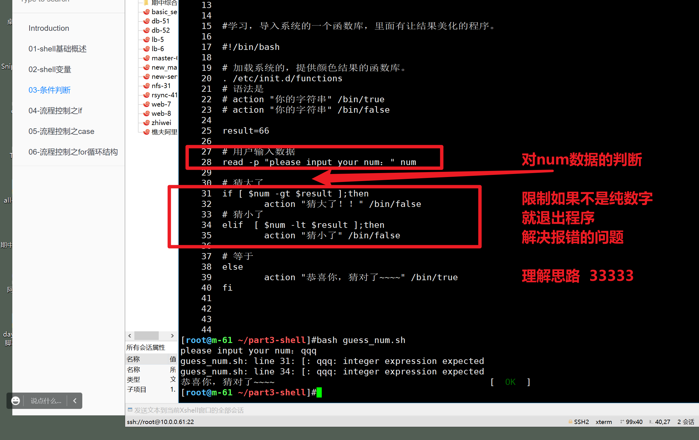

```### 此资源由 58学课资源站 收集整理 ###
	想要获取完整课件资料 请访问：58xueke.com
	百万资源 畅享学习

```
# 条件判断语法


```
你可以没事翻一翻，

# 你想看看优质的脚本应该怎么写，如何模仿写
# 找出系统中的shell脚本
find / -name '*.sh'
# 看一看人家是如何定义变量，使用位置参数，使用read命令
# 今天你要学，系统自带，如何高质量的使用条件判读语句的。

```


# 0.学前预览


-

> 这是linux内置的network脚本，我给大家分析了一波，
>
> 让你理解，还没学条件判断语句之前，如果你不会用，就去借鉴，系统自带脚本如何写的。


# 条件测试整体概览


# 1.基于文件进行条件判断

```
如下的参数，主要是基于文件来判断
填写文件的路径来判断

```


## 常用参数

| 参数 | 解释                             | 举例            |
| ---- | -------------------------------- | --------------- |
| -e   | 文件或目录存在就是true           | [ -e filepath ] |
| -s   | 文件存在且只要有一个字母就是true | [ -s filepath ] |
| -f   | 文件存在且是普通文件类型就是true | [ -f filepath ] |
| -d   | 文件存在且是目录类型就是true     | [ -d filepath ] |
| -r   | 文件存在且有read权限就是true     | [ -r filepath ] |
| -w   | 文件存在且有write权限就是true    | [ -w filepath ] |
| -x   | 文件存在且有x权限就是true        | [ -x filepath ] |


## 更多参数

做好笔记即可，看来回来查查

```bash
test 命令最短的定义可能是评估一个表达式；如果条件为真，则返回一个 0 值。如果表达式不为真，则返回一个大于 0 的值 — 也可以将其称为假值。检查最后所执行命令的状态的最简便方法是使用 $? 值。

参数：

1. 关于某个文件名的『类型』侦测(存在与否)，如 test -e filename 

-e 该『文件名』是否存在？(常用) 
-f 该『文件名』是否为文件(file)？(常用) 
-d 该『文件名』是否为目录(directory)？(常用) 
-b 该『文件名』是否为一个 block device 装置？ 
-c 该『文件名』是否为一个 character device 装置？ 
-S 该『文件名』是否为一个 Socket 文件？ 
-p 该『文件名』是否为一个 FIFO (pipe) 文件？ 
-L 该『文件名』是否为一个连结档？ 

2. 关于文件的权限侦测，如 test -r filename 

-r 侦测该文件名是否具有『可读』的属性？ 
-w 侦测该文件名是否具有『可写』的属性？ 
-x 侦测该文件名是否具有『可执行』的属性？ 
-u 侦测该文件名是否具有『SUID』的属性？ 
-g 侦测该文件名是否具有『SGID』的属性？ 
-k 侦测该文件名是否具有『Sticky bit』的属性？ 
-s 侦测该文件名是否为『非空白文件』？ 

3. 两个文件之间的比较，如： test file1 -nt file2 

-nt (newer than)判断 file1 是否比 file2 新 
-ot (older than)判断 file1 是否比 file2 旧 
-ef 判断 file2 与 file2 是否为同一文件，可用在判断 hard link 的判定上。 主要意义在判定，两个文件是否均指向同一个 inode 哩！ 

4. 关于两个整数之间的判定，例如 test n1 -eq n2 

-eq 两数值相等 (equal) 
-ne 两数值不等 (not equal) 
-gt n1 大于 n2 (greater than) 
-lt n1 小于 n2 (less than) 
-ge n1 大于等于 n2 (greater than or equal) 
-le n1 小于等于 n2 (less than or equal) 

5. 判定字符串的数据 

test -z string 判定字符串是否为 0 ？若 string 为空字符串，则为 true 
test -n string 判定字符串是否非为 0 ？若 string 为空字符串，则为 false。
注： -n 亦可省略 
test str1 = str2 判定 str1 是否等于 str2 ，若相等，则回传 true 
test str1 != str2 判定 str1 是否不等于 str2 ，若相等，则回传 false 

6. 多重条件判定，例如： test -r filename -a -x filename 

-a (and)两状况同时成立！例如 test -r file -a -x file，则 file 同时具有 r 与 x 权限时，才回传 true。 
-o (or)两状况任何一个成立！例如 test -r file -o -x file，则 file 具有 r 或 x 权限时，就可回传 true。 
! 反相状态，如 test ! -x file ，当 file 不具有 x 时，回传 true
```


## 结合test命令

```
条件判断的用法，有俩语法形式

1.   中括号
# 前面是条件判断语句，得到true 或false的结果，后面可以加上具体的命令操作
[ -f /etc/hosts  ] && cat /etc/hosts

2. test命令

test  -f /etc/hosts && cat /etc/hosts
```

在系统内置脚本中，找找这俩语法的身影，以及如何用的


```
test -f
[ 条件测试 ]

都是常见的用法，都能看懂会用即可。

```


```
看脚本，阅读他人的优秀代码，也是增长编程见识的方案之一。

```


## 测试常用条件参数

````
具体使用场景，例如 ansible的配置文件
[root@m-61 ~]#
[root@m-61 ~]#[ -f /etc/ansible/hosts  ] && ansible all -m ping  ^C
[root@m-61 ~]#
[root@m-61 ~]#
[root@m-61 ~]## 脚本开发，逻辑，加一条，例如主机清单文件不存在，ansible则不该执行
[root@m-61 ~]#
[root@m-61 ~]#[ -f /etc/ansible/hosts  ] && ansible all -m ping  ^C
[root@m-61 ~]#
[root@m-61 ~]#
[root@m-61 ~]#mv /etc/ansible/ansible.cfg{,.bak} ^C
[root@m-61 ~]#
[root@m-61 ~]#
[root@m-61 ~]#
[root@m-61 ~]#mv /etc/ansible/hosts{,.bak}
[root@m-61 ~]#
[root@m-61 ~]#
[root@m-61 ~]#[ -f /etc/ansible/hosts  ] && ansible all -m ping   # yes or no?
[root@m-61 ~]#
[root@m-61 ~]#
[root@m-61 ~]## 理解该使用场景的条件测试，刷3333
[root@m-61 ~]#


````


# 2.基于整数判断

条件语法

```
-eq 两数值相等 (equal) 
-ne 两数值不等 (not equal) 
-gt n1 大于 n2 (greater than) 
-lt n1 小于 n2 (less than) 
-ge n1 大于等于 n2 (greater than or equal) 
-le n1 小于等于 n2 (less than or equal)


```


## 案例


### 猜数字比大小

这种脚本，都可以从read交互式接收数据，和位置参数接收数据，两种角度去开发。


```
系统中生成了一个数字

1. 程序让你输入一个数字

程序根据输入和 数字进行大小比对，作不同的逻辑判断


#!/bin/bash
# 结果
result=66
# 用户输入数据
read -p "please input your num：" num

# 条件大小比对
# 你先想好了，会有几种条件，大于，等于，小于，多少条件，对应了多少代码


# if基础语法

if  [ 条件1 ];then
	成立执行 1
elif  [ 条件2 ];then
	成立执行 2
elif [ 条件3 ];then
	成立执行 3

else
	隐藏条件，无须写了，直接进入这里执行代码
fi


```


具体代码

```bash
#!/bin/bash
# 结果

result=66

# 用户输入数据
read -p "please input your num：" num

# 猜大了
if [ $num -gt $result ];then
	echo "猜大了"
# 猜小了
elif  [ $num -lt $result ];then
	echo "猜小了"

# 等于
else
	echo "恭喜你，猜对啦！！"
fi


 
```

这里最基本的，完成了3个条件判断，学会分析，如何定义条件，定义多少个条件，

以及条件中要做什么事。

看懂刷33333

### 该脚本需要优化的地方很多，后面会给足你机会写出完善的猜数字脚本


```
这里先别着急去琢磨 加功能，简单的玩懂了，关于数字的条件判断即可。
```


### 比较数字大小，美化结果

```bash
学习，导入系统的一个函数库，里面有让结果美化的程序。

#!/bin/bash

# 加载系统的，提供颜色结果的函数库。
. /etc/init.d/functions
# 语法是 
# action "你的字符串" /bin/true
# action "你的字符串" /bin/false

result=66

# 用户输入数据
read -p "please input your num：" num

# 猜大了
if [ $num -gt $result ];then
	action "猜大了！！" /bin/false
# 猜小了
elif  [ $num -lt $result ];then
	action "猜小了" /bin/false
# 等于
else
	action "恭喜你，猜对了~~~~" /bin/true
fi


 

```

```
[root@m-61 ~/part3-shell]#
[root@m-61 ~/part3-shell]#bash guess_num.sh 
please input your num：44
猜小了                                                     [FAILED]
[root@m-61 ~/part3-shell]#
[root@m-61 ~/part3-shell]#
[root@m-61 ~/part3-shell]#bash guess_num.sh 
please input your num：77
猜大了！！                                                 [FAILED]
[root@m-61 ~/part3-shell]#
[root@m-61 ~/part3-shell]#
[root@m-61 ~/part3-shell]#bash guess_num.sh
please input your num：66
恭喜你，猜对了~~~~                                         [  OK  ]
[root@m-61 ~/part3-shell]## 把这个功能，用在你开发的 nginx启动管理脚本中。看懂用法，刷 777
[root@m-61 ~/part3-shell]#
[root@m-61 ~/part3-shell]#


```

### 小结

```
1. 学习条件测试的几大类 ，文件测试，数字测试，字符串测试，的参数不同
2. 猜数字小脚本开发，以及优化的思路讲解
3. 美化程序结果的 加载系统库
```


## 对你刚才猜数字程序的优化思路




> 问题来了，如何对这个num数据，判断是纯数字呢？（shell这里输入的数据 288，也是当做字符串处理）
>
> 1.利用正则表达式，利用三剑客，对数据进行 数字的校验（方案，写法有很多，建议大家自己都能额外的想出一个）
>
> grep
>
> sed
>
> awk
>
> 正则表达式的千变万化的写法
>
> N种办法，解决这个需求，大致理解开发思路，刷7777
>
> 老师讲了一个办法，正则用法，你就只记住这一个，自己不去想另一个办法，这是不行的兄弟。
>
> 换一个场景，正则还得你自己写，你傻了。


### 判断用户输入是否是整数


---


---


---

### 为什么会出现bug的情况

不怕写bug，要会发现，bug且优化，才是真的玩懂了。


### 正确的姿势是？正则的校验用户输入为整数的猜大小脚本


```
学生的解释回答
# 提示  -z 字符串为空，条件就成立，为true
#  超哥解释：
# 利用sed匹配连续的纯数字一直到结尾
# 如果是纯整数，则必然会打印出数据，字符串就有内容 -z  条件不成立
# 如果是非整数，sed就不会打印任何内容，字符串就为空， -z 成立，导致执行echo，提示用户必须要输出纯整数。


if [ -z "$(echo $num|sed -rn '/^[0-9]+$/p')"  ];then
      echo "请输入纯数字整数！程序结束" && exit
fi

请解释，为什么这条语句，可以正确处理，空字符串，非数字
试试完整的解释一下
用你自己的语言解释下

超哥等待答案中。。。。。。waiting。。。。
========================================================================
一起来看大家的回答， 是否对
一起分析，解释语法，看你到底自己是否，明确正确答案，可以判断出错误的说法。
强化练习。


对 扣 1 ，不对扣2


王仁刚（写法本人说 错。）
sed对变量进行过滤，过滤出非数字的字符串，然后-z对结果判断，是否有内容 

王秉诚( 1  )
使用sed进行对数字匹配，若为数字-z匹配为非空，不执行echo 

刘永飞（ 不够太精确，但是大体是对的  1 ）
sed过滤去以连续数字开头并以数字结尾打印出来的结果交给-z判断 

杨松麟 （ 2 ）
Sed对num变量过滤（要细，打印），然后p打印出来，再交给-z判断 ，说的很好，等于没说。

ㅤㅤ代 （  1 ）
打印出$num的变量值，sed显示出以0-9开头，匹配多次，并以数字结尾的，打印出来。 

-z对于打印出来的结果判断是否为空字符串。
如果为空字符串，则echo并exit，如果不为空，则继续向下匹配。


赵阳阳 ( 1.5 )
正则的解释对不对（ 1 ）
sed过滤去以连续数字开头并以数字结尾打印出来的结果交给-z判断 
 
张鑫 （  1.5 等于没说  ）
通过正则去判断输入数据是否匹配，-z去判断，如果输入为非连续数字字符串则则输出echo并退出

2112130009李文杰 （  1.5 友情分  ）
判断变量的值是否为空，sed打印出以多个连续数字的结果，如果为空，则exit退出 

叶小爷 （ 1  ）
在变量中匹配一次或多次以任意一个数字开头幷以数字结尾的数据，将这个过滤出的数据交给-z参数进行判断，这个数据是否为空。如果为空，则打印下面这段话并退出程序 
```


### 开发思路


---


```

方案1.
if [ -z "$(echo $your_num|sed -rn '/^[0-9]+$/p')"  ];then
   		echo "请输入纯数字整数！"
    	continue
fi


方案2，这个写法，还是不合适，有bug的，作为开发思路参考学习
无法处理空字符串，只能处理除了数字以外的字符

# 正则过滤出连续的非数字
# 这个写法是，除了数字以外，都会被过滤到

check_res=$(echo $num|grep -E '[^0-9]+'|wc -l)

# 只要为零，表示是纯数字
[ $check_res -eq 0 ] && echo -e "输入整数正确，输入结果是：\033[43;30m ${num} \033[0m" || echo  -e "我真是服了，让你输入的是数字！！，你输入的 \033[43;30m ${num} \033[0m 这是什么玩意？"
EOF


```


### 判断位置参数个数

针对脚本的bug继续优化。

猜大小猜数字的脚本。

```bash
#学习，导入系统的一个函数库，里面有让结果美化的程序。

#!/bin/bash

# 加载系统的，提供颜色结果的函数库。
# 1.颜色的优化
. /etc/init.d/functions
# 语法是 
# action "你的字符串" /bin/true
# action "你的字符串" /bin/false

result=66

# 3. 在脚本运行时，开头就限制，不得输入位置参数，这里用不到
# 练习条件判断，对数字的判断

# 对特殊变量 $# 可以统计位置参数个数
[ "${#}"  -ne 0 ] && echo "不得传入位置参数！！" && exit

# 作业里头也有让你基于位置参数做条件判断，使用test 或  [  ] 对位置参数的判断


# 这里的逻辑是，只要你输入无用的参数，后面都不执行了，直接exit退出
#  看懂用法刷 77777


# 用户输入数据
read -p "please input your num：" num


# 对输入进行数字校验，只有数纯数字，整数，才符合这个计算器的逻辑
# 2. 对输入的数据，进行整数校验
if [ -z "$(echo $num|sed -rn '/^[0-9]+$/p')"  ];then
      echo "请输入纯数字整数！程序结束" && exit
fi


# 猜大了
if [ $num -gt $result ];then
        action "猜大了！！" /bin/false
# 猜小了
elif  [ $num -lt $result ];then
        action "猜小了" /bin/false

# 等于
else
        action "恭喜你，猜对了~~~~" /bin/true
fi


```


### 判断用户的密码是否符合6位

在各种游戏中，设置二级密码，必须是6位。

练习对整数变量的判断

```
思路就是，对用户输入的密码字符串，字符个数来判断长度

#!/bin/bash
# 基于位置参数，传入密码
echo "您输入的二级密码是：$1"
# 判断非6位的话，就提示用户重新输入。

# 能否看懂这里的逻辑判断符号的使用，看懂3333，不懂444

# 当你用-eq表示 密码正好等于6，因此，后面这个 || 或的条件就不执行了
# 条件A 失败  ||   条件B才执行
# 条件A 成立  &&  条件B才执行

# 判断 用户输入正好是  -eq 等于6，因此就不执行后面的
[ $1  -eq 6 ] || echo "二级密码必须是6位！！，重新输入"

# 判断用户输入 不等于6 ，因此改成了&& 表示递进
#  这次能看懂刷 6666
[ $1  -ne 6 ] && echo "二级密码必须是6位！！，重新输入"


```

具体代码如下

```bash
#!/bin/bash
echo "您输入的二级密码是：$1"

# 如何判断用户输入的数据字符个数呢？
# 方案1，利用wc -L 参数
len_vars=$(echo $1|wc -L)

# 如果不等于6 就报错
[ $len_vars -ne 6 ] && echo "密码必须是6位！！重新输入" && exit

# 后续的逻辑就不该执行了
echo "只有你输入正确的6位密码，才能看到我"


# 方案二、利用变量子串功能，统计变量值的长度（高级玩法，以后再说）
# 语法是 ${#变量名}


```

方案2代码

```bash
#!/bin/bash
echo "您输入的二级密码是：$1"

# 如何判断用户输入的数据字符个数呢？
# 方案1，利用wc -L 参数
len_vars=$(echo $1|wc -L)
# 如果不等于6 就报错
# 方案1，利用wc -L 作用统计字符个数
#[ $len_vars -ne 6 ] && echo "密码必须是6位！！重新输入" && exit

# 方案2，利用变量子串统计字符个数
[ ${#1} -ne 6 ] && echo "密码必须是6位！！重新输入" && exit


# 后续的逻辑就不该执行了
echo "~~~~~~只有你输入正确的6位密码，才能看到我~~~~"

```


## 额外需求

优化二级密码，改为只能是6位整数密码。


# 3.基于字符串判断


语法

| 参数 | 解释                   | 案例             |
| ---- | ---------------------- | ---------------- |
| ==   | 两边值相等为true       | [ "$a" == "$b" ] |
| !=   | 两边值不等为true       | [ "$a" != "$b" ] |
| -z   | 字符串为空时为true     | [ -z "$a" ]      |
| -n   | 字符串内容不为空为true | [ -n "$a" ]      |
| =    | 同 == 作用一样         | [ "$a" = "$b" ]  |

```
字符串1    符号  字符串2 
```


```
具体用什么符号，你自己作为运维，写脚本，写你自己轻易能看懂，便于理解的脚本，
别为难自己。。。

-z
 -z STRING
              the length of STRING is zero（当字符串长度为零，为true，为真）


-n   
-n STRING
              the length of STRING is nonzero（非零的时候为true）
[root@m-61 ~/part3-shell]#[ -n  "" ] && hostname
[root@m-61 ~/part3-shell]#
[root@m-61 ~/part3-shell]#
[root@m-61 ~/part3-shell]#[ -n  "1" ] && hostname
m-61
[root@m-61 ~/part3-shell]#
[root@m-61 ~/part3-shell]#[ -n  " " ] && hostname
m-61
[root@m-61 ~/part3-shell]#
[root@m-61 ~/part3-shell]## -n 参数 非零时为true，递进执行后面的命令，否则 为空字符串，false，看懂3333[root@m-61 ~/part3-shell]#
[root@m-61 ~/part3-shell]#


具体案例


你记住一个就行了
[root@m-61 ~/part3-shell]#
[root@m-61 ~/part3-shell]#man test
[root@m-61 ~/part3-shell]#
[root@m-61 ~/part3-shell]#
[root@m-61 ~/part3-shell]#
[root@m-61 ~/part3-shell]#[ -z ""  ] && hostname
m-61
[root@m-61 ~/part3-shell]#
[root@m-61 ~/part3-shell]#
[root@m-61 ~/part3-shell]#[ -z " "  ] && hostname
[root@m-61 ~/part3-shell]#
[root@m-61 ~/part3-shell]#
[root@m-61 ~/part3-shell]#echo "" |wc -L
0
[root@m-61 ~/part3-shell]#echo " " |wc -L
1
[root@m-61 ~/part3-shell]#
[root@m-61 ~/part3-shell]#
[root@m-61 ~/part3-shell]## 看懂什么叫 字符串length长度，以及wc -L 用法，以及-z 和-n 的用法，刷666
[root@m-61 ~/part3-shell]#
[root@m-61 ~/part3-shell]#


```


## 系统自带脚本参考


## 练习

简单等于、不等于符号

```
纯值


变量的值

[root@m-61 ~/part3-shell]#s1=77
[root@m-61 ~/part3-shell]#
[root@m-61 ~/part3-shell]#s2=88
[root@m-61 ~/part3-shell]#
[root@m-61 ~/part3-shell]#
[root@m-61 ~/part3-shell]#
[root@m-61 ~/part3-shell]#[ $s1 != $s2  ] && echo yes || echo no 
yes
[root@m-61 ~/part3-shell]#
[root@m-61 ~/part3-shell]#
[root@m-61 ~/part3-shell]#[ $s1 = $s2  ] && echo yes || echo no 
no


```


条件参数-z和-n相反测试

```
```


## 模拟开发登录程序

接收用户输入，和密码文件对比，判断是否登录成功。

```bash
# 简单的登录程序，你是写死的数据，和用户的输入做校验
# 考察你的字符串的条件判断用法
# v1初级版本，先完成基本功能
# v2版本可以考虑可能存在的bug隐患，不断优化


cat >user_login.sh<<'EOF'
read -p "please input username：" username
read -p "please input pwd：" password

#  字符串值的 == 相等判断符号
# 逻辑参数 -a  and的意思，-a 两边都true，条件测试语句都是true，否则都不成立
# 要求账户、密码，都对得上了，都是true
# 整个登录逻辑，才是true，才提示登录成功
# 这个解释，看懂6666

[ $username == "linux0224" -a $password == "666666" ] && echo "登录成功" || echo "账号密码错误" 
EOF

```


# 4. 逻辑操作符

```
-a	左右两边条件同时为真时，为true	[ 6 -eq 6 -a 8 -gt 3 ]
-o	左右两边条件有一个为真，就为true	[ 1 -gt 1 -o 2 -eq 2 ]
!	结果取反
```


练习题


# 今日作业

```
1. 整理条件判断中涉及的参数，还是比较多的，做好学习笔记，自己动手，写小案例，测一测
- 文件的判断参数
- 数字的判断参数
- 字符串的判断参数
- 逻辑操作符  -a -o  !

2. 完成课堂上讲解的练习 

3. 周末预习if篇的博客，完成博客中所有的代码练习题。

http://ebook-p3.apecome.com/04-%E6%B5%81%E7%A8%8B%E6%8E%A7%E5%88%B6%E4%B9%8Bif.html#47-%E7%B3%BB%E7%BB%9F%E6%9C%8D%E5%8A%A1%E7%AE%A1%E7%90%86%E8%84%9A%E6%9C%AC

```


- 先学懂语法，先别去琢磨要解决一些具体的需求
- 在你学懂基本语法之后，遇见实际需求，才能有思路解决
- 结合后续的if、for、while、case等语句的学习，练习题会不断增多
- 回头给你整个脚本50道，让你写个够。😄


