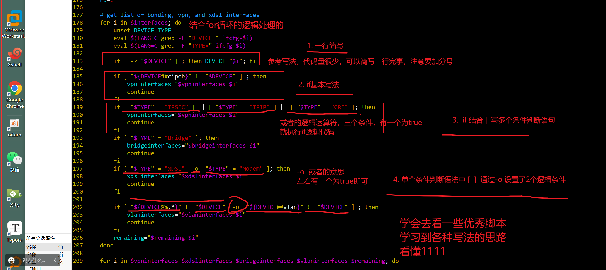
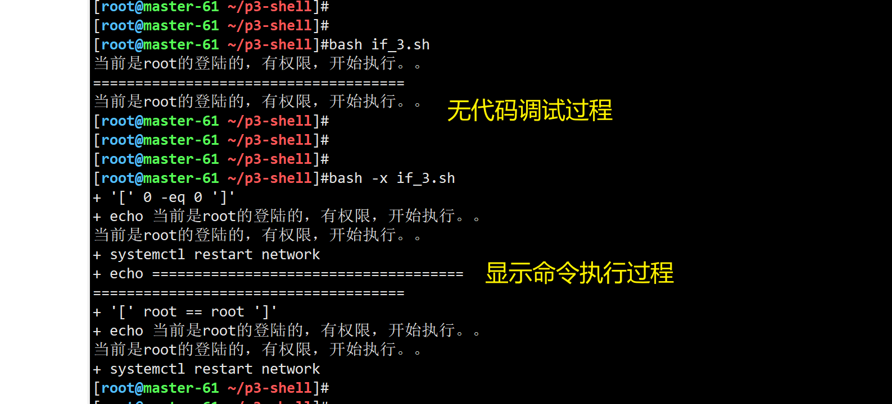
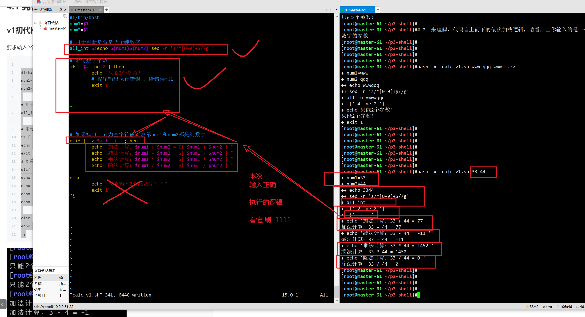

```### 此资源由 58学课资源站 收集整理 ###
	想要获取完整课件资料 请访问：58xueke.com
	百万资源 畅享学习

```
# 美好的一天开始了


伪代码

从中文代码，理解英文代码的 执行逻辑

if语句的写法

单分支的if语法写法，两种风格


```bash
风格1
# 分号是shell的命令分隔符
if [ 你有八分像吴彦祖 ];then
       当条件成立，执行这里的代码逻辑
       出门在外男孩子要保护自己
fi

echo "差不多就行了"


风格2


if [ 你是女孩子 ]
then
        男人的嘴，骗人的鬼，女孩子在外要保护好自己
fi


```


## 系统自带的if写法





又学到了一个玩法


## 小练习

给脚本传入2个位置参数，比较其是否相等的if判断

```bash
cat > if_1.sh <<'EOF'
#!/bin/bash


if [ "$1" -eq "$2" ];then
    echo "相等"
fi


EOF
```


代码运行

```
cat > if_1.sh <<'EOF'
#!/bin/bash


if [ "$1" -eq "$2" ];then
    echo "相等"
fi


EOF


调试过程

cat > if_1.sh <<'EOF'
#!/bin/bash


if [ "$1" -eq "$2" ];then
    echo "相等"
fi


EOF
```


## 猜数字小游戏

```
cat > if_2.sh<<'EOF'
if [ $1 -eq $2 ];then
    echo "相等"
else 
    echo "不相等"
fi
EOF


```

执行过程

```
cat > if_2.sh<<'EOF'
if [ $1 -eq $2 ];then
    echo "相等"
else 
    echo "不相等"
fi
EOF


```


> 判断当前系统登陆的用户，是否是超级用户，是则执行某些命令，不是则提示用户要先sudo

```bash

#!/bin/bash
# 基于uid和uid=0，基于用户名，和 root
# 友情提醒，shell的变量，提取值，最精确，最不会出现任何歧义的写法，如下
# 在你写一个非常严谨的脚本的时候，建议你，所有的字符串，变量边界符都给加上，是最严谨的，不踩坑
# "$@"  "$*"  加引号和不加引号，作用是完全不一样的。。。


# 方案1

if  [ "${UID}" -eq 0  ];then
	echo  "当前是root的登陆的，有权限，开始执行。。"
	systemctl restart network
else
	# 否则你就不超级用户呗，
	echo "兄弟，请你加上sudo可以吗。"
fi


# 方案2
if  [ "${USER}" == "root"  ];then
	echo  "当前是root的登陆的，有权限，开始执行。。"
	systemctl restart network
else
	# 否则你就不超级用户呗，
	echo "兄弟，请你加上sudo可以吗。"
fi


	
```





```
if
elif
else

以及if条件外的代码，逻辑捋了捋


```


## 图解如何阅读系统内置shell脚本的if代码逻辑嵌套


```
这个写法，就是将if，else，fi条件语句，进行多次使用，多次嵌套，
处理具体的业务问题，技术问题
比如 判断某进程是否存在，则xxxxx

关于nginx脚本的伪代码逻辑

1.最外曾的判断，测试nginx的进程是否存在，如果不存在，pid文件读取内容为空，则告诉运维，nginx挂了
脚本要立即重启nginx
2.  继续嵌套if判断，如果 nginx重启失败了  [ $? -ne 0]  
又要xxxx
否则就是正确启动了，echo 显示nginx重启成功，打印一下当前nginx 的pid，确保的确是启动正确。、。


看懂if嵌套的使用场景，伪代码逻辑的，刷33333 学一个思路

先又思路后，再转化为代码逻辑即可。


```


# 多条件if

```bash
伪代码
# 第一个条件，如果成立后，执行
if [ 帅似吴彦祖 ];then
        echo "男孩子在外要保护好自己！！"
  # 如果第一个条件不成立，继续向后判断
elif [ 胖似金三胖 ];then
		# 执行这里
        echo "嫌弃我胖？给我打！！"
      # 又不帅，又不胖，当所有的if条件都不成立，执行else
else
        echo "你是什么玩意，凭啥对我指指点点"
fi


# 能看懂 ，if，elif，else的执行，编写逻辑，刷1111


```


## 猜大小脚本

```bash
cat > if_3.sh <<'EOF'
if [ $1 -eq $2 ];then
    echo "两数相等"
elif [ $1 -gt $2 ];then
    echo "$1 大于 $2 "
else
    echo "$1 小于 $2 "
fi
EOF

```


## 计算机多版本迭代开发，v1版本，基本实现加减乘除功能

```bash
#!/bin/bash
num1=$1
num2=$2

# 用于判断是否是两个纯数字 
all_int=$(echo ${num1}${num2}|sed -r 's#[0-9]+##g')

# 限定数字个数
if [ $# -ne 2 ];then
echo "只能2个参数！"
exit
# 如果$all_int为空字符串，表示num1和num2都是纯数字
elif [ -z $all_int ];then
echo "加法计算：$num1 + $num2 = $[ $num1 + $num2 ] "
echo "减法计算：$num1 - $num2 = $[ $num1 - $num2 ] "
echo "乘法计算：$num1 * $num2 = $[ $num1 * $num2 ] "
echo "除法计算：$num1 / $num2 = $[ $num1 / $num2 ] "

else
echo "只能输入2个纯数字！！"
fi
```


代码逻辑讲解





## v2版本

```
拿到这个计算器的开发需求

1. 计算器，至少，只能输入 的是纯数字，对数字校验可以是第一步的校验工作
2. 对数字的数量进行限制，v2版本，计算符号是写死的，让用户输入2个数据即可。数据的参数个数，校验

3. 满足，是纯数字，且正好是2个数字，即可进入下一步正确的计算器逻辑。

这3点需求分析，看懂11111
这个需求分析，也就是你在拿到需求后，一步步的开发思路参考。

吧这3点，逐步的开发，写成脚本完事。

写法不唯一，理解后，自己将你的想法，转变为代码即可，最终的效果，得一样。


```


这个脚本改一下也行

```bash
#!/bin/bash
num1=$1
num2=$2

# 1. 先校验参数个数，拿到具体的参数后，再去校验是否是数字，来的更合理


# 限定数字个数，不对也结束
if [ $# -ne 2 ];then
    echo "只能2个参数！"
    # 程序输出执行错误 ，给错误码1
    exit 1
fi

# 用于判断是否是两个纯数字 ，至少要是数字，这个要求更优先
all_int=$(echo ${num1}${num2}|sed -r 's/^[0-9]+$//g')
if [ ! -z "$all_int" ];then
        echo "只能输入纯数字"
        exit 1
fi


# 如果$all_int为空字符串，表示num1和num2都是纯数字

if [ -z $all_int ];then
        echo "加法计算：$num1 + $num2 = $[ num1 + num2 ] "
        echo "减法计算：$num1 - $num2 = $[ num1 - num2 ] "
        echo "乘法计算：$num1 * $num2 = $[ num1 * num2 ] "
        echo "除法计算：$num1 / $num2 = $[ num1 / num2 ] "
fi


```

测试执行下

```
[root@master-61 ~/p3-shell]#
[root@master-61 ~/p3-shell]## 1,情况1，参数数量不合规
[root@master-61 ~/p3-shell]#
[root@master-61 ~/p3-shell]#bash calc_v1.sh 
只能2个参数！
[root@master-61 ~/p3-shell]#
[root@master-61 ~/p3-shell]#
[root@master-61 ~/p3-shell]#
[root@master-61 ~/p3-shell]## 2.情况2，参数个数合规了，继续向后撇皮
[root@master-61 ~/p3-shell]#


[root@master-61 ~/p3-shell]## 看懂这俩，情况1，和情况2的递进逻辑关系，刷3333
[root@master-61 ~/p3-shell]#
[root@master-61 ~/p3-shell]#
[root@master-61 ~/p3-shell]#
[root@master-61 ~/p3-shell]#
[root@master-61 ~/p3-shell]#
[root@master-61 ~/p3-shell]#bash   calc_v1.sh qqq 123
只能输入纯数字
[root@master-61 ~/p3-shell]#
[root@master-61 ~/p3-shell]#
[root@master-61 ~/p3-shell]#bash   calc_v1.sh q123 123
只能输入纯数字
[root@master-61 ~/p3-shell]#
[root@master-61 ~/p3-shell]#bash   calc_v1.sh 123 123
加法计算：123 + 123 = 246 
减法计算：123 - 123 = 0 
乘法计算：123 * 123 = 15129 
除法计算：123 / 123 = 1 
[root@master-61 ~/p3-shell]#
[root@master-61 ~/p3-shell]#
[root@master-61 ~/p3-shell]#
[root@master-61 ~/p3-shell]## 这回学会了脚本开发的需求分析，以及代码加载逻辑分析，改进，的玩法，刷666
[root@master-61 ~/p3-shell]#
[root@master-61 ~/p3-shell]## 一个靠谱的脚本，是需要不断打磨的。
[root@master-61 ~/p3-shell]#


```


## 计算器v3版本优化（计算器更新了，支持让用户选择运算符号了）

关于程序的更新迭代，每一个软件都是这样，谁都再初期，考虑到所有场景，根据后续的使用，不断的优化，修复bug，添加新功能。

具体的对大项目的版本优化，后期学习git版本控制工具，微信就是用的这个工具。


需求新增，产品经理又给你甩需求了，导致你又得加班

```
优化功能(模拟后端开发的，需求接入，需求开发，运维写脚本，基本是自己给自己定需求，写脚本)
我就比较佛西，v1版本凑后用，系统不挂我不改。。这个也。。不太合适。

1. 用read接收用户输入，更像计算器
2. 提供符号菜单选择
3. 添加if条件判断


效果如下

# 主动思考，对数据数字校验
请输入第一个数字： 8
请输入第二个数字： 2

请选择运算符：
1. +
2. - 
3. *
4. /

请输入您的选择： 1

计算结果：
8 + 2 = 10


```

最终实现脚本

```bash
#!/bin/bash
read -p "请输入第一个数字：" num1
read -p "请输入第二个数字：" num2
echo -e "请选择运算符：
1. +
2. -
3. *
4. /"

read -p "请选择运算符：" sign

# 计算器条件判断

if [ $sign == 1 ];then
        echo "$num1 + $num2 = $[ $num1 + $num2 ]"
elif [ $sign == 2 ];then
        echo "$num1 - $num2 = $[ $num1 - $Num2 ] "
elif [ $sign == 3 ];then
        echo "$num1 * $num2 = $[ $num1 * $num2 ]"
elif [ $sign == 4 ];then
        echo "$num1 / $num2 = $[ $num1 / $num2 ]"
else
    echo "只能输入1到4的选项"
fi

```


```
执行过程
支持选择运算符号，餐单选择的玩法

#!/bin/bash
read -p "请输入第一个数字：" num1
read -p "请输入第二个数字：" num2
echo -e "请选择运算符：
1. +
2. -
3. *
4. /"

read -p "请选择运算符：" sign

# 计算器条件判断

if [ $sign == 1 ];then
        echo "$num1 + $num2 = $[ $num1 + $num2 ]"
elif [ $sign == 2 ];then
        echo "$num1 - $num2 = $[ $num1 - $num2 ] "
elif [ $sign == 3 ];then
        echo "$num1 * $num2 = $[ $num1 * $num2 ]"
elif [ $sign == 4 ];then
        echo "$num1 / $num2 = $[ $num1 / $num2 ]"
else
    echo "只能输入1到4的选项"
fi


```


## 计算器的v4版本，数据校验优化

```
如何对程序优化，你只需要站在用户角度，且以一个大傻子的状态，去用这个程序
反其道而行，把bug找出来，且优化


```


```bash
# 完成上述3个程序的功能点

#!/bin/bash

#1. 禁止输入位置参数
[ "$#" -ne 0  ]  && echo "无需传入位置参数！！再见！" && exit 1


read -p "请输入第一个数字：" num1
# 不是纯数字就直接结束
#  -z 判断字符串如果为空，就表示是纯数字
#  加上! 表示取反，如果最终结

# 对输入1，数字校验
if [ ! -z $(echo ${num1}|sed -r 's#^[0-9]+$##g') ];then
    echo "请输入纯数字整数！"
    exit 1
fi


# 对数字2，数字校验
read -p "请输入第二个数字：" num2
if [ ! -z $(echo ${num2}|sed -r 's#^[0-9]+$##g') ];then
    echo "请输入纯数字整数！"
    exit 1
fi

# 打印菜单

echo -e "请选择运算符：
1. +
2. -
3. *
4. /"

# 对菜单符号进行校验

read -p "请选择运算符：" sign

if [ ! -z $(echo ${sign}|sed -r 's#^[1-4]$##g') ];then
    echo "只能输入1 ~ 4的序号！"
    exit 1
fi


# 计算器条件判断
# 一层层的校验，到这里，就确保输入的是2个数字，以及菜单的选择，也是对的。

if [ $sign == 1 ];then
        echo "$num1 + $num2 = $[ $num1 + $num2 ]"
elif [ $sign == 2 ];then
        echo "$num1 - $num2 = $[ $num1 - $Num2 ] "
elif [ $sign == 3 ];then
        echo "$num1 * $num2 = $[ $num1 * $num2 ]"
elif [ $sign == 4 ];then
        echo "$num1 / $num2 = $[ $num1 / $num2 ]"
else
    echo "只能输入1到4的选项"
fi
```


#### 基于grep的数据校验写法

```bash
# 这种写法，纯属让你去给自己找难题，为了理解一些比较绕的，比较难理解的写法
# 加深自己对shell语法的认识
# 你在具体解决问题的时候，如果写代码钻进了死胡同，可以考虑，调个头，换一个办法呢？是不是可以
# 亮总分享了一个grep的写法，非常nice
# 你自己就应该思考出，除了课程以外的写法，sed，grep，awk

#if [ ! -z $(echo ${num1}|sed -r 's#^[0-9]+$##g') ] || [ ! $num1 ] ;then
#    echo "请输入纯数字整数！"
#    exit 1
#fi


# grep写法
# 如此写法，直接就实现了，只提取纯数字，非数字以外的字符，空，都被找出来了
# 你就应该，自己思考出更合适的办法，去解决问题，理解刷33333

if [ -z $(echo ${num1}   |grep -E '^[0-9]+$' )   ] ;then
        echo "只能输入纯数字！！"
        exit 1
fi


# 对数字2，数字校验
read -p "请输入第二个数字：" num2
if [ ! -z $(echo ${num2}|sed -r 's#^[0-9]+$##g') ] || [ ! $num1  ]  ;then
    echo "请输入纯数字整数！"
    exit 1
fi

# 打印菜单

echo -e "请选择运算符：
1. +
2. -
3. *
4. /"

# 对菜单符号进行校验

read -p "请选择运算符：" sign

if [ ! -z $(echo ${sign}|sed -r 's#^[1-4]$##g') ];then
    echo "只能输入1 ~ 4的序号！"
    exit 1
fi


# 计算器条件判断
# 一层层的校验，到这里，就确保输入的是2个数字，以及菜单的选择，也是对的。

if [ $sign == 1 ];then
        echo "$num1 + $num2 = $[ $num1 + $num2 ]"
elif [ $sign == 2 ];then
        echo "$num1 - $num2 = $[ $num1 - $Num2 ] "
elif [ $sign == 3 ];then
        echo "$num1 * $num2 = $[ $num1 * $num2 ]"
elif [ $sign == 4 ];then
        echo "$num1 / $num2 = $[ $num1 / $num2 ]"
else
    echo "只能输入1到4的选项"
fi
~                                                                                                                                                                    
~                                                                                                                                                                    
~                                         
```


#### 让你改为awk写法，会不会了？

三剑客，肯定是运维的一个核心技能，拉开普通运维和自动化运维的一个利器。


## 继续练习if的条件判断

关于目录创建

```bash
#!/bin/bash

# -d 当该目录存在，则为真，则执行echo代码

if [ -d /backup/ ];then
    echo "该目录以存在，无需创建了"    # 1
else
	echo "该目录不存在，正在创建中"
    mkdir -p "/backup"  # 2
fi


```


执行

```
[root@master-61 ~/p3-shell]#
[root@master-61 ~/p3-shell]#
[root@master-61 ~/p3-shell]#
[root@master-61 ~/p3-shell]#cat if_dir.sh 
#!/bin/bash

# -d 当该目录存在，则为真，则执行echo代码

if [ -d /backup/ ];then
    echo "该目录以存在，无需创建了"    # 1
else
	echo "该目录不存在，正在创建中"
    mkdir -p "/backup"  # 2
fi
[root@master-61 ~/p3-shell]#
[root@master-61 ~/p3-shell]#
[root@master-61 ~/p3-shell]#
[root@master-61 ~/p3-shell]#bash if_dir.sh 
该目录不存在，正在创建中
[root@master-61 ~/p3-shell]#
[root@master-61 ~/p3-shell]#
[root@master-61 ~/p3-shell]#bash if_dir.sh 
该目录以存在，无需创建了
[root@master-61 ~/p3-shell]#bash if_dir.sh 
该目录以存在，无需创建了
[root@master-61 ~/p3-shell]#bash if_dir.sh 
该目录以存在，无需创建了
[root@master-61 ~/p3-shell]#bash if_dir.sh 
该目录以存在，无需创建了
[root@master-61 ~/p3-shell]#
[root@master-61 ~/p3-shell]## 看懂逻辑刷111
[root@master-61 ~/p3-shell]#

```


### 如果备份文件不存在，则自动创建

```bash
# 如果备份文件不存在自动创建

#!/bin/bash

if [ -e /backup/ ];then
    echo "目录以存在"
else
    mkdir -p "/backup"
fi
# 这里的条件判断，少了一个空格，报错了。
# 由于报错，没正确的进行条件判断
if [ -f /backup/all_log.tgz ];then
    echo "备份数据已存在"
else
    echo "备份文件中"
    # 写脚本，程序执行的日志，一般都不会再打印，要么丢弃，要么写入到文件做记录，利用重定向符号
    # 这句话，看懂刷333333
    tar -zcf /backup/all_log.tgz /var/log/  
fi
```

你得继续思考，关于备份文件，建议还是多份来的合适，如何优化这个代码？

```bash
# 如何优化？
# 你得继续思考，关于备份文件，建议还是多份来的合适，如何优化这个代码？
# 需求是，备份动作，不能断，每次执行，都生成新的备份数据，更可靠，磁盘又不值钱。
# 该如何写代码优化？请说出关键点，你的思路。
# MD5值没毛病，但是前提是，你的这些数据源发生了变化，md5值会变化
# 谜底就是，最常见的做法，就是添加时间，因为时间是不断再变化的，常用于各种脚本去添加时间戳。
# 如按天，按小时的，创建新目录等。


# 添加时间的备份文件记录


# 如果备份文件不存在自动创建
#!/bin/bash

# 获取当前时间戳
now=$(date +%F-%T)
# 程序中，容易变化的数据，都给封装为变量，便于维护代码
back_dir=/backup/

# 关于备份目录的判断
if [ -e $back_dir ];then
    echo "目录以存在"
else
    mkdir -p  $back_dir
fi

# 备份文件，且检查备份情况

tar -zcf ${back_dir}/all_log.tgz.${now}  /var/log/ &>/dev/null 2>&1
# 备份情况检查
if [ $?  -eq 0 ];then
        echo -e "备份成功，最新的备份数据如下\n$(ls ${back_dir})"
else
        echo "备份出错了！！！"
fi


```


## 4.3 程序运行检查脚本

写一个脚本，传递一个参数，即可检查该服务运行状态。

```bash
#!/bin/bash
# 限定只能检查一个服务
if [ $# -eq 1 ];then
    # 检查服务运行状态
    systemctl status $1 &>/dev/null
    # 通过命令结果判断
    if [ $? -eq 0 ];then
        echo "$1 服务运行中"
    else
        echo "$1 服务挂了！！"
    fi
# 否则提示用户正确参数用法
else
    # 提示用户正确语法
    echo "usage：bash $0 service_name"
    # 程序退出
    exit
fi

```


## 采集服务器资源信息且判断


```bash
#!/bin/bash
# 获取当前时间，精准统计
now=$(date +%F-%T)

# 提取内存使用率 free -m


# 具体写法，内存统计
# 写程序，先自己去执行具体的命令，拿到结果，调试好后，再写入脚本

mem_used=$(free -m | awk '/Mem/{used=$3/$2;print used*100}'|sed -r  's#\..*##g')

# 不写注释，回头看自己写代码，也得重新读一遍。。。缕一缕逻辑。。
# 写了注释，中文，看一眼就哦了

# 拿到内存使用率进行比较
# 判断当内存使用百分比，大于等于85%就报警
# 由于不太好测试，吧数据，改小点
if [ $mem_used -ge 2 ];then
    # 警告信息，写入到文件中
    #  root:时间:内存使用率  
    echo "${USER}:${now}:内存使用率 ${mem_used}% " > /tmp/mem_used.log
    # 给自己发个邮件
    # mail -s "内存警告！！！"  
fi

# 内存的提取，以及if判断，逻辑看懂刷1111，以及日志记录


# 根目录磁盘使用率
# 这里是采集根分区的使用率
# 先统计出现有的使用率，超过85%之后，报警
disk_used=$(df -h |grep '/$' | awk '{print $5}' |sed 's#%##g')
# 条件判断
# 判断根分区磁盘使用率，超过85%就告警
if [ $disk_used -ge 2 ];then
    echo "${USER}:${now}:磁盘使用率 ${disk_used}% 请尽快修复。" >> /tmp/disk_used.log
fi

# 磁盘使用率的采集逻辑，看懂刷 1111 


# cpu使用率
# 通过top命令 查看cpu整体情况，查看%Cpus行的信息，查看idle行，表示当前有多少百分比的空闲cpu。
#cpu_used=$(top -n 1|awk -F '[, %]+' 'NR==3 {print 100-$12}'|sed -r  's#\..*##g')
cpu_used=$(sar -u 1 1|awk 'NR==5{print 100-$NF}'|sed -r  's#\..*##g' )

if [ $cpu_used -ge 3 ];then
        echo "${USER}:${now}:cpu使用率 ${cpu_used}% 请尽快修复。" >> /tmp/cpu_used.log

fi


# cpu使用率的采集命令，以及if判断语法，会玩 刷 33333


```


## 猜成绩脚本

```
1. 练习if、elif、else fi 这个脚本

需求：

让用户输入自己的成绩，  read 


根据read输入的数据，多条件判断

1. 分数在0 ~ 59 不及格，需要补考
2. 分数在 60 ~ 85 属于良好
3. 分数在86 ~ 100 属于优秀

如果你要考虑到多种场景，也就是优化的点，

v1版本基本完成需求即可（用户能站在你的角度，完全按照你的要求去输入，确保正确按要求输入，程序是没问题）

v2 版本，（考虑到用户会输入错误的情况，如输入数字，缺输入了字母，异常处理，数据校验）

v3 更多的功能优化了。。
理念能理解刷3333

v4
靠你自己，写N行代码后，再去琢磨优化吧，靠你自己的理解，经验去优化的程序。


```


v2版本改进版

```bash
#!/bin/bash

if [ $# != 0  ];then
    echo "本脚本无须传入参数！！"
    exit
else
    # 可恨的产品经理，陈亮亮，提出了新需求，当用户输入 多个数据？如何处理。
    read -p "请输入你的成绩：" score
    if [ -z $score ];then
        echo "大哥，你好歹输入点东西吧！！滚粗！"
        exit
    fi

    # 成绩数字判断，如果能替换为空字符串，证明就是纯数字，输入正确
    all_int=$(echo "$score"|sed -r 's#[0-9]+##g')
    # 非空字符串的话，就表示非纯数字
    if [ -n "$all_int" ];then
            echo "请输入纯数字！！"
            exit
    # 具体用 -gt  -lt 还是  用 -ge  -le 要看你自己的逻辑了
    elif [ $score -ge 0 ] && [ $score -le 59 ];then
        echo "平时少玩点游戏兄弟，回去等通知吧，建议多看看于超老师的课程 www.yuchaoit.cn"
    elif [ $score -ge 60 ] && [ $score -le 85 ];then
        echo "考得不错，下次继续努力"
    elif [ $score -ge 86 ] && [ $score -le 100 ];then
        echo "大佬，带带弟弟"
    else
        echo "分数只能在0~100。。。别瞎整！！"
    exit
    fi
fi

```


##  系统服务管理脚本

> 核心还是练习，if，elif，else的玩法
>
> 

```bash
#!/bin/bash

source /etc/init.d/functions

read -p "请输入你要查询的服务名：" services_name

# 查询结果记录
rpm -qa $services_name > /tmp/status_install.log
# -s 限制文件存在且有内容才为true
if [ ! -s /tmp/status_install.log ];then
    echo "$services_name 该服务未安装！！"
    exit
fi

# 否则该服务就是存在的
echo -e "请选择执行的步骤：\n1.start\n2.stop\n3.restart\n4.status"

read -p "请输入你的选择序号：" num

if [ $num -eq 1 ];then
        systemctl start $services_name > /dev/null 2>&1
        # 异常处理
        [ $? -eq 0 ] && action "$services_name 启动成功" /bin/true || action "$services_name 启动失败" /bin/false

elif [ $num -eq 2 ];then
    systemctl stop $services_name > /dev/null 2>&1
    [ $? -eq 0 ] && action "$services_name 停止成功" /bin/true || action "$services_name 停止失败" /bin/false

elif [ $num -eq 3 ];then
    systemctl restart $services_name > /dev/null 2>&1
    [ $? -eq 0 ] && action "$services_name 重启成功" /bin/true || action "$services_name 重启失败" /bin/false

elif [ $num -eq 4 ];then
    systemctl status $services_name
    [ $? -eq 0 ] && action "$services_name 服务正常运行中" /bin/true || action "$services_name 服务未运行" /bin/false
else
    echo "请输入正确选项！！1 ~ 4"
fi
```


# 今日作业

> 前言，所有脚本务必手敲，别复制粘贴，只有手敲，你才会踩一堆坑，单词敲错了，语法忘了，你才能成长！！！


```
1. 完成课堂所讲的所有优化后的 脚本代码，跟着敲，理解语法细节，玩法

2. 开发复杂脚本，需求如下。


1. 猜数字
2. 根据选择安装不同的软件，可选【search，info，update、remove、install】
3. 系统优化脚本
- 根据用户选择，选择对应的yum源【阿里源，清华源】
- 关闭防火墙、selinux
- 时间同步写入定时任务
- 安装常用基础软件
- 修改主机名和IP地址


```


# 提交时间

> 今天估计做不完，明天继续，明天结合if+case，

> 以练为主，自己先思考，然后老师指导，辅助你自己去写程序，我辅助，把把MVP不是盖的。
>
> 产出你自己的专属脚本，输入了好几天shell，是时候你自己产出了，完成这几道题。

case是比if更合适的多条件判断玩法。


