```### 此资源由 58学课资源站 收集整理 ###
	想要获取完整课件资料 请访问：58xueke.com
	百万资源 畅享学习

```
# 昨日回顾

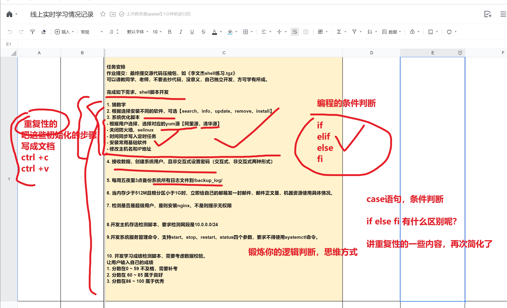


# 什么是case语句

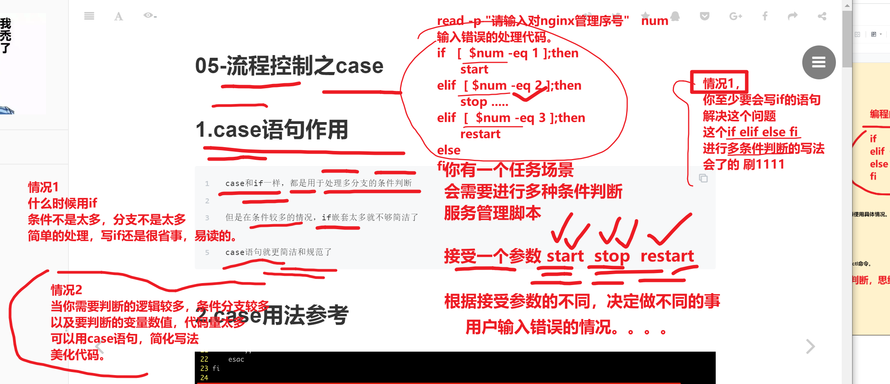


# case语句在自带脚本中的使用


```
1. 使用一个脚本开发场景

先试试用if去写，解决问题先，这是主要的。

工作搞定后，接下来半个月你没什么大事，就学学技术，优化下自己的代码

是不是可以用case语句优化下


```


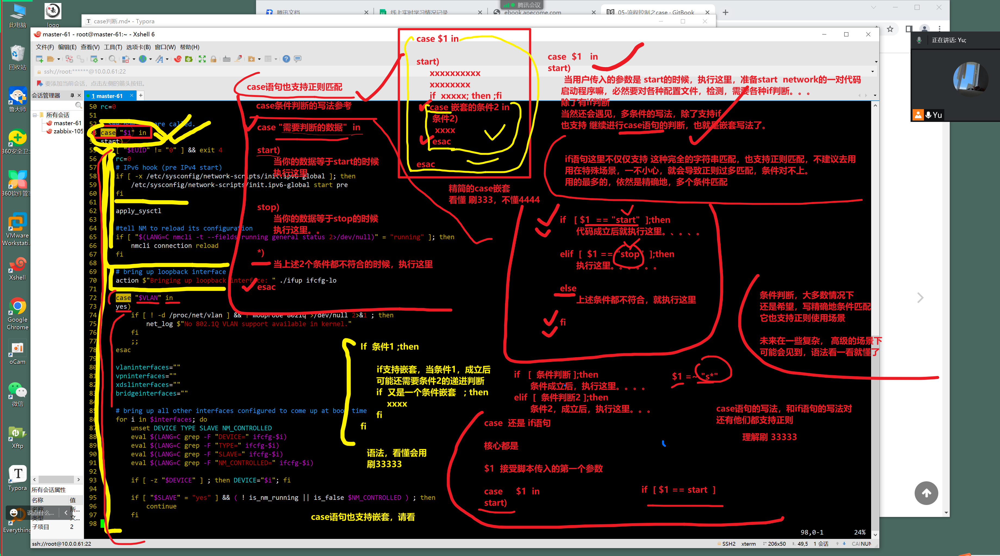


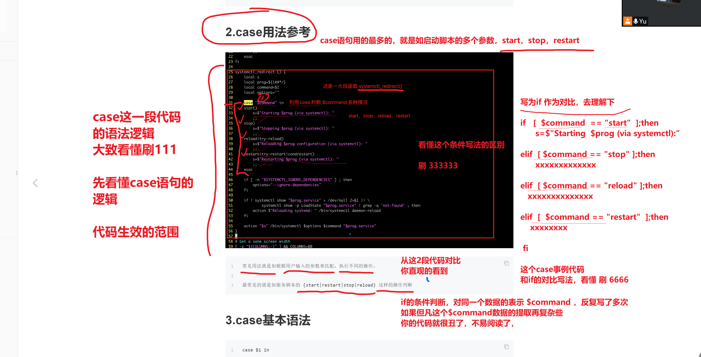


# case语法、用法

```bash

# 这个变量，被设置了3个精准匹配的条件
# 如果这3个条件都匹配不上，自动进入   *) 这个默认分支，执行对应的动作
# 结尾必须再写一个 esac表示这个语句结束了
# case语句，每一个条件的代码，写完后，必须写2个 ;;分号  表示这个逻辑块结束了

# shell代码是自上而下的依此加载，以换行，或者 闭合的代码，作为结束
# if    fi
# EOF  EOF
# 所有的括号，都必须闭合 ()  []  {}
# case     esac 闭合
# 这一段的语法解释，看懂刷 3333


case 需要判断的变量 in

条件1)
    command  ;;
条件2)
    command
    ;;
条件3)
    command
    ;;
)*
    command
    ;;
esac


```

## 简易版ATM脚本开发

if版本的

```bash
[root@master-61 ~/p3-shell]#cat case_atm.sh 
#!/bin/bash
echo -e "-------------linux0224版ATM机------------
a. 取钱
b. 存钱
c. 查余额
------------------------欢迎您的下次使用---------"


read -p "请输入您的选择："  num
# 输入a，$num的值就是a
# if写法   if   [ $num == "a"  ]


case "${num}"  in

#具体 case这里的条件写什么，看你自己的规则
# 对条件判断，确定执行什么命令

a)

	echo "您取走了10万块"  ;;

b)
	echo "您输入的是b选项，存钱，成功存入了50万"
	;;

c)
	echo "口袋里还剩下五毛钱，还查什么查？"
	;;

*)
	echo "大哥，你别乱输入好吗，菜单里不是提示，只能输入 a b c 吗？？"
        # echo "case语句比起if要牛掰的多了，if语句写死了  [ $num  == "a"  ] 当字符串为空，这个值判断的符号，会报错
	# 但是case语句就不会报错，你只要输出除了 a ，b，c三个字母意外的任意内容，都会被 *) 捕捉到，非常好用
	;;

#别忘记写esac
esac

```


## 利用case开发计算器（希望足够的完善，bug少一些）

需求分析

```
需求（也是开发脚本的功能思路，在你很熟练语法之后，你看到这样的需求，心中应该理解想到，用哪些shell脚本的语法即可完成。）

1. 交互式接收用户输入的数字，计算符号
2. 判断用户输入的参数是否是3个
3. 判断用户输入的是否是纯数字整数
4. 判断用户输入的计算符号是否是 加减乘除
5. 如果用户输入错误，友好提示用户正确输入的语法
6. 如果输入错误，程序无须结束，循环重来让用户输入（循环知识点，以后做）
7. 重复性的代码，封装为函数（以后做）
```

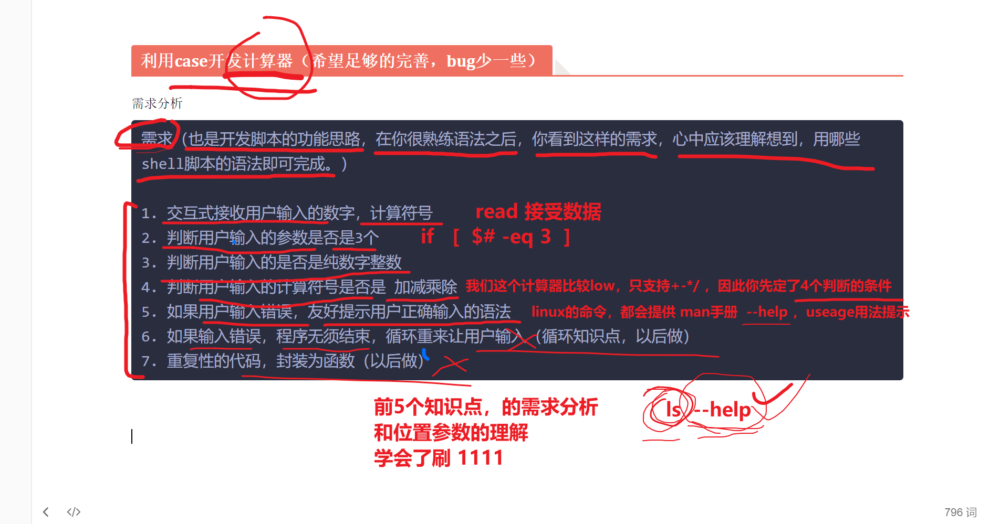


```bash
#!/bin/bash

# 接受2个数据，read命令，切分别做好数据校验
echo -e "==========欢迎使用0224版计算器======"


read -p "请输入第一个数字：" num1
# 下一步的学习思路，校验数字的代码，反复会被调用，是可以被封装为函数，多次执行的
# 先写伪代码，先写中文，就跟你写作文似的，否则直接开整代码，你可能会晕
# 先把你的逻辑，用中文写好，再转化为代码，就容易多了
# 利用grep过滤，只要是纯数字，就能拿到数据，字符串就有内容，反之，就不是纯数字
# 如果输入得不是纯数字，程序就结束
# 该用什么参数写在这,对字符串数据进行判断

# -z 当字符串为空时就为真

# 这里的代码，时希望，条件为真，然后执行退出程序的命令

# 这个逻辑对 刷1，不对刷2

if [  -z  $(echo $num1 | grep -E "^[0-9]+$")];then
	echo "只能输入，纯数字！！！程序结束！！"
	exit 1
fi 


```

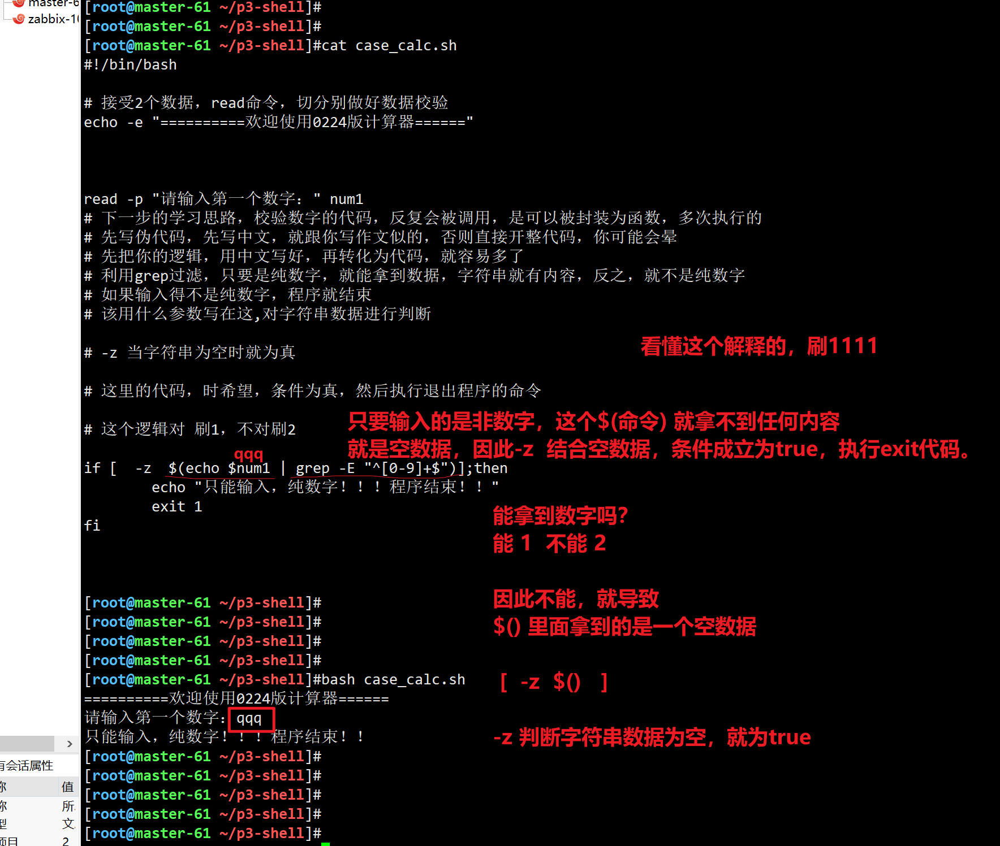

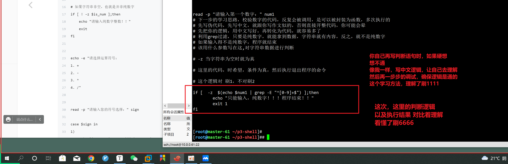


```
[root@master-61 ~/p3-shell]#cat  case_calc.sh 
#!/bin/bash

# 接受2个数据，read命令，切分别做好数据校验
echo -e "==========欢迎使用0224版计算器======"


read -p "请输入第一个数字：" num1
# 下一步的学习思路，校验数字的代码，反复会被调用，是可以被封装为函数，多次执行的
# 先写伪代码，先写中文，就跟你写作文似的，否则直接开整代码，你可能会晕
# 先把你的逻辑，用中文写好，再转化为代码，就容易多了
# 利用grep过滤，只要是纯数字，就能拿到数据，字符串就有内容，反之，就不是纯数字
# 如果输入得不是纯数字，程序就结束
# 该用什么参数写在这,对字符串数据进行判断

# -z 当字符串为空时就为真

# 这里的代码，时希望，条件为真，然后执行退出程序的命令

# 这个逻辑对 刷1，不对刷2

if [  -z  $(echo $num1 | grep -E "^[0-9]+$") ];then
	echo "只能输入，纯数字！！！程序结束！！"
	exit 1
fi 

# 输入第二个数字
read -p "请输入第二个数字："  num2

if [  -z  $(echo $num2 | grep -E "^[0-9]+$") ];then
        echo "只能输入，纯数字！！！程序结束！！"
        exit 1
fi


# 开始计算器的逻辑了

#打印一个计算符号的菜单

echo -e "请输入计算符号：
+. 加法
-. 减法
×. 乘法
÷. 除法
"


# 既然条件对应关系，设立好了，下一步，给予这个条件判断，去写规则就好了

read -p "请您输入对应的计算符号："  sign

# 条件匹配

#  这里的条件判断，我是设定了 + - × ÷ ，这些符号，需要用户精确输入，方可匹配
# 但是符号，不太好识别，容易出错
# 建议还是用 
#  1. +   2. -  3. /   4.  ×    ，让用户输入 1,2,3,4的选项，更直接，不易出错
# 理解了，给刷 777
# 这里的写法，是等于让大家，看到另一种玩法，对case的条件判断，有了更多认识

case $sign in

+)
  echo "$num1 + $num2 = $[ $num1 + $num2 ]"
    ;; 

-)
   echo "$num1 - $num2 = $(( $num1 - $num2 ))"
    ;;
×)
   echo "$num1 * $num2 = $(( $num1 * $num2 ))"
    ;;
÷)

    echo "$num1 / $num2 = $(( $num1 / $num2 ))"
    ;;

*)

  echo "Usage：只能输入 + - × ÷ ，四个符号之一"
  ;;
esac


# 目前这个代码逻辑，能看懂，理解刷 111，不一定对，还没测
# 这个写法，思路，看懂刷1111 


```


11.15继续


## case也是支持正则的，用于如下场景

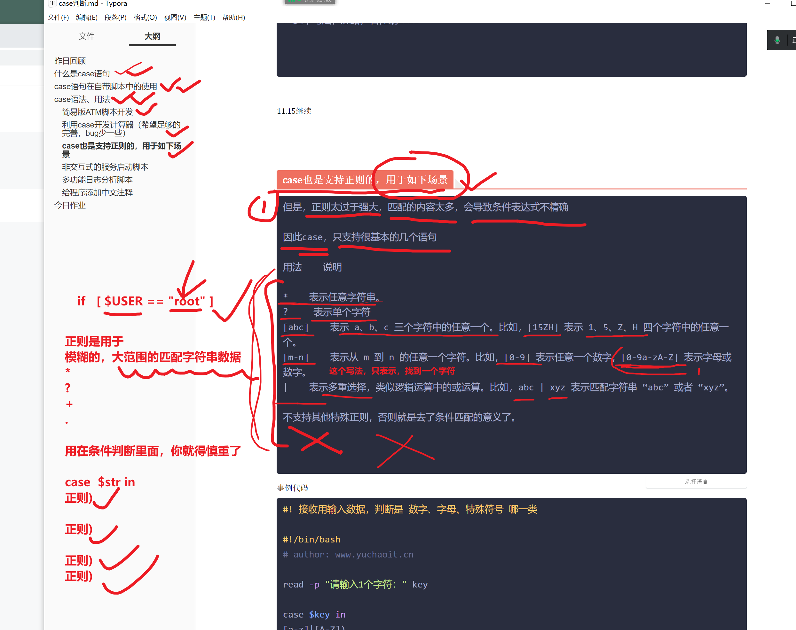


```
但是，正则太过于强大，匹配的内容太多，会导致条件表达式不精确

因此case，只支持很基本的几个语句

用法    说明

*    表示任意字符串。
？    表示单个字符
[abc]    表示 a、b、c 三个字符中的任意一个。比如，[15ZH] 表示 1、5、Z、H 四个字符中的任意一个。
[m-n]    表示从 m 到 n 的任意一个字符。比如，[0-9] 表示任意一个数字，[0-9a-zA-Z] 表示字母或数字。
|    表示多重选择，类似逻辑运算中的或运算。比如，abc | xyz 表示匹配字符串 “abc” 或者 “xyz”。

不支持其他特殊正则，否则就是去了条件匹配的意义了。


```

事例代码

```bash
#  case的正则条件，去判断，接收用输入数据
# 当这个判断会分几大类的时候，可以使用正则，判断是 数字、字母、特殊符号 哪一>类

#!/bin/bash
# author: www.yuchaoit.cn


read -p "请输入字符：" key


case $key in
# 任意一个小写字母，或者一个大写字母
[a-z]|[A-Z])
    echo "是字母哦~~"
    ;;
# 任意一个数字
[0-9])
    echo "是数字哦~~~"
    ;;
# [yu?]  写在中括号里面，表示只拿一个字符
# 改为如下

yu?)
        echo "您本次输入的字符是：$key"
        ;;
?)
        echo "您输入的是任意一个字符：$key"
        ;;

*)
    echo "您输入的是字母、数字以外的特殊字符~~~"
    ;;
esac


```


# 测试结果

```bash
[root@master-61 ~/p3-shell]#
[root@master-61 ~/p3-shell]##  1. 测单个字母
[root@master-61 ~/p3-shell]#
[root@master-61 ~/p3-shell]#bash re_case.sh 
请输入字符：e
是字母哦~~
[root@master-61 ~/p3-shell]#bash re_case.sh 
请输入字符：P
是字母哦~~
[root@master-61 ~/p3-shell]#
[root@master-61 ~/p3-shell]#bash re_case.sh 
请输入字符：P6
您输入的是字母、数字以外的特殊字符~~~
[root@master-61 ~/p3-shell]#
[root@master-61 ~/p3-shell]#
[root@master-61 ~/p3-shell]## 2. 测单个的数字
[root@master-61 ~/p3-shell]#
[root@master-61 ~/p3-shell]#bash re_case.sh 
请输入字符：7
是数字哦~~~
[root@master-61 ~/p3-shell]#bash re_case.sh 
请输入字符：77
您输入的是字母、数字以外的特殊字符~~~
[root@master-61 ~/p3-shell]#bash re_case.sh 
请输入字符：7d
您输入的是字母、数字以外的特殊字符~~~


测试  yu?的条件
[root@master-61 ~/p3-shell]#
[root@master-61 ~/p3-shell]#bash re_case.sh 
请输入字符：yuu
您本次输入的字符是：yuu
[root@master-61 ~/p3-shell]#
[root@master-61 ~/p3-shell]#bash re_case.sh 
请输入字符：yu!
您本次输入的字符是：yu!
[root@master-61 ~/p3-shell]#
[root@master-61 ~/p3-shell]#
[root@master-61 ~/p3-shell]#bash re_case.sh 
请输入字符：yu@@
您输入的是字母、数字以外的特殊字符~~~
[root@master-61 ~/p3-shell]#
[root@master-61 ~/p3-shell]#
[root@master-61 ~/p3-shell]#
[root@master-61 ~/p3-shell]#
[root@master-61 ~/p3-shell]#
[root@master-61 ~/p3-shell]#
[root@master-61 ~/p3-shell]#
[root@master-61 ~/p3-shell]#
[root@master-61 ~/p3-shell]#bash re_case.sh 
请输入字符：yu+
您本次输入的字符是：yu+


```


## 非交互式的服务启动脚本

```
# 需求，使用case开发非交互的服务管理脚本，添加颜色状态功能

# 具体开发思路，可以参考systemctl是如何帮你管理程序的即可。

# 这里的脚本，等于是管理nginx的脚本，一个服务单独一个脚本即可。

# 思路
1. 如果你的脚本是调用systemctl 去start、stop、restart程序，那还好说，你的这个脚本有通用性

systemctl对每一个服务的管理，都是单个得脚本
运维  > bash  service_manager.sh  nginx > systemctl >  nginx.service
 
运维  > bash  service_manager.sh  mysql > systemctl >  mysql.service

照这个逻辑来，你要开发服务管理脚本，建议还是一个脚本，只管理一个服务

# nginx_case.sh
# 这一段逻辑讲解，理解了刷 666


case $1 in 

start)
    /usr/bin/nginx -c /etc/nginx/nginx.conf 
    ;;

stop)
	kill -09 $(cat /var/run/nginx.pid)
	;;

restart)
	kill -09 $(cat /var/run/nginx.pid)
	/usr/bin/nginx
	
	;;


```

具体实例代码

```bash
#!/bin/bash
source /etc/init.d/functions

your_service=$1
case $your_service in
start)
        echo "${your_service} 启动中"
        sleep 1
        nginx
        if [ $? -eq 0 ];then
            action "${your_service} 启动成功" /bin/true
        else
            action "${your_service} 启动失败" /bin/false
        fi
        ;;
stop)
    echo "${your_service} 停止中"
    sleep 1
    nginx -s stop
    if [ $? -eq 0 ];then
        action "${your_service} 以停止" /bin/true
    else
        action "${your_service} 停止报错！！" /bin/false
    fi
    ;;

restart)
    echo "${your_service} 重启中"
    nginx -s stop
    sleep 1
    nginx
    if [ $? -eq 0 ];then
        action "nginx 重启成功" /bin/true
    else
        action "nginx 重启失败" /bin/false
    fi
    ;;
reload)
    nginx -s reload
    if [ $? -eq 0 ];then
        action "nginx正在重新加载" /bin/true
    else
        action "nginx 重新载入失败" /bin/false
    fi
    ;;
check)
    echo "检测 ${your_service}  语法中"
    nginx -t
    ;;
status)
    echo "检查 ${your_service} 运行状态中"
    if [ ! -f "/run/nginx.pid" ];then
        echo "nginx未运行！！"
    else 
        echo "nginx运行中！进程id是$(cat /run/nginx.pid)"
    fi
;;
*)
    echo "用法错误，正确用法是：{start|stop|restart|reload|check}"
esac

```

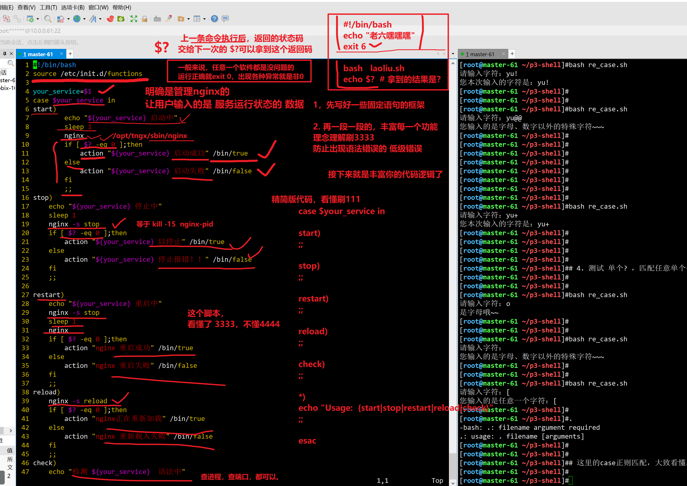


```
1. case写计算器

2. case支持正则的玩法

3. 非交互式服务管理脚本
```


## 多功能日志分析脚本

```
需求
# 按要求分析nginx的日志

# 打印功能选择菜单

1. 显示当前机器信息
2. 查询pv，uv
3. 显示访问量最高的ip，以及访问次数
4. 显示访问最频繁的业务url，最频繁的页面
5. 显示各种搜索引擎爬虫访问本站的次数
6. 显示都有哪些客户端访问了本网站


```

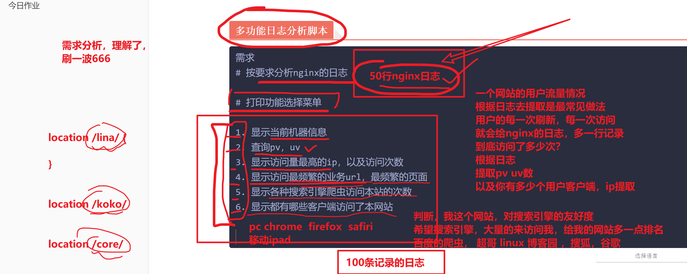

```bash
关于网站的访问量 专有名词

nginx作为优秀的网站服务器，通过日志提取用户访问行为是最合适的了

pv，page view，表示页面浏览量，点击量，用户刷新一次，就是一个pv，也就是一个请求，一次页面浏览，因此只作为网站的一个总览访问总体访问量（基于请求方法字段提取pv）

uv ，表示unique visitor，指的是同一个客户端发出的请求，只被计算一次，基于去重后的客户端ip作为独立访客。（基于remote_addr提取 uv）


```


```bash
#!/bin/bash

echo -e "------------
------日志分析系统，功能菜单------
1. 显示当前机器信息
2. 查询pv，uv
3. 显示访问量最高的10个ip，以及访问次数
4. 显示访问最频繁的10个业务url，最频繁的页面
5. 显示各种搜索引擎爬虫访问本站的次数
6. 显示都有哪些客户端访问了本网站
-------------"

read -p "请输入您的选择：" num

case $num in 
1)
    echo -e "===========当前机器信息=======
    服务器名：$(hostname)
    服务器IP: $(hostname -I)
    当前系统时间：$(date +%T-%F)
    当前登录用户：$USER
    =========="
    ;;
2)
    echo -e "=========当前机器pv、uv统计数据======
        pv页面访问总量：$(awk '{print $6}' y-awk-nginx.log | wc -l)
        ========================================================================
        uv独立访客数量：$(awk '{print $1}' y-awk-nginx.log |sort |uniq -c |wc -l)
    "
    ;;
3)
    echo -e "=========访问量最高的10个IP，访问次数==============
    $(awk '{print $1}' y-awk-nginx.log |sort |uniq -c |sort -n -r |head -10)"
    ;;

4)
    echo -e "=======访问量最高的10个业务url，最频繁的页面=====
    $(awk '{print $7}' y-awk-nginx.log | sort | uniq -c |sort -rn |head -10)"
    ;;
5)
    echo -e "======显示各种搜索引擎爬虫访问本站的次数========
    # 就是你以后可能要针对请求日志中的爬虫信息，帮公司封禁恶意流量
    # 检测如 python，java，等客户端的来源，都是恶意爬虫
    # python注明的爬虫框架，requests，scrapy，在日志中提取该关键字，然后直接决绝即可
    # 当然客户端也会做反扒如伪造代理身份，伪造user-agent
    #因此，道高一尺，魔高一丈，再从访问频率上去限制吧。
    # 这里理解日志和业务的关系，刷6666
    
    百度爬虫访问次数：$(grep -Ei 'baiduspider' y-awk-nginx.log |wc -l)
    必应爬虫访问次数：$(grep -Ei 'bingbot' y-awk-nginx.log |wc -l)
    谷歌爬虫访问次数：$(grep -Ei 'googlebot' y-awk-nginx.log |wc -l)
    搜狗爬虫访问次数：$(grep -Ei 'sogou web spider*' y-awk-nginx.log |wc -l)
    易搜爬虫访问次数：$( grep -Ei 'yisou' y-awk-nginx.log |wc -l)
    "
    ;;
6)
    echo -e "========访问本网站的客户端种前10种是：==============
    $( awk '{print $12}' y-awk-nginx.log|sort |uniq -c |sort -rn |head -10)"
    ;;

*)
    echo "请按要求输入选项！！！谢谢！"
    ;;
esac
```


## 给程序添加中文注释


第四道题

```
给你一段代码，学会阅读

上班之后，一般都是先看代码，看机器架构，文档，环境，再一周内，加加班，

所思说，看代码，也是很重要的技能。

你要一行，一行的，给每一个命令，加注释，用中文解释。


```

```bash
#!/bin/bash

if grep -q 'source /opt/autoenv/activate.sh' ~/.bashrc; then
    echo -e "\033[31m 正在自动载入 python 环境 \033[0m"
else
    echo -e "\033[31m 不支持自动升级，请参考 http://docs.jumpserver.org/zh/docs/upgrade.html 手动升级 \033[0m"
    exit 0
fi

source ~/.bashrc

cd `dirname $0`/ && cd .. && ./jms stop

jumpserver_backup=/tmp/jumpserver_backup$(date -d "today" +"%Y%m%d_%H%M%S")
mkdir -p $jumpserver_backup
cp -r ./* $jumpserver_backup

echo -e "\033[31m 是否需要备份Jumpserver数据库 \033[0m"
stty erase ^H
read -p "确认备份请按Y，否则按其他键跳过备份 " a
if [ "$a" == y -o "$a" == Y ];then
    echo -e "\033[31m 正在备份数据库 \033[0m"
    echo -e "\033[31m 请手动输入数据库信息 \033[0m"
    read -p '请输入Jumpserver数据库ip:' DB_HOST
    read -p '请输入Jumpserver数据库端口:' DB_PORT
    read -p '请输入Jumpserver数据库名称:' DB_NAME
    read -p '请输入有权限导出数据库的用户:' DB_USER
    read -p '请输入该用户的密码:' DB_PASSWORD
    mysqldump -h$DB_HOST -P$DB_PORT -u$DB_USER -p$DB_PASSWORD $DB_NAME > /$jumpserver_backup/$DB_NAME$(date -d "today" +"%Y%m%d_%H%M%S").sql || {
        echo -e "\033[31m 备份数据库失败，请检查输入是否有误 \033[0m"
        exit 1
    }
    echo -e "\033[31m 备份数据库完成 \033[0m"
else
    echo -e "\033[31m 已取消备份数据库操作 \033[0m"
fi

git pull && pip install -r requirements/requirements.txt && cd utils && sh make_migrations.sh

cd .. && ./jms start all -d
echo -e "\033[31m 请检查jumpserver是否启动成功 \033[0m"
echo -e "\033[31m 备份文件存放于$jumpserver_backup目录 \033[0m"
stty erase ^?

exit 0

```

觉得难刷333，不难的刷444

大家都比较低调。我懂得，都是大佬，喜欢低调。


# 今日作业


```
将昨天的脚本开发，if写法，改造为case写法

1.开发系统服务管理命令，支持start、stop、restart、status四个参数，要求不得使用systemctl命令。


预习
下一篇的for循环


```


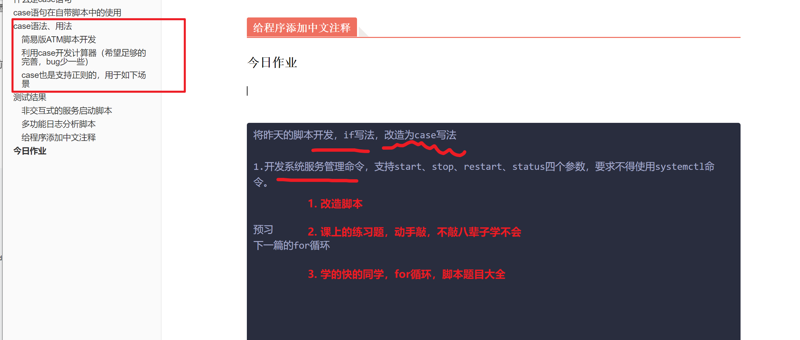


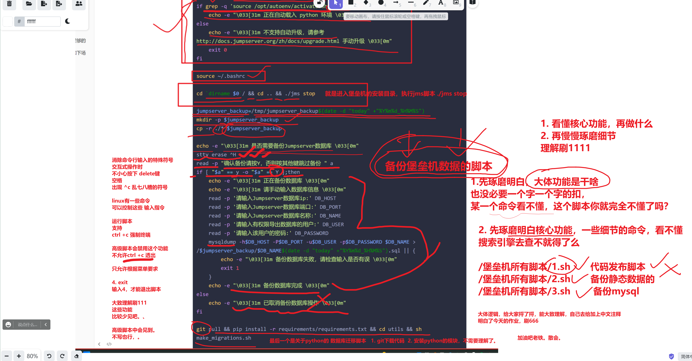


感谢老板送的小花。

下播了同志们。

88


