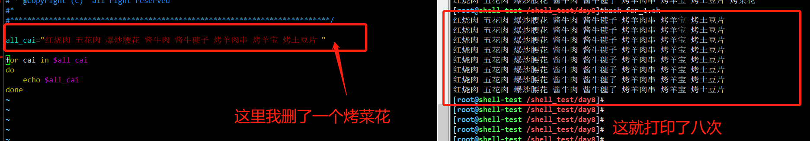

```### 此资源由 58学课资源站 收集整理 ###
	想要获取完整课件资料 请访问：58xueke.com
	百万资源 畅享学习

```
# 前言

```
如果说前面所学的
变量
条件判断
if 语句
case语句
是为了理解 脚本编程的 逻辑如何定义

那么真正实现批量化、自动化运维的核心，就是循环知识了。


```


一杯茶 一包烟 又是美好的学习的一天


```
计算器   
num1  =3 
num2  q

exit  回头，让用户重新输入，是不是来的更友好

xx
xxx
xxx
xx


服务管理脚本
bash  nginx.sh  start  stop 

一旦某一个逻辑出错，程序就直接自上而下，整体退出了


登录程序（网站，网银，支付宝  3次登录限制，7次登录限制）


需要对用户的输入进行判断，一旦输入的数据有问题，如果没有让程序继续执行，继续重新来过，让用户输入再次输入，这么一个循环操作的逻辑

你的代码只能 exit退出，让用户重新输入，给变量重新赋值。

理解刷1111


```


# for语句的语法

```bash
# 语法1
# shell的语句，判定代码的结束，一般是以换行符，和一些特殊的代码标识吗，作为头尾闭合


for 循环变量 in 取值列表
do
	循环要做什么事，执行什么命令
    每次循环要执行的命令
done


# 简单的打印，男儿当自强，50遍(for语句，用于有循环边界的场景，循环有结束的限制)

第一行的，for循环，定义循环变量，和  定义取值列表的范围，看懂111

for  man   in  {1..50}

for man in  $(seq 1 50)

# 简单的打印，男儿当自强，50遍(for语句，用于有循环边界的场景，循环有结束的限制)
# 看懂刷3333
for man in  `seq 1 50`
do
	 # echo "男儿当自强"  "当前的man变量值是：$man"
	 # 通过这个写法，理解循环变量，是循环的去 in 后面的取值列表中，获取每一个元素
	 echo "${man} 男儿当自强"
done

# for语句，如要要在shell中一行简写
# shell每一个独立的语句，要用分号隔开

for m in $(seq 50);do echo "$m 男儿当自强";done


for默认以，空格，分割独立的元素


for 语句的语法是

for 循环变量  in  取值列表范围（这个取值列表，元素，for是看到一个空格，就认为是一个元素了）


```


# for循环的使用场景

>for 循环变量  in  取值列表范围（这个取值列表，元素，for是看到一个空格，就认为是一个元素了）


多个单个的参数，需要被循环遍历

```bash
#!/bin/bash
for cai in "红烧肉" "酱牛肉" "烤羊肉串" "烤土豆片"
do
    echo "菜品：" $cai
done
```


```
[root@m-61 ~]##!/bin/bash
[root@m-61 ~]#for cai in "红烧肉" "酱牛肉" "烤羊肉串" "烤土豆片"
> do
>     echo "菜品：" $cai
> done
菜品： 红烧肉
菜品： 酱牛肉
菜品： 烤羊肉串
菜品： 烤土豆片

```


看坑1

```bash
[root@m-61 ~]## 请看如下写法，能打印几行数据
[root@m-61 ~]#
[root@m-61 ~]#
[root@m-61 ~]#for cai in 红烧肉 酱牛肉 烤羊肉串 烤土豆片  烤 茄子  香蕉 五花肉 ; do     echo "菜品：" $cai; done  # 请发弹幕，会打印几行数据？数一数  8 
菜品： 红烧肉
菜品： 酱牛肉
菜品： 烤羊肉串
菜品： 烤土豆片
菜品： 烤
菜品： 茄子
菜品： 香蕉
菜品： 五花肉
[root@m-61 ~]#
[root@m-61 ~]## 看懂刷  8888


```

再看坑2

```bash
#!/bin/bash
for cai in "红烧肉 五花肉 爆炒腰花" "酱牛肉 酱牛毽子" "烤羊肉串 烤羊宝" "烤土豆片 烤菜花" 
do
    echo "菜品：" $cai
done

# 请发弹幕，这个会打印几行数据？


```


# for从变量中取值

```bash
for i in 直接填写数据

for i in {1..50}


for 循环变量  in   取值变量名


#!/bin/bash

# 场景1，定义变量，以及变量的值，是一个大字符串，是一个单个的元素

all_cai="红烧肉 五花肉 爆炒腰花 酱牛肉 酱牛毽子 烤羊肉串 烤羊宝 烤土豆片 烤菜花"

# 这个变量的值，具体是你再脚本中写死的，还是动态获取的命令结果，就随意了

for cai in $all_cai
do 
    echo $cai
done


# for还可以如下玩法
# 和特殊变量结合，接受多个元素


# $@ 和 $*  

# 哪一个是能将元素区分开的    $@
# 哪一个是整合为大字符串的？  $*


for v in "$@"
do
	echo $v
done


```

执行结果

```bash
#!/bin/bash

# 场景1，定义变量，以及变量的值，是一个大字符串，是一个单个的元素

all_cai="红烧肉 五花肉 爆炒腰花 酱牛肉 酱牛毽子 烤羊肉串 烤羊宝 烤土豆片 烤菜花"

# 这个变量的值，具体是你再脚本中写死的，还是动态获取的命令结果，就随意了

# index 每一个元素
for i in $all_cai
do 
        # 再for循环体中，对这个变量的值，显示是
        # 红烧肉 五花肉 爆炒腰花 酱牛肉 酱牛毽子 烤羊肉串 烤羊宝 烤土豆片 烤菜花

        # for以空格，识别每一个单个的元素，进行打印
        # echo "循环拿到的这个变量值是：$all_cai"
        echo "i  result is :     $i"
done

```


## 练习2：需求：提取现有机器上PATH变量的每一个路径。

```perl
[root@m-61 ~/p3-shell]#echo $PATH

PATH="/usr/local/sbin:/usr/local/bin:/usr/sbin:/usr/bin:/root/bin"

想办法，改造为

PATH="/usr/local/sbin /usr/local/bin /usr/sbin /usr/bin /root/bin"

# 从上面的案例，for循环打印菜品，即可得知，for这里能取出每一个路径

理解这个方案的刷1111

# 三剑客中，谁可以替换字符串的数据？谁可以格式化打印？貌似都可以解决这个问题吧？

[root@m-61 ~/p3-shell]#echo $PATH | sed 's#:# #g'
/usr/local/sbin /usr/local/bin /usr/sbin /usr/bin /root/bin
[root@m-61 ~/p3-shell]#
[root@m-61 ~/p3-shell]#
[root@m-61 ~/p3-shell]## sed玩法，看懂刷1111


# awk呢？
[root@m-61 ~/p3-shell]#echo $PATH | awk -F ':' '{print $1,$2,$3,$4,$5}'
/usr/local/sbin /usr/local/bin /usr/sbin /usr/bin /root/bin


# 看懂用sed，awk，改造PATH变量的值显示，刷3333

# 得知可以改造数据后，就可以交给for去处理了

#!/bin/bash

new_path=$(echo $PATH | sed 's#:# #g')

echo "默认的PATH值是：$PATH"

for p in $new_path
do
	echo "PATH变量中的每一个路径是：$p"
done


```


执行结果

```
[root@m-61 ~/p3-shell]#bash for_2.sh 
默认的PATH值是：/usr/local/sbin:/usr/local/bin:/usr/sbin:/usr/bin:/root/bin
PATH变量中的每一个路径是：/usr/local/sbin
PATH变量中的每一个路径是：/usr/local/bin
PATH变量中的每一个路径是：/usr/sbin
PATH变量中的每一个路径是：/usr/bin
PATH变量中的每一个路径是：/root/bin
[root@m-61 ~/p3-shell]#
[root@m-61 ~/p3-shell]#
[root@m-61 ~/p3-shell]#
[root@m-61 ~/p3-shell]## 看懂for结合三剑客去构造数据形式，循环打印，取值的玩法刷 111
[root@m-61 ~/p3-shell]#
[root@m-61 ~/p3-shell]#
[root@m-61 ~/p3-shell]#

# 方案2
count=1

#设置新的分隔符
IFS=:
for i in $PATH
do
  echo "对应路径是#$count:$i"
  count=$[ $count + 1 ]
done


```

### 通过IFS修改for识别的元素分隔符

```bash
#!/bin/bash

# 场景1，定义变量，以及变量的值，是一个大字符串，是一个单个的元素

all_cai="红烧肉#五花肉#爆炒腰花#酱牛肉#酱牛毽子#烤羊肉串#烤羊宝#烤土豆片#烤菜花"


# 不建议去用。。了解即可，学一学花式用法吧


# 输入分隔符 修改为 # 类似于awk的内置变量 FS 修改awk的切割分隔符，一样的意思

# 大致理解，看懂刷 1111
# IFS 就是修改了for语句可识别的 元素分隔符

IFS="#"

# 默认的for以空格分隔元素
for i in $all_cai
do 
#       echo "for循环内，看到的变量值是：$all_cai"       
        echo $i
done
          

```


## 3.3 读取花括号序列

```
总结

1. for的基本语法，循环提取数据列表懂得语法，for是看到空格就识别为是一个元素
2. for 可以遍历如  $(seq 50)  ，
3. for也可以 遍历变量，  for i in $students_list

4. 当你需要重复N次，执行某些任务，可以很方便的使用 数字序列语法


```


```bash
#!/bin/bash
# 这里会打印多少行数据？


# 具体是多少行，要看这个序列产生多少数据
# 很多笔试题，会让你看代码
# 请看如下一段shell，请说出，结果变量，的数据是多少
# 细心，仔细看一看，

for num in {0..15}
do
	echo "循环的数字是：$num"
done


```

写法2，c语言风格，了解即可

```bash
#!/bin/bash
# for也集成了c语言的循环语法，如下
# 这个写法，一般也是用于，定义循环次数

for (( num=0;num<15;num++ ))
do
    echo "循环的数字是：${num}"
done
```


通过图解，能看懂这种 c语言风的for语法，以及执行结果刷1111


```
num++
写法就等于
num=num+1

# for先定 循环的次数是 0  ~  14
一共是打印多少次？
最终会打印多少行数据？

for (( num=0;num<15;num++  ))
do
	echo "孤勇者666"  
done


```


### for循环的次数计算

```bash
[root@m-61 ~/p3-shell]#
[root@m-61 ~/p3-shell]#cat for_4.sh 
#for num in {0..15}
#do
#	echo "循环的数字是：$num"
#done

# num=0  num++
# num=1 num++
# num=2 num++
# num=3 num++
# num=4 num++
# num=5  num++


# 打印 几行数据？
# 0 ~ 15 的打印 因此16行 
for ((num=0 ;num<=15;num++)) 
do
echo 当前循环的num值是$num
done
[root@m-61 ~/p3-shell]#


```


# for代码踩坑提问




```
这种情况貌似是自动去判断我这个all_cai有几个数据，然后打印几次？

1.为什么会打印9次

```


# awk和for循环

```
# 如何批量提取PATH变量中的每一个路径，给打印出来
[root@m-61 ~/p3-shell]#
[root@m-61 ~/p3-shell]#for p in $(echo $PATH|sed 's#:# #g');do  echo $p ;done
/usr/local/sbin
/usr/local/bin
/usr/sbin
/usr/bin
/root/bin
/t1
/t2
/t3
[root@m-61 ~/p3-shell]#
[root@m-61 ~/p3-shell]#
[root@m-61 ~/p3-shell]##sed玩法和for看懂刷 111


# 如何一次性打印出 /etc/passwd中，的前2行数据的，所有字段

```


## 练习题

```perl
# 练一练for和awk

1. 提取出/etc/passwd文件中，的前3行数据，以及要求打印，每一个字段（将冒号分隔符，改为空格）

# 这2种是awk的行号处理语法
[root@m-61 ~/p3-shell]#awk 'NR<4{print $0}'  /etc/passwd
root:x:0:0:root:/root:/bin/bash
bin:x:1:1:bin:/bin:/sbin/nologin
daemon:x:2:2:daemon:/sbin:/sbin/nologin

[root@m-61 ~/p3-shell]#awk 'NR<=3{print $0}'  /etc/passwd
root:x:0:0:root:/root:/bin/bash
bin:x:1:1:bin:/bin:/sbin/nologin
daemon:x:2:2:daemon:/sbin:/sbin/nologin

# awk支持shell条件语句，if语句
# awk本质上是一个编程语言形式了，不同于其他的命令，支持大量的逻辑判断，内置变量，内置函数等
# for  if 基本语法
#shell编程学完后再去看awk高级篇知识，也就很轻松了

[root@m-61 ~/p3-shell]#awk '{ if(NR<=3)   print $0}'  /etc/passwd
root:x:0:0:root:/root:/bin/bash
bin:x:1:1:bin:/bin:/sbin/nologin
daemon:x:2:2:daemon:/sbin:/sbin/nologin


# 循环打印每一个字段，使用awk的行号判断写法

[root@m-61 ~/p3-shell]#awk -F: 'NR <=3 {  for( i=1;i<=NF;i++)     print  $i  }'  /etc/passwd

# 利用if语句
[root@m-61 ~/p3-shell]#awk -F: '{ if(NR<4)  for( i=1;i<=NF;i++)     print  $i  }'  /etc/passwd

# 创建测试用户，循环创建linux01 ~linux10

for u in {01..10};do useradd linux${u};done


2. 提取出系统中所有的普通用户，切打印该用户的每一个字段数据

# awk的条件范围语法,匹配条件

# uid大于1000的

[root@m-61 ~/p3-shell]#awk  -F: '$3>=1000  {   for( i=1;i<=NF;i++)     print  $i }  ' /etc/passwd


# awk的if语法


3.2点继续for循环


```


---


---


# 继续看for循环练习题

```
# 如何for循环，循环读取文件内容
# for无法正确按行读取文件内容，依然是以空格判断每一个元素的个数
# shell要循环读取文本每一行，要使用while语句，是以换行来读取的


cat > shaokao.log <<'EOF'
烤羊头 烤羊肉串 烤羊宝
烤韭菜
烤土豆
EOF

#for循环读取文件

# 循环读取
for cai in $(cat shaokao.log)
do
    echo "老板,来俩: $cai"
done


[root@m-61 ~/p3-shell]#for line in $(cat user_info.log);do echo "循环的行内容是：$line";done
循环的行内容是：root:123123
循环的行内容是：bob01:123123
[root@m-61 ~/p3-shell]#
[root@m-61 ~/p3-shell]#
[root@m-61 ~/p3-shell]## 看懂for读取文件的操作，刷1111
[root@m-61 ~/p3-shell]#
[root@m-61 ~/p3-shell]## 看懂for循环遍历文件内容的操作，刷1111


```

## 循环创建用户

```bash
#!/bin/bash
for num in {1..10}
do
    # 创建用户
    #
    echo "$(useradd yu${num})"
    # 创建密码
    echo "$(echo pwd${num}|passwd --stdin yu${num})"
done
```


## 循环删除用户

```bash
#开发思路
1. 删除用户的语法
userdel -rf 用户名


2. 找出uid大于1000的普通用户的名字，循环的交给userdel去删

[root@m-61 ~/p3-shell]#awk -F: '$3>=1000{print $1}' /etc/passwd


3. 代码就出来了


# 伪代码
# 这个循环变量，user就得循环的提取出每一个用户的名字

for   user in $(awk -F: '$3>=1000{print $1}' /etc/passwd)
do
	
	#循环删除
	userdel -rf  $user
	# echo "for语句中，循环变量拿到的数据是：$user"
done


```


# 关于用户管理的脚本

上述的脚本，用户名是脚本中写死的。

```
开发一个用户创建脚本，删除脚本

有通用性，可以输入用户的名字前缀，

这个批量操作的数据肯定有共性


```


- 使用case开发用户创建脚本
- 

```
提供菜单选项
1. useradd
2. userdel
以及输入用户名前缀，即可快速创建10个用户

case for 用户的批量操作管理


```


代码

这个脚本核心逻辑，代码的功能是

```
1.  read 命令让用户输入 账户，密码的部分字符串信息  ，
创建的用户账户，就是一个字符串，你改如何构造这个字符串，就是你要创建的用户账户


2.  利用{1..10}，生成一定的数字列表
[root@m-61 ~/p3-shell]#echo {a..z}
a b c d e f g h i j k l m n o p q r s t u v w x y z

[root@m-61 ~/p3-shell]#echo {A..Z}
A B C D E F G H I J K L M N O P Q R S T U V W X Y Z


3. 利用变量字符串拼接的打印形式
如 echo ${user}${num}，生成账户，或者密码的字符串数据

这个逻辑，听懂刷 6666


```


```bash
#!/bin/bash
echo -e "====用户快捷创建系统=====
1. 用户创建
2. 用户删除"

read -p "请选择你要执行的操作：" choice

case $choice in
1)
    read -p "请输入用户名前缀：" user
    read -p "请输入密码前缀：" pwd
    # 循环创建10个用户
    for num in {1..10}
    do
        useradd ${user}${num}
        echo ${pwd}${num}|passwd --stdin ${user}${num}
    done
    ;;

2)
    read -p "请输入要删除的用户名前缀：" del_user
    for num in {1..10}
    do
        userdel -r ${del_user}${num}
    done
    ;;
*)
    echo "只支持1~2选项！！"
esac
```


## 利用for去读取文件数据，然后再去创建用户

```
cat >user_info.log<<'EOF'
user1:pass1
user2:pass2
user3:pass3
user4:pass4
user5:pass5
user6:pass6
user7:pass7
user8:pass8
user9:pass9
user10:pass10
EOF

```


开发脚本，提取这个账户和密码，然后分别去设置，创建

```
开发思路

useradd 用户名

echo "密码" | passwd --stdin  用户名


1. 如何先提取出用户名，以及密码


```


```bash
#! /bin/bash

#1.先循环获取每一行的数据
for line in $(cat user_info.log)
do
        # 2. 针对每一行的数据，提取用户名
        username=$(echo  $line | awk -F: '{print $1}')
        #创建用户
        useradd $username && echo "创建$username 成功~"        


        # 3. 一样的套路，循环提取密码
        password=$(echo $line |awk -F: '{print $2}')
        echo "$password" | passwd --stdin $username > /dev/null && echo "设置$username的密码成功，密码是$password"


done
~            
```


# 循环遍历主机ip，且检测

```
需求是让你，检测某一个网段，所有得机器，是否运行中

10.0.0.0/24 

1. 先明确要检测数据，循环的范围

1~254 去检测即可，具体可用的主机号


2. 如何检测主机存活

ping 给目标机器发送数据包，有回应则表示该机器存活（ping给机器发送icmp协议的数据包，如果对方机器防火墙，禁止了icmp数据包的通过，因此你是ping不通）

机器ping不通，对方机器就挂了。。这个说法是错的
你还可以从其他的角度去测对方机器是否运行如
ip:port

ping ip

telnet ip  port 

ssh ip  22

curl ip  80


大致听懂，刷1111


开发脚本，只需要考虑，ping的通就是运行中，ping不通就是挂了，这个脚本的思路，还是比较通用的。、


3. 单进程执行，多进程执行的区别


```


### 单进程低效执行

ping命令解释

````
[root@m-61 ~/p3-shell]#ping -w 1 10.0.0.77
PING 10.0.0.77 (10.0.0.77) 56(84) bytes of data.

--- 10.0.0.77 ping statistics ---
1 packets transmitted, 0 received, 100% packet loss, time 0ms
当前61机器发出去了一个数据包给 10.0.0.77
但是没接到任何回复
丢包率100% 

看懂刷1111


````


```bash
#!/bin/bash

#结果存入到文件

# 循环254次，
for i in {1..254}
do
	# 循环拼接，构造ip地址字符串，从10.0.0.1  ~  10.0.0.254
	# 先看这个命令的结果
	#-w 1 超时等待1s
    ping -w 1 10.0.0.${i} > /dev/null 2>&1
    # 存活判断
    if [ $? == 0 ];then
    	#注意，循环体中，重定向，覆盖，还是追加写
    	# 循环的覆盖了数据，没意义
    	
        echo "10.0.0.${i} 运行中" >> online_ip.log
    fi
done


```


### 多进程版命令执行

```1
shell实现多进程的语法，有不同的方式，都可以实现多进程的效果

利用将命令放入到后台执行，实现多进程的效果


```


```bash
#!/bin/bash

#结果存入到文件

# 循环254次，
for i in {1..254}
do
	# 循环拼接，构造ip地址字符串，从10.0.0.1  ~  10.0.0.254
	# 先看这个命令的结果
	#-w 1 超时等待1s
	# 利用& 后台符号，直接将这个结果，放入到后台去执行
	# 将命令结果所有的日志，写入到文件
    ping -w 1 10.0.0.${i} >> /tmp/ip_status.log     &
    
    # 命令放后台执行，就没法通过 $? 去看结果，这设计父子bash的作用域问题
   
done

# 再循环外，去分析提取日志的结果，判断哪些ip是存活的

echo "存活主机如下:"
# 寻找有数据包返回的行就行了
# 先切割，按冒号或空格，精确提取$4的ip地址
# awk的正则匹配语法 ，只提取，存在icmp字符串的行
# 看懂刷 666

awk -F"[: ]" '/icmp/{print $4}' /tmp/ip_status.log 


```


前言

接下来2道题，稍有难度，加油了。


## 利用shell分析网页源码

这道题的难点，在于思路

一步步的找规律，找规则，然后提取出你要的信息

```
1. 提取网页url的规律
2. 利用正则表达式，去提取网页中的数据，三剑客和正则玩的怎么样了
3. 对数据进行拼接，组装

4. 只是带着大家，看了第一页数据的爬取（1.下载第一页html的源码，2.正则分析提取数据）理解刷666
5. 如何拿到25页的数据呢？25页一共有多少个标题，url呢？


```


```
1. 能批量，抓取，博客园的所有文章，某个用户的


循环访问博客的每一页数据的html源码

提取出每一个博客文章的标题，以及对应的url

```


```
第一页的数据就是
https://www.cnblogs.com/pyyu/default.html?page=1

最后一页呢？
根据网页中的显示，判断超哥的博客是25页，提取该数据构造url
https://www.cnblogs.com/pyyu/default.html?page=25


目前理解刷1111

1. 网页的数据爬取，要看服务端是否会变化，代码今天可用，明天不一定了
2. 博客园，得从第二页开始提取，才能拿到页码的信息
只有从第二页的url请求发出，拿到html相应数据，可以继续程序分析
https://www.cnblogs.com/pyyu/default.html?page=2
3.  通过程序发起请求的话，拿到网页html源码数据，从第二页的html数据，即可知道，当前博客一共有多少页，因此就知道 开头1，结尾的页面数据一共有多少页了

超哥的博客明摆着就是 
1 ~ 25页博客数据

理解刷1111


看代码了，作为参考


```

具体代码

```bash

# 思路

# 步骤1.下载超哥博客园首页html，里面有相关文章的url，提取即可
# curl访问网页，吧数据写入到一个文件中，分析这个文件，即可看到html源码
# 这里拿的是第一页的博客url
curl -s https://www.cnblogs.com/pyyu -o www.yuchaoit.cn.html


# 思路1，提取出关于具体文章的url，请用多种命令提取。

awk -F'\"' '/postTitle2/{print $4}' www.yuchaoit.cn.html > all_url.log

#  精确提取，关于文章url的这一行关键字
# grep -o 只输出匹配到的数据
grep 'postTitle2' www.yuchaoit.cn.html |grep -o 'ht.*l'


grep 'postTitle2' www.yuchaoit.cn.html |sed -r 's/(^.*)="(.*)">/\2/g'
grep 'postTitle2' www.yuchaoit.cn.html |sed -r 's/.*="(.*)">/\1/g'


# 既然url拿到了，还有标题，再来分析前端html源码

# 1. url提取到了
# 2. 标题提取到了
# 3. 分别把url的结果，写入到文件
# 4. 把标题的结果写入到文件
# 5. for遍历每一行文本数据，拼接，标题和url即可


# 思路2，提取出文章的标题
sed -rn '/postTitle2/,/<\/span>/p' www.yuchaoit.cn.html |grep -Ev '[<>]' | sed 's/ //g' > all_title.log


# 思路3，拼接url和标题（paste命令）

[root@www.yuchaoit.cn ~]#paste -d " " all_title.log all_url.log  > chaoge_blog.log
[root@www.yuchaoit.cn ~]#
[root@www.yuchaoit.cn ~]#cat chaoge_blog.log |column -t


# 思路4，shell拼接url和标题（遍历数组写法）
all_url=($(cat all_url.log))
all_title=($(cat all_title.log))
url_num=$(cat all_url.log|wc -l)
for (( i=0;i<$url_num;i++ ))
do
    echo -e "【于超老师博客】${all_url[i]} \t  ${all_title[i]}"
done


# 思路5
title_num=$(cat all_title.log|wc -l)
# 循环用sed打印每一行，拼接即可
for line_num in $(seq 1 ${title_num})
do
    each_title=$(sed -n "${line_num}"p all_title.log)
    each_url=$(sed -n "${line_num}"p all_url.log)
    echo -e "${each_title} \t ${each_url}" >> chaoge_blog.log
done

# 查看结果
cat chaoge_blog.log |column -t

```


### （完善代码，循环爬取博客园所有链接的博客标题和url）

开发程序

- 思路入口是难点，需要大量的去写程序，锻炼思维
- 产出代码（熟练工的活了）


```bash
#!/bin/bash

for i in {1..25}
do
	curl -s https://www.cnblogs.com/pyyu/default.html?page=$i -o $i.html
	# 提取url
	grep 'postTitle2' $i.html |grep -o 'ht.*l' >> all_url.log
	# 提取标题
	sed -rn '/postTitle2/,/<\/span>/p' $i.html |grep -Ev '[<>]' | sed 's/ //g' >> all_title.log
done

# 拼接数据
paste all_title.log all_url.log > 25页博客标题与url.txt

```


> 所有的网站都可以这么爬取吗？
>
> 肯定不行
>
> 每一个网页的html源码都不一样，你都得去分析，
>
> 找规律


## mysql数据库的备份，利用for循环嵌套特性

.


```
备份操作

1. 基于mysqldump命令，实现全库、全表的备份，但是所有数据都写入到了一个单个文件
# -A -B 备份所有的数据库，数据表

mysqldump -uroot -pwww.yuchaoit.cn -A -B --single-transaction > /opt/all-db.sql
# 这个备份文件，其实就是把所有的数据，导出为SQL语句
#恢复也就是等于重新执行了这些SQl 语句，创建数据而已
# 所有的库，表数据都搁一块了

#核心开发思路就是，先列出所有的库， 再列出所有的表，单独去备份即可


```

开发思路

```
1. 提取库名
[root@m-61 ~/p3-shell]#mysql -uroot -pwww.yuchaoit.cn  -e "show databases;"  |grep -Ev 'tables|Database'
information_schema
mysql
performance_schema
test
zabbix


2. 提取库下的表名
# SQL语法是  show tables from 库名


3. 你得把表和库名对应起来（for循环的嵌套，外层循环遍历库名，内层循环表名）
（这个操作，留给大家思考，如何用for循环嵌套）


伪代码，自己转化为shell代码把！！！看你自己了！！理解刷1111
# 把你自己的db-51机器，完成效果如下

/mysql_backup/wordpress/wp_posts.sql

/mysql_backup/mysql/user.sql

/mysql_backup/其他各种数据库/


for db in $(所有库的名)
do
	# 创建需要备份的数据库文件夹
	
	for table in  $(所有的库名)
	do
		# 备份所有的数据表，到对应的库名文件夹中
	done

done


4. 先看如下的备份操作（如何把指定的数据表，备份到某个库文件夹中）

#!/bin/bash
now=$(date +%F-%T)
table_list=$(mysql -uroot -pwww.yuchaoit.cn -e "show tables from zabbix;" |grep -v 'Tables')

if [ ! -d /backup/zabbix/ ];then
    mkdir -p /backup/zabbix/
fi

for table in ${table_list}
do
    mysqldump -uroot -pwww.yuchaoit.cn  zabbix ${table} > /backup/zabbix/${table}.sql.${now}
done


```


# **今日作业**

**1.课堂所讲的for循环所有脚本，自己手敲一遍，确保能不看答案，自己能在vim中纯手敲，写出代码。**

**2.完成mysql分库、分表脚本开发。**


