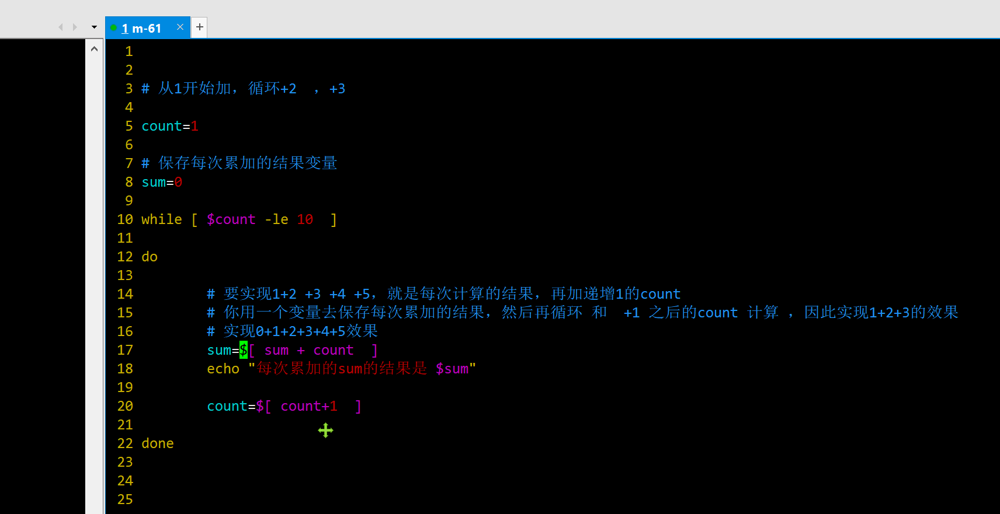

```### 此资源由 58学课资源站 收集整理 ###
	想要获取完整课件资料 请访问：58xueke.com
	百万资源 畅享学习

```
美好的七月开始了


# while循环

```
学习 for语句，来实现代码的循环执行

使用场景不一样

1.  for语句用于，当你需要遍历，循环提取的数据，有一定的范围，

for i in 取值列表  {1..20}


2. while使用的场景是，没有边界的条件如 
# 系统资源监控脚本

while true
do
	无限死循环执行，永远的执行下去
done


bash server_info.sh

cpu   sar 执行一次
磁盘   df -h 执行一次，拿到一个结果
内存  free -m 执行一次，拿到一个结果

脚本执行完就结束了

for i in {1..500000}
do
    cpu   sar 执行一次
    磁盘   df -h 执行一次，拿到一个结果
    内存  free -m 执行一次，拿到一个结果
    sleep 1 # 更新1秒
done


持续性的让脚本不断的运行下去
就可以改写为while语句，死循环的执行
top命令


#如下的脚本，除非主动中断进程，该检测脚本会一直执行下去，例如top
while true
do
    cpu   sar 执行一次
    磁盘   df -h 执行一次，拿到一个结果
    内存  free -m 执行一次，拿到一个结果
    
    sleep 1 # 更新1秒

done

# 看懂for和while的实际如 资源监控脚本的区别刷1111


```


# while语法图解


```
while语法


while 条件测试 # 条件成立为true后执行循环体
do
    循环体
done


```


# while的死循环用法

这样的监控脚本，你就可以吧数据写入到文件里，命令再后台运行，实现后台的无限监控了


```
while true
do
	#  "每隔2秒，打印内存信息"
	free -m
	sleep 2
	echo
    echo

done
```


## 循环限定范围


```bash
#!/bin/bash
# author: www.yuchaoit.cn


# 循环输出1~10
# for
for num in {1..10}
do
	echo "$num"
done


# 语法
while  条件表达式
do
	是否要执行循环体
done


# 1 ~ 10
# while 利用计数器的作用，累加1 到10 ，条件判断中，判定当 计数器小于等10时候，条件为真

count=1
# 当计数器小于11时，条件为true
while [ $count -lt 11 ]
do
        # 条件为true后，执行代码体
    echo "数字：$count"  # 1 2 3 4 5 6
    # 对计数器+1的操作
    #  shell继承c语言风格的++ 操作符
    #let count++
    #let  count=count+1
    # count=$[ $count + 1 ] 
    # count=$[ count + 1 ] 
    count=$(expr $count + 1)
    
done

# 
```


## while循环打印文件内容（好用）

```
while语句读取文件数据，有多种玩法，请看

```


循环读取文件数据，一般都用while操作

```
cat > data.log <<'EOF'
我是云南的 云南怒江的

爱你孤身走暗巷
爱你不跪的模样
爱你对峙过绝望
不肯哭一场
EOF


```

利用while读取文件数据，切添加个行号

### exec与重定向读取文件数据

```bash
# 玩法1

#!/bin/bash
# author: www.yuchaoit.cn

# 利用exec读取文本数据
# 常用语脚本中，导入数据到脚本里
# exec命令和 重定向写入符，吧数据导入到脚本bash环境中

exec < data.log
# 计数器，计算行号

line_num=1

# while  read  读取了上述的 exec <  data.log
#while 条件判断语句
#  while  read  只要文件有数据，条件就为true
# read -p "xxxx"  num
#  最终解释，就是 1，  read 读取数据，交给txt变量
# while 条件判断，只要有数据就为true

# 循环的读取每一行的数据，交给txt变量
while read txt
do
	# 利用计数器变量，作为行号，切打印txt这每一行的数据
    echo "$line_num $txt"
    # 对这个行号，进行累加，+1
    
    let line_num++
done


```


### 写法2，利用重定向写入符，导入给done语句

```bash
#!/bin/bash
# author: www.yuchaoit.cn

# 计数器，计算行号
line_num=1
#read 读取数据，交给txt变量
while read txt
do
    # 循环打印，行号+ 数据
    echo "$line_num $txt"
    # 对计数器累加+1
    let line_num++
# 把data.log数据，重定向写入到 while read 语句中，实现数据导入
done < data.log


```


## 写法3

```bash
#!/bin/bash
# author: www.yuchaoit.cn


line_num=1
# 先cat读取数据，管道符，交给while read ，把每一行数据，循环交给line变量

cat data.log|while read line
do
    echo "$line_num $line"
    let line_num++
done
        
```


### 读取/etc/passwd文件中的允许登录的用户


```bash
以你目前所学，是否能搞定， ，while

只打印出  允许登录的用户 

10:40 继续
代码写好的，发大群里，一起分享看代码


#!/bin/bash
exec < /etc/passwd

line_num=1
while read line
do

	#允许登录的行 awk写法
	if  [ ! -z  $(echo $line| awk '/bash/{print $0}') ];then
		echo "$line_num 允许登录，$line"
		let line_num++
	fi
	
	# grep写法
    if  [ ! -z  $(echo $line| grep 'bash$') ];then
        echo "$line_num 允许登录，$line"
        let line_num++
    fi

	# sed写法
	
	if  [ ! -z  $(echo $line| sed -n '/bash$/p') ];then
        echo "$line_num 允许登录，$line"
        let line_num++
    fi
    

done


```


>看了大家的代码，思路都是
>
>1. 先直接三剑客提取允许登录的用户，拿到数据结果，（1.写入到文件，循环读取文件）（2.数据直接管道符传递给while read）
>2. 再while循环去读取文件内容
>
>倒也行，，
>
>我这里的思路是，先读取文件所有内容，然后在全文数据中，按行去三剑客提取数据（貌似我这个效率低了些）


# 数字的累加循环

```bash

#!/bin/bash
# author: www.yuchaoit.cn
# 1+2+3+4+5 + ...100
# 2个变量  num1+num2

# 变量1
sum=0
# 变量2，充当while循环的计数器（条件是1 ~ 100的叠加，到100得结束）
count=1

#  当计数器小于等于100的时候，条件为true
# count=2
while [ $count -le 100 ]
do
	# 两数相加
	# 第一次循环  sum=0+1  =1 
    sum=$[$sum+$count]
    # 对计数器加1操作，实现下一次循环
    # count=2
    let count++
done

echo "sum总和：$sum"
```


每次循环的表达式

```
[root@m-61 ~/p3-shell]#bash while_sum.sh 
本次计算的表达式是：0+1
本次计算的表达式是：1+2
本次计算的表达式是：3+3
本次计算的表达式是：6+4
本次计算的表达式是：10+5
本次计算的表达式是：15+6
本次计算的表达式是：21+7
本次计算的表达式是：28+8
本次计算的表达式是：36+9
本次计算的表达式是：45+10
sum总和：55


```


## 循环累加1~10的偶数

```bash
# 2 + 4 + 6 + 8 + 10

#!/bin/bash
# author: www.yuchaoit.cn
# 1+2+3+4+5 + ...100
# 2个变量  num1+num2

# 变量1
sum=0
# 如果你的count从1 开始，
count=0

while [ $count -le 10 ]
do
	# 目前这个写法，等于计算 1+2+3 +..10
	# 如何计算所有的偶数呢？
	
    sum=$[$sum+$count]
	# 核心点就再count数字的计算
	# 循环进来的是1,2 3 4 5 6 
	# 2 4 6 8 让count每次循环累加的结果，就是2 ，到4 6 8 ，计算间隔是2
	echo "每次循环的count数字是： $count"
    let count=count+2
done

echo "sum总和：$sum"
```

> 数学算法，逻辑性太强，文字解释，费劲，1. 画图，画出每次的数值 2. 程序里打印每次循环 的变量，理解每次循环的计算过程

看图理解计算1到10的累加结果




### 循环累加1~10的奇数


# 继续再看回到while本身的知识点（条件判断）

```bash
#!/bin/bash
# author: www.yuchaoit.cn
# while的死循环特点，以及当条件为false后，会结束程序

while [ "$u" != "sunwukong"  ]
do
    read -p "请输入账号 sunwukong：" u
done


```


```bash
#!/bin/bash
# author: www.yuchaoit.cn
# while的死循环特点，以及当条件为false后，会结束程序

while [ "$u" != "sunwukong"  ]
do
    read -p "请输入账号 sunwukong：" u
done
 


```

```
这个程序如果作为登录验证逻辑，正常业务，都是 登录三次，错误后，程序结束，带着这个问题，思考下，如何开发三次登录程序？

关键词解决问题的，关键词思路？   利用计数器就可以了，统计循环的次数


```


## 循环读取文件，创建系统用户

准备测试数据文件

```
cat > data.log <<'EOF'
yuchao01:1500:1234567:devops
bob01:1501:1234567:sre
jack01:1502:123456:dba
EOF
```


```bash
#!/bin/bash
# author: www.yuchaoit.cn

exec < u.log
while read line 
do
    groups=$(echo $line|awk -F':' '{print $4}')
    uid=$(echo $line|awk -F':' '{print $2}')
    password=$(echo $line|awk -F':' '{print $3}')
    username=$(echo $line|awk -F':' '{print $1}')

    # 组判断
    grep "$groups" /etc/group &>/dev/null
    if [ $? -ne 0  ];then
        echo "该$groups 不存在，创建中.."
        groupadd $groups
    fi
    echo '============================================================'
    # 用户创建
    grep "$username" /etc/passwd  &>/dev/null
  if [ $? -ne 0  ];then
      echo "该$username 不存在，创建中.."
      useradd $username -u $uid -G $groups 
      echo $password | passwd --stdin $username 
  fi

  # 用户检查
  echo "用户信息是：$(id $username)"

done
```


## while和跳过循环的continue语句


```
continue 跳过本次循环

打印 1 ~10 的数字，跳过4 8 不打印  

# 1，2,3,5,6,7,9 理解吧


count=1
while [  $count -lt 11 ]
do
	echo $count
	if [ $count -eq 4 -o $count -eq 8 ];then
		continue
	fi
	
	let count++
done


```


# 猜数字

```
需求

1. 随机生成1~100数字
2. 提示用户只能输入数字，做好程序判断
3. 友好提示，猜大了、猜小了
4. 死循环，只有猜对后结束程序
5. 统计猜了几次（只统计正确输入）
```

开发代码

```
取随机数，如0，1,2， 对3取余即可

[root@m-61 ~/p3-shell]## 想要 0 ~ 2 之间任意一个数，0 1,2
[root@m-61 ~/p3-shell]#
[root@m-61 ~/p3-shell]#
[root@m-61 ~/p3-shell]## 想要 0 ~ 2 之间任意一个随机数，0 1,2
[root@m-61 ~/p3-shell]#
[root@m-61 ~/p3-shell]#echo $[ ${RANDOM} % 3  ]
2
[root@m-61 ~/p3-shell]#echo $[ ${RANDOM} % 3  ]
0


```


```bash
#!/bin/bash
# author: www.yuchaoit.cn


# 笔记
#echo $[ $RANDOM  % 100 +1  ]  # 0 ~99 ，+1 即可，取 1 ~ 100的数据

# 先拿到一个随机的 1 ~ 100的数字
r_num=$(echo $[RANDOM%100+1])

# 计数器，统计猜对的次数,统计用户正确输入的数字，次数

guess_count=0


# 程序开始
while true
do
    read -p "====下定离手！！请输入数字===：" num

# 限制数字
    if [ -z $(echo $num |sed -rn '/^[0-9]+$/p') ];then
        echo "大哥，请输入纯数字，你会不会玩啊？"
        continue
    fi
    # 每次循环，统计+1
    let guess_count++

  if [ $num -gt $r_num ];then
      echo "你太大了。。"
  elif [ $num -lt $r_num ];then
      echo "你太小了"
  else
      echo "恭喜你，猜对了！！！随机数字是$r_num，一共猜了$guess_count次！！"
      exit
  fi
done
```


# 跳板机开发

```bash
koko服务

要登录那台机器

开发一个简易的跳板机脚本，while+case实现
#!/bin/bash
# author: www.yuchaoit.cn

# 禁止用户通过快捷键信号，终止脚本
# trap "" HUP INT QUIT TSTP

while true
do

echo -e "
超哥的堡垒机v1版，欢迎你兄弟
===============
|    1. web7   |
|    2. web8   |
|    3. db51   |
|    4. db52   |
|    5. exit   |
==============="


read -p "请输入您的选择：" key
case $key in
    1)
    # 针对每一个链接，你可以做更多的条件判断
    # 以及看一看ssh还提供了哪些功能参数，实现如链接超时等操作
    # 以及先做好秘钥分发，来一步步完善你的跳板机脚本。
    
    ssh 172.16.1.7
    ;;

    2)
    ssh 172.16.1.8
    ;;

    3)
    ssh 172.16.1.51
    ;;

    4)
    ssh 172.16.1.52
    ;;

    5)
    exit
    ;;

    *)
            echo "only 1 ~ 5"

    esac
done
```


# 今日作业

111


不管期待不期待，气势上不能输

222的都给出去


```
认真听，同志们

我给大家准备了80多道，脚本题库

1. 基本要求，看题意，看老师的参考代码，一题一题的完成，不懂问超哥
1.5  看代码，完成解题之后，试试，用自己的思路能否改一改


2. 高级要求，看题意，自己做，能憋出一题是一题（大佬牛逼）

不要求你周末做完，做不完，一直到最后，自己有时间就做，你再面试前，务必刷完这些题。


```


要求

```perl
于超老师提醒；

1. 尽可能的考虑到bug场景、进行逻辑判断，减少bug，优化代码
2. 尝试考虑换一种写法，思路，完成如下题目。
3. 友情提醒（有时候，走进死胡同的时候，可以考虑换一个思考方式。。）
4. 学习编程，任何、每一个新人都有一个感觉，能看懂，写不出来，没思路

这个世纪难题，超哥给你说！！！

每一位和我说过这样话的同学，在工作半年、一年后，全部再也不说了，为什么？因为处理的问题足够多了，写的脚本足够多了，在你写50、100、150个脚本之后，蹭一下，就开窍了！！

所以、无他、写、写、写
课上写、自己找案例写、写他个三天三夜、三百个日夜，如果还不会，立即、果断、放弃！
反之、你就必然能打通任督二脉、进入自动化运维的境界！


shell主要用于处理自动化服务器的运维问题

因此通过本章的练习题，让你

1.理解能用在什么场景，解决什么问题

2.参考解决问题的开发思路，开发逻辑

3.理解后自行优化代码，丰富代码，增强自己的编程思维逻辑。

4.面试官问你，shell写的如何？写过哪些脚本，到时候大胆的说，我写过xxxx，也就百十来个脚本吧，尽管问
你期望薪资多少？20k 😄

5.当然后续还要结合者，如zabbix监控脚本，持续集成代码发布脚本、数据库维护脚本、容器管理脚本，等高级场景，继续不断学习！！
```


