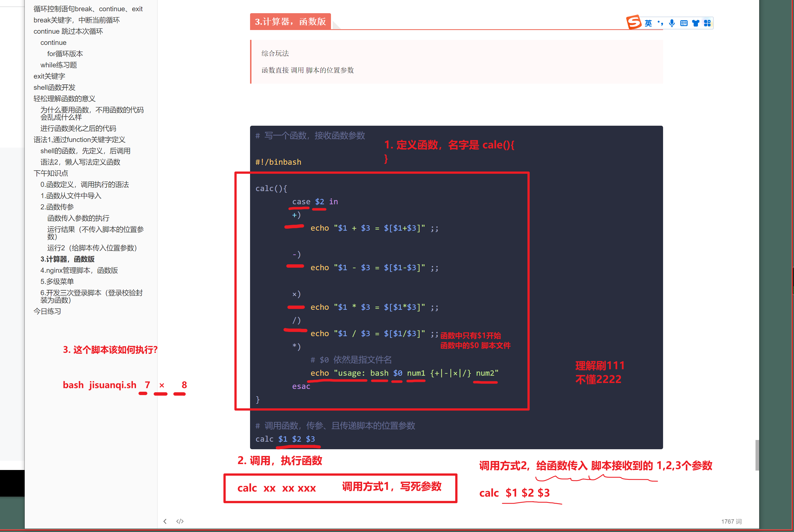

```### 此资源由 58学课资源站 收集整理 ###
	想要获取完整课件资料 请访问：58xueke.com
	百万资源 畅享学习

```
# 循环控制语句break、continue、exit


http://ebook-p3.apecome.com/08-%E5%BE%AA%E7%8E%AF%E6%8E%A7%E5%88%B6.html


```
break

continue

exit

三个关键字，三个关键字都能解决什么问题


```


具体事例代码

先看这种代码


# break关键字，中断当前循环


```bash
#!/bin/bash

# 到11的时候结束循环，注意，是包括11，还是不包括11？

for i in {1..20}
do
    echo "$i"
    echo "这里代码什么时候会执行呢？"
done

echo "程序结束~"
```

代码执行结果

是do和done之间的循环体，执行20次， 循环外的代码，执行一次就结束


```bash
#!/bin/bash

# 到11的时候结束循环，注意，是包括11，还是不包括11？

for i in {1..20}
do
    echo "$i"
    if [ $i == 11  ];then
             break
    fi
  echo "这里代码什么时候会执行呢？"
done

echo "程序结束~"
```


```
让你理解break的语句作用，是当执行到break，会中断当前for循环的执行

for i in {1..20}

遇见break 就直接结束for循环了 ，剩下的循环不执行了

```

# continue 跳过本次循环

## continue

```
1. 跳过本次循环，忽略本次循环的代码执行，直接进入下一次循环，直到结束。
2. 循环结束后，循环外部的代码依然继续。
```


> 打印1 ~ 20，跳过6和16

### for循环版本

```bash
#!/bin/bash

# 到11的时候结束循环
for i in {1..20}
do
    if [ $i == 6 -o $i == 16 ];then
             continue
    fi
    echo "$i"
  echo "这里代码什么时候会执行呢？"
done

echo "程序结束~"
```


执行结果是


## while练习题

```
把这2道题，break语句和continue语句的for循环写法

改为while写法 ，需求都是 循环20次。改造代码即可


练习一会啊，写完后，代码发群里。

```


# exit关键字

```
中断当前程序执行，当前脚本进程退出


```


# shell函数开发

http://ebook-p3.apecome.com/09-shell%E5%87%BD%E6%95%B0.html


# 轻松理解函数的意义

## 为什么要用函数，不用函数的代码会乱成什么样


## 进行函数美化之后的代码


# 语法1,通过function关键字定义

## shell的函数，先定义，后调用

封装需要重复性执行的代码，减少代码量，优化，美化代码

写法1，定义函数，通过关键字 function 定义

```bash
# 定义第一个函数，名字是 hello 
function hello(){
	# 被封装的代码，执行该函数，就会执行这里的函数体
    echo "hello chaoge linux."
}


# 封装的另一个函数，名字是 ngx_status

function ngx_status(){
	# 函数体 代码
    systemctl status nginx
    ps -ef|grep nginx
}


# 执行函数
# 直接写函数的名字即可

hello


ngx_status
```

执行函数的脚本


函数的定义和执行


## 语法2，懒人写法定义函数

```bash
  1 # 定义第一个函数，名字是 hello 
  2 hello(){
  3         # 被封装的代码，执行该函数，就会执行这里的函数体
  4     echo "hello chaoge linux."
  5 }
  6 
  7 
  8 # 封装的另一个函数，名字是 ngx_status
  9 
 10 ngx_status(){
 11         # 函数体 代码
 12     systemctl status nginx
 13     ps -ef|grep nginx
 14 }
 15 
 16 
 17 huilema(){
 18 
 19 echo "同志们，函数会玩了吗？要学会看脚本，看到新脚本，fucntions脚本库，函数，好几百行，先看头尾，从哪到哪"
 20 
 21 }
 22 
 23 
 24 
 25 # 执行函数
 26 # 直接写函数的名字即可
 27 
 28 hello
 29 
 30 # 1. 函数名要写对了
 31 ngx_status
 32 
 33 
 34 huilema
 35 
 36 
 37 # 错误2，先定义再调用执行
 38 
 39 
 40 
 41 
 42 # 函数名定义，见名知意
 43 install_start_nginx(){
 44 
 45 # 1. 安装nginx
 46 # 2.启动
 47 yum install nginx -y
 48 systemctl start nginx
 49 }
 50 
 51 
 52 
 53 install_start_nginx
~                              
```


# 下午知识点

## 0.函数定义，调用执行的语法

```bash
#!/bin/bash

hello(){

	echo "这是函数体中的代码"
}

# 写一次就执行一次函数体中所有的代码
hello

# 执行多次

hello

hello


```


## 1.函数从文件中导入

fcun1.sh

```
#定义一些变量，函数

# 只定义，不调用
name='吴彦祖'

echo_name(){
	echo "该变量name的值是：$name"
}


```


func2.sh


## 2.函数传参


```
1. 这里的函数传参，是指单独给函数传递执行参数，和给脚本传入参数是两码事


2. 函数传参是指，函数在执行的时候，可以传入位置参数，这样函数连带参数一起执行。


```


### 函数传入参数的执行

```bash
#!/bin/bash 

function hello(){
    echo "函数开始执行"
    # 注意这里的参数，
    echo "函数体中接收的参数1 ：" $1
    echo "函数体中接收的参数2 ：" $2
}

# 这里传入的是函数参数
hello laoliu laoba

echo "函数外，可以正常的接收位置参数1：" $1
echo "函数外，可以正常的接收位置参数2：" $2
```


### 运行结果（不传入脚本的位置参数）

=


### 运行2（给脚本传入位置参数）


## 3.计算器，函数版

> 综合玩法
>
> 函数直接 调用 脚本的位置参数





```bash
# 写一个函数，接收函数参数

#!/binbash

calc(){
        case $2 in
        +)
            echo "$1 + $3 = $[$1+$3]" ;;

        -)
            echo "$1 - $3 = $[$1-$3]" ;;

        ×)
            echo "$1 * $3 = $[$1*$3]" ;;            
        /)
            echo "$1 / $3 = $[$1/$3]" ;;
        *)
            # $0 依然是指文件名
            echo "usage: bash $0 num1 {+|-|×|/} num2"
        esac
}

# 调用函数，传参、且传递脚本的位置参数
calc $1 $2 $3
```


### 测试执行

```bash
```


## 4.nginx管理脚本，函数版

```bash
#!/bin/bash

# 函数1，帮助信息的函数
Usage(){
    echo "Usage： bash $0 {start|stop|restart}"
}


# 启动nginx
start_nginx(){
    echo "nginx启动中
    # /usr/bin/nginx -c /etc/nginx/nginx.conf
}
# 函数3，关闭nginx
stop_nginx(){

    echo "nginx已关闭"
}


# 接收用户输入指令
# $1 参数是谁？运行脚本时，传入的一个参数，绕德清，刷1111


case $1 in
    start)
        start_nginx ;;
    stop)
        stop_nginx ;;
    restart)
        stop_nginx
        start_nginx
        ;;
*)
    Usage
esac
```


```
你以后写服务管理脚本

启动

停止

重启的

代码逻辑

给封装成函数


```


## 5.多级菜单

由外到内，一层层写即可


```bash
#!/bin/bash
# author: www.yuchaoit.cn


# 菜单封装函数，便于调用

menu1(){

echo -e "
=============欢迎来到于超老师的linux课程========
兄弟，请你按照如下规则，输入选项
1. Install Nginx
2. Install Mysql
3. Install Redis
4. bye
============================================
"
}


nginx_menu(){
echo -e "
===============请选择对于软件版本==============
1. Install Nginx1.15
2. Install Nginx1.16
3. Install Nginx1.17
4. 返回上一层
=============================================
"
}


mysql_menu(){
    echo "mysql菜单还在开发中....."
}


# 程序打印菜单1
menu1

while true
do
    # 用户选择菜单1
    read -p "您请输入对应的序号：" num1
    # 一级条件判断
    case $num1 in

    1)
        # 进入菜单2
        nginx_menu
        while true
        do
            read -p "请选择对应的nginx版本：" num2
        case $num2 in
            1)
              echo "成功安装nginx 1.15版本！！" 
              ;;
            2)
              echo "成功安装nginx 1.16版本！！" 
              ;;
            3)
              echo "成功安装nginx 1.7版本！！"
              ;;
            4)
              # 清屏，返回上一层
              clear
              menu1
              # 中断二级菜单的循环
              break
              ;;
             *)
              echo "请按规则填写 1 ~ 4 序号...."
         esac
            done
            ;;
    2)
        mysql_menu
        ;;
    3)
        echo "redis菜单于超老师努力开发中。。。"
        ;;
    4)
        echo "bye bye 。"
        exit
        ;;
    *)
        echo "请按规则输入菜单序号1 ~ 4 ！！"
        continue
    esac
done
```


## 6.开发三次登录脚本（登录校验封装为函数）


```bash
需求，
1.校验用户输入的账户密码，错误三次后，程序直接exit
2.且提示用户，错误以达三次，你是越南的骗子把？
3.如果在三次内登录成功的话，显示下 root家目录的数据（模拟可以查看系统数据）
4. 校验数据库是 
username="linux0224"
password='linux666'


```


# 今日练习


```perl
1. 练习循环控制语句+函数的使用


2. 完成2个大作业


2.1  服务管理脚本开发，基于课上讲解的多级菜单模板，继续优化开发
(while循环的嵌套，case语句的嵌套)


能够实现
1. 执行该脚本，安装nginx1.16 ，安装全部再后台执行，不显示日志
2. 输入回退到上一级选项
3. 选择安装mysql的序号，简单调用yum安装mysql即可
4. 输入退出选项，结束程序


3. 三次登录脚本开发


```

如上要求，今晚写不完别回家。再这陪着你。


