```### 此资源由 58学课资源站 收集整理 ###
	想要获取完整课件资料 请访问：58xueke.com
	百万资源 畅享学习

```
# 1.什么是shell数组

数组是一种数据类型


```bash
shell中定义变量，存储数据，一直都是只存储一个

数组变量可以存储多个值，多个数据

1. 数组用于存储多个值，且提供索引标号便于取值

2. Bash支持普通的数值索引数组，还支持关联数组。

数组是最常见的数据结构，可以用来存放多个数据。

有两种类型的数组：数值索引类型数组和关联数组。

数值索引类型数组使用0、1、2、3…数值作为索引，通过索引可找到数组中对应位置的数据

关联数组使用名称(通常是字符串，但某些语言中支持其它类型)作为索引，是key/value模式的结构，key是索引，value是对应元素的值。

通过key索引可找到关联数组中对应的数据value

关联数组在其它语言中也称为map、hash结构、dict等。

打不死股，从严格意义上来说，关联数组不是数组，它不符合数组数据结构，只是因为访问方式类似于数值索引类型的数组，才在某些语言中称之为关联数组。

数值索引类型的数组中存放的每个元素在内存中连续的，只要知道第一个元素的地址，就能计算出第2个元素地址、第3个元素地址、第N个元素地址。
```


## 图解python的list和对比shell的普通数组理解

```
shell中的数组，定义形式不够明确

1.  普通数组

students=(张三  二胖    三狗)
# 并且默认还有索引号，分别是从 0 ，1, 2 对应三个数据


stu1=张三

stu2=二胖

stu3=三狗 


```


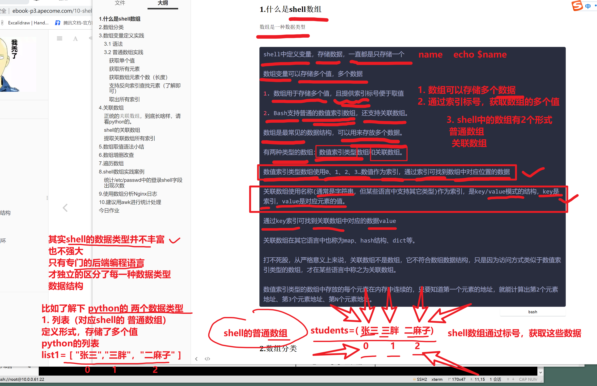


## python的字典dict数据类型，对比shell的关联数组去理解

```
1.  普通数组

students=(张三  二胖    三狗)
# 并且默认还有索引号，分别是从 0 ，1, 2 对应三个数据


stu1=张三

stu2=二胖

stu3=三狗 


2. shell的关联数组


python的字典类型，对对比理解
students_info = { 
    "stu1":"三胖" ,
    "stu2":"二胖",
    "stu3":"大胖"
}


```

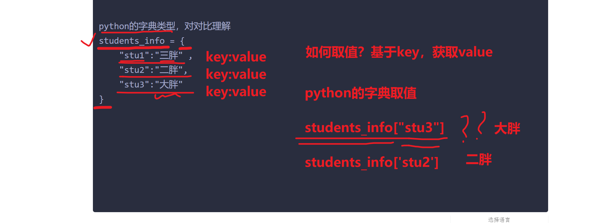


## 图解shell的数组，再内存中如何存数据的

```
普通数组  ，通过数值型索引，对应每一个数据


```


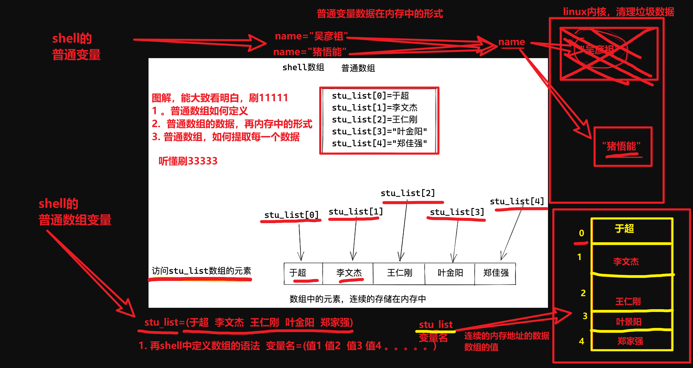


# 2.数组分类

```bash
1. 普通数组 ：
就是一个数组变量，有多个值，取值通过整数索引号取即可


2. 关联数组
自定义索引名，取值玩法是

数组变量[索引]     拿到值


```

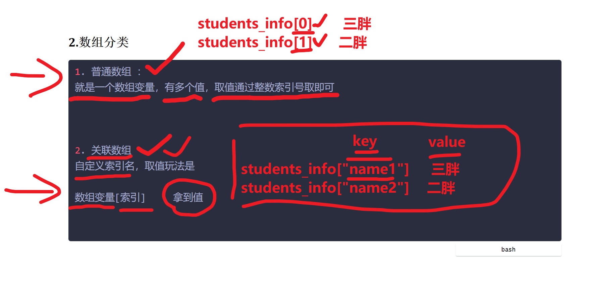

# 3.普通数组变量，定义实践


## 3.0 学新知识之前，先看看系统中，有没有数组变让你用

```
# 你如何再系统中，找到系统内置的 数组变量？请发弹幕，你的命令是什么

1.通过set命令，显示系统中所有的环境变量，shell内置定义的变量


```


## 3.1 语法

```bash
普通数组用小括号定义，元素以空格区分，数组元素的索引号从0 开始

stu_lists=(张三 李四 三胖 王二麻 )
普通数组变量，完整的数据形式

[root@m-61 ~]#stu_lists=(张三 李四 三胖 王二麻 )
[root@m-61 ~]#
[root@m-61 ~]#
[root@m-61 ~]#

# 普通数组，基于整数的索引号，对应每一个数据，听懂刷1111


[root@m-61 ~]#set |grep stu_lists
stu_lists=([0]="张三" [1]="李四" [2]="三胖" [3]="王二麻")


# 看看系统内置了哪些普通数组呢？

set |grep -E '=('  #看懂刷1111，不懂222


```


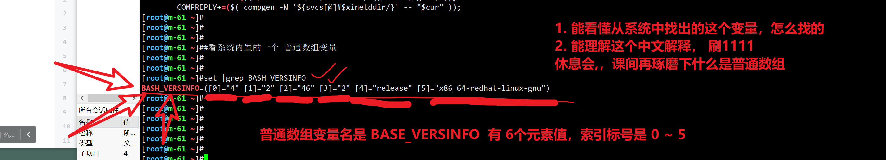


## 3.2 普通数组实践

```
定义普通数组的语法

数组用小括号定义，元素以空格区分，数组元素的索引号从0 开始

# 需要主动定义索引标号吗？
# 直接写多个值，以空格分隔即可

stu_lists=(张三 李四 三胖 王二麻 )


```


### 获取单个值

获取数组的每一个单个值，通过索引标号去获取即可


```bash
#!/bin/bash
# author: www.yuchaoit.cn


stu_lists=(张三 李四 三胖 王二麻 )

echo "提取数组 第1个元素 ${stu_lists[0]}"
echo "提取数组 第2个元素 ${stu_lists[1]}"
echo "提取数组 第3个元素 ${stu_lists[2]}"
echo "提取数组 第4个元素 ${stu_lists[3]}"


# 因此读取数组元素的语法是  ${array_name[index]}

# 如果直接打印数组变量，默认提取第一个元素
echo "$stu_lists"
```


### 定义数组的2个方式

```bash
# 关于定义数组的方式1
# 不制定索引号，直接定义，bash会自动索引标号
# bash默认补上 0 1 2 3 4 5
stu_list1=(罗兴林 李文杰 王仁刚 叶金阳  郑家强)


# 定义数组的方式2
# 主动的，添加索引标号，看玩法
[root@m-61 ~/p3-shell]#stu_list2[0]=罗兴林
[root@m-61 ~/p3-shell]#stu_list2[3]=李文杰
[root@m-61 ~/p3-shell]#stu_list2[4]=王仁刚
[root@m-61 ~/p3-shell]#stu_list2[6]=陈亮亮
[root@m-61 ~/p3-shell]#stu_list2[9]=郑家强
[root@m-61 ~/p3-shell]#

[root@m-61 ~/p3-shell]#
[root@m-61 ~/p3-shell]#
[root@m-61 ~/p3-shell]#set|grep stu_list2
stu_list2=([0]="罗兴林" [3]="李文杰" [4]="王仁刚" [6]="陈亮亮" [9]="郑家强")
[root@m-61 ~/p3-shell]#

# 提取出李文杰

杨松麟
echo ${stu_list2[3]} 
罗兴林
echo ${stu_list2[3]} 
程志伟
echo ${stu_list1[3]} 
王仁刚
echo ${stu_list2[3]} 
张少辉
echo ${stu_list2[3]} 
黄彦
echo ${stu_list2[3]} 
冯靖涵
echo ${stu_list2[3]} 
张鑫
echo ${stu_list2[3]} 

# 提取出陈亮亮
echo ${stu_list2[6]}

# 提取出王仁刚
echo ${stu_list2[4]}

# 因此，普通数组变量，只能定义 整数的索引标号，以及对应的值


# 下一个问题，stu_list1的数据是？


```


## 关于数组元素的值得增删改查

```bash
[root@m-61 ~/p3-shell]#
当前的数组所有元素
[root@m-61 ~/p3-shell]#set|grep stu_list1
stu_list1=([0]="罗兴林" [1]="李文杰" [2]="王仁刚" [3]="叶金阳" [4]="郑家强" [7]="程志伟")
[root@m-61 ~/p3-shell]#
[root@m-61 ~/p3-shell]#
[root@m-61 ~/p3-shell]#
[root@m-61 ~/p3-shell]#
增加数组中的一个元素
[root@m-61 ~/p3-shell]#stu_list1[6]='郭德纲'
[root@m-61 ~/p3-shell]#
[root@m-61 ~/p3-shell]#
[root@m-61 ~/p3-shell]#set|grep stu_list1
stu_list1=([0]="罗兴林" [1]="李文杰" [2]="王仁刚" [3]="叶金阳" [4]="郑家强" [6]="郭德纲" [7]="程志伟")
[root@m-61 ~/p3-shell]#
[root@m-61 ~/p3-shell]#
[root@m-61 ~/p3-shell]#
[root@m-61 ~/p3-shell]#
增加数组中的一个元素
[root@m-61 ~/p3-shell]#stu_list1[5]='于谦'
[root@m-61 ~/p3-shell]#
[root@m-61 ~/p3-shell]#set|grep stu_list1
stu_list1=([0]="罗兴林" [1]="李文杰" [2]="王仁刚" [3]="叶金阳" [4]="郑家强" [5]="于谦" [6]="郭德纲" [7]="程志伟")
[root@m-61 ~/p3-shell]#
[root@m-61 ~/p3-shell]#
[root@m-61 ~/p3-shell]#
修改数组的元素值

[root@m-61 ~/p3-shell]#stu_list1[4]='柳岩'
[root@m-61 ~/p3-shell]#
[root@m-61 ~/p3-shell]#
[root@m-61 ~/p3-shell]#
[root@m-61 ~/p3-shell]#set|grep stu_list1
stu_list1=([0]="罗兴林" [1]="李文杰" [2]="王仁刚" [3]="叶金阳" [4]="柳岩" [5]="于谦" [6]="郭德纲" [7]="程志伟")
[root@m-61 ~/p3-shell]#


删除数组中的元素值
干掉王仁刚，和于谦
# 定位到具体元素值，通过unset删除即可

# 干掉王仁刚
[root@m-61 ~/p3-shell]#unset stu_list1[2]
# 干掉于谦
[root@m-61 ~/p3-shell]#unset stu_list1[5]

# 检查数组结果
[root@m-61 ~/p3-shell]#set|grep stu_list1
_=stu_list1
stu_list1=([0]="罗兴林" [1]="李文杰" [3]="叶金阳" [4]="柳岩" [6]="郭德纲" [7]="程志伟")
[root@m-61 ~/p3-shell]## 看懂数组的增删改查玩法，刷1111


```


## 直接获取普通数组的所有元素值

```bash
# 两个符号  @ * 都可以
[root@m-61 ~/p3-shell]#echo ${stu_list1[@]}
罗兴林 李文杰 叶金阳 柳岩 郭德纲 程志伟
[root@m-61 ~/p3-shell]#
[root@m-61 ~/p3-shell]#
[root@m-61 ~/p3-shell]#echo ${stu_list1[*]}
罗兴林 李文杰 叶金阳 柳岩 郭德纲 程志伟
[root@m-61 ~/p3-shell]#
[root@m-61 ~/p3-shell]#
[root@m-61 ~/p3-shell]## 看懂这个2个提取所有元素的语法，刷1111
[root@m-61 ~/p3-shell]#


```

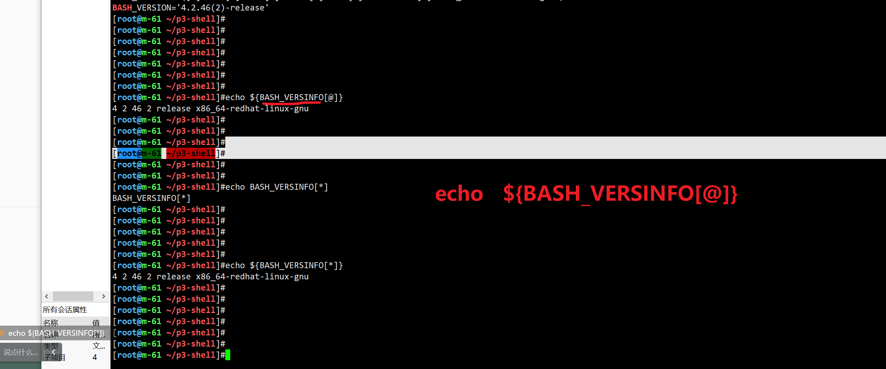


### 获取数组元素个数（长度）

不用你肉眼，一个个的数，到底这个数组，有几个元素，有几个值


```bash
# 定义学生数组
students=( 孙悟空 猪八戒 沙和尚 唐僧 蜘蛛精 女儿国国王  周淑怡)


[root@m-61 ~/p3-shell]#

students=( 孙悟空 猪八戒 沙和尚 唐僧 蜘蛛精 女儿国国王  周淑怡)

[root@m-61 ~/p3-shell]#
[root@m-61 ~/p3-shell]#
[root@m-61 ~/p3-shell]#
[root@m-61 ~/p3-shell]#
[root@m-61 ~/p3-shell]#
[root@m-61 ~/p3-shell]## 简写，快速获取数组元素的个数
[root@m-61 ~/p3-shell]#
[root@m-61 ~/p3-shell]#
[root@m-61 ~/p3-shell]#echo ${#students[@]}
7
[root@m-61 ~/p3-shell]#
[root@m-61 ~/p3-shell]#
[root@m-61 ~/p3-shell]#set |grep stu_
stu_list1=([0]="罗兴林" [1]="李文杰" [3]="叶金阳" [4]="柳岩" [6]="郭德纲" [7]="程志伟")
stu_list2=([0]="haha" [3]="李文杰" [4]="王仁刚" [6]="陈亮亮" [9]="郑家强")
stu_lists=([0]="张三" [1]="李四" [2]="三胖" [3]="王二麻")

[root@m-61 ~/p3-shell]## 请发弹幕，分别统计 这3个列表，有几个元素

[root@m-61 ~/p3-shell]## 请发弹幕，分别统计 这3个普通数组，有几个元素
[root@m-61 ~/p3-shell]#

罗兴林
echo ${#stu_list1[*]}  ${#stu_list2[@]}  ${#stu_lists[*]} 

# 总结如何获取数组的元素个数语法

echo ${#数组名[@]}


```

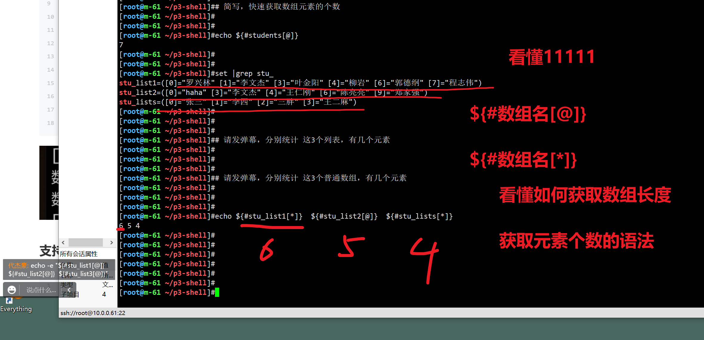


### 支持反向索引查找元素（了解即可）

```

# 依此索引序号的 数组定义，看看反向索引的查找

```

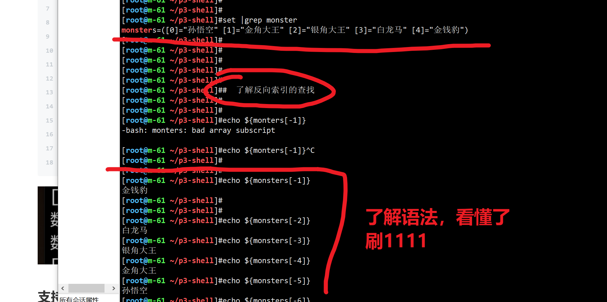


### 取出所有索引标号


```perl
[root@m-61 ~/p3-shell]#set|grep stu_
stu_list1=([0]="罗兴林" [1]="李文杰" [3]="叶金阳" [4]="柳岩" [6]="郭德纲" [7]="程志伟")
stu_list2=([0]="haha" [3]="李文杰" [4]="王仁刚" [6]="陈亮亮" [9]="郑家强")
stu_lists=([0]="张三" [1]="李四" [2]="三胖" [3]="王二麻")
[root@m-61 ~/p3-shell]#
[root@m-61 ~/p3-shell]#
[root@m-61 ~/p3-shell]#
[root@m-61 ~/p3-shell]#
[root@m-61 ~/p3-shell]#
[root@m-61 ~/p3-shell]#
[root@m-61 ~/p3-shell]#set|grep monster
monsters=([0]="孙悟空" [1]="金角大王" [2]="银角大王" [3]="白龙马" [4]="金钱豹")
[root@m-61 ~/p3-shell]#
[root@m-61 ~/p3-shell]#


[root@m-61 ~/p3-shell]## 如何取出monsters数组的所有元素，笔试题1
echo ${monsters[@]}
echo ${monsters[*]}


[root@m-61 ~/p3-shell]#
[root@m-61 ~/p3-shell]#
[root@m-61 ~/p3-shell]#
[root@m-61 ~/p3-shell]## 如何取出monsters数组的所有索引标号，笔试题2

echo ${!monsters[@]}
echo ${!monsters[*]}


[root@m-61 ~/p3-shell]## 如何判断monsters数组的元素个数，笔试题3

echo ${#monsters[@]}
echo ${#monsters[*]}


```

## 课间练习题

```perl
[root@m-61 ~/p3-shell]#set|grep stu_
stu_list1=([0]="罗兴林" [1]="李文杰" [3]="叶金阳" [4]="柳岩" [6]="郭德纲" [7]="程志伟")
stu_list2=([0]="haha" [3]="李文杰" [4]="王仁刚" [6]="陈亮亮" [9]="郑家强")
stu_lists=([0]="张三" [1]="李四" [2]="三胖" [3]="王二麻")


[root@m-61 ~/p3-shell]## 如何取出上述所有数组的所有元素，笔试题1

[root@m-61 ~/p3-shell]## 如何取出上述所有数组的所有索引标号，笔试题2

[root@m-61 ~/p3-shell]## 如何判断上述所有数组的元素个数，笔试题3


```


## 练习题：快速创建数组，连续的50个元素即可

```


```


# 理解shell的两个数组的类型


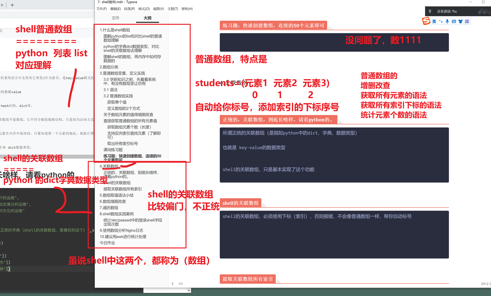


# 4.关联数组

```perl
关联数组使用名称(通常是字符串，但某些语言中支持其它类型)作为索引，是key/value模式的结构，key是索引，value是对应元素的值。

通过key索引可找到关联数组中对应的数据value

关联数组在其它语言中也称为map、hash结构、dict等。

打不死股，从严格意义上来说，关联数组不是数组，它不符合数组数据结构，只是因为访问方式类似于数值索引类型的数组，才在某些语言中称之为关联数组。

数值索引类型的数组中存放的每个元素在内存中连续的，只要知道第一个元素的地址，就能计算出第2个元素地址、第3个元素地址、第N个元素地址。

shell的关联数组，参考python的字典 dict数据类型。
```

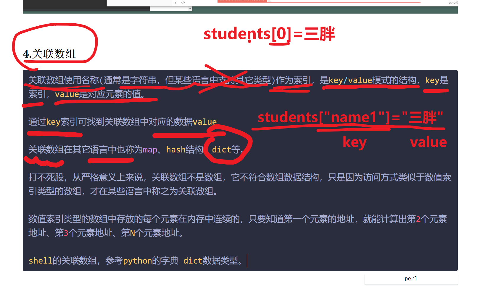


## 正统的，关联数组，到底长啥样，请看python的。

```
所谓正统的关联数组（是指如python中的dict、字典、数据类型）

也就是 key-value的数据类型


shell的关联数组，只是基本实现了这个功能

```

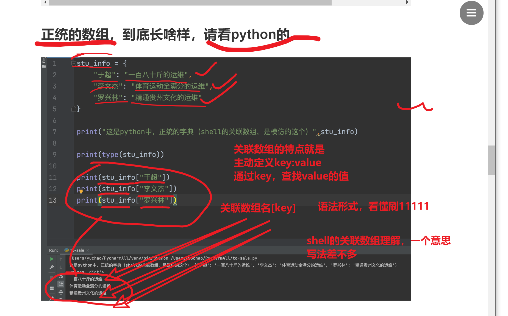


## shell的关联数组语法细节


```
shell的关联数组，必须按照如下规则，才能定义，使用

1.  必须用delcaer -A 关联数组名     先定义变量名，才能使用，才能对它赋值key：value

2. 必须使用下标（索引）去定义数据，否则报错，不会像普通数组一样，帮你自动标号
必须指明key名，否则报错


```

案例代码

```bash
1. 必须先用declare -A命令定义，然后才能创建关联数组


#!/bin/bash
# author: www.yuchaoit.cn
# 主动生命，这个stu_info变量是  关联数组的类型，因此先定了，必须制定key去赋值

declare -A stu_info

# key可以省略引号
# 定义关联数组

stu_info["于超"]="一百八十斤的运维"
stu_info[李文杰]="体育运动全满分的运维"
stu_info[罗兴林]="精通贵州文化的运维"


# 关联数组取值
echo "${stu_info[于超]}"
echo "${stu_info[李文杰]}"
echo "${stu_info[罗兴林]}"
```

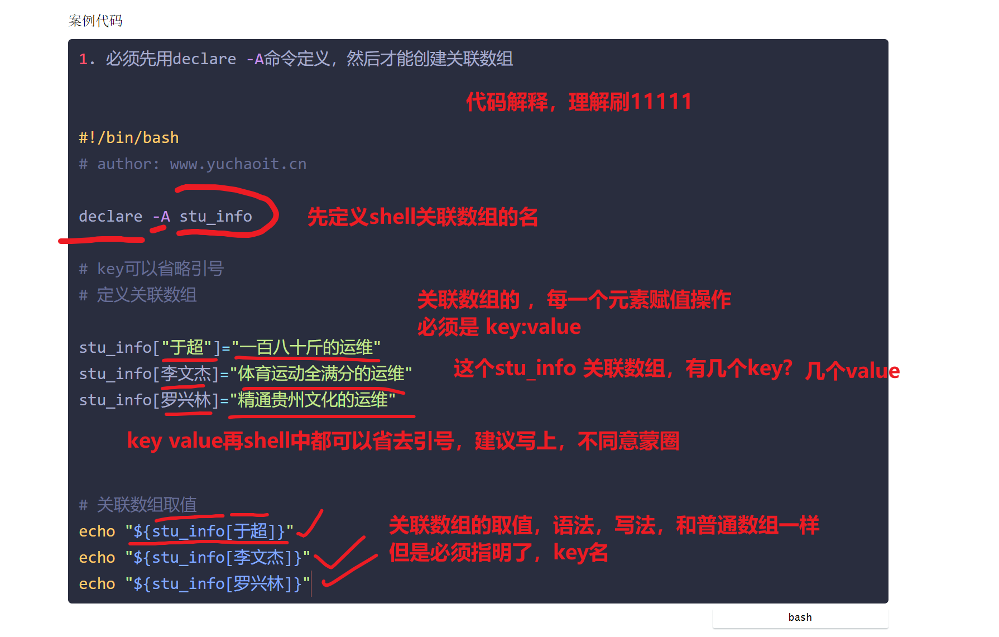


## 提取关联数组中所有的key

```

[root@m-61 ~/p3-shell]#echo  ${!stus[@]}
杨松林 罗新林 chengliangliang
[root@m-61 ~/p3-shell]#
[root@m-61 ~/p3-shell]#echo  ${!stus[*]}
杨松林 罗新林 chengliangliang


```

## 提取关联数组所有元素

```
# 直接提取所有的元素value
元素是指，数组中有几个元素（key:value）


[root@m-61 ~/p3-shell]#echo ${stus[@]}
段子讲的最好的运维 贵州文化大使 卷王之王
[root@m-61 ~/p3-shell]#
[root@m-61 ~/p3-shell]#
[root@m-61 ~/p3-shell]#echo ${stus[*]}
段子讲的最好的运维 贵州文化大使 卷王之王

```


# 5.关联数组,取值语法小结

```bash
#!/bin/bash
# author: www.yuchaoit.cn
# 取出单个值
echo ${stu_info[key]} #根据key，获取某个value数据

echo ${!stu_info[*]}  # 获取数组所有索引
echo ${!stu_info[@]}  # 获取数组所有索引

echo ${stu_info[@]}  # 获取数组所有元素
echo ${stu_info[*]}  # 获取数组所有元素

echo ${#stu_info[*]}  # 获取数组所有元素个数
echo ${#stu_info[@]}  # 获取数组所有元素个数

echo ${stu_info[key]} # 根据key，提取value
```

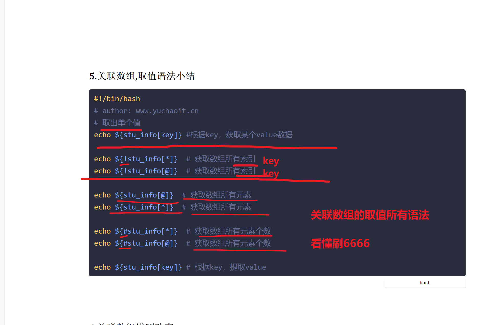


# 6.关联数组增删改查

```bash
[root@m-61 ~/p3-shell]## 除了再脚本中定义，命令行中定义一样
[root@m-61 ~/p3-shell]#
[root@m-61 ~/p3-shell]#declare -A stus

[root@m-61 ~/p3-shell]#set |grep stus
_=stus
stus=()


# 增加关联数组的元素写法
[root@m-61 ~/p3-shell]## 关联数组的赋值操作，增删改查
[root@m-61 ~/p3-shell]#
[root@m-61 ~/p3-shell]#stus["李文杰"]="体育满分的运维"
[root@m-61 ~/p3-shell]#
[root@m-61 ~/p3-shell]#
[root@m-61 ~/p3-shell]#
[root@m-61 ~/p3-shell]#!set
set |grep stus
stus=([李文杰]="体育满分的运维" )
[root@m-61 ~/p3-shell]#
[root@m-61 ~/p3-shell]#
[root@m-61 ~/p3-shell]#
[root@m-61 ~/p3-shell]#
[root@m-61 ~/p3-shell]#stus["罗新林"]="贵州文化大使"
[root@m-61 ~/p3-shell]#
[root@m-61 ~/p3-shell]#
[root@m-61 ~/p3-shell]#
[root@m-61 ~/p3-shell]#!set
set |grep stus
stus=([罗新林]="贵州文化大使" [李文杰]="体育满分的运维" )
[root@m-61 ~/p3-shell]#
[root@m-61 ~/p3-shell]#
[root@m-61 ~/p3-shell]#
[root@m-61 ~/p3-shell]#
[root@m-61 ~/p3-shell]#stus["杨松林"]="段子讲的最好的运维"
[root@m-61 ~/p3-shell]#
[root@m-61 ~/p3-shell]#
[root@m-61 ~/p3-shell]#
[root@m-61 ~/p3-shell]#!set
set |grep stus
stus=([杨松林]="段子讲的最好的运维" [罗新林]="贵州文化大使" [李文杰]="体育满分的运维" )
[root@m-61 ~/p3-shell]#
[root@m-61 ~/p3-shell]#
[root@m-61 ~/p3-shell]#


# 查询关联数组的元素值
[root@m-61 ~/p3-shell]#set |grep stus
stus=([杨松林]="段子讲的最好的运维" [罗新林]="贵州文化大使" [李文杰]="体育满分的运维" )
[root@m-61 ~/p3-shell]#
[root@m-61 ~/p3-shell]#
[root@m-61 ~/p3-shell]#
[root@m-61 ~/p3-shell]#
[root@m-61 ~/p3-shell]#echo ${stus["罗新林"]}
贵州文化大使
[root@m-61 ~/p3-shell]#echo ${stus["李文杰"]}
体育满分的运维
[root@m-61 ~/p3-shell]#
[root@m-61 ~/p3-shell]#
[root@m-61 ~/p3-shell]#
[root@m-61 ~/p3-shell]#echo ${stus["杨松林"]}
段子讲的最好的运维
[root@m-61 ~/p3-shell]#
[root@m-61 ~/p3-shell]#
[root@m-61 ~/p3-shell]#echo ${stus["杨松林林"]}

[root@m-61 ~/p3-shell]#
[root@m-61 ~/p3-shell]#stus["chengliangliang"]="卷王之王"
[root@m-61 ~/p3-shell]#
[root@m-61 ~/p3-shell]#
[root@m-61 ~/p3-shell]#set |grep stus
stus=([杨松林]="段子讲的最好的运维" [罗新林]="贵州文化大使" [chengliangliang]="卷王之王" [李文杰]="体育满分的运维" )
[root@m-61 ~/p3-shell]#
[root@m-61 ~/p3-shell]#
[root@m-61 ~/p3-shell]#
[root@m-61 ~/p3-shell]#echo ${stus["chengliangliang"]}
卷王之王


# 改，修改关联数组的元素值，改是针对已有的key，进行重新赋值操作
# 修改关联数组的 元素值，得精确指明了key，key错了，导致是新增key:value

# 关联数组的，增，改，查，会玩了刷111，不懂2222


[root@m-61 ~/p3-shell]#stus["李文杰"]="新卷网之王中王火腿肠"
[root@m-61 ~/p3-shell]#
[root@m-61 ~/p3-shell]#
[root@m-61 ~/p3-shell]#!set
set |grep stus
stus=([李文接]="卷网之新王中王" [杨松林]="段子讲的最好的运维" [罗新林]="贵州文化大使" [chengliangliang]="卷王之王" [李文杰]="新卷网之王中王火腿肠" )
[root@m-61 ~/p3-shell]#


# 删除关联数组中的元素
# 根据key，删除，value也就没了
[root@m-61 ~/p3-shell]#unset stus["李文接"]
[root@m-61 ~/p3-shell]#unset stus["李文杰"]

# 检查stus数组
[root@m-61 ~/p3-shell]#set|grep stus
stus=([杨松林]="段子讲的最好的运维" [罗新林]="贵州文化大使" [chengliangliang]="卷王之王" )
[root@m-61 ~/p3-shell]#


```


# 7.遍历普通数组数组

```bash
# 基本语法

#!/bin/bash
# author: www.yuchaoit.cn

stus=(于超 罗兴林 张鑫 郑佳强)

# 语法1，直接提取所有元素
for res in ${stus[@]}
do
    echo $res
done

echo "-------"

# 语法2，提取所有索引，然后再取值
for index in ${!stus[@]}
do
    echo ${stus[${index}]}
done

```

## 7.1 遍历关联数组

```bash
#!/bin/bash
# author: www.yuchaoit.cn

# 如何改成关联数组呢？
declare -A stus

# 给关联数组 加了四个key value 元素值

stus['k1']="v1"
stus['k2']="v2"
stus['k3']="v3"
stus['k4']="v4"

#  a遍历关联数组的2个语法
for res in ${stus[@]}
do
# v1 v2 v3 4
    echo $res
done

echo "-------"


for k in ${!stus[@]}
do
        # 会打印什么？ k1 k2 k3 k4 
        # echo  $k
        # 根据key 取value
        echo ${stus[$k]}

done

```


# 8.shell数组实践案例

## 统计/etc/passwd中的登录shell字段出现次数

```
1. 定义关联数组
2. 定义key
3. 对value值进行累加，计算
```


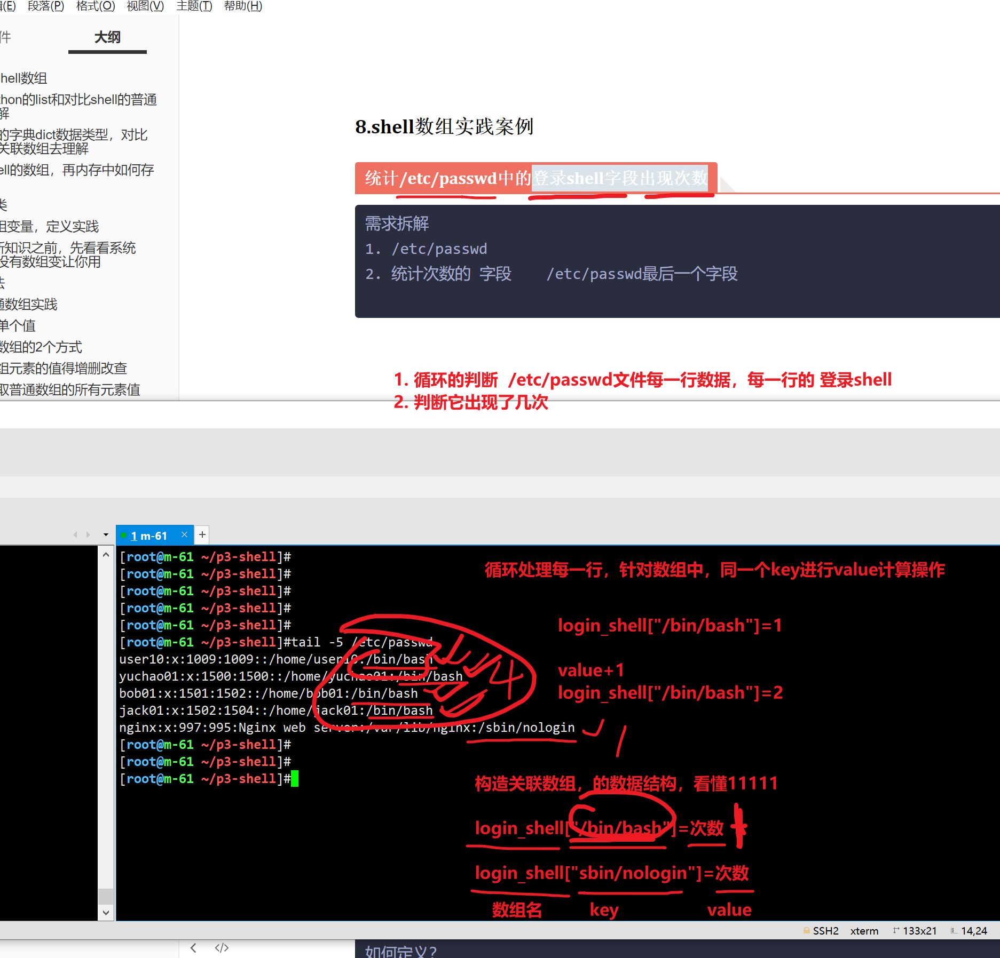


```
需求拆解
1. /etc/passwd
2. 统计次数的 字段    /etc/passwd最后一个字段

```

## 图解代码的执行


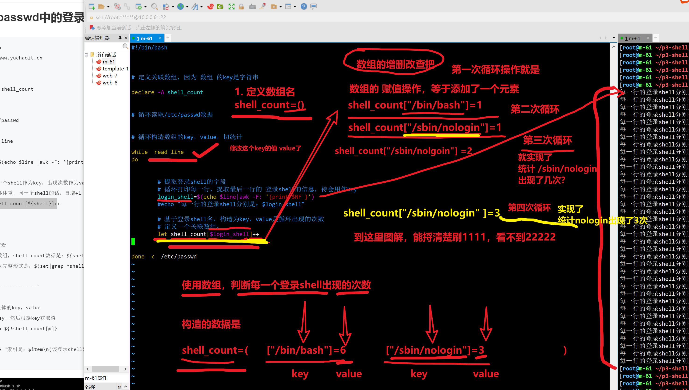


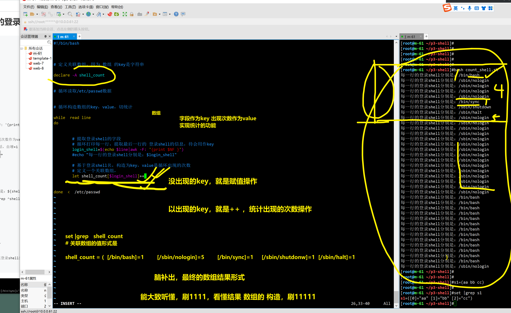


```bash
[root@m-61 ~/p3-shell]#cat count_shell.sh 
#!/bin/bash


# 定义关联数组，因为 数组 的key是字符串

declare -A shell_count


# 循环读取/etc/passwd数据


# 循环构造数组的key，value，切统计

while  read line
do


	# 提取登录shell的字段
	# 循环打印每一行，提取最后一行的 登录shell的信息，待会用作key
	login_shell=$(echo $line|awk -F: '{print $NF }')
	#echo "每一行的登录shell分别是：$login_shell"

	# 基于登录shell名，构造为key，value是循环出现的次数
	# 定义一个关联数组，
	let shell_count[$login_shell]++

done  <  /etc/passwd 


# 再循环外，打印这个数组变量，看看结果

# 如何打印这个数组，所有的元素呢？key 和value 都显示

# [/bin/bash]  出现了几次

# 先查看构造的这个数组是什么
echo $(set |grep shell_count)

# 循环打印
echo
echo

#先循环拿到所有key，然后根据key，再循环取值即可
for key in ${!shell_count[@]}
do
	echo "每一个key是：$key" 对应的出现次数是：${shell_count[$key]}

done

```


## 9.1 关于利用数组实现统计，这里的核心思路代码

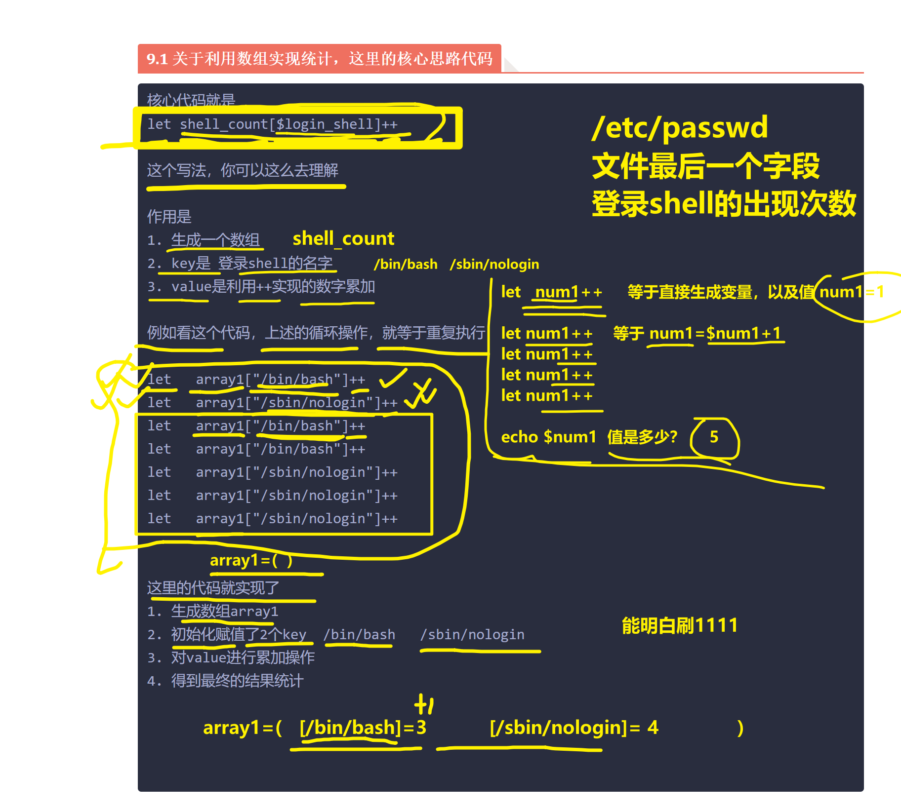


```
核心代码就是
let shell_count[$login_shell]++

这个写法，你可以这么去理解

作用是
1. 生成一个数组 
2. key是 登录shell的名字
3. value是利用++实现的数字累加

例如看这个代码，上述的循环操作，就等于重复执行

let   array1["/bin/bash"]++
let   array1["/sbin/nologin"]++
let   array1["/bin/bash"]++
let   array1["/bin/bash"]++
let   array1["/sbin/nologin"]++
let   array1["/sbin/nologin"]++
let   array1["/sbin/nologin"]++


这里的代码就实现了
1. 生成数组array1
2. 初始化赋值了2个key  /bin/bash   /sbin/nologin
3. 对value进行累加操作
4. 得到最终的结果统计


```


# 9.使用数组，实现对nginx进行日志统计分析


数组分析Nginx日志

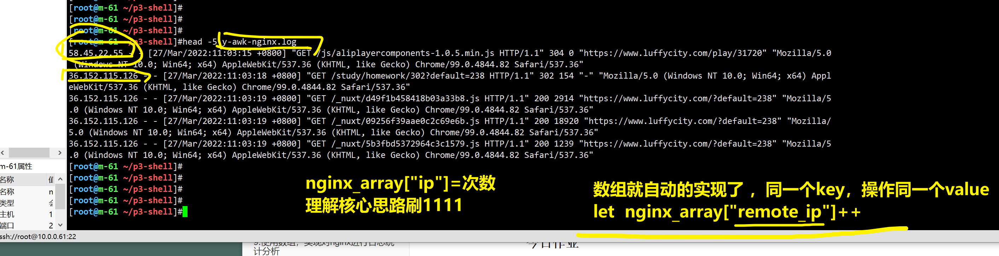


```bash
需求
1. 准备一个nginx大日志文件


2. 统计remote_ip 出现的次数


#!/bin/bash
# author: www.yuchaoit.cn
declare -A ip_count
exec < /var/log/nginx/www.yuchaoit.cn.log
while read line
do
    remote_ip=$(echo $line | awk '{print $1}')
    # 一样的套路，直接累加赋值
    let ip_count[$remote_ip]++
    # 写法一个意思
    # ip_count[$remote_ip]=$[ ip_count[$remote_ip] + 1]
done

for item in ${!ip_count[@]}
do
    echo -e "该IP: {$item}    出现的次数是：${ip_count[${item}]}"
done

```

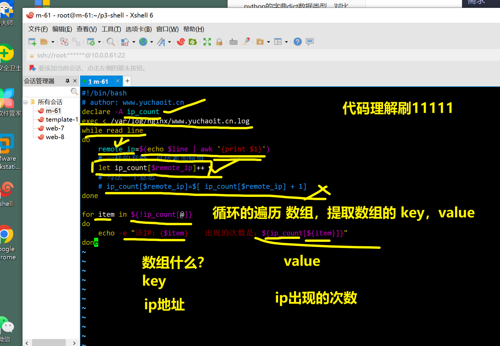

```
这个写法，效率极低

while 语句要循环读取50万行数据
while中，循环的对数组计算

总之，学shell编程的路还很长

1. 先玩懂语法，能写shell脚本，解决运维部署的问题即可，
还不用考虑性能

当你脚本，写了半年之后，你会理解到效率的问题


# linux中用time命令，可以计算程序执行的时间
# 得对日志减少量


```


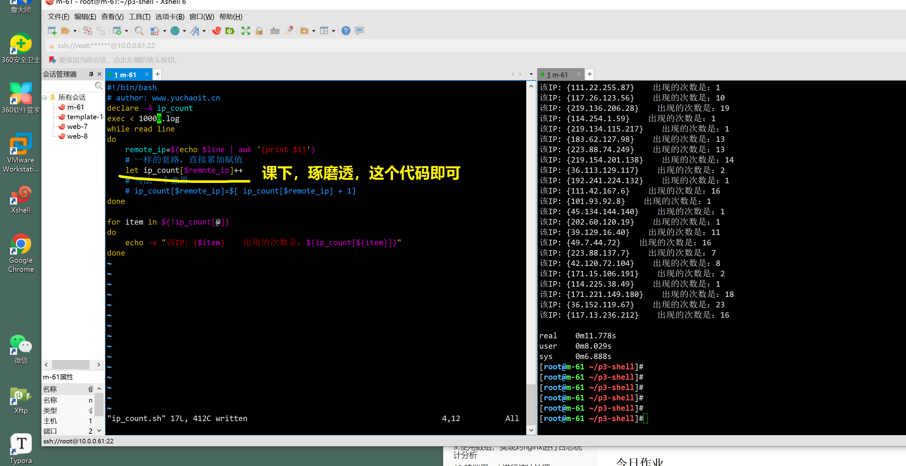


# 10.建议用awk进行统计处理

```
了解 shell执行效率
结合time命令


awk也支持数组计算功能，且awk是c开发的程序，效率天下第一

秒杀我们这个shell脚本 一万倍


```


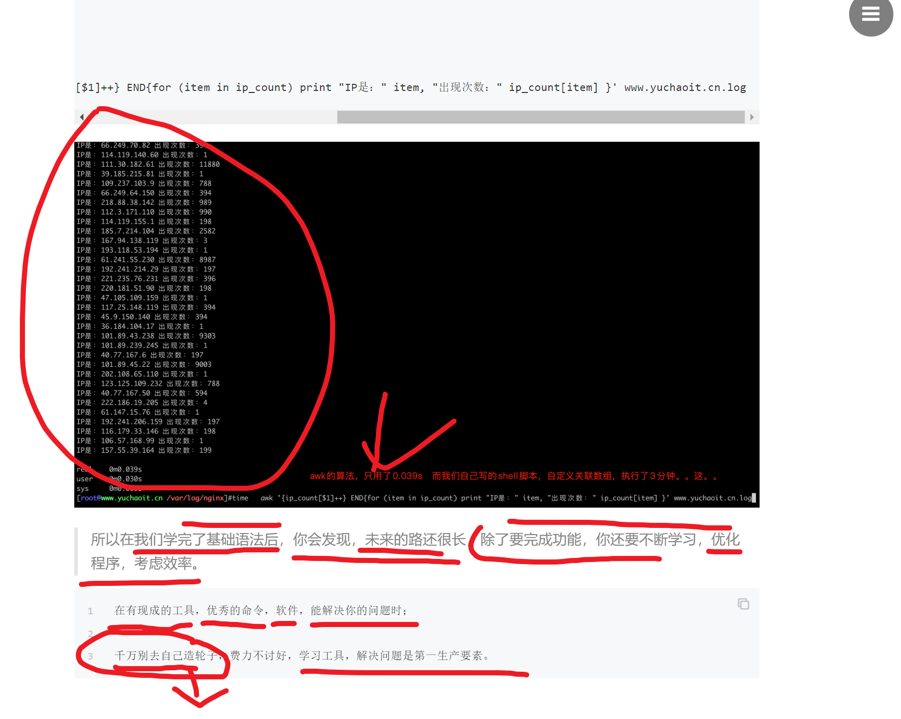


# 今日作业

```

1. 完成课堂所讲 shell数组操作，面试官会问
shell数组会用吗？
如何定义？
如何取值？
如何遍历？
你用数组完成过哪些任务？


2. 继续刷题，shell马上翻篇了，尽可能的多写写


```


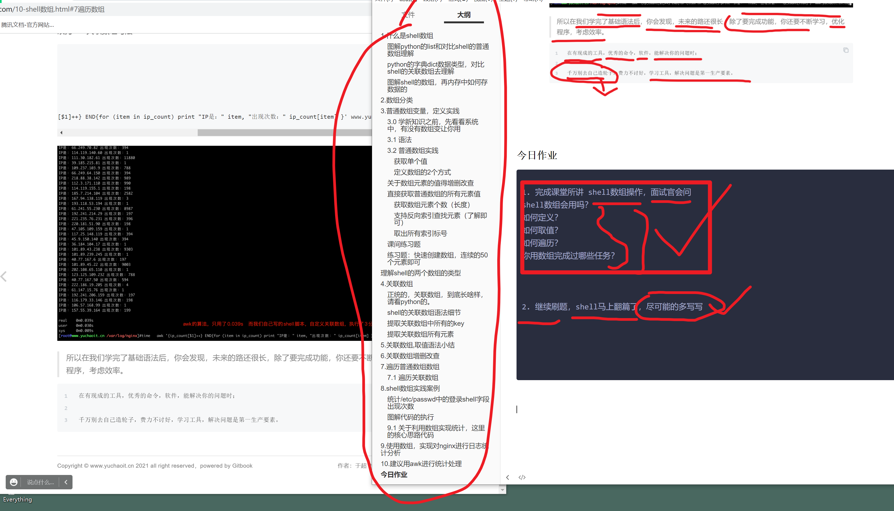


4点回教室练习。

下午有福利，早点来


