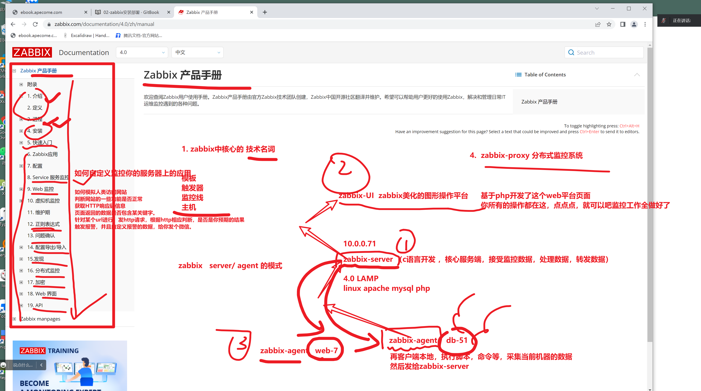
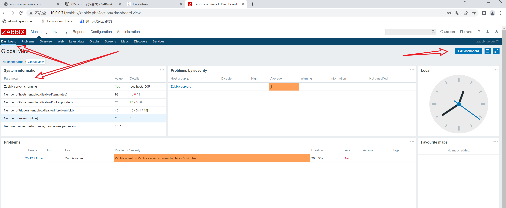
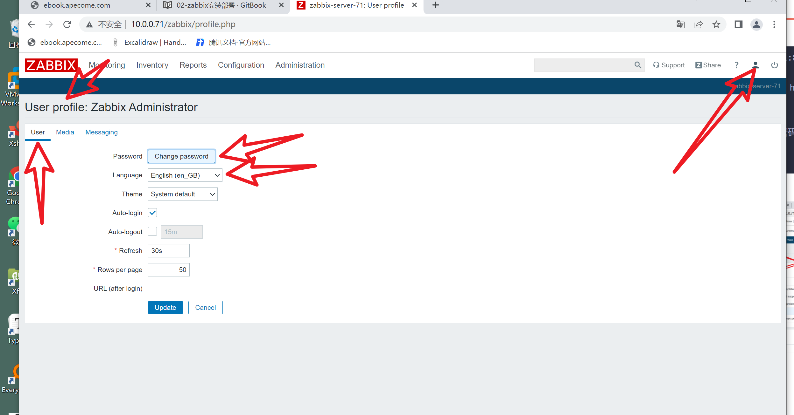
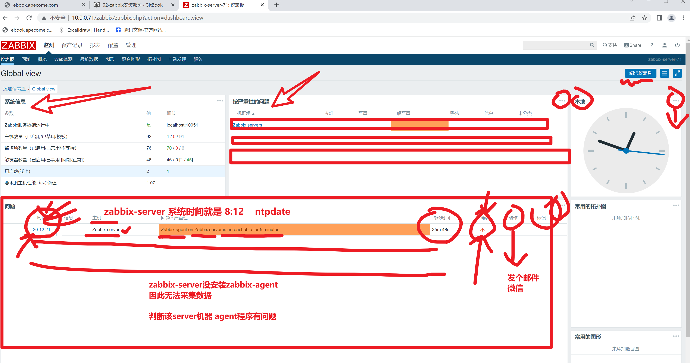
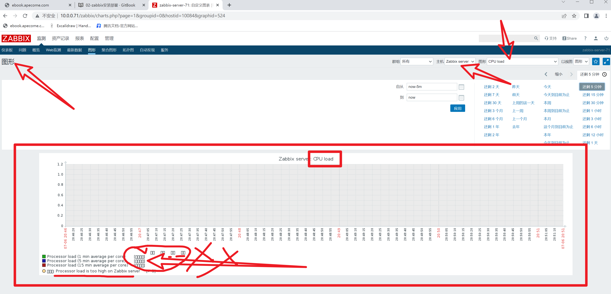
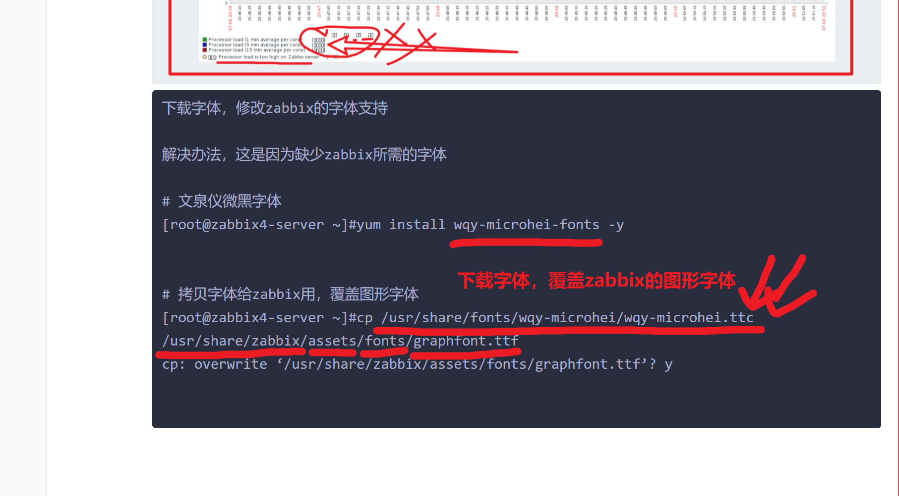
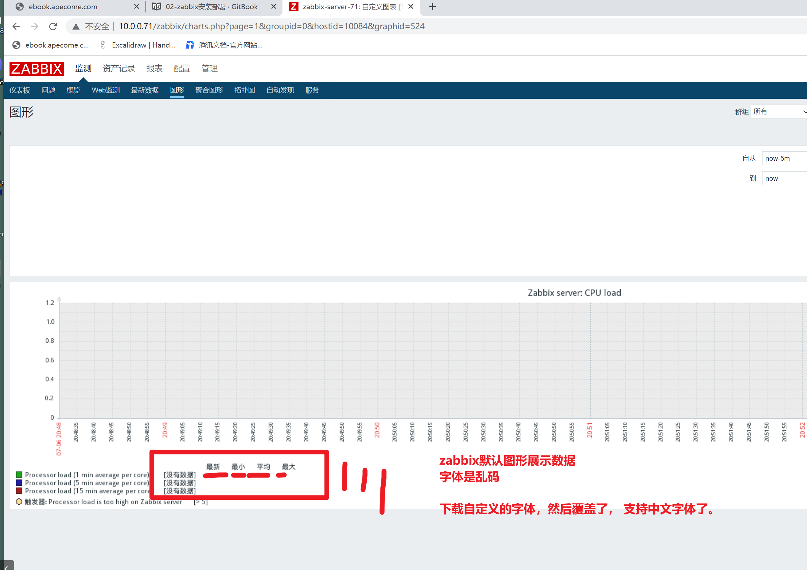

```### 此资源由 58学课资源站 收集整理 ###
	想要获取完整课件资料 请访问：58xueke.com
	百万资源 畅享学习

```





```
https://www.zabbix.com/documentation/4.0/zh/manual

zabbix-sever

zabbix-agent

```


# zabbix4.0服务端 部署全流程

建议你重新安装一个zabbix-server-71 ip


```bash
1.配置yum仓库
# 对应了nginx的location设置

https://mirrors.tuna.tsinghua.edu.cn/zabbix/zabbix/

# 安装俩zabbix.repo仓库文件而已

rpm -ivh https://mirrors.tuna.tsinghua.edu.cn/zabbix/zabbix/4.0/rhel/7/x86_64/zabbix-release-4.0-1.el7.noarch.rpm

# 改成清华的
sed -i 's#repo.zabbix.com#mirrors.tuna.tsinghua.edu.cn/zabbix#g' /etc/yum.repos.d/zabbix.repo

# 安装zabbix-server服务端，以及数据库
#  zabbix-server-mysql   以mysql作为存储开发的zabbix-server服务端程序
# zabbix-web-mysql 		php核心程序，zabbix-UI页面，也是以mysql为存储版本
# zabbix-agent		   采集客户端数据的核心程序 ，自己监控自己
# mariadb-server		安装mysql服务端程序

yum install -y zabbix-server-mysql zabbix-web-mysql zabbix-agent mariadb-server


# 启动mysql，切创建用户，待会用于和zabbix链接，以及创建zabbix库，存储数据。

启动mariadb数据库，设置开机自启
systemctl start mariadb && systemctl enable mariadb


3.设置mariadb数据库，创建zabbix库，存储监控数据，且创建账号

mysqladmin password linux0224
mysql -uroot -plinux0224 -e 'create database zabbix character set utf8 collate utf8_bin;'

# 创建用户账户，zabbix 密码是 linux0224
# 给与权限是，zabbix这个用户 ，对于zabbix这个库，下的所有表，都是最大权限
# 看懂数据库的操作 1111
mysql -uroot -plinux0224 -e "grant all privileges on zabbix.* to zabbix@localhost identified by 'linux0224';"

# 技巧，查找命令来自于哪个软件包，便于你去安装  1111
yum provides zcat 
yum install gzip -y


4.导入zabbix服务端的数据库内容
# 用zcat直接读取gz压缩包的数据，切管道符交给mysql命令导入数据，往zabbix库中导入数据
# 看懂11111
zcat /usr/share/doc/zabbix-server-mysql-4.0.42/create.sql.gz | mysql -uroot -plinux0224 zabbix


5. 修改zabbix-server服务端配置文件，指明自己的ip，便于agent去连接

cat > /etc/zabbix/zabbix_server.conf <<'EOF'
LogFile=/var/log/zabbix/zabbix_server.log
LogFileSize=0
PidFile=/var/run/zabbix/zabbix_server.pid
SocketDir=/var/run/zabbix
DBHost=localhost 
DBName=zabbix
DBUser=zabbix
DBPassword=linux0224
SNMPTrapperFile=/var/log/snmptrap/snmptrap.log
Timeout=4
AlertScriptsPath=/usr/lib/zabbix/alertscripts
ExternalScripts=/usr/lib/zabbix/externalscripts
LogSlowQueries=3000
EOF

# 配置文件里面，不支持中文，因此笔记自己看就行
LogFile=/var/log/zabbix/zabbix_server.log
LogFileSize=0
PidFile=/var/run/zabbix/zabbix_server.pid
SocketDir=/var/run/zabbix
DBHost=localhost   # 指明mysql的地址 zabboix-server mysql 
DBName=zabbix   # 数据库名字
DBUser=zabbix	# 数据库的链接用户  
DBPassword=linux0224  # 数据库密码
SNMPTrapperFile=/var/log/snmptrap/snmptrap.log
Timeout=4
AlertScriptsPath=/usr/lib/zabbix/alertscripts   # 存放自定义监控项脚本的目录 
ExternalScripts=/usr/lib/zabbix/externalscripts
LogSlowQueries=3000
EOF


6.服务端配置文件也写好了

systemctl start zabbix-server && systemctl enable zabbix-server


7.检查zabbix-server的端口是否运行  10051
[root@zabbix-server-71 ~]#netstat -tunlp|grep zabbix
tcp        0      0 0.0.0.0:10051           0.0.0.0:*               LISTEN      2145/zabbix_server  
tcp6       0      0 :::10051                :::*                    LISTEN      2145/zabbix_server  


至此，zabbix-server，服务端核心程序就装好了，以及zabbix-UI这个Php程序也装好了
但是还不能访问


```


## apache配置

只需要改一个时区设置，改为中国即可，因为你得让zabbix支持中文


```
[root@zabbix-server-71 ~]#grep -i shanghai /etc/httpd/conf.d/zabbix.conf 
        php_value date.timezone Asia/Shanghai

启动80端口的apache服务了

systemctl start httpd
```


## 测试apache装好后，是一个LAMP环境

```
基于phpinfo页面去测试，看是否能解析php代码

进入apache的默认网页根目录，存放html的地方


cd /var/www/html

php是什么时候装的？

zabbix-web-mysql  该程序 封装了 php程序   httpd程序

这里的部署，没有单独启动php进程，只是php解释器去执行代码了

php-fpm是2个意思 （php解释器去执行*.php代码）  基于fastcgi协议去运行的一个独立进程


```


## zabbix-UI前端配置


```
10.0.0.71:80/zabbix   访问改url才能访问zabbix

浏览器  > httpd  >  转发给底层处理php请求的模块


默认账户密码
Admin
zabbix
```





## 修改zabbix为中文语言







## 修改图形的数据展示（默认字体有问题）



```
下载字体，修改zabbix的字体支持

解决办法，这是因为缺少zabbix所需的字体

# 文泉仪微黑字体
[root@zabbix4-server ~]#yum install wqy-microhei-fonts -y


# 拷贝字体给zabbix用，覆盖图形字体
[root@zabbix4-server ~]#cp /usr/share/fonts/wqy-microhei/wqy-microhei.ttc /usr/share/zabbix/assets/fonts/graphfont.ttf 
cp: overwrite ‘/usr/share/zabbix/assets/fonts/graphfont.ttf’? y


```







## 补充知识，关于apache和zabbix是怎么结合的？

```bash
# LAMP
#  你访问zabbix 的图形化页面，用户> apache > php(zabbix图形化页面所有功能代码是php)


# 访问 web服务器入口  80端口，apache
# apache请求转发给php的模块去处理 


# 看apache配置文件就行了，你可以访问zabbix路由即可，apache自动加载php模块，解析请求

[root@zabbix4-server /var/www/html]#cat  /etc/httpd/conf.d/zabbix.conf 
#
# Zabbix monitoring system php web frontend
#

# 定义url别名，
# 10.0.0.71/zabbix  
# 等于 
Alias /zabbix /usr/share/zabbix

# 定义网页根目录的设置
# web服务器配置的参数意思，对比nginx的配置去理解即可
#这里是apache的知识点


<Directory "/usr/share/zabbix">
    Options FollowSymLinks
    
    AllowOverride None
    # 该目录的资料允许访问，
    Require all granted
    
	# apache代理php的配置区域
	# 用户请求的是php程序，就交给这里的 mod_php5.c 底层驱动去解析代码
	# 
    <IfModule mod_php5.c>
        php_value max_execution_time 300
        php_value memory_limit 128M
        php_value post_max_size 16M
        php_value upload_max_filesize 2M
        php_value max_input_time 300
        php_value max_input_vars 10000
        php_value always_populate_raw_post_data -1
        php_value date.timezone Asia/Shanghai
    </IfModule>
</Directory>

# 其他目录的访问权限设置，这些4个字母目录全部拒绝访问
<Directory "/usr/share/zabbix/conf">
    Require all denied
</Directory>

<Directory "/usr/share/zabbix/app">
    Require all denied
</Directory>

<Directory "/usr/share/zabbix/include">
    Require all denied
</Directory>

<Directory "/usr/share/zabbix/local">
	#     denied 都拒绝访问的意思
    Require all denied
</Directory>
```


## 今日作业

0. 整理监控体系的理论

1. 安装好zabbix-server，中文汉化，字体修改，确认可以访问

   2.预习下一篇博客


