```### 此资源由 58学课资源站 收集整理 ###
	想要获取完整课件资料 请访问：58xueke.com
	百万资源 畅享学习

```
# 1.知识点梗概

> 开始学习监控系统

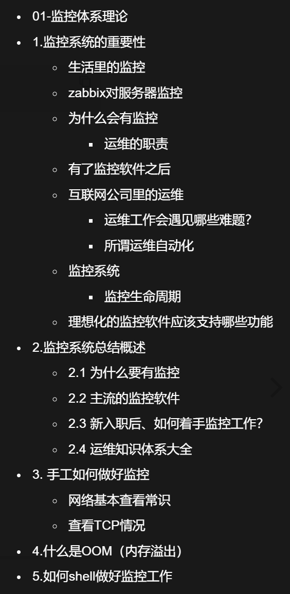


> 部署zabbix监控软件

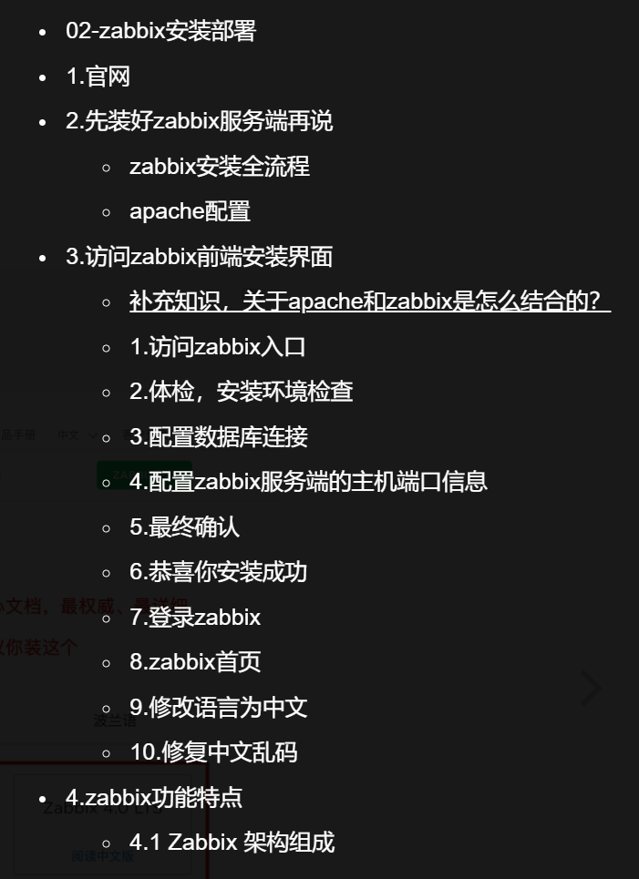


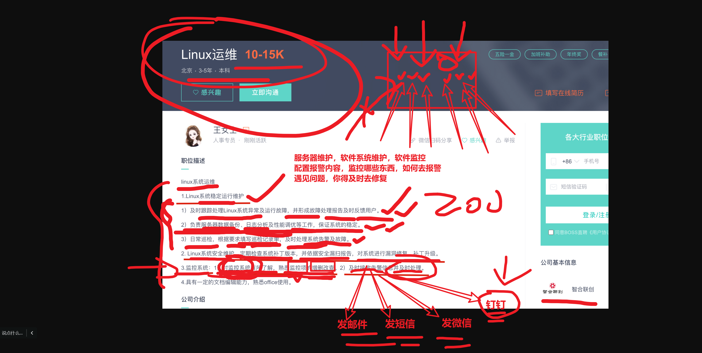


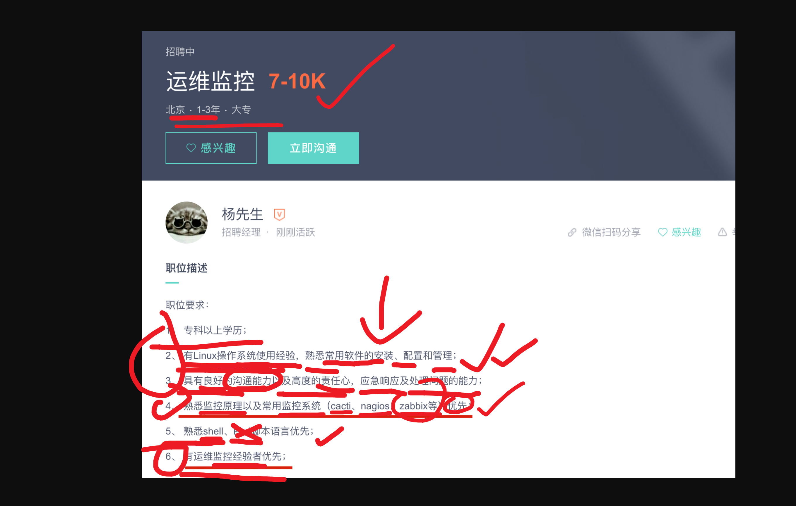

```

1. 无论是小公司，也会招聘专门的监控运维岗、或是对运维软件有一定的技术要求

2. 或者是大公司，假设北京总部有70个运维，里面可能有20个SRE高级运维，3个devops运维开发，3个监控运维（维护zabbix、prometheus）、剩下的就是桌面运维（维护硬件资产、发放笔记本、显示器、台式机，等工作）、或者IT机房硬件运维。

监控，是运维工作里的一大重要环节。
```

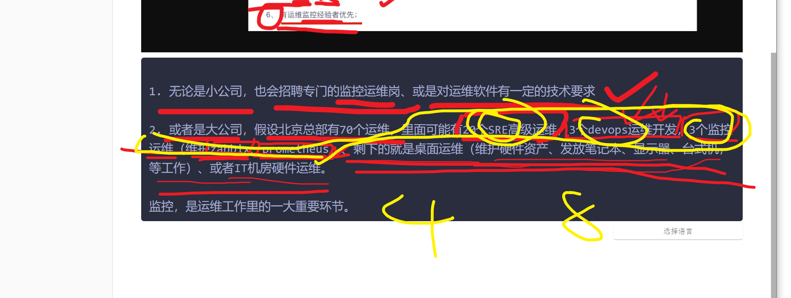


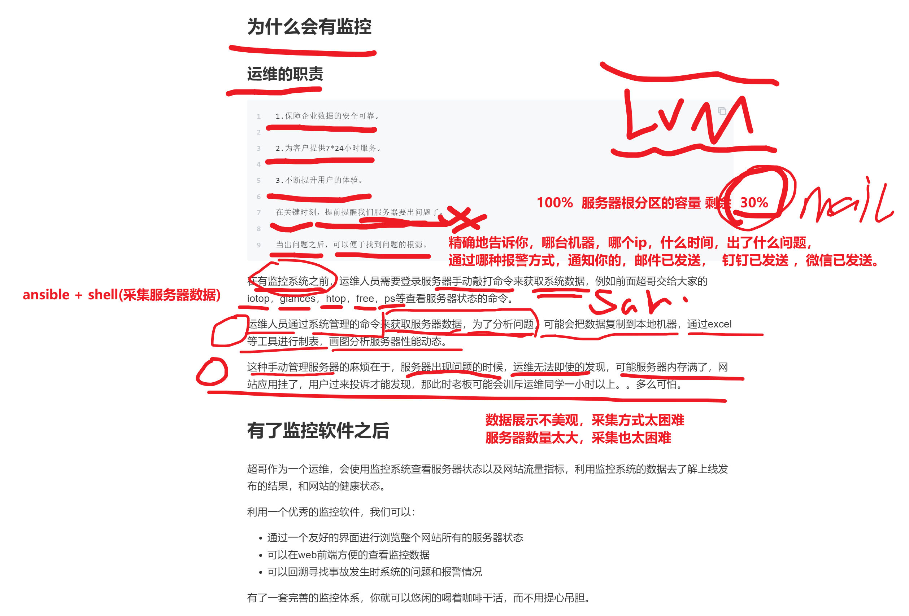

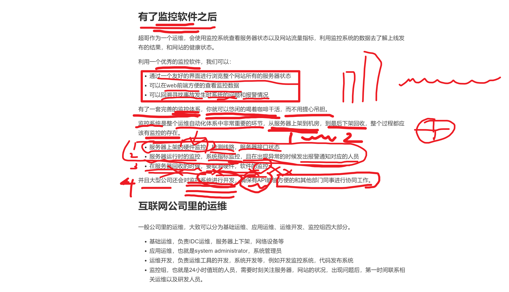


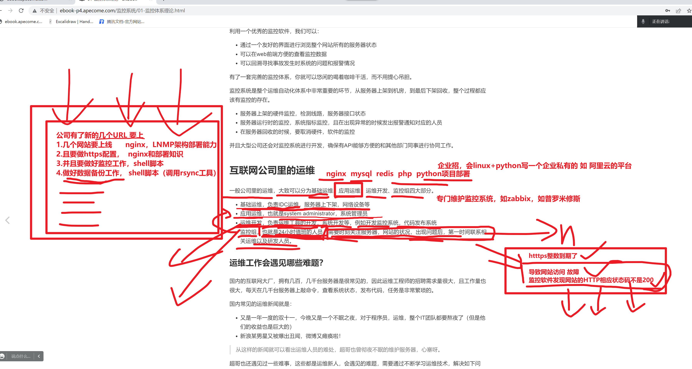


10: 30 继续

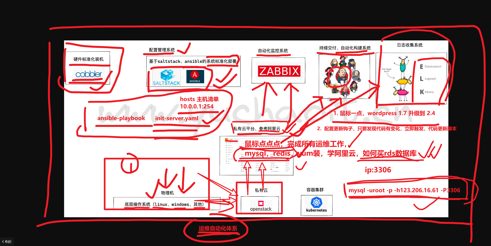


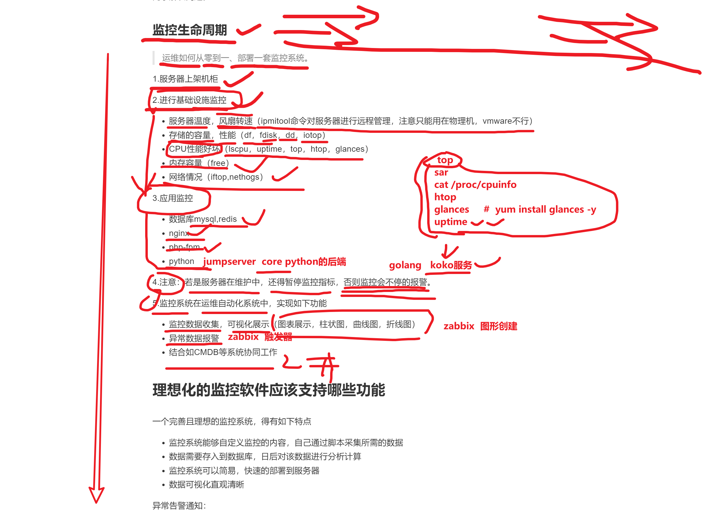


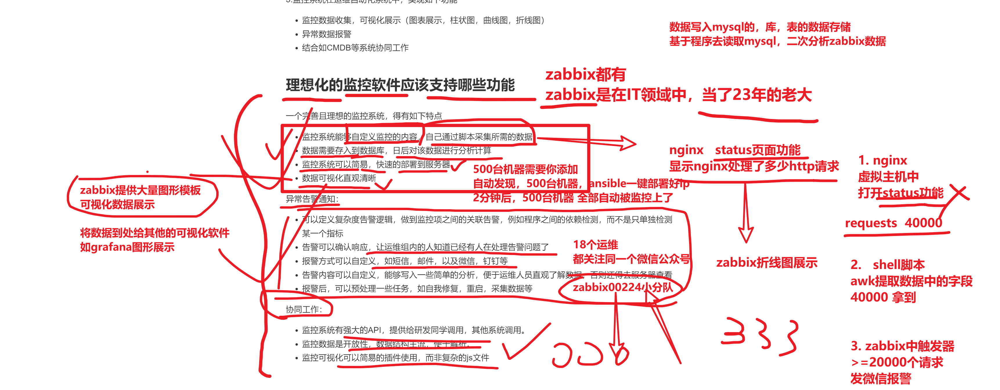

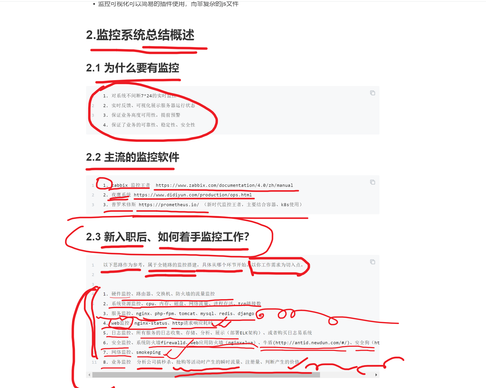


