```### 此资源由 58学课资源站 收集整理 ###
	想要获取完整课件资料 请访问：58xueke.com
	百万资源 畅享学习

```
# 今日内容

```bash
1. zabbix架构图，特点


2. zabbix核心知识点理念

3. zabbix快速添加agent（db51,db52），关联模板，查看最新数据

4. zabbix-get检查


5.zabbix添加web组（web7,web8），关联模板，图形查看

6,自定义监控项，报警动作


```


# 1.zabbix架构理念

Server 服务端

Zabbix Server 是 Zabbix 的核心组件，其功能为将 Agent 采集到的数据持久化 存储到数据库里。

数据库存储
存储所有由 Agent 采集到的数据，Zabbix 支持多种数据存储，例如:
Mysql,Oracle,PostgreSQL,Elasticsearch 等。

Web 界面
Zabbix 提供了友好的 Web 界面方便我们操作，Web 界面的运行环境可以是 Nginx+PHP或者Apache+PHP服务组成。

Web界面也是ZabbixServer的一部分。

Proxy 代理端
对于分布式环境，Zabbix 也提供了代理的方案，可以代替 Zabbie Server 收集 多个 Agent 的数据，然后在将收集到的数据汇总到 Zabbix Server，Proxy 可以 起到分担 Zabbix Server 负载的作用。

Agent 客户端
Zabbix Agent 被部署在需要监控主机上，用于采集监控数据并发送到 Zabbix Server 端。


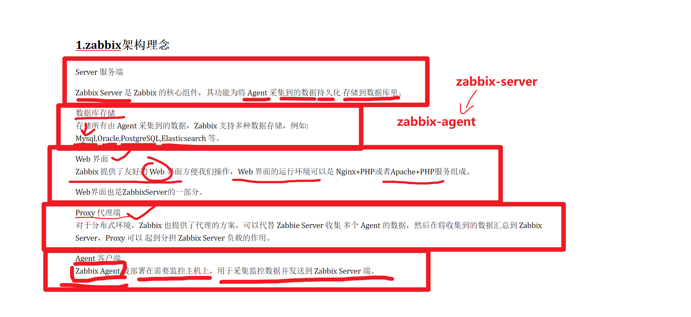


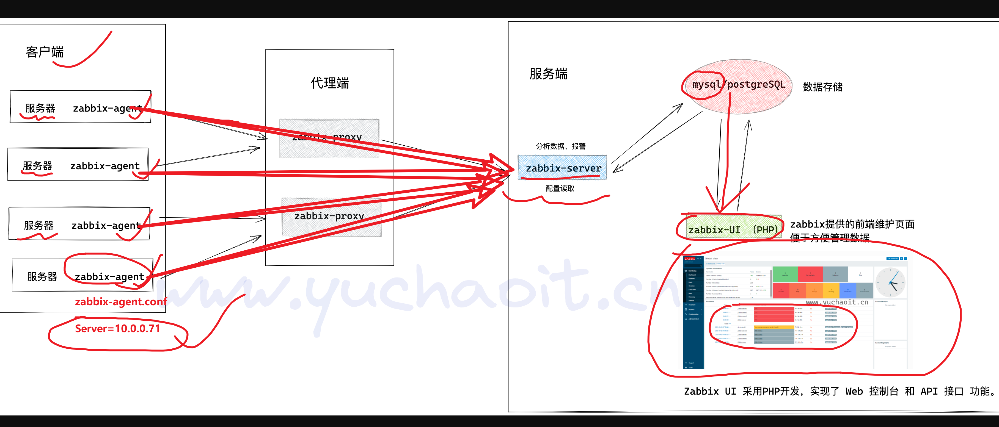


# 2. zabbix核心知识点理念


主机 ( HOST ) : 就是具体的一个监控对象，某一个被监控的实例，可以是一个数据库，也可以是一个操作系统。

模板 ( Template )：定义了具体一类监控对象的抽象，比如 Windows 模板，就是用来专门在监控Windows的时候，直接选择这个模板就可以实现开箱即用的数据采集。

监控项 ( ITEM )：监控项定义了具体的某一项采集指标，比如 CPU使用率，设备温度等，采集方式可以是多种支持的采集协议。

触发器 ( Trigger )：触发器是基于监控项存在的，通过WEB页面定义触发器表达式创建。比如 CPU温度大于90度，可以定义为：last(/zabbix_server/cpu_temp) > 90

动作 ( Action )：动作是基于触发器存在的，创建动作时可以选择具体的某个触发器，当触发器表达式满足要求时，会触发对应的Action执行，具体的动作定义可以执行 JavaScript，Shell脚本 等。

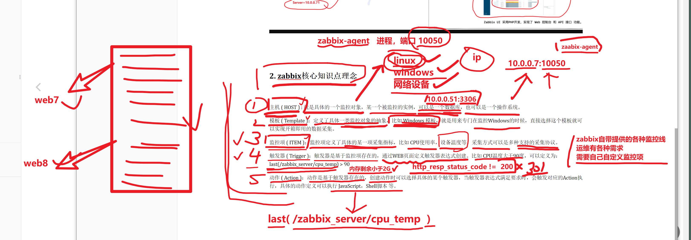


## 2.1 zabbix-server进程的作用

Zabbix Server 是 C 语言开发的 Zabbix 服务端，有着 强悍的采集和计算性能，而且资源使用率很低。主要的功能如下：

定时读取 Zabbix 数据库，同步 Zabbix UI 配置的信息到缓存，下发到 Zabbix Agent 或者 Zabbix Proxy。

关于这俩不同的采集进程，可以通过(ps -ef|grep zabbix 查看进程列表)

对于被动采集（主动和被动是从设备侧角度来看的）, Zabbix Server 会有专门的 Poller 线程去采集数据，可以定义特定的时间区间或者特定的频率。

对于主动采集，就是Agent或者设备主动上报数据，Zabbix Server 也会有专门的 Trapper 线程来接收数据，时间间隔或者频率取决于设备侧或者Agent上报配置。

接收到的历史数据（来自于 Agent、Proxy、设备侧），Zabbix Server 会缓存下来，进行告警表达式计算，进行动作触发，最终会同步到数据库的历史记录表，history开头的表。

````
调整zabbix的工作模式，为了性能

````


# 3.快速实践，zabbix添加主机去监控


## 3.1zabbix-server监控自己

给zabbix-server机器安装上agent进程，改配置，启动即可


```bash
1.修正时间
# 1.目标机器安装zabbix-agent 
rpm -ivh https://mirrors.tuna.tsinghua.edu.cn/zabbix/zabbix/4.0/rhel/7/x86_64/zabbix-agent-4.0.11-1.el7.x86_64.rpm

# 友情提醒，先做好时间同步！！
ntpdate -u ntp.aliyun.com


# 2.修改zabbix-agent配置文件

官网资料，关于配置文件的解释
https://www.zabbix.com/documentation/4.0/zh/manual/appendix/config/zabbix_agentd


修改配置如下，保证和我一样先
[root@web-7 ~]#grep -E '^[a-Z]' /etc/zabbix/zabbix_agentd.conf 
PidFile=/var/run/zabbix/zabbix_agentd.pid 
LogFile=/var/log/zabbix/zabbix_agentd.log
LogFileSize=0
Server=10.0.0.71
Include=/etc/zabbix/zabbix_agentd.d/*.conf


3.启动agent
[root@web-7 ~]#systemctl start zabbix-agent 
[root@web-7 ~]#systemctl enable zabbix-agent
Created symlink from /etc/systemd/system/multi-user.target.wants/zabbix-agent.service to /usr/lib/systemd/system/zabbix-agent.service.
[root@web-7 ~]#


4.检查,agent的端口是10050
[root@web-7 ~]#netstat -tunlp|grep zabbix
tcp        0      0 0.0.0.0:10050           0.0.0.0:*               LISTEN      1644/zabbix_agentd  
tcp6       0      0 :::10050                :::*                    LISTEN      1644/zabbix_agentd


5. 小结
zabbix-server 地址是 10.0.0.71::10051

zabbix-agent 地址是 10.0.0.71:10050


```


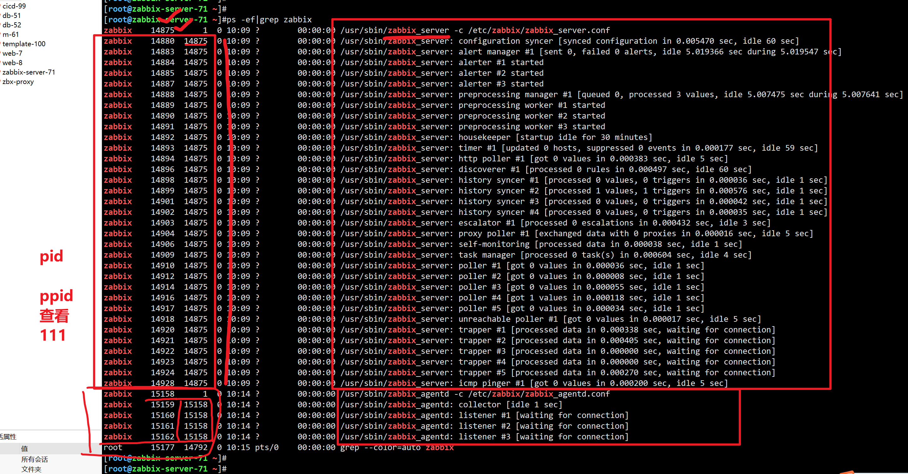


## 3.2agent装好后，查看最新数据

```
zabbix-agent装好之后，就已经有了采集数据的功能
继续来看zabbix-UI的操作，如何查看到采集了什么数据

```


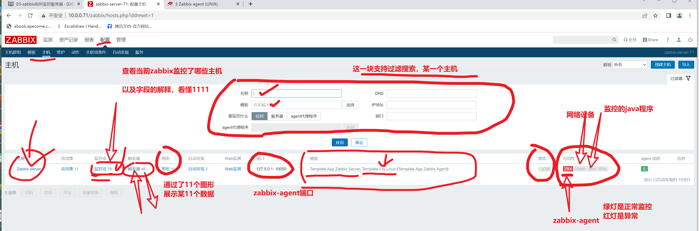


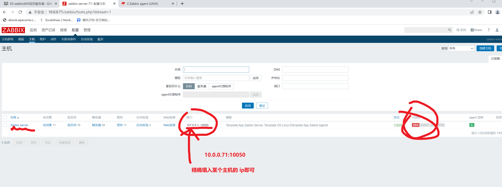


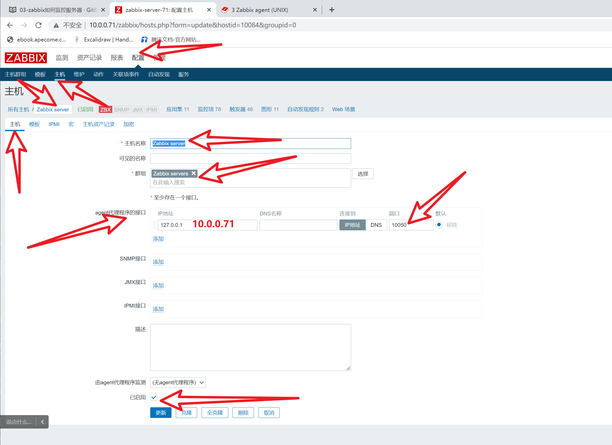


## 3.3 同样的操作，添加db-51机器，作为练习，db51,db-52都给监控上即可

1. 先在服务器上做好agent的安装配置切动

```


rpm -ivh https://mirrors.tuna.tsinghua.edu.cn/zabbix/zabbix/4.0/rhel/7/x86_64/zabbix-agent-4.0.11-1.el7.x86_64.rpm

ntpdate -u ntp.aliyun.com

cat >  /etc/zabbix/zabbix_agentd.conf  <<'EOF'
PidFile=/var/run/zabbix/zabbix_agentd.pid 
LogFile=/var/log/zabbix/zabbix_agentd.log
LogFileSize=0
Server=10.0.0.71
Include=/etc/zabbix/zabbix_agentd.d/*.conf
EOF


systemctl start zabbix-agent  && systemctl enable zabbix-agent

# 检查
netstat -tunlp|grep zabbix
```

2.去zabbix-UI界面去添加了

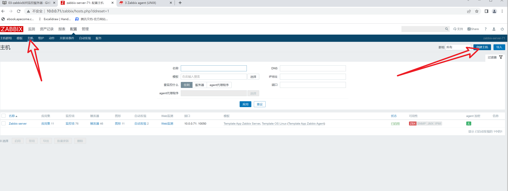

3.添加一个db-server组，专门管理都是数据库的服务器组

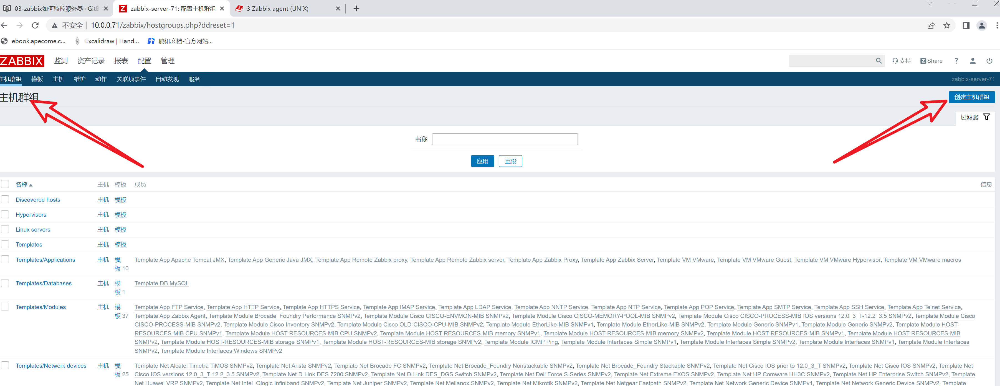


4.添加完毕db-51主机

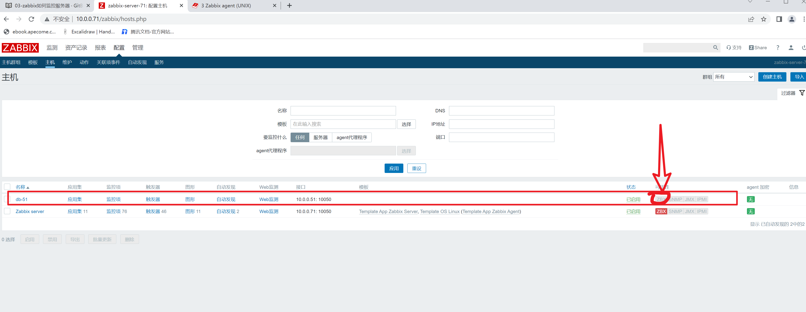

5.查看最新数据，是否能拿到数据，这2个机器，默认都有了监控项 了，因此是会有采集的数据目标的

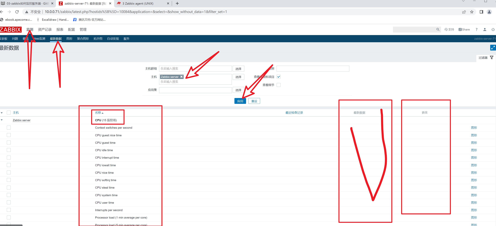


练习，添加3个机器，采集三个机器的信息，确保再最新数据里可以看到 内容

```
zabbix-server
db-51
db-52
三个主机监控加上。


```

## 3.4 添加db-52的全部操作

务必确保时间正确

linux机器的操作就没问题了

```


rpm -ivh https://mirrors.tuna.tsinghua.edu.cn/zabbix/zabbix/4.0/rhel/7/x86_64/zabbix-agent-4.0.11-1.el7.x86_64.rpm

ntpdate -u ntp.aliyun.com

cat >  /etc/zabbix/zabbix_agentd.conf  <<'EOF'
PidFile=/var/run/zabbix/zabbix_agentd.pid 
LogFile=/var/log/zabbix/zabbix_agentd.log
LogFileSize=0
Server=10.0.0.71
Include=/etc/zabbix/zabbix_agentd.d/*.conf
EOF


systemctl start zabbix-agent  && systemctl enable zabbix-agent

# 检查
netstat -tunlp|grep zabbix

```

zabbix-UI操作

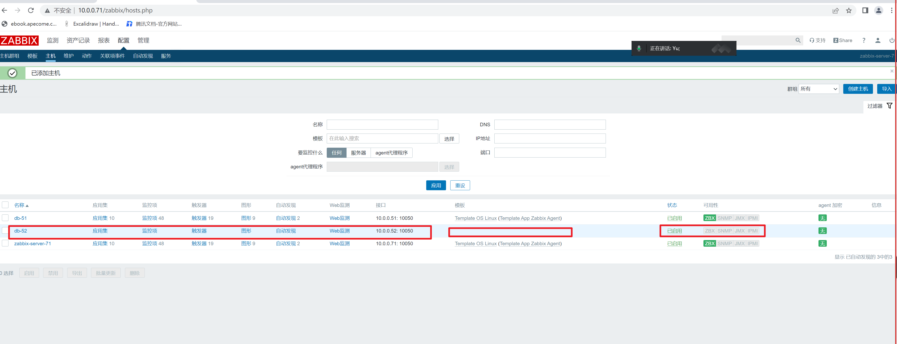


## 3.5 安装zabbix-get命令，检测是否通信了

从2个角度，验证server和agent是否通信

角度1，看日志

```
[root@db-52 ~]#
[root@db-52 ~]#tail -f /var/log/zabbix/*
  1592:20220707:110151.706 **** Enabled features ****
  1592:20220707:110151.706 IPv6 support:          YES
  1592:20220707:110151.706 TLS support:           YES
  1592:20220707:110151.706 **************************
  1592:20220707:110151.706 using configuration file: /etc/zabbix/zabbix_agentd.conf
  1592:20220707:110151.706 agent #0 started [main process]
  1593:20220707:110151.707 agent #1 started [collector]
  1594:20220707:110151.707 agent #2 started [listener #1]
  1595:20220707:110151.707 agent #3 started [listener #2]
  1596:20220707:110151.708 agent #4 started [listener #3]

```


角度2，zabbix-aget命令

```
[root@zabbix-server-71 ~]#yum install zabbix-get -y
Loaded plugins: fastestmirror
Loading mirror speeds from cached hostfile
 * base: mirrors.aliyun.com
 * extras: mirrors.aliyun.com
 * updates: mirrors.aliyun.com
Package zabbix-get-4.0.42-1.el7.x86_64 already installed and latest version
Nothing to do


通过自带的zabbix key 检查 server和agent是否通信

[root@zabbix-server-71 ~]#zabbix_get  -s 10.0.0.52  -k  agent.ping 

```


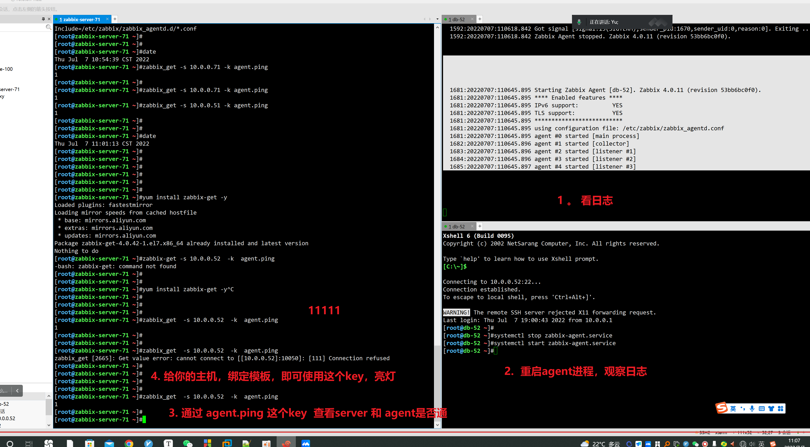


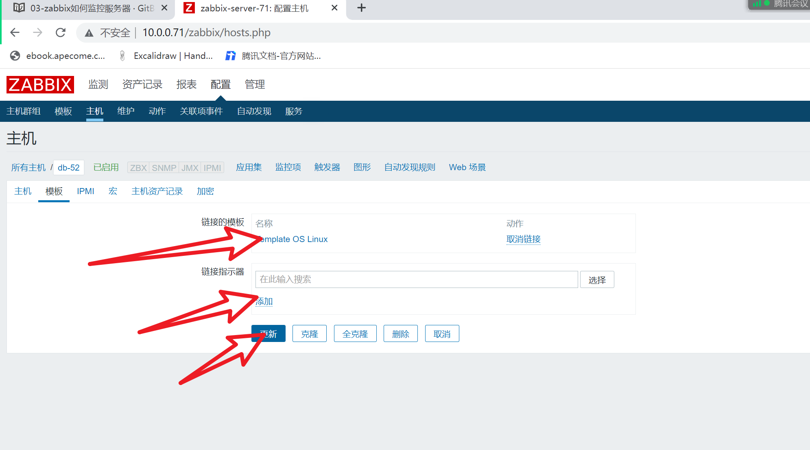


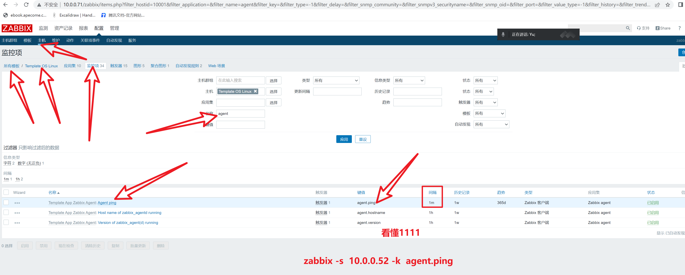


### 3.5.1 模板、监控项图解，以及结合zabbix_get命令

### 描述，模板和监控项的关系


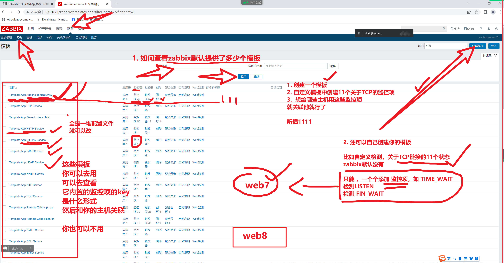


## 拿默认的 os linux模板举例，详解

```
一般去检测linux服务器，
默认直接用 templates os linux模板就很好用了
基本的需求，监控内容，都包含了


```


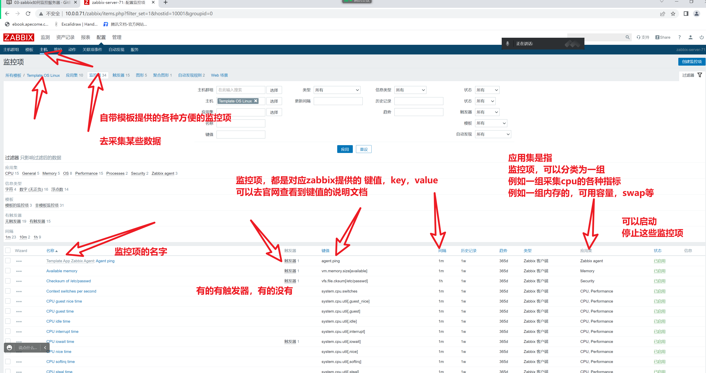

```
玩zabbix的流程就是如下，以及拍错的流程也是如下

如何部署，且检查agent的流程


1. 安装agent，检查配置文件，启动

2. zabbix-server 通过zabbix_get 检测，agent.ping 是否通信 （这就等于命令行版本的监控，采集数据了）

2.1 这个zabbix_get -k agent.ping 再图形化页面上的表现，就是 
模板 > 

3. 去图形化版本添加主机等信息


```

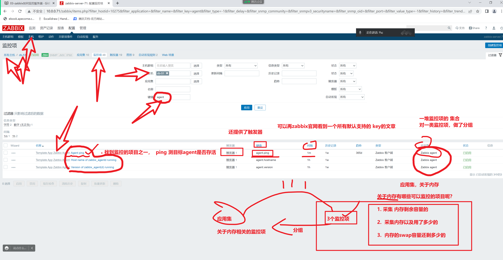


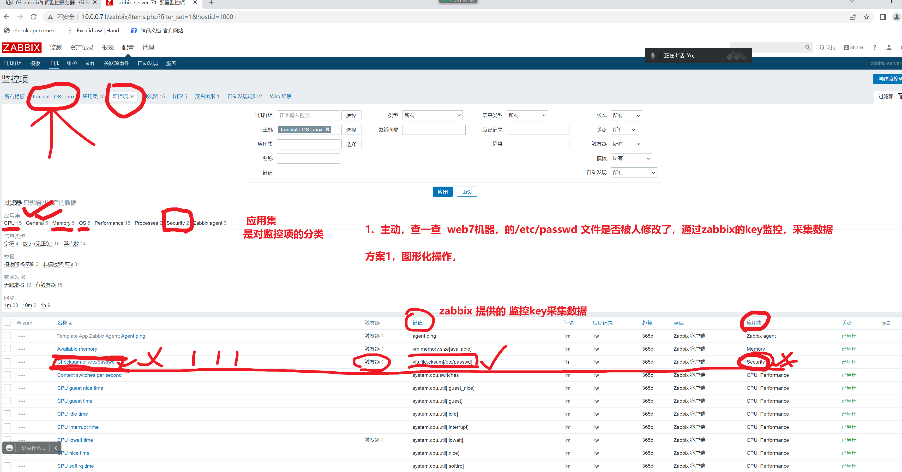


### 基于命令行，主动采集数据

```
zabbix_get  -s 目标agent的地址  -k  zabbix提供的key，或者自定义的key

```


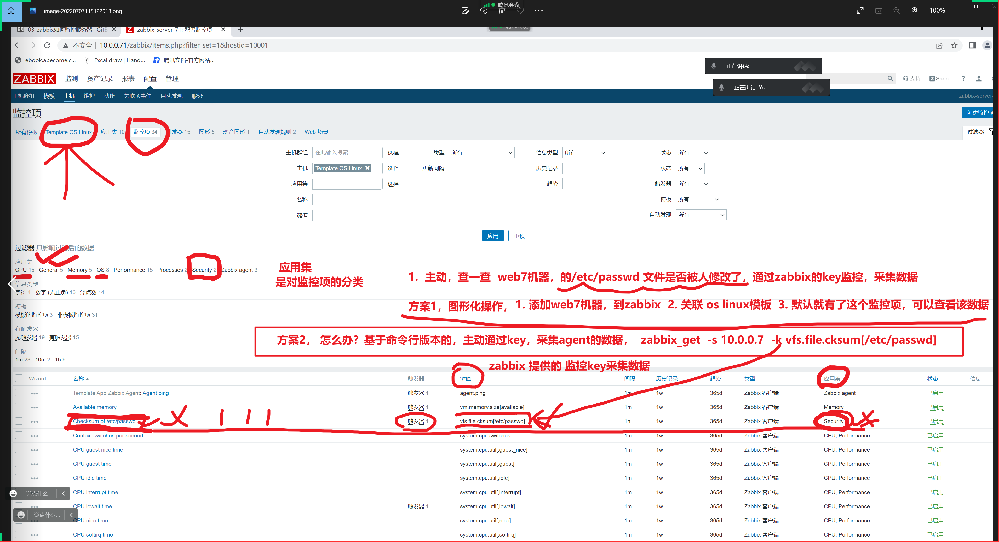


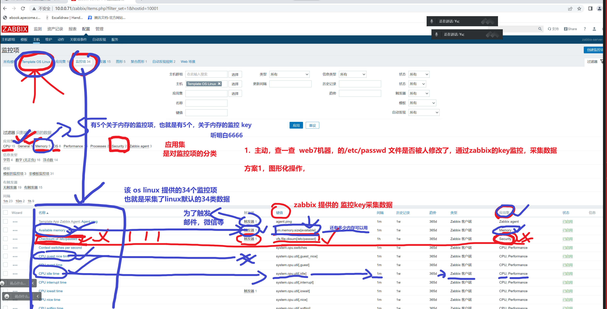


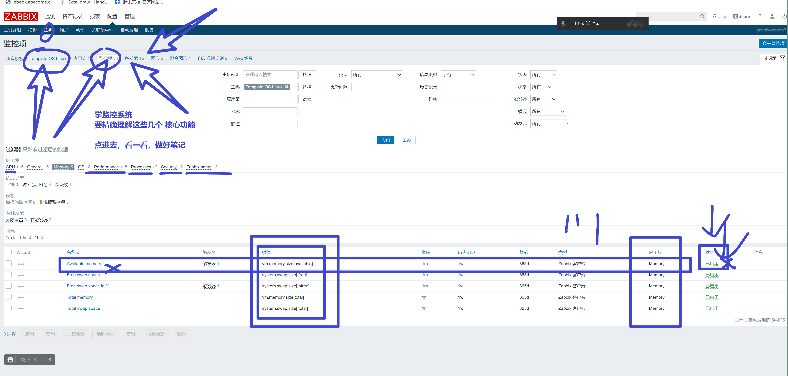


## 3.6 亮灯之后，就表示server 和agent通信了


此时即可查看图形、最新数据等了


### 图形只查看db-51的图形采集数据

数据可视化


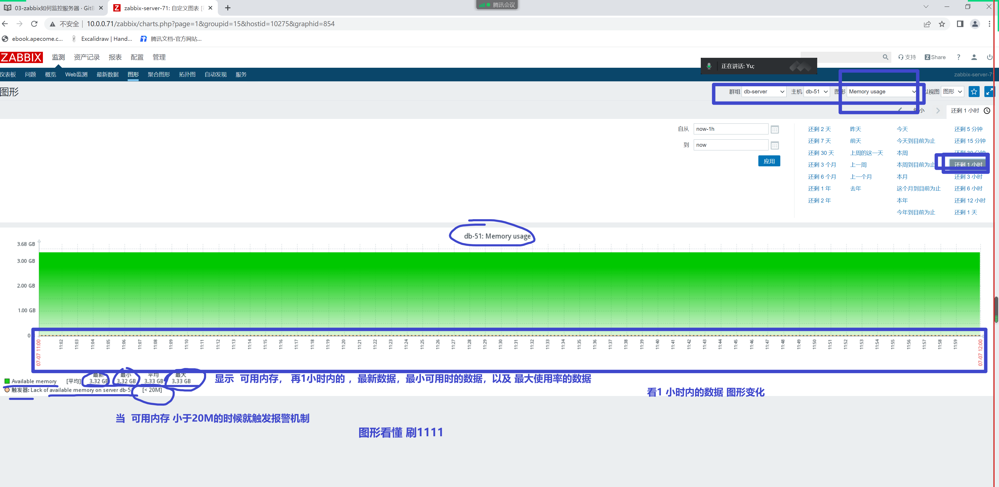


```
展示5分钟内，db-52机器的 cpu动态

```

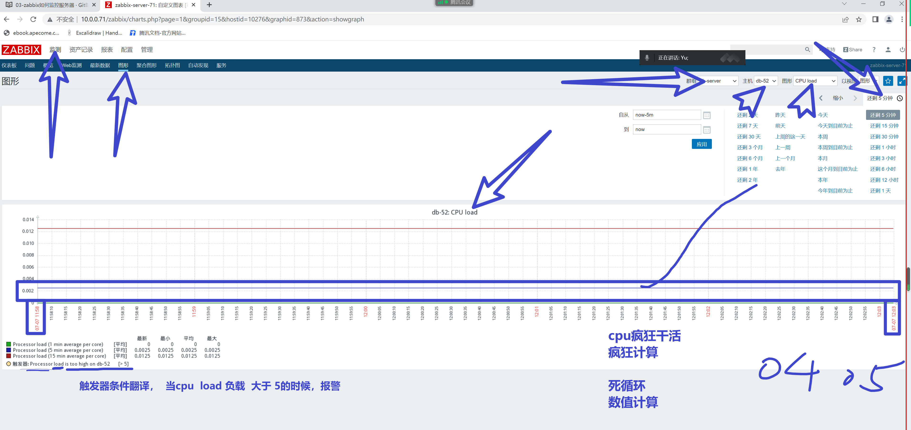


```
while的死循环


```


### 最新数据

```
一般，监控完毕某个主机之后，
为了确认监控项，是否拿到数据，立即去看 最新数据功能即可


看一看，zabbix-server机器，目前登录了几个用户的最新数据，安全相关


```

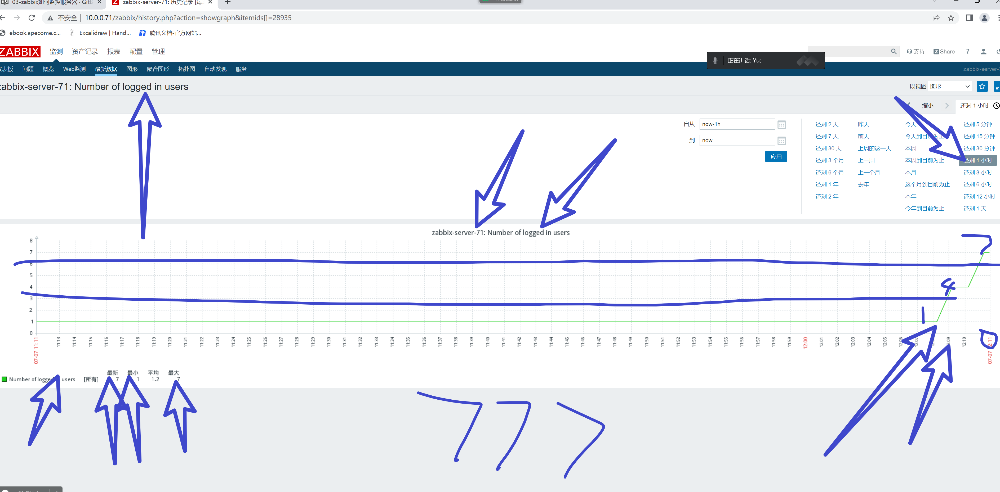


# 4.除了自带的模板，提供的各种监控项，可以获取的数据，也支持自定义


# 5.邮件报警


###  今日作业

```
1. zabbix-server上至少检测5台linux机器

2. 务必搞懂，配置 > 主机 > 应用集 > 监控项 > 触发器 > 图形  >接口 > 模板 > 状态 
这些功能是干啥的
再zabbix-UI界面上，点点点，多看看


3. 截图，查看5台机器的

Security 应用集的最新数据
Processes 应用集的最新数据


以及如何通过命令行，采集Security 应用集 的数据，（5台机器）
以及如何通过命令行，采集目标机器有多少个进程  （5台机器）


```


