```### 此资源由 58学课资源站 收集整理 ###
	想要获取完整课件资料 请访问：58xueke.com
	百万资源 畅享学习

```


# 下午内容

- 除了自带的模板，提供的各种监控项，可以获取的数据，也支持自定义

- 完成自定义TCP链接状态的监控（学习如何自定义监控项，自定义你要监控的内容玩法）
- 完成触发器设置

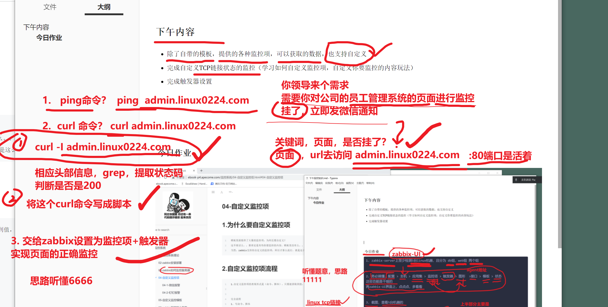


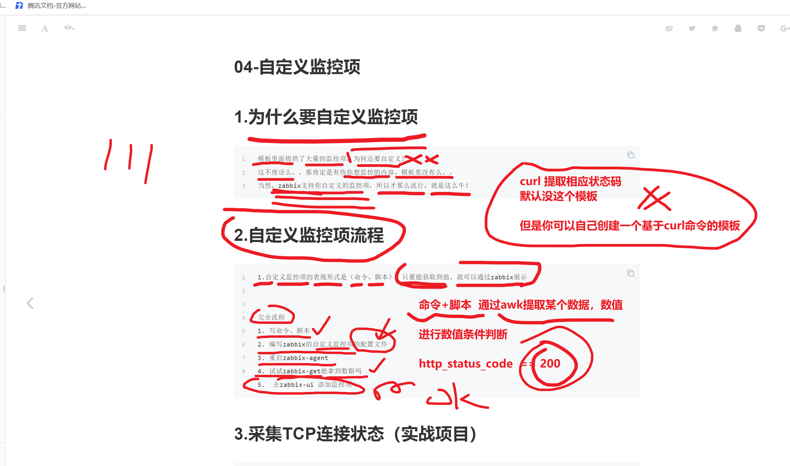


# 实战案例，tcp的11个状态监控

```
你要学会这个实战之后，理解自定义监控需求的操作流程

完成更多其他的操作，其实操作都一样
只不过第一步的 命令采集的数据不一样的而已。


精确分析tcp连接状态，可以精准得知服务器的链接情况，确保web服务器的健康


1. 想采集tcp状态，你的linux基本功得过关
1. 命令获取tcp的状态

[root@web-7 ~]#

linux下的socket是什么作用？

ip:port  网络套接字链接，2台机器之间建立的链接，称之为socket链接

机器A                    访问机器B的 nginx

机器A-ip:随机端口
10.0.0.7:44154     >     10.0.0.8:80

这就是一个socket链接记录，可以通过netstat看到，是谁，连接了web8这个机器
听懂1111


# -a 显示所有socket、-t显示tcp协议连接  -n 只显示ip（系统打印主机名）
[root@web-7 ~]#netstat -ant


```

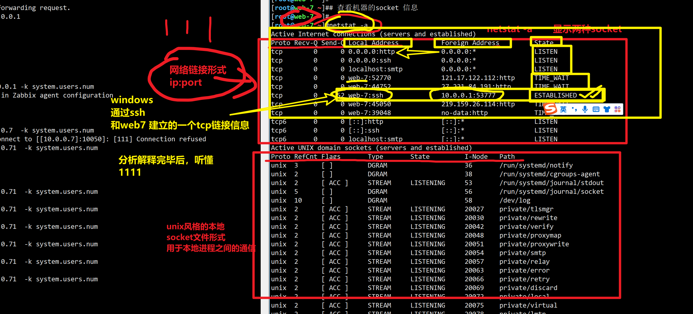


只显示，tcp，和ip的信息

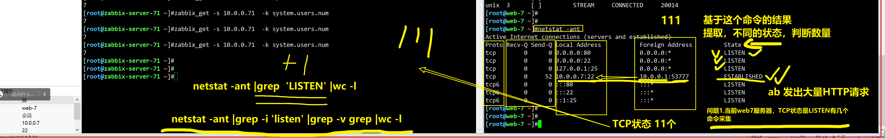


## zabbix自定义监控11种TCP状态全操作

```bash
1. 思考清楚，11种状态如何采集的命令

netstat -ant |grep -c 'TCP状态'

2. 编写zabbix-agent的配置文件，自定义key的配置文件

# 给了大家3种TCP状态的采集写法，作为参考

cat >/etc/zabbix/zabbix_agentd.d/tcp_status.conf <<'EOF'
UserParameter=LISTEN,netstat -ant|grep -c LISTEN
UserParameter=TIME_WAIT,netstat -ant|grep -c TIME_WAIT
UserParameter=ESTABLISHED,netstat -ant|grep -c ESTABLISHED
EOF


重启agent
systemctl restart zabbix-agent.service 


去服务端zabbix_get 验证下


[root@zabbix-server-71 ~]#zabbix_get -s 10.0.0.7 -k LISTEN
8
[root@zabbix-server-71 ~]#
[root@zabbix-server-71 ~]#zabbix_get -s 10.0.0.7 -k TIME_WAIT
1
[root@zabbix-server-71 ~]#
[root@zabbix-server-71 ~]#zabbix_get -s 10.0.0.7 -k ESTABLISHED
2


确认OK后 ，即可去web页面，添加监控项，采集数据了


但是，建议用如下优化写法，传参形式，一个配置文件语法，即可提取11种状态的值
否则你的配置文件就得写11行，有点搓。

#zabbix配置文件，支持传参的用法
cat > /etc/zabbix/zabbix_agentd.d/tcp_status.conf <<'EOF'
UserParameter=tcp_status[*],netstat -ant|grep -c $1
EOF


```

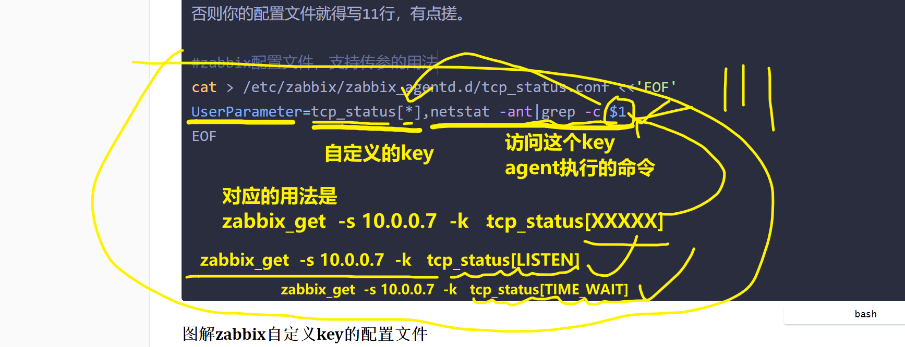


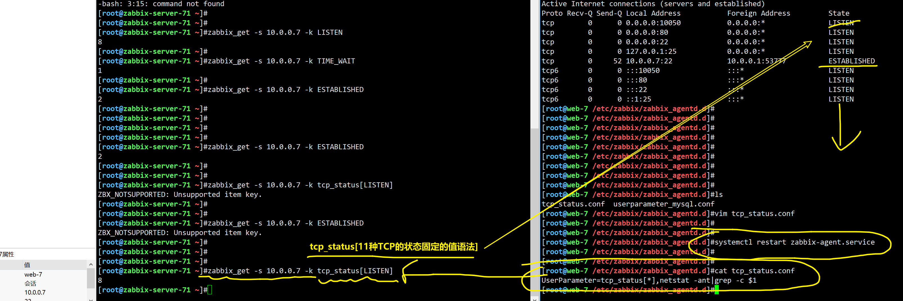


### 图解zabbix自定义key的配置文件

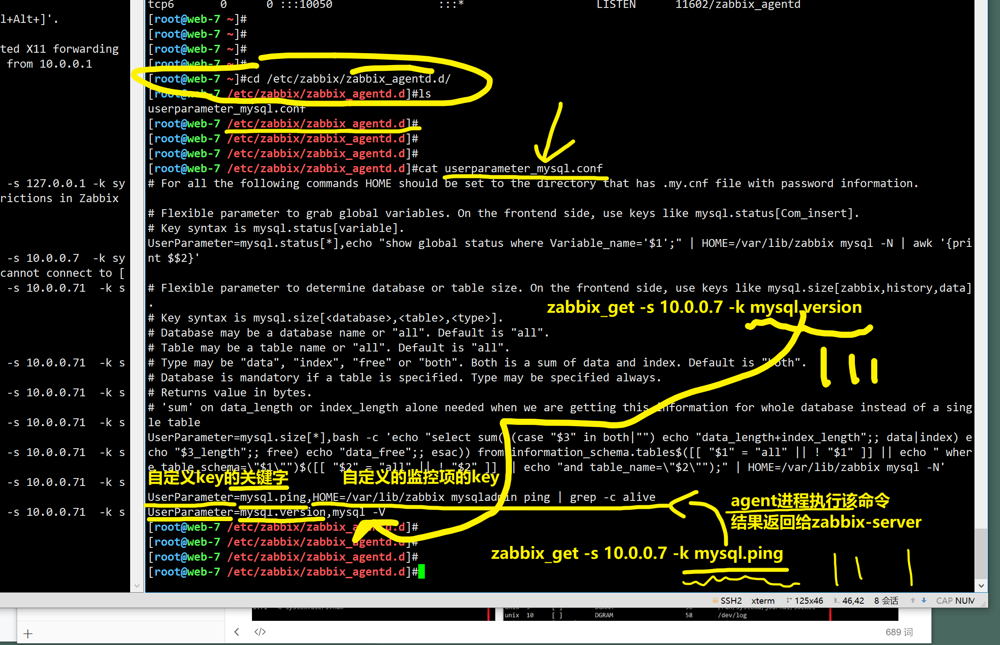


## 图形化zabbix添加监控项，监控TCP的状态(web7添加监控项)

web7

web8

web9


```
讲道理，应该这么玩

1. 添加模板，模板中包含了11个监控项（TCP11个状态）
2. 哪台机器想检测这个TCP的数据，就和这个模板关联即可

思路听懂1111


但是咱现在由简到难，先对一个单独的机器添加即可

1. 配置选项卡
2. 点击主机
3. 给web7机器添加监控项（自定义的监控项即可）
4. 给web7添加三种TCP状态的监控项，作业是自己完成11种的添加
LISTEN
TIME_WAIT
ESTABLISHED


```

### 图形化添加监控项的步骤

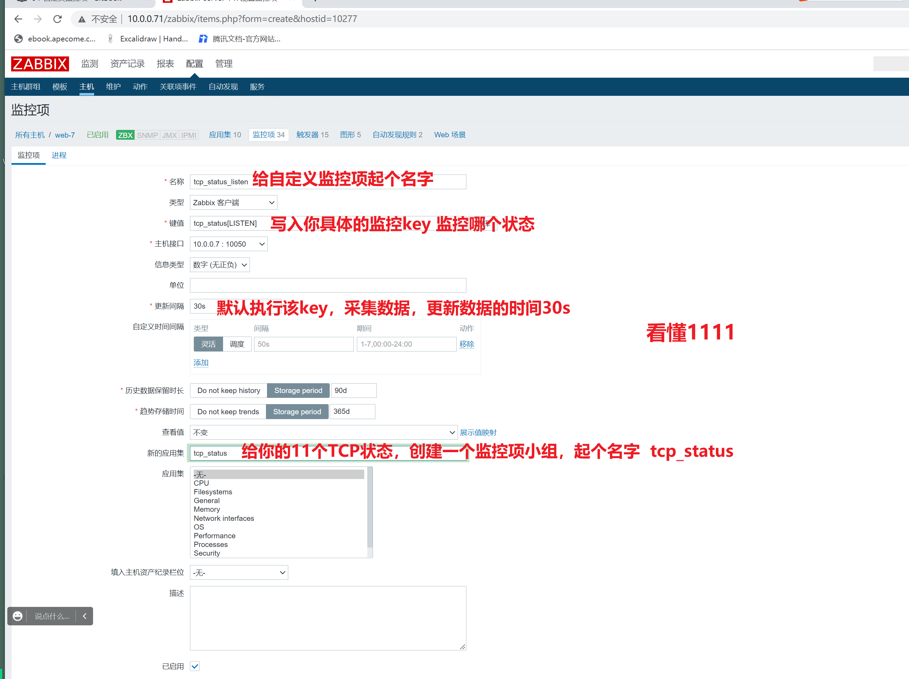


## 克隆监控项

针对LISTEN状态的监控项，直接克隆，修改key值即可，加上TIME_WAIT 和 ESTABLISHED俩状态。

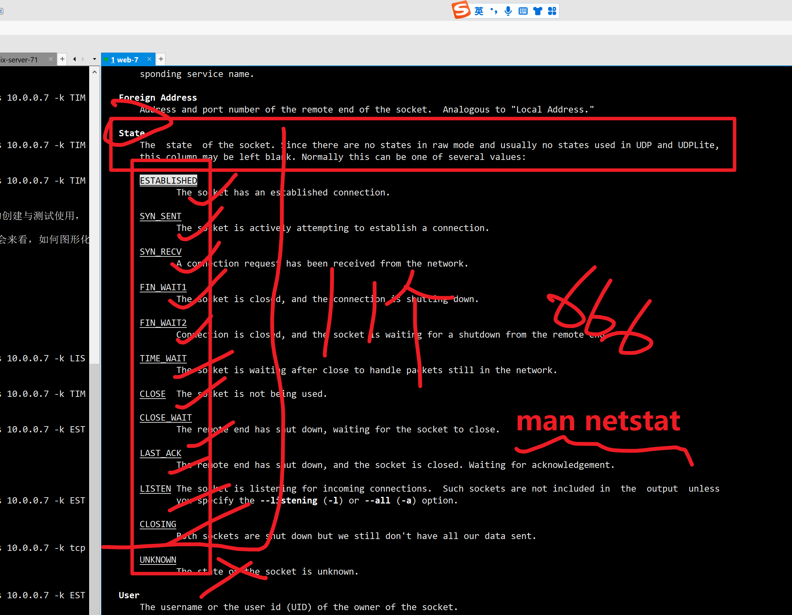


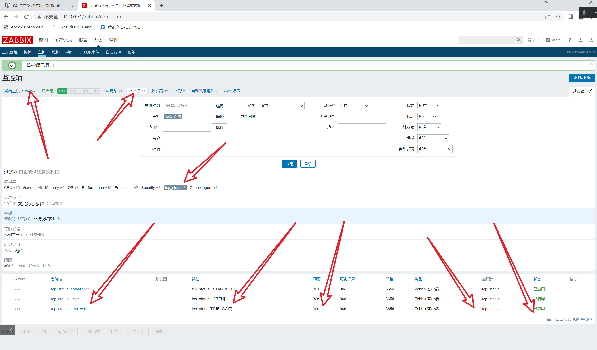

### 最新数据

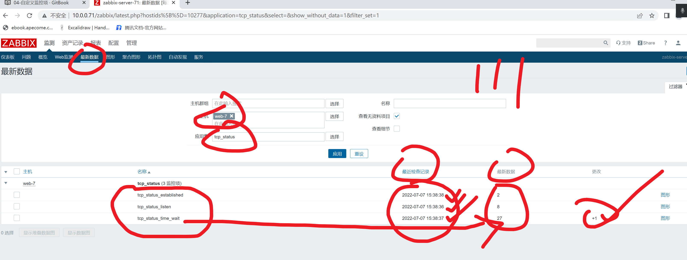

自定义监控项，自定义，让zabbix展示，你自己定义的命令，采集到的，你想要的数据，就已经通过zabbix图形化展示了。

### 图形数据

添加tcp的三个图形数据

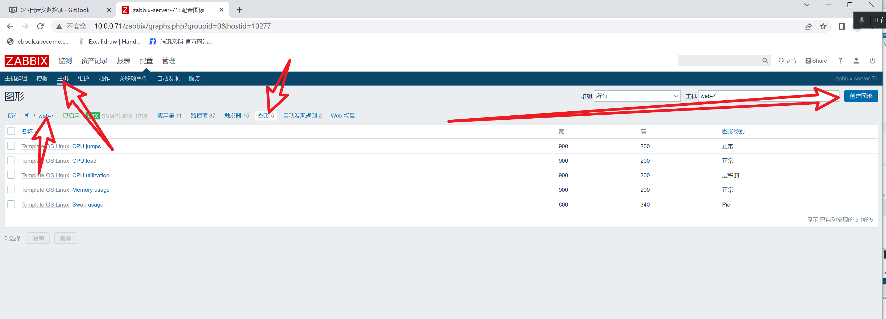


.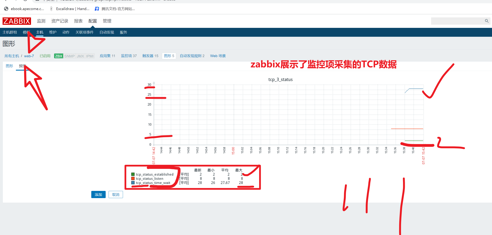


### 查看web7的图形数据

```
1. 给web7发1000个请求试试，1000个tcp状态

[root@zabbix-server-71 ~]#ab -c 10 -n 1000 http://10.0.0.7/    


2. 查看图形数据5分钟内的变化

```


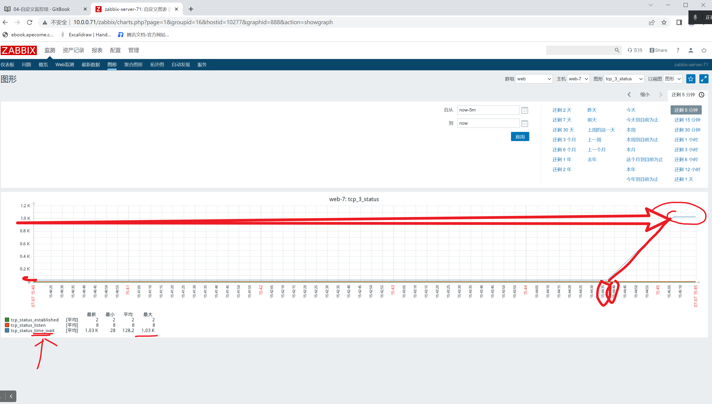

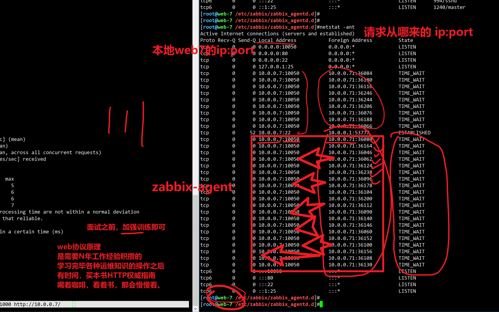

### 小结


```
1.  再agent客户端，创建自定义key的配置文件（定义的 tcp_status[LISTEN ]）
2 ,重启agent
3. 去web页面，创建了3个监控项
4. 根据监控项采集到的数据，添加了图形展示


```

## 触发器的添加

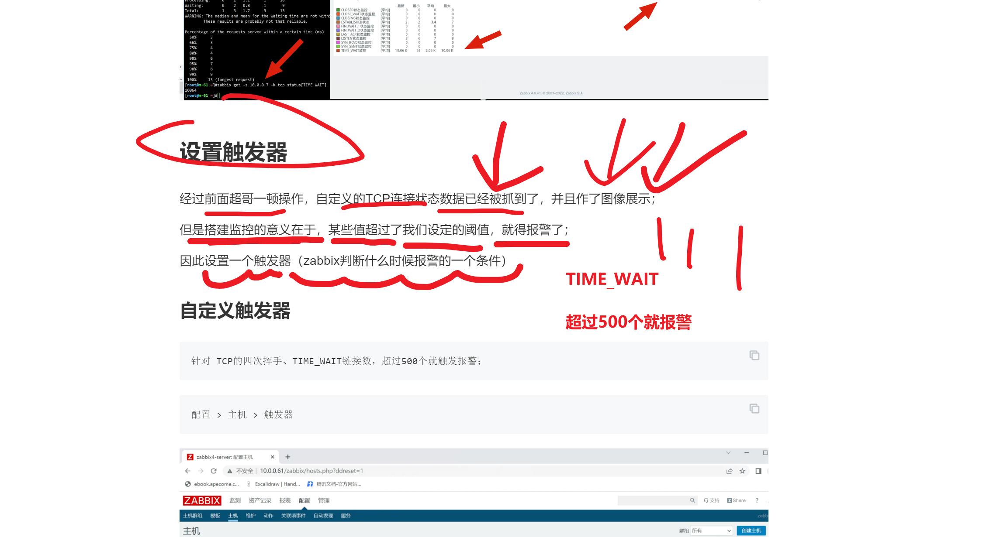


图形化点点点就完事

### 给web7的TIME_WAIT监控项，设置触发器，超过500个值就报警

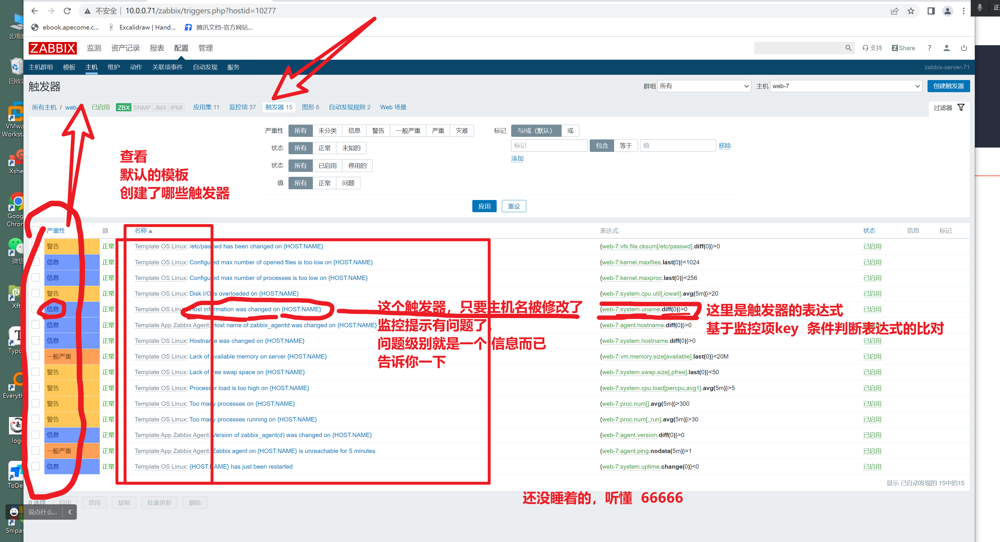

````
完成TIME_WAIT超过500个就报警的判断表达式

````


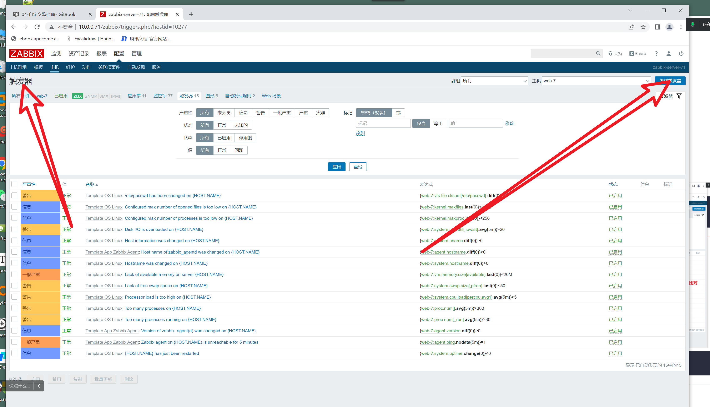

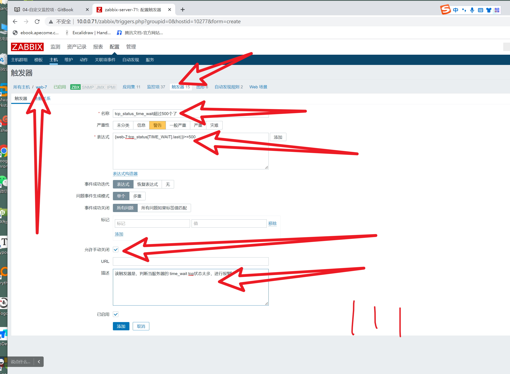

.

---

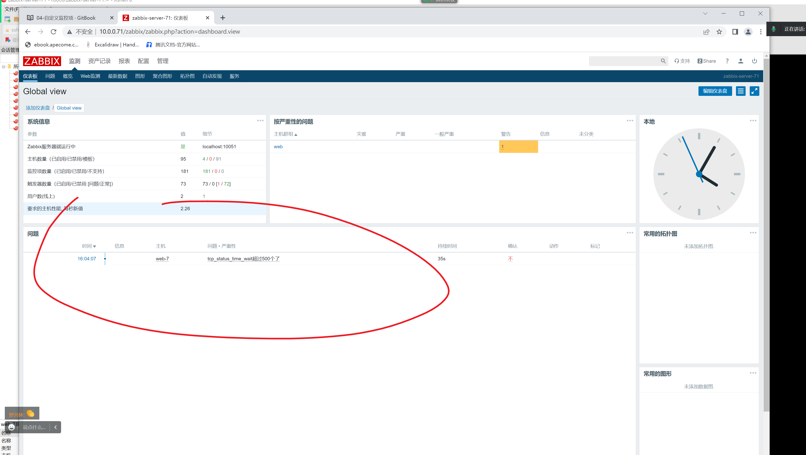

发现报警了

##


###  今日作业

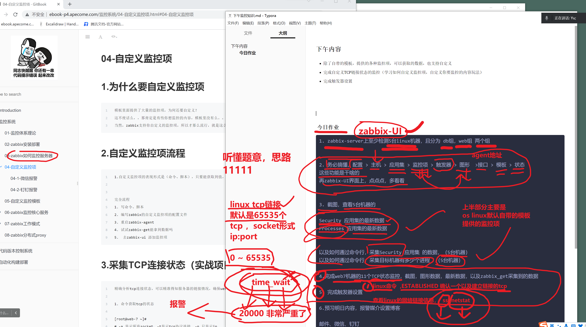


```
1. zabbix-server上至少检测5台linux机器，且分为 db组，web组 两个组


2. 务必搞懂，配置 > 主机 > 应用集 > 监控项 > 触发器 > 图形  >接口 > 模板 > 状态 
这些功能是干啥的
再zabbix-UI界面上，点点点，多看看


3. 截图，查看5台机器的

Security 应用集的最新数据
Processes 应用集的最新数据


以及如何通过命令行，采集Security 应用集 的数据，（5台机器）
以及如何通过命令行，采集目标机器有多少个进程  （5台机器）

4.完成web7机器的11个TCP状态监控，截图，图形数据，最新数据，以及zabbix_get采集到的数据
11个TCP状态，自行查资料解决


5. 完成触发器设置

======================================

6. 设置，检测主机的登录用户数量，判断登录的用户超过5个就报警，级别是警告
触发问题报警

下一步的，报警媒介设置
通过某种方式告诉你，它报警了。

今天的作业，明日核心知识，理解了111111111111111111111
散会，开整。
下班


======================================================================

6.预习明日内容，报警媒介设置博客

邮件、微信、钉钉

http://ebook-p4.apecome.com/%E7%9B%91%E6%8E%A7%E7%B3%BB%E7%BB%9F/04-%E8%87%AA%E5%AE%9A%E4%B9%89%E7%9B%91%E6%8E%A7%E9%A1%B9.html#%E6%9F%A5%E7%9C%8B%E8%A7%A6%E5%8F%91%E5%99%A8%E6%8A%A5%E8%AD%A6


```


