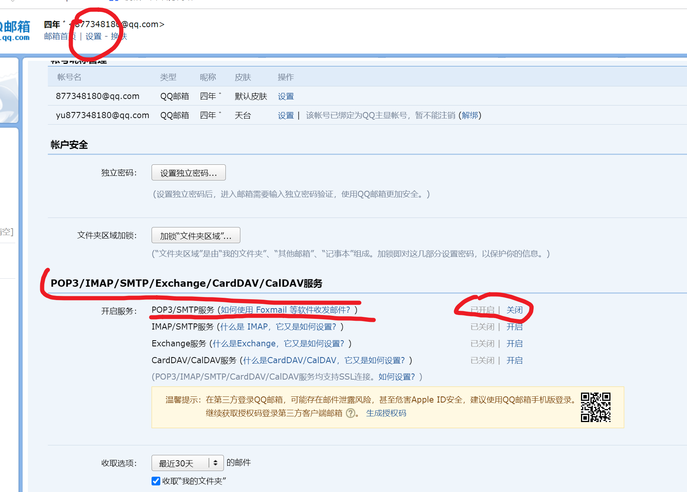

```### 此资源由 58学课资源站 收集整理 ###
	想要获取完整课件资料 请访问：58xueke.com
	百万资源 畅享学习

```


# 报警媒介


# 1. 邮件报警的配置

```
得设定一个报警的条件，场景

1. tcp状态监控 （time_wait 超过xxx数量） （自定义监控项+触发器的玩法）

2.报警的动作，几个条件
1. 发给谁？
2. 标题是什么？
3. 消息正文是什么？

【判断当前机器登录的用户数量，超过3个】就【发邮件通知运维】，【报警信息的正文：登录服务器的root用户太多，有点危险，快速看看。】


```


## 使用不通命令解决问题的思路

```
希望大家能理解，课堂教你某个案例的解决，玩明白后，得结合所学的技术知识+对业务的思考，去解决各种其他的问题


测试网站是否是200 OK的玩法
[root@zabbix-server-71 ~]#curl -s -I www.yuchaoit.cn | awk '/^HTTP/{print $2}'
200

[root@zabbix-server-71 ~]#curl -I -s   -w %{http_code}   -o /dev/null  www.yuchaoit.cn
200

1111


```


## 1.1 配置监控登录用户数量的自定义key

```
判断当前机器登录的用户数量，超过3个

1. 想好，你这个需求，如何用命令采集，构造出结果

who|wc -l

2. 写zabbix-agent的配置文件
[root@zabbix-server-71 /etc/zabbix/zabbix_agentd.d]#cat userparameter_login_user.conf 
UserParameter=login.user,who|wc -l


3. 重启agent
systemctl restart zabbix-agent.service 


4.去zabbix-ui界面，创建监控项（所有机器都好使），让这个监控项，和模板绑定，模板再给主机去用
- 给现有的模板添加监控项  template os linux （目前监控的主机，都以及和它关联了，登录用户数量检测的key，就立即可以生效了）  111
	
- 新创建模板，添加监控项（和主机关联这个模板）
	

5. 给某个主机，关联这个模板，使用这个自定义key

6. 通过最新数据，看看监控项拿到数据了吗？通过最新数据，查看web7是否拿到了登录用户数量
（注意坑）
给web7，设置这个 自定义key的配置文件
创建配置文件，重启，看最新数据即可
[root@web-7 /etc/zabbix/zabbix_agentd.d]#cat userparameter_login_user.conf 
UserParameter=login.user,who|wc -l


systemctl restart zabbix-agent.service 


7. web7还在开机中，目前有谁可以用login.user  71可以


8.设置触发器（只要机器登录的用户超过3个，就提示告警级别的信息），web7，server-71 两个机器生效

模板的配置，给多个主机去用

去哪添加触发器？给自定义的模板设置了


```


## 1.2 查看触发器的执行结果

你可以关闭问题，对这个问题的某些动作

```
如果要关闭问题，需要

0. 服务器故障被修复，自动关闭

1. 触发器允许手动关闭

2. 如果默认的模板关闭不了，那是默认的触发器不允许手动关闭。


```


### 报警媒介类型设置

```
你的监控，触发了报警，具体的动作

1. 手动确认，关闭了这个问题
2. zabbix自动执行的动作，如给你发个邮件

1. 对zabbix-server 添加一个可以发邮件的账户

2. 要给谁发？发什么格式的信息？


```


## 发件人的设置

```
163
qq邮箱去发都行


877348180@qq.com  给zabbix-server使用，当做发邮件的工具


```




```
重新开启该功能，生成授权码（等于邮件的密码）
记下来，待会填入zabbix

lmphafcvibxtbfhj


```


### 收件人配置


### 设置发信息动作


#### 测试报警发邮件动作

```
超过触发器的条件呗


```


```
zabbix报警了会发邮件

以及恢复了，也会发邮件

```


### 自定义报警内容

zabbix默认的报警内容，不够友好，自定义一波，更清晰。


```
```


修改报警的内容如下

```

默认标题：故障{TRIGGER.STATUS},服务器:{HOSTNAME1}发生: {TRIGGER.NAME}故障!


=======发生了如下的报警问题=======
告警主机:{HOSTNAME1} {HOST.IP}
告警时间:{EVENT.DATE} {EVENT.TIME}
告警等级:{TRIGGER.SEVERITY}
告警信息: {TRIGGER.NAME}
告警项目:{TRIGGER.KEY1}
问题详情:{ITEM.NAME}:{ITEM.VALUE}
当前状态:{TRIGGER.STATUS}:{ITEM.VALUE1}
事件ID:{EVENT.ID}　　
==========================================


```


### 自定义恢复内容


```
恢复标题：恢复{TRIGGER.STATUS}, 服务器:{HOSTNAME1}: {TRIGGER.NAME}已恢复!

=================恢复信息=============
告警主机:{HOSTNAME1} {HOST.IP}
告警时间:{EVENT.DATE} {EVENT.TIME}
告警等级:{TRIGGER.SEVERITY}
告警信息: {TRIGGER.NAME}
告警项目:{TRIGGER.KEY1}
问题详情:{ITEM.NAME}:{ITEM.VALUE}
当前状态:{TRIGGER.STATUS}:{ITEM.VALUE1}
事件ID:{EVENT.ID}
=======================================
```


### 自定义报警结果


### 自定义的恢复结果


