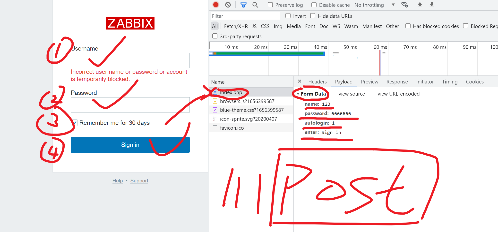
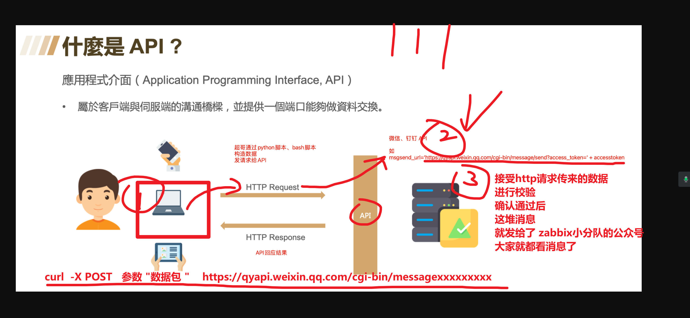
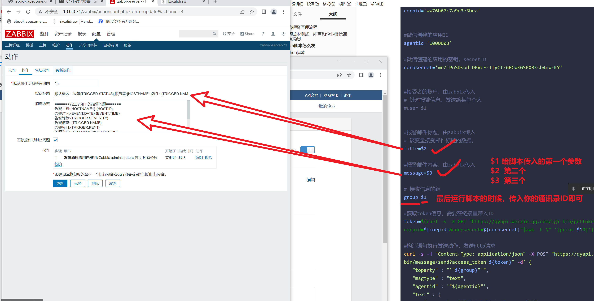
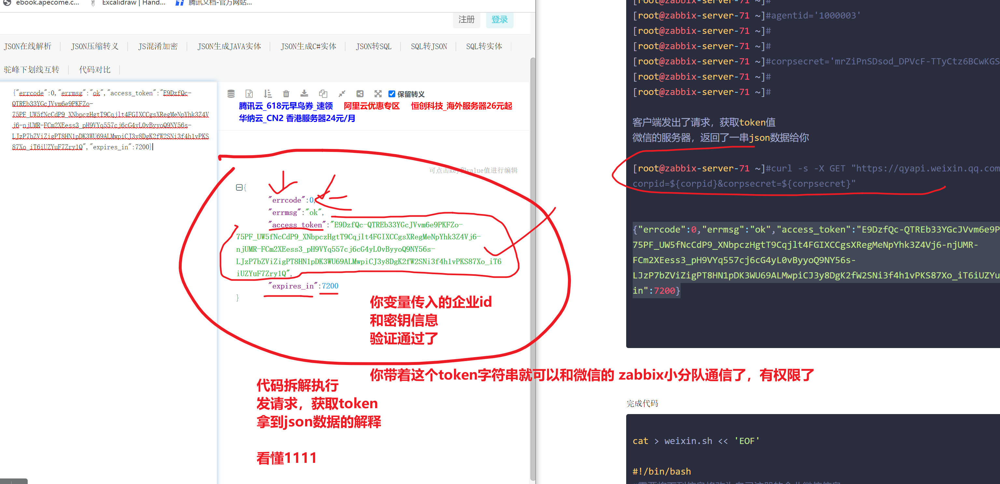
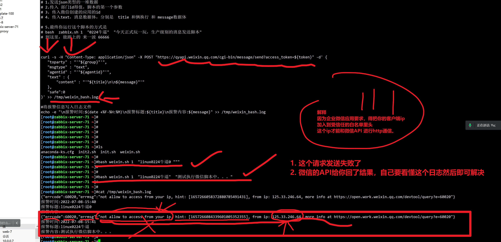
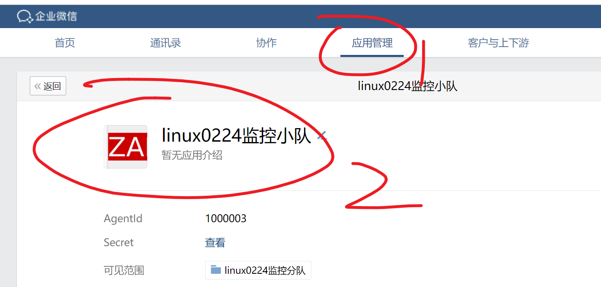
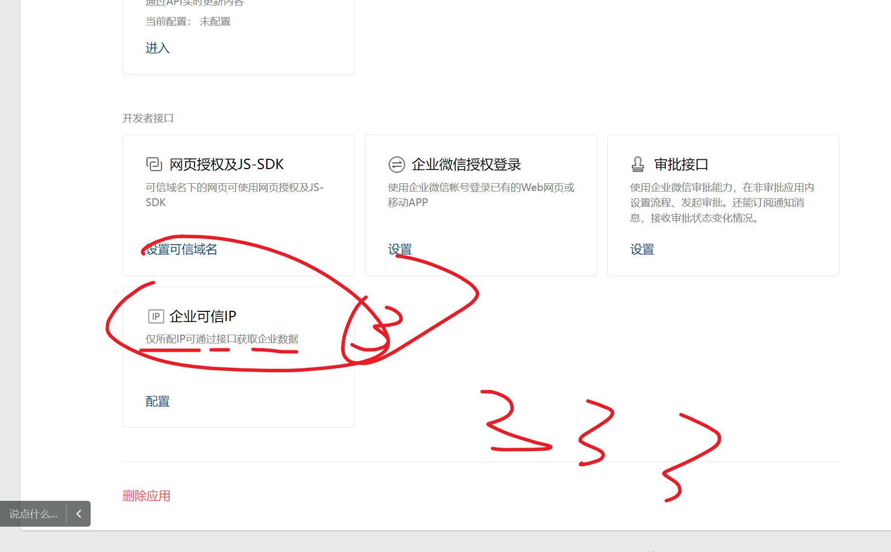
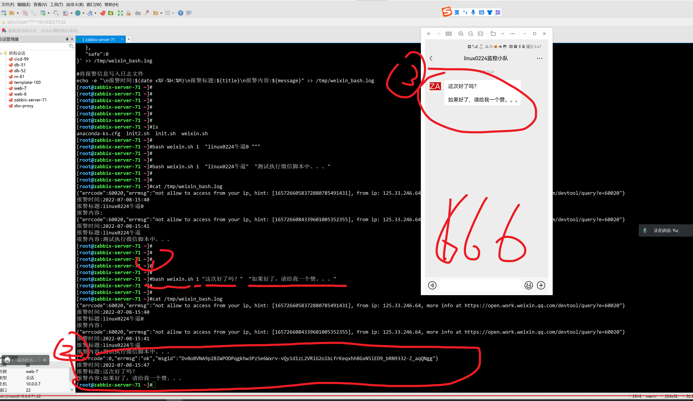
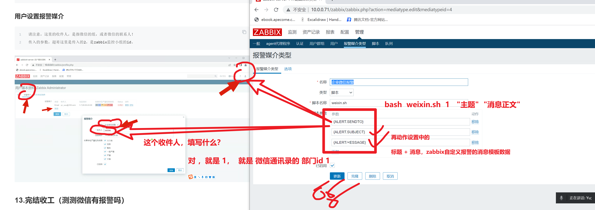
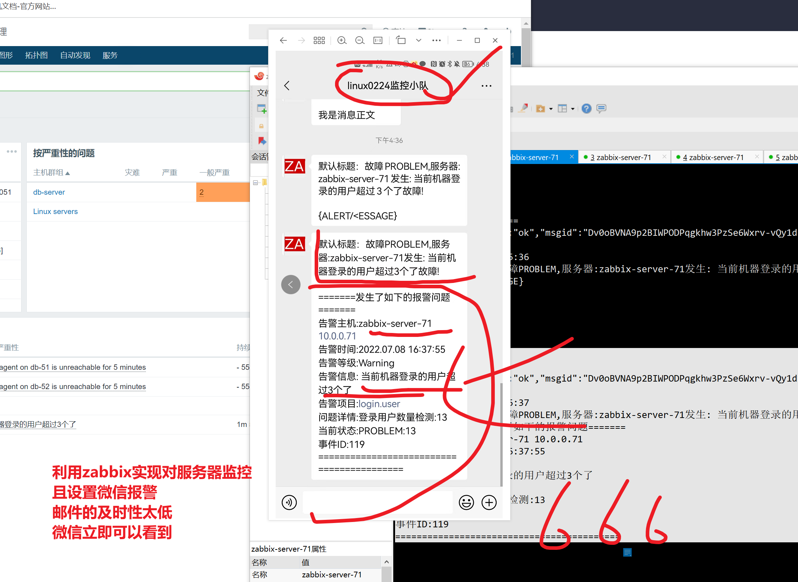

```### 此资源由 58学课资源站 收集整理 ###
	想要获取完整课件资料 请访问：58xueke.com
	百万资源 畅享学习

```


# 1.微信报警原理流程





```
1.注册微信企业

2.通过企业号提供的信息ID，发送报警信息，发给谁啊？


url 访问，拿人家这个url数据，是什么http method？ ------get

bilibili.com/login
给这个url发请求，切提交你的账户密码http method---post


如何把你的zabbix数据，提交到微信这里
API（应用程序的接口）
（微信会提供一个URL给你，往这个URL发送http请求，post类型的请求，提交你的zabbix采集到的数据）
微信的服务器收到了你的请求，且，你这个请求，包含了如下内容
- 发给谁，具体的企业微信ID号3
- 发送的标题，正文等数据  

待会来看，如何发请求，且构造这些数据，

微信这里再把这些数据，发送你们的微信工作组(企业ID号)


3.以及获取微信的API接口，就可以将服务器的报警数据，发给API


4.发给微信，发给关注这个公众号的所有用户、这个组内的成员都收到消息了


微信中创建的zabbix应用的secret密钥
mrZiPnSDsod_DPVcF-TTyCtz6BCwKGSPX8ksb4nw-KY

你注册的企业微信的id
ww76b67c7a9e3e3bea


```


至此，微信的设置就结束了


zabbix客户端的事了

思考，如何写脚本，提交 zabbix的监控消息，统一发给微信的API




下一步就来看，python，和bash两个风格的脚本，发请求。

刚才已经完成了，创建企业微信的账号，获取了企业号的id，以及创建了企业微信的一个zabbix小程序，获取了程序的id，和密钥

```
微信中创建的zabbix应用的secret密钥
mrZiPnSDsod_DPVcF-TTyCtz6BCwKGSPX8ksb4nw-KY

你注册的企业微信的id
ww76b67c7a9e3e3bea


```


# 2.先写脚本测试，能否和企业微信通信，发消息

运维部署脚本，一般常见的俩方式，bash脚本，python脚本

## bash脚本怎么发

这个脚本，拿到后，修改为你自己注册的企业微信ID，以及应用id和密钥即可



手工拆解代码执行

```perl
[root@zabbix-server-71 ~]#corpid='ww76b67c7a9e3e3bea'
[root@zabbix-server-71 ~]#
[root@zabbix-server-71 ~]#
[root@zabbix-server-71 ~]#agentid='1000003'
[root@zabbix-server-71 ~]#
[root@zabbix-server-71 ~]#
[root@zabbix-server-71 ~]#corpsecret='mrZiPnSDsod_DPVcF-TTyCtz6BCwKGSPX8ksb4nw-KY' 
[root@zabbix-server-71 ~]#
[root@zabbix-server-71 ~]#

客户端发出了请求，获取token值
微信的服务器，返回了一串json数据给你

[root@zabbix-server-71 ~]#curl -s -X GET "https://qyapi.weixin.qq.com/cgi-bin/gettoken?corpid=${corpid}&corpsecret=${corpsecret}"


{"errcode":0,"errmsg":"ok","access_token":"E9DzfQc-QTREb33YGcJVvm6e9PKFZo-75PF_UW5fNcCdP9_XNbpczHgtT9Cqjlt4FGIXCCgsXRegMeNpYhk3Z4Vj6-njUMR-FCm2XEess3_pH9VYq557cj6cG4yL0vByyoQ9NY56s-LJzP7bZViZigPT8HN1pDK3WU69ALMwpiCJ3y8DgK2fW2SNi3f4h1vPKS87Xo_iT6iUZYuF7Zry1Q","expires_in":7200}

awk提取token字符串值

[root@zabbix-server-71 ~]#curl -s -X GET "https://qyapi.weixin.qq.com/cgi-bin/gettoken?corpid=${corpid}&corpsecret=${corpsecret}"  |   awk -F \"   '{print $10}'


E9DzfQc-QTREb33YGcJVvm6e9PKFZo-75PF_UW5fNcCdP9_XNbpczHgtT9Cqjlt4FGIXCCgsXRegMeNpYhk3Z4Vj6-njUMR-FCm2XEess3_pH9VYq557cj6cG4yL0vByyoQ9NY56s-LJzP7bZViZigPT8HN1pDK3WU69ALMwpiCJ3y8DgK2fW2SNi3f4h1vPKS87Xo_iT6iUZYuF7Zry1Q


```




完成代码

你再也遇见不到 我这么细的老师了


```bash

cat > weixin.sh << 'EOF'

#!/bin/bash
#需要将下列信息修改为自己注册的企业微信信息


#企业ID 
corpid='ww76b67c7a9e3e3bea'


#微信创建的应用ID
agentid='1000003'

#微信创建的应用的密钥，secretID
corpsecret='mrZiPnSDsod_DPVcF-TTyCtz6BCwKGSPX8ksb4nw-KY' 


#接受者的账户，由zabbix传入 
# 针对报警信息，发送给某单个人
#user=$1


#报警邮件标题，由zabbix传入 
# 该变量接受邮件标题的数据，
title=$2 

#报警邮件内容，由zabbix传入 
message=$3

# 接收信息的组
# 消息发给哪个组
# linux0224小分队，组id是 1 
group=$1 


#获取token信息，需要在链接里带入ID
# 如下2段代码，需要结合着跑
#这段代码是获取身份校验值，代表这个客户端是有权限和微信API通信的
# -s 安静执行
# -X GET 制定GET请求访问
# "https://qyapi.weixin.qq.com/cgi-bin/gettoken?corpid=${corpid}&corpsecret=${corpsecret}"
# 这就是一个url，但是url是变量替换的一个字符串
# 你发送你的企业id号，和应用id号，发给微信的服务器，微信服务器会返回给你一个身份令牌字符串
# 下一步，你就可以用这个字符串代表你的身份，是有权限和微信的公众号通信了

token=$(curl -s -X GET "https://qyapi.weixin.qq.com/cgi-bin/gettoken?corpid=${corpid}&corpsecret=${corpsecret}"|awk -F \" '{print $10}')


#构造语句执行发送动作，发送http请求
# 这个curl的作用详解
# 1.发送json类型的一堆数据
# 2.传入 部门id得值，脚本的第一个参数
# 3. 传入微信创建的应用的id
# 4. 传入text，消息数据体，分别是  title 和俩换行 和 message数据体

# 5.最终你运行这个脚本的方式是 
# bash  zabbix.sh 1  "0224牛逼"  "今天正式玩一玩，生产级别的消息发送脚本"
# 到这里，能跟上的 来一波 66666


curl -s -H "Content-Type: application/json" -X POST "https://qyapi.weixin.qq.com/cgi-bin/message/send?access_token=${token}" -d' {
   "toparty" : "'"${group}"'",
   "msgtype" : "text",
   "agentid" : "'"${agentid}"'",
   "text" : {
       "content" : "'"${title}\n\n${message}"'"
   },
   "safe":0
}' >> /tmp/weixin_bash.log

#将报警信息写入日志文件
echo -e "\n报警时间:$(date +%F-%H:%M)\n报警标题:${title}\n报警内容:${message}\n\n" >> /tmp/weixin_bash.log
EOF


```





## 添加微信应用的白名单










```
到这里，你的服务器+你的脚本，已经可以和微信通信了。

下一步简单的加入到zabbix的-UI界面即可。

休息一会


```


## python脚本

我这脚本代码，用的python3写的

有python3 以及如何运行


```
只需要琢磨改哪里，以及如何再linux上，触发调用python的脚本，调通就行

为了学习，如果生产下，公司用python脚本发布，你得学会如何部署环境，以及看日志，调通这个脚本的执行。


代码逻辑就不说了


```


代码如下

填入你自己注册的企业微信id，应用id，应用密钥等就行

这个脚本是python3版本开发的

```
先有python3环境

# 根据如下操作，部署python环境即可
yum install python3 python3-devel -y
pip3 install requests


# 无论是bash脚本，还是python脚本，核心都是
# 构造企业微信id，应用的密钥，即可精确的给微信的应用发消息

看懂11111


```


```python
#!/usr/bin/env python3

import requests
import sys
import os
import json
import logging

# 日志格式构造
logging.basicConfig(level = logging.DEBUG, format = '%(asctime)s, %(filename)s, %(levelname)s, %(message)s',
                datefmt = '%a, %d %b %Y %H:%M:%S',
                filename = os.path.join('/tmp','weixin_python.log'),
                filemode = 'a')
# 企业ID
corpid='ww76b67c7a9e3e3bea'

# 应用秘钥
appsecret='mrZiPnSDsod_DPVcF-TTyCtz6BCwKGSPX8ksb4nw-KY'

# 应用id
agentid='1000003'

# 获取身份令牌，用于和微信通信的认证
# 参考企业微信API文档https://developer.work.weixin.qq.com/document/path/90487
token_url='https://qyapi.weixin.qq.com/cgi-bin/gettoken?corpid=' + corpid +'&corpsecret=' + appsecret
req=requests.get(token_url)
accesstoken=req.json()['access_token']
msgsend_url='https://qyapi.weixin.qq.com/cgi-bin/message/send?access_token=' + accesstoken

# 构造消息体
#touser=sys.argv[1]
toparty=sys.argv[1]
subject=sys.argv[2]

# 发送微信消息的数据格式
message=sys.argv[2] + "\n\n" +sys.argv[3]

params={
        #"touser": touser,
        "toparty": toparty,
        "msgtype": "text",
        "agentid": agentid,
        "text": {
            "content": message
            },
    "safe":0
    }

# 最终发请求
req=requests.post(msgsend_url, data=json.dumps(params))
# 调试请求发送结果
print(req.content)
# 记录日志
logging.info('sendto:' + toparty + ';;subject:' + subject + ';;message:' + message)
```


```bash
bash脚本
python脚本
都以及调通了

```


# 3.去zabbix-UI，添加报警动作，执行你的脚本，实现zabbix+脚本实现微信报警通知

```
1. 需要设置zabbix-server的配置文件，设置一个脚本目录，zabbix才能去这里去找到脚本且执行

[root@zabbix-server-71 ~]#cat  /etc/zabbix/zabbix_server.conf 
LogFile=/var/log/zabbix/zabbix_server.log
LogFileSize=0
PidFile=/var/run/zabbix/zabbix_server.pid
SocketDir=/var/run/zabbix
DBHost=localhost 
DBName=zabbix
DBUser=zabbix
DBPassword=linux0224
SNMPTrapperFile=/var/log/snmptrap/snmptrap.log
Timeout=4
AlertScriptsPath=/usr/lib/zabbix/alertscripts
ExternalScripts=/usr/lib/zabbix/externalscripts
LogSlowQueries=3000
# zabbix定义的一个脚本目录
AlertScriptsPath=/usr/lib/zabbix/alertscripts


2. bash py的脚本放入该目录即可，还得注意权限。。。太坑了

修改脚本的权限
[root@zabbix-server-71 /usr/lib/zabbix/alertscripts]#chown zabbix.zabbix weixin.sh 
[root@zabbix-server-71 /usr/lib/zabbix/alertscripts]#
[root@zabbix-server-71 /usr/lib/zabbix/alertscripts]#
[root@zabbix-server-71 /usr/lib/zabbix/alertscripts]#chmod +x weixin.sh 
[root@zabbix-server-71 /usr/lib/zabbix/alertscripts]#ll
total 4
-rwxr-xr-x 1 zabbix zabbix 2328 Jul  8 16:24 weixin.sh


3. 去zabbix-UI界面添加即可


```





测试是否微信通知

```
1.主动让zabbix报警

2.自己看日志，是否有报错
这里是日志文件的权限问题

```



完结收工。


微信报警调试完毕了。


