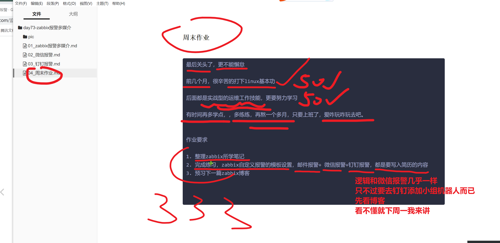

```### 此资源由 58学课资源站 收集整理 ###
	想要获取完整课件资料 请访问：58xueke.com
	百万资源 畅享学习

```


# 周末作业


```
最后关头了，更不能懈怠

前几个月，很辛苦的打下linux基本功

后面都是实战型的运维工作技能，更要努力学习

有时间再多学点，，多练练，再熬一个多月，只要上班了，爱咋玩咋玩去吧。


作业要求

1. 整理zabbix所学笔记
2. 完成练习，zabbix自定义报警的模板设置，邮件报警+ 微信报警+钉钉报警，都是要写入简历的内容
3. 预习下一篇zabbix博客


```




散会


