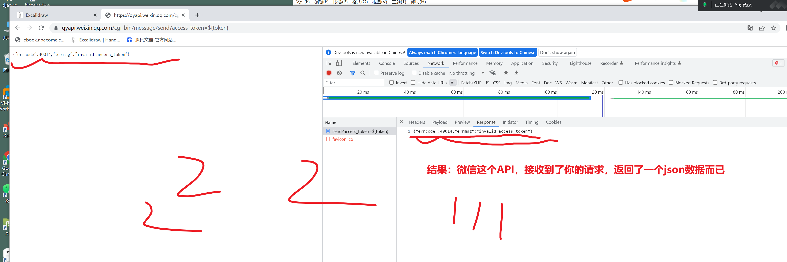
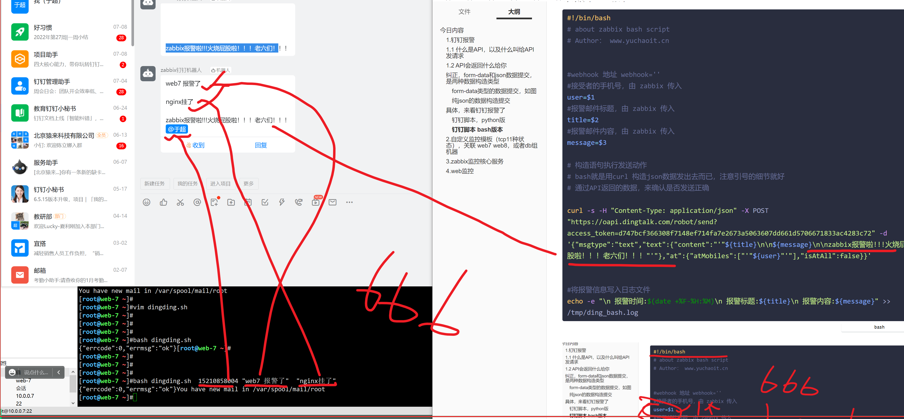

```### 此资源由 58学课资源站 收集整理 ###
	想要获取完整课件资料 请访问：58xueke.com
	百万资源 畅享学习

```


# 今日内容

又是美好的一天


```perl
1.钉钉报警
2.自定义监控模板（tcp11种状态），关联 web7 web8，或者db组机器
3.zabbix监控核心服务，nginx_status，php_status，这是监控公司网站的主要手段，更多的如数据库，和应用服务器，后面学了再补充

zabbix作为监控系统，核心在于，保障，提前预警，服务器硬件出现各种问题；
监控各种软件系统服务

网站来说 
LNMP 

linux服务器本身的健康状况，template os linux 50多个监控项，覆盖了绝大多数硬件资源的监控

nginx  apache
	web server, 提供被动式的web服务，接受http请求，相应http请求
		
	nginx接受，处理的所有的请求状态，监控它的http连接数有多少，链接状况如何
		基于nginx的status状态页功能区采集数据，构造监控项，添加触发器
		
	nginx进程本身，master进程，worker进程的运行状态
		自定义监控项的配置文件+采集进程的命令脚本 === zabbix-UI中
		ps
		netstat
		
	nginx所有功能，你都可以给它监控上
	属于web检测了
	1. 检测nginx的某虚拟主机是否正常，通过什么命令可以监控？
		curl 命令可以实现
	2. 监控nginx设置的location 七层转发是否正常？

		
11111


mysql 先放着
	mysql服务状态本身
	mysql的性能数据采集
	


php  python
	nginx(127.0.0.1:80) + 独立的php-fpm进程（127.0.0.1:9000）
	以apache模块的形式，去解析php代码，没有独立的进程
	
	php接受用户请求与相应
	本质上web相关的通信，都是
	一堆client 客户端，手机，ipad，电脑 发出 N个 http请求
	↓
	发给http服务端，发给php进程
	
	本质上，监控php，1.服务本身运行状态   2、监控连接数


4.web监控
	1. 如果上述的1,2,3题目都是基于命令行去监控，采集进程的信息，提取数据等玩法
	
	2.  老大发话了，确保zabbix的登录页面，也要监控上，确保登录正常
	通过脚本实现自动化
	，找到，人为操作，背后的数据，到底发生了什么

4大知识点，1.zabbix回顾， 2.zabbix和业务结合的思考
听懂6666


```


## 1.钉钉报警


和微信报警类似，发送指定的数据到钉钉官方提供的API接口

```
API有点蒙

和微信报警的请求发送流程
API的使用，访问流程

1.  curl 发出http请求，携带一堆参数，发送的json类型的数据，发给  微信的API
（nginx先接受请求，然后基于后面的路径，转发给location设置的后端服务器，处理响应，返回nginx，返回给用户，只不过，这里返回的是json数据）
http://wxapi.weixin.com/api/


2. 微信的API  url接受到请求之后，处理请求，构造结果，返回一个json数据


3. 请看这个操作


```


钉钉会将报警信息，发送到指定的钉钉群聊，提醒所有的群成员查看，实现告警通知。

## 1.1 什么是API，以及什么叫给API发请求


---

10 : 15继续


## 1.2 API会返回什么给你

url会相应什么结果给你呢？


API 会返回什么给你，请看

​	1.可能返回一个html给你，zabbix是返回的字符串，html`

2. 可能返回一个json数据(字符串)给你，`微信，钉钉API就是这么玩的。`


都是后端代码中写好的，你作为客户端，只管发请求就好。

> 先看微信API，返回的json数据

```
# 吧报警数据，发到微信，发到你的微信小组
#就是这一段代码
curl -s -H "Content-Type: application/json" -X POST "https://qyapi.weixin.qq.com/cgi-bin/message/send?access_token=${token}" -d' {
   "toparty" : "'"${group}"'",
   "msgtype" : "text",
   "agentid" : "'"${agentid}"'",
   "text" : {
       "content" : "'"${title}\n\n${message}"'"
   },
   "safe":0
}'


发出get类型的请求，看看是什么结果
2个方式
给这个API，发出get类型的请求
curl 访问 ，方式1
用浏览器直接访问，方式，get类型


https://qyapi.weixin.qq.com/cgi-bin/message/send?access_token=${token}


```


> 再看zabbix的API，返回的结果


---





10.55继续


## 纠正，form-data和json数据提交，是两种数据构造类型

```
给大家讲解什么是API


看一下浏览器抓包的图解，理解即可


1. zabbix的登录页面，登录请求，发出http请求，看响应结果
携带着数据提交的get请求，form-data类型


2. 微信的API，发出http请求，看响应结果
携带着数据提交的get请求
（微信这个，的确是，请求传入的数据，就是json类型的字符串，响应的数据，也是json类型的数据）
json是一个网络中传输数据的，数据结构类型


```


> form-data zabbix用的是这个类型，表单数据提交，账户密码，也依然是key：value类型

### form-data类型的数据提交，如图

zabbix的登录页面


### 纯json的数据构造提交

你去理解，如何通过浏览器的抓包工具，分析请求的具体协议类型。


## 具体，来看钉钉报警了


```
具体操作流程

1.创建钉钉群聊
2.创建自定义机器人
创建报警关键词    zabbix
生成webhook认证信息  
自动生成一个API，以及身份令牌，token
https://oapi.dingtalk.com/robot/send?access_token=d747bcf366308f7148ef714fa7e2673a5063607dd661d5706671833ac4283c72

只能通过POST类型，访问

测试该钉钉API，是否能发消息到钉钉组里
# 提交json类的数据，发给钉钉的API

# 拼接多行字符串， \   

# 至此，API的玩法，你应该基本懂了
# 测试钉钉的API，是能发出去消息的
# 写脚本，按照该API规定的key，构造数据即可


curl  -H 'Content-Type: application/json' \
-d '{"msgtype": "text",  "text": {"content": "关键字：zabbix  来自于linux0224的钉钉消息，看懂了吗老六同志。"}}' \
'https://oapi.dingtalk.com/robot/send?access_token=d747bcf366308f7148ef714fa7e2673a5063607dd661d5706671833ac4283c72' 


开发报警脚本


填写zabbix-UI界面的配置


测试钉钉报警通知

```


### 钉钉脚本，python版

注意，该脚本是python3，你的目标机器，是否支持python3

```
yum install python3 python3-devel  python3-pip -y

pip3 install requests
```


```python
python语法比较优雅，你拿到代码，只需要修改什么就行？修改你的webhook，web钩子，钉钉机器人的API地址，该成你自己的即可


#!/usr/bin/python3
# coding: utf-8
# about zabbix python script
# Author： www.yuchaoit.cn

import requests,json,sys,os,datetime

# 钉钉机器人API
webhook_url='https://oapi.dingtalk.com/robot/send?access_token=d747bcf366308f7148ef714fa7e2673a5063607dd661d5706671833ac4283c72' 

# 给脚本参数手机号参数1
user_phone=sys.argv[1]

# 参数2，消息正文
text=sys.argv[2] + "\n\n" + sys.argv[3]

# 构造json数据体
data={
    "msgtype":"text",
    "text":{
        "content":text
    },
    "at":{
        "atMobiles":[user_phone],
        "isAtAll":False
    }
}

# 请求头，表明请求类型是json
headers={"Content-Type":"application/json"}

# 发HTTP请求，POST方式，传入数据与请求头
response=requests.post(url=webhook_url,data=json.dumps(data),headers=headers)
print(response.content)

# 日志目录生成
if os.path.exists("/tmp/dingding.log"):
    with open("/tmp/dingding.log","a+") as f:
        print("该文件以存在，追加写入中")
        if response.json().get("errcode")==0:
            f.write("\n" + str(datetime.datetime.now()) + "    " + str(user_phone) + "    " + "发送成功" + "\n" + str(text) )
        else:
            f.write("\n" + str(datetime.datetime.now()) + "    " + str(user_phone) + "    " + "发送失败" + "\n" + str(text) )
else:
    with open("/tmp/dingding.log","w+") as f:
        print("该日志文件不存在，创建且写入中")
        if response.json().get("errcode")==0:
            f.write("\n" + str(datetime.datetime.now()) + "    " + str(user_phone) + "    " + "发送成功" + "\n" + str(text) )
        else:
            f.write("\n" + str(datetime.datetime.now()) + "    " + str(user_phone) + "    " + "发送失败" + "\n" + str(text) )
```


测脚本，需要给脚本传入几个参数

```
python3 dingding.py  15210858004 "来自于linux0224的钉钉消息"  "keyword:zabbix 老六门，看懂了吗"
```


### 钉钉脚本 bash版本

```bash
#!/bin/bash
# about zabbix bash script
# Author： www.yuchaoit.cn


#webhook 地址 webhook=''
#接受者的手机号，由 zabbix 传入 
user=$1
#报警邮件标题，由 zabbix 传入 
title=$2
#报警邮件内容，由 zabbix 传入
message=$3

# 构造语句执行发送动作
# bash就是用curl 构造json数据发出去而已，注意引号的细节就好
# 通过API返回的数据，来确认是否发送正确

curl -s -H "Content-Type: application/json" -X POST "https://oapi.dingtalk.com/robot/send?access_token=d747bcf366308f7148ef714fa7e2673a5063607dd661d5706671833ac4283c72" -d '{"msgtype":"text","text":{"content":"'"${title}\n\n${message}\n\nzabbix报警啦!!!火烧屁股啦！！！老六们！！！"'"},"at":{"atMobiles":["'"${user}"'"],"isAtAll":false}}' 


#将报警信息写入日志文件
echo -e "\n 报警时间:$(date +%F-%H:%M)\n 报警标题:${title}\n 报警内容:${message}" >> /tmp/ding_bash.log
```





## zabbix-ui界面配置钉钉报警

目前，以及确认，你的机器，和钉钉通信，发消息，是没问题

结合这个功能，实现zabbix触发器执行报警动作，触发钉钉报警，切发送报警的信息。

```
zabbix配置要熟练，几大名词问你能立即说出来干啥的

模板
监控项
触发器是什么
图形，
报警媒介

完成项目，基于微信，邮件，钉钉，实现zabbix检测xxx服务，实现报警通知
基于bash和python的多种报警脚本开发


注意，该脚本，放入服务端的一个alter脚本目录中即可，
zabbix-server可以去调用它
AlertScriptsPath=/usr/lib/zabbix/alertscripts

确保脚本如下即可

[root@zabbix-server-71 /usr/lib/zabbix/alertscripts]#ll
total 8
-rwxr-xr-x 1 zabbix zabbix 1739 Jul 11 11:57 dingding.py
-rwxr-xr-x 1 zabbix zabbix 2328 Jul  8 16:24 weixin.sh


```


至此，你的zabbix又多支持了一个钉钉报警

你还得配置你的用户，采用这个方式


### 最后一步，测试钉钉是否报警

web7机器来测，触发报警（得看这个机器，有什么监控项！！！！！！！！）


## 2.自定义监控模板（tcp11种状态），关联 web7 web8，或者db组机器

```
以练习过，
自定义模板，监控项、触发器、关联主机、自定义key配置文件、最新数据、图形、聚合图形,导入、导出模板

参考博客动手练练，做笔记即可。

http://ebook-p4.apecome.com/%E7%9B%91%E6%8E%A7%E7%B3%BB%E7%BB%9F/05-%E8%87%AA%E5%AE%9A%E4%B9%89%E7%9B%91%E6%8E%A7%E6%A8%A1%E6%9D%BF.html

```


## 3.zabbix监控核心服务

nginx_status，php_status，这是监控公司网站的主要手段

更多的如数据库，和应用服务器(php-fpm,python后端，tomcat)，后面学了再补充。


### 3.1 nginx-status监控流程

nginx的服务器

web组

slb组

```
1. 先开发一个web服务器的nginx，status页面的功能（nginx配置，你还是否记得）
创建nginx子配置文件
cat > /etc/nginx/conf.d/status.conf <<'EOF'
server{

    listen 80;
    server_name localhost;
    
    # 访问改url，即可定位到状态页功能， 10.0.0.7:80/nginx_status
    location /nginx_status {
    	# 开启status状态页面功能的参数
        stub_status on;
        # 关闭访问日志的记录
        access_log off;
    }
}
EOF

2. 重启nginx，查看是否可访问
nginx -t 
nginx


2. 写脚本，采集status页面的数据


3. 加入zabbix-ui进行图形展示，触发器等


```


### 2. 写脚本，采集status页面的数据

创建agent的自定义key配置文件

```
[root@web-7 /etc/zabbix/zabbix_agentd.d]#cat nginx_status.conf 
UserParameter=nginx_status[*],/bin/bash /etc/zabbix/zabbix_agentd.d/nginx_status.sh $1


务必要重启
[root@web-7 /etc/zabbix/zabbix_agentd.d]#systemctl restart zabbix-agent.service 


```


```bash
# 自定义监控内容，也就是自定义key的操作
# 脚本核心思路就是，提取status页面的数值，交给zabbix

# 1.开发监控nginx脚本

#!/bin/bash
# Author: www.yuchaoit.cn
# 接受脚本的第一个参数
# 由于nginx的status状态太多，写为一个接受参数的key
#  status_nginx[*]  

NGINX_COMMAND=$1
CACHEFILE="/tmp/nginx_status.log"

CMD="/usr/bin/curl http://127.0.0.1/nginx_status"

# 判断是否有status日志文件
if [ ! -f $CACHEFILE ];then
    $CMD >$CACHEFILE 2>/dev/null
fi


# 检查status日志有效期，限定状态文件在60秒内
# 记录最后一次status日志的生成时间（秒）
STATUS_TIME=$(stat -c %Y $CACHEFILE)

# 以unix时间计算，seconds since 1970-01-01 00:00:00 UTC
# 当前系统时间减去日志时间，推算，是否超过60秒，超过就立即重新生成
TIMENOW=$(date +%s)

if [  $[ $TIMENOW - $STATUS_TIME ]  -gt 60 ];then
    rm -f $CACHEFILE
fi

if [ ! -f $CACHEFILE ];then
    $CMD > $CACHEFILE 2>/dev/null 
fi


nginx_active(){
    grep 'Active' $CACHEFILE |awk '{print $NF}'
    exit 0;
}

nginx_reading(){
    grep 'Reading' $CACHEFILE |awk '{print $2}'
    exit 0;
}

nginx_writing(){
    grep 'Writing' $CACHEFILE |awk '{print $4}'
    exit 0;
}

nginx_waiting(){
    grep 'Waiting' $CACHEFILE |awk '{print $6}'
    exit 0;
}

nginx_accepts(){
    awk NR==3 $CACHEFILE|awk '{print $2}'
    exit 0;
}

nginx_handled(){
    awk NR==3 $CACHEFILE|awk '{print $2}'
    exit 0;
}

nginx_requests(){
    awk NR==3 $CACHEFILE|awk '{print $3}'
    exit 0;
}


# 对脚本传入参数判断，需要获取什么值
# 如下参数，都是nginx的链接状态，
case $NGINX_COMMAND in 
    active)
        nginx_active ;;
    reading)
        nginx_reading;;
    writing)
        nginx_writing;;
    waiting)
        nginx_waiting;;
    accepts)
        nginx_accepts;;
    handled)
        nginx_handled;;
    requests)
        nginx_requests;;
    *)
        echo "Invalid arguments" 
        exit 2
        ;;
esac
```

模板的导出，导入


### 手动测试，自定义key+脚本，是否采集nginx的各种状态

```
[root@zabbix-server-71 /usr/lib/zabbix/alertscripts]#zabbix_get -s 10.0.0.7 -k nginx_status[active]
3
[root@zabbix-server-71 /usr/lib/zabbix/alertscripts]#
[root@zabbix-server-71 /usr/lib/zabbix/alertscripts]#
[root@zabbix-server-71 /usr/lib/zabbix/alertscripts]#zabbix_get -s 10.0.0.7 -k nginx_status[reading]
0
[root@zabbix-server-71 /usr/lib/zabbix/alertscripts]#zabbix_get -s 10.0.0.7 -k nginx_status[readxxxx]
Invalid arguments
[root@zabbix-server-71 /usr/lib/zabbix/alertscripts]#
[root@zabbix-server-71 /usr/lib/zabbix/alertscripts]#
[root@zabbix-server-71 /usr/lib/zabbix/alertscripts]#zabbix_get -s 10.0.0.7 -k nginx_status[writing]
1
[root@zabbix-server-71 /usr/lib/zabbix/alertscripts]#
[root@zabbix-server-71 /usr/lib/zabbix/alertscripts]#zabbix_get -s 10.0.0.7 -k nginx_status[waiting]
2
[root@zabbix-server-71 /usr/lib/zabbix/alertscripts]#zabbix_get -s 10.0.0.7 -k nginx_status[accepts]
5067
[root@zabbix-server-71 /usr/lib/zabbix/alertscripts]#
[root@zabbix-server-71 /usr/lib/zabbix/alertscripts]#zabbix_get -s 10.0.0.7 -k nginx_status[handled]
5067
[root@zabbix-server-71 /usr/lib/zabbix/alertscripts]#zabbix_get -s 10.0.0.7 -k nginx_status[requests]
5038


```


手动通过server去采集agent的nginx状态数据，都没问题，添加zabbix-ui页面

### 创建nginx_status的模板，便于给web组所有机器用


和你的web7机器关联让它用


看看图形，拿到数据了吗，最新数据


### nginx，web7机器的触发器，图形创建

图形，展示web7机器上的nginx，七个链接状态的数据


### 触发器，当nginx的requests请求数，超过30000万，就报警，钉钉报警


```
ab压测，看钉钉是否报警就完事。

```


### 3.2 php-status监控流程

1.开启php的状态页功能

```
#基于php-fpm进程做的实验

yum install php-fpm -y

修改配置文件，开启php，status功能即可，打开如下参数即可
要求你访问php状态页面的入口就是/status_php

[root@web-7 ~]#grep 'status_'  /etc/php-fpm.d/www.conf 
pm.status_path = /status_php

php-fpm，nginx转发过去的


修改nginx的配置


```


```
重启nginx，和php-fpm俩进程

[root@web-7 ~]#systemctl restart php-fpm.service nginx.service 

```

测试访问，php的状态页

http://10.0.0.7/status_php


如果zabbix去执行某些命令无权限，可能要注意添加如sudo，特殊权限等

```
[root@web-7 /tmp]#chmod +s /usr/sbin/ss
[root@web-7 /tmp]#
[root@web-7 /tmp]#ll /usr/sbin/ss
-rwsr-sr-x. 1 root root 131544 Apr 11  2018 /usr/sbin/ss

```


```

自定义监控项的套路都是

1. 写配置文件，你准备怎么提取数据，用什么自定义key
# 通过shell的case语句，先定关键字
# 自定义的key  php_status[采集的关键字]
UserParameter=php_status[*],/etc/zabbix/zabbix_agentd.d/php_status.sh  $1


2. 写脚本
#!/bin/bash
# 这是一个简单的监控php-fpm状态值的脚本

comm_para=$1
PHP_URL=$2
cmd="/usr/bin/curl $url"
cachefile=/tmp/php_status.txt
port=80

file_time=`stat -c %Y $cachefile`
now_time=`date +%s`
rm_file=$(($now_time-$file_time))
if [ -z $2 ];then
    url=http://127.0.0.1:$port/status_php
else
    url=$PHP_URL
fi
cmd="/usr/bin/curl $url"

if [ ! -e $cachefile ];then
    $cmd > $cachefile 2>/dev/null
fi

if [ $rm_file -gt 60 ];then
    rm -rf $cachefile
fi

if [ ! -f $cachefile ];then
    $cmd > $cachefile 2>/dev/null
fi

start_since() {
    #运行时长
    cat $cachefile | awk '/since/{print $3}'
    exit 0;
}

accepted_conn() {
    cat $cachefile | awk '/accepted/{print $3}'
    exit 0;
}

listen_queue(){ 
        cat $cachefile | awk '{if(NR==6){print $3}}'
    exit 0;
}

max_listen_queue(){
    cat $cachefile | awk '{if(NR==7){print $4}}'
    exit 0;
}

listen_queue_len() {
    cat $cachefile | awk '{if(NR==8){print $4}}'
    exit 0;
}

idle_processes() {
    cat $cachefile | awk '/idle/{print $3}'
    exit 0;
}

active_processes() {
    cat $cachefile | awk '{if(NR==10){print $3}}'
    exit 0;
}

total_processes() {
    cat $cachefile | awk '{if(NR==11){print $3}}'
        exit 0;
}

max_active_processes() {
    cat $cachefile | awk '{if(NR==12){print $4}}'
        exit 0;
}

max_children_reached() {
    cat $cachefile | awk '{if(NR==13){print $4}}'
        exit 0;
}

slow_requests() {
    cat $cachefile | awk '{if(NR==14){print $3}}'
        exit 0;
}

check() {
        php_pro_count=`ss -tunlp|grep php-fpm|wc -l`
        echo $php_pro_count
}

case "$comm_para" in 
start_since)
    start_since 
    ;;
accepted_conn)
    accepted_conn
    ;;
listen_queue)
    listen_queue
    ;;
max_listen_queue)
    max_listen_queue
    ;;
listen_queue_len)
    listen_queue_len
    ;;
idle_processes)
    idle_processes
    ;;
active_processes)
    active_processes
    ;;
total_processes)
    total_processes
    ;;
max_active_processes)
    max_active_processes
    ;;
max_children_reached)
    max_children_reached
    ;;
slow_requests)
    slow_requests
    ;;
check)
    check
    ;;
*)    
    echo "invalid status"
    exit 2;
esac

# author: www.yuchaoit.cn


3. 重启agent
[root@web-7 /etc/zabbix/zabbix_agentd.d]#systemctl restart zabbix-agent.service 


4.手动zabbix_get测数据
[root@zabbix-server-71 ~]#zabbix_get -s 10.0.0.7 -k php_status[total_processes]
5


5 添加zabbix-ui，给模板加，php状态页的模板
添加监控项，
关联web7机器
添加图形数据，给模板加
查看web7的图形数据即可


```


## 添加触发器，判断php如果挂了， 立即钉钉报警


```

判断php-fpm进程挂了

恢复启动zabbix-agent


```


# 今日作业


```
1. 再次确保微信，钉钉的正确报警通知项目完成
2. 完成nginx status监控实践 + nginx服务监控，
2.1 nginx的requests请求数，超过30000就钉钉报警
2.2 nginx如果挂了，就钉钉报警


3. 完成php-fpm进程监控+ php-status监控
php-fpm如果挂了，钉钉报警


完成的快的，预习下一篇zabbix博客


```


