```### 此资源由 58学课资源站 收集整理 ###
	想要获取完整课件资料 请访问：58xueke.com
	百万资源 畅享学习

```


# 今日内容

```bash

1.web监控
2.zabbix主动模式
3.zabbix自动发现
4.zabbix自动注册
5.zabbix-proxy配置
```

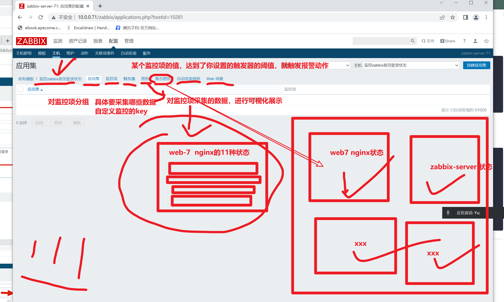


# web监控配置

```
需求

2.web监控需求
以zabbix-UI页面的登录监控，模拟登录，输入账号密码，实现首页的健康监控。

1. 模拟登录输入zabbix账号密码，登录后台，如果登录失败就报警
2. 基于响应状态码判断 非200即报警


```

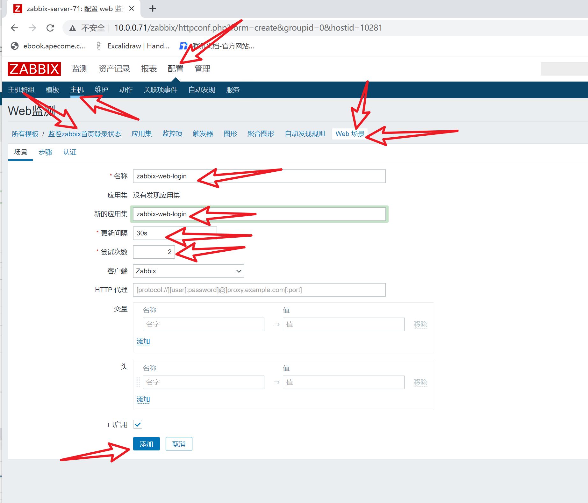


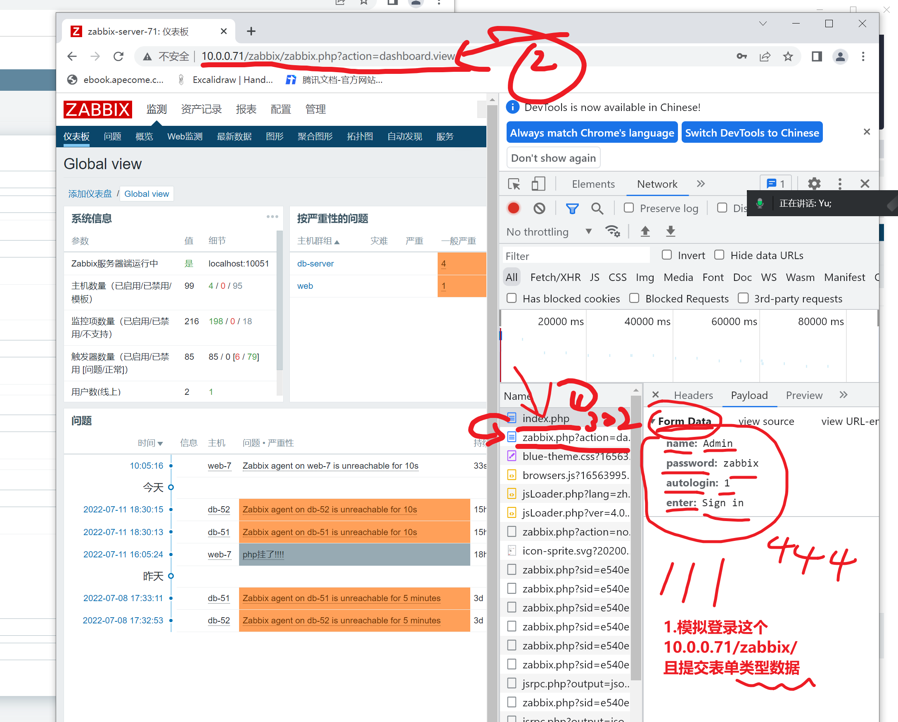


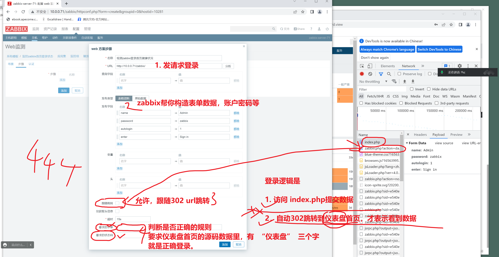


1.web监控

## 2.zabbix主动模式


---


以后去理解，去背诵zabbix的主动，被动模式

```
回想班级的同学，和老师超哥，提交作业的形式

```


## 2.1 修改zabbix-agent为主动模式（web-7）

```
[root@web-7 ~]#cat  /etc/zabbix/zabbix_agentd.conf 
PidFile=/var/run/zabbix/zabbix_agentd.pid
LogFile=/var/log/zabbix/zabbix_agentd.log
LogFileSize=0
Server=10.0.0.71
ServerActive=10.0.0.71
Hostname=web-7
Include=/etc/zabbix/zabbix_agentd.d/*.conf
[root@web-7 ~]#

重启agent服务
systemctl restart zabbix-agent
```


## 2.2 修改监控项的采集模式

```
1. 修改了配置文件，支持主动上传数据的模式
2. 修改该机器的监控项，为主动模式（批量修改）
3. 基于应用集选择某一系列的监控项，进行改为主动模式，也可以全选所有监控项，改为主动模式

```

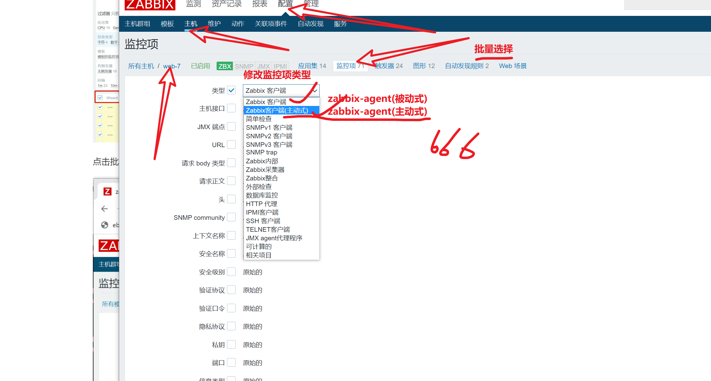


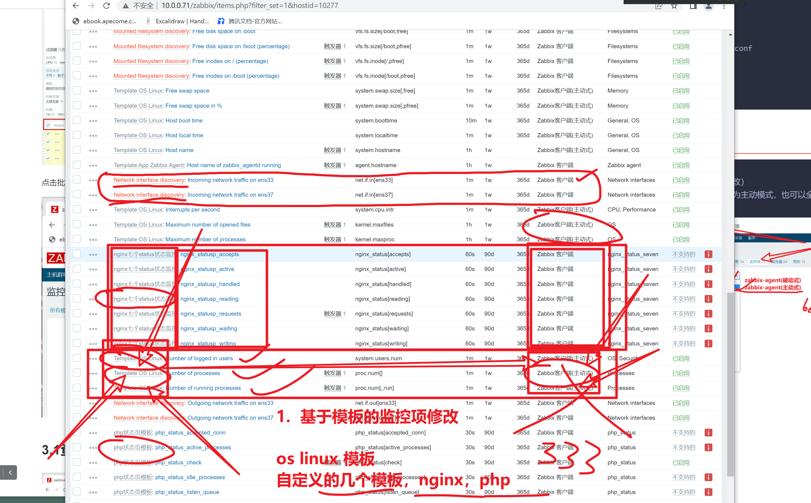


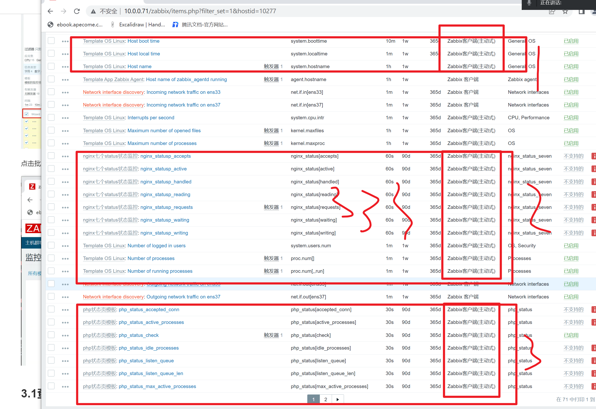


```
os linux
php
nginx


```

## 2.2 确保基于agnet，主动式，采集了web7的，nginx，php的数据

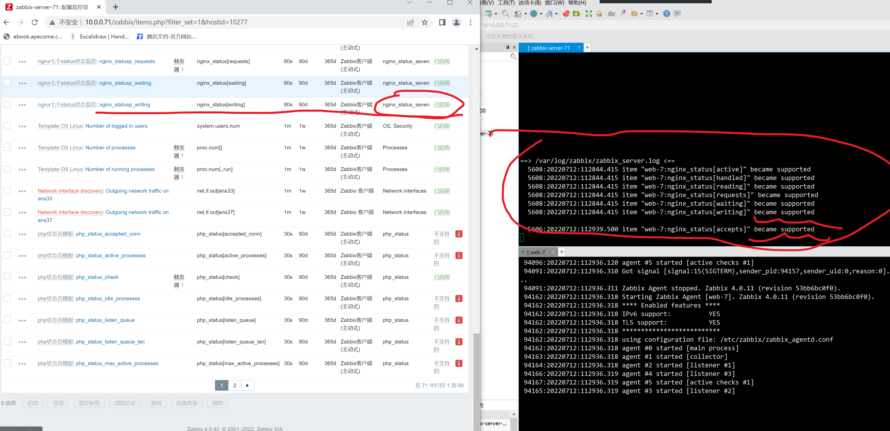


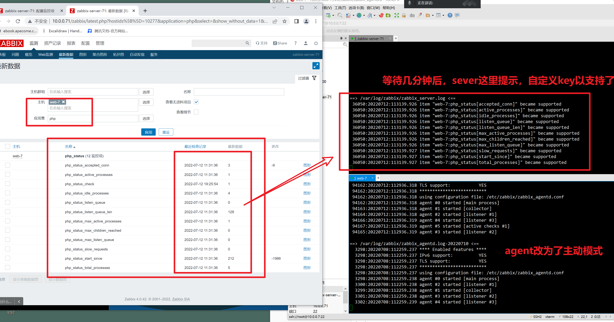


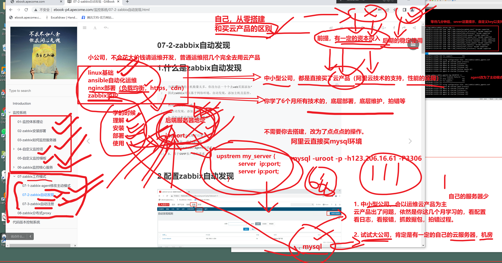


## 3.zabbix自动发现

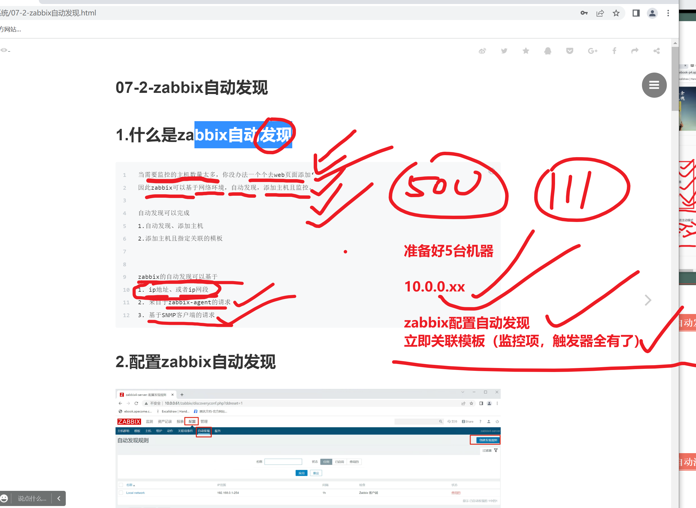


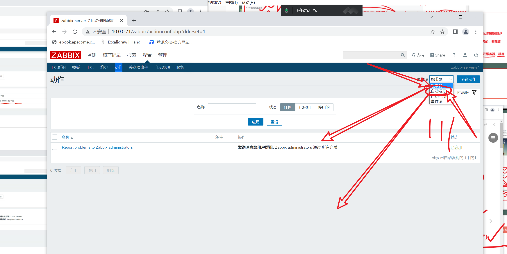


给自动发现，设置动作

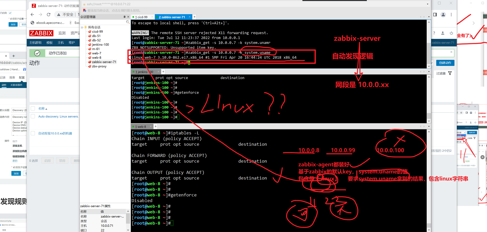


准备好一些机器

```
cicd-99

jenkins-100

web-8

统一安装zabbix客户端  zabbix-agent

rpm -ivh https://mirrors.tuna.tsinghua.edu.cn/zabbix/zabbix/4.0/rhel/7/x86_64/zabbix-agent-4.0.11-1.el7.x86_64.rpm


ntpdate -u ntp.aliyun.com

111


PidFile=/var/run/zabbix/zabbix_agentd.pid 
LogFile=/var/log/zabbix/zabbix_agentd.log
LogFileSize=0
Server=10.0.0.71
ServerActive=10.0.0.71
Hostname=cicd-99
Include=/etc/zabbix/zabbix_agentd.d/*.conf


systemctl restart zabbix-agent

netstat -tunlp|grep zabbix
[root@zabbix-server-71 ~]#for i in 99 100 8;do zabbix_get -s 10.0.0.$i -k system.uname ;done  

自动发现的条件，貌似都好了


练习
1.实现自动发现，添加这3个机器，到zabbix的 【主机】中

2. 实现自动关联 os linux模板


```


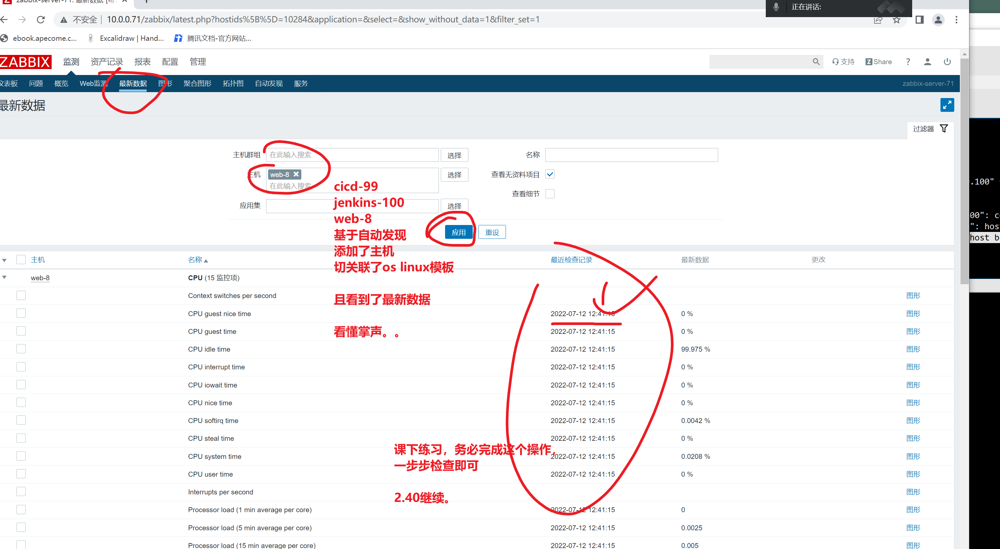


## 4.zabbix自动注册

```
为什么要学自动注册？
一样的

自动发现，是zabbix-server去扫描网段，然后添加机器，机器多了，一样要累死他


前面于超老师带你学习了自动发现，也就是配置好一个网络环境后，zabbix-server主动去网络环境中扫描，然后发现目标机器然后监控，此时的agent是被动等待的。
那如果需要扫描多种网段，且机器数量很大的话，你的zabbix-server服务器可就很难受了。。。


因此自动注册，就是由zabbix-agent主动发起注册请求，你来监控我把！！！
极大的降低了zabbix-server的服务器压力。


```

需求

```
web7 
web8
cicd99
jenkins100

全部自动注册到zabbix-server,且关联模板，且发送钉钉给运维管理员，告知是哪些机器，都被注册上了。


```

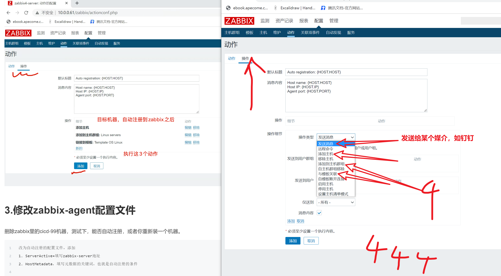


---

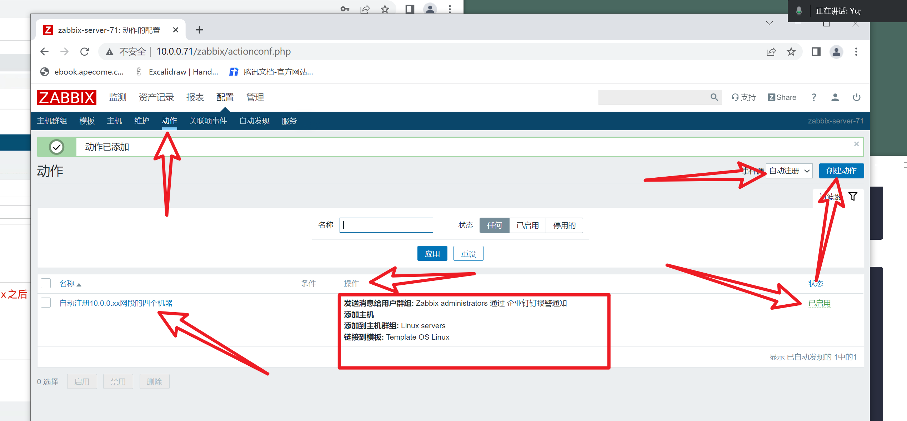


### 4.1 修改需要自动注册的agent配置文件

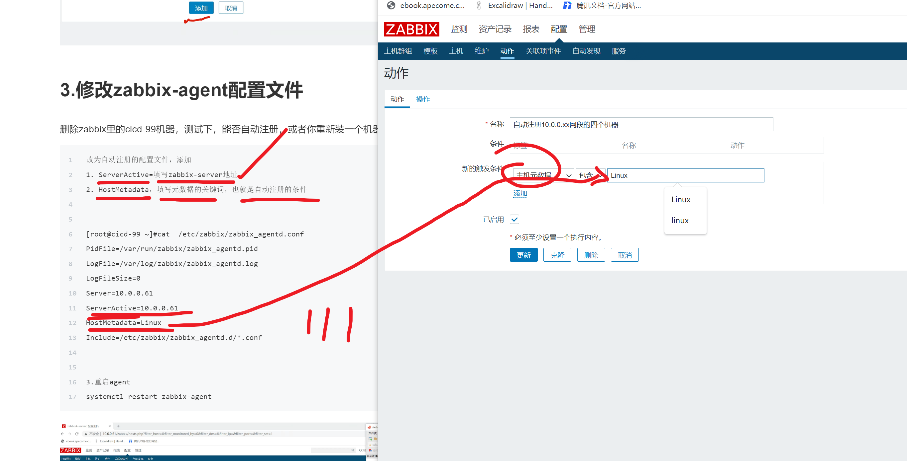


```
web7 
web8
cicd99
jenkins100

[root@zabbix-server-71 ~]#cat zabbix_agentd.conf 
PidFile=/var/run/zabbix/zabbix_agentd.pid 
LogFile=/var/log/zabbix/zabbix_agentd.log
LogFileSize=0
Server=10.0.0.71
ServerActive=10.0.0.71
HostMetadata=Linux
Include=/etc/zabbix/zabbix_agentd.d/*.conf


[root@zabbix-server-71 ~]#for i in 7 8 99 100;do scp zabbix_agentd.conf root@10.0.0.$i:/etc/zabbix/;done
zabbix_agentd.conf                                                                        100%  201   320.3KB/s   00:00    
zabbix_agentd.conf                                                                        100%  201   417.4KB/s   00:00    
zabbix_agentd.conf                                                                        100%  201   328.3KB/s   00:00    
zabbix_agentd.conf                                                                        100%  201   431.5KB/s   00:00    
[root@zabbix-server-71 ~]#

[root@zabbix-server-71 ~]#for i in 7 8 99 100;do ssh root@10.0.0.$i "systemctl restart zabbix-agent";done
[root@zabbix-server-71 ~]#
[root@zabbix-server-71 ~]#
[root@zabbix-server-71 ~]## 循环再 7 ，8,99,100四台机器，远程的ssh去重启zabbix-agent，看懂666
[root@zabbix-server-71 ~]#


```


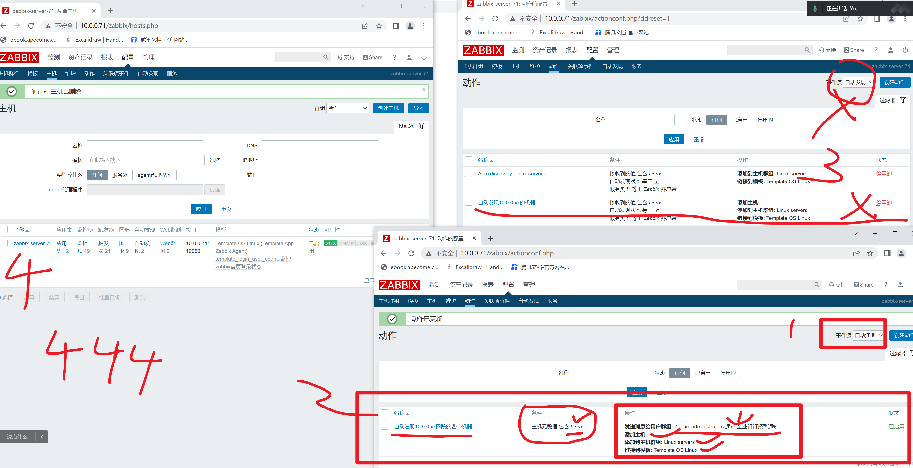


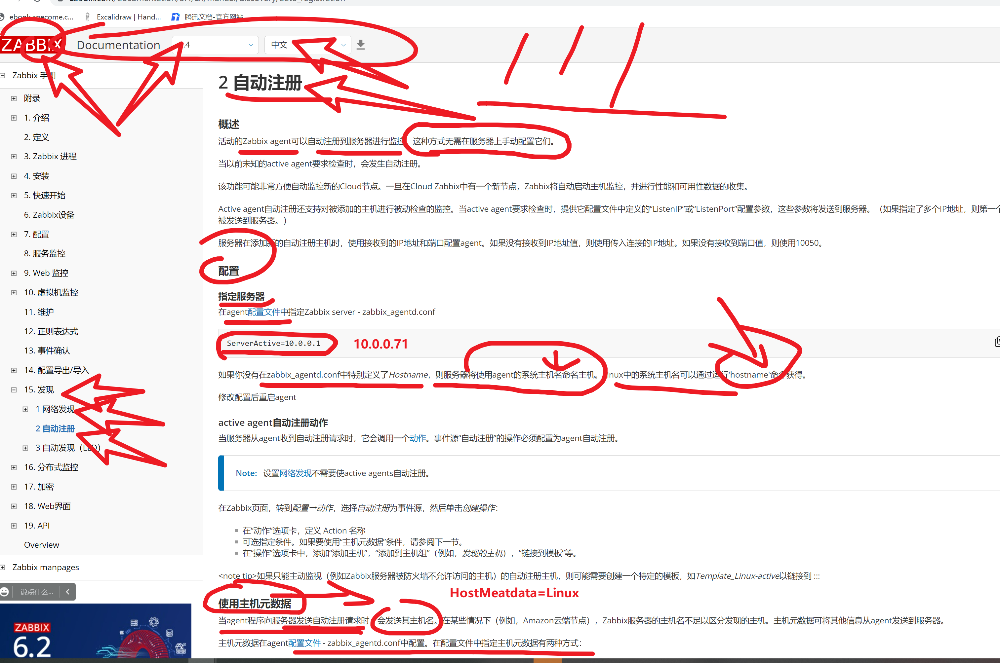


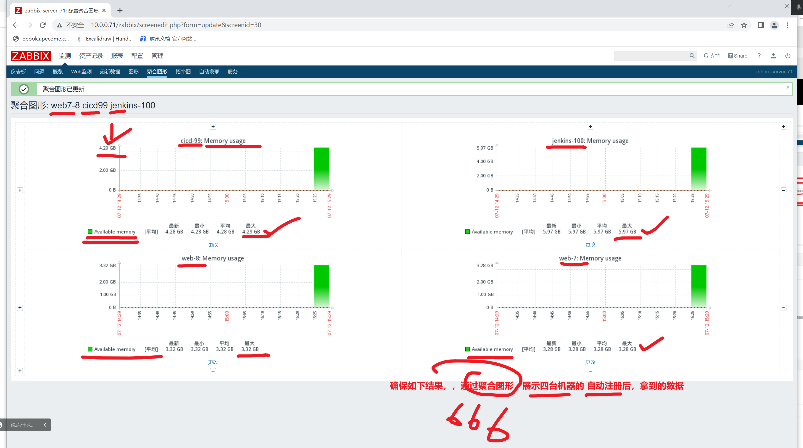


## 5.zabbix-proxy配置

zabbix分布式proxy配置

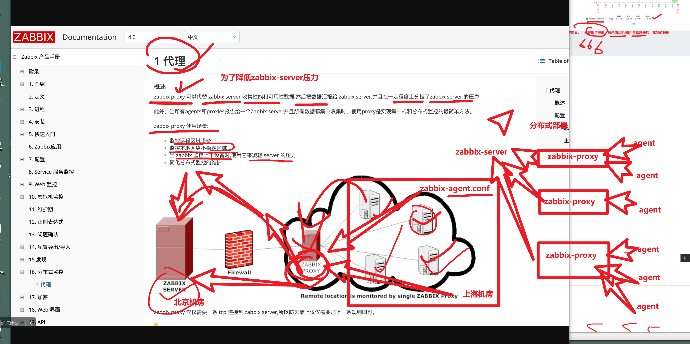

```bash
1. 部署一个zabbix-proxy机器

2. 设置zabbix元修改为清华的

rpm -ivh https://mirrors.tuna.tsinghua.edu.cn/zabbix/zabbix/4.0/rhel/7/x86_64/zabbix-release-4.0-1.el7.noarch.rpm

sed -i 's#repo.zabbix.com#mirrors.tuna.tsinghua.edu.cn/zabbix#g' /etc/yum.repos.d/zabbix.repo

yum install zabbix-proxy-mysql mariadb-server -y


3. zabbix-proxy 和 zabbix-server配置几乎一样，模拟了一个server角色，去存储agent的数据


systemctl start mariadb.service

mysqladmin password linux0224
mysql -uroot -plinux0224

4.数据库创建，zabbix库，以及mysql账号

# 非交互式的，执行mysql的 SQL语句

mysql -uroot -plinux0224 -e "create database zabbix_proxy character set utf8 collate utf8_bin;"

mysql -uroot -plinux0224 -e "grant all privileges on zabbix_proxy.* to zabbix_proxy@localhost identified by 'linux0224';"

mysql -uroot -plinux0224 -e "flush privileges;"


5. 导入zabbix——poroxy的数据库数据

zcat /usr/share/doc/zabbix-proxy-mysql-4.0.42/schema.sql.gz| mysql -uzabbix_proxy -plinux0224 zabbix_proxy


6.创建proxy配置文件
cat > /etc/zabbix/zabbix_proxy.conf <<'EOF'
ProxyMode=0 # 代理模式，0 主动， 1 被动
Server=10.0.0.71    # 填入zabbix-server地址
ServerPort=10051    # 填入zabbix-server端口
Hostname=zabbix-proxy-72     # 填入主机名
LogFile=/var/log/zabbix/zabbix_proxy.log
LogFileSize=0 
PidFile=/var/run/zabbix/zabbix_proxy.pid 
SocketDir=/var/run/zabbix
DBHost=localhost
DBName=zabbix_proxy
DBUser=zabbix_proxy
DBPassword=linux0224
ConfigFrequency=60 # proxy多久和server同步配置信息
DataSenderFrequency=5 # proxy多久发送一次自己的数据给server
EOF

7.启动，检查
systemctl restart zabbix-proxy.service

[root@zabbix-proxy-72 ~]#netstat -tunlp|grep zabbix
tcp        0      0 0.0.0.0:10051           0.0.0.0:*               LISTEN      1954/zabbix_proxy   
tcp6       0      0 :::10051                :::*                    LISTEN      1954/zabbix_proxy   


```


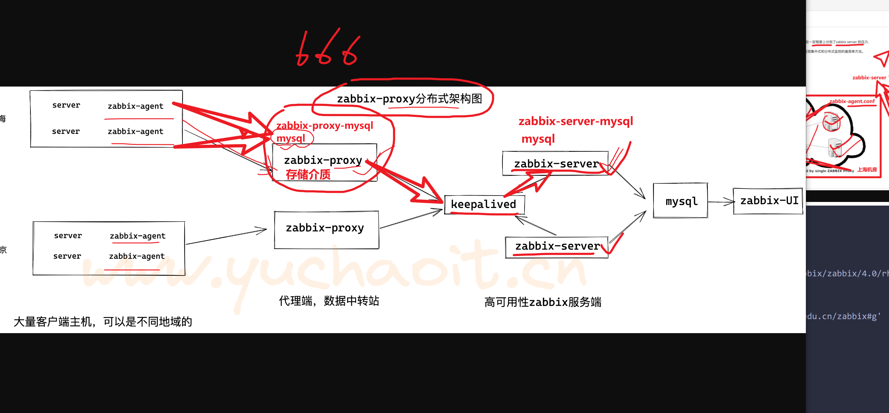

.

### 5.1 设置agent指向zabbix_proxy

>前置动作
>
>1. 关闭自动注册，自动发现等
>2. 删除现有的主机，查看基于zabbix-proxy模式的agent机器添加，数据采集

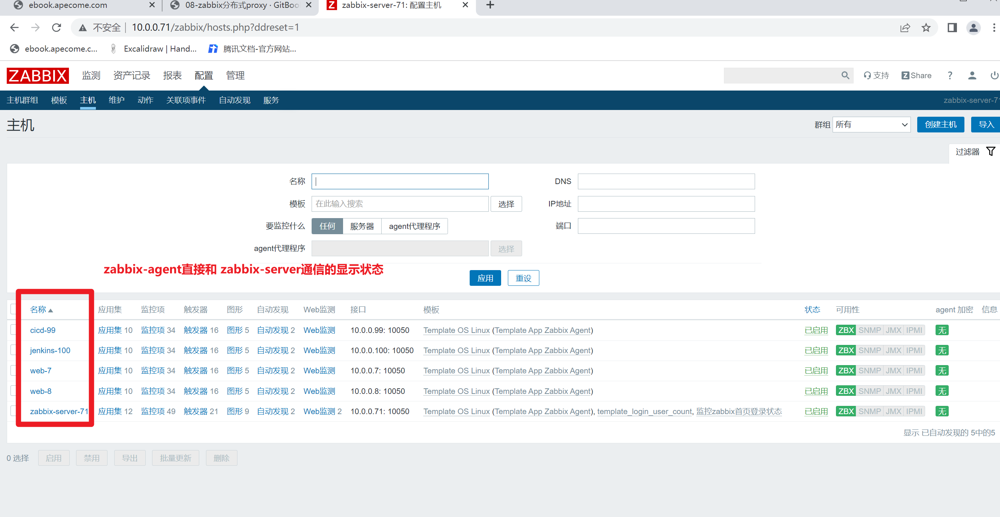

待会来看，基于zabbix-proxy模式的主机添加图解


```bash
# agent是什么 添加模式？
#  自动注册模式，看懂1111
# ServerActive=10.0.0.72
# HostMetadata=Linux

自己for循环批量给  web7 web8 cicd99 jenkins100


[root@zabbix-server-71 ~]#cat zabbix_agentd.conf 
PidFile=/var/run/zabbix/zabbix_agentd.pid
LogFile=/var/log/zabbix/zabbix_agentd.log
LogFileSize=0
Server=10.0.0.72
ServerActive=10.0.0.72
HostMetadata=Linux
Include=/etc/zabbix/zabbix_agentd.d/*.conf


[root@zabbix-server-71 ~]#for server in 7 8 99 100;do  scp zabbix_agentd.conf root@10.0.0.${server}:/etc/zabbix/ ; done
zabbix_agentd.conf                                                                                100%  200   494.5KB/s   00:00    
zabbix_agentd.conf                                                                                100%  200   444.5KB/s   00:00    
zabbix_agentd.conf                                                                                100%  200   371.4KB/s   00:00    
zabbix_agentd.conf                                                                                100%  200   353.2KB/s   00:00  


批量重启
for server in 7 8 99 100;do ssh root@10.0.0.${server} "systemctl restart zabbix-agent" ; done


```

### 5.2 去zabbix-UI中添加proxy的配置

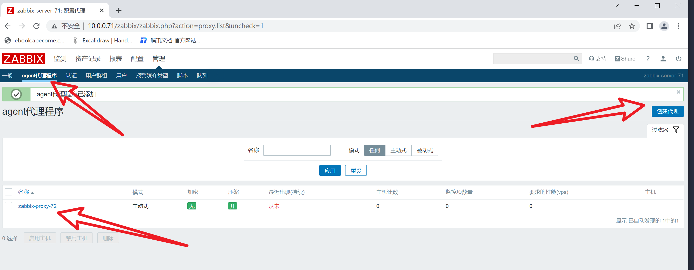


### 5.3 打开自动注册功能，让agent机器，注册到proxy后，再注册到server中

```
自动注册，匹配条件就是，主机元数据，里有 Linux

要求结果是

1. zabbix-UI中可以看到 基于proxy添加的主机
2. 钉钉发个消息


```

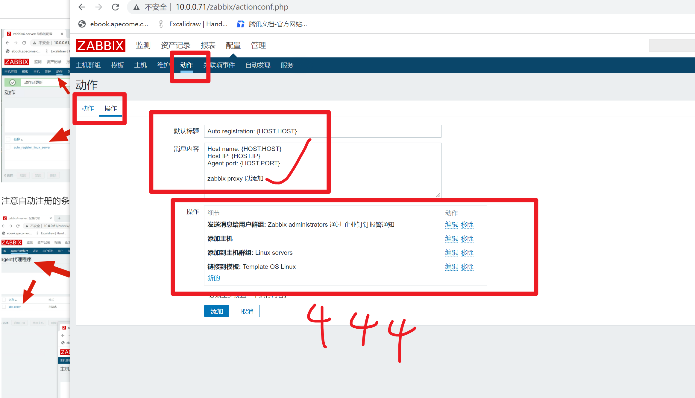


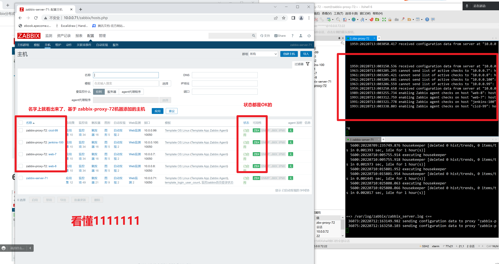


### 看最新数据

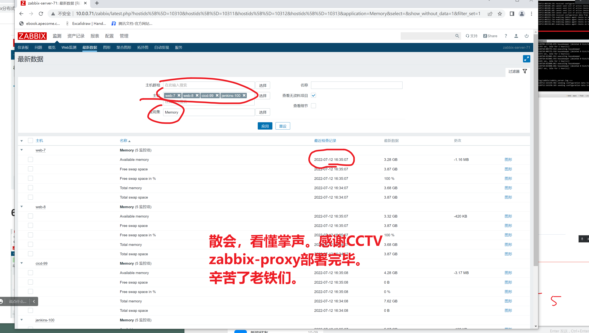


# 今日作业

睡觉前，作业发到群里头（主动模式）

tiger组

披荆斩棘组 

天天向上，还在上


```
1. 完成web监控 zabbix登录首页

2. 完成zabbix主动模式修改，理解什么是被动模式，什么是主动模式
以及如何修改监控项，改为主动模式
确保主动模式下的监控项，可以采集到数据，交给图形展示
要求采集web7，web8两台机器的 nginx状态，php-fpm状态

3. 完成zabbix的自动发现，额外添加 cicd-99 , jenkins-100 两台机器（基于模板机克隆即可）

4. 完成zabbix的自动注册（确保自动注册机器之后，能发送钉钉给你，加入了哪些机器）
通过聚合图形，展示4台机器的内存数据即可，确保自动注册正确

5. 完成zabbix-proxy代理配置，确保agent > proxy > server可以拿到数据

6.明日安排


========================================================================

给大家一天时间整理zabbix所学
1. 完成今天day75布置的作业
2. 完成zabbix所学的知识点整理，笔记
核心在于
- 监控怎么玩
- zabbix怎么部署
- zabbix如何监控服务器（模板、监控项、触发器、zabbix的动作设置、图形创建、聚合图形、多媒介，微信，邮件，钉钉额报警）
- 监控核心服务，nginx，php，自定义需求的监控
- zabbix性能相关（修改agent模式的，被动，主动模式）
- zabbbix的添加主机的性能相关（自动发现、自动注册）
- zabbix分布式监控架构，部署zabbix-proxy


3. 梳理完毕zabbix之后，迎接下一个阶段的，cicd章节，还挺简单的。

4. 人性化教学，保姆化教学，将心比心教学

====================================================
咱们，共同努力，创造一个好结果。
没问题的来一波，小花
====================================================================


```

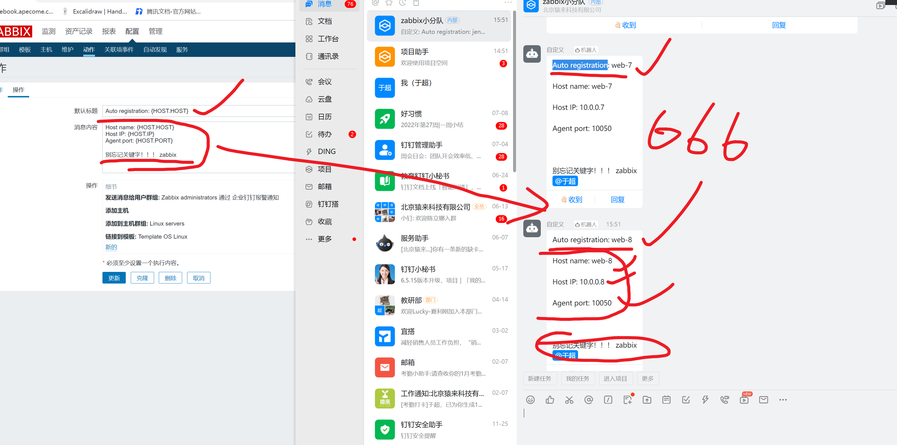


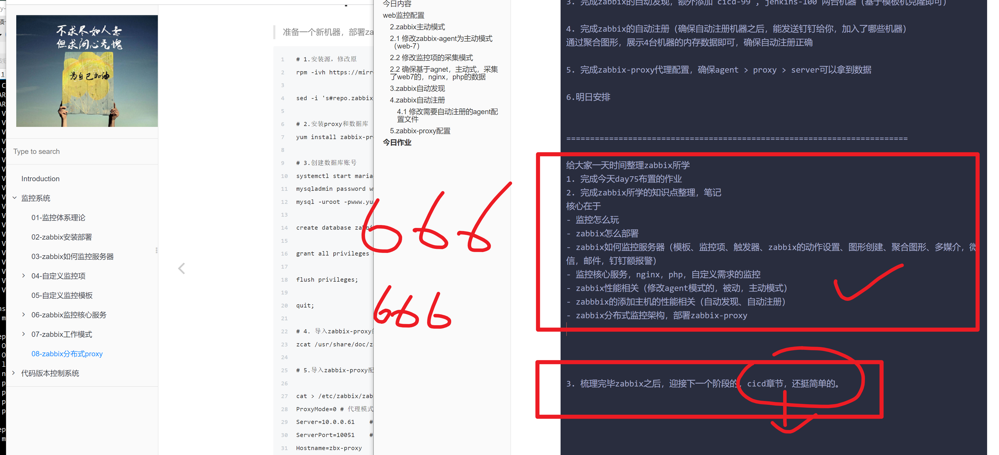


