```### 此资源由 58学课资源站 收集整理 ###
	想要获取完整课件资料 请访问：58xueke.com
	百万资源 畅享学习

```
# 1.目前我们怎么部署项目的？

```perl
运维，公司对语言的选择，千变万化


v1 陌陌APP只支持聊天功能


1. 拿到源代码
怎么拿？
	公司会部署代码仓库，进行源代码管理（github，gitlab，gitee码云）
	开发会吧代码传到这个仓库里
	运维，测试去下载这个源码
	php代码写的
	
	
	

2. 准备机器环境（测试服务器，线上服务器）
	为什么要有测试环境(公司内部的，内侧环境，社会用户是访问不了)？
		软件代码必然会有bug，需要层层测试通过后，确认bug很少了，可以达到上线标准了
		【vip充值功能，才能查看小姐姐的联系方式，bug，没做好用户的权限校验，不充钱也能看】
	软件达到的上线标准，
		才会进入到生产服务器的部署（ip，域名，是面向社会用户）
	linux机器 + mysql + php-fpm + nginx
	

3. 启动
	参考你理解的wordpress，就是部署php源码程序的流程，到这听懂111111


4. 项目开始运行再线上，可能会出现N种未知的错误，出了问题，得公司的技术团队，支持解决
	拿钱干活，日常到底要干啥，
	- 运维，主要就是软件发版时忙一点，准备上线的环境
	- 日常的项目运行中，对服务器的维护，通过搭建监控系统等，确保系统的可用性
	听懂111111

	黑客攻击，发送了大量的请求，无用的请求
	线上代码运行，代码是当用户访问到，基于某个url，请求，nginx代理转发给了某个模块
	（你不点登录，会触发哪个登录代码吗？登录的代码，是有bug的，但是你运行项目时，没执行该功能代码，因此项目时可以运行起来，但是不代表项目时正确）
	因此公司才需要招测试工程师去一个个功能的点击，最终确认该软件是没问题的
	基于这个理念，网站上线了，有某个优惠券的功能，开始发现不了有bug，但是再用户（也可以作为一个测试的角色去理解），代码触发执行，发生了bug，发现如优惠券，无法用的bug，F12抓请求，发现请求是500了，因此公司团队的，运维，开发，介入，修复 bug，重启，重新上线。
	这段概念，理解666666
	
	
	
5. 后期的项目更新,网站加了新功能，陌陌这个公司，APP，仅仅是聊天交友，得上线直播板块功能
	- 软件发版更新
		1. 开发，推送v2版本的代码，到代码仓库
		2. 下载代码，手动，或者shell脚本，将代码上传至目标服务器，干掉旧进程，替换源代码，重启新进程，确保软件更新
		3. 测试访问是否正常。
		
		看懂333333

6. 疑问？为什么要学这个cicd章节？

	如果你负责的业务太多，陌陌玩过把（app的业务功能），N个功能，N个板块，N套源代码，运行了N个进程，需要运维去维护。
	运维，可能要维护多个系统，上述流程，都需要你去，上线准备环境，准备机器，安装软件，改配置，重启，更新，发版，等。、。。。。。
	
	php 启动，部署的方式都不一样
	python 启动，部署的方式都不一样
	java  启动，部署的方式都不一样


2.学习完毕cicd之后如何部署？按如下思路来。


	必须得至少通过shell脚本完成,能实现环境的批量化，可复制操作。 111111
	
	还有就是更新，上线等一个流水线的操作，手动就别想了，那么人家陌陌公司，中大型公司，业务量大，就必须要求技术团队的能力要跟得上业务，
	
	要求，运维，都得懂些开发的知识，打造devsop，运维开发流水线团队。
	部署私有代码仓库，构建工具，实现，鼠标一点，就更新
	运维能实现，前期把构建项目的环境准备好，后期，连鼠标都可以扔了，不用点。
	开发推送代码，运维搭建的这个流水线，自动将代码更新到测试，线上环境，。
	运维只需要躺着喝咖啡，看日志就行。
	这套系统学不学。
	学1111111

	
	
	是一个小公司，5个左右的业务，招1,2普通运维，手工维护也差不多能行

	
那么，本阶段的课程，正式开始。休息片刻，理解下业务层面的知识。


```


devops运维工程师进阶之路

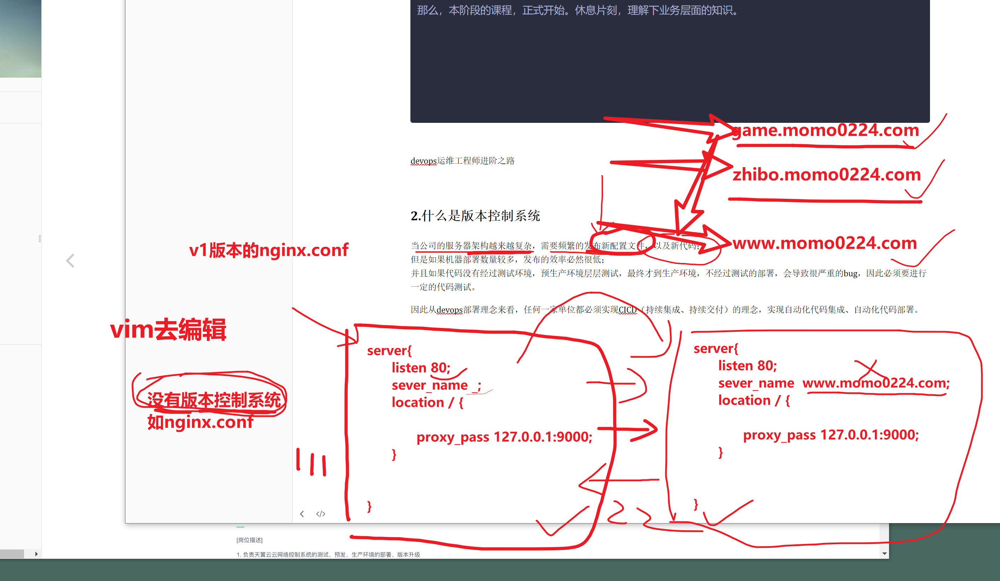


# 2.什么是版本控制系统

1.当公司的服务器架构越来越复杂，需要频繁的发布新配置文件，以及新代码；如何确保多个版本的存在？

```
引入版本控制系统，的工作中应用


微信的APP，软件发布，源代码的版本管理

v1 版本支持 "语音功能"
v2 版本 "支持语音转文字功能"
v3 版本，"支持视频聊天功能"


运维的配置文件管理

v1 nginx.conf "支持首页www的虚拟主机配置"

v2 nginx.conf  "支持三个业务的虚拟主机配置，本次添加了3个server{}配置"


1111

具体版本控制系统，能实现什么效果 ，接着看


```


2.但是如果机器部署数量较多，发布的效率必然很低；（自动化构建系统）


devops，产品经理需要去定义的，开发模式。

软件开发理论。开发运维测试，一套流水线


3.并且如果代码没有经过测试环境，预生产环境层层测试，最终才到生产环境，不经过测试的部署，会导致很严重的bug，因此必须要进行一定的代码测试。（再运维构建系统中，还支持对代码的扫描，检测，bug检测，如漏洞检测。）

```
1. 开发提交了一堆代码 *.php，提交到代码仓库

2. 运维部署的构建系统，下载代码，自动化测试，扫描代码（大多数bug，漏洞全扫出来，只有通过了代码的质量检查之后，下一步的动作，才进入，部署到具体的生产服务器上

```


因此，再互联网公司中的开发，模式，就是 开发 > 测试 >运维，一套流水线，确保软件的高质量发布，切频繁发布，频繁迭代更新。

这就是devops文化，


因此从devops部署理念来看，任何一家单位都必须实现CICD（持续集成、持续交付）的理念，实现自动化代码集成、自动化代码部署。

```
如何落地，打造一个devops开发团队呢？
让开发，和运维再同一个组，运维也得懂开发的一些知识，部署软件更新流水线，能实现，快捷的软件发布，软件更新，软件测试。

学会了这套系统的运维，就是devops运维工程师了。、


目前主流的解决方案，学习的技术就是

git       代码版本控制系统
jenkins   代码构建系统
gitlab    私有代码仓库
sonarqube 代码扫描工具


这套理念，大致听懂6666


```


# 3.你以后的成长之路是如何？


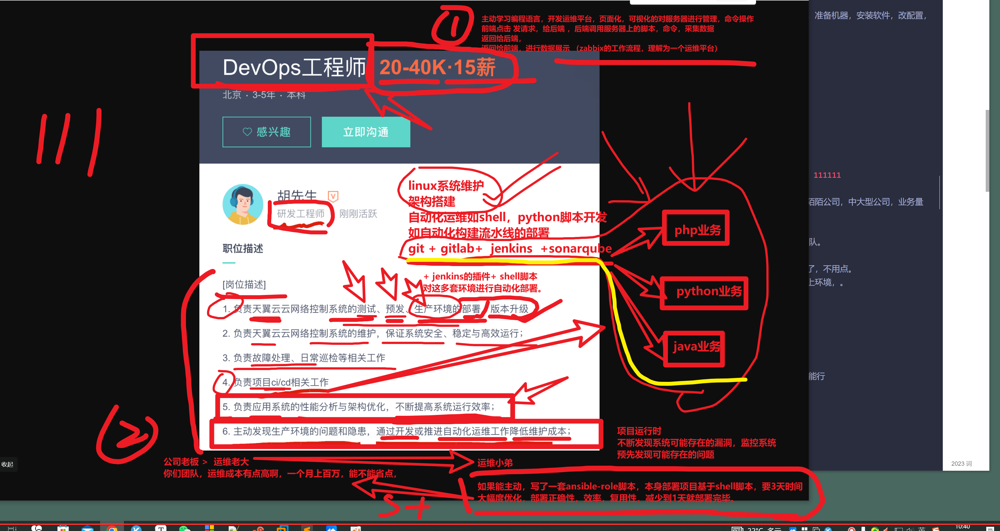


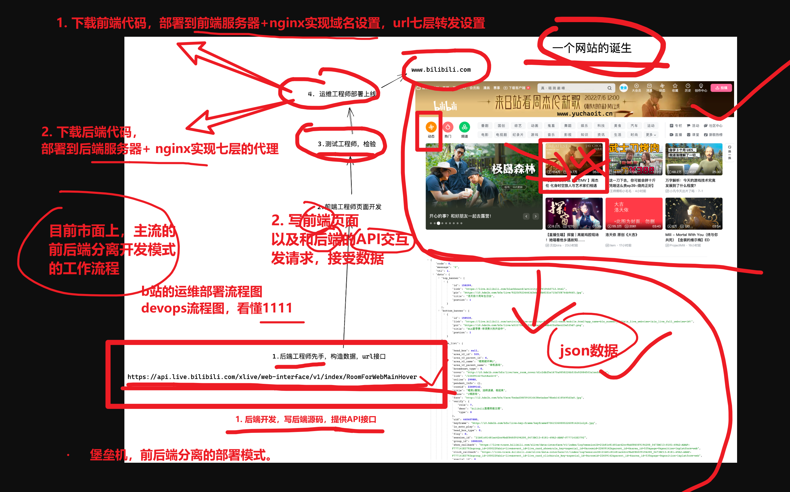


```
1.今天的学习重点

1. 是理论，理解devops高级运维工程，要懂得架构体系知识

2. 学习git工具


```


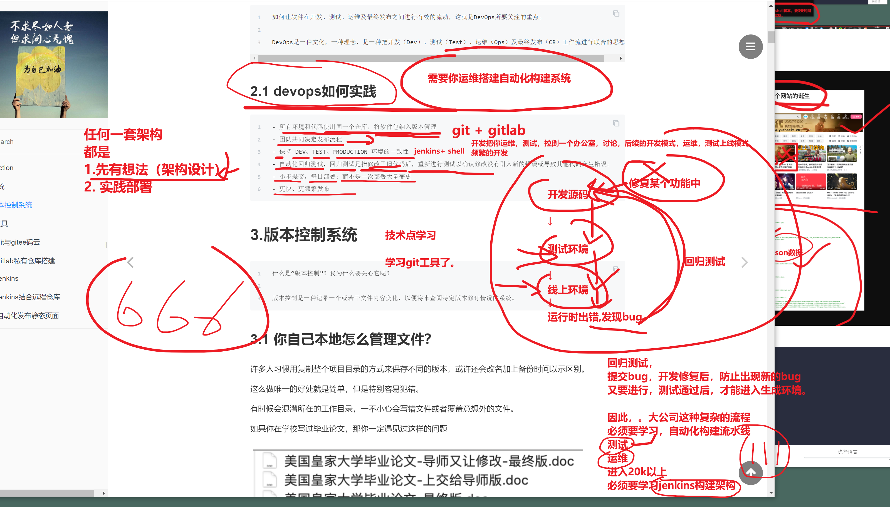


# 4.开始学习自动化构建系统组件之一，git


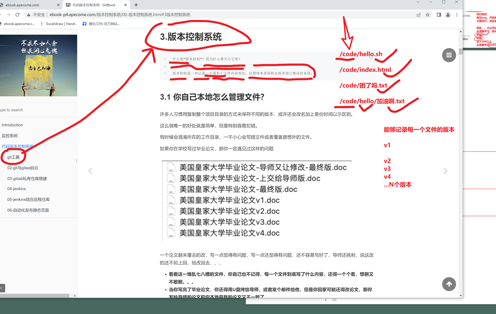为什么要版本记录？不用行吗？


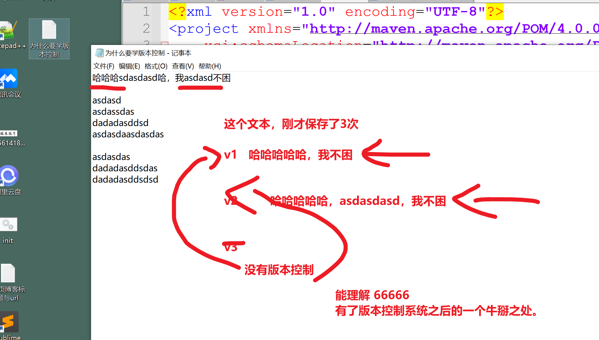


当你学了git工具之后，对linux的源码管理，配置文件管理

可以用在你自己的windows机器上，

word文档版本管理

execel文档

markdown笔记，版本管理，都可以通过git实现多个版本的管理，

历史版本回退。


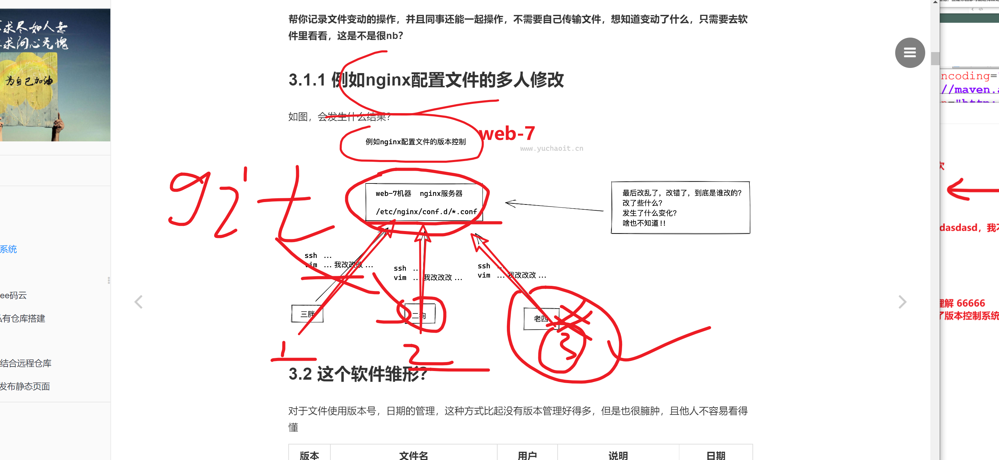


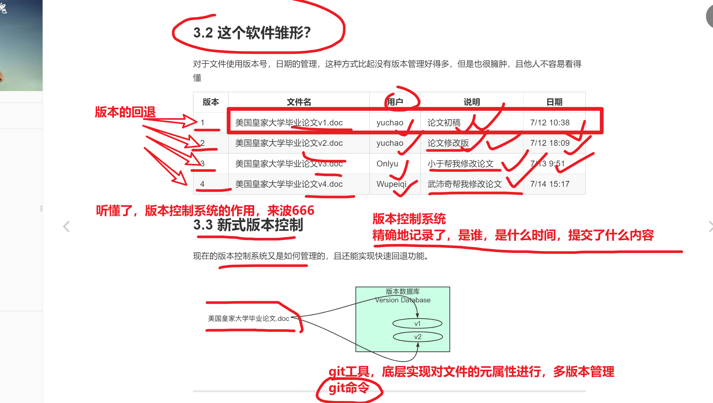

什么是版本控制系统


# 什么是cicd，俩名词

##  ci ，持续集成

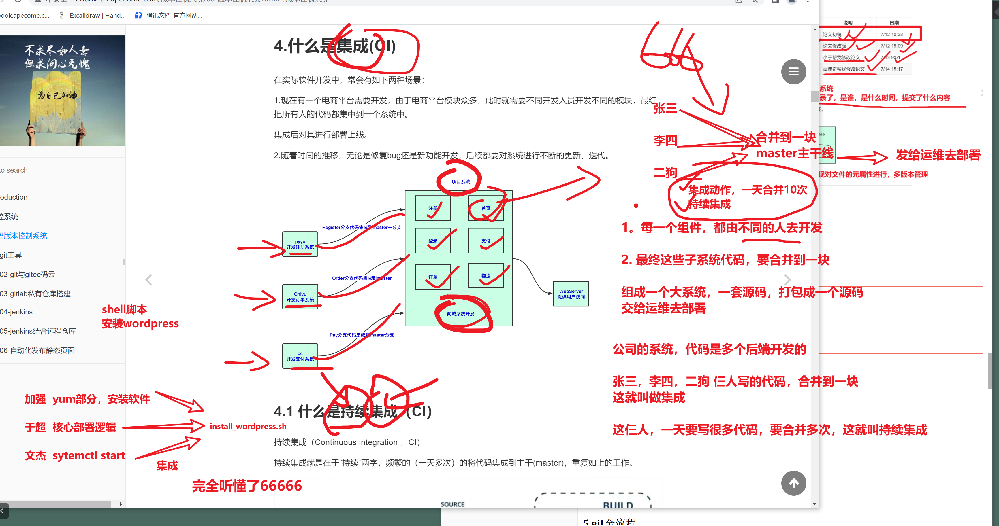


## 什么是ci/cd

在源代码，持续合并多次的过程中，每次合并，到master主干线，都要

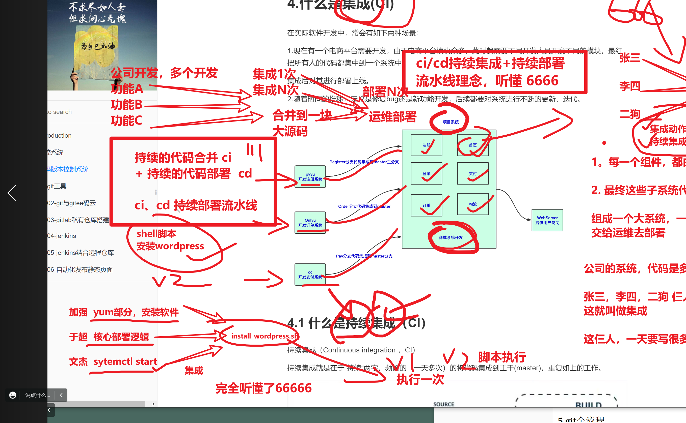


# 具体进行源码的版本管理，有哪些软件呢？

- svn老旧，非互联网公司可能用，矿场，机场，传统行业电子制造业，软件系统
  - 源码管理
- git工具，所有互联网公司必备（linux的老父亲，林纳斯托瓦兹开发的，开发git工具）
  - linux内核源码，


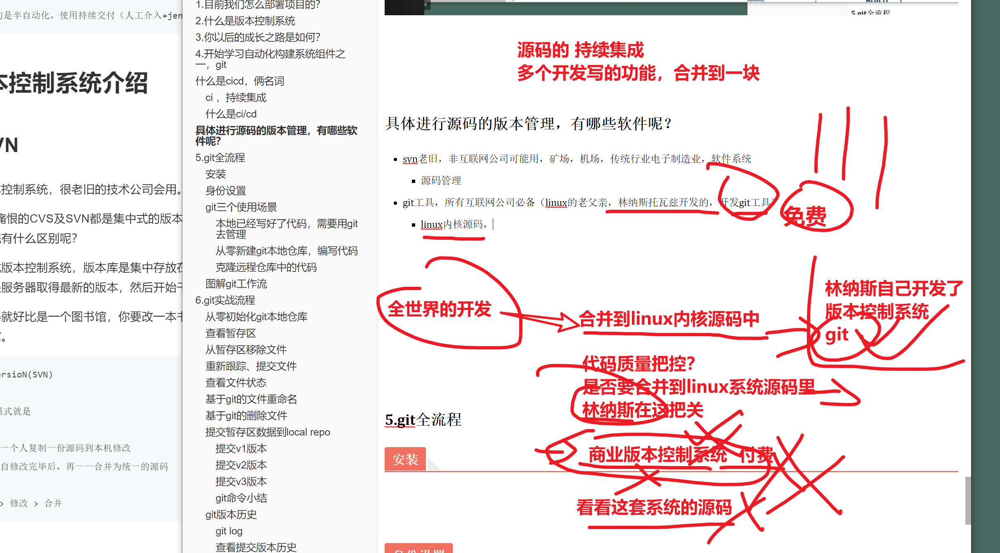


### 什么是svn，集中式的版本控制系统

不好用

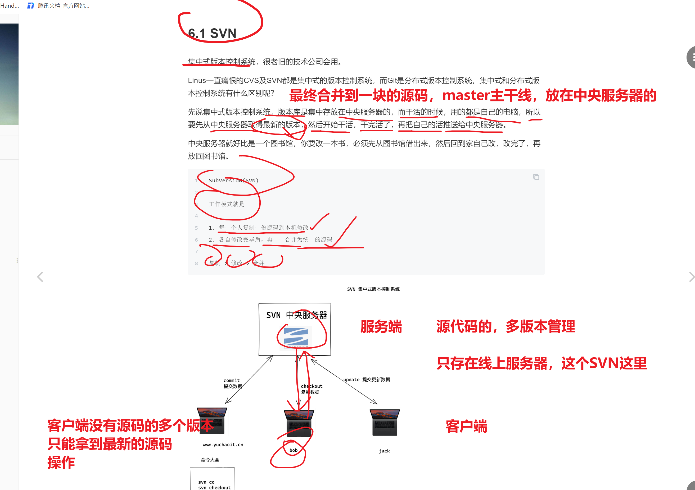


# 分布式版本控制系统git的强大

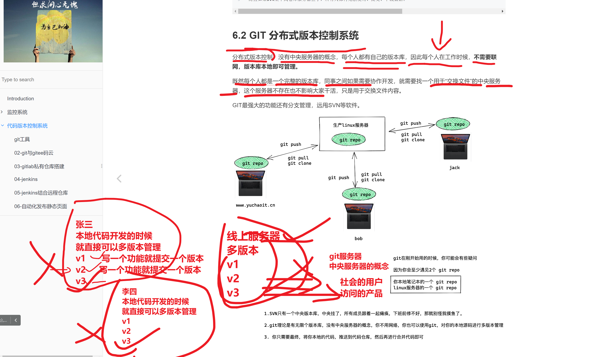


```
git工具，基本是开发工程师去写代码，进行的多版本维护的使用

运维，可以基于git实现对自己配置文件的多版本管理

运维主要就是学习
如何对一个git代码仓库，进行命令操作

查看版本日志
版本提交
版本回退
这些操作


```


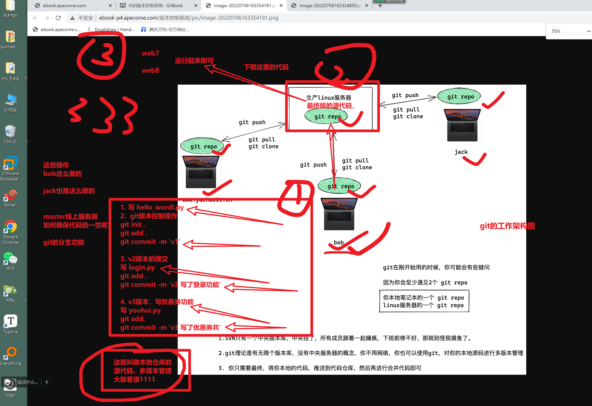


12.10继续

休息会

课间，思考下，理解理解git的图


```
这个git的架构，还是有一定的理解难度的

等学完了git的实际操作，分支，远程仓库后，即可理解


```


# 5.git全流程


以学习git工具为主，实践


## linux安装

```
yum install git -y

[root@web-7 ~/git-learn]#git --version
git version 1.8.3.1


```


## 身份设置

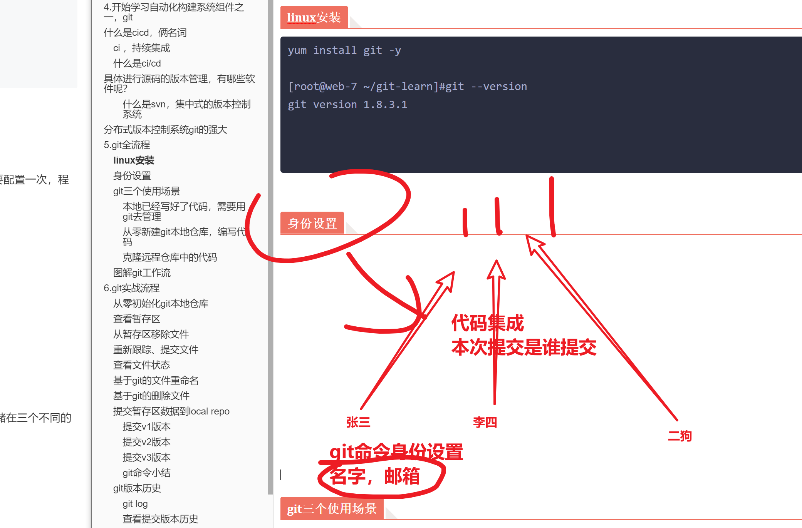

```
一般用如下命令，设置身份即可
# 给git设置配置信息 --global 参数，身份信息，会写入 ~/.gitconfig


git config --global user.name "wenjie"
git config --global user.email "wenjie01@163.com"
# 开启git命令的颜色支持
git config --global color.ui true

查看配置文件
cat ~/.gitconfig

查看当前机器的git身份配置信息
[root@web-7 ~/git-learn]#cat ~/.gitconfig
[user]
	name = wenjie
	email = wenjie01@163.com
[color]
	ui = true


[root@web-7 ~/git-learn]#git config --list
user.name=wenjie
user.email=wenjie01@163.com
color.ui=true


看懂刷  222222


```


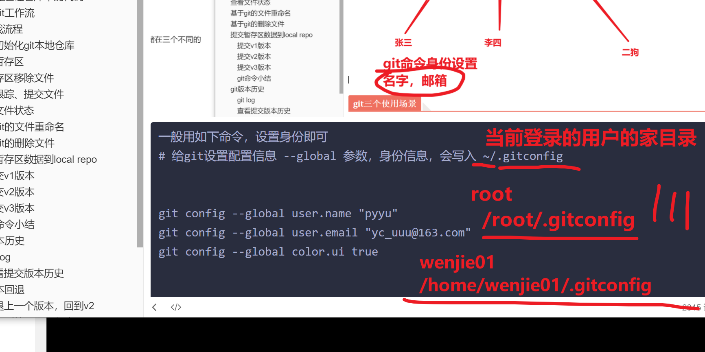


## git三个使用场景

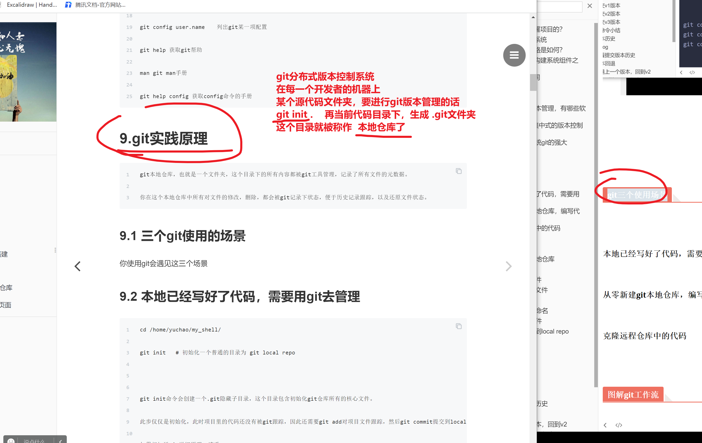

```
git能够记录，源代码目录中，所有文件的状态，这个记录的数据，都在 .git这个隐藏文件夹中

```


使用git命令，有3个场景


### 玩法1，本地已经写好了代码，需要用git去管理

git的使用流程套路

```
1. git init . 初始化本地仓库

2.  写代码，如 hello.sh

3. 通过git add . 进行本地文件追踪管理，文件信息被记录到 暂存区


4.  git commit -m '注释'  ，将暂存区的数据，提交到local repo  本地仓库，进行第一个版本的记录


```


```
[root@web-7 ~/git-learn/my_shell]#pwd
/root/git-learn/my_shell
[root@web-7 ~/git-learn/my_shell]#
[root@web-7 ~/git-learn/my_shell]#ls
hello.sh
[root@web-7 ~/git-learn/my_shell]#
[root@web-7 ~/git-learn/my_shell]#
[root@web-7 ~/git-learn/my_shell]#ls -a
.  ..  hello.sh


没有被git进行管理

使用git进行，从0 到1管理


1. 初始化生成 .git文件夹
[root@web-7 ~/git-learn/my_shell]#git init .
初始化了一个空的git仓库 再 /root/git-learn/my_shell/.git/
Initialized empty Git repository in /root/git-learn/my_shell/.git/

查看这个.git本地仓库的文件夹，有什么内容
[root@web-7 ~/git-learn/my_shell]#ls .git
branches  config  description  HEAD  hooks  info  objects  refs


这个时候，/root/git-learn/my_shell
该文件夹，就被git管理了
再这个目录下对文件的修改类操作，就会被git进行记录了

命令，查看git工作区的状态

[root@web-7 ~/git-learn/my_shell]#git status
# On branch master
#
# Initial commit
#
# Untracked files:
#   (use "git add <file>..." to include in what will be committed)
#
#	hello.sh
nothing added to commit but untracked files present (use "git add" to track)


追踪文件属性
[root@web-7 ~/git-learn/my_shell]#git add hello.sh
[root@web-7 ~/git-learn/my_shell]#
[root@web-7 ~/git-learn/my_shell]#
[root@web-7 ~/git-learn/my_shell]#
[root@web-7 ~/git-learn/my_shell]#git status
# On branch master
#
# Initial commit
#
# Changes to be committed:
#   (use "git rm --cached <file>..." to unstage)
#
#	new file:   hello.sh
#


提交版本了，提交第一个版本

[root@web-7 ~/git-learn/my_shell]#git commit -m 'v1 第一次提交'
[master (root-commit) 67d8f28] v1 第一次提交
 1 file changed, 1 insertion(+)
 create mode 100644 hello.sh


此时再用git status查看工作区的状态是如何
此时工作区就很干净了，需要提交的代码，没了


[root@web-7 ~/git-learn/my_shell]#git status
# On branch master
nothing to commit, working directory clean


```

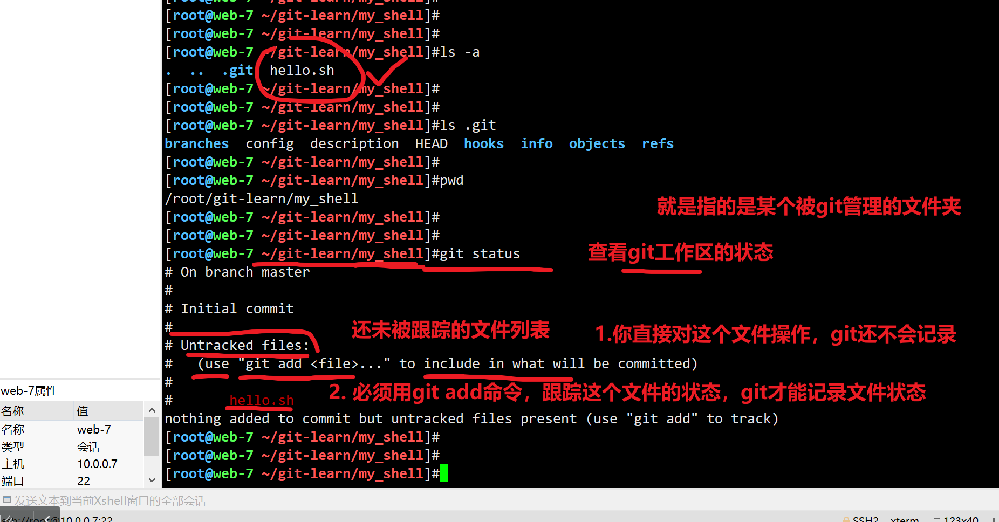


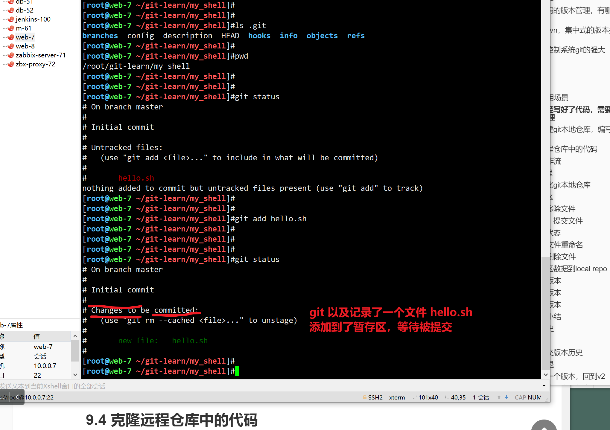


# =========下午开始=========


## 图解git玩法流程


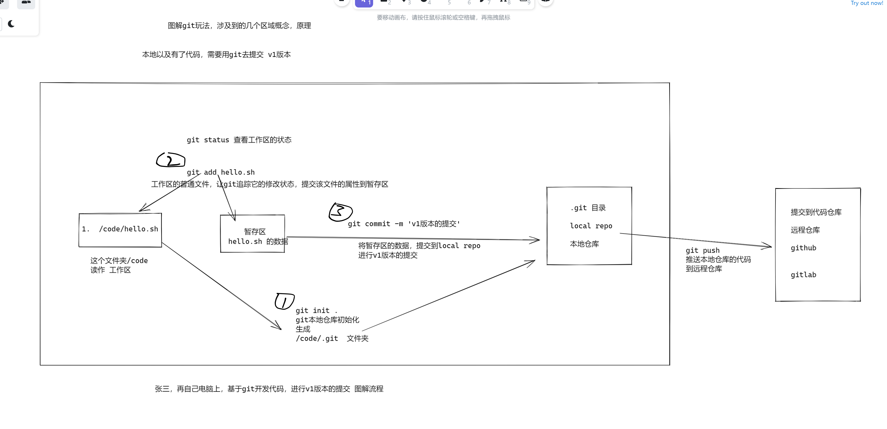

### 本地已经写好了代码，需要用git去管理

```
[root@web-7 ~/git-learn/my_sh]#ls
hello.sh  login.sh
[root@web-7 ~/git-learn/my_sh]#
[root@web-7 ~/git-learn/my_sh]#
[root@web-7 ~/git-learn/my_sh]#git status
# On branch master
#
# Initial commit
#
# Untracked files:
#   (use "git add <file>..." to include in what will be committed)
#
#	hello.sh
#	login.sh
nothing added to commit but untracked files present (use "git add" to track)


来看看，暂存区的内容，有什么
git的原理是，执行git add后，会将该文件的属性，加入到暂存区 .git/index 文件，暂存区文件


跟踪系统文件的属性


将暂存区的内容，提交到本地仓库，此时暂存区就被清空了


查看本地仓库的，版本记录，目前提交了几个版本


[root@web-7 ~/git-learn/my_sh]#git log
commit 423366fe129ede7063faa11257d77a4fc8ae83e7
Author: wenjie <wenjie01@163.com>
Date:   Thu Jul 14 15:16:41 2022 +0800

    v1 开发了2个sh hello.sh login.sh


# 上述是第一次提交，保存了文件的状态

# 继续写代码，进行第二次提交
修改了git工作区的代码，（没事就git status看一看状态）
[root@web-7 ~/git-learn/my_sh]#vim login.sh 
[root@web-7 ~/git-learn/my_sh]#
[root@web-7 ~/git-learn/my_sh]#
[root@web-7 ~/git-learn/my_sh]#ls
hello.sh  login.sh


# 添加到暂存区
git add login.sh

# 提交v2版本记录
[root@web-7 ~/git-learn/my_sh]#git commit -m 'v2 修改了login.sh的代码'
[master c87ed22] v2 修改了login.sh的代码
 1 file changed, 5 insertions(+)
[root@web-7 ~/git-learn/my_sh]#
[root@web-7 ~/git-learn/my_sh]#
[root@web-7 ~/git-learn/my_sh]#
[root@web-7 ~/git-learn/my_sh]#git status
# On branch master
nothing to commit, working directory clean


# 再次查看版本记录日志

[root@web-7 ~/git-learn/my_sh]#git log
commit c87ed2244072d2aedf952316ccf6f8cc78fee76b
Author: wenjie <wenjie01@163.com>
Date:   Thu Jul 14 15:24:08 2022 +0800

    v2 修改了login.sh的代码

commit 423366fe129ede7063faa11257d77a4fc8ae83e7
Author: wenjie <wenjie01@163.com>
Date:   Thu Jul 14 15:16:41 2022 +0800

    v1 开发了2个sh hello.sh login.sh


```

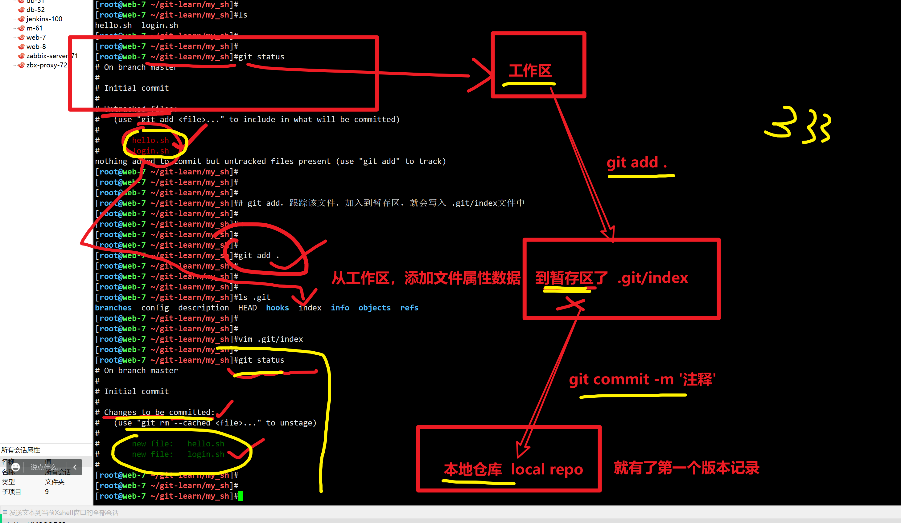

---

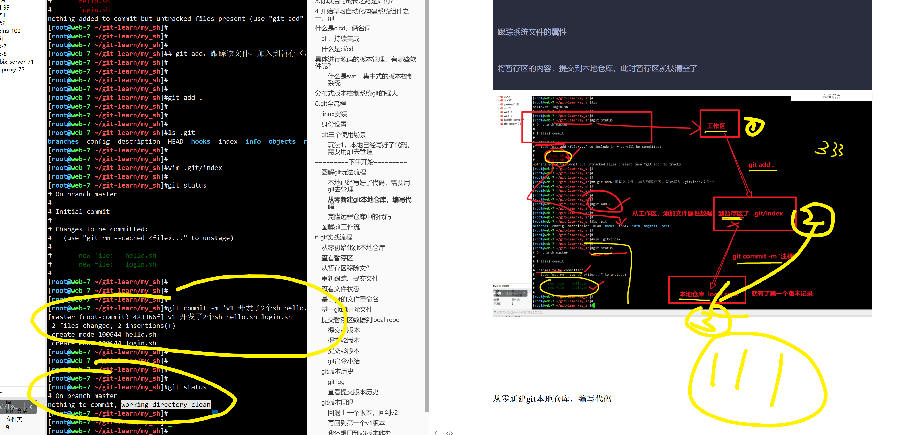


----

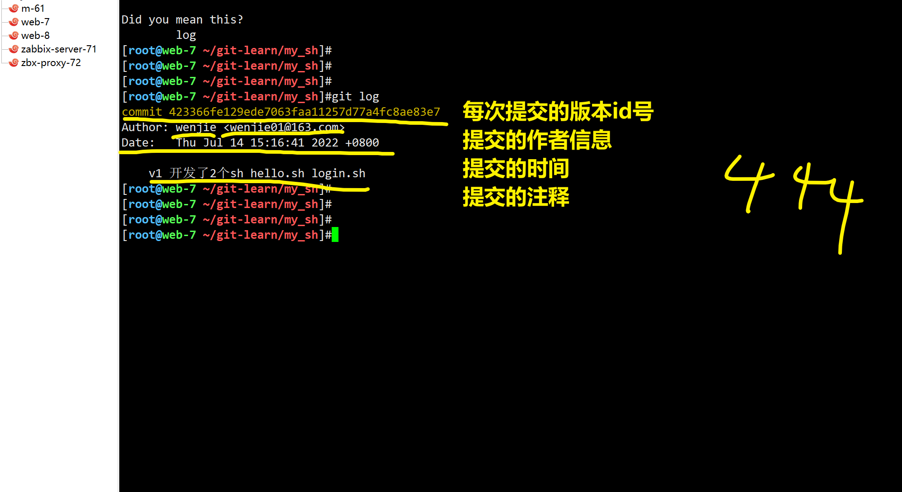


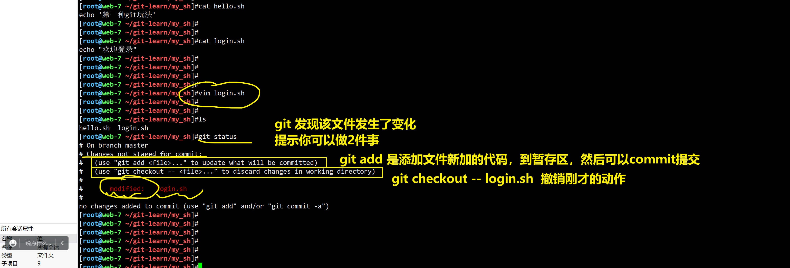


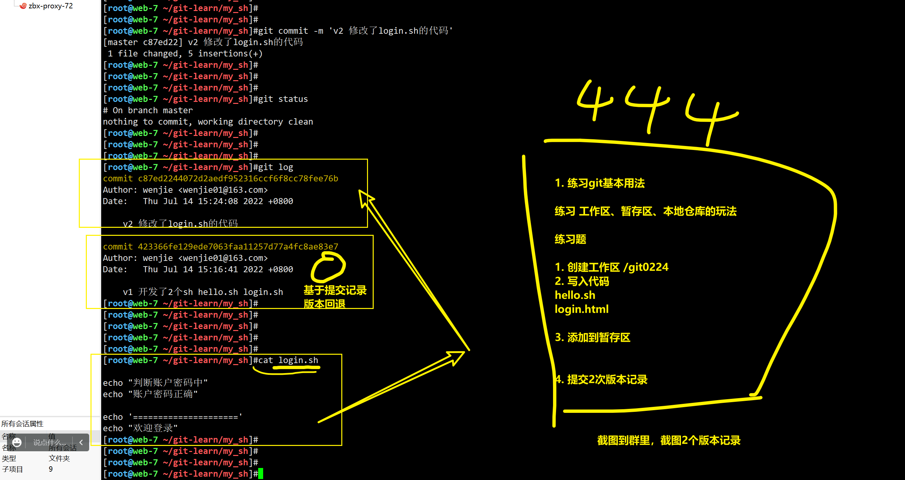


### 从零新建git本地仓库，编写代码

以开发者，写代码，用git管理的角度去练习

运维也可以基于这个玩法，去管理配置文件的多版本。

```

1. 直接git init，立即创建本地仓库（含有.git目录的一个文件夹）

2. 进入该git本地仓库，开始写代码，还是一样的套路


```

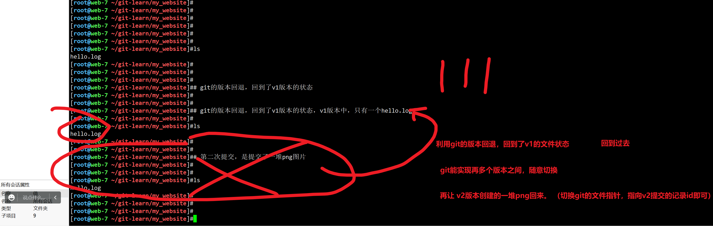

### 提前看下，版本回退，基于commit——ID切换状态

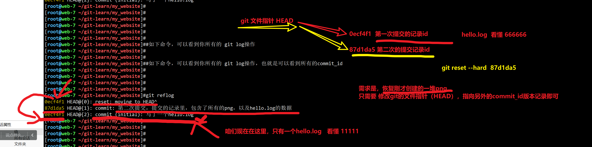

```
回到指定的提交记录id中
# 回到指定的提交id记录中
git reset --hard 87d1da5


# 回到上一次提交的版本id中
[root@web-7 ~/git-learn/my_website]#git reset --hard HEAD^

#回到 上 上 一次的提交版本id中 
[root@web-7 ~/git-learn/my_website]#git reset --hard HEAD^^

root@web-7 ~/git-learn/my_website]#
[root@web-7 ~/git-learn/my_website]#git reset --hard HEAD^
HEAD is now at 0ecf4f1 写了一个hello.log


```


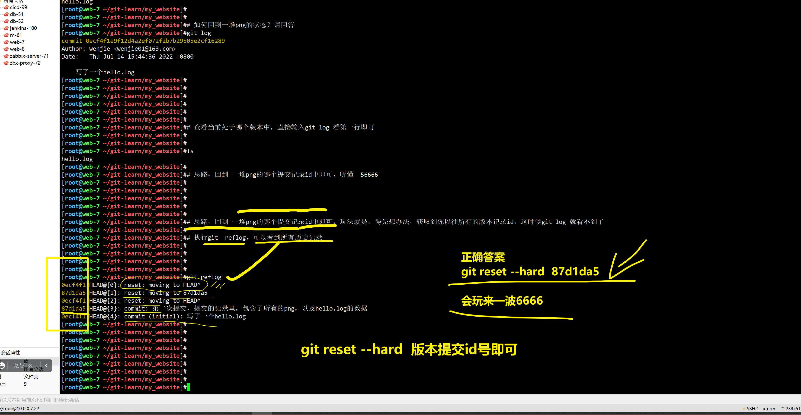


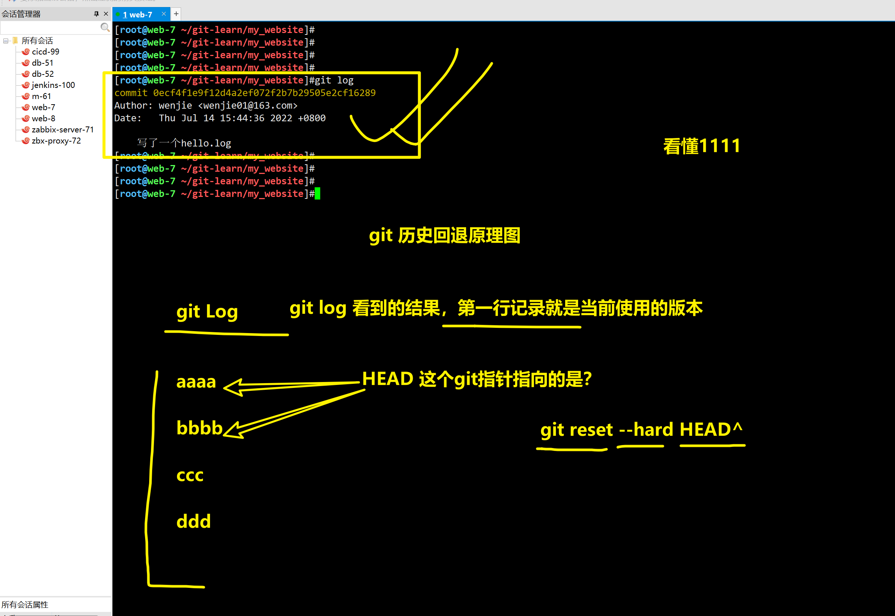


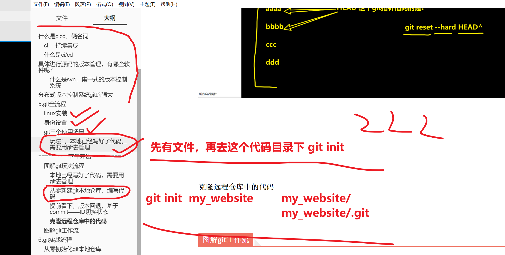


### 克隆远程仓库中的代码

```
基于git clone命令，直接下载一个远程仓库的代码

友情提醒，github再老远的墙外，你可能访问不了
国内的
gitee码云，https://gitee.com/ 
https://gitee.com/jumpserver/jumpserver?_from=gitee_search

git clone https://gitee.com/jumpserver/jumpserver.git

[root@web-7 /tmp]#git clone https://gitee.com/jumpserver/jumpserver.git
Cloning into 'jumpserver'...
remote: Enumerating objects: 72601, done.
remote: Counting objects: 100% (61413/61413), done.
remote: Compressing objects: 100% (16221/16221), done.
remote: Total 72601 (delta 43226), reused 60492 (delta 42372), pack-reused 11188
Receiving objects: 100% (72601/72601), 64.55 MiB | 12.85 MiB/s, done.
Resolving deltas: 100% (50717/50717), done.
[root@web-7 /tmp]#

[root@web-7 /tmp/jumpserver]#
[root@web-7 /tmp/jumpserver]## 2个办法确认它是一个git本地仓库，如何确认？
[root@web-7 /tmp/jumpserver]#
[root@web-7 /tmp/jumpserver]#
[root@web-7 /tmp/jumpserver]## 1. 看有没有.git 文件夹  2. 执行git 命令试试
[root@web-7 /tmp/jumpserver]#
[root@web-7 /tmp/jumpserver]#
[root@web-7 /tmp/jumpserver]## 1. 看有没有.git 文件夹  2. 执行git 命令试试  ，听懂 222222


# 查看日志，简写
# 记录只显示缩略的一行 
git log --oneline 

# 查看最新的4个记录


下载到本地就是一个 源码目录（.git） 文件夹


# 自动下载该源代码，一个基于.git 管理的 ，本地仓库

git clone https://github.com/jumpserver/jumpserver.git
```

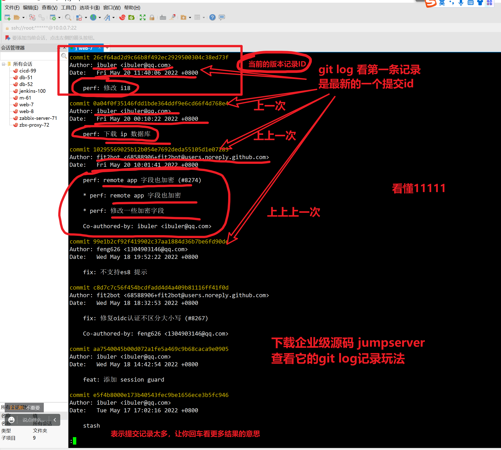


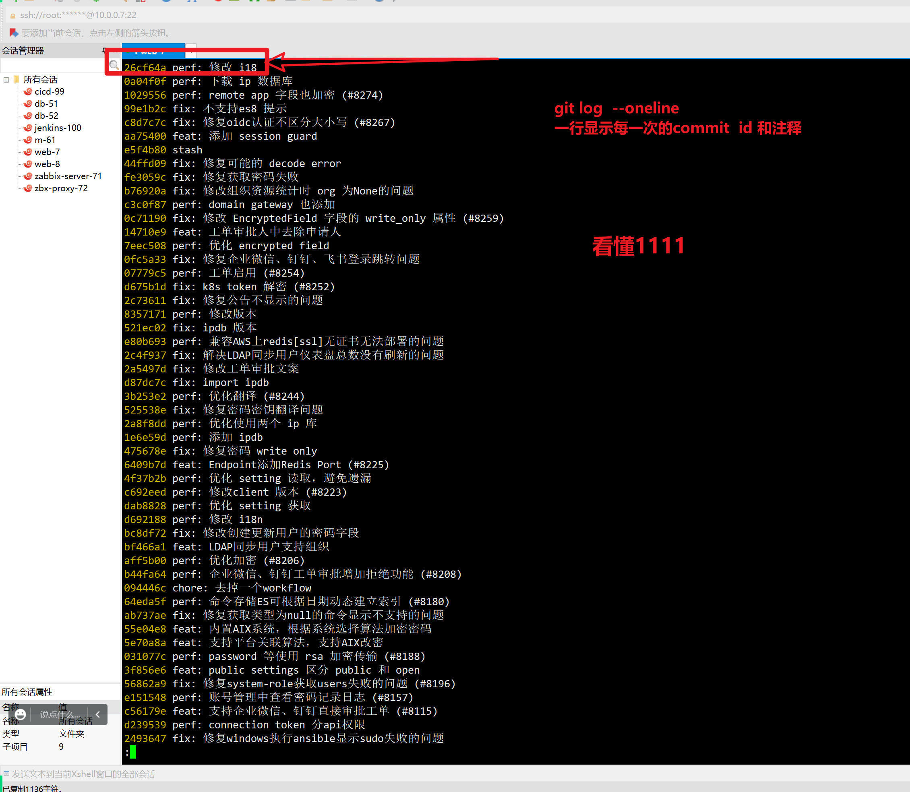


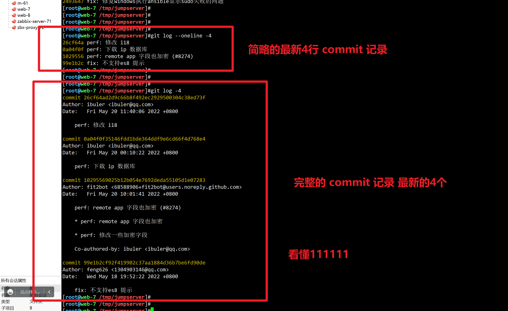


## 图解git工作流

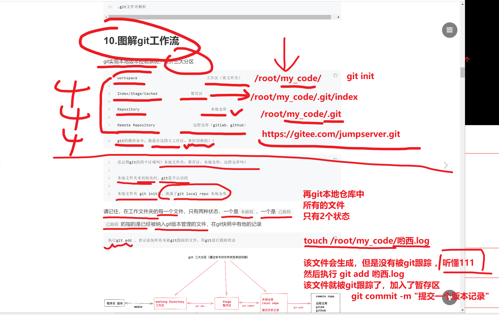


# 6.git实战流程


## 从零初始化git本地仓库


## 查看暂存区


## 从暂存区移除文件


## 重新跟踪、提交文件


## 查看文件状态


## 基于git的文件重命名


## 基于git的删除文件


## 提交暂存区数据到local repo


### 提交v1版本


### 提交v2版本


### 提交v3版本


### git命令小结


## git版本历史

### git log


### 查看提交版本历史


## git版本回退


### 回退上一个版本，回到v2


### 再回到第一个v1版本


### 我还想回到v3版本咋办


### git log总结


## git撤销功能


# git版本控制总结


