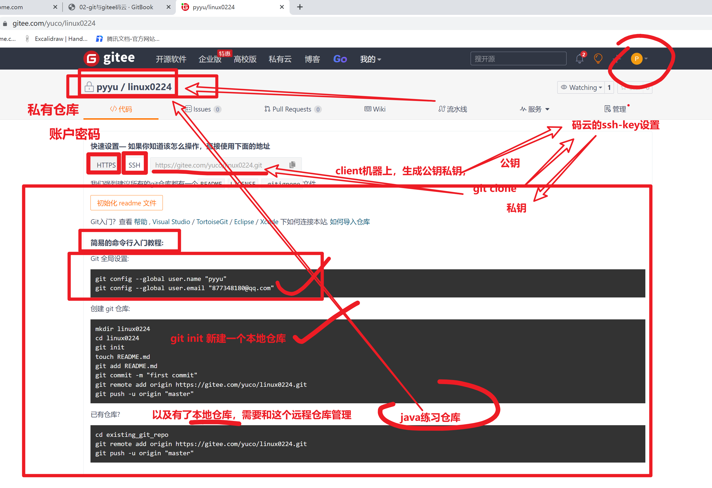

```### 此资源由 58学课资源站 收集整理 ###
	想要获取完整课件资料 请访问：58xueke.com
	百万资源 畅享学习

```
# 1.git分支

在前面我们基本了解Git的使用方法，这一节我们看下GIt重要概念【分支】


```
背景

例如于超老师在开发一个同性交友网站，刚写到登录功能，代码还没写完，今天先睡觉了，所以就commit提交到本地仓库了。

假如这会另一个程序员张三不知道，还直接对这个代码继续开发，这就乱套了。


讲道理，应该这么玩：
1. 分别给于超老师添加一个分支 yuchao，张三一个分支  zhangsan
2. 这俩人基于自己的分支环境去写代码，进行版本提交，却能互不影响
3. 最后将这2人的代码进行合并即可（需要考虑可能存在冲突，手动解决）
```


## 1.1 分支命令实践

>如下操作，我们是用本地仓库作为练习，创建分支，合并分支到master
>
>切换分支
>
>是在一个机器本地上操作


>但是，同理玩法下，这个仓库，应该是由远程仓库提供，如在码云中的代码仓库
>
>提供如master分支
>
>zhangsan分支  张三推代码
>
>bob 分支  鲍勃推代码
>
>最终他俩的代码合并到master
>
>运维直接下载master的代码，到linux服务器上，为最终线上源码。


### 默认版本仓库只有一个分支，master

```
git branch
直接看到当前版本仓库 有几个分支
以及有星星的哪个分支，就是你再用的

[root@tomcat-10 ~/springboot-bucket]#git branch
* master


```

### 创建分支

```bash
1. 命令先创建好分支，再切换过去
[root@tomcat-10 ~/springboot-bucket]#git branch liangliang
[root@tomcat-10 ~/springboot-bucket]#
[root@tomcat-10 ~/springboot-bucket]#
[root@tomcat-10 ~/springboot-bucket]#git branch
  liangliang
* master
[root@tomcat-10 ~/springboot-bucket]#
[root@tomcat-10 ~/springboot-bucket]#
[root@tomcat-10 ~/springboot-bucket]#git branch wenjie
[root@tomcat-10 ~/springboot-bucket]#
[root@tomcat-10 ~/springboot-bucket]#
[root@tomcat-10 ~/springboot-bucket]#
[root@tomcat-10 ~/springboot-bucket]#git branch
  liangliang
* master
  wenjie

[root@tomcat-10 ~/springboot-bucket]#git checkout wenjie
Switched to branch 'wenjie'
[root@tomcat-10 ~/springboot-bucket]#
[root@tomcat-10 ~/springboot-bucket]#
[root@tomcat-10 ~/springboot-bucket]#git branch
  liangliang
  master
* wenjie
[root@tomcat-10 ~/springboot-bucket]#
[root@tomcat-10 ~/springboot-bucket]## 看懂分支的创建，切换，以及查看  1111
[root@tomcat-10 ~/springboot-bucket]#


2. 直接创建，并且立即切换分支


[root@tomcat-10 ~/springboot-bucket]#git checkout -b yuchao
Switched to a new branch 'yuchao'
[root@tomcat-10 ~/springboot-bucket]#
[root@tomcat-10 ~/springboot-bucket]#
[root@tomcat-10 ~/springboot-bucket]#git branch
  liangliang
  master
  wenjie
* yuchao


```

### 切换分支

```
```

### wenjie分支下写代码

这里就是公司里的多个程序员，如何开发同一套系统的流程了。


```
# 基于wenjie分支，创建文杰自己的代码，提交版本（再这个分支下的，版本记录，属于wenjie）
# 写代码、追踪、提交记录


```

### 切换到liangliang分支看看


### 切换master分支

## 敲黑板，重点


```
master和其他分支一样，就是个普通分支，没什么特点
只不过凑巧，它是默认的分支而已

想看到wenjie分支的代码，还必须得合并版本记录
看懂6666


```

你此时只有切到wenjie分支，才能看到代码文件


### 合并分支（合并文杰写代码，到master上来）

master作为约定俗成的默认分支，代码都合并到它这里即可。

合并wenjie分支的代码到master主干线上来


### 分支冲突

这里是新添加了一个文件，合并数据还好，如果是同一个文件，且同一行数据的修改，岂不是GG？

让分支提交的代码版本记录

和另外一个分支master也生成同一个文件，修改同一行数据


分支合并，冲突


#### 1.再创建一个分支，liangliang，搞破坏，且提交代码到版本仓库

```
[root@tomcat-10 ~/springboot-bucket]#git log -2
commit 24a0a791ace3fd40b55428aded7488eafe0ee6df
Author: pyyu <yc_uuu@163.com>
Date:   Fri Jul 15 23:20:58 2022 +0800

    liangliang 提交了 sh文件

commit 953662cc4dd0c2f9807fb4a1256524af611712e9
Author: pyyu <yc_uuu@163.com>
Date:   Fri Jul 15 22:01:46 2022 +0800

    v3


```


#### 2.切换回master分支，别合并，先修改同一个文件，注意提交到版本仓库

合并是指，版本记录的合并


```


```

#### 3.试试这回合并代码呢？master和zhangsan修改了同一行数据

```
```


#### 4.手工解决冲突即可


## 1.2 删除分支

```
开发完毕后，无用的分支都删掉即可

[root@tomcat-10 ~/springboot-bucket]#git branch
  liangliang
* master
  wenjie
  yuchao
[root@tomcat-10 ~/springboot-bucket]#git branch -d liangliang 
Deleted branch liangliang (was 24a0a79).
[root@tomcat-10 ~/springboot-bucket]#git branch -d wenjie 
Deleted branch wenjie (was 1e07902).
[root@tomcat-10 ~/springboot-bucket]#git branch -d yuchao 
Deleted branch yuchao (was 953662c).
[root@tomcat-10 ~/springboot-bucket]#
[root@tomcat-10 ~/springboot-bucket]#
[root@tomcat-10 ~/springboot-bucket]#git branch
* master
[root@tomcat-10 ~/springboot-bucket]#


```


这是再本地仓库中的分支管理玩法


## 1.3 查看远程仓库，码云，的分支玩法

再你对git的分支命令操作，理解之后，点点点，就很小儿科了。 


1.创建远程仓库（git init ）


# 2.git标签


## 2.1 为啥用git标签功能


## 2.2 tag标签实践


# 3.git远程仓库

## 3.1 github


## 3.2 码云Gitee



```bash

# git remote add 添加一个远程仓库的别名 origin ，具体地址 https://gitee.com/yuco/linux0224.git


听懂22222222222


检查 当前本地仓库的，远程仓库配置
[root@tomcat-10 ~/springboot-bucket]#git remote -v
origin	https://gitee.com/yidao620/springboot-bucket.git (fetch)
origin	https://gitee.com/yidao620/springboot-bucket.git (push)


删除该记录
[root@tomcat-10 ~/springboot-bucket]#git remote remove origin 
[root@tomcat-10 ~/springboot-bucket]#
[root@tomcat-10 ~/springboot-bucket]#
[root@tomcat-10 ~/springboot-bucket]#
[root@tomcat-10 ~/springboot-bucket]#git remote -v


关联你自己仓库，目前采用的是https协议，需要账户密码验证

git remote add origin https://gitee.com/yuco/linux0224.git

# git push  把本地仓库的数据，推送到origin远程仓库，推送到master分支中
git push -u origin "master"


[root@tomcat-10 ~/springboot-bucket]#git push -u origin "master"
Username for 'https://gitee.com': 877348180@qq.com
Password for 'https://877348180@qq.com@gitee.com': 
Counting objects: 2800, done.
Delta compression using up to 4 threads.
Compressing objects: 100% (1155/1155), done.
Writing objects: 100% (2800/2800), 2.20 MiB | 640.00 KiB/s, done.
Total 2800 (delta 1062), reused 2771 (delta 1051)
remote: Resolving deltas: 100% (1062/1062), done.
remote: Powered by GITEE.COM [GNK-6.3]
To https://gitee.com/yuco/linux0224.git
 * [new branch]      master -> master
Branch master set up to track remote branch master from origin.
[root@tomcat-10 ~/springboot-bucket]#


# 第二个玩法，基于sshkey的验证
# 结合者，本地写代码，推送到远程管理
[root@tomcat-10 ~/springboot-bucket]#
[root@tomcat-10 ~/springboot-bucket]#git log -2
commit 72c4941ea1ae99968276314ec09a9b752bf1b456
Author: pyyu <yc_uuu@163.com>
Date:   Fri Jul 15 23:50:12 2022 +0800

    鸡汤来了

commit 7d33b7e42f3a59bec687e34748eafdd557195294
Merge: 789ed99 24a0a79
Author: pyyu <yc_uuu@163.com>
Date:   Fri Jul 15 23:31:07 2022 +0800

    master修复了分支冲突 liangliang.sh
[root@tomcat-10 ~/springboot-bucket]#


# 修改为git协议

[root@tomcat-10 ~/springboot-bucket]#git remote -v
origin	https://gitee.com/yuco/linux0224.git (fetch)
origin	https://gitee.com/yuco/linux0224.git (push)


[root@tomcat-10 ~/springboot-bucket]#git remote remove origin 
[root@tomcat-10 ~/springboot-bucket]#
[root@tomcat-10 ~/springboot-bucket]#
[root@tomcat-10 ~/springboot-bucket]#
[root@tomcat-10 ~/springboot-bucket]#git remote -v
[root@tomcat-10 ~/springboot-bucket]#
[root@tomcat-10 ~/springboot-bucket]##11111


# 修改为，git协议

git remote add origin git@gitee.com:yuco/linux0224.git

[root@tomcat-10 ~/springboot-bucket]#git remote add origin git@gitee.com:yuco/linux0224.git
[root@tomcat-10 ~/springboot-bucket]#
[root@tomcat-10 ~/springboot-bucket]#
[root@tomcat-10 ~/springboot-bucket]#git remote -v
origin	git@gitee.com:yuco/linux0224.git (fetch)
origin	git@gitee.com:yuco/linux0224.git (push)


# 推送试试
# 还得去码云中，添加当前机器的公钥

# 注意，分支得正确
[root@tomcat-10 ~/springboot-bucket]#git push -u origin master
Counting objects: 4, done.
Delta compression using up to 4 threads.
Compressing objects: 100% (2/2), done.
Writing objects: 100% (3/3), 328 bytes | 0 bytes/s, done.
Total 3 (delta 1), reused 0 (delta 0)
remote: Powered by GITEE.COM [GNK-6.3]
To git@gitee.com:yuco/linux0224.git
   7d33b7e..72c4941  master -> master
Branch master set up to track remote branch master from origin.


此时可以去代码仓库中，检查该文件数据了。


```


# 4.配置本地仓库、连接远程仓库


## https协议


## git、ssh协议


## 3.5 配置ssh免密推送代码


### 修改远程仓库的别名，改为git协议


## 3.6 克隆远程仓库


### 克隆公开仓库

无需账号校验

```
git clone https://gitee.com/xiongliding/wx.git
```


### 克隆自己公司的代码，私有仓库

```
gitlab
或者 gitee
都需要身份验证

输入账户密码

或者 配置sshkey即可

```


远程仓库的分支代码合并，放到gitlab讲解即可


