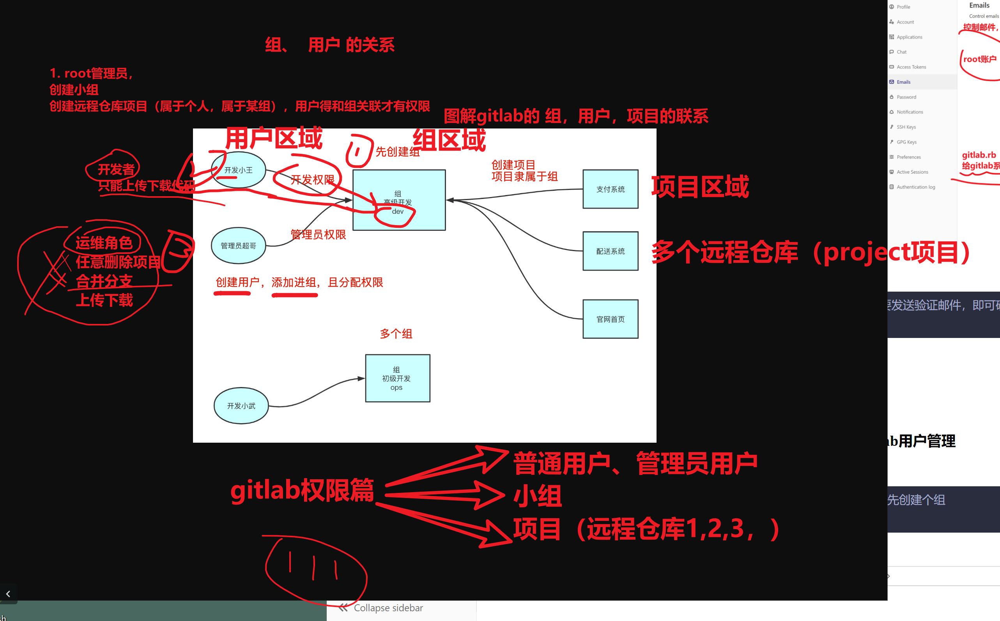

```### 此资源由 58学课资源站 收集整理 ###
	想要获取完整课件资料 请访问：58xueke.com
	百万资源 畅享学习

```
# gitlab私有仓库搭建


```perl
为什么要搭建这个gitlab私有仓库


中小型公司其实

3套业务，3套系统需要部署
1个运维 + 10台阿里云 + shell脚本发布 就能够实现

git +  远程代码仓库 + shell 脚本 实现发布更新

git + 远程仓库（gitee国内的代码仓库，github一样）


代码上传
	开发 上传 > 公司使用的远程代码仓库（github，gitee）
	
	
代码运行，启动  
	运维 + shell脚本
		ssh 进入目标部署的服务器
		git clone  代码仓库下载
		解压缩，进入制定目录，设置项目运行环境，php，python
		
		
		
代码更新，重启
	运维 + shell脚本
		ssh 进入目标服务器
		进入已存在的代码仓库， /www/my_site/
		# 下载新代码，更新本地仓库源码
		git pull -u origin master
		干掉旧的进程，重启新进程即可


伪代码思路看懂1111，后面有3个项目让你完成这些操作。


中大型的公司

买自己的服务器，搭建自己的代码仓库，企业内部所有资料全部是私有的。

运维去部署gitlab这样的私有代码仓库（github+gitee都是一样的）


```


# gitlab部署实践

```
yum install curl policycoreutils-python openssh-server postfix wget -y

获取gitlab源码包
选择各种yum源去安装
https://mirrors.tuna.tsinghua.edu.cn/gitlab-ce/yum/el7/gitlab-ce-12.0.3-ce.0.el7.x86_64.rpm


我已经准备好了
准备好源码
#这是社区办的，gtilab 

rpm -ivh gitlab-ce-12.0.3-ce.0.el7.x86_64.rpm

yum localinstall gitlab-ce-12.0.3-ce.0.el7.x86_64.rpm


```


## gitlab基础设置

```bash
配置gitlab服务，修改域名和邮箱

设置参数如下
[root@gitlab-99 ~]#grep -E '^[a-Z]' /etc/gitlab/gitlab.rb 
external_url 'http://10.0.0.99'
gitlab_rails['gitlab_email_enabled'] = true
gitlab_rails['gitlab_email_from'] = '877348180@qq.com'
gitlab_rails['gitlab_email_display_name'] = 'linux0224'
gitlab_rails['smtp_enable'] = true
gitlab_rails['smtp_address'] = "smtp.qq.com"
gitlab_rails['smtp_port'] = 465
gitlab_rails['smtp_user_name'] = "877348180@qq.com"
gitlab_rails['smtp_password'] = "pvthquniqpjvbbch"
gitlab_rails['smtp_domain'] = "smtp.qq.com"
gitlab_rails['smtp_authentication'] = "login"
gitlab_rails['smtp_enable_starttls_auto'] = true
gitlab_rails['smtp_tls'] = true


修改了gitlab的配置，务必要重新加载gitlab配置
#重新配置gitlab，首次执行会很慢

gitlab-ctl reconfigure


执行命令，测试是否可以发邮件
gitlab-rails console

执行如下命令测试发邮件即可
Notify.test_email('yc_uuu@163.com','美好的一天','hello linux0224').deliver_now
```

确认可以发邮件之后，可以使用gitlab图形化配置了。


## gitlab命令行管理

```
gitlab-ctl start 启动所有服务
gitlab-ctl stop  停止 
gitlab-ctl stop postgresql  停止某个服务 
gitlab-ctl restart 
gitlab-ctl status
gitlab-ctl reconfigure   重新读取gitlab配置  
gitlab-ctl tail  查看gitlab的运行状态，所有服务状态  
gitlab-ctl tail redis 只看某个服务的状态


```


# 检测gitlab的nginx状态

```
[root@gitlab-99 ~]#
[root@gitlab-99 ~]#netstat -tunlp|grep nginx
tcp        0      0 0.0.0.0:8060            0.0.0.0:*               LISTEN      3303/nginx: master  
tcp        0      0 0.0.0.0:80              0.0.0.0:*               LISTEN      3303/nginx: master  
[root@gitlab-99 ~]#
[root@gitlab-99 ~]#
[root@gitlab-99 ~]#
[root@gitlab-99 ~]#gitlab-ctl tail nginx
==> /var/log/gitlab/nginx/current <==

==> /var/log/gitlab/nginx/error.log <==

==> /var/log/gitlab/nginx/gitlab_access.log <==

==> /var/log/gitlab/nginx/gitlab_error.log <==

==> /var/log/gitlab/nginx/access.log <==

```


# 访问gitlab，查看日志


```
[root@gitlab-99 ~]#
[root@gitlab-99 ~]## 问题拍错的步骤 1.访问具体url，查看日志，都加载了哪些资源，提取日志的 资源路径，状态码，判断网页的运行状态
[root@gitlab-99 ~]#
[root@gitlab-99 ~]#
[root@gitlab-99 ~]#
[root@gitlab-99 ~]#awk  -F \"   '{print $2 }' /var/log/gitlab/nginx/gitlab_access.log 
GET / HTTP/1.1
GET /users/sign_in HTTP/1.1
GET /users/password/edit?reset_password_token=uj5yPdU_M3xxYmW2xeV9 HTTP/1.1
GET /assets/application-77566acc818458515231d0a82c131a42890d771ea998b9f578dc38e0eb7e517f.css HTTP/1.1
GET /assets/highlight/themes/white-a165d47ce52cf24c29686366976ae691bd9addb9641a6abeb3ba6d1823b89aa8.css HTTP/1.1
GET /assets/webpack/runtime.ee1acb18.bundle.js HTTP/1.1
GET /assets/webpack/default.22a634a6.chunk.js HTTP/1.1
GET /assets/print-74c3df10dad473d66660c828e3aa54ca3bfeac6d8bb708643331403fe7211e60.css HTTP/1.1
GET /assets/webpack/main.0a630f76.chunk.js HTTP/1.1
GET /assets/favicon-7901bd695fb93edb07975966062049829afb56cf11511236e61bcf425070e36e.png HTTP/1.1
[root@gitlab-99 ~]#
[root@gitlab-99 ~]#


```

默认先改密码

然后登录

```
root
linux0224
```


# gitlab关闭注册功能


# gitlab发邮件功能


```
需要发送验证邮件，即可确认 给root添加 163邮箱

```


# gitlab用户管理


````
1. 先创建个组

````





## 创建小组

Gitlab是通过组（group）的概念来统一管理仓库(project)和用户(user)，通过创建组，在组下创建仓库，再将用户加入组

从而实现用户和仓库的权限管理。


.


查看组信息


# 创建halo项目，私有组内项目


## 创建用户操作


chaoge用户管理员

wenjie 开发者


```
创建普通用户

用户名，要唯一

用户绑定的邮箱，再用户列表中，该邮箱唯一

	root用户，yc_uuu@163.com
	chaoge用户  877348180@qq.com
		不能创建组
		身份设置为 admin管理员角色
		


```


```
创建项目后，关联用户（身份设置）
```


目前 chaoge，wenjie用户都还是单个的用户，没加入组呢

```
让wenjie  chaoge 都能看到 my_halo的项目

加入linux0224部门就行

```


## 测试，分别用chaoge，wenjie登录系统，查看项目


```
wj335598@163.com

李文杰同志再他自己的电脑上，登录邮箱，能充值密码吗？

能 1  不能 2 

说出为什么？


不在一个网络环境

因为
重置密码的链接，是gitlab平台提供的，你得访问gitlab，
gitlab是内网地址

external_url 'http://10.0.0.99'


拿到重置链接http://10.0.0.99  能方访问吗？
10.0.0.x


```

wenjie用户试试

```
wenjie
wenjie666
```


# ====下午开始============


# 8.gitlab仓库代码管理实践

## 8.1配置ssh-key

```
准备机器，来模拟，开发，运维部署的全流程

开发，运维，下载，上传代码，都得和gitlab进行身份验证

```


```
=
```


## 8.2发布halo博客源码实战

## 部署实战架构图


### halo源码下载


```
再第一个环境，确保远程仓库
linux0224/my_halo 项目，中有源码数据
模拟是halo这个项目的维护者


基于halo博客的源码去配置 my_halo gitlab仓库

模拟开发者，再自己的笔记本上，推代码到gitlab仓库


1.下载源码
git clone https://github.com/halo-dev/halo.git
github访问不了

- 买个个人梯子，爬楼梯即可

- 公司都会默认提供梯子，请放心随便下载互联网的资源

转战码云的地址
https://gitee.com/halo-dev/halo

git clone https://gitee.com/halo-dev/halo.git
halo下载到本地，就叫做本地仓库

Sylar@DESKTOP-G6C412R MINGW64 ~/Desktop
$ ls -dl halo
drwxr-xr-x 1 Sylar 197121 0 Jul 18 14:23 halo/


2. 关联你自己的gitlab仓库 my_halo
默认下载的远程仓库，远程地址，还是默认的

$ git remote add origin git@10.0.0.99:linux0224/my_halo.git

Sylar@DESKTOP-G6C412R MINGW64 ~/Desktop/halo (master)
$ git remote -v

Sylar@DESKTOP-G6C412R MINGW64 ~/Desktop/halo (master)
$

Sylar@DESKTOP-G6C412R MINGW64 ~/Desktop/halo (master)
$ git remote add origin git@10.0.0.99:linux0224/my_halo.git

Sylar@DESKTOP-G6C412R MINGW64 ~/Desktop/halo (master)
$

Sylar@DESKTOP-G6C412R MINGW64 ~/Desktop/halo (master)
$

Sylar@DESKTOP-G6C412R MINGW64 ~/Desktop/halo (master)
$ git remote -v
origin  git@10.0.0.99:linux0224/my_halo.git (fetch)
origin  git@10.0.0.99:linux0224/my_halo.git (push)


3. 推送代码

Sylar@DESKTOP-G6C412R MINGW64 ~/Desktop/halo (master)
$ git push -u origin master
Enumerating objects: 40865, done.
Counting objects: 100% (40865/40865), done.
Delta compression using up to 20 threads
Compressing objects: 100% (13450/13450), done.
Writing objects: 100% (40865/40865), 43.39 MiB | 48.24 MiB/s, done.
Total 40865 (delta 21360), reused 40812 (delta 21323), pack-reused 0
remote: Resolving deltas: 100% (21360/21360), done.
To 10.0.0.99:linux0224/my_halo.git
 * [new branch]        master -> master
branch 'master' set up to track 'origin/master'.


```


配置本地机器的ssh-key，到远程仓库

```

```


关联远程仓库的ssh-key（登录的gitlab用户是谁）


### gitlab创建小组\用户

```
目前已经有了

linux0224小组

linux0224/chaoge
linux0224/wenjie


看懂1111
```


### gitlab项目创建

```
git@10.0.0.99:linux0224/my_halo.git
http://10.0.0.99/linux0224/my_halo.git

自建的私有仓库地址


```


### 运维推送代码到gitlab（chaoge账号）


### 保护master分支（不允许开发者提交）

```
# 目前还没保护的状态，试试wenjie推代码，直接推送到master分支

准备一个文杰的机器
文杰windows开发，macos，linux系统

模拟文杰使用linux机器开发，推送代码到远程仓库，master
linux  10.0.0.51


1.先设置公钥到wenjie账户


2. 先克隆远程的代码，下载一份到本地
继续写新代码，看懂11111
[root@db-51 /home/wenjie]#yum install git -y


git clone git@10.0.0.99:linux0224/my_halo.git

想下载远程仓库的私有代码

准备好一个机器的公钥，添加到有访问改项目的用户设置中，添加ssh-key

db-51 机器作为客户端，ssh-key添加到了  wenjie账号里的 settings设置

wenjie用户，属于 linux0224组的成员

my_halo这个项目，属于linux0224组的项目

因此可以下载源码了


这个逻辑，看懂 66666

休息会，琢磨下，动手实践下

目前，开发者wenjie再 db-51机器上，拉取了最新的代码
[root@db-51 /home/wenjie]#git clone git@10.0.0.99:linux0224/my_halo.git
Cloning into 'my_halo'...
remote: Enumerating objects: 40865, done.
remote: Counting objects: 100% (40865/40865), done.
remote: Compressing objects: 100% (13413/13413), done.
remote: Total 40865 (delta 21360), reused 40865 (delta 21360)
Receiving objects: 100% (40865/40865), 43.39 MiB | 53.67 MiB/s, done.
Resolving deltas: 100% (21360/21360), done.


# 不够严重的玩法
# 小公司，master分支一把梭
# 大公司由于业务多，安全性高，人员多，需要做好权限控制
# 小公司人员少，项目不太复杂，权限，部署架构，一切从简

# 直接用master写代码，推代码


还得身份设置
[root@db-51 /home/wenjie/my_halo]#git config --global user.email "wj335598@163.com"
[root@db-51 /home/wenjie/my_halo]#
[root@db-51 /home/wenjie/my_halo]#
[root@db-51 /home/wenjie/my_halo]#git config --global user.name "wenjie"
[root@db-51 /home/wenjie/my_halo]#
[root@db-51 /home/wenjie/my_halo]#
[root@db-51 /home/wenjie/my_halo]#git config --list
user.email=wj335598@163.com
user.name=wenjie
core.repositoryformatversion=0
core.filemode=true
core.bare=false
core.logallrefupdates=true
remote.origin.url=git@10.0.0.99:linux0224/my_halo.git
remote.origin.fetch=+refs/heads/*:refs/remotes/origin/*
branch.master.remote=origin
branch.master.merge=refs/heads/master

[root@db-51 /home/wenjie/my_halo]#
[root@db-51 /home/wenjie/my_halo]#git commit -m '文杰提交了一版代码，直接用的master'
[master ad423b7] 文杰提交了一版代码，直接用的master
 1 file changed, 1 insertion(+)
 create mode 100644 wenjie66.py


[root@db-51 /home/wenjie/my_halo]#git log -2
commit ad423b759e41652f82fac5f1abe87203ffed43e7
Author: wenjie <wj335598@163.com>
Date:   Mon Jul 18 23:04:24 2022 +0800

    文杰提交了一版代码，直接用的master

commit 7eef3b700653cecb666ec4509871234b5922eaf6
Author: John Niang <johnniang@fastmail.com>
Date:   Mon Jul 11 16:46:12 2022 +0800

    Change optimization into improvement (#2235)
    
    We only have the kind/improvement label.
[root@db-51 /home/wenjie/my_halo]#
[root@db-51 /home/wenjie/my_halo]#
[root@db-51 /home/wenjie/my_halo]## 看懂1111


因此，发现gitlab默认对my_halo项目，做了master分支保护
wenjie该用户无法推送数据到master

只能用chaoge用户
root用户可以推


```


```
保护分支功能，是针对项目而言的

```


> 正确的玩法，模拟开发者，创建分支，写代码，推送到自己的分支上，用管理员去合并
>
> 

### 开发wenjie开始写代码

```
1. 克隆代码
 git clone git@10.0.0.99:linux0224/my_halo.git
 
2. 本地创建分支 wenjie
[root@db-51 /home/wenjie/my_halo]##笔试题，如何创建切切换分支
[root@db-51 /home/wenjie/my_halo]#
[root@db-51 /home/wenjie/my_halo]#git checkout -b wenjie
Switched to a new branch 'wenjie'
[root@db-51 /home/wenjie/my_halo]#
[root@db-51 /home/wenjie/my_halo]#
[root@db-51 /home/wenjie/my_halo]#git branch
  master
* wenjie


3. 提交本地版本
[root@db-51 /home/wenjie/my_halo]#
[root@db-51 /home/wenjie/my_halo]#git add .
[root@db-51 /home/wenjie/my_halo]#
[root@db-51 /home/wenjie/my_halo]#git commit -m '分支wenjie 提交了haha.py'
[wenjie f84fc07] 分支wenjie 提交了haha.py
 1 file changed, 1 insertion(+)
 create mode 100644 haha.py


4. 推送到gitlab，推送wenjie分支的代码
1. 自动帮你创建远程分支了

2. 自动生成merge合并的请求url（wenjie，master）


[root@db-51 /home/wenjie/my_halo]#git push -u origin wenjie
Counting objects: 4, done.
Delta compression using up to 4 threads.
Compressing objects: 100% (2/2), done.
Writing objects: 100% (3/3), 327 bytes | 0 bytes/s, done.
Total 3 (delta 1), reused 0 (delta 0)
remote: 
remote: To create a merge request for wenjie, visit:
remote:   http://10.0.0.99/linux0224/my_halo/merge_requests/new?merge_request%5Bsource_branch%5D=wenjie
remote: 
To git@10.0.0.99:linux0224/my_halo.git
 * [new branch]      wenjie -> wenjie
Branch wenjie set up to track remote branch wenjie from origin.


访问改url，向管理员发出，合并wenjie分支到master的请求
http://10.0.0.99/linux0224/my_halo/merge_requests/new?merge_request%5Bsource_branch%5D=wenjie


5. 运维去合并laoliu分支


```


3.试试能推送代码到master上吗？（肯定不能，因为laoliu普通用户，无法推到master分支，设置了分支保护）

```
无法推送
```

4.你只能新建分支，然后写代码推送

```
以及推送到了wenjie分粥

```

### 查看远程my_halo仓库的分支代码


### 创建合并请求，提交PR(pull requests)

发一个url请求


```
git自动帮你生成了 PR请求
http://10.0.0.99/linux0224/my_halo/merge_requests/new?merge_request%5Bsource_branch%5D=wenjie
```


```
chaoge管理员合并了wenjie的请求

删除文杰分支

检查分支是否被删除
检查master是否看到了最新的代码
以及提交记录


```


### 管理员chaoge去合并代码


### 此时下载最新代码试试，master分支的

```

windows chaoge用户的  pub key 可以下载

db-51  wenjie 的pub key  可以下载


看懂2222

其他机器不行

[root@db-51 /tmp]#git clone git@10.0.0.99:linux0224/my_halo.git
Cloning into 'my_halo'...
remote: Enumerating objects: 40869, done.
remote: Counting objects: 100% (40869/40869), done.
remote: Compressing objects: 100% (13416/13416), done.
remote: Total 40869 (delta 21361), reused 40864 (delta 21360)
Receiving objects: 100% (40869/40869), 43.39 MiB | 44.83 MiB/s, done.
Resolving deltas: 100% (21361/21361), done.
[root@db-51 /tmp]#
[root@db-51 /tmp]#
[root@db-51 /tmp]#ls


[root@db-51 /tmp/my_halo]#
[root@db-51 /tmp/my_halo]#git log -2
commit 8e1d023cfd48a2c010ff9dadf5577d6c93601ab3
Merge: 7eef3b7 f84fc07
Author: chaoge <877348180@qq.com>
Date:   Mon Jul 18 23:26:24 2022 +0800

    Merge branch 'wenjie' into 'master'
    
    分支wenjie 提交了haha.py
    
    See merge request linux0224/my_halo!1

commit f84fc0719e0d6d9bf6c6882874b8183c7f964849
Author: wenjie <wj335598@163.com>
Date:   Mon Jul 18 23:15:34 2022 +0800

    分支wenjie 提交了haha.py
[root@db-51 /tmp/my_halo]#
[root@db-51 /tmp/my_halo]#
[root@db-51 /tmp/my_halo]## 最新克隆的代码，1  包含 haha.py  2 也看到了提交版本记录 ，完全理解  222222
[root@db-51 /tmp/my_halo]#
[root@db-51 /tmp/my_halo]#


```


## git pull 拉取最新更新代码实践

运维再线上，更新代码的操作


```


1. 克隆一个最新代码


2. 此时远程仓库，可能会发生更新的动作


3. 此时本地，可以拉去最新的代码


```

休息一会，结合手工部署的实践，理解，手工更新代码的流程

## 中小型公司的手工部署

再来一个更完成的，部署全流程讲解

halo博客，java项目


- 部署python项目
- java项目
- php项目

```
和你的git ，gitab的流程 ，无关，都一样

区别就在于，具体的再目标机器，如何设置环境，运行源码的区别


```


````
1. 首次启动

- 下载代码到目标服务器
- 设置运行环境（shell脚本）
- 启动即可

2. 下次的更新

- 进入该项目目录
- 更新源代码
- 重启

上述是部署逻辑，具体部署的源码是什么 java，python没区别了

php-fpm
python3


这个逻辑，看懂111111


````


### 部署python项目全流程

gitlab阶段

```
git@10.0.0.99:linux0224/my_flask.git

Sylar@DESKTOP-G6C412R MINGW64 ~/Desktop/my_flask (master)
$ git remote -v
origin  git@10.0.0.99:linux0224/my_flask.git (fetch)
origin  git@10.0.0.99:linux0224/my_flask.git (push)


```

部署阶段，web7

首次启动

```
下载代码
[root@web-7 /www]#git clone git@10.0.0.99:linux0224/my_flask.git 

准备项目运行环境
# 首次发布脚本
cat >deploy_flask.sh <<'EOF'
#!/bin/bash
cd /www/my_flask
# yum install python3 python3-devel python3-pip -y > /dev/null
# 安装python项目模块
pip3 install flask -i https://pypi.douban.com/simple > /dev/null

#后台启动项目即可
# 重启进程
kill -9 $(ps -ef|grep my_app |grep -v grep |awk '{print $2}')

nohup python3 my_app.py > nohup.log  2>&1 &

# 检查运行结果
echo "最新的flask项目进程号： $(ps -ef|grep my_app |grep -v grep |awk '{print $2}')"
EOF

# 看懂发布重启脚本的开发流程，1111

#启动就好


访问项目


```


下次的更新

```
1.模拟开发，修改了源码，python开发，修改代码了，推送到线上的master分支


2. 下载更新代码，重启程序，确保可访问
更新代码，重启程序
cat >restart_flask.sh <<'EOF'
#!/bin/bash
cd /www/my_flask

# 更新代码
git pull -u origin master


#后台启动项目即可
# 重启进程
kill -9 $(ps -ef|grep my_app |grep -v grep |awk '{print $2}')

nohup python3 my_app.py > nohup.log  2>&1 &

# 检查运行结果
echo "最新的flask项目进程号： $(ps -ef|grep my_app |grep -v grep |awk '{print $2}')"
# 等几秒就好了
# 睡眠2秒
sleep 2;
echo "本地测试访问结果 $(curl -s  127.0.0.1:5000)"
EOF


3.运行脚本，查看手工更新网站的结果
[root@web-7 /www]#
[root@web-7 /www]#bash restart_flask.sh 


```


## 中大型公司的jenkins自动化部署

业务太多了

重启的服务也太多了

实现更新流水线


```
下一章
```


# 9.gitlab备份、恢复


## 9.1 修改备份配置

```
1.修改配置文件
[root@gitlab-99 /etc/gitlab]#grep -E '^[a-Z]' /etc/gitlab/gitlab.rb 
gitlab_rails['backup_path'] = "/gitlab_backup/"
gitlab_rails['backup_keep_time'] = 604800
external_url 'http://10.0.0.99'
gitlab_rails['gitlab_email_enabled'] = true
gitlab_rails['gitlab_email_from'] = '877348180@qq.com'
gitlab_rails['gitlab_email_display_name'] = 'linux0224'
gitlab_rails['smtp_enable'] = true
gitlab_rails['smtp_address'] = "smtp.qq.com"
gitlab_rails['smtp_port'] = 465
gitlab_rails['smtp_user_name'] = "877348180@qq.com"
gitlab_rails['smtp_password'] = "pvthquniqpjvbbch"
gitlab_rails['smtp_domain'] = "smtp.qq.com"
gitlab_rails['smtp_authentication'] = "login"
gitlab_rails['smtp_enable_starttls_auto'] = true
gitlab_rails['smtp_tls'] = true


2. 重读gitlab配置即可

[root@gitlab-99 /etc/gitlab]#gitlab-ctl reconfigure

准备备份数据的目录，和配置一致
mkdir -p /gitlab_backup/

chown -R git.git /gitlab_backup/


3.执行如下备份命令
gitlab-rake gitlab:backup:create


4.查看备份的数据
[root@gitlab-99 /etc/gitlab]#ls /gitlab_backup/
1658161288_2022_07_19_12.0.3_gitlab_backup.tar
[root@gitlab-99 /etc/gitlab]#ls /gitlab_backup/ -lh
total 44M
-rw------- 1 git git 44M Jul 19 00:21 1658161288_2022_07_19_12.0.3_gitlab_backup.tar


```


## 9.2 数据恢复

```
Gitlab的恢复只能恢复到与原本备份文件相同的gitlab版本中，恢复时，需要停止数据库的写入操作，但是保持gitlab是运行的。

暂停数据库写入，停止会连接数据库的几个服务


# 停止如下仨服务，然后执行恢复gitlab的数据命令即可
gitlab-ctl stop unicorn
gitlab-ctl stop sidekiq
gitlab-ctl stop nginx

# 恢复数据，需要制定你自己的备份数据包
# 备份细节，填入文件的名字就好，不要后缀
[root@gitlab-99 /etc/gitlab]#ls /gitlab_backup/
1658161288_2022_07_19_12.0.3_gitlab_backup.tar


gitlab-rake gitlab:backup:restore BACKUP=1658161288_2022_07_19_12.0.3

恢复操作，就是删除 所有原有数据，然后恢复该最新的数据
看到如下结果就是正确的
Restore task is done.


最后一步，重新读取配置，确认你的gitlab可以访问

gitlab-ctl reconfigure

gitlab-ctl restart 

gitlab-ctl status |grep run

[root@gitlab-99 /etc/gitlab]#gitlab-ctl status|grep run
run: alertmanager: (pid 60821) 41s; run: log: (pid 3595) 20530s
run: gitaly: (pid 60836) 40s; run: log: (pid 3079) 20596s
run: gitlab-monitor: (pid 60856) 40s; run: log: (pid 3497) 20546s
run: gitlab-workhorse: (pid 60872) 40s; run: log: (pid 3305) 20561s
run: grafana: (pid 60881) 39s; run: log: (pid 3721) 20508s
run: logrotate: (pid 60979) 39s; run: log: (pid 3422) 20556s
run: nginx: (pid 60985) 38s; run: log: (pid 3325) 20560s
run: node-exporter: (pid 60994) 38s; run: log: (pid 3475) 20550s
run: postgres-exporter: (pid 61000) 38s; run: log: (pid 3642) 20524s
run: postgresql: (pid 61010) 37s; run: log: (pid 3163) 20590s
run: prometheus: (pid 61019) 37s; run: log: (pid 3555) 20536s
run: redis: (pid 61034) 36s; run: log: (pid 2960) 20597s
run: redis-exporter: (pid 61038) 36s; run: log: (pid 3522) 20542s
run: sidekiq: (pid 61045) 35s; run: log: (pid 3280) 20565s
run: unicorn: (pid 61051) 35s; run: log: (pid 3259) 20569s

```


验证，gitlba是否正常


# 今日作业

1. 完成gitlab的安装，以及my_flask项目 推拉实践，手工部署实践（首次启动，下次更新）
2. 区分chaoge运维用户，以及wenjie开发者账户
3. 预习jenkins下一章博客，进阶自动化部署阶段


