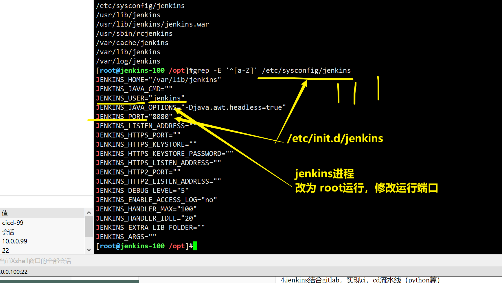
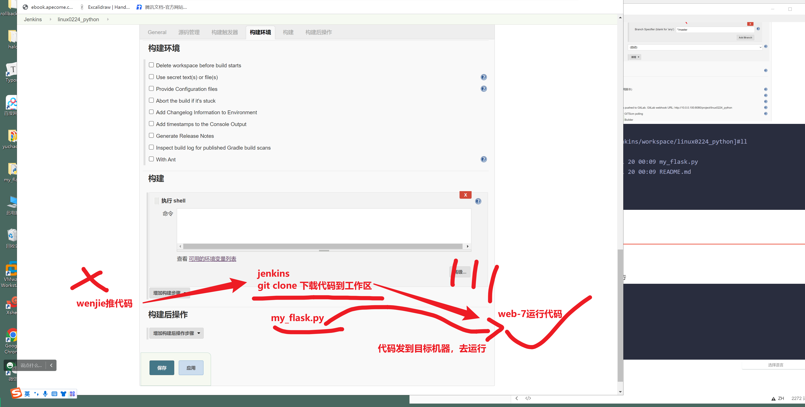

```### 此资源由 58学课资源站 收集整理 ###
	想要获取完整课件资料 请访问：58xueke.com
	百万资源 畅享学习

```


# 今日内容

## 0.运维发布和业务的生产经验


## 1.jenkins安装部署


.


如何实现，cicd，持续集成，持续部署的流水线

git , gitlab   ==== 10.0.0.99

jenkins机器先准备，用与部署jenkins ======== 10.0.0.100

```

1.安装，第三方源，或者本地导入
1.去清华源下载，找的就是jenkins.rpm
https://mirrors.tuna.tsinghua.edu.cn/jenkins/redhat/

2.下载好如下系列软件包即可
jenkins是java开发，需要有jdk，java环境
二是导入jenkins的rpm包安装


[root@jenkins-100 /opt]#ls
jdk-8u181-linux-x64.rpm  jenkins-2.190.1-1.1.noarch.rpm  jenkins_plugins.tar.gz


3.先装jdk 再装jenkins
[root@jenkins-100 /opt]#
[root@jenkins-100 /opt]#yum localinstall jdk-8u181-linux-x64.rpm -y

java -version

[root@jenkins-100 /opt]#yum localinstall jenkins-2.190.1-1.1.noarch.rpm -y


4.验证jenkins版本
[root@jenkins-100 /opt]#rpm -qa jenkins
jenkins-2.190.1-1.1.noarch


5.启动jenkins，默认该jenkins.rpm给你创建好了启动脚本，
/etc/rc.d/init.d/jenkins
可以直接用systemctl去调用

systemctl start jenkins

看懂1111

6.检查jenkins端口

[root@jenkins-100 /opt]#netstat -tunlp|grep 8080
tcp6       0      0 :::8080                 :::*                    LISTEN      2007/java   

7. 查看jenkins脚本，运行的进程，
执行的什么命令，运行的jenkins进程


```


## 2.修改jenkins主配置文件（这里先别改了，后续安装完毕后再改）

### 

```
先别去访问，还得修改jenkisn的配置文件，再去访问

找到jenkins的主配置文件
[root@jenkins-100 /opt]#rpm -ql jenkins
/etc/init.d/jenkins
/etc/logrotate.d/jenkins 
/etc/sysconfig/jenkins   # 主配置文件 
/usr/lib/jenkins
/usr/lib/jenkins/jenkins.war
/usr/sbin/rcjenkins
/var/cache/jenkins
/var/lib/jenkins
/var/log/jenkins


[root@jenkins-100 /opt]#
[root@jenkins-100 /opt]#systemctl restart jenkins
[root@jenkins-100 /opt]#
[root@jenkins-100 /opt]#
[root@jenkins-100 /opt]#
[root@jenkins-100 /opt]#grep -E '^[a-Z]' /etc/sysconfig/jenkins  
JENKINS_HOME="/var/lib/jenkins"
JENKINS_JAVA_CMD=""
JENKINS_USER="root"
JENKINS_JAVA_OPTIONS="-Djava.awt.headless=true"
JENKINS_PORT="8080"
JENKINS_LISTEN_ADDRESS=""
JENKINS_HTTPS_PORT=""
JENKINS_HTTPS_KEYSTORE=""
JENKINS_HTTPS_KEYSTORE_PASSWORD=""
JENKINS_HTTPS_LISTEN_ADDRESS=""
JENKINS_HTTP2_PORT=""
JENKINS_HTTP2_LISTEN_ADDRESS=""
JENKINS_DEBUG_LEVEL="5"
JENKINS_ENABLE_ACCESS_LOG="no"
JENKINS_HANDLER_MAX="100"
JENKINS_HANDLER_IDLE="20"
JENKINS_EXTRA_LIB_FOLDER=""
JENKINS_ARGS=""


```




### 访问 10.0.0.100:8080

```
/var/lib/jenkins/secrets/initialAdminPassword

JENKINS_ARGS=""
[root@jenkins-100 /opt]#cat /var/lib/jenkins/secrets/initialAdminPassword
a2859c22d1344057a1ce3e3dfdbe481d
[root@jenkins-100 /opt]#

```


### 直接叉掉，不做任何插件安装

```
1.默认是国外的jenkins 插件源，太慢，下载不了
2. 直接开始使用
重新开了个无痕浏览器

http://10.0.0.100:8080/


```

## 如果忘记jenkins账户密码，可以按如下操作重置jenkins密码

刚才踩坑在，没有账户密码，登录不进去。


```
[root@jenkins-100 /opt]#vim /var/lib/jenkins/config.xml
[root@jenkins-100 /opt]#
[root@jenkins-100 /opt]#
[root@jenkins-100 /opt]#
[root@jenkins-100 /opt]#
[root@jenkins-100 /opt]#systemctl restart jenkins
[root@jenkins-100 /opt]#

```

重置密码的步骤


# 

### 

## 下一步，即可登录jenkins

### 

```
admin
linux0224
登录jenkins，保存用户的设置
http://10.0.0.100:8080/


```


# 2.jenkins插件导入


## 目前没有插件，导入插件

```
直接移动所有的插件文件，到jenkins的插件目录下，重启即可
[root@jenkins-100 /opt/plugins]#ls |wc -l
263
[root@jenkins-100 /opt/plugins]#pwd
/opt/plugins
[root@jenkins-100 /opt/plugins]#
[root@jenkins-100 /opt/plugins]#
[root@jenkins-100 /opt/plugins]##mv * /var/lib/jenkins/plugins/

[root@jenkins-100 /var/lib/jenkins/plugins]#systemctl restart jenkins


```


## 3.jenkins自由风格任务创建

第一个玩法，创建简单任务


```
简单的， free-style-job 自由风格任务，执行简单linux命令

```


```
第一个任务的名，job名，  
linux0224-hello

job任务的描述
这是第一个简单的自由风格的job，用于学习，jenkins的工作区的概念
查看jenkins的job，
是在哪执行的，以及jenkins是在哪，执行的linux命令
这个逻辑很重要


```


jenkins，添加构建shell动作

```bash
# jenkins再这执行命令了
echo "当前主机名：$(hostname)"
echo "jenkins是在哪执行的命令？：$(pwd)"
echo "jenkins执行文件创建：$(touch 奥利给.log)"
echo "搜索该文件，看看在哪：$(find / -name '奥利给.log')"
# shell嵌入jenkins的内置变量，还是很方便的
echo "查看jenskins如下内置变量"
echo -e "JOB_NAME -------------- ${JOB_NAME}
BUILD_ID -------------- ${BUILD_ID}
WORKSPACE ----------${WORKSPACE}
JENKINS_HOME -------- ${JENKINS_HOME}
"

/var/lib/jenkins/workspace/job名/该job创建的数据


# 看懂jenkins，执行shell，11111 ，帮你执行命令，帮你部署程序
# 而且这里知识，嵌入jenkins变量的玩法

```

## 回到jenkins首页


## 立即构建


## 休息片刻，动手完成

- jenkins安装
- 用户密码设置
- 运行第一个自由风格的job，练习上述的 内置变量，工作区查看的命令


.


## jenkins构建出错的画面


## linux上查看jenkins的任务数据文件

```
job的绝对路径
/var/lib/jenkins/workspace/

```


## 多次执行job，查看结果


## jenkins的job会用在哪？

```perl
例如运维可以使用jenkins的job功能，给其他不懂linux命令的同事，通过一键点击，就能够执行linux命令

例如服务重启等

可以有效的防止不懂linux的技术人员，在服务器上做奇怪的操作。
```


## 再创建一个job练习远程执行命令

简单的，试试，远程执行命令的job

```
远程，远程检查web7机器的nginx运行状态

想远程执行命令，先配置远程，免密登录

[root@jenkins-100 ~]#ssh-copy-id root@10.0.0.7


再试试任务执行构建


看懂 1111


```


# 4.jenkins结合gitlab，实现ci，cd流水线（python篇）

`开发 > gitlab >  运维 > 目标服务器 `


5.实现flask代码，一键部署到web7机器


## 1.创建远程项目，gitlab


```
完全的空仓库
master

用管理员角色，生成些初始的数据，master分支

思路，用管理员账户，推送数据，生成master分支


```


## 2.开发写代码，推送到目标远程仓库

wenjie得用分支去推

gitlab仓库，默认master分支保护，文杰属于开发者权限


```
wenjie账户，去推送代码， 到项目中


先创建开发者分支

# 先克隆远程仓库，成为本地仓库，提交版本
git clone git@10.0.0.99:linux0224/linux0224_python.git

git checkout -b wenjie 


[root@db-51 ~/linux0224_python]#cat my_flask.py 
cat > my_flask.py  <<'EOF'
# coding:utf-8

from flask import Flask
app = Flask(__name__)

@app.route('/')
def index():
    return '<h1> 测试jenkins 结合 gitlab 做python项目的更新，发版 -----v1 </h1>'

if __name__ == '__main__':
    app.run(host="0.0.0.0")
EOF
    
# 本地提交版本到 wenjie分支
git add .

git commit -m 'wenjie my_flask.py   v1'


# 推送到远程仓库

[root@db-51 ~/linux0224_python]#git remote -v
origin	git@10.0.0.99:linux0224/linux0224_python.git (fetch)
origin	git@10.0.0.99:linux0224/linux0224_python.git (push)
[root@db-51 ~/linux0224_python]#
[root@db-51 ~/linux0224_python]## 看懂11111

git push -u origin wenjie


```


```
注意细节，用wenjie账户的浏览器，去访问，merge请求

```

****


确认用管理员，合并代码

再次查看源码master分支的

```
开发你可以去休息了

```


3. ## 运维上场，设置jenkins，去下载gitlab的代码

4. 

5. 

```
1. 创建自由风格的job
linux0224_python


2. 配置job
```


## 先看gitlab用账户密码的认证方式


```
# bug 1，jenkins机器，没git

# 

```

### 给jenkins创建读取gitlab的凭证

```
应该用运维的账户，去获取master代码


```


---


```
试试账户密码的形式，能把代码拉去下来吗
直接保存，点击构建，查看工作区的内容


```


## 再看gitlab用ssh-key的方式，代码下载

鸡汤

万丈高楼平地起，富贵只能靠自己


```
jenkins 机器
配置公钥，添加到gitlab平台上

[root@jenkins-100 /var/lib/jenkins/workspace/linux0224_python]#cat ~/.ssh/id_rsa.pub 
ssh-rsa AAAAB3NzaC1yc2EAAAADAQABAAABAQDDfLc7zlNc8XHrQopNbw5zV6UIJXHxjGc731bpkK8kzJ2ZoMX5K/2sGKCpOukowQ22I+M3hpm0rx8hyVi1F+aM6UhPfqzmDgMhnW6WHzfl6CuRCmjeje906Iwe892M6Idyh+pjpTpZP953cweufbPWWREDxj4bXyw0Wl65TqqgiV6INpGU87Lt9gnMa9HsR8KyMzXsfxqJgxHhnDS4pPHWBodUPEjfgBK9AV9eX5YRKYGObdVZ1d/Su3k8AmA2Fx5xzsg8QT1ZedQRgjSERrBAWEg88Qrmlxj28HbKj1lOEnSVdyu68Qe4zlV/DzE1kKFunJo8oBkWmUGtdSvhkXOt root@jenkins-100


免密下载gitlab代码


1. 添加jenkins的公钥到 gitlab平台上


2. 去jenkins的job中，添加密钥的认证方式

【ssh username with private key 】

ssh的用户名，私钥


```


```
测试好使吗
[root@jenkins-100 /var/lib/jenkins/workspace/linux0224_python]#ll
total 8
-rw-r--r-- 1 root root 242 Jul 20 00:09 my_flask.py
-rw-r--r-- 1 root root  42 Jul 20 00:09 README.md


```


## 小结

- 开发的v1代码上传了
- jenkins实现了gitlab代码下载
- 发布到目标机器上，运行（web7）测试运行

```
jenkins

1. git拉去代码


2. 自由风格的 执行shell功能


# 先发送源代码到目标机器
# 严谨的代码
# 工作区，打个包，发到目标机器
tar -zcf all_linux0224_python.tgz ./*
scp all_linux0224_python.tgz root@10.0.0.7:/opt/


#  远程执行目标机器的发布脚本
scp /my_shell/run_python_web7.sh  root@10.0.0.7:/opt/
ssh root@10.0.0.7 "bash /opt/run_python_web7.sh"

# 解压缩，运行 ，逻辑看懂 6666


```





```
1. 检查jenkins机器是否有压缩包

```


## 查看发布结果


休息会


## 优化脚本，实现更新功能


目前先完成简单的部署操作即可，先一切从简，完成发布即可

### 1. jenkins上的构建shell配置

```bash
# 1.进入job工作区，代码发过去


# 远程创建一个源码目录
ssh root@10.0.0.7 "mkdir -p /opt/linux0224_python"
# 进入job的工作区，把当前所有源码，发到目标机器的目录下
cd ${WORKSPACE} && scp ./* root@10.0.0.7:/opt/linux0224_python/
# 将部署脚本，发到远程机器上
scp /my_shell/run_python_web7.sh root@10.0.0.7:/opt/
# 远程执行命令，再web7机器，部署flask项目
ssh root@10.0.0.7 "bash /opt/run_python_web7.sh"


# 2.部署操作写成脚本，发给目标机器

#!/bin/bash
cd /opt/linux0224_python/
yum install python3-devel python3 python3-pip -y > /dev/null
pip3 install flask

# 重启逻辑
kill -9 $(ps -ef|grep my_flask.py|grep -v grep | awk '{print $2}')

nohup python3 my_flask.py >nohup.log 2>&1  &
# 查看进程id
echo "当前python进程是：$(ps -ef|grep my_flask.py|grep -v grep | awk '{print $2}')"


```


### jenkins实现更新代码的流程结果

```
1. 模拟开发，改代码


2. 点击立即构建

2.1 看看反复更新，好使吗


3.看结果

```


# 今日作业

完成生产环境下的复杂架构，自己动手做出来，cicd也就没问题了

今天先构思，明天完成该项目练习

给点时间缓一缓，最近都整天上课

先准备好机器环境，明天练习完成该项目


```bash

git + gitlab + ansible + shell

2. 手工构建wordpress项目
（自己做，超哥辅助指导，都是学过的知识，要解决ansible实现）

- job1, 初始化部署wordpress，需要使用 web7,web8,db-51 3台机器

- job2，更新web7,8 两台机器的wordpress


- 需要录制视频演示，cicd全流程

- 开发账号 推送代码 到gitlab wordpress


- jenkins 手工执行 job 


```


