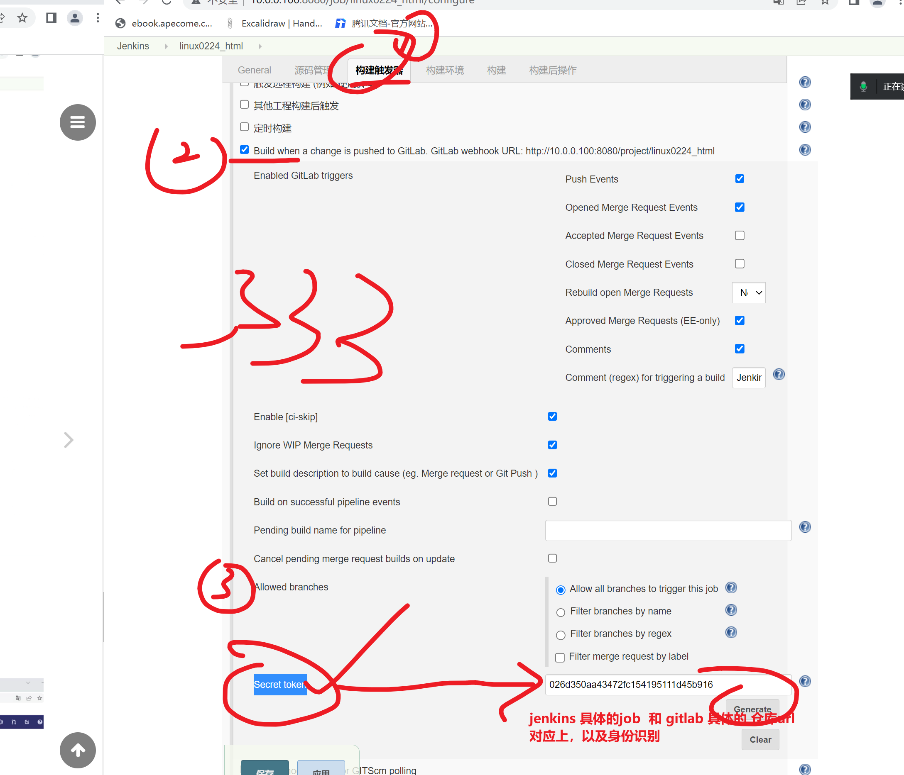

```### 此资源由 58学课资源站 收集整理 ###
	想要获取完整课件资料 请访问：58xueke.com
	百万资源 畅享学习

```
# 自动化发布静态页面

```
部署流水线

git + gitlab + jenkins + (发布动作，部署 shell脚本)
操作较多的机器
批量管理

git + gitlab + jenkins + ansible + (发布动作，部署 shell脚本)

流水线脚手架

git + gitla（代码仓库） + jenkins （创建任务，鼠标点这里）

1. 下载gitlab代码
2. 根据jenkins设置的 构建shell（填入的部署的命令）
3. 根据构建shell的设置，执行发布部署动作


33333

今天的实验，还是围绕这个来，多webhook，构建触发器


```


## 一键发布静态网站


## 先准备一个代码仓库

```
1.新建项目，导入项目url
https://gitee.com/lvyeyou/DaShuJuZhiDaPingZhanShi.git


```


## 配置jenkins构建任务


修改构建shell

```bash
#!/bin/bash
#author: www.yuchaoit.cn
# 1.进入代码目录，打包传输
DATE=$(date +%Y-%m-%d-%H-%M-%S)
web_server_list="10.0.0.7 10.0.0.8"

get_code(){
    cd ${WORKSPACE} && \
    tar czf /opt/web-${DATE}.tar.gz ./*
}

# 2.代码发送给web集群组
# 基于软连接，指向具体的文件目录，实现发版
scp_web_server(){
for hosts in $web_server_list
do
    scp /opt/web-${DATE}.tar.gz root@$hosts:/opt/
    ssh root@$hosts "mkdir -p /code/web-${DATE} && \
                                    tar -zxf /opt/web-${DATE}.tar.gz -C /code/web-${DATE}
                  rm -rf /code/web && \
                  ln -s /code/web-${DATE} /code/web"
done
}

deploy(){
        get_code
        scp_web_server
}

# 执行入口
deploy
```


### 排除构建失败

```
Host key verification failed.
lost connection
Host key verification failed.

jenkins机器，和7 8 俩机器，免密有问题

```


思考下次构建会发生什么


## 配置目标机器，web7，web8

- 目标机器，连nginx都没有，jenkins加上部署nginx操作
- 自己灵活点，技术再手里，想怎么用，随你便
- 只要把活搞定


```bash

# nginx，找到具体的html，展示即可

cat > /etc/nginx/conf.d/monitor.conf <<'EOF'
server{

    listen 80;
    server_name _;
    location / {
    	# nginx会去这个目录下，找代码，index.html
    
        root /code/web/智慧城市/智慧工地;
        index index.html;
    }

}
EOF

# 重启
pkill -9 nginx
systemctl restart nginx


```

，先看看nginx两台机器上的opt目录

```

```


## 捋一捋

```
1. gitlab有代码了
2. jenkins的 job，脚本页都正确执行，发送代码了
3. web 7 web8 的nginx页ok了

4. 访问试试
出现问题了403，nginx发给你的

5. 修改了nginx的root网页根目录，找到了前端文件，看懂1111
确保7 8 俩机器都可以访问


```


## 目前完成了，手工构建，第一版的web7 web8的静态网页

看懂1111


## 第二版，静态代码更新，再次构建，查看部署更新逻辑结果

```
1. 开发

- 下载代码
- 更新代码
 -推送代码


2. 运维

- 手工更新

1. git clone 下载最新代码
2. 放入nginx的网页根目录，路径匹配上就OK


- 自动化部署


```


### 演示，jenkins实现的静态网页更新全流程


### 开发更新代码


## 开发使用git的常见问题


本地和远程同步

```
$ git pull origin master
remote: Enumerating objects: 9, done.
remote: Counting objects: 100% (9/9), done.
remote: Compressing objects: 100% (5/5), done.
remote: Total 5 (delta 4), reused 0 (delta 0)
Unpacking objects: 100% (5/5), 472 bytes | 18.00 KiB/s, done.
From 10.0.0.99:chaoge/linux0224_html
 * branch            master     -> FETCH_HEAD
   c561a5a..395bff5  master     -> origin/master
Auto-merging 智慧城市/智慧工地/index.html
CONFLICT (content): Merge conflict in 智慧城市/智慧工地/index.html
Automatic merge failed; fix conflicts and then commit the result.


多个版本，都修改了同一行远程代码。。。。
```


```
手工删除无用代码，保留你想要的就行

```


此时最新的代码仓库内容

```
<div class="caption-title">
    <i class="fl"></i>
    <span class="biaoti fl">我是文杰，接手了这个项目</span>
    <i class="fr"></i>
</div>

```


### 运维jenkins鼠标一点，轻松搞定

```

```


```
运维发布，分几个阶段，几个级别

1. 纯手工发布，shell脚本 

2. jenkins手工构建，实现

3. 自动化构建
遇见的业务，很多，很杂，
```


# webhook自动化触发构建事件

## jenkins的设置




```
jenkins这里，保留着俩信息


026d350aa43472fc154195111d45b916
http://10.0.0.100:8080/project/linux0224_html
```


## gitlab的设置

```
1. 找到具体的项目url，仓库url

```


## gitlab功能 设置，允许本地网络请求


点击测试，确认看到 http 200即可

### 模拟cicd环节中，ci环节

```
master去练习


```


# 今日作业

练习1

```
任务轻松些，完成静态项目的发布练习即可

可以自己自由修改要发布的html源码，去码云找就行

确保自己搞定，cicd的发布流程

以及webhook，实现自动化构建触发的部署

```


练习2

```
学的快的就预习下一章 ，往后看，
```


