```### 此资源由 58学课资源站 收集整理 ###
	想要获取完整课件资料 请访问：58xueke.com
	百万资源 畅享学习

```
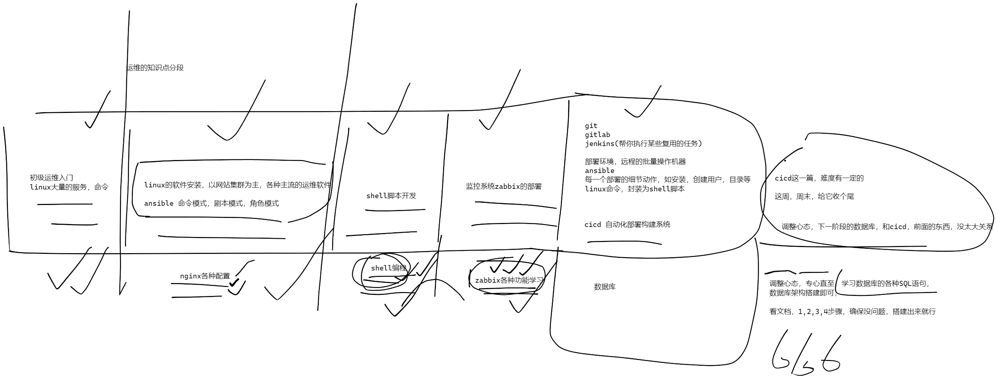


# 0.先说软件开发流水线

```
既然是学习devops 运维流水线构建
开发

↓

测试
测试这个环节，这里仅是学习自动化测试框架之一，sonnarqube
更多的测试工作，以
开发（自己做代码的 单元测试，测代码逻辑是否有bug）
测试工程师（专门的测试工作任务，如测试也要使用jenkins，实现自己日常任务的反复搭建环境，反复测试功能，）

↓

运维


华为devops软件开发流水线文档
https://support.huaweicloud.com/reference-devcloud/devcloud_reference_040404.html
```

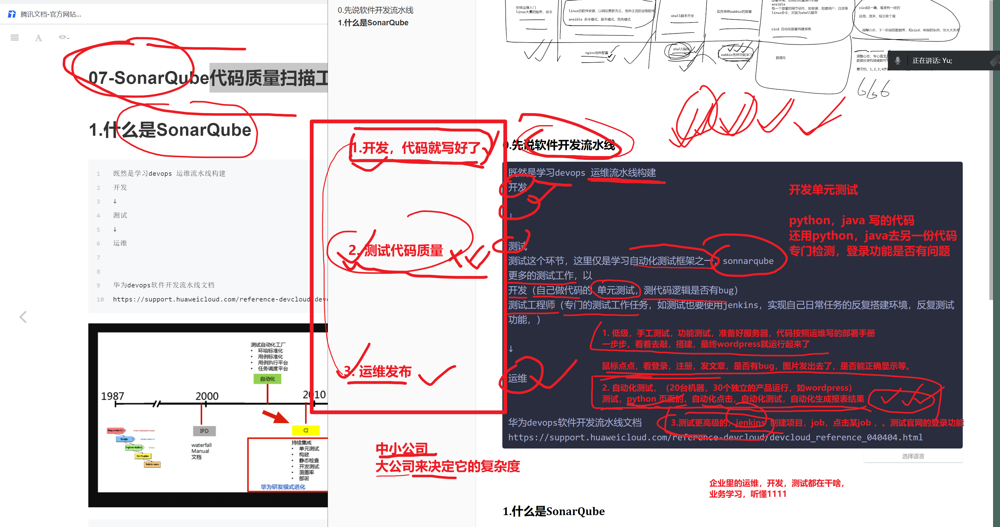


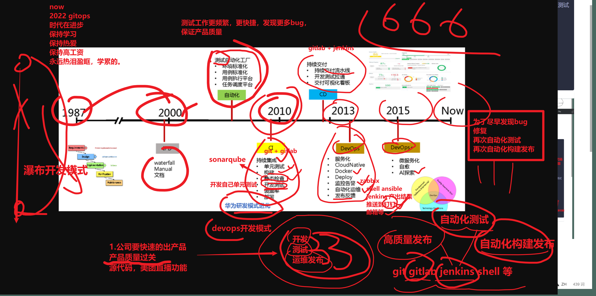


```
gitlab
jenkins

```


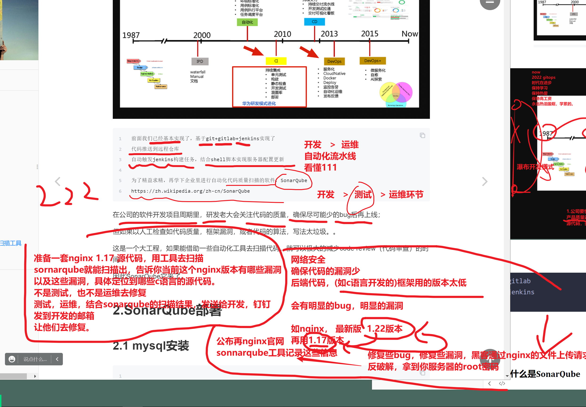

# 


# 1.什么是SonarQube


# 2.SonarQube部署

再jenkins机器上，安装sonnarqube

```
1. 手工代码测试，直接执行sonnarqube命令即可，可以扫描具体目录下的代码bug

2. 集成jenkins 和 sonnarqube 工具，来实现，再构建任务中，添加一个测试的环节


```


## 2.1 mysql安装

```perl
当前安装SonarQube软件的机器，已经有了数据库

1. 下载

wget https://downloads.mysql.com/archives/get/p/23/file/mysql-5.7.28-linux-glibc2.12-x86_64.tar.gz 

tar zxf mysql-5.7.28-linux-glibc2.12-x86_64.tar.gz -C /opt/
[root@jenkins-100 /opt]#ln -s /opt/mysql-5.7.28-linux-glibc2.12-x86_64/   /opt/mysql5.7.28 


2.配置PATH变量，启动服务即可
echo 'export PATH=$PATH:/opt/mysql5.7.28/bin/' >> /etc/profile
# source 命令读取该文件，会加载该PATH变量的新数据，再当前bash环节中
# . 点命令和source一个意思

.   /etc/profile


[root@jenkins-100 /opt]#echo $PATH
/usr/local/sbin:/usr/local/bin:/usr/sbin:/usr/bin:/root/bin:/opt/mysql5.7.28/bin/


3.验证mysql是否可用
[root@jenkins-100 /opt]#mysql -V
mysql  Ver 14.14 Distrib 5.7.28, for linux-glibc2.12 (x86_64) using  EditLine wrapper
[root@jenkins-100 /opt]#


4.卸载mariadb的依赖，防止运行mysql5.7冲突
yum remove mariadb-libs -y
# 删除默认的配置文件 ，自建新的
rm -rf /etc/my.cnf

5. mysql5.7运行需要有一个依赖，底层性能库的依赖
yum install -y libaio-devel


6.创建授权用户，运行mysql服务端


useradd -s /sbin/nologin -M mysql

# 创建mysql的数据目录
mkdir -p /linux0224_mysql_db/
chown -R mysql.mysql /linux0224_mysql_db/

# 给mysql的安装目录，授权
chown -R mysql.mysql /opt/mysql*

7.初始化，生成mysql的基础数据，如mysql自带的库，存储mysql用户信息等
# --basedir mysql的二进制命令在哪个目录
#  --datadir mysql的初始化数据，放哪


mysqld --initialize-insecure --user=mysql --basedir=/opt/mysql5.7.28/ --datadir=/linux0224_mysql_db/


8.## 查看mysql生成的初始数据
[root@jenkins-100 /opt]#
[root@jenkins-100 /opt]#ls /linux0224_mysql_db/
auto.cnf    ca.pem           client-key.pem  ibdata1      ib_logfile1  performance_schema  public_key.pem   server-key.pem
ca-key.pem  client-cert.pem  ib_buffer_pool  ib_logfile0  mysql        private_key.pem     server-cert.pem  sys

9.创建mysql配置文件

cat> /etc/my.cnf <<'EOF'
[mysqld]
user=mysql
basedir=/opt/mysql5.7.28/
datadir=/linux0224_mysql_db/
socket=/tmp/mysql.sock

[mysql]
socket=/tmp/mysql.sock
EOF


10.复制mysql5.7提供的脚本，放入 /etc/init.d/目录，交给systemctl去管理使用
[root@jenkins-100 /opt]#cp /opt/mysql5.7.28/support-files/mysql.server   /etc/init.d/mysqld


9. 启动，登录mysql

基于该脚本名，启动mysql

让systemctl 重新加载，你创建的 /etc/init.d/mysqld 该脚本

[root@jenkins-100 /opt]#systemctl daemon-reload


systemctl start mysqld # 调用 /etc/init.d/mysqld
[root@jenkins-100 /opt]#systemctl stop mysqld
[root@jenkins-100 /opt]#
[root@jenkins-100 /opt]#systemctl start mysqld 
[root@jenkins-100 /opt]#
[root@jenkins-100 /opt]#
[root@jenkins-100 /opt]#netstat -tunlp|grep 3306
tcp6       0      0 :::3306                 :::*                    LISTEN      130110/mysqld       
[root@jenkins-100 /opt]#
[root@jenkins-100 /opt]## 至此，mysqld可以正常重启，脚本配置完毕，基于pid可以看出结果，看懂666666
[root@jenkins-100 /opt]#


```


## 2.2 待会需要导入sonnarqube的各种离线插件

```
[root@jenkins-100 /opt]#cd sonarqube-all/
[root@jenkins-100 /opt/sonarqube-all]#
[root@jenkins-100 /opt/sonarqube-all]#ll
total 237684
-rw-r--r-- 1 root root    171714 Jul 22 18:22 publish-over-ssh.hpi
-rw-r--r-- 1 root root  45106788 Jul 22 18:22 sonar_plugins.tar.gz
-rw-r--r-- 1 root root 155709573 Jul 22 18:22 sonarqube-7.0.zip
-rw-r--r-- 1 root root  42392358 Jul 22 18:22 sonar-scanner-cli-4.0.0.1744-linux.zip
[root@jenkins-100 /opt/sonarqube-all]#


```


## 3.安装SonarQube

```perl
# 1.安装java环境，该程序是java开发的，需要jdk环境
[root@jenkins-100 /opt/sonarqube-all]#java -version
java version "1.8.0_181"
Java(TM) SE Runtime Environment (build 1.8.0_181-b13)
Java HotSpot(TM) 64-Bit Server VM (build 25.181-b13, mixed mode)
[root@jenkins-100 /opt/sonarqube-all]#
[root@jenkins-100 /opt/sonarqube-all]#


# 2.解压缩软件源码，授权等配置
[root@jenkins-100 /opt/sonarqube-all]#unzip sonarqube-7.0.zip


创建用户，目录授权
useradd sonar -M -s /sbin/nologin
chown -R sonar.sonar /opt/sonarqube-all/sonarqube-7.0

添加个软连接，便于查找

ln -s /opt/sonarqube-all/sonarqube-7.0  /opt/sonarqube

3. 修改sonar软件的配置文件，链接mysql，存储数据

设置mysql密码
mysqladmin -uroot -p   password linux0224
测试mysql是否可登录
[root@jenkins-100 ~]#mysql -uroot -plinux0224  -e "select user();"
mysql: [Warning] Using a password on the command line interface can be insecure.
+----------------+
| user()         |
+----------------+
| root@localhost |
+----------------+


#  java的配置文件
# 该语法就是，远程链接 10.0.0.51:3306端口下的 sonar这个数据库
# 因此下一步，得创建一个数据库，叫 sonar
# 看懂22222

# sonar.jdbc.url=jdbc:mysql://10.0.0.51:3306/sonar?
cat > /opt/sonarqube/conf/sonar.properties << 'EOF'
sonar.jdbc.username=root
sonar.jdbc.password=linux0224
sonar.jdbc.url=jdbc:mysql://localhost:3306/sonar?useUnicode=true&characterEncoding=utf8&rewriteBatchedStatements=true&useConfigs=maxPerformance&useSSL=false
EOF

4.创建sonar数据库

mysql -uroot -plinux0224 -e "create database sonar;"


4.1 修改sonnar的运行用户，否则权限对不上了

修改48行的用户设置
48 RUN_AS_USER=sonar


5.创建sonar脚本

# 为了让systemctl去帮你管理，sonar程序
# 指向sonar的运行命令，或者运行脚本

cat >/usr/lib/systemd/system/sonar.service<<'EOF'
[Unit]
Description=sonar

[Service]
ExecStart=/opt/sonarqube/bin/linux-x86-64/sonar.sh start
ExecStop=/opt/sonarqube/bin/linux-x86-64/sonar.sh stop
Type=forking
User=sonar
Group=sonar

[Install]
WantedBy=multi-user.target
EOF


6.重新加载脚本服务
systemctl daemon-reload 
systemctl start sonar

7.检查sonar的运行状态，检查sonar的web界面端口，9000

[root@jenkins-100 /opt/sonarqube]#netstat -tunlp|grep 9000
tcp6       0      0 :::9000                 :::*                    LISTEN      1376/java  


```


## 确保可以访问sonar页面

11. 15

### 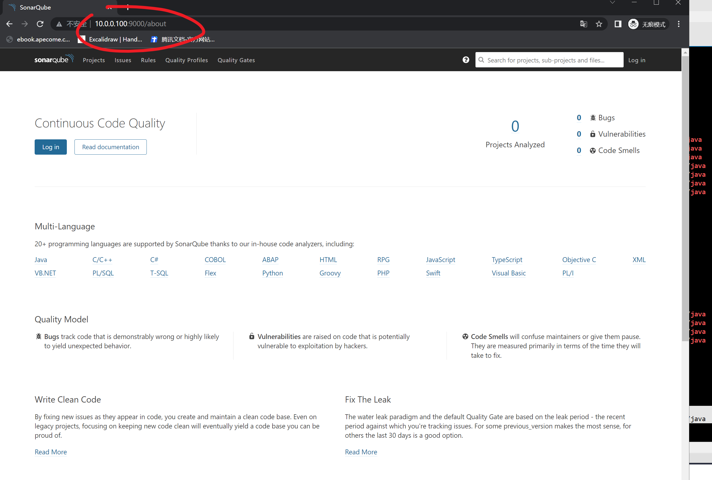

## 4.初始化SonarQube

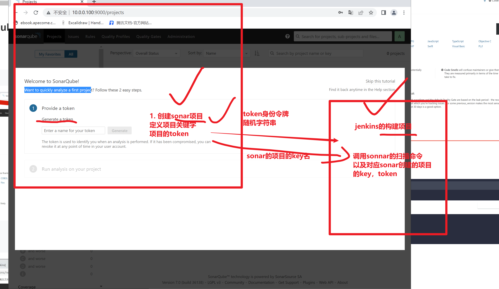

```
输入关键字jenkins，点击生成token

jenkins: 8815efcc4df85fa259aa8a846233e36e3c8bb7f2


```


​	4.1 登录

```
admin
admin
```


	4.2 生成token
	
	4.3 选择项目类型(开发语言)


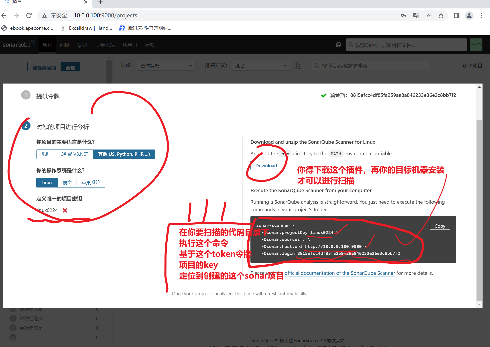


```
sonar-scanner \
  -Dsonar.projectKey=linux0224 \
  -Dsonar.sources=. \
  -Dsonar.host.url=http://10.0.0.100:9000 \
  -Dsonar.login=8815efcc4df85fa259aa8a846233e36e3c8bb7f2
  
  
```


## 5.安装SonarQube中文插件

```
导入离线插件

1. 备份sonar现有插件
[root@jenkins-100 /opt/sonarqube-all]#cp -a  /opt/sonarqube/extensions/plugins/ /opt/sonarqube/extensions/plugins_bak


2. 导入我们自定义的插件
[root@jenkins-100 /opt/sonarqube-all]#tar xf sonar_plugins.tar.gz -C /opt/sonarqube/extensions/
[root@jenkins-100 /opt/sonarqube-all]#
[root@jenkins-100 /opt/sonarqube-all]#


重启，查看是否有中文
[root@jenkins-100 /opt/sonarqube-all]#systemctl restart sonar

[root@jenkins-100 /opt/sonarqube-all]#
[root@jenkins-100 /opt/sonarqube-all]#free -m
              total        used        free      shared  buff/cache   available
Mem:           3773        2043        1047          44         681        1417
Swap:          3967          22        3945


```

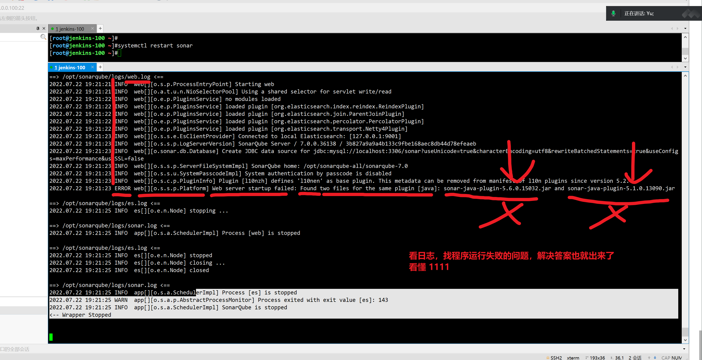


```
删除一个插件，再次启动

[root@jenkins-100 /opt/sonarqube/extensions/plugins]#rm -f /opt/sonarqube/extensions/plugins/sonar-java-plugin-5.1.0.13090.jar 
[root@jenkins-100 /opt/sonarqube/extensions/plugins]#
[root@jenkins-100 /opt/sonarqube/extensions/plugins]#
[root@jenkins-100 /opt/sonarqube/extensions/plugins]#
[root@jenkins-100 /opt/sonarqube/extensions/plugins]#tail -


确认启动了
[root@jenkins-100 ~]#netstat -tunlp|grep 9000
tcp6       0      0 :::9000                 :::*                    LISTEN      4866/java           
[root@jenkins-100 ~]#
[root@jenkins-100 ~]## 看懂日志 111
[root@jenkins-100 ~]#

```


## 5.1 导入于超老师准备的插件

```

```


## 确认可访问了

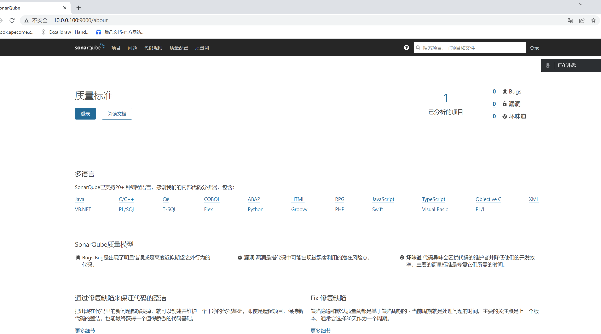


## 6.安装客户端

```
sonar工具

2玩法

1. 手工测代码bug


2 .集成jenkins实现检测


```


## 6.1 手工测试代码扫描结果

```perl
1.需要先安装sonar的扫描器客户端，软件

解压缩，配置环境变量即可
[root@jenkins-100 /opt/sonarqube-all]#unzip sonar-scanner-cli-4.0.0.1744-linux.zip 

[root@jenkins-100 /opt/sonarqube-all/sonar-scanner-4.0.0.1744-linux/bin]#tail -1 /etc/profile
export PATH=$PATH:/opt/mysql5.7.28/bin/:/opt/sonarqube-all/sonar-scanner-4.0.0.1744-linux/bin


添加path变量，快捷使用该扫描器脚本
[root@jenkins-100 /opt/sonarqube-all/sonar-scanner-4.0.0.1744-linux/bin]#sonar-scanner --help
INFO: 
INFO: usage: sonar-scanner [options]
INFO: 
INFO: Options:
INFO:  -D,--define <arg>     Define property
INFO:  -h,--help             Display help information
INFO:  -v,--version          Display version information
INFO:  -X,--debug            Produce execution debug output


使用扫描器，扫描代码即可

sonar-scanner 
  -Dsonar.projectKey=linux0224 \
  -Dsonar.sources=. \
  -Dsonar.host.url=http://10.0.0.100:9000 \
  -Dsonar.login=8815efcc4df85fa259aa8a846233e36e3c8bb7f2
  
  
  
# 下载源代码，用sonar去扫描，看有多少bug
# 周末自己试试，部署腾讯的项目
https://gitee.com/Tencent-BlueKing/bk-PaaS/blob/master/docs/install/ce_paas_install.md


git clone https://gitee.com/Tencent-BlueKing/bk-PaaS.git

进入该源码项目，用sonar扫描试试
不一定好使，sonar想扫描各种语言的，话，还得下载扫描器插件

[root@jenkins-100 /tmp/bk-PaaS]#
[root@jenkins-100 /tmp/bk-PaaS]#

sonar-scanner \
  -Dsonar.projectKey=linux0224 \
  -Dsonar.sources=. \
  -Dsonar.host.url=http://10.0.0.100:9000 \
  -Dsonar.login=8815efcc4df85fa259aa8a846233e36e3c8bb7f2


sonar会解析扫描js代码，需要有node解释器的开发环境
给jenkins机器安装

# 解压即用node环境
cat > install_node12-13.sh <<'EOF'
cd /opt/
wget https://nodejs.org/dist/v12.13.0/node-v12.13.0-linux-x64.tar.xz
tar xf node-v12.13.0-linux-x64.tar.xz
mv node-v12.13.0-linux-x64 node
echo 'export PATH=$PATH:/opt/node/bin' >> /etc/profile
source /etc/profile
npm -v
node -v
EOF

再次重启sonar

[root@jenkins-100 /var/lib/jenkins/workspace/linux0224_html]#systemctl restart sonar


再次尝试
sonar-scanner \
  -Dsonar.projectKey=linux0224 \
  -Dsonar.sources=. \
  -Dsonar.host.url=http://10.0.0.100:9000 \
  -Dsonar.login=8815efcc4df85fa259aa8a846233e36e3c8bb7f2
  
 
 
```

```
不是说 老师教的，跟着做出来了你就过关了

60分及格

笔记的详细度
你自己的产出有多少，才是剩下的40分，是你自己的理解
你自己额外做的练习有多少。。。
看你下多少功夫了，能达到100分


```


学技术，练习的时候，重点在于，学运维的操作，拍错的思路

转化为你自己的理解，思考，以后去面对更多的软件部署，大风大浪，从容面对

听懂666

```
志伟，只能扫描我博客里的代码
其他都报错
看日志
到底是啥问题，尝试修复即可
这就是你运维的工作

```


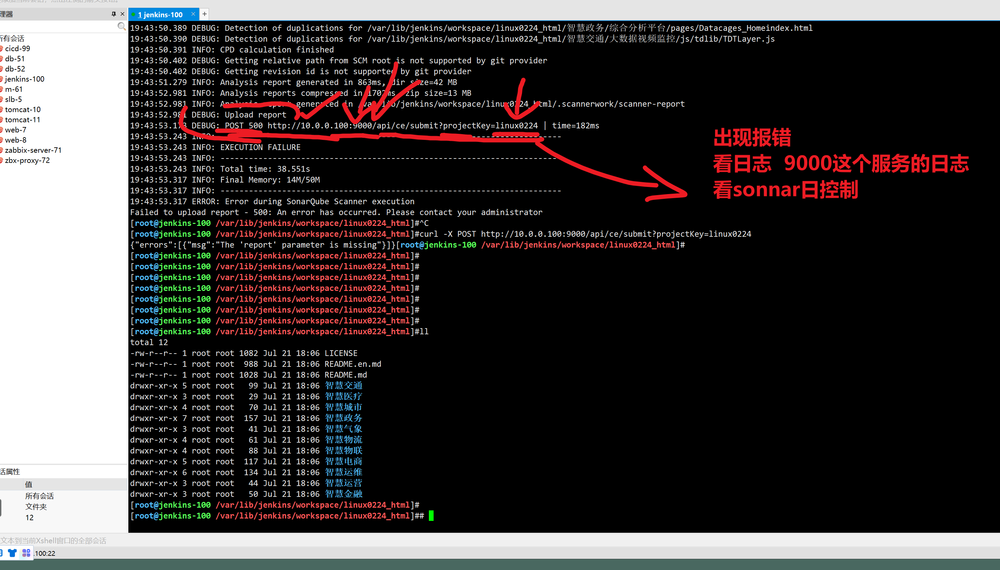


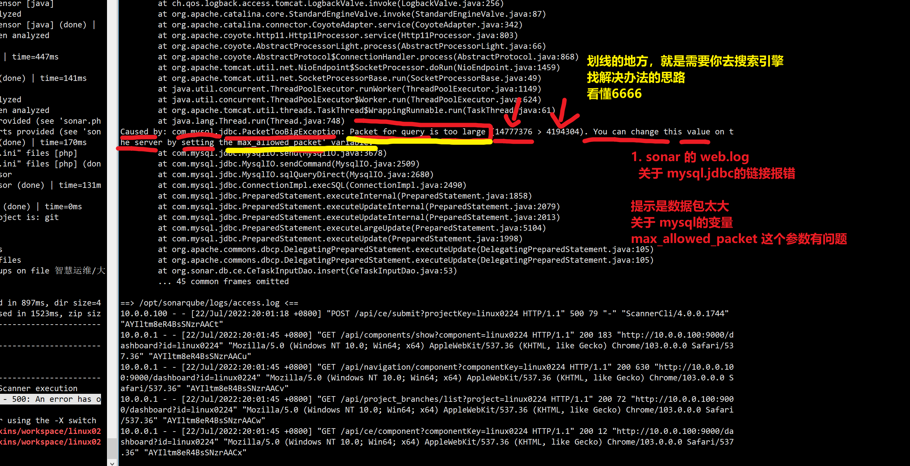


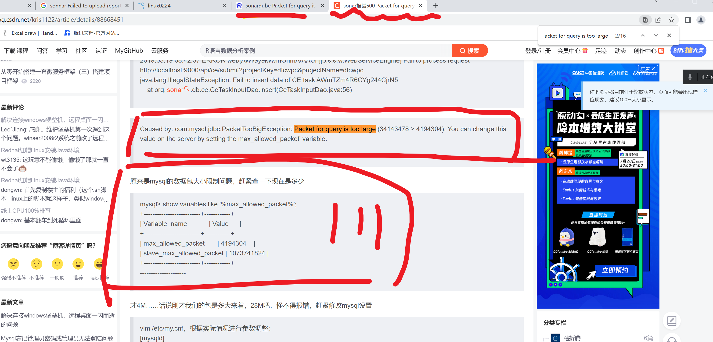

```
Packet for query is too large (14777376 > 4194304)

你上传的数据，sonnar  > mysql
14777376

mysql的变量max_allowed_packet 值4194304

查一查


```

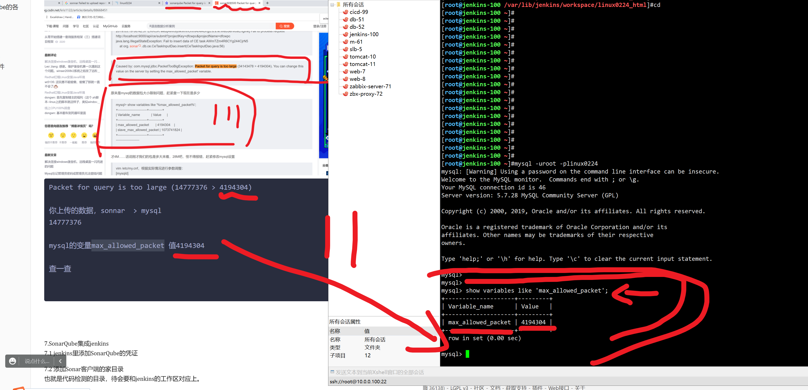


### 解决办法

```
修改mysql临时变量，或者修改配置文件，永久生效

max_allowed_packet = 100M 

配置如下
[root@jenkins-100 ~]#cat /etc/my.cnf 
[mysqld]
max_allowed_packet = 100M
user=mysql
basedir=/opt/mysql5.7.28/
datadir=/linux0224_mysql_db/
socket=/tmp/mysql.sock

[mysql]
socket=/tmp/mysql.sock


systemctl restart mysqld


[root@jenkins-100 ~]#mysql -uroot -plinux0224 -e "show variables like 'max_allowed_packet';"
mysql: [Warning] Using a password on the command line interface can be insecure.
+--------------------+-----------+
| Variable_name      | Value     |
+--------------------+-----------+
| max_allowed_packet | 104857600 |
+--------------------+-----------+
[root@jenkins-100 ~]#python
Python 2.7.5 (default, Apr 11 2018, 07:36:10) 
[GCC 4.8.5 20150623 (Red Hat 4.8.5-28)] on linux2
Type "help", "copyright", "credits" or "license" for more information.
>>> 104857600 / 1024 
102400
>>> 104857600 / 1024 /1024
100
>>> print("看懂111")
看懂111
>>> 
>>> 
>>> 
[root@jenkins-100 ~]#

```


### 再次尝试sonar检查

注意还得重启sonar

```
[root@jenkins-100 /var/lib/jenkins/workspace/linux0224_html]#systemctl restart sonar


```


```
sonar-scanner \
  -Dsonar.projectKey=linux0224 \
  -Dsonar.sources=. \
  -Dsonar.host.url=http://10.0.0.100:9000 \
  -Dsonar.login=8815efcc4df85fa259aa8a846233e36e3c8bb7f2
```


终于好了。。

```
INFO: 6 files had no CPD blocks
INFO: Calculating CPD for 155 files
WARN: Too many duplication groups on file 智慧运维/大数据运维总览图/citystore.js. Keep only the first 100 groups.
INFO: CPD calculation finished
INFO: Analysis report generated in 821ms, dir size=42 MB
INFO: Analysis reports compressed in 1515ms, zip size=13 MB
INFO: Analysis report uploaded in 636ms
INFO: ANALYSIS SUCCESSFUL, you can browse http://10.0.0.100:9000/dashboard/index/linux0224
INFO: Note that you will be able to access the updated dashboard once the server has processed the submitted analysis report
INFO: More about the report processing at http://10.0.0.100:9000/api/ce/task?id=AYIl0p-txMd9QSYDagrm
INFO: Task total time: 37.208 s
INFO: ------------------------------------------------------------------------
INFO: EXECUTION SUCCESS
INFO: ------------------------------------------------------------------------
INFO: Total time: 38.291s
INFO: Final Memory: 14M/54M
INFO: ------------------------------------------------------------------------
[root@jenkins-100 /var/lib/jenkins/workspace/linux0224_html]#


```


### 访问sonnar页面，查看扫描结果

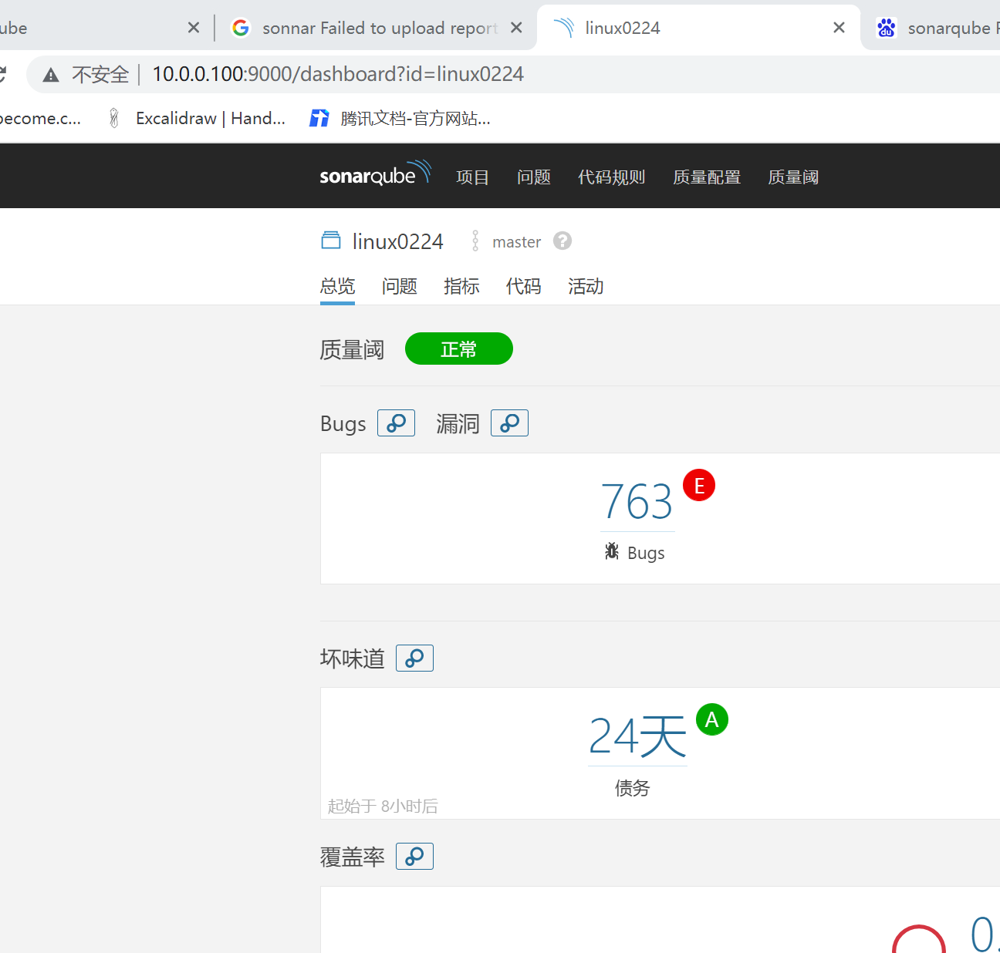


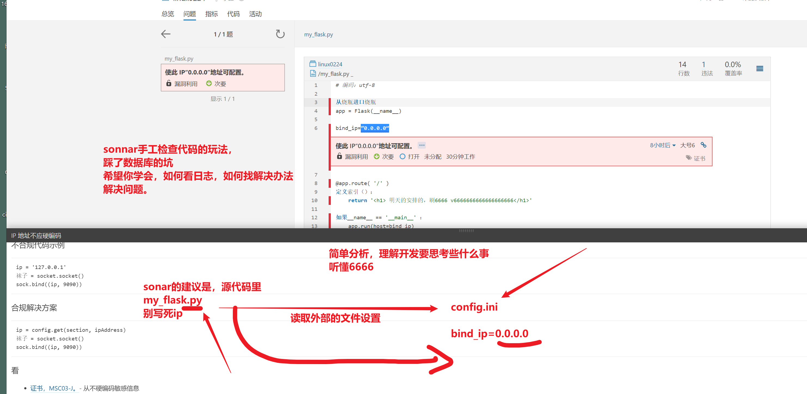


# 7.SonarQube集成jenkins

```
手工去各种源码目录下 去扫描代码

gitlab 拉去代码  ----------开发
↓
jenkins的 job的工作区里 （sonarqube对该代码扫描，上传bug结果，到平台）-------测试
↓
构建部署的操作。--------运维

流程听懂1111


```


## 7.1 jenkins里添加SonarQube的凭证

```
1. 再jenkins中，添加链接sonar的身份临牌
找到你安装sonar时生成的令牌

8815efcc4df85fa259aa8a846233e36e3c8bb7f2

2. 再具体的job中，添加构建动作，添加扫描的动作

sonar需要设置扫描器的命令
再jenkins中，设定扫描器脚本的路径


```


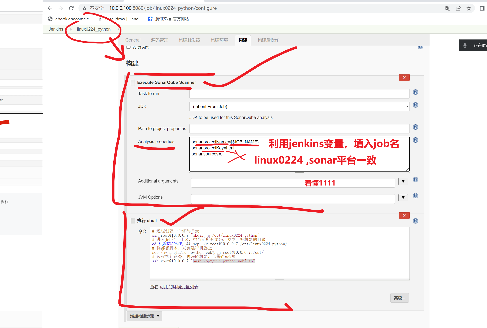


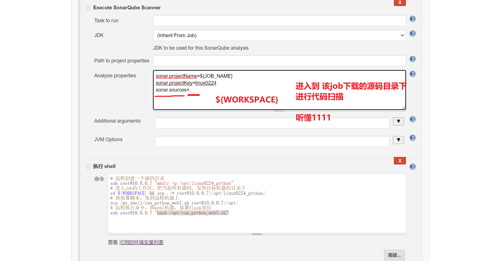


### 最后一个环节，cicd全流程

开发

测试

运维发布


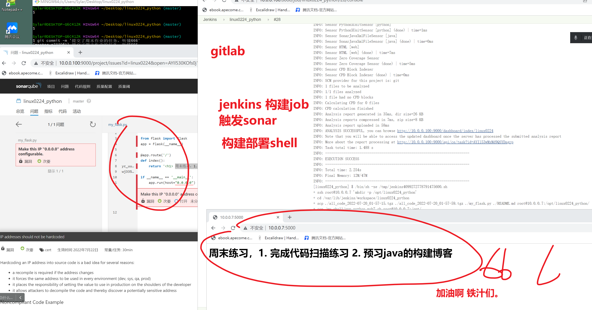


下午 2.40进班学习


7.2 添加Sonar客户端的家目录
也就是代码检测的目录，待会要和jenkins的工作区对应上。

7.3 给job添加sonar构建动作
构建的同时进行代码扫描

7.4 最后注意细节
软件开发流程是

开发、测试、运维上线。

调整jenkins的devops流程构建步骤。


8.最终测试
1. 开发推送代码，触发gitlab的webhook，执行jenkins任务
2. 构建动作里，先sonnar代码扫描，然后进行脚本发布

