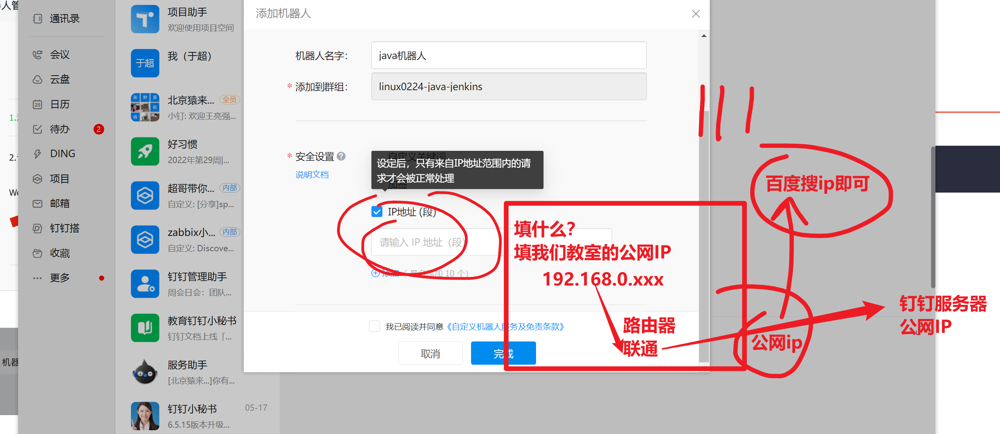

```### 此资源由 58学课资源站 收集整理 ###
	想要获取完整课件资料 请访问：58xueke.com
	百万资源 畅享学习

```
# 08-jenkins发布Java项目


# 1.java项目是什么(springboot)

```
主流的，最新的java开发技术栈，采用springboot框架去写代码，写项目(开发操心要学的东西)

这个框架，内置了tomcat服务器，因此能实现


========================================================================
运维只需要关心这个

1. 是否要部署tomcat程序去（你们的开发，给你一个war包，需要安装tomcat去发布java项目）
最终，都会将java项目运行再  10.0.0.8:8080


2. 开发直接丢给你一个jar包，无需部署tomcat，直接 java -jar  *.jar即可启动项目（内置tomcat程序）
最终，都会将java项目运行再  10.0.0.8:8080


```


```bash
由java语言开发的后端，就是java项目

前面于超老师教了大家学习了 

wordpress---php项目部署，提供LNMP，交给php-fpm进程去解释执行该源码

jumpserver的core后端---python项目，提供python3环境，即可运行

golang程序，需要安装golan编译器，编译二进制命令行，即可运行。


java项目，提供java开发环境，且进行编译后，方可运行，今天开始学这个。

简单理解java的源代码，好比一堆零散的零件（文件），通过编译，打包之后，成为一个整体小汽车（java代码包），然后就可以基于这个代码包运行java进程了。


springboot是java开发中的一个框架，用于写后端接口，用于写web后端的。

本文将带你玩转基于java后端的高级devops流水线项目，真刀真枪玩转项目
```


## 1.1 java项目的部署方式

```perl
目前市场上，部署java web的方式，主要有俩方案

1. 开发交付给运维的是一个（*.war） zip类型的压缩包，这个压缩包里包含了网站的thml，配置文件，以及java代码，运维只需要提供应用容器（tomcat）即可发布这个java网站。（集团型的中大型公司，用该方案）

2. 目前互联网公司以devops开发模式，快速迭代模型，并且java后端诞生spring Boot框架，最终开发交付的产物是（*.jar）也是zip类型的压缩包，且springboot该框架内置了应用容器（tomcat），最终运维只需要（jar -jar *.jar）即可运行java网站
```


## 1.2 war和jar部署区别

```
tomcat章节再去讲war包部署

先学习jar包的部署


--------回忆多种语言的部署方式
php部署，启动php-fpm，以及准备好*.php源码即可
python3部署，需要安装python3，pip3 install安装依赖，python3 启动进程


java项目部署，准备好jar压缩包，jar -jar *.jar启动即可
- 如sprintboot框架的hello-world的编译 与运行
- 如halo博客的部署
https://halo.run/#quickstart


更多maven命令
就看你以后维护的方向是什么，再做更多的深入学习，完成工作即可
https://cloud.tencent.com/developer/article/1670548

```


### 体验jar包的玩法一


```
# 运维，通过搭建java项目的构建流水线
#  1.  gitlab 拉去java项目源码
# 2. jenkens环节，进行源码编译，打包生成 jar包
# 3. jenkins把这些jar包发到目标服务器上（web7，web8两台机器）
# 4. 分别再2机器，运行jar包就完事


下载 java源码，进行maven打包，模拟开发，生成jar包，再去运行
#学习maven的部署玩法
# java的springboot项目，需要用maven这个工具去编译


# 1.安装maven工具
yum install maven -y

[root@db-51 /opt/springboot-test]#mvn -version
Apache Maven 3.0.5 (Red Hat 3.0.5-17)
Maven home: /usr/share/maven
Java version: 1.8.0_332, vendor: Red Hat, Inc.
Java home: /usr/lib/jvm/java-1.8.0-openjdk-1.8.0.332.b09-1.el7_9.x86_64/jre
Default locale: en_US, platform encoding: UTF-8
OS name: "linux", version: "3.10.0-862.el7.x86_64", arch: "amd64", family: "unix"
[root@db-51 /opt/springboot-test]#


# 2. 下载java源码
git clone https://gitee.com/yuco/springboot-test.git


#3. 进入源码目录，打包即可

[root@db-51 /opt/springboot-test]#ll
total 28
-rw-r--r-- 1 root root 9114 Feb 25 09:33 mvnw
-rw-r--r-- 1 root root 5811 Feb 25 09:33 mvnw.cmd
-rw-r--r-- 1 root root 2134 Feb 25 09:33 pom.xml
drwxr-xr-x 4 root root   30 Feb 25 09:33 src
-rw-r--r-- 1 root root  643 Feb 25 09:33 项目说明.text
[root@db-51 /opt/springboot-test]#
[root@db-51 /opt/springboot-test]#


# 再不懂配置文件语法请看下，别改了
# 修改pom.xml配置文件，修改最终生成jar包的名字

#   7         <artifactId>java-test-linux02224</artifactId>
#  8         <version>6.0</version>


还得修改maven的下载源，改为阿里云的，否则下载忒慢了
# yum 配置阿里源 pip3 也要配置豆瓣源
# maven也得配置阿里源 ，听懂3333333


# 找到maven的配置文件目录，yum安装的，默认都在etc目录下
/etc/maven/settings.xml 
修改如下
   <mirror>
           <id>alimaven</id>
           <mirrorOf>central</mirrorOf>
           <name>aliyun maven</name>
           <url>http://maven.aliyun.com/nexus/content/repositories/central/</url>
       </mirror>


# 4.启动
先打包，生成jar包，maven自动下载项目的依赖
[root@db-51 /opt/springboot-test]#mvn clean package
期望结果如下
[INFO] Replacing main artifact with repackaged archive
[INFO] ------------------------------------------------------------------------
[INFO] BUILD SUCCESS
[INFO] ------------------------------------------------------------------------
[INFO] Total time: 1:14.183s
[INFO] Finished at: Fri Feb 25 09:47:31 CST 2022
[INFO] Final Memory: 32M/203M
[INFO] ------------------------------------------------------------------------


#查看 当前源码目录下的 target目录下的jar包
[root@db-51 /opt/springboot-test]#ll target/
total 18948
drwxr-xr-x 3 root root       40 Feb 25 09:47 classes
drwxr-xr-x 3 root root       25 Feb 25 09:47 generated-sources
drwxr-xr-x 3 root root       30 Feb 25 09:47 generated-test-sources
drwxr-xr-x 2 root root       28 Feb 25 09:47 maven-archiver
drwxr-xr-x 3 root root       35 Feb 25 09:47 maven-status
-rw-r--r-- 1 root root 19388017 Feb 25 09:47 springboot-helloword-1.jar
-rw-r--r-- 1 root root     8656 Feb 25 09:47 springboot-helloword-1.jar.original
drwxr-xr-x 2 root root      135 Feb 25 09:47 surefire-reports
drwxr-xr-x 3 root root       17 Feb 25 09:47 test-classes


# 启动，运行打包的jar包，查看进程
java -jar springboot-helloword-1.jar

# 客户端访问，具体的url，要开发给你写好文档，否则你不一定知道访问啥
# 该测试代码，提供的访问路径是
http://10.0.0.51:8080/say


# 查看如果修改了源码，如何更新的逻辑？
# 运维要理解，源码编译为jar包，后续的源码更新，要再次打包

[root@db-51 /opt/springboot-test]#cat  src/main/java/com/cn/mical/springboot/controller/HelloController.java 
package com.cn.mical.springboot.controller;

import org.springframework.web.bind.annotation.RequestMapping;
import org.springframework.web.bind.annotation.RestController;

/**
 * @program: helloword
 * @Date: 2022年6月22日22:34:02
 * @Author: linxin
 * @Description:
 */
@RestController
public class HelloController {

    @RequestMapping("/say")
    public String say(){
        return "Hello Word 不要当咸鱼，要当煤老板";
    }
}


# 重新打包


```


### 体验jar包的玩法二

```
1. 开发，直接发给你了一个 *.jar包
2. 运维要干啥啊？


安装java
运行jar包就完事

随便找个机器先作为测试练习


# 这是最新版本
$ wget https://dl.halo.run/release/halo-1.5.4.jar

# 试试1.1.0版本
https://github.com/halo-dev/halo/releases?page=6


# 去官网下载jdk.rpm 或者直接yum安装
# yum install java -y 快速部署java开发环境
# 开发，他是基于什么版本的java环境，写的代码，都会交付环境文档给运维
# 运维去线上服务器，部署相应的版本，java版本和代码依赖的版本要一致，否则也会报错。


[root@db-51 /opt]#java -version
openjdk version "1.8.0_332"
OpenJDK Runtime Environment (build 1.8.0_332-b09)
OpenJDK 64-Bit Server VM (build 25.332-b09, mixed mode)


# 访问低版本的效果
[root@db-51 /opt]#java -jar halo-1.1.0.jar 

    __  __      __
   / / / /___ _/ /___
  / /_/ / __ `/ / __ \
 / __  / /_/ / / /_/ /
/_/ /_/\__,_/_/\____/
 
 ::: Spring-Boot 2.1.7.RELEASE     ::: Halo (version: (v1.1.0))


Halo started at         http://10.0.0.51:8090
Halo admin started at   http://10.0.0.51:8090/admin


# 测试访问
linux0224
linux0224@qq.com
123123123

```


3.00继续

## halo博客使用的是内嵌数据库(h2)

```
也就是不依赖于mysql，单独一个java的内置进程，管理了博客数据库

https://docs.halo.run/getting-started/config

https://www.baeldung.com/spring-boot-h2-database

```


# 2.项目架构


# 3.构建服务器环境检查

10.0.0.100 jenkins-100

```
maven环境，也装这个jenkins 100机器上
必须得有jdk环境

```


## 3.1 java环境

````
[root@jenkins-100 ~]#java -version
java version "1.8.0_181"
Java(TM) SE Runtime Environment (build 1.8.0_181-b13)
Java HotSpot(TM) 64-Bit Server VM (build 25.181-b13, mixed mode)


````


## 3.2 maven环境

以下作为博客，看看了解即可，java开发的知识

```
[root@jenkins-100 ~]#mvn -version
-bash: mvn: command not found

准备好的maven rpm包安装


#准备好安装包，解压缩，配置PATH变量
[root@jenkins-100 /opt/maven339/apache-maven-3.3.9/bin]#ll /opt/maven339/apache-maven-3.3.9-bin.tar.gz 
-rw-r--r-- 1 root root 8491533 Jul 14 12:01 /opt/maven339/apache-maven-3.3.9-bin.tar.gz

[root@jenkins-100 /opt/maven339/apache-maven-3.3.9/bin]#tail -2 /etc/profile
export PATH=$PATH:/opt/mysql5.7.28/bin/:/opt/sonarqube-all/sonar-scanner-4.0.0.1744-linux/bin:/opt/maven339/apache-maven-3.3.9/bin:/opt/node/bin


# 查看mvn命令的环境
[root@jenkins-100 ~]#mvn -version
Apache Maven 3.3.9 (bb52d8502b132ec0a5a3f4c09453c07478323dc5; 2015-11-11T00:41:47+08:00)
Maven home: /opt/maven339/apache-maven-3.3.9
Java version: 1.8.0_181, vendor: Oracle Corporation
Java home: /usr/java/jdk1.8.0_181-amd64/jre
Default locale: en_US, platform encoding: UTF-8
OS name: "linux", version: "3.10.0-862.el7.x86_64", arch: "amd64", family: "unix"


```


### Maven项目结构

一个使用Maven管理的普通的Java项目，它的目录结构默认如下：


### 部署maven

```
修改maven打包工具的 依赖源地址，改为阿里云的
# 注意如何找maven的家目录

[root@jenkins-100 ~]#mvn -version
Apache Maven 3.3.9 (bb52d8502b132ec0a5a3f4c09453c07478323dc5; 2015-11-11T00:41:47+08:00)
Maven home: /opt/maven339/apache-maven-3.3.9
Java version: 1.8.0_181, vendor: Oracle Corporation
Java home: /usr/java/jdk1.8.0_181-amd64/jre
Default locale: en_US, platform encoding: UTF-8
OS name: "linux", version: "3.10.0-862.el7.x86_64", arch: "amd64", family: "unix"


# 找到maven工具的家目录，配置文件
ls  /opt/maven339/apache-maven-3.3.9
 
146   <mirrors>
147     <!-- mirror
148      | Specifies a repository mirror site to use instead of a given repository. The repository that
149      | this mirror serves has an ID that matches the mirrorOf element of this mirror. IDs are used
150      | for inheritance and direct lookup purposes, and must be unique across the set of mirrors.
151      |
152     <mirror>
153       <id>mirrorId</id>
154       <mirrorOf>repositoryId</mirrorOf>
155       <name>Human Readable Name for this Mirror.</name>
156       <url>http://my.repository.com/repo/path</url>
157     </mirror>
158      -->
159    <!-- 阿里云仓库 -->
160        <mirror>
161            <id>alimaven</id>
162            <mirrorOf>central</mirrorOf>
163            <name>aliyun maven</name>
164            <url>http://maven.aliyun.com/nexus/content/repositories/central/</url>
165        </mirror>
166   </mirrors>
167 


```


至此mvn的打包环境就ok了

配置源码仓库，和jenkins了


## 3.3 jenkins检查

确保你的jenkins装好了maven插件

```
安装jenkins时，以及导入了

```


## 3.4 配置jenkins支持maven

配置jdk


配置具体的jenkins，设置maven命令，家目录


至此，jenkins就可以正确使用mvn这个命令去打包了

看懂11111


## 3.5 配置ssh（ssh-server）

下一步就是要确保架构中的，jenkins机器，和目标机器实现ssh免密操作。


```
需要jenkins额外安装 publish over ssh
远程ssh免密登录的插件

选择jenkiins在线的，配置jenkins插件源，如更换清华的去装

手动下载插件，导入

```


```
systemctl restart jenkins
重启后，配置ssh的免密登录

jenkins机器，发布jar包到web7 web8机器


先免密登录

[root@jenkins-100 ~]#ssh-copy-id root@10.0.0.7
/usr/bin/ssh-copy-id: INFO: Source of key(s) to be installed: "/root/.ssh/id_rsa.pub"
/usr/bin/ssh-copy-id: INFO: attempting to log in with the new key(s), to filter out any that are already installed


/usr/bin/ssh-copy-id: WARNING: All keys were skipped because they already exist on the remote system.
		(if you think this is a mistake, you may want to use -f option)

[root@jenkins-100 ~]#
[root@jenkins-100 ~]#ssh-copy-id root@10.0.0.8
/usr/bin/ssh-copy-id: INFO: Source of key(s) to be installed: "/root/.ssh/id_rsa.pub"
/usr/bin/ssh-copy-id: INFO: attempting to log in with the new key(s), to filter out any that are already installed

/usr/bin/ssh-copy-id: WARNING: All keys were skipped because they already exist on the remote system.
		(if you think this is a mistake, you may want to use -f option)

[root@jenkins-100 ~]#
[root@jenkins-100 ~]#
[root@jenkins-100 ~]#ssh root@10.0.0.7 "hostname"
web-7
[root@jenkins-100 ~]#ssh root@10.0.0.8 "hostname"
web-8


# 拿着jenkisn的私钥做验证

# 设置文件发到目标机器的，/opt/jenkins-sh/目录，得先创建

#先jenkins机器，进行远程检查


```

给jenkins配置 ssh插件的私钥即可


```
至此，可以实现
jenkins发文件目标机器  web7  web8的

/opt/jenkins-sh/文件夹了

```


# 4.创建Jenkins任务

该job用于，编译java项目以及，远程发布


## 4.1 新建任务

```
首页>新建>输入一个任务名称>构建一个maven项目
```

## 4.2 勾选丢弃旧的构建


## 4.3 git源码管理

新建gitlab仓库

```
1.这里模拟java开发角色，上传代码到gitlab

导入该码云的仓库即可
https://gitee.com/yuco/springboot-test.git


```


还得配置jenkins，能正常下载这个源码

```
git gitlab jenkins  + mvn  + 钉钉


```


```
gitlab  哦了

jenkisn + mvn 哦了

jenkins 获取 gitlab  java源码  哦了


```


## 4.4 构建触发器webhook设置


```
gitlab代码仓库更新，jenkins任务自动执行

71def90efe52f31ac2d142600243eff1
http://10.0.0.100:8080/project/linux0224-java

需要交给gitlab


```

找到gitlab的代码仓库，集成jenkins的push事件


## 4.5 构建环境设置

最后一步动作，给jenkins的job，添加mvn的构建参数

```
Maven project linux0224-java

实现java源码拉去
执行mvn命令
具体对源码的编译参数，还未设置


```


```
填入mvn的构建参数
clean install -Dmaven.test.skip=true

都是在当前job工作去下的 target目录中，得到jar包

```


```
目前到这里
```


### 4.5.1 手工执行mvn，结合jenkins


```
手工测一测 jenkins能否下载代码
mvn能否打包，jar包
以及能否运行
检查jar包是否可用就可以了


然后再发给web7 web8 实现更新发布脚本就哦了


```


配置job，把生成的jar发给web7 web8


---

```
这里的配置是jenkins 远程执行，远程机器上的一个脚本

```


```
最后
去

web7  web8 ，设置运行java程序的脚本

/opt/jenkins-sh/deploy-java.sh


```

这一段是讲解远程ssh配置


## 4.6 钉钉设置

构建结果，写入到钉钉，发个通知，实际运用的效果


```
1. 生成钉钉机器人
# 这个url，就对应了这个钉钉群聊

https://oapi.dingtalk.com/robot/send?access_token=b647b8999781885a19d40c34da457ed6fc586fafb1b8004cca3dd13da60c6a32

```




到这 jenkins，构建结果，只有是 success的时候，才会发送钉钉群聊


# 5.部署脚本开发

```bash
再web7  和 web8机器准备

mkdir -p /opt/jenkins-sh/

cat > /opt/jenkins-sh/deploy-java.sh << 'EOF'
#!/bin/bash

#格式化时间，年月日
DATE=$(date +%Y%m%d)

#设置程序目录，设置一个java项目的备份目录，因为会多次构建
# 希望保留之前的旧的版本，而不是直接覆盖

# 这个 web7 ，web8的用于，保存jar包的目录
DIR=/usr/local/app

#设置Jar名称，也就是jenkins构建maven build后的产物
# 填入你的java程序，打包后的文件名

JARFILE=springboot-helloword-1.jar


#判断是否存在backp目录，如果不存储就创建
# 如果备份目录不存在，则创建
# 再代码目录下，创建一个backup文件夹
# 旧的jar包，会放入 /usr/local/app/backup目录

if [ ! -d $DIR/backup ];then
   mkdir -p $DIR/backup
fi

# 进入到web7，或 web8的 jar包，发布目录
cd $DIR

#杀掉当前运行的旧程序
# 干掉旧的java程序
ps -ef | grep $JARFILE | grep -v grep | awk '{print $2}' | xargs -i kill -9 {}

#备份旧程序
# 移动当前的jar文件 到 backup目录下，且加上时间

mv $JARFILE $DIR/backup/$JARFILE$DATE


#部署新程序
# 将jenkins发来的jar包，放入 当前的 jar包发布目录 /usr/local/app

mv -f /opt/jenkins-sh/target/$JARFILE .


# 至此就实现了，旧的jar包，放入了 /usr/local/app/bakcup/
# 新的jar包，/usr/local/app

# 然后可以启动新程序了

echo "The service will be starting"

#后台启动程序并设置Jvm参数、开启JMX、打印GC日志
# java  -jar  springboot-helloword-1.jar

# 到这，等于实现，发布脚本，实现了更新进程，备份旧得jar包
# 启动 新的进程
# 听懂111111，课下自己手写，这个代码


# 给大家模拟 一个生产环境下，会有很多的优化参数

java -server -Xms1024M -Xmx1024M -XX:PermSize=256M \
-XX:MaxPermSize=256M -XX:+HeapDumpOnOutOfMemoryError -XX:+PrintGCDetails \
-Xloggc:./gc.log \
-Dcom.sun.management.jmxremote -Djava.rmi.server.hostname=127.0.0.1 \
-Dcom.sun.management.jmxremote.port=10086 -Dcom.sun.management.jmxremote.ssl=false \
-Dcom.sun.management.jmxremote.authenticate=false \
-Dserver.address=0.0.0.0 -Dserver.port=18888 \
-jar $JARFILE  --spring.profiles.active=dev > /nohup 2>&1>out.log &

# 如果上述java启动jar包命令，正确的话，等待30秒，查看运行日志

if [ $? = 0 ];then
        sleep 30
        tail -n 50 out.log
fi

# 进入备份目录，删除旧数据
# 此时再 /usr/local/app/

cd backup/

# 清理旧的jar包，保留有5个旧版本的备份

# 基于 ls -lt的参数，基于时间对文件排序
# 备份的jar文件超过5个了，删除最旧的那个文件
# 可以多次构建，查看脚本的执行结果

ls -lt|awk 'NR>5{print $NF}'|xargs rm -rf

echo "starting success!!!"
EOF

```


```
给脚本加上执行权限
chmod +x /opt/jenkins-sh/deploy-java.sh


```


# 6.点击立即构建


# 7.测试触发push钩子


```


模拟开发，更新代码


讲道理，最后回车下去，web7 web8 应该是能看到  10.0.0.xx:18888的页面的
理解它背后会发生什么 66666
讲道理，钉钉出现结果才是对的


$ git push -u origin  master

```


# 排bug 拍地雷

### 地雷1，jenkins的ssh远程执行脚本参数错误


错误在于，jenkins想远程执行脚本，发现脚本路径找不到，相对路径


### 地雷2，远程机器，执行脚本，缺少java环境

```
web7
和
web8
都要运行脚本，启动java项目

只需要能正确执行

java  -jar *.jar就行

这句话明白刷222222

只要要装个java环境把老铁
部署脚本里面，多考虑一层，加上java的安装

yum install java -y

```


# 8.钉钉收到消息了吗

```
如果人没有梦想，那和咸鱼有啥区别
```


# 9.最后一波演示

思路

```
1. 再次模拟开发，更新代码，push 代码，触发gitlab的 webhook
2. gitlab会去调用jenkins 的job执行

3. jenkins 拉取最新源码，mvn打包，生成最新的jar包

4. jenkins 会发送最新的jar包到 web7  web8，切远程执行目标机器的脚本

5. 实现web7  web8 的java项目发布，以及 多次构建的历史备份，/usr/local/app/backup/

6. 最后一个环节，检查，web7  web8 的 18888是否可以访问

7. 钉钉是否收到了消息

逻辑清不清晰啊，哦了的 刷 7777


```


# 今日作业

```
完成jenkins + java项目的发布，今日所讲内容

基于jar包的部署


```


