```### 此资源由 58学课资源站 收集整理 ###
	想要获取完整课件资料 请访问：58xueke.com
	百万资源 畅享学习

```
# 部署java项目

- 目前主流的开发模式，springboot框架下的，jar包部署java
- 以及传统的tomcat发布war包（html页面里，嵌入了java的后端语法，发布形式）

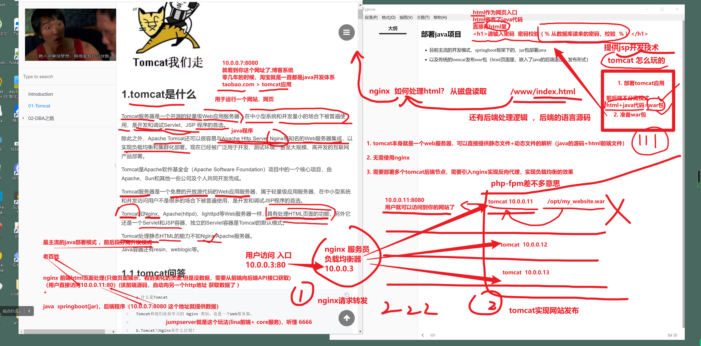


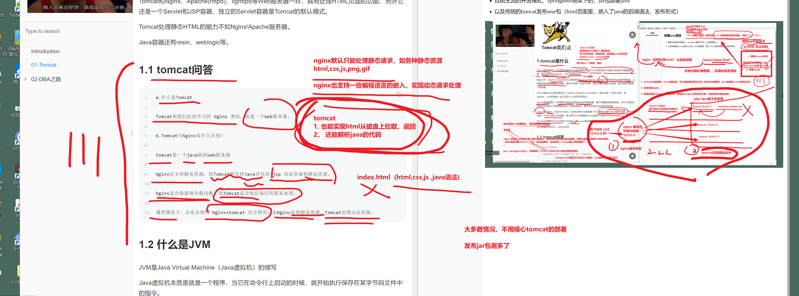


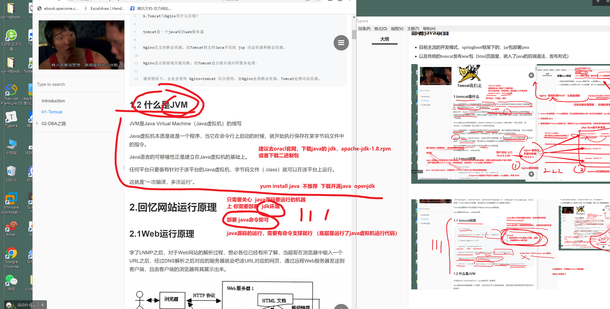


什么是tomcat，就是一个用于运行java程序的软件  ，发布模式，开发将源码打包，maven打包，生成  

hello_world.war（就是一个压缩包，前端代码，后后端代码）


```
运维只需要
安装tomcat

/opt/tomcat8/

将war包，放入tomcat目录下

自动解压缩
自动加载访问url


客户端，直接访问 10.0.0.11:8080/my_website/ 可以直接看到网站了

听懂1111


-=-------------------------
必须部署java开发环境

```


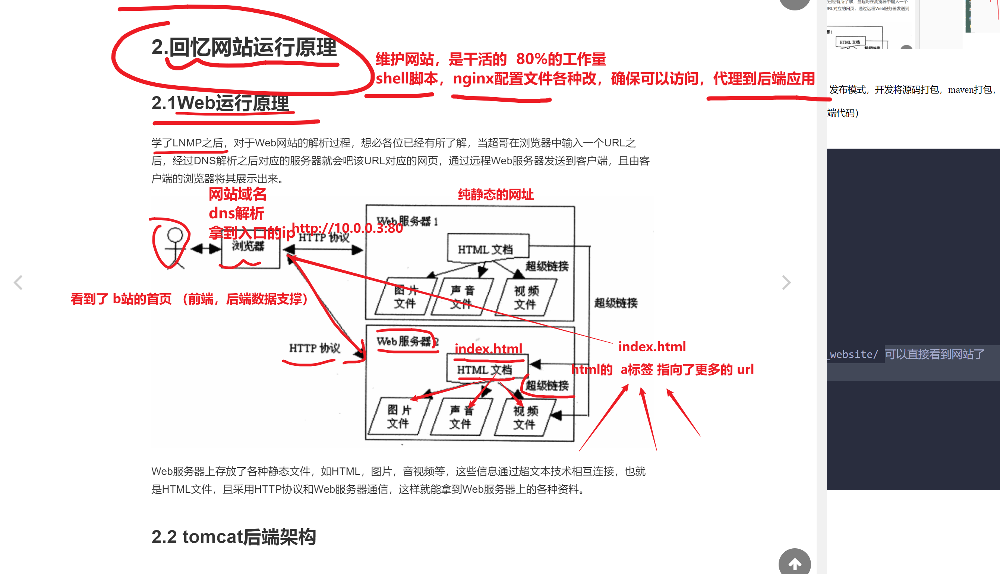


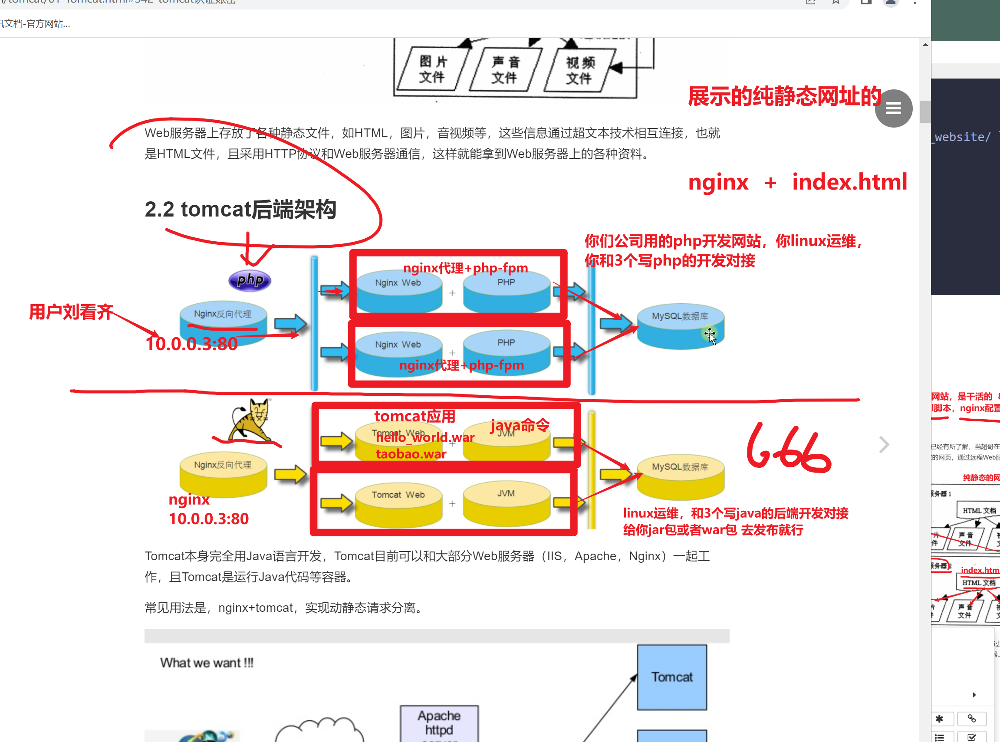


# tomcat+nginx动静态分离配置


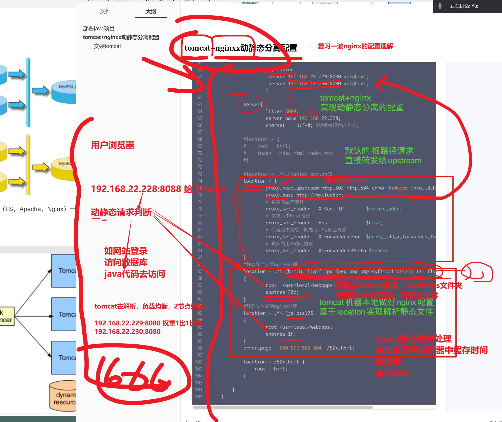

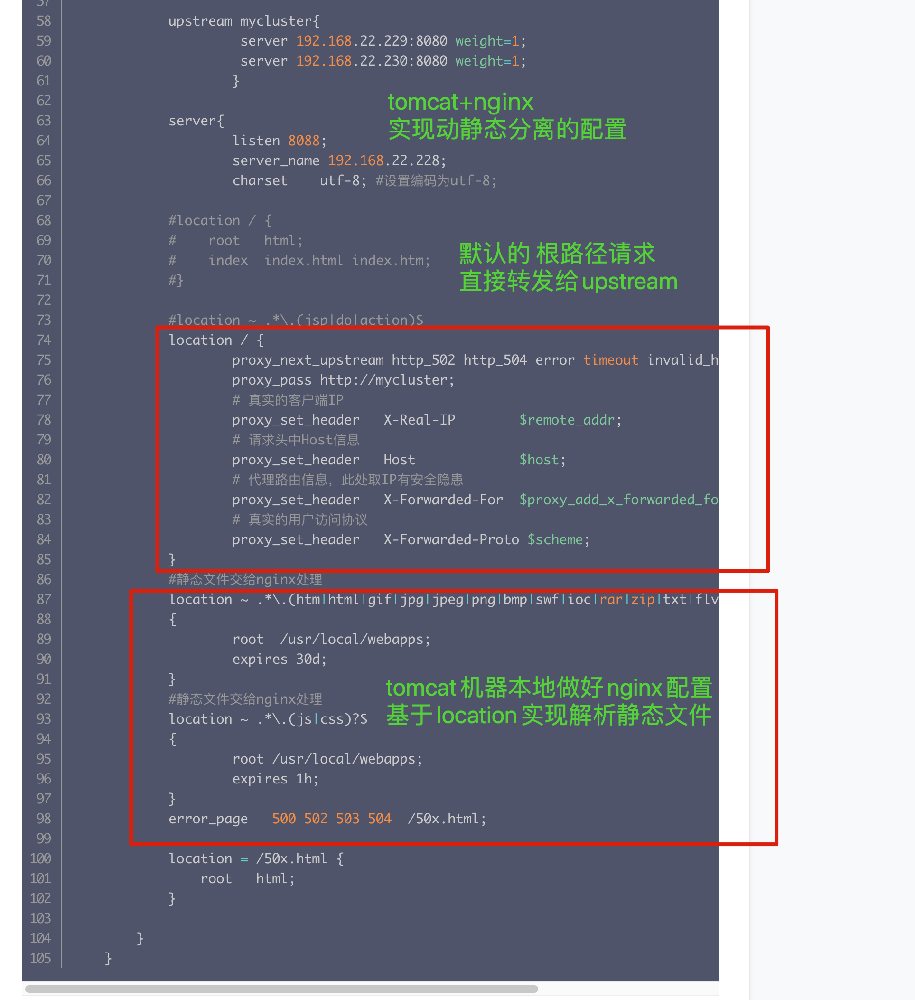


###  安装tomcat


必须得有java环境，安装jdk


## 安装jdk

10.0.0.10 部署tomcat

```
1. 可以oracle官网下载
http://www.oracle.com/technetwork/java/javase/downloads/index.html

2. 用老师准备好的包

apache-tomcat-8.0.27.tar.gz 

jdk-8u221-linux-x64.tar.gz


3. 配置jdk的环境变量，java会要求生成2特殊变量

JAVA_HOME jdk的家目录
CLASSPATH  java程序的类库目录路径，相对于JAVA_HOME而言的


[root@tomcat-10 /opt]#ll
total 199440
-rw-r--r-- 1 root root   9128610 Jul 16 15:21 apache-tomcat-8.0.27.tar.gz
drwxr-xr-x 7   10  143       245 Jul  4  2019 jdk1.8.0_221
-rw-r--r-- 1 root root 195094741 Jul 16 15:21 jdk-8u221-linux-x64.tar.gz


配置软连接


[root@tomcat-10 /opt]#ln -s  /opt/jdk1.8.0_221/  /opt/jdk8 
[root@tomcat-10 /opt]#
[root@tomcat-10 /opt]#
[root@tomcat-10 /opt]#ll
total 199440
-rw-r--r-- 1 root root   9128610 Jul 16 15:21 apache-tomcat-8.0.27.tar.gz
drwxr-xr-x 7   10  143       245 Jul  4  2019 jdk1.8.0_221
lrwxrwxrwx 1 root root        18 Jul 26 10:49 jdk8 -> /opt/jdk1.8.0_221/
-rw-r--r-- 1 root root 195094741 Jul 16 15:21 jdk-8u221-linux-x64.tar.gz
[root@tomcat-10 /opt]#
[root@tomcat-10 /opt]#
[root@tomcat-10 /opt]#java -version
java version "1.8.0_221"
Java(TM) SE Runtime Environment (build 1.8.0_221-b11)
Java HotSpot(TM) 64-Bit Server VM (build 25.221-b11, mixed mode)


# 忘记就回去看看，sed博客
# 等于在文件的最后一行，加入如下PATH设置

sed -i.ori '$a export JAVA_HOME=/opt/jdk8\nexport PATH=$JAVA_HOME/bin:$JAVA_HOME/jre/bin:$PATH\nexport CLASSPATH=.$CLASSPATH:$JAVA_HOME/lib:$JAVA_HOME/jre/lib:$JAVA_HOME/lib/tools.jar' /etc/profile


4. 检查java环境


```


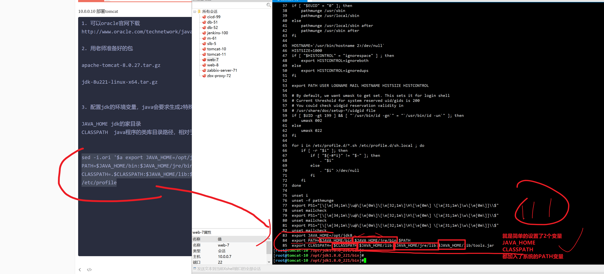


## 部署tomcat

```
[root@tomcat-10 /opt]#
[root@tomcat-10 /opt]#tar -zxf apache-tomcat-8.0.27.tar.gz 
[root@tomcat-10 /opt]#ll
total 199440
drwxr-xr-x 9 root root       160 Jul 26 10:50 apache-tomcat-8.0.27
-rw-r--r-- 1 root root   9128610 Jul 16 15:21 apache-tomcat-8.0.27.tar.gz
drwxr-xr-x 7   10  143       245 Jul  4  2019 jdk1.8.0_221
lrwxrwxrwx 1 root root        18 Jul 26 10:49 jdk8 -> /opt/jdk1.8.0_221/
-rw-r--r-- 1 root root 195094741 Jul 16 15:21 jdk-8u221-linux-x64.tar.gz
[root@tomcat-10 /opt]#
[root@tomcat-10 /opt]#
[root@tomcat-10 /opt]#
[root@tomcat-10 /opt]#
[root@tomcat-10 /opt]#ln -s /opt/apache-tomcat-8.0.27   /opt/tomcat8027
[root@tomcat-10 /opt]#
[root@tomcat-10 /opt]#
[root@tomcat-10 /opt]#ll
total 199440
drwxr-xr-x 9 root root       160 Jul 26 10:50 apache-tomcat-8.0.27
-rw-r--r-- 1 root root   9128610 Jul 16 15:21 apache-tomcat-8.0.27.tar.gz
drwxr-xr-x 7   10  143       245 Jul  4  2019 jdk1.8.0_221
lrwxrwxrwx 1 root root        18 Jul 26 10:49 jdk8 -> /opt/jdk1.8.0_221/
-rw-r--r-- 1 root root 195094741 Jul 16 15:21 jdk-8u221-linux-x64.tar.gz
lrwxrwxrwx 1 root root        25 Jul 26 10:51 tomcat8027 -> /opt/apache-tomcat-8.0.27


执行tomcat的脚本，检查版本，与环境是否正确

[root@tomcat-10 /opt]#ls /opt/tomcat8027/
bin  conf  lib  LICENSE  logs  NOTICE  RELEASE-NOTES  RUNNING.txt  temp  webapps  work


bin 存放tomcat脚本，启停脚本
conf tomcat的配置文件

logs 存放tomcat的运行日志

webapps war包往这里放就行


执行测试脚本

```

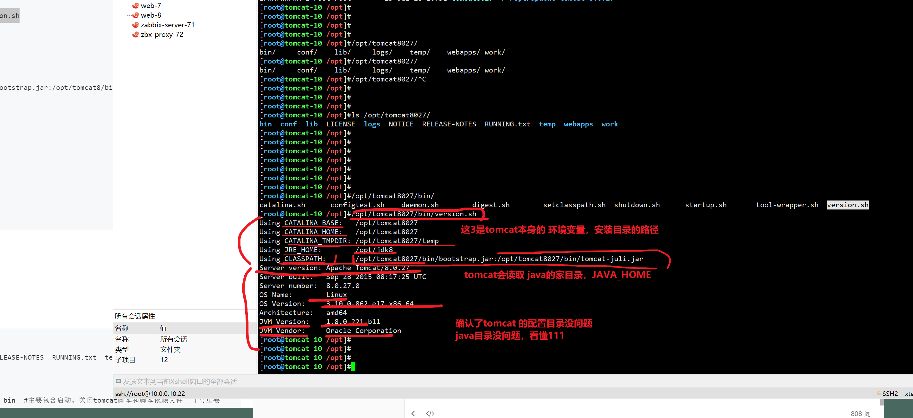


```

```


## 查看tomcat的安装目录，配置文件等

```
[root@tomcat-10 ~]#ls /opt/tomcat8/
bin  conf  lib  LICENSE  logs  NOTICE  RELEASE-NOTES  RUNNING.txt  temp  webapps  work


drwxr-xr-x 2 root root  4096 Aug  3 03:05 bin  #主要包含启动、关闭tomcat脚本和脚本依赖文件  非常重要
drwxr-xr-x 3 root root   198 Aug  3 03:05 conf #tomcat配置文件目录          非常重要
drwxr-xr-x 2 root root  4096 Aug  3 03:05 lib  #tomcat运行需要加载的jar包    非常重要
-rw-r--r-- 1 root root 57011 Sep 28  2015 LICENSE #license文件，不重要
drwxr-xr-x 2 root root   197 Aug  3 03:15 logs  #在运行过程中产生的日志文件   非常重要
-rw-r--r-- 1 root root  1444 Sep 28  2015 NOTICE #不重要
-rw-r--r-- 1 root root  6741 Sep 28  2015 RELEASE-NOTES #版本特性，不重要
-rw-r--r-- 1 root root 16204 Sep 28  2015 RUNNING.txt   #帮助文件，不重要
drwxr-xr-x 2 root root    30 Aug  3 03:05 temp    #存放临时文件
drwxr-xr-x 7 root root    81 Sep 28  2015 webapps #站点目录   非常重要
drwxr-xr-x 3 root root    22 Aug  3 03:05 work    #tomcat运行时产生的缓存文件

```


# 启动tomcat

```
调用自带的start脚本
[root@tomcat-10 /opt]#/opt/tomcat8027/bin/startup.sh 
Using CATALINA_BASE:   /opt/tomcat8027
Using CATALINA_HOME:   /opt/tomcat8027
Using CATALINA_TMPDIR: /opt/tomcat8027/temp
Using JRE_HOME:        /opt/jdk8
Using CLASSPATH:       /opt/tomcat8027/bin/bootstrap.jar:/opt/tomcat8027/bin/tomcat-juli.jar
Tomcat started.


```

查看tomcat的日志

```
[root@tomcat-10 ~]#tail -f /opt/tomcat8027/logs/catalina.out 
26-Jul-2022 11:14:11.283 INFO [localhost-startStop-1] org.apache.catalina.startup.HostConfig.deployDirectory Deployment of web application directory /opt/apache-tomcat-8.0.27/webapps/docs has finished in 11 ms
26-Jul-2022 11:14:11.283 INFO [localhost-startStop-1] org.apache.catalina.startup.HostConfig.deployDirectory Deploying web application directory /opt/apache-tomcat-8.0.27/webapps/examples
26-Jul-2022 11:14:11.439 INFO [localhost-startStop-1] org.apache.catalina.startup.HostConfig.deployDirectory Deployment of web application directory /opt/apache-tomcat-8.0.27/webapps/examples has finished in 156 ms
26-Jul-2022 11:14:11.439 INFO [localhost-startStop-1] org.apache.catalina.startup.HostConfig.deployDirectory Deploying web application directory /opt/apache-tomcat-8.0.27/webapps/host-manager
26-Jul-2022 11:14:11.449 INFO [localhost-startStop-1] org.apache.catalina.startup.HostConfig.deployDirectory Deployment of web application directory /opt/apache-tomcat-8.0.27/webapps/host-manager has finished in 10 ms
26-Jul-2022 11:14:11.449 INFO [localhost-startStop-1] org.apache.catalina.startup.HostConfig.deployDirectory Deploying web application directory /opt/apache-tomcat-8.0.27/webapps/manager
26-Jul-2022 11:14:11.459 INFO [localhost-startStop-1] org.apache.catalina.startup.HostConfig.deployDirectory Deployment of web application directory /opt/apache-tomcat-8.0.27/webapps/manager has finished in 9 ms
26-Jul-2022 11:14:11.460 INFO [main] org.apache.coyote.AbstractProtocol.start Starting ProtocolHandler ["http-nio-8080"]
26-Jul-2022 11:14:11.462 INFO [main] org.apache.coyote.AbstractProtocol.start Starting ProtocolHandler ["ajp-nio-8009"]
26-Jul-2022 11:14:11.467 INFO [main] org.apache.catalina.startup.Catalina.start Server startup in 350 ms


检查端口
[root@tomcat-10 /opt]#netstat -tunlp|grep java
tcp6       0      0 127.0.0.1:8005          :::*                    LISTEN      2429/java           
tcp6       0      0 :::8009                 :::*                    LISTEN      2429/java           
tcp6       0      0 :::8080                 :::*                    LISTEN      2429/java    

tomcat默认运行端口是 8080，再配置文件里定义 看一看就知道了


```


# 访问tomcat

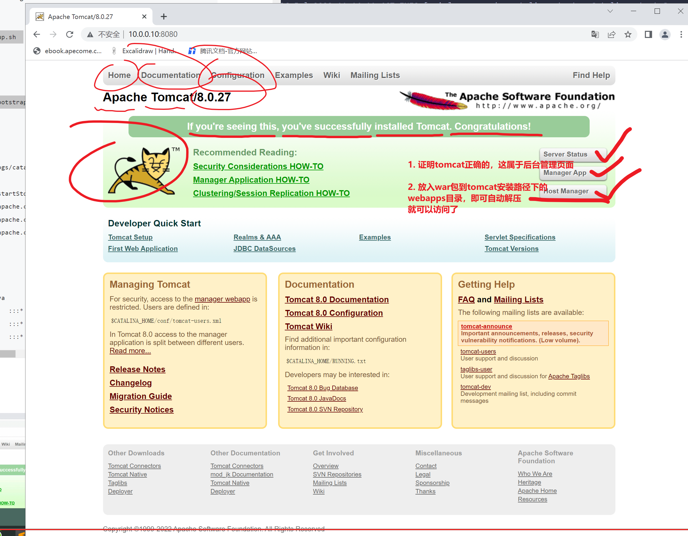


## 3.4.2 tomcat认证账密

tomcat默认提供的功能都需要设置账密认证，否则无法访问，默认没有账密。

如果需要开启这个功能，就需要配置管理用户，即配置tomcat-users.xml 文件。

```
tomcat是java的程序，配置文件，以xml格式居多，

传统的java开发模式
	和运维有关得的就是
	1. 拿到war包
	2. 配置文件也都是xml类型攫夺
		待会带你看这个格式怎么读


后期java新式的开发模式，对于运维的变化
	1. 拿到的jar包
	2. 配置文件以yaml文件绝对，java要链接mysql，该配置文件，yaml语法格式
		ansible playbook

两种风格的java项目，听懂111

```

修改tomcat的认证配置文件

```
[root@tomcat-10 /opt/tomcat8027/conf]#
[root@tomcat-10 /opt/tomcat8027/conf]#pwd
/opt/tomcat8027/conf
[root@tomcat-10 /opt/tomcat8027/conf]#
[root@tomcat-10 /opt/tomcat8027/conf]#
[root@tomcat-10 /opt/tomcat8027/conf]#ls
Catalina  catalina.policy  catalina.properties  context.xml  logging.properties  server.xml  tomcat-users.xml  tomcat-users.xsd  web.xml
[root@tomcat-10 /opt/tomcat8027/conf]#

修改配置文件，加入账户密码验证

 <role rolename="manager-gui"/>
 <role rolename="admin-gui"/>
 <user username="tomcat" password="linux0224" roles="manager-gui,admin-gui"/>


</tomcat-users>


重启tomcat
[root@tomcat-10 /opt/tomcat8027/bin]#
[root@tomcat-10 /opt/tomcat8027/bin]#./shutdown.sh 
Using CATALINA_BASE:   /opt/tomcat8027
Using CATALINA_HOME:   /opt/tomcat8027
Using CATALINA_TMPDIR: /opt/tomcat8027/temp
Using JRE_HOME:        /opt/jdk8
Using CLASSPATH:       /opt/tomcat8027/bin/bootstrap.jar:/opt/tomcat8027/bin/tomcat-juli.jar
[root@tomcat-10 /opt/tomcat8027/bin]#
[root@tomcat-10 /opt/tomcat8027/bin]#

[root@tomcat-10 /opt/tomcat8027/bin]#netstat -tunlp|grep 8080
[root@tomcat-10 /opt/tomcat8027/bin]#
[root@tomcat-10 /opt/tomcat8027/bin]#
[root@tomcat-10 /opt/tomcat8027/bin]#
[root@tomcat-10 /opt/tomcat8027/bin]#./startup.sh 
Using CATALINA_BASE:   /opt/tomcat8027
Using CATALINA_HOME:   /opt/tomcat8027
Using CATALINA_TMPDIR: /opt/tomcat8027/temp
Using JRE_HOME:        /opt/jdk8
Using CLASSPATH:       /opt/tomcat8027/bin/bootstrap.jar:/opt/tomcat8027/bin/tomcat-juli.jar
Tomcat started.
[root@tomcat-10 /opt/tomcat8027/bin]#
[root@tomcat-10 /opt/tomcat8027/bin]#
[root@tomcat-10 /opt/tomcat8027/bin]#netstat -tunlp|grep 8080
tcp6       0      0 :::8080                 :::*                    LISTEN      12254/java          
[root@tomcat-10 /opt/tomcat8027/bin]#
[root@tomcat-10 /opt/tomcat8027/bin]#

至此就重启完毕了

```

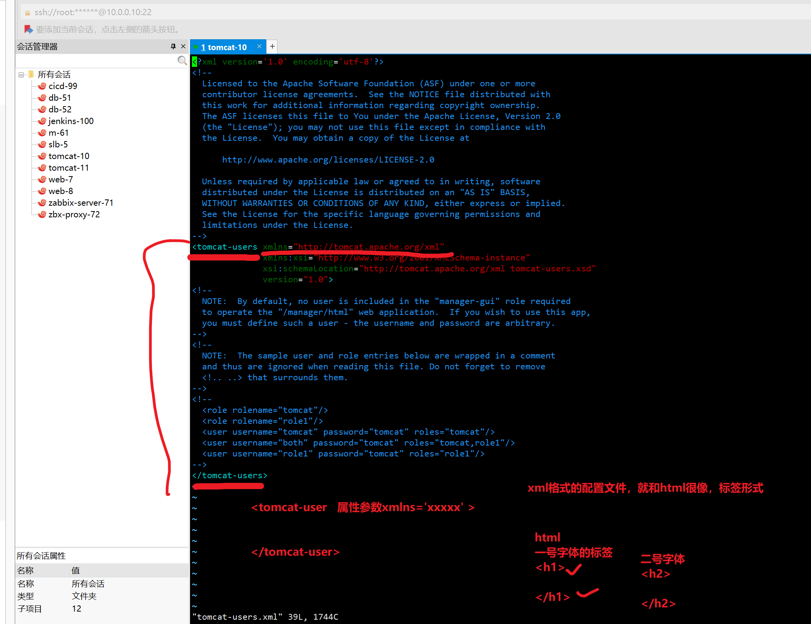


###  访问tomcat的应用，基于账户密码

```
tomcat
linux0224
```


## 3.5 图解tomcat配置文件

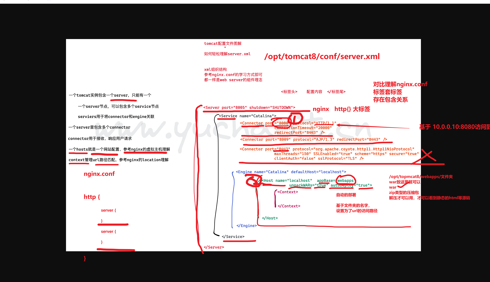


## 3.6 更多tomcat配置详解

```
官网文档资料
https://tomcat.apache.org/tomcat-8.0-doc/config/index.html

参考博客
https://www.cnblogs.com/kismetv/p/7228274.html#title6
```


# 4.tomcat部署java网站

## 4.1 war包部署

tomcat部署代码的方式有两种：

- 开发打包好的代码，直接放在webapps目录下
- 使用开发工具将程序打包成war包，再传到webapps目录下

jpress官网：[http://jpress.io](http://jpress.io/)

```
又是一个基于java 开发的 博客网站，

官网提供好了 war包，传统开发模式的博客

halo博客，halo新式框架 springboot 打包的jar包，部署更简单了


1. 准备好jpress.war 包


2. 放入tomcat的 webapps目录，查看效果


```

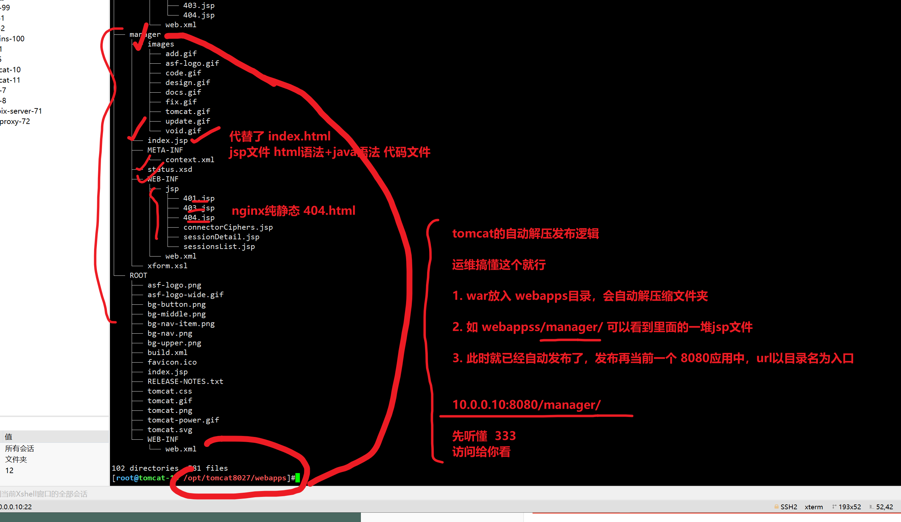


10.0.0.10:8080/manager


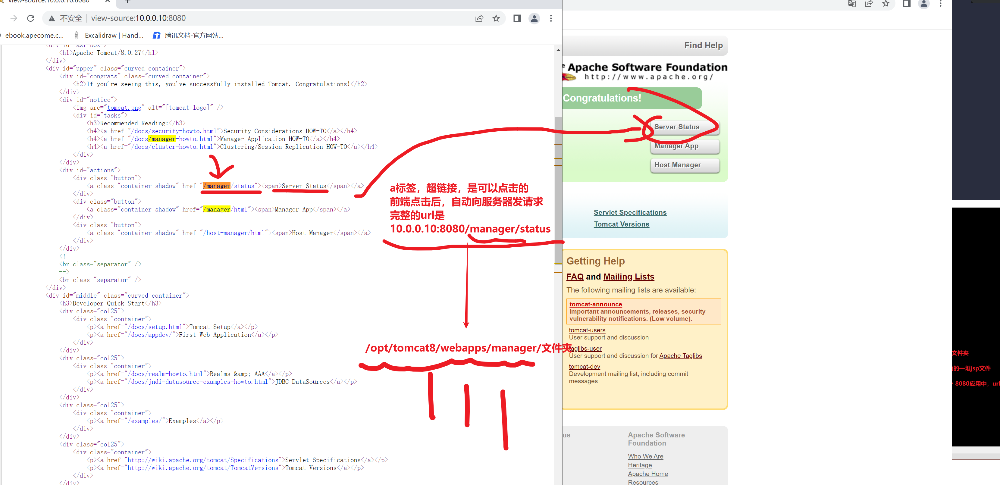


```
jpree到底怎么玩

1. 放入webapps目录，查看结果

2. 直接访问


```

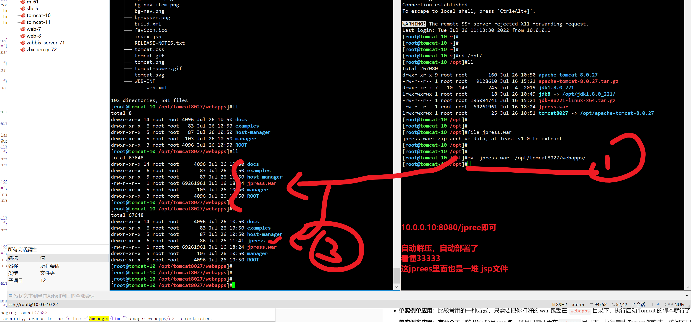


```
访问jpree网站，查看部署结果

需要数据库支持，可以链接远程的mysql服务器，注意远程授权
# 远程授权root，远程链接，密码是linux0224

# mysql -uroot -p 链接你db-51的数据库
#执行如下SQL，授权远程链接

# 账户密码，看清楚了

grant all privileges on *.* to root@'%' identified by 'linux02224';
flush privileges;

看懂1111


```

jpree安装设置数据库


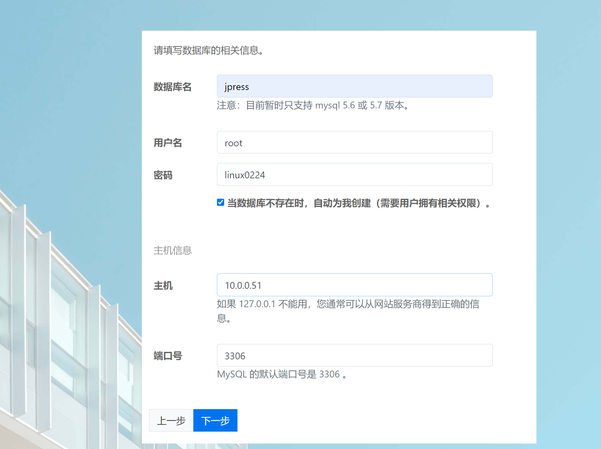


```
admin
admin

linux0224学war包部署linux0224学war包部署linux0224学war包部署linux0224学war包部署linux0224学war包部署linux0224学war包部署linux0224学war包部署


目前完成


准备好了

java开发的程序网站，jrepss，拿到war包源码  

2.运维需要操心，部署tomcat，放入jrepss到webapps目录


```


## 4.2 maven部署

```
jpreess官网也有些教程


1.下载源码
yum install git -y 

git clone https://gitee.com/JPressProjects/jpress.git


2. 部署maven，打包生成war包

部署jdk，maven环境

[root@tomcat-10 /opt]#ls
apache-maven-3.3.9-bin.tar.gz  apache-tomcat-8.0.27  apache-tomcat-8.0.27.tar.gz  jdk1.8.0_221  jdk8  jdk-8u221-linux-x64.tar.gz  jpress  tomcat8027
[root@tomcat-10 /opt]#


[root@tomcat-10 /opt/apache-maven-3.3.9/bin]#mvn -version
Apache Maven 3.3.9 (bb52d8502b132ec0a5a3f4c09453c07478323dc5; 2015-11-11T00:41:47+08:00)
Maven home: /opt/apache-maven-3.3.9
Java version: 1.8.0_221, vendor: Oracle Corporation
Java home: /opt/jdk1.8.0_221/jre
Default locale: en_US, platform encoding: UTF-8
OS name: "linux", version: "3.10.0-862.el7.x86_64", arch: "amd64", family: "unix"


3. 打包，部署

修改mvn源为阿里的

<mirror>
    	<id>
    	aliyunmaven
    	</id>
   	 <mirrorOf>
   	 	*
   	 </mirrorOf>
    <name>
    	阿里云公共仓库
    </name>
    <url>
    	https://maven.aliyun.com/repository/public
    </url>
</mirror>

#看懂xml  标签语法格式，1111


cd jpress
mvn clean package

查看生成的部署脚本，即可运行


4. 该java产品，提供了部署脚本


```

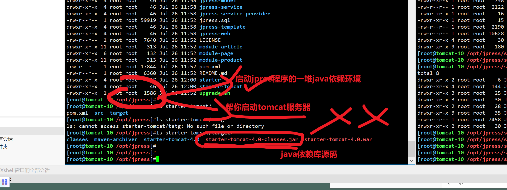


编辑shell脚本，修改博客进程启动方式

```
希望能部署在公网环境，对外提供访问

```

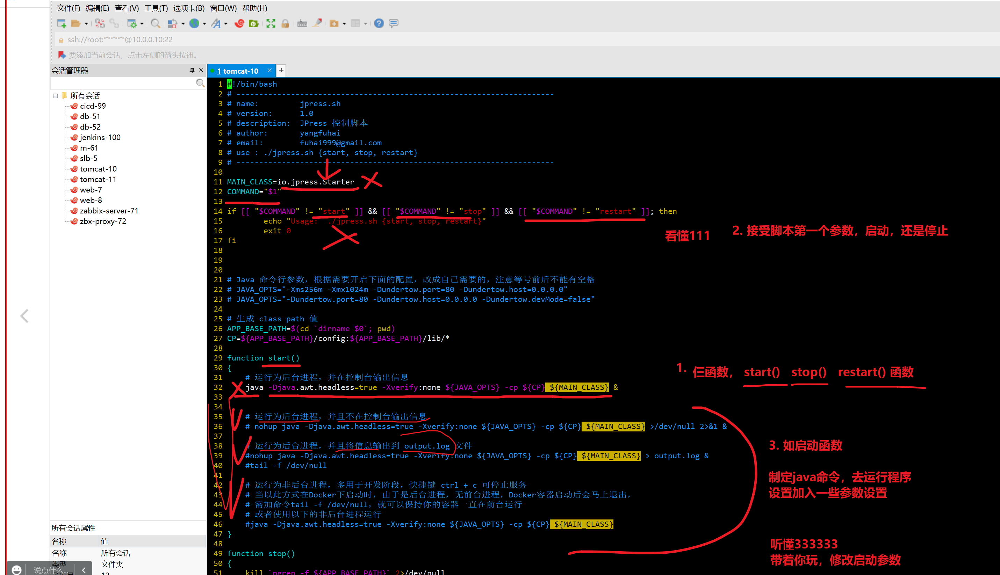

```


```


12.20继续


### 拍错解决

```
该jpress博客，生成的启动脚本，具体目录如下


这些信息，还是得开发告诉你，配置逻辑

当然我们自己也可以通过分析shell脚本，找到问题所在


```

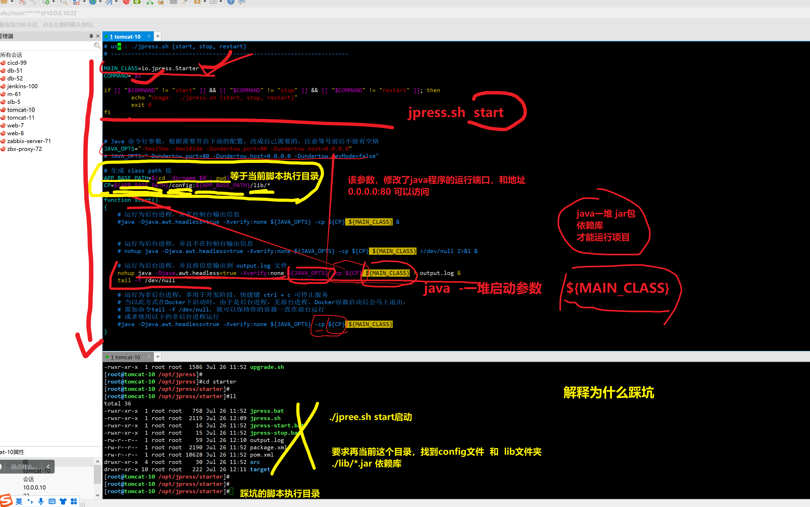


如何解决的额

进入一个正确的目录即可

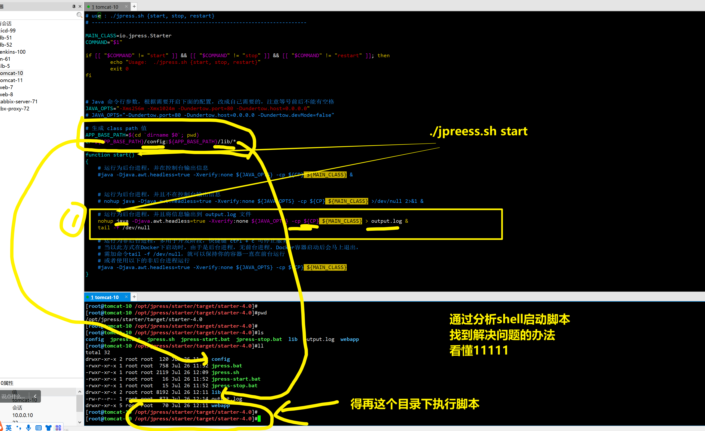

```
拍错完毕，修改shell脚本后，启动结果如下
[root@tomcat-10 /opt/jpress/starter/target/starter-4.0]#
[root@tomcat-10 /opt/jpress/starter/target/starter-4.0]#./jpress.sh start
nohup: redirecting stderr to stdout
Warning: Can not load properties file in classpath, file name: jboot.properties

  ____  ____    ___    ___   ______ 
 |    ||    \  /   \  /   \ |      |
 |__  ||  o  )|     ||     ||      |
 __|  ||     ||  O  ||  O  ||_|  |_|
/  |  ||  O  ||     ||     |  |  |  
\  `  ||     ||     ||     |  |  |  
 \____||_____| \___/  \___/   |__|  
                                    

JbootApplication { name='jboot', mode='dev', version='3.15.3', proxy='cglib', listener='*', listenerPackage='*' }
JbootApplication ClassPath: /opt/jpress/starter/target/starter-4.0/config/
Starting JFinal 5.0.0 -> http://0.0.0.0:80
Info: jfinal-undertow 3.0, undertow 2.2.17.Final, jvm 1.8.0_221
Jboot LoggerFactory: org.apache.logging.slf4j.Log4jLoggerFactory
Starting Complete in 1.2 seconds. Welcome To The JFinal World (^_^)

JbootResourceLoader started, Watched resource path name : webapp


```


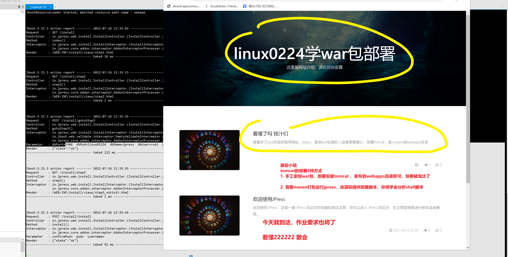


# 下午安排

- 完成上午所学tomcat的 部署。war包部署过程，maven部署jpress博客过程，梳理笔记，确保以后遇见java项目会跑
- 先看博客，完成tomcat多实例，nginx负载均衡的练习
- 学的快的就开始看DBA篇即可


# 5.tomcat多实例

通常，我们在同一台服务器上对 Tomcat 部署需求可以分为以下几种：单实例单应用，单实例多应用，多实例单应用，多实例多应用。

实例的概念可以理解为上面说的一个 Tomcat 目录。

- **单实例单应用**：比较常用的一种方式，只需要把你打好的 war 包丢在 `webapps`目录下，执行启动 Tomcat 的脚本就行了。
- **单实例多应用**：有两个不同的 Web 项目 war 包，还是只需要丢在`webapps`目录下，执行启动 Tomcat 的脚本，访问不同项目加上不同的虚拟目录。这种方式要慎用在生产环境，因为重启或挂掉 Tomcat 后会影响另外一个应用的访问。
- **多实例单应用**：多个 Tomcat 部署同一个项目，端口号不同，可以利用 Nginx 这么做负载均衡，当然意义不大。
- **多实例多应用**：多个 Tomcat 部署多个不同的项目。这种模式在服务器资源有限，或者对服务器要求并不是很高的情况下，可以实现多个不同项目部署在同一台服务器上的需求，来实现资源使用的最大化。-

这次其实要说的就是这种方式，但多个 Tomcat 就是简单的复制出一个新的 Tomcat 目录后改一下端口么？这样做也太 Low 了点吧？哈哈，其实并不是低端没技术含量的问题，当你同一台服务器部署了多个不同基于 Tomcat 的 Web 服务时，会迎来下面几个极其现实的问题。

- 当你需要对数十台 Tomcat 版本进行升级的时候，你需要怎么做？
- 当你需要针对每一个不同的 Web 服务分配不用的内存时，你需要怎么做？
- 当你需要启动多台服务器时，你需要怎么做？

当然，好像上面的都不是很重要，注意，划重点，多实例部署最大作用就是最大化利用服务器资源。

## 5.1 部署架构


## 5.2 部署流程

### 1.复制出两个 Tomcat 实例


### 2. 创建2个实例的管理脚本

依然是在 Tomcat 安装路径的同一级目录下，新建两个`tomcat-shell`文件夹，用于存放启动和停止脚本，同时赋予文件全部权限。

创建脚本


### 3.最终目录结构


### 4.配置多示例的配置文件


### 5.启动俩tomcat实例


### 6.访问俩tomcat实例


# 6.nginx+tomcat多实例负载均衡


## 1.主要要重新解压jpress.war到webapps，重启tomcat即可


## 2.nginx设置


## 3.访问hello.html测试


## 4.jpress负载均衡


# 7.zabbix监控tomcat

Java虚拟机(JVM)具有内置的插装，使您能够使用JMX监视和管理它。

您还可以使用JMX监视工具化的应用程序。


## 7.1 tomcat监控


## 7.2 zabbix-server设置

zabbix想要监控tomcat，需要借助于zabbix-java-gateway工具


## 7.3 页面添加监控


## 7.4 手动采集tomcat实例运行数据


## 7.5 确认调通了


