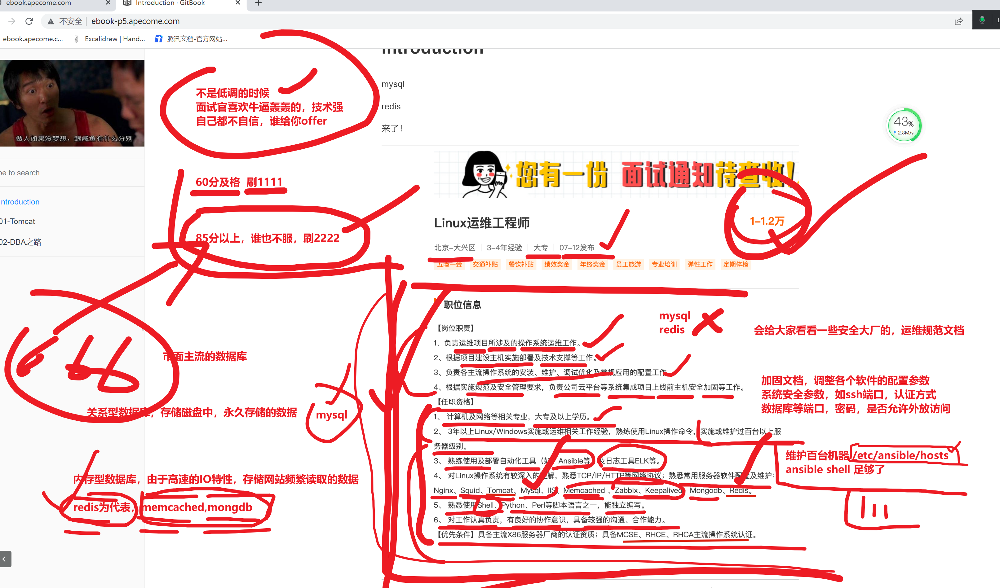
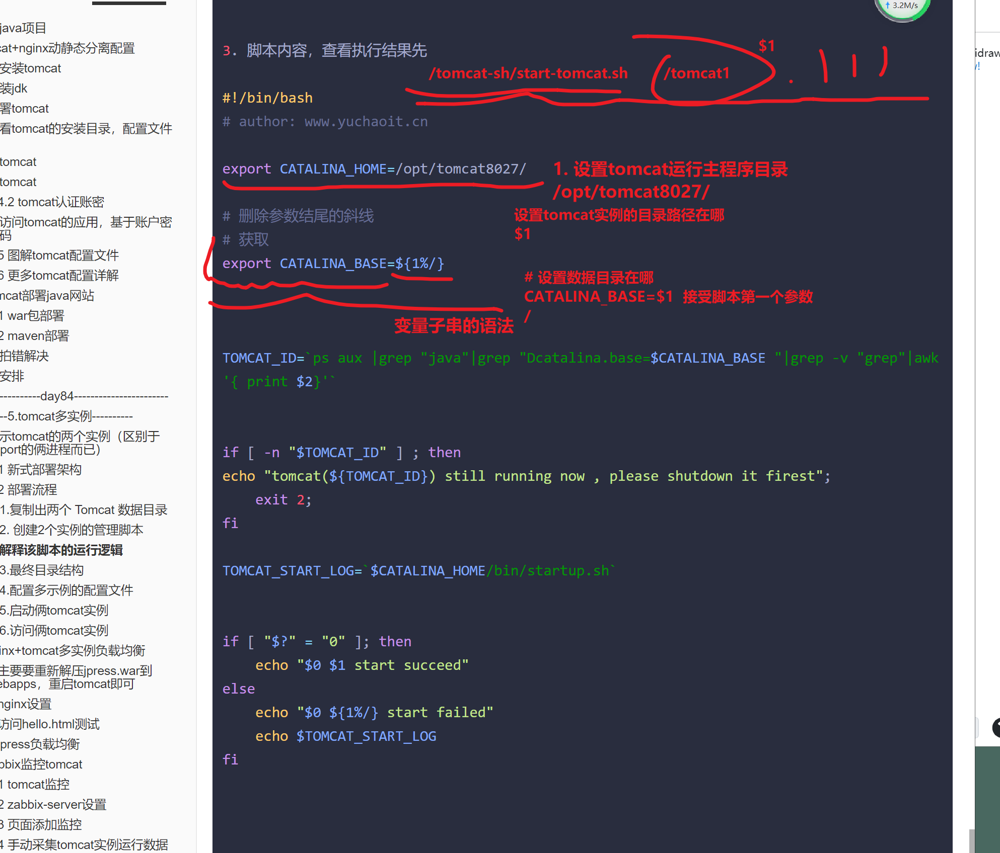
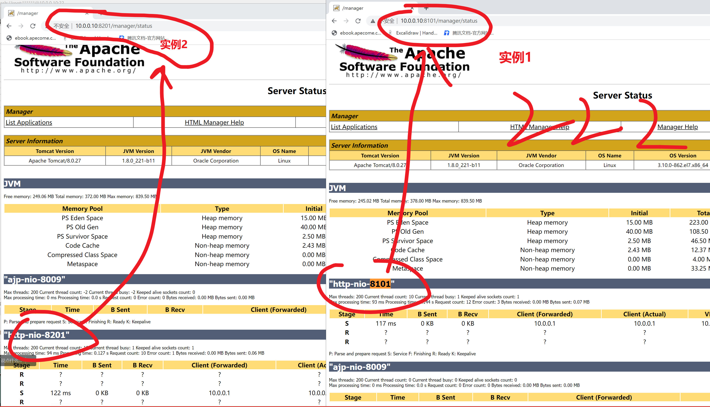
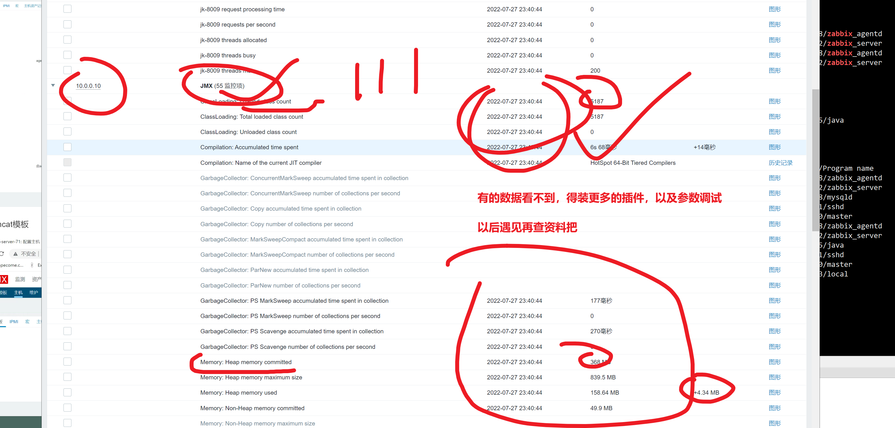

```### 此资源由 58学课资源站 收集整理 ###
	想要获取完整课件资料 请访问：58xueke.com
	百万资源 畅享学习

```
# 部署java项目

- 目前主流的开发模式，springboot框架下的，jar包部署java
- 以及传统的tomcat发布war包（html页面里，嵌入了java的后端语法，发布形式）


什么是tomcat，就是一个用于运行java程序的软件  ，发布模式，开发将源码打包，maven打包，生成  

hello_world.war（就是一个压缩包，前端代码，后后端代码）


```
运维只需要
安装tomcat

/opt/tomcat8/

将war包，放入tomcat目录下

自动解压缩
自动加载访问url


客户端，直接访问 10.0.0.11:8080/my_website/ 可以直接看到网站了

听懂1111


-=-------------------------
必须部署java开发环境

```


# tomcat+nginx动静态分离配置


###  安装tomcat


必须得有java环境，安装jdk


## 安装jdk

10.0.0.10 部署tomcat

```
1. 可以oracle官网下载
http://www.oracle.com/technetwork/java/javase/downloads/index.html

2. 用老师准备好的包

apache-tomcat-8.0.27.tar.gz 

jdk-8u221-linux-x64.tar.gz


3. 配置jdk的环境变量，java会要求生成2特殊变量

JAVA_HOME jdk的家目录
CLASSPATH  java程序的类库目录路径，相对于JAVA_HOME而言的


[root@tomcat-10 /opt]#ll
total 199440
-rw-r--r-- 1 root root   9128610 Jul 16 15:21 apache-tomcat-8.0.27.tar.gz
drwxr-xr-x 7   10  143       245 Jul  4  2019 jdk1.8.0_221
-rw-r--r-- 1 root root 195094741 Jul 16 15:21 jdk-8u221-linux-x64.tar.gz


配置软连接


[root@tomcat-10 /opt]#ln -s  /opt/jdk1.8.0_221/  /opt/jdk8 
[root@tomcat-10 /opt]#
[root@tomcat-10 /opt]#
[root@tomcat-10 /opt]#ll
total 199440
-rw-r--r-- 1 root root   9128610 Jul 16 15:21 apache-tomcat-8.0.27.tar.gz
drwxr-xr-x 7   10  143       245 Jul  4  2019 jdk1.8.0_221
lrwxrwxrwx 1 root root        18 Jul 26 10:49 jdk8 -> /opt/jdk1.8.0_221/
-rw-r--r-- 1 root root 195094741 Jul 16 15:21 jdk-8u221-linux-x64.tar.gz
[root@tomcat-10 /opt]#
[root@tomcat-10 /opt]#
[root@tomcat-10 /opt]#java -version
java version "1.8.0_221"
Java(TM) SE Runtime Environment (build 1.8.0_221-b11)
Java HotSpot(TM) 64-Bit Server VM (build 25.221-b11, mixed mode)


# 忘记就回去看看，sed博客
# 等于在文件的最后一行，加入如下PATH设置

sed -i.ori '$a export JAVA_HOME=/opt/jdk8\nexport PATH=$JAVA_HOME/bin:$JAVA_HOME/jre/bin:$PATH\nexport CLASSPATH=.$CLASSPATH:$JAVA_HOME/lib:$JAVA_HOME/jre/lib:$JAVA_HOME/lib/tools.jar' /etc/profile


4. 检查java环境


```


## 部署tomcat

```
[root@tomcat-10 /opt]#
[root@tomcat-10 /opt]#tar -zxf apache-tomcat-8.0.27.tar.gz 
[root@tomcat-10 /opt]#ll
total 199440
drwxr-xr-x 9 root root       160 Jul 26 10:50 apache-tomcat-8.0.27
-rw-r--r-- 1 root root   9128610 Jul 16 15:21 apache-tomcat-8.0.27.tar.gz
drwxr-xr-x 7   10  143       245 Jul  4  2019 jdk1.8.0_221
lrwxrwxrwx 1 root root        18 Jul 26 10:49 jdk8 -> /opt/jdk1.8.0_221/
-rw-r--r-- 1 root root 195094741 Jul 16 15:21 jdk-8u221-linux-x64.tar.gz
[root@tomcat-10 /opt]#
[root@tomcat-10 /opt]#
[root@tomcat-10 /opt]#
[root@tomcat-10 /opt]#
[root@tomcat-10 /opt]#ln -s /opt/apache-tomcat-8.0.27   /opt/tomcat8027
[root@tomcat-10 /opt]#
[root@tomcat-10 /opt]#
[root@tomcat-10 /opt]#ll
total 199440
drwxr-xr-x 9 root root       160 Jul 26 10:50 apache-tomcat-8.0.27
-rw-r--r-- 1 root root   9128610 Jul 16 15:21 apache-tomcat-8.0.27.tar.gz
drwxr-xr-x 7   10  143       245 Jul  4  2019 jdk1.8.0_221
lrwxrwxrwx 1 root root        18 Jul 26 10:49 jdk8 -> /opt/jdk1.8.0_221/
-rw-r--r-- 1 root root 195094741 Jul 16 15:21 jdk-8u221-linux-x64.tar.gz
lrwxrwxrwx 1 root root        25 Jul 26 10:51 tomcat8027 -> /opt/apache-tomcat-8.0.27


执行tomcat的脚本，检查版本，与环境是否正确

[root@tomcat-10 /opt]#ls /opt/tomcat8027/
bin  conf  lib  LICENSE  logs  NOTICE  RELEASE-NOTES  RUNNING.txt  temp  webapps  work


bin 存放tomcat脚本，启停脚本
conf tomcat的配置文件

logs 存放tomcat的运行日志

webapps war包往这里放就行


执行测试脚本

```


```

```


## 查看tomcat的安装目录，配置文件等

```
[root@tomcat-10 ~]#ls /opt/tomcat8/
bin  conf  lib  LICENSE  logs  NOTICE  RELEASE-NOTES  RUNNING.txt  temp  webapps  work


drwxr-xr-x 2 root root  4096 Aug  3 03:05 bin  #主要包含启动、关闭tomcat脚本和脚本依赖文件  非常重要
drwxr-xr-x 3 root root   198 Aug  3 03:05 conf #tomcat配置文件目录          非常重要
drwxr-xr-x 2 root root  4096 Aug  3 03:05 lib  #tomcat运行需要加载的jar包    非常重要
-rw-r--r-- 1 root root 57011 Sep 28  2015 LICENSE #license文件，不重要
drwxr-xr-x 2 root root   197 Aug  3 03:15 logs  #在运行过程中产生的日志文件   非常重要
-rw-r--r-- 1 root root  1444 Sep 28  2015 NOTICE #不重要
-rw-r--r-- 1 root root  6741 Sep 28  2015 RELEASE-NOTES #版本特性，不重要
-rw-r--r-- 1 root root 16204 Sep 28  2015 RUNNING.txt   #帮助文件，不重要
drwxr-xr-x 2 root root    30 Aug  3 03:05 temp    #存放临时文件
drwxr-xr-x 7 root root    81 Sep 28  2015 webapps #站点目录   非常重要
drwxr-xr-x 3 root root    22 Aug  3 03:05 work    #tomcat运行时产生的缓存文件

```


# 启动tomcat

```
调用自带的start脚本
[root@tomcat-10 /opt]#/opt/tomcat8027/bin/startup.sh 
Using CATALINA_BASE:   /opt/tomcat8027
Using CATALINA_HOME:   /opt/tomcat8027
Using CATALINA_TMPDIR: /opt/tomcat8027/temp
Using JRE_HOME:        /opt/jdk8
Using CLASSPATH:       /opt/tomcat8027/bin/bootstrap.jar:/opt/tomcat8027/bin/tomcat-juli.jar
Tomcat started.


```

查看tomcat的日志

```
[root@tomcat-10 ~]#tail -f /opt/tomcat8027/logs/catalina.out 
26-Jul-2022 11:14:11.283 INFO [localhost-startStop-1] org.apache.catalina.startup.HostConfig.deployDirectory Deployment of web application directory /opt/apache-tomcat-8.0.27/webapps/docs has finished in 11 ms
26-Jul-2022 11:14:11.283 INFO [localhost-startStop-1] org.apache.catalina.startup.HostConfig.deployDirectory Deploying web application directory /opt/apache-tomcat-8.0.27/webapps/examples
26-Jul-2022 11:14:11.439 INFO [localhost-startStop-1] org.apache.catalina.startup.HostConfig.deployDirectory Deployment of web application directory /opt/apache-tomcat-8.0.27/webapps/examples has finished in 156 ms
26-Jul-2022 11:14:11.439 INFO [localhost-startStop-1] org.apache.catalina.startup.HostConfig.deployDirectory Deploying web application directory /opt/apache-tomcat-8.0.27/webapps/host-manager
26-Jul-2022 11:14:11.449 INFO [localhost-startStop-1] org.apache.catalina.startup.HostConfig.deployDirectory Deployment of web application directory /opt/apache-tomcat-8.0.27/webapps/host-manager has finished in 10 ms
26-Jul-2022 11:14:11.449 INFO [localhost-startStop-1] org.apache.catalina.startup.HostConfig.deployDirectory Deploying web application directory /opt/apache-tomcat-8.0.27/webapps/manager
26-Jul-2022 11:14:11.459 INFO [localhost-startStop-1] org.apache.catalina.startup.HostConfig.deployDirectory Deployment of web application directory /opt/apache-tomcat-8.0.27/webapps/manager has finished in 9 ms
26-Jul-2022 11:14:11.460 INFO [main] org.apache.coyote.AbstractProtocol.start Starting ProtocolHandler ["http-nio-8080"]
26-Jul-2022 11:14:11.462 INFO [main] org.apache.coyote.AbstractProtocol.start Starting ProtocolHandler ["ajp-nio-8009"]
26-Jul-2022 11:14:11.467 INFO [main] org.apache.catalina.startup.Catalina.start Server startup in 350 ms


检查端口
[root@tomcat-10 /opt]#netstat -tunlp|grep java
tcp6       0      0 127.0.0.1:8005          :::*                    LISTEN      2429/java           
tcp6       0      0 :::8009                 :::*                    LISTEN      2429/java           
tcp6       0      0 :::8080                 :::*                    LISTEN      2429/java    

tomcat默认运行端口是 8080，再配置文件里定义 看一看就知道了


```


# 访问tomcat


## 3.4.2 tomcat认证账密

tomcat默认提供的功能都需要设置账密认证，否则无法访问，默认没有账密。

如果需要开启这个功能，就需要配置管理用户，即配置tomcat-users.xml 文件。

```
tomcat是java的程序，配置文件，以xml格式居多，

传统的java开发模式
	和运维有关得的就是
	1. 拿到war包
	2. 配置文件也都是xml类型攫夺
		待会带你看这个格式怎么读


后期java新式的开发模式，对于运维的变化
	1. 拿到的jar包
	2. 配置文件以yaml文件绝对，java要链接mysql，该配置文件，yaml语法格式
		ansible playbook

两种风格的java项目，听懂111

```

修改tomcat的认证配置文件

```
[root@tomcat-10 /opt/tomcat8027/conf]#
[root@tomcat-10 /opt/tomcat8027/conf]#pwd
/opt/tomcat8027/conf
[root@tomcat-10 /opt/tomcat8027/conf]#
[root@tomcat-10 /opt/tomcat8027/conf]#
[root@tomcat-10 /opt/tomcat8027/conf]#ls
Catalina  catalina.policy  catalina.properties  context.xml  logging.properties  server.xml  tomcat-users.xml  tomcat-users.xsd  web.xml
[root@tomcat-10 /opt/tomcat8027/conf]#

修改配置文件，加入账户密码验证

 <role rolename="manager-gui"/>
 <role rolename="admin-gui"/>
 <user username="tomcat" password="linux0224" roles="manager-gui,admin-gui"/>


</tomcat-users>


重启tomcat
[root@tomcat-10 /opt/tomcat8027/bin]#
[root@tomcat-10 /opt/tomcat8027/bin]#./shutdown.sh 
Using CATALINA_BASE:   /opt/tomcat8027
Using CATALINA_HOME:   /opt/tomcat8027
Using CATALINA_TMPDIR: /opt/tomcat8027/temp
Using JRE_HOME:        /opt/jdk8
Using CLASSPATH:       /opt/tomcat8027/bin/bootstrap.jar:/opt/tomcat8027/bin/tomcat-juli.jar
[root@tomcat-10 /opt/tomcat8027/bin]#
[root@tomcat-10 /opt/tomcat8027/bin]#

[root@tomcat-10 /opt/tomcat8027/bin]#netstat -tunlp|grep 8080
[root@tomcat-10 /opt/tomcat8027/bin]#
[root@tomcat-10 /opt/tomcat8027/bin]#
[root@tomcat-10 /opt/tomcat8027/bin]#
[root@tomcat-10 /opt/tomcat8027/bin]#./startup.sh 
Using CATALINA_BASE:   /opt/tomcat8027
Using CATALINA_HOME:   /opt/tomcat8027
Using CATALINA_TMPDIR: /opt/tomcat8027/temp
Using JRE_HOME:        /opt/jdk8
Using CLASSPATH:       /opt/tomcat8027/bin/bootstrap.jar:/opt/tomcat8027/bin/tomcat-juli.jar
Tomcat started.
[root@tomcat-10 /opt/tomcat8027/bin]#
[root@tomcat-10 /opt/tomcat8027/bin]#
[root@tomcat-10 /opt/tomcat8027/bin]#netstat -tunlp|grep 8080
tcp6       0      0 :::8080                 :::*                    LISTEN      12254/java          
[root@tomcat-10 /opt/tomcat8027/bin]#
[root@tomcat-10 /opt/tomcat8027/bin]#

至此就重启完毕了

```


###  访问tomcat的应用，基于账户密码

```
tomcat
linux0224
```


## 3.5 图解tomcat配置文件


## 3.6 更多tomcat配置详解

```
官网文档资料
https://tomcat.apache.org/tomcat-8.0-doc/config/index.html

参考博客
https://www.cnblogs.com/kismetv/p/7228274.html#title6
```


# 4.tomcat部署java网站

## 4.1 war包部署

tomcat部署代码的方式有两种：

- 开发打包好的代码，直接放在webapps目录下
- 使用开发工具将程序打包成war包，再传到webapps目录下

jpress官网：[http://jpress.io](http://jpress.io/)

```
又是一个基于java 开发的 博客网站，

官网提供好了 war包，传统开发模式的博客

halo博客，halo新式框架 springboot 打包的jar包，部署更简单了


1. 准备好jpress.war 包


2. 放入tomcat的 webapps目录，查看效果


```


10.0.0.10:8080/manager


```
jpree到底怎么玩

1. 放入webapps目录，查看结果

2. 直接访问


```


```
访问jpree网站，查看部署结果

需要数据库支持，可以链接远程的mysql服务器，注意远程授权
# 远程授权root，远程链接，密码是linux0224

# mysql -uroot -p 链接你db-51的数据库
#执行如下SQL，授权远程链接

# 账户密码，看清楚了

grant all privileges on *.* to root@'%' identified by 'linux02224';
flush privileges;

看懂1111


```

jpree安装设置数据库


```
admin
admin

linux0224学war包部署linux0224学war包部署linux0224学war包部署linux0224学war包部署linux0224学war包部署linux0224学war包部署linux0224学war包部署


目前完成


准备好了

java开发的程序网站，jrepss，拿到war包源码  

2.运维需要操心，部署tomcat，放入jrepss到webapps目录


```


## 4.2 maven部署

```
jpreess官网也有些教程


1.下载源码
yum install git -y 

git clone https://gitee.com/JPressProjects/jpress.git


2. 部署maven，打包生成war包

部署jdk，maven环境

[root@tomcat-10 /opt]#ls
apache-maven-3.3.9-bin.tar.gz  apache-tomcat-8.0.27  apache-tomcat-8.0.27.tar.gz  jdk1.8.0_221  jdk8  jdk-8u221-linux-x64.tar.gz  jpress  tomcat8027
[root@tomcat-10 /opt]#


[root@tomcat-10 /opt/apache-maven-3.3.9/bin]#mvn -version
Apache Maven 3.3.9 (bb52d8502b132ec0a5a3f4c09453c07478323dc5; 2015-11-11T00:41:47+08:00)
Maven home: /opt/apache-maven-3.3.9
Java version: 1.8.0_221, vendor: Oracle Corporation
Java home: /opt/jdk1.8.0_221/jre
Default locale: en_US, platform encoding: UTF-8
OS name: "linux", version: "3.10.0-862.el7.x86_64", arch: "amd64", family: "unix"


3. 打包，部署

修改mvn源为阿里的

<mirror>
    	<id>
    	aliyunmaven
    	</id>
   	 <mirrorOf>
   	 	*
   	 </mirrorOf>
    <name>
    	阿里云公共仓库
    </name>
    <url>
    	https://maven.aliyun.com/repository/public
    </url>
</mirror>

#看懂xml  标签语法格式，1111


cd jpress
mvn clean package

查看生成的部署脚本，即可运行


4. 该java产品，提供了部署脚本


```


编辑shell脚本，修改博客进程启动方式

```
希望能部署在公网环境，对外提供访问

```


```


```


12.20继续


### 拍错解决

```
该jpress博客，生成的启动脚本，具体目录如下


这些信息，还是得开发告诉你，配置逻辑

当然我们自己也可以通过分析shell脚本，找到问题所在


```


如何解决的额

进入一个正确的目录即可


```
拍错完毕，修改shell脚本后，启动结果如下
[root@tomcat-10 /opt/jpress/starter/target/starter-4.0]#
[root@tomcat-10 /opt/jpress/starter/target/starter-4.0]#./jpress.sh start
nohup: redirecting stderr to stdout
Warning: Can not load properties file in classpath, file name: jboot.properties

  ____  ____    ___    ___   ______ 
 |    ||    \  /   \  /   \ |      |
 |__  ||  o  )|     ||     ||      |
 __|  ||     ||  O  ||  O  ||_|  |_|
/  |  ||  O  ||     ||     |  |  |  
\  `  ||     ||     ||     |  |  |  
 \____||_____| \___/  \___/   |__|  
                                    

JbootApplication { name='jboot', mode='dev', version='3.15.3', proxy='cglib', listener='*', listenerPackage='*' }
JbootApplication ClassPath: /opt/jpress/starter/target/starter-4.0/config/
Starting JFinal 5.0.0 -> http://0.0.0.0:80
Info: jfinal-undertow 3.0, undertow 2.2.17.Final, jvm 1.8.0_221
Jboot LoggerFactory: org.apache.logging.slf4j.Log4jLoggerFactory
Starting Complete in 1.2 seconds. Welcome To The JFinal World (^_^)

JbootResourceLoader started, Watched resource path name : webapp


```


# 下午安排

- 完成上午所学tomcat的 部署。war包部署过程，maven部署jpress博客过程，梳理笔记，确保以后遇见java项目会跑
- 先看博客，完成tomcat多实例，nginx负载均衡的练习
- 学的快的就开始看DBA篇即可


# ----------------day84-----------------------

又是美好的一天，画面没问题 刷个 111





# --------5.tomcat多实例----------

```
实例，具体的个体

```


通常，我们在同一台服务器上对 Tomcat 部署需求可以分为以下几种：

单实例，单应用

单实例，多应用

多实例，单应用

多实例，多应用。

```
一个实例，就是一个完整的软件，


安装目录+数据目录

```


```
单实例，也就是上述所说的，  

二进制命令 +  数据目录 ====一个实例，tomcat实例，mysql实例

mysqld启动命令 +  mysql数据库所有数据==========mysql 单实例

理解单实例刷1111


多实例是什么？
有多份这个软件目录嘛。


tomcat部署
实例1： /opt/apache-tomcat-8.0.27

实例2： 

```


## 演示tomcat的两个实例（区别于ip:port的俩进程而已）

```
多实例的作用，可以让你再一个机器上，运行多个单独的数据目录

如 实例1，去运行一个jpress网站，实例1的进程id ：   16544


/opt/apache-tomcat-8.0.27/  
[root@tomcat-10 /opt/apache-tomcat-8.0.27/webapps/jpress]#netstat -tunlp|grep 8080
tcp6       0      0 :::8080                 :::*                    LISTEN      16544/java    


实例2，就是一个完整的tomcat目录，区别于ip:port就行，当然进程也就不一样了

修改server.xml 区别端口即可
修改 connector连接器端口，以及server 实例端口，就用于启停tomcat的作用


[root@tomcat-10 /tomcat-2/apache-tomcat-8.0.27/webapps]##确认实例2的tomcat，需要修改2个配置，确保是独立的tomcat
[root@tomcat-10 /tomcat-2/apache-tomcat-8.0.27/webapps]#
[root@tomcat-10 /tomcat-2/apache-tomcat-8.0.27/webapps]#grep -E '8224|8006'  ../conf/server.xml 
<Server port="8006" shutdown="SHUTDOWN">
    <Connector port="8224" protocol="HTTP/1.1"


再跑一个网站，jpree做练习


```


实例的概念可以理解为上面说的一个 Tomcat 目录。

- **单实例单应用**：比较常用的一种方式，只需要把你打好的 war 包丢在 `webapps`目录下，执行启动 Tomcat 的脚本就行了。
- **单实例多应用**：有两个不同的 Web 项目 war 包，还是只需要丢在`webapps`目录下，执行启动 Tomcat 的脚本，访问不同项目加上不同的虚拟目录。这种方式要慎用在生产环境，因为重启或挂掉 Tomcat 后会影响另外一个应用的访问。
- **多实例单应用**：多个 Tomcat 部署同一个项目，端口号不同，可以利用 Nginx 这么做负载均衡，当然意义不大。
- **多实例多应用**：多个 Tomcat 部署多个不同的项目。这种模式在服务器资源有限，或者对服务器要求并不是很高的情况下，可以实现多个不同项目部署在同一台服务器上的需求，来实现资源使用的最大化。-

这次其实要说的就是这种方式，但多个 Tomcat 就是简单的复制出一个新的 Tomcat 目录后改一下端口么？这样做也太 Low 了点吧？哈哈，其实并不是低端没技术含量的问题，当你同一台服务器部署了多个不同基于 Tomcat 的 Web 服务时，会迎来下面几个极其现实的问题。

- 当你需要对数十台 Tomcat 版本进行升级的时候，你需要怎么做？
- 当你需要针对每一个不同的 Web 服务分配不用的内存时，你需要怎么做？
- 当你需要启动多台服务器时，你需要怎么做？

当然，好像上面的都不是很重要，注意，划重点，多实例部署最大作用就是最大化利用服务器资源。


```
比较传统的做法
直接拷贝tomcat整个目录，实现2个实例的部署

```


## 5.1 新式部署架构

```

```


## 5.2 部署流程

画面没问题111


### 1.复制出两个 Tomcat 数据目录

```bash
# 1.分贝创建2个实例的数据目录

mkdir -p /{tomcat1,tomcat2}

# 分别存储俩实例的数据目录
[root@tomcat-10 ~]#ls /tomcat* -d
/tomcat1  /tomcat2


# 拷贝数据目录到 tomcat1中
[root@tomcat-10 /opt/tomcat8027]#mv conf/  logs/  temp/ work/ webapps/   -t /tomcat1/
[root@tomcat-10 /opt/tomcat8027]#

# 检查最终的部署目录形式
[root@tomcat-10 /opt/tomcat8027]#ls /tomcat1
conf  logs  temp  webapps  work
[root@tomcat-10 /opt/tomcat8027]#
[root@tomcat-10 /opt/tomcat8027]#
[root@tomcat-10 /opt/tomcat8027]#ls /tomcat2
conf  logs  temp  webapps  work
[root@tomcat-10 /opt/tomcat8027]#
[root@tomcat-10 /opt/tomcat8027]#
[root@tomcat-10 /opt/tomcat8027]#ls /opt/tomcat8027/
bin  lib  LICENSE  NOTICE  RELEASE-NOTES  RUNNING.txt


```


### 2. 创建2个实例的管理脚本


依然是在 Tomcat 安装路径的同一级目录下，新建两个`tomcat-shell`文件夹，用于存放启动和停止脚本，同时赋予文件全部权限。

创建脚本





```bash
1. 目前准备好了 2个tomcat实例的数据目录，都有各自的配置文件
创建脚本，分别启动2个tomcat实例，注意要区分实例的 端口


2. 脚本如下

mkdir -p /tomcat-sh/

分贝写入2个启动脚本，管理 tomcat1  tomcat2


补充，变量子串语法

[root@tomcat-10 /tmp]##   总结  ${1%/}  ，  作用是，删除 脚本传入的第一个参数的结尾的斜线
[root@tomcat-10 /tmp]#
[root@tomcat-10 /tmp]#
[root@tomcat-10 /tmp]#
[root@tomcat-10 /tmp]#
[root@tomcat-10 /tmp]#bash t1.sh   /tomcat1/
第一个参数  /tomcat1/
第二个参数  /tomcat1
[root@tomcat-10 /tmp]#
[root@tomcat-10 /tmp]## 听懂111


3. 脚本内容，查看执行结果先

#!/bin/bash
# author: www.yuchaoit.cn

export CATALINA_HOME=/opt/tomcat8027/

# 删除参数结尾的斜线
# 获取
export CATALINA_BASE=${1%/}


TOMCAT_ID=`ps aux |grep "java"|grep "Dcatalina.base=$CATALINA_BASE "|grep -v "grep"|awk '{ print $2}'`


if [ -n "$TOMCAT_ID" ] ; then
echo "tomcat(${TOMCAT_ID}) still running now , please shutdown it firest";
    exit 2;
fi

TOMCAT_START_LOG=`$CATALINA_HOME/bin/startup.sh`


if [ "$?" = "0" ]; then
    echo "$0 $1 start succeed"
else
    echo "$0 ${1%/} start failed"
    echo $TOMCAT_START_LOG
fi


```


### 解释该脚本的运行逻辑

```perl
# 这个用法，需要细看tomcat的启动脚本逻辑了，比较耗时，先看懂加载逻辑即可


# [root@tomcat-10 /opt/tomcat8027]## 你得考告诉  /opt/tomcat8/bin/startup.sh  CATALINA_BASE 实例数据目录的路径在哪！！！


1. 入口 ，tomcat的启动脚本
/opt/tomcat8027/bin/startup.sh
这个脚本会去加载另一个脚本 
/opt/tomcat8027/bin/catalina.sh ，这个脚本会去寻找一个变量名叫做 

- CATALINA_BASE（tomcat的主程序安装目录）
- 以及CATALINA_BASE 以及tomcat实例的数据目录在哪


如果直接运行/opt/tomcat8027/bin/startup.sh
会在以及CATALINA_BASE目录中创建一些启动文件

而我们已经修改了实例的目录，也就是CATALINA_BASE路径，因此必须要指定这个变量的值

tomcat就会在这个目录下，生成对应的数据


2. 因此启动脚本的 核心逻辑就是

- 设置CATALINA_BASE  以及 CATALINA_HOME 的目录值就好了

- 然后可以直接运行 /opt/tomcat8027/bin/startup.sh 就会去对应的实例目录下创建数据，实现两个实例的单独启动


```


### 3.最终目录结构

```
[root@tomcat-10 /tomcat-sh]#ls /opt/tomcat8027/
bin  lib  LICENSE  NOTICE  RELEASE-NOTES  RUNNING.txt
[root@tomcat-10 /tomcat-sh]#
[root@tomcat-10 /tomcat-sh]#
[root@tomcat-10 /tomcat-sh]#
[root@tomcat-10 /tomcat-sh]#
[root@tomcat-10 /tomcat-sh]#ls /tomcat1
conf  logs  temp  webapps  work
[root@tomcat-10 /tomcat-sh]#
[root@tomcat-10 /tomcat-sh]#
[root@tomcat-10 /tomcat-sh]#
[root@tomcat-10 /tomcat-sh]#
[root@tomcat-10 /tomcat-sh]#
[root@tomcat-10 /tomcat-sh]#
[root@tomcat-10 /tomcat-sh]#ls /tomcat2/
conf  logs  temp  webapps  work
[root@tomcat-10 /tomcat-sh]#


```


### 4.配置多实例的配置文件

```
分别该 tomcat1
# 查看实例1，的启动端口修改

[root@tomcat-10 /tomcat-sh]#grep -E '8100|8101'  /tomcat1/conf/server.xml 
<Server port="8100" shutdown="SHUTDOWN">
    <Connector port="8101" protocol="HTTP/1.1"


tomcat2的配置文件，修改端口
[root@tomcat-10 /tomcat-sh]#grep -E '8200|8201'  /tomcat2/conf/server.xml 
<Server port="8200" shutdown="SHUTDOWN">
    <Connector port="8201" protocol="HTTP/1.1"


```


### 5.启动俩tomcat实例

```
分别调用脚本，传入2个实例的路径，去动态修改 启动脚本中，加载的变量的值

#启动tomcat多实例的脚本

[root@tomcat-10 /tomcat-sh]#bash /tomcat-sh/start_tomcat.sh /tomcat1/
本次脚本传入的实例目录是：------------------/tomcat1
/tomcat-sh/start_tomcat.sh /tomcat1/ start succeed
[root@tomcat-10 /tomcat-sh]#
[root@tomcat-10 /tomcat-sh]#
[root@tomcat-10 /tomcat-sh]#
[root@tomcat-10 /tomcat-sh]#
[root@tomcat-10 /tomcat-sh]#bash /tomcat-sh/start_tomcat.sh /tomcat1/
本次脚本传入的实例目录是：------------------/tomcat1
tomcat(17944) still running now , please shutdown it firest


# 启动第二个实例，基于pid，查看区别


```


### 6.访问俩tomcat实例

```
基于ip:port即可访问

10.0.0.10:8201


10.0.0.10:8101  

```





# -------6.nginx+tomcat多实例负载均衡------

```
tomcat1实例   功能是部署网站的，  jpress网站

tomcat2实例，功能是部署网站的，  jpress网站


```


## 1.主要要重新解压jpress.war到webapps，重启tomcat即可

直接访问2个实例的进程，查看结果

```
http://10.0.0.10:8101/  

http://10.0.0.10:8201/

两个后端以及好使了

下一步配置nginx就可以了


```


## 2.nginx设置

web-7实现负载均衡的nginx设置

```nginx

# 负载均衡池

upstream tomcat-poll {
        server 10.0.0.10:8101;
        server 10.0.0.10:8201;

}
server {
listen 80;
server_name _;
location /  {
  proxy_pass http://tomcat-poll;
          proxy_set_header Host $host;
          proxy_set_header X-Real-IP $remote_addr;
}

}    


# nginx配置 看懂111

# 测试配置

[root@web-7 /etc/nginx/conf.d]#ls
tomcat-lb.conf
[root@web-7 /etc/nginx/conf.d]#
[root@web-7 /etc/nginx/conf.d]#
[root@web-7 /etc/nginx/conf.d]#nginx -s reload
nginx: [warn] conflicting server name "_" on 0.0.0.0:80, ignored
[root@web-7 /etc/nginx/conf.d]#


```

## 3.访问nginx负载均衡测试

为了看到效果

让nginx这里，可以看到2个不通的jpress站点内容

```
[root@tomcat-10 ~]#grep '8201' /tomcat2/webapps/jpress/WEB-INF/install/views/step1.html
            tomcat实例2  端口：  8201~~~~~~~~~~~~~~~~~~~   欢迎使用JPress。在开始前，JPress需要您提供如下信息。<br/> <br/>
[root@tomcat-10 ~]#
[root@tomcat-10 ~]#
[root@tomcat-10 ~]#
[root@tomcat-10 ~]#grep '8101' /tomcat1/webapps/jpress/WEB-INF/install/views/step1.html
            tomcat实例1 端口  8101 ~~~~~~~~~~   欢迎使用JPress。在开始前，JPress需要您提供如下信息。<br/> <br/>
[root@tomcat-10 ~]#
[root@tomcat-10 ~]#
[root@tomcat-10 ~]#


```

访问nginx


```
nginx + tomcat 负载均衡看懂11111

```


# 7.zabbix监控tomcat

Java虚拟机(JVM)具有内置的插装，使您能够使用JMX监视和管理它。

您还可以使用JMX监视工具化的应用程序。

```
JMX是Java Management Extensions，它是一个Java平台的管理和监控接口。

为什么要搞JMX呢？因为在所有的应用程序中，对运行中的程序进行监控都是非常重要的，Java应用程序也不例外。
我们肯定希望知道Java应用程序当前的状态，例如，占用了多少内存，分配了多少内存，当前有多少活动线程，有多少休眠线程等等。如何获取这些信息呢？

为了标准化管理和监控，Java平台使用JMX作为管理和监控的标准接口，任何程序，只要按JMX规范访问这个接口，就可以获取所有管理与监控信息。

实际上，常用的运维监控如Zabbix、Nagios等工具对JVM本身的监控都是通过JMX获取的信息。
```


## 7.1 tomcat监控

```
方式1， 部署war包的tomcat，修改tomcat的配置文件

# 再安装了jdk的机器上，java工具包默认提供了命令 jps    -lvm 仨参数，可以显示当前机器，所有的java相关的进程状态


方式2，直接启动的jar包，修改java启动参数， 添加开启jmx的功能参数


# 修改tomcat实例的配置文件
#修改tomcat主程序的启动脚本 catalina.sh

# 开启jmx参数
[root@tomcat-10 ~]#vim /opt/tomcat8027/bin/catalina.sh 


```


```
客户端的配置tomcat就修改完毕了

重启tomcat1


[root@tomcat-10 ~]#/tomcat-sh/start_tomcat.sh /tomcat1/
本次脚本传入的实例目录是：------------------/tomcat1
/tomcat-sh/start_tomcat.sh /tomcat1/ start succeed


```


## 7.2 zabbix-server设置

zabbix想要监控tomcat，需要借助于zabbix-java-gateway工具

```


[root@zabbix-server-71 ~]#netstat -tunlp
Active Internet connections (only servers)
Proto Recv-Q Send-Q Local Address           Foreign Address         State       PID/Program name    
tcp        0      0 0.0.0.0:10050           0.0.0.0:*               LISTEN      1018/zabbix_agentd  
tcp        0      0 0.0.0.0:10051           0.0.0.0:*               LISTEN      1662/zabbix_server  
tcp        0      0 0.0.0.0:3306            0.0.0.0:*               LISTEN      1358/mysqld         
tcp        0      0 0.0.0.0:22              0.0.0.0:*               LISTEN      1001/sshd           
tcp        0      0 127.0.0.1:25            0.0.0.0:*               LISTEN      1440/master         
tcp6       0      0 :::10050                :::*                    LISTEN      1018/zabbix_agentd  
tcp6       0      0 :::10051                :::*                    LISTEN      1662/zabbix_server  
tcp6       0      0 :::22                   :::*                    LISTEN      1001/sshd           
tcp6       0      0 ::1:25                  :::*                    LISTEN      1440/master         
[root@zabbix-server-71 ~]#
[root@zabbix-server-71 ~]#
[root@zabbix-server-71 ~]#systemctl is-enable zabbix-server
Unknown operation 'is-enable'.
[root@zabbix-server-71 ~]#systemctl is-enabled zabbix-server
enabled


安装zbabbix监控java的插件
得有源
[root@zabbix-server-71 ~]#ls /etc/yum.repos.d/zabbix.repo 
/etc/yum.repos.d/zabbix.repo


yum install zabbix-java-gateway -y


#修改zabbix服务端的配置文件，java插件网关

修改，开启如下参数
# zabbix服务端的配置，要改2个

一个是zabbix_java_gateway.conf

[root@zabbix-server-71 ~]#cat /etc/zabbix/zabbix_java_gateway.conf


一个是zabbix-server服务端的配置文件


[root@zabbix-server-71 ~]#cat /etc/zabbix/zabbix_server.conf 
LogFile=/var/log/zabbix/zabbix_server.log
LogFileSize=0
PidFile=/var/run/zabbix/zabbix_server.pid
SocketDir=/var/run/zabbix
DBHost=localhost 
DBName=zabbix
DBUser=zabbix
DBPassword=linux0224
SNMPTrapperFile=/var/log/snmptrap/snmptrap.log
Timeout=4
AlertScriptsPath=/usr/lib/zabbix/alertscripts
ExternalScripts=/usr/lib/zabbix/externalscripts
LogSlowQueries=3000

AlertScriptsPath=/usr/lib/zabbix/alertscripts

JavaGateway=127.0.0.1
JavaGatewayPort=10052
StartJavaPollers=5


# 看懂是修改2配置文件刷2222


# 启动程序

systemctl restart zabbix-java-gateway.service

# 检查程序
[root@zabbix-server-71 ~]#netstat -tunlp|grep 10052
tcp6       0      0 :::10052                :::*                    LISTEN      2745/java   


到这，zabbix-server 就已经可以通过 zabbix_java_gateway和  客户端机器数据交互了

注意还得启动httpd服务

http://10.0.0.71/zabbix/zabbix.php?action=dashboard.view

```


## 7.3 页面添加监控

zabbix去添加主机监控，有几个方式


自动发现

自动注册

手工添加


## 7.4 手动采集tomcat实例运行数据

```

```


## 7.5 确认调通了


# 看最新数据





# 今日作业

1. 完成tomcat多实例的部署，理解，笔记整理
2. 完成nginx+tomcat实现的负载均衡部署
3. zabbix监控tomcat的配置


