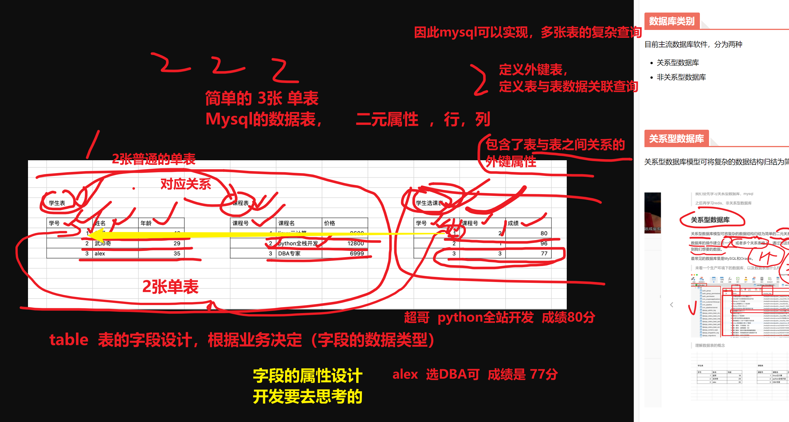

```### 此资源由 58学课资源站 收集整理 ###
	想要获取完整课件资料 请访问：58xueke.com
	百万资源 畅享学习

```
# 02-1-数据库基础知识

```
今天主要快速入门，学习数据库的核心理论，运维和数据库的关系等
以及安装部署
```


```
今日开始，到接下来一段时间的 学习
学习方式变化了


都是敲打linux命令

ssh root@10.0.0.10
bash 进程，等待你输入linux命令


ls

cd

find

sed 
等

↓

bash解释器去执行

（再命令行里面敲打linux命令）


================================
从数据库开始，的章节

和mysql去交互了，敲打的不再是linux语句了。。

而是新的语言，叫做SQL语言


```


# 数据库开篇架构


# 什么是数据?


```
qq
就是mysql

```


# 数据存储

> 很早很早以前，古人是这么存数据的


```
计算机去存储，管理数据

```


# 什么是数据库

顾名思义，数据库(DB，database)按照数据结构来组织、存储和管理数据的“仓库”，是一个文件或者一组文件。


# DBMS

Database Management System，数据库管理系统

数据库管理系统，这一软件用于创建，和，操作数据库，管理，增删改查。


# DBMS

Database Management System，数据库管理系统


# 数据库基础知识

首先mysql前面超哥已经多少带着大家接触过，安装过、使用过，大家心中有一个基础的认识。


## 运维和数据库

说白了，数据库就是存数据的，是一款软件，用专门的数据库语言，增删改查数据。


# 数据库在工作里怎么用

> 数据库和网站


## 数据库类别

目前主流数据库软件，分为两种

- 关系型数据库
- 非关系型数据库


## 关系型数据库

关系型数据库模型可将复杂的数据结构归结为简单的二元关系（即二维表格形式）





> 一步步拆解数据库的 基本常识


## 图解数据库概念

大家可以这么去理解


## 什么是表


## 什么是列


## 什么是行


## 什么是主键


表创建，字段创建，再去理解


# 运维要学的了，什么是SQL


# 什么是mariadb、mysql

```

目前市面上用的最多的，是mysql 5.7系列 

一些最新的，用于吃螃蟹的公司，用的是mysql8.0


传统行业，mysql更低的版本

或者其他数据库软件如 oracle，sql server等

学习mysql 5.7系列


```


## 其他关系型数据库

这里大家只需要了解有该数据库即可

- Microsoft SQL Server
- Microsoft Access
- PostgreSQL
- DB2
- Sysbase
- Informix


# 数据库具体应用场景

## 相亲网

譬如网站的注册登录功能，正确流程是，注册成功->可以登录。

工程师就要检测在注册成功后，检查数据库是否正确保留了信息。


## 游戏数据库

如下是英雄联盟所有的英雄数据库，列出了所有英雄数据


### 练习题

```
作为练习题，后面也可以自行设计王者荣耀数据库

方便你自己查询英雄名，价格，技能等。
```


# 友情提醒

数据库方面知识，主要以运维、开发分为两个方向，不同的方向所重点学习的内容不一样

- 运维人员，主要是对数据库架构、设计、维护
  - 单实例、多实例
  - SQL语句基础CURD学习、权限管理
  - 字符集、数据库引擎
  - 备份方案
  - 复制方案
  - 高可用方案
- 开发人员，主要是对数据进行设计、开发
  - 针对业务进行数据库设计、表结构设计
  - 高性能索引
  - 视图
  - 存储过程
  - 函数
  - 等

# 


