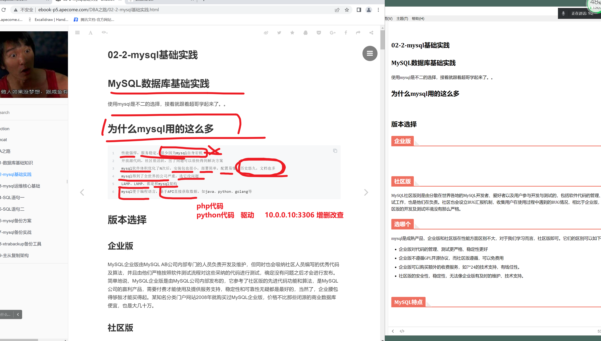
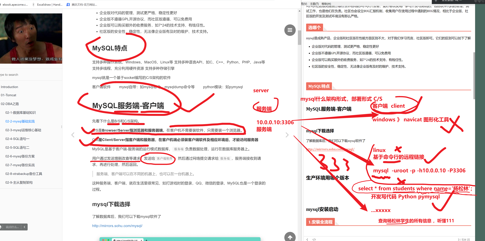
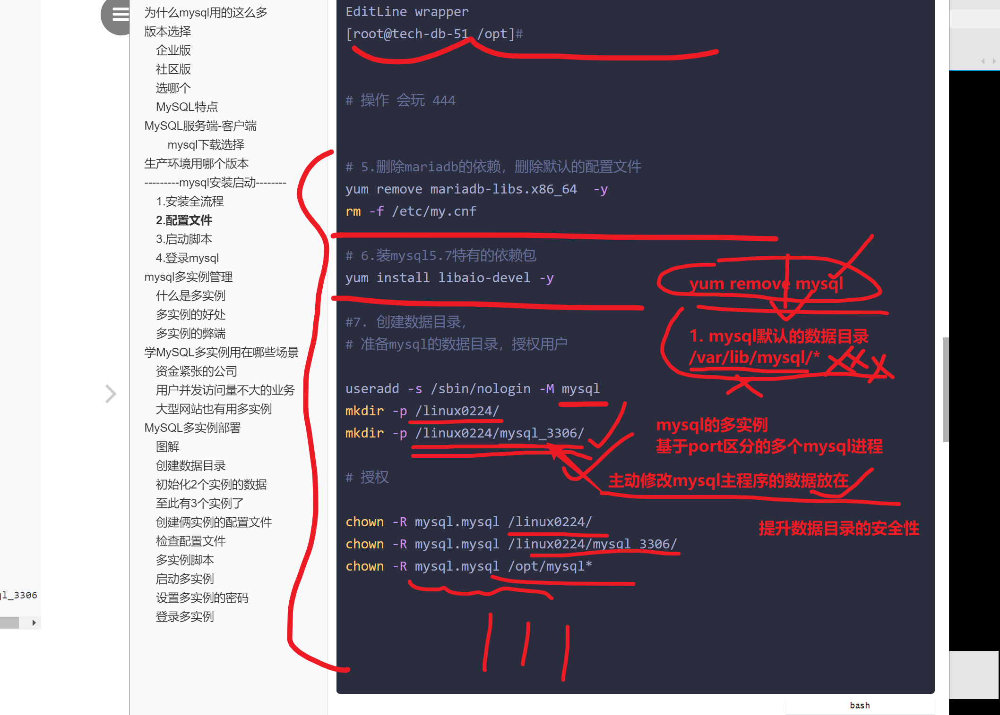
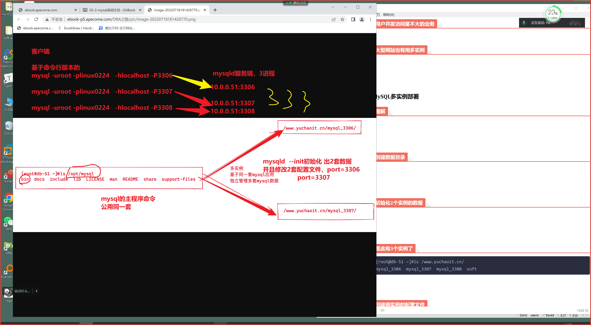
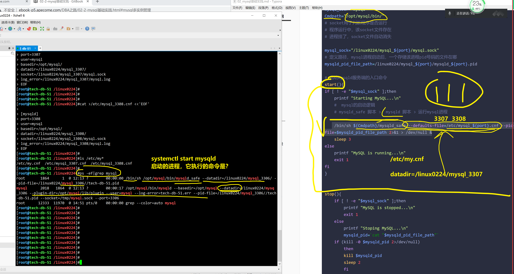
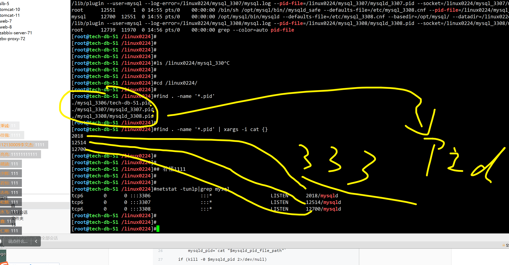
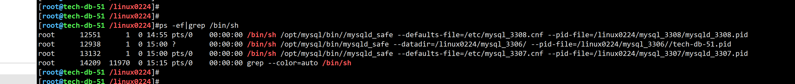

```### 此资源由 58学课资源站 收集整理 ###
	想要获取完整课件资料 请访问：58xueke.com
	百万资源 畅享学习

```


# 02-2-mysql基础实践

# MySQL数据库基础实践

使用mysql是不二的选择，接着就跟着超哥学起来了。。

# 为什么mysql用的这么多




# 版本选择

## 企业版


## 社区版

MySQL社区版则是由分散在世界各地的MySQL开发者、爱好者以及用户参与开发与测试的，包括软件代码的管理、测试工作，也是他们在负责。社区也会设立BUG汇报机制，收集用户在使用过程中遇到的BUG情况，相比于企业版，社区版的开发及测试环境没有那么严格。

## 选哪个

mysql是成熟产品，企业版和社区版在性能方面区别不大，对于我们学习而言，社区版即可。它们的区别可以如下了解

- 企业版对代码的管理、测试更严格、稳定性更好
- 企业版不遵循GPL开源协议，而社区版遵循，可以免费用
- 企业版可以购买额外的收费服务，如7*24的技术支持，有钱任性。
- 社区版的安全性，稳定性，无法像企业版有及时的维护、技术支持。


## MySQL特点


# MySQL服务端-客户端


### mysql下载选择

了解数据库后，我们可以下载mysql软件了

http://mirrors.sohu.com/mysql/


# 生产环境用哪个版本




# ---------mysql安装启动--------

准备3个新机器，

db-51 

db-52

db-53 

我们会用到

或者自己快照管理


```
装什么版本?

```


## 1.安装全流程

```bash
yum
源码编译
rpm包

装和卸载
如何处理依赖关系
都是要掌握的技能


我这里是省事，二进制解压即用

# 确认时间正确
[root@tech-db-51 /opt]#crontab -l
* * * * * ntpdate -u ntp.aliyun.com


1 .准备好包
[root@tech-db-51 /opt]#ll
total 707688
-rw-r--r-- 1 root root 724672294 Jul 28 19:56 mysql-5.7.28-linux-glibc2.12-x86_64.tar.gz
[root@tech-db-51 /opt]#
[root@tech-db-51 /opt]#
[root@tech-db-51 /opt]#du -h
692M	.


2. 解压缩，配置PATH
[root@tech-db-51 /opt]## 常见做法，做软连接，便于二进制包的升级，后续的使用路径，用的都是软连接
[root@tech-db-51 /opt]#
[root@tech-db-51 /opt]#
[root@tech-db-51 /opt]#ln -s /opt/mysql-5.7.28-linux-glibc2.12-x86_64   /opt/mysql
[root@tech-db-51 /opt]#
[root@tech-db-51 /opt]#
[root@tech-db-51 /opt]#
[root@tech-db-51 /opt]#ls /opt/ -l
total 707688
lrwxrwxrwx 1 root root        40 Jul 28 19:58 mysql -> /opt/mysql-5.7.28-linux-glibc2.12-x86_64
drwxr-xr-x 9 root root       129 Jul 28 19:57 mysql-5.7.28-linux-glibc2.12-x86_64
-rw-r--r-- 1 root root 724672294 Jul 28 19:56 mysql-5.7.28-linux-glibc2.12-x86_64.tar.gz
[root@tech-db-51 /opt]#


# 3. 配置PATH
echo 'export PATH=$PATH:/opt/mysql/bin'  >> /etc/profile
source /etc/profile

# 4. 验证mysql版本
[root@tech-db-51 /opt]#mysql -V 
mysql  Ver 14.14 Distrib 5.7.28, for linux-glibc2.12 (x86_64) using  EditLine wrapper
[root@tech-db-51 /opt]#


# 操作 会玩 444


# 5.删除mariadb的依赖，删除默认的配置文件 
yum remove mariadb-libs.x86_64  -y
rm -f /etc/my.cnf

# 6.装mysql5.7特有的依赖包
yum install libaio-devel -y

#7. 创建数据目录，
# 准备mysql的数据目录，授权用户

useradd -s /sbin/nologin -M mysql
mkdir -p /linux0224/
mkdir -p /linux0224/mysql_3306/


# 授权

chown -R mysql.mysql /linux0224/
chown -R mysql.mysql /linux0224/mysql_3306/
chown -R mysql.mysql /opt/mysql*

#检查

ls -ld  /linux0224 /linux0224/mysql_3306/  /opt/mysql*

[root@tech-db-51 /opt]#ls -ld  /linux0224 /linux0224/mysql_3306/  /opt/mysql*


# 8.此时自建的mysql目录，没有输数据，mysql 无法使用，初始化生成mysql默认库的数据源 ，用户等信息，即可启动
# mysqld 服务端命令，启动，初始化，都用的这个
# --basedir  mysql二进制命令装再哪了，主程序目录
# --datadir 数据目录初始到哪

mysqld --initialize-insecure --user=mysql --basedir=/opt/mysql --datadir=/linux0224/mysql_3306/


```




## 2.配置文件

```
初始化完毕后，有配置文件即可正确启动，告诉 my.cnf
mysqld的数据源目录在哪，日志写入到哪等


# /etc/my.cnf 默认mysql会去读这个，不指定，也读这个

# [mysqld] 服务端会读取的配置
# [mysql]  再机器本地，执行mysql命令，客户端读取的配置 
# socket 本地进程套接字文件，用于mysql客户端再本地区链接


cat >/etc/my.cnf <<'EOF'

[mysqld]
port=3306
user=mysql
basedir=/opt/mysql
datadir=/linux0224/mysql_3306/
socket=/tmp/mysql.sock

[mysql]
socket=/tmp/mysql.sock
EOF


```


## 3.启动脚本

```
复制自带脚本即可

[root@tech-db-51 /linux0224/mysql_3306]#cp /opt/mysql/support-files/mysql.server   /etc/init.d/mysqld
[root@tech-db-51 /linux0224/mysql_3306]#
[root@tech-db-51 /linux0224/mysql_3306]#
[root@tech-db-51 /linux0224/mysql_3306]#systemctl daemon-reload
[root@tech-db-51 /linux0224/mysql_3306]#
[root@tech-db-51 /linux0224/mysql_3306]#
[root@tech-db-51 /linux0224/mysql_3306]#systemctl status mysqld
● mysqld.service - LSB: start and stop MySQL
   Loaded: loaded (/etc/rc.d/init.d/mysqld; bad; vendor preset: disabled)
   Active: inactive (dead)
     Docs: man:systemd-sysv-generator(8)


```


## 4.登录mysql

```
# 启动即可
[root@tech-db-51 /linux0224/mysql_3306]#systemctl start mysqld
[root@tech-db-51 /linux0224/mysql_3306]#
[root@tech-db-51 /linux0224/mysql_3306]#
[root@tech-db-51 /linux0224/mysql_3306]#mysql 
Welcome to the MySQL monitor.  Commands end with ; or \g.
Your MySQL connection id is 2
Server version: 5.7.28 MySQL Community Server (GPL)

Copyright (c) 2000, 2019, Oracle and/or its affiliates. All rights reserved.

Oracle is a registered trademark of Oracle Corporation and/or its
affiliates. Other names may be trademarks of their respective
owners.

Type 'help;' or '\h' for help. Type '\c' to clear the current input statement.

mysql> 


# 到这看懂111

#下午 2.20 开始上课


```


# ---------mysql多实例管理----------


## 什么是多实例


## 多实例的好处


## 多实例的弊端


# 学MySQL多实例用在哪些场景

## 资金紧张的公司


## 用户并发访问量不大的业务


## 大型网站也有用多实例


# MySQL多实例部署

## 图解




## 创建数据目录


```
mkdir -p  /linux0224/mysql_3307

mkdir -p  /linux0224/mysql_3308


chown -R mysql.mysql /linux0224
```


## 初始化2个实例的数据

```
mysqld --initialize-insecure --user=mysql --basedir=/opt/mysql --datadir=/linux0224/mysql_3307


mysqld --initialize-insecure --user=mysql --basedir=/opt/mysql --datadir=/linux0224/mysql_3308


# 都会默认创建一个账户，链接权限

root 空密码 只允许再localhost登录


# 看懂33333


```


## 至此有3个实例了

```
[root@tech-db-51 /linux0224]#ll
total 4
drwxr-xr-x 6 mysql mysql 4096 Jul 28 14:00 mysql_3306
drwxr-xr-x 5 mysql mysql  314 Jul 28 14:37 mysql_3307
drwxr-xr-x 5 mysql mysql  314 Jul 28 14:38 mysql_3308
[root@tech-db-51 /linux0224]#
[root@tech-db-51 /linux0224]#du -sh *
134M	mysql_3306
122M	mysql_3307
122M	mysql_3308

```


## 额外创建俩实例的配置文件

### 3306

```
[root@tech-db-51 /linux0224]#cat /etc/my.cnf 

[mysqld]
port=3306
user=mysql
basedir=/opt/mysql
datadir=/linux0224/mysql_3306/
socket=/tmp/mysql.sock

[mysql]
socket=/tmp/mysql.sock

```


### 3307

区别在参数

port

datadir

socket 进程套接字文件

```
链接mysql的俩方式，找到它   

进程
pid   
能链接程序的俩方式
1. 通过远程网络的链接形式，效率很低，网络波动，
ip:port   10.0.0.51:3306

mysql -uroot -p -h10.0.0.51  -P3306


--------------------------------
--------------------------------
--------------------------------

2. 通过再机器本地，进程套接字文件去链接，直接是基于内存的链接
程序和程序之间，直接走内存数据，效率极高，遇见一些软件的部署，走socket链接
如nginx的反向代理配置
proxy_pass  ip:port;
proxy_pass  unxi:socket;


/linux0224/mysql_3307/mysql.sock

# -S  等于 -h -P 

# 链接3307的进程
# 能看懂 程序链接的2方式
# 
mysql -uroot -p密码 -S  /linux0224/mysql_3307/mysql.sock
mysql -uroot -p密码 -S  /linux0224/mysql_3306/mysql.sock
mysql -uroot -p密码 -S  /linux0224/mysql_3308/mysql.sock
#

# 看懂刷222222


```


log目录


```
cat >/etc/mysql_3307.cnf <<'EOF'
[mysqld]
port=3307
user=mysql
basedir=/opt/mysql/
datadir=/linux0224/mysql_3307/
socket=/linux0224/mysql_3307/mysql.sock
log_error=/linux0224/mysql_3307/mysql.log
EOF
```


### 3308

```
cat >/etc/mysql_3308.cnf <<'EOF'

[mysqld]
port=3308
user=mysql
basedir=/opt/mysql/
datadir=/linux0224/mysql_3308/
socket=/linux0224/mysql_3308/mysql.sock
log_error=/linux0224/mysql_3308/mysql.log
EOF
```


## 检查配置文件

```bash
[root@tech-db-51 /linux0224]#
[root@tech-db-51 /linux0224]#ls /etc/my*
/etc/my.cnf  /etc/mysql_3307.cnf  /etc/mysql_3308.cnf


看懂 333

```


## 多实例脚本

有3个数据目录+ 3个独立的配置文件+ shell脚本 -=====3个运行程序

提供一个脚本模板，自己区分3个实例的端口，数据目录即可


生成 3307 和3308即可


```bash
cat > /linux0224/3308.sh <<'EOF'
port="3308"
mysql_user="mysql"
Cmdpath="/opt/mysql/bin/"
# socket用于判断程序是否运行
# 程序运行中，该socket文件存在
# 进程挂了，socket文件自动消失

mysql_sock="/linux0224/mysql_${port}/mysql.sock"
# 定义路径，mysql进程启动后，一个存储该进程pid号码的文件在哪
mysqld_pid_file_path=/linux0224/mysql_${port}/mysqld_${port}.pid

# 启动mysqld服务端的入口命令
start(){
if [ ! -e "$mysql_sock" ];then
    printf "Starting MySQL...\n"
    #  mysql的启动逻辑
    # mysqld_safe 脚本 >  mysqld 脚本 > 运行mysql进程
  
    /bin/sh ${Cmdpath}/mysqld_safe --defaults-file=/etc/mysql_${port}.cnf --pid-file=$mysqld_pid_file_path 2>&1 > /dev/null &
    sleep 3
else
    printf "MySQL is running...\n"
    exit 1
fi
}


stop(){
    if [ ! -e "$mysql_sock" ];then
        printf "MySQL is stopped...\n"
        exit 1
    else
        printf "Stoping MySQL...\n"
        mysqld_pid=`cat "$mysqld_pid_file_path"`
    if (kill -0 $mysqld_pid 2>/dev/null)
        then
        kill $mysqld_pid
        sleep 2
        fi
    fi
}


restart(){
    printf "Restarting MySQL...\n"
    stop
    sleep 2
    start
}


case "$1" in
start)
    start
;;
stop)
    stop
;;
restart)
    restart
;;
*)
    printf "Usage: /data/${port}/mysql{start|stop|restart}\n"
esac
EOF
```




## 启动多实例

```
# 查看已有的3306实例
[root@tech-db-51 /linux0224]#netstat -tunlp|grep 3306
tcp6       0      0 :::3306                 :::*                    LISTEN      2018/mysqld     


# 启动3307
[root@tech-db-51 /linux0224]#bash 3307.sh start
Starting MySQL...
Logging to '/linux0224/mysql_3307/mysql.log'.
[root@tech-db-51 /linux0224]#
[root@tech-db-51 /linux0224]#
[root@tech-db-51 /linux0224]#netstat -tunlp|grep mysql
tcp6       0      0 :::3306                 :::*                    LISTEN      2018/mysqld         
tcp6       0      0 :::3307                 :::*                    LISTEN      12514/mysqld   


# 启动3308
[root@tech-db-51 /linux0224]#bash 3308.sh start
Starting MySQL...
Logging to '/linux0224/mysql_3308/mysql.log'.
[root@tech-db-51 /linux0224]#
[root@tech-db-51 /linux0224]#netstat -tunlp|grep mysql
tcp6       0      0 :::3306                 :::*                    LISTEN      2018/mysqld         
tcp6       0      0 :::3307                 :::*                    LISTEN      12514/mysqld        
tcp6       0      0 :::3308                 :::*                    LISTEN      12700/mysqld  


```


### 检查3个实例的pid文件，socket文件

```
# pid文件 ，3个实例的
[root@tech-db-51 /linux0224]#find . -name '*.pid'
./mysql_3306/tech-db-51.pid
./mysql_3307/mysqld_3307.pid
./mysql_3308/mysqld_3308.pid


#socket文件


```




### 生产下的暗坑

```
[root@tech-db-51 /linux0224]#systemctl start mysqld
[root@tech-db-51 /linux0224]#
[root@tech-db-51 /linux0224]#
[root@tech-db-51 /linux0224]#bash /linux0224/3307.sh start
Starting MySQL...
[root@tech-db-51 /linux0224]#
[root@tech-db-51 /linux0224]#
[root@tech-db-51 /linux0224]#find / -name '*.sock' |xargs -i ls -l {}
srwxrwxrwx 1 mysql mysql 0 Jul 28 15:00 /tmp/mysql.sock
srwxrwxrwx 1 mysql mysql 0 Jul 28 15:00 /linux0224/mysql_3307/mysql.sock
srwxrwxrwx 1 mysql mysql 0 Jul 28 14:55 /linux0224/mysql_3308/mysql.sock
[root@tech-db-51 /linux0224]#


有些程序，不专业的程序员，会清空/tmp下的数据

# mysql的链接有的链接方式是走 sock文件的，因此sock文件不得删除，导致无法链接


# 建议，sock文件，别放入/tmp目录

听懂1111

```


## 设置多实例的密码

```
3实例，

# mysqladmin和mysql一样，也是客户端链接命令
# 精确定位 每一个实例
# ip:port
# socket


mysqladmin -uroot -p   password  新的密码


# ==================3306=========
# socket修改
# -u账户
# -p密码 ，啥也没写，会交互式提示让你输入

mysqladmin -uroot -p   -S /tmp/mysql.sock  password linux0224
# 还要再改3306的密码
# -p后面建议别跟上密码，因为history能看到密码记录
# mysql也给你提示不安全
mysqladmin -uroot -plinux0224 -S /tmp/mysql.sock password  linux3306

# 能听懂，看懂刷666


# ==================3307=========

mysqladmin -uroot -p -S /linux0224/mysql_3307/mysql.sock password  linux3307


# ==================3308=========

mysqladmin -uroot -p -S /linux0224/mysql_3308/mysql.sock password  linux3308


# 能看懂命令，修改多个实例，如何链接多个实例，基于sock文件的链接，修改密码
# 看懂刷7777


```


## 登录多实例

- ip:port方式

```bash
[root@tech-db-51 /linux0224]#mysql -hlocalhost -P3306   -uroot -plinux3306 -e "show global variables like 'port';"
mysql: [Warning] Using a password on the command line interface can be insecure.
+---------------+-------+
| Variable_name | Value |
+---------------+-------+
| port          | 3306  |
+---------------+-------+


# 3307 ，mysql的用户远程链接，权限问题

[root@tech-db-51 /linux0224]#mysql -uroot -plinux3307 -h127.0.0.1 -P3307   -e "show global variables like 'port';"
mysql: [Warning] Using a password on the command line interface can be insecure.
+---------------+-------+
| Variable_name | Value |
+---------------+-------+
| port          | 3307  |
+---------------+-------+


[root@tech-db-51 /linux0224]#mysql -uroot -plinux3308 -h127.0.0.1 -P3308   -e "show global variables like 'port';"
mysql: [Warning] Using a password on the command line interface can be insecure.
+---------------+-------+
| Variable_name | Value |
+---------------+-------+
| port          | 3308  |
+---------------+-------+

# 看懂基于 ip:port的链接多实例，刷33333


# ip:port有很多种规则
# 授权语法
#  locahost,  127.0.0.1   10.0.0.10

```


- sock文件方式

```
mysql -uroot -plinux3308 -S /linux0224/mysql_3308/mysql.sock  -e "show global variables like 'port';"


mysql -uroot -plinux3307 -S /linux0224/mysql_3307/mysql.sock  -e "show global variables like 'port';"


mysql -uroot -plinux3306 -S /tmp/mysql.sock  -e "show global variables like 'port';"


```


###  查看mysql的仨实例进程信息



```
用于学习mysql的启动命令语法

```


# 今日作业

```
1. 整理mysql基础知识笔记，理解什么是数据库，为什么用数据库，数据库基础名词，如库、表、字段等

2. 完成mysql5.7.28 的多实例搭建

```


