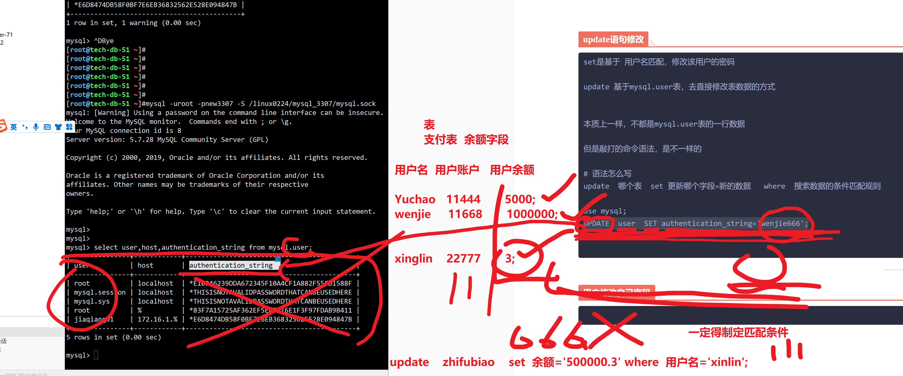

```### 此资源由 58学课资源站 收集整理 ###
	想要获取完整课件资料 请访问：58xueke.com
	百万资源 畅享学习

```
# 上节作业回顾


```
1. 关于课程的知识点，课表中有的，一个都不会少，都会教给大家

2. 跟着学校安排走就行，保证结果


```


# 1.修改root密码


## Mysqladmin改密码

```
mysql很多任务，都可以 通过不同的命令实现，熟练使用一种就行
其他的看懂语法即可

这是一个linux中的命令
是在bash环境中执行，修改mysql用户的密码


mysqladmin修改密码

myqsladmin  具体链接哪一个数据库实例   修改它的密码


mysqladmin -uroot -plinux3306 password  chaoge666     不指定链接哪个实例

1. my.cnf配置文件的  [mysql]  [mysqladmin] 
是否制定了socket=xxxxxx

2. 默认读 /tmp/mysql.sock


# 修改root的密码 ，改3306和 3307实例的俩密码
俩独立的数据库，就有2套数据

[root@tech-db-51 ~]#systemctl start mysqld
[root@tech-db-51 ~]#mysql -uroot -plinux3306 -S /tmp/mysql.sock


[root@tech-db-51 ~]#mysqladmin -uroot -plinux3306 -S /tmp/mysql.sock   password  new3306
mysqladmin: [Warning] Using a password on the command line interface can be insecure.
Warning: Since password will be sent to server in plain text, use ssl connection to ensure password safety.

# 隐藏密码的修改操作
mysqladmin -uroot -p -S /tmp/mysql.sock password

# 新密码

[root@tech-db-51 ~]#mysql -uroot -pnewchaoge666 -S /tmp/mysql.sock 


# 修改3307的root的密码
mysqladmin -uroot -plinux3307  -S /linux0224/mysql_3307/mysql.sock  password new3307 

# 客户端命令登录3307，查看信息
mysql -uroot -pnew3307 -S /linux0224/mysql_3307/mysql.sock -e "status;"

确认修改了 3306 和3307的root用户密码


看懂333


```


普通用户的密码， 用root用户，执行SQL语句去修改 wenjie用户的密码。


> 如下语句，都是MYSQL的 SQL关键字了，得登录到mysql的环境中，再输入


## set语句修改

- root去修改他人密码
  - `set password for  wenjie01@'10.0.0.%'=PASSWORD('wj666')`
- 用户直接用set命令改自己的密码
  - 普通用户登录后
  - `set password='新密码'`
  - `set password=PASSWORD('新密码')`
- 看懂mysqladmin，set命令修改密码，刷2222


```

# 语法，关键字用大写，个人数据用小写


# 用desc指令，查看数据表  mysql.user user表的结构，有多少个字段，如密码字段叫什么
# 也可以先进入数据库
mysql> use mysql;
mysql> DESC user;


1. root修改其他人的密码

SET PASSWORD FOR   jiaqiang01@'172.16.1.%'


2. 用户修改自己密码 
（不同的版本，有些SQL不识别，5.4  5.6 .5.7  8.0 修改密码的SQL可能都不一样）


#查看user表的记录，查看用户行记录
mysql> select user,host,authentication_string from mysql.user;
+---------------+------------+-------------------------------------------+
| user          | host       | authentication_string                     |
+---------------+------------+-------------------------------------------+
| root          | localhost  | *E10946239DDA672345F10A4CF1A882F556D1588F |
| mysql.session | localhost  | *THISISNOTAVALIDPASSWORDTHATCANBEUSEDHERE |
| mysql.sys     | localhost  | *THISISNOTAVALIDPASSWORDTHATCANBEUSEDHERE |
| root          | %          | *83F7A15725AF362EF5EAFC16E1F3F97FDAB9B411 |
| jiaqiang01    | 172.16.1.% | *FB87DEE2973CC8583F91157E6D9EEE0F1D818A2F |
+---------------+------------+-------------------------------------------+
5 rows in set (0.00 sec)


jiaqiang01  >>>>>>>>>  818A2F


修改加强的密码为 jq666

SET PASSWORD FOR  jiaqiang01@'172.16.1.%'="jq666";


mysql> select user,host,authentication_string from mysql.user;
+---------------+------------+-------------------------------------------+
| user          | host       | authentication_string                     |
+---------------+------------+-------------------------------------------+
| root          | localhost  | *E10946239DDA672345F10A4CF1A882F556D1588F |
| mysql.session | localhost  | *THISISNOTAVALIDPASSWORDTHATCANBEUSEDHERE |
| mysql.sys     | localhost  | *THISISNOTAVALIDPASSWORDTHATCANBEUSEDHERE |
| root          | %          | *83F7A15725AF362EF5EAFC16E1F3F97FDAB9B411 |
| jiaqiang01    | 172.16.1.% | *87C1EE0D2C9F3D5A92E3CB73A7E68EA67DD8AF8F |
+---------------+------------+-------------------------------------------+
5 rows in set (0.00 sec)

mysql> 
mysql> select PASSWORD('jq666');
+-------------------------------------------+
| PASSWORD('jq666')                         |
+-------------------------------------------+
| *87C1EE0D2C9F3D5A92E3CB73A7E68EA67DD8AF8F |
+-------------------------------------------+
1 row in set, 1 warning (0.00 sec)

mysql> 


用改账户新密码登录
看懂新账户登录，SQL语句，刷3333

[root@tech-db-51 ~]#mysql -ujiaqiang01 -pjq666 -h172.16.1.51 -P3307

mysql> select USER();
+-----------------------+
| USER()                |
+-----------------------+
| jiaqiang01@tech-db-51 |
+-----------------------+
1 row in set (0.00 sec)

mysql> 


休息西一会  11.15继续


# 用户改自己的密码
#设置密码，且内置的 密码函数，对源字符串加密处理
# mysql5.7版本中，内置了密码加密，插件，
# 

mysql> SET PASSWORD=PASSWORD('newjq666');


```


## update语句修改

```
set是基于 用户名匹配，修改该用户的密码

update 基于mysql.user表，去直接修改表数据的方式


本质上一样，不都是mysql.user表的一行数据

但是敲打的命令语法，是不一样的

# 语法怎么写 
update  哪个表  set 更新哪个字段=新的数据   where  搜索数据的条件匹配规则


use mysql;
UPDATE  user  SET authentication_string='wenjie666';


# 案例
修改jiaqiang01的密码   jq888

select PASSWORD('jq888');
UPDATE user  SET  authentication_string=PASSWORD('jq888') WHERE user='jiaqiang01';

# 看懂UPDATE语法，的大坑，以及要慎重加上where的点
#以及如何修改密码，等于直接修改mysql.user表的行记录，的玩法

看懂 666


```




## 用户修改自己密码

```

set password='root3307'


```


# 9.忘记root密码咋办

set修改 密码 ，只需要传入用户名，自动帮你修改密码了、

update修改密码区别是什么，直接修改mysql.user的表数据


从语法上去回答就行了 111


```
核心方案，都是再启动mysqld该主进程时，添加  参数 
--skip-grant-table  跳过授权表
等于mysqld 服务端的启动，是不做权限校验的，不读 mysql.user表的


```

## 玩法1，改配置文件

```
# 1. 修改my.cnf
skip-grant-table
重启密码了没问题，也修改完毕了


# 案例，如忘记了 3307的密码


vim /etc/mysql_3307.cnf  
#这个功能是给 [mysqld]服务端
[root@tech-db-51 ~]#cat /etc/mysql_3307.cnf 
[mysqld]
skip-grant-tables
port=3307
user=mysql
basedir=/opt/mysql/
datadir=/linux0224/mysql_3307/
socket=/linux0224/mysql_3307/mysql.sock
log_error=/linux0224/mysql_3307/mysql.log


# 重启mysqld，读取该配置，跳过授权表

[root@tech-db-51 ~]#vim /etc/mysql_3307.cnf
[root@tech-db-51 ~]#
[root@tech-db-51 ~]#
[root@tech-db-51 ~]#bash /linux0224/3307.sh start
Starting MySQL...
[root@tech-db-51 ~]#ps -ef|grep 3307
root       2159      1  0 19:42 pts/0    00:00:00 /bin/sh /opt/mysql/bin//mysqld_safe --defaults-file=/etc/mysql_3307.cnf --pid-file=/linux0224/mysql_3307/mysqld_3307.pid
mysql      2322   2159  3 19:42 pts/0    00:00:00 /opt/mysql/bin/mysqld --defaults-file=/etc/mysql_3307.cnf --basedir=/opt/mysql/ --datadir=/linux0224/mysql_3307 --plugin-dir=/opt/mysql//lib/plugin --user=mysql --log-error=/linux0224/mysql_3307/mysql.log --pid-file=/linux0224/mysql_3307/mysqld_3307.pid --socket=/linux0224/mysql_3307/mysql.sock --port=3307
root       2352   1353  0 19:42 pts/0    00:00:00 grep --color=auto 3307
[root@tech-db-51 ~]#


# 登录试试，注意链接哪个实例

[root@tech-db-51 ~]#mysql -S /linux0224/mysql_3307/mysql.sock

mysql> set password='linux3307';
ERROR 1290 (HY000): The MySQL server is running with the --skip-grant-tables option so it cannot execute this statement

想基于set修改密码，基于跳过授权表的登录状态，不允许走set修改

暴力点update改密码表数据


update mysql.user  SET authentication_string=PASSWORD('linux3307')  where  user='root' and host='localhost'  ;

# 看懂刷333

至此，密码修改完毕
刷新权限数据表；

mysql> flush privileges;
Query OK, 0 rows affected (0.01 sec)


# 2. 务必要改回来

修改配置文件，去掉免密参数，重启，试试新密码
[root@tech-db-51 ~]#cat  /etc/mysql_3307.cnf 
[mysqld]
port=3307
user=mysql
basedir=/opt/mysql/
datadir=/linux0224/mysql_3307/
socket=/linux0224/mysql_3307/mysql.sock
log_error=/linux0224/mysql_3307/mysql.log


重启
[root@tech-db-51 ~]#bash /linux0224/3307.sh restart
Restarting MySQL...
Stoping MySQL...
Starting MySQL...


登录
[root@tech-db-51 ~]#mysql -uroot -plinux3307 -S /linux0224/mysql_3307/mysql.sock -e "status"
mysql: [Warning] Using a password on the command line interface can be insecure.
--------------
mysql  Ver 14.14 Distrib 5.7.28, for linux-glibc2.12 (x86_64) using  EditLine wrapper

Connection id:		3
Current database:	
Current user:		root@localhost
SSL:			Not in use
Current pager:		stdout
Using outfile:		''
Using delimiter:	;
Server version:		5.7.28 MySQL Community Server (GPL)
Protocol version:	10
Connection:		Localhost via UNIX socket
Server characterset:	latin1
Db     characterset:	latin1
Client characterset:	utf8
Conn.  characterset:	utf8
UNIX socket:		/linux0224/mysql_3307/mysql.sock
Uptime:			46 sec

Threads: 1  Questions: 7  Slow queries: 0  Opens: 105  Flush tables: 1  Open tables: 98  Queries per second avg: 0.152
--------------


# 看懂修改 配置文件，重置root密码的玩法1，刷1111


网段扫描  3306  暴力登录


3.运维，得保护你的服务器啊
安全意识


```


## 玩法2，比较慎重了

- 基于mysql的主程序命令，运行进程实例（加入了跳过授权表参数的实例运行）
- 

```
不该配置文件，直接启动进程，加入跳过授权表的参数

# 如果修改 3307实例，重置root密码


# 读取默认配置 /etc/my.cnf  /tmp/mysql.sock
# 改的是3306
# 正常情况下，只有3306实例
# 给大家讲的是更复杂的，运行了3个实例，3套配置文件，3套数据

mysqld_safe --skip-grant-tables --user=mysql


#重置的是 3307实例的数据
# 带你玩复杂的场景，再去处理简单的场景，
听懂部署逻辑刷1111


------------------------------------------------------------------------------


#直接基于mysqld服务端命令，启动mysql，然后重置root密码，省的修改配置文件了
# 读取3307实例的数据目录即可 /linux0224/mysql_3307

# 1. 先停止3307实例，基于shutdonw命令去停止
mysql> shutdown;
Query OK, 0 rows affected (0.00 sec)


# 2. 再执行如下命令，跳过授权表运行mysql

# 跳过授权表参数放入后面

# 如下命令，ps查，模仿写就行， --skip-grant-tables  参数，放在最后面

# /etc/mysql_3307.cnf ，明确 /linux0224/mysql_3307/

/opt/mysql/bin/mysqld_safe  --defaults-file=/etc/mysql_3307.cnf --pid-file=/linux0224/mysql_3307/mysqld_3307.pid  --skip-grant-tables  &


[root@tech-db-51 ~]#jobs -l
[1]+  4746 Running                 /opt/mysql/bin/mysqld_safe --defaults-file=/etc/mysql_3307.cnf --pid-file=/linux0224/mysql_3307/mysqld_3307.pid --skip-grant-tables &


[root@tech-db-51 ~]#netstat -tunlp
Active Internet connections (only servers)
Proto Recv-Q Send-Q Local Address           Foreign Address         State       PID/Program name    
tcp        0      0 0.0.0.0:22              0.0.0.0:*               LISTEN      1014/sshd           
tcp6       0      0 :::3307                 :::*                    LISTEN      4915/mysqld         
tcp6       0      0 :::22                   :::*                    LISTEN      1014/sshd           
[root@tech-db-51 ~]#
[root@tech-db-51 ~]#ps -ef|grep mysql
root       4746   1353  0 20:17 pts/0    00:00:00 /bin/sh /opt/mysql/bin/mysqld_safe --defaults-file=/etc/mysql_3307.cnf --pid-file=/linux0224/mysql_3307/mysqd_3307.pid --skip-grant-tables
mysql      4915   4746  0 20:17 pts/0    00:00:00 /opt/mysql/bin/mysqld --defaults-file=/etc/mysql_3307.cnf --basedir=/opt/mysql/ --datadir=/linux0224/mysql_3307 --plugin-dir=/opt/mysql//lib/plugin --user=mysql --skip-grant-tables --log-error=/linux0224/mysql_3307/mysql.log --pid-file=/linux0224/mysql_3307/mysqld_3307.pid --socket=/linux0224/mysql_3307/mysql.sock --port=3307
root       4947   1353  0 20:17 pts/0    00:00:00 grep --color=auto mysql


# 测试登录3307实例就行

update mysql.user  SET authentication_string=PASSWORD('newlinux3307')  where  user='root' and host='localhost'  ;

mysql> shutdown;
Query OK, 0 rows affected (0.00 sec)


# 至此该免密登录的进程，就挂了
正确，再次启动3307的姿势

[root@tech-db-51 ~]#bash /linux0224/3307.sh start
Starting MySQL...
[root@tech-db-51 ~]#


mysql -uroot -pnewlinux3307 -S /linux0224/mysql_3307/mysql.sock
```


# 作业练习

> mysql知识量大，需要记忆的多
>
> 做好笔记，思维脑图
>
> 就能学好了。

6666 

```
0. 周末，看博客，自己完成剩余的 修改密码的 SQL练习。
http://ebook-p5.apecome.com/DBA%E4%B9%8B%E8%B7%AF/02-3-mysql%E8%BF%90%E7%BB%B4%E6%A0%B8%E5%BF%83%E5%9F%BA%E7%A1%80.html#%E6%9F%A5%E7%9C%8Bmysql%E7%94%A8%E6%88%B7%E5%88%97%E8%A1%A8

1.完成mysql远程连接的命令整理，grant语句整理


2. 实际案例练习

3306实例
创建三个普通账号，授权练习

1. 运维账号给与最大权限，允许远程连接  

ops01 

grant all  on *.* to ops01@'%'  identified by 'ops666';
mysql> flush privileges;
Query OK, 0 rows affected (0.00 sec)


select authentication_string,user,host from mysql.user;

显示该用户的权限信息
show grants for ops01@'%';

mysql> show grants for ops01@'%';
+--------------------------------------------+
| Grants for ops01@%                         |
+--------------------------------------------+
| GRANT ALL PRIVILEGES ON *.* TO 'ops01'@'%' |
+--------------------------------------------+
1 row in set (0.00 sec)


# 远程登录，navicat，看到所有数据库，表，以及修改表数据
# 有问题，就给我发微信，直接找

# 实现创建ops01账号，给与远程链接权限，以及所有库表的最大权限，看懂333


2.开发账号，只能对开发库有，增，删，改，查，权限，只允许在10，172两个网段连接

10.0.0.%
172.16.1.%


mysql> show databases;
+--------------------+
| Database           |
+--------------------+
| information_schema |
| dev01              |
| linux0224          |
| logs               |
| mysql              |
| performance_schema |
| sys                |
+--------------------+
7 rows in set (0.00 sec)


laoliu01 开发的账户


# 基于show命令，查看权限列表，以及什么事正删改查，看懂111

mysql> show privileges;

Create
Delete
Update
Select

# 创建账号，切授权

laoliu01@10.0.0.%
laoliu01@172.16.1.%


grant Create,Delete,Update,Select on dev01.* to laoliu01@'10.0.0.%' identified by 'laoliu01';


grant Create,Delete,Update,Select on dev01.* to laoliu01@'172.16.1.%' identified by 'laoliu02';


select user,host,authentication_string from mysql.user;


# 这道题，看懂全流程刷 666

# 查看该账号的权限

show grants for laoliu01@'172.16.1.%' ;
show grants for laoliu01@'10.0.0.%'


3.测试账号，只能对测试库，增，改，查，的权限，且只允许在172内网连接。

create database test01 charset utf8;
grant create,update,select on  test01.* to t1@'172.16.1.%'  identified by 't1';

mysql> show grants for  t1@'172.16.1.%';
+-----------------------------------------------------------------+
| Grants for t1@172.16.1.%                                        |
+-----------------------------------------------------------------+
| GRANT USAGE ON *.* TO 't1'@'172.16.1.%'                         |
| GRANT SELECT, UPDATE, CREATE ON `test01`.* TO 't1'@'172.16.1.%' |
+-----------------------------------------------------------------+
2 rows in set (0.00 sec)


# 该t1测试账号，就可以了，限制了权限，以及是允许登录的，看懂777


------------------------------------------------------------------------

3307实例，安装jpress博客，且可以navicat远程访问


在阿里云部署mysql5.7.28 ，修改默认端口为23306端口实例
防止数据库被恶意扫描，以及jpress，


确保可以navicat，和cmd远程访问


---------------------------------------------------------------------------------


```


### 阿里云部署jpress网站，数据库授权远程访问

```
1.准备好服务器，数据库
准备5.7.28 软件包，二进制部署方式
[root@AlienCat opt]# mysql -V
mysql  Ver 14.14 Distrib 5.7.28, for linux-glibc2.12 (x86_64) using  EditLine wrapper


2. 部署jpress，java开发的网站

你自己笔记都有，能明白刷1111
带着你检查一波


jdk环境
[root@AlienCat opt]# java -version
java version "1.8.0_221"
Java(TM) SE Runtime Environment (build 1.8.0_221-b11)
Java HotSpot(TM) 64-Bit Server VM (build 25.221-b11, mixed mode)


3.看jpress官网部署
- 手动打包war包部署
	- 手工部署tomcat，war包放入 tomcat的webapps目录，自动解压，自动发布
	
- 打包jar部署
	- maven打包java源码，生成 xxx.jar
	java -jar  xxx.jar启动了，内置了tomcat  web服务器
	
会玩 2222

按官网推荐的来

[root@AlienCat tech-mysql-deploy]# yum install git -y 


git clone https://gitee.com/JPressProjects/jpress.git

[root@AlienCat tech-mysql-deploy]# git clone https://gitee.com/JPressProjects/jpress.git
Cloning into 'jpress'...
remote: Enumerating objects: 102094, done.
remote: Counting objects: 100% (11635/11635), done.
remote: Compressing objects: 100% (6565/6565), done.
remote: Total 102094 (delta 4014), reused 4810 (delta 1411), pack-reused 90459
Receiving objects: 100% (102094/102094), 185.07 MiB | 10.98 MiB/s, done.
Resolving deltas: 100% (41714/41714), done.


下一步，进入代码源码目录，maven打包
该源码，部署发现，至少需要3.1版本以上的maven

你有maven环境


修改mvv的源加载打包下载
# maven是java系的软件，配置文件，以*.xml居多
[root@AlienCat ~]# find /etc -name *.xml
/etc/firewalld/zones/public.xml
/etc/firewalld/lockdown-whitelist.xml
/etc/maven/settings.xml


# 配置修改如下
  <mirrors>
    <!-- mirror
     | Specifies a repository mirror site to use instead of a given repository. The repository that
     | this mirror serves has an ID that matches the mirrorOf element of this mirror. IDs are used
     | for inheritance and direct lookup purposes, and must be unique across the set of mirrors.
     |
    <mirror>
      <id>mirrorId</id>
      <mirrorOf>repositoryId</mirrorOf>
      <name>Human Readable Name for this Mirror.</name>
      <url>http://my.repository.com/repo/path</url>
    </mirror>
     -->

 
 <mirror>
     <id>aliyunmaven</id>
     <mirrorOf>*</mirrorOf>
     <name>阿里云公共仓库</name>
     <url>https://maven.aliyun.com/repository/public</url>
 </mirror>
 


  </mirrors>

# 到这会玩 666


[root@AlienCat jpress]# pwd
/tech-mysql-deploy/jpress

mvn clean package


# mvn打包之后，可以运行该程序了

再jpress的源码相对路径下
cd starter/target/starter-4.0


./jpress.sh start


# 测试访问即可

ip:port 

netstat 查端口


# 阿里云需要打开安全组，访问不了该网站


# jpress安装过程，读取数据库

# 创建新账号，部署新数据库
create database jpress02 charset utf8;

grant all on jpress02.* to ysl02@'%' identified by 'ysllaoliu';

# 看懂222


# 阿里云的数据库，是可以再本地navicat远程管理
#  1. 网站搭建出来 
2. 确保本地navicat能链接数据库


# 创建账号，给与远程权限


```


