```### 此资源由 58学课资源站 收集整理 ###
	想要获取完整课件资料 请访问：58xueke.com
	百万资源 畅享学习

```


# 1.MySQl核心SQL语句

测试数据

```
SQL练习，可以先导入超哥准备好的数据库文件。

https://github.com/datacharmer/test_db   随意导入，练习SQL玩法


还有个 yuanlai_mysql.sql


```


## 导入，恢复mysql数据的方式

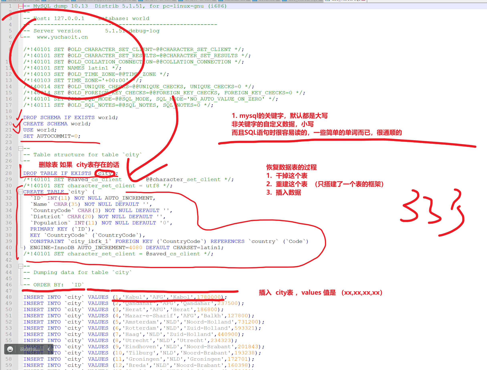


```
mysql的备份，恢复
就是俩过程
1. 备份，将当前的数据库，表，数据，全部导出为一个sql的文件

2. 恢复，原理就是，准备 一个文件，，里面是大量的，创建库，创建表，插入数据的SQL语句而已，重新执行一下


1.  bash命令行直接导入
[root@tech-db-51 ~]#mysql -uroot -plinux3306   <  /root/all_world.sql 
mysql: [Warning] Using a password on the command line interface can be insecure.
[root@tech-db-51 ~]#
[root@tech-db-51 ~]#
[root@tech-db-51 ~]#mysql -uroot -plinux3306 -e "show databases;"


2. mysql环境中，用source语句去导入

mysql> source  /root/test_db-master/employees.sql;

# 查看该数据库的 创建库的语句
# 很多现成的库，表，数据，都导出为,SQL语句 （拿到SQL，就表示可以创造数据了）
mysql> SHOW CREATE DATABASE employees;
+-----------+----------------------------------------------------------------------+
| Database  | Create Database                                                      |
+-----------+----------------------------------------------------------------------+
| employees | CREATE DATABASE `employees` /*!40100 DEFAULT CHARACTER SET latin1 */ |
+-----------+----------------------------------------------------------------------+
1 row in set (0.00 sec)


# 这是系统最终执行的SQL语句
CREATE DATABASE `employees` /*!40100 DEFAULT CHARACTER SET latin1 */

# 简写 
#/*!40100  是mysql自动生成的注释符，为了再不通mysql版本之间，让SQL兼容性更强，再不通的字符集下
#  latin1 不识别中文
#  utf8 识别中文

CREATE DATABASE  employees  DEFAULT   CHARACTER SET  latin1;


```


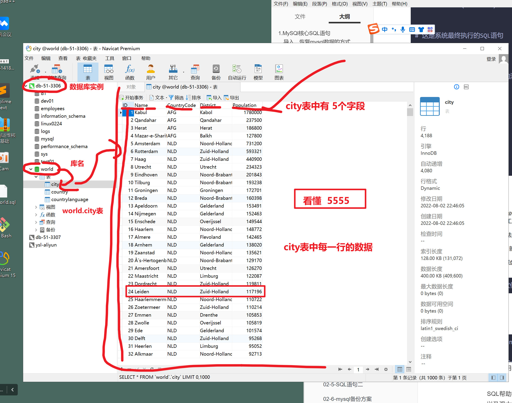


SQL，英文全称为Structured Query Language，中文意思是结构化查询语言，它是一种对关系型数据库中的数据进行定义和操作的语言，是大多数关系型数据库管理系统所支持的工业标准语言。

就像我们和bash打交道，要遵循bash的语法，然后可以对linux的数据，进行增删改查。

我们使用mysql这个工具，进行数据管理，就得遵循SQL专门的语法，进行存储、查询、更新、管理数据库内容。

SQL帮助我们不用关注数据到底是怎么在磁盘上存储的，通过高级SQL语言，能够非常简单的对数据管理，以及强大的灵活性，不同的数据库的SQL会有些差别。

```
用于关系型数据库，mysql这个软件中专有的查数据的语言，叫做结构化查询语言。
```


# 2.有关SQL的分类

```
DDL数据定义，全称为Data Definition Language

DQL数据查询语言，DQL，全称为Data Query Language

DCL授权控制,全称为Data Control Language

DML数据操作语言，DML，全称为Data Manipulation Language，中文为数据操作语言
```


# 1.查看四大SQL分类的介绍


## DQL数据查询语言

DQL，全称为Data Query Language，其语句也称为“数据检索语句”，作用是`从表中获取数据，确定数据应怎样在应用程序中给出。`

关键字SELECT是DQL（也是所有SQL）用得最多的，其他DQL常用的保留字有WHERE、ORDER BY、GROUP BY和HAVING。

```
查询
select关键字

查数据，各种丰富的查询姿势，排序查询，分组查询，过滤查询，
WHERE、ORDER BY、GROUP BY和HAVING。
```


这些单词就是我们这一节要学习的SQL语句，进行查询。

这些DQL保留字常与其他类型的SQL语句一起使用。具体语句示例如下：

```
select user,host from mysql.user order by user;

SELECT  USER();
SELECT DATABASE();

看来select 查询，可以查询表数据，也可以直接结合内置函数查看一些数据；

```


## DML数据操作语言

DML，全称为Data Manipulation Language，中文为数据操作语言。

其语句的关键字为`INSERT、UPDATE和DELETE`。它们分别用于添加、修改和删除表中的行（数据）。

```
单词很多自己，加油

insert 插入表数据
update 更新表数据
delete 删除表数据

```


## 注意大坑，delete，update，对表数据的行进行匹配操作

```
删，删哪一行数据？
更新，更新哪一行数据

```


具体语句示例如下：

```


delete from mysql.user where user=' ';

delete from mysql.user where user='root' and host='mysql-server56';

delete from mysql.user where user='root' and host='::1';

select user,host from mysql.user order by user;


```


--继续了


## TPL事务

全称为Transaction Processing Language，TPL语句用于确保被DML语句影响的表的所有行能够及时得到更新。

TPL语句包括BEGIN TRANSACTION、COMMIT和ROLLBACK。

```
mysql主流默认引擎是INNODB引擎，默认数据变动的操作，都是事务操作，具体什么是事务，学到数据备份，日志时候再去琢磨。


```


## DCL授权控制

全称为Data Control Language，这类语句通过GRANT或REVOKE授权用户许可，确定单个用户和用户组对数据库对象的访问。

某些RDBMS可用GRANT或REVOKE控制对表中单个列的访问。

也就是我们上一节学习的grant语句

```
create user pyyu@'%' identified by 'pyyu668';
show grants for pyyu@'%';
 grant select on luffy.* to 'pyyu'@'%' with grant option;
 show grants for pyyu@'%';
 
 

```


## ----运维和开发--SQL-----


> 运维主要关心数据库的架构维护、数据备份、基础数据的管理、但是一般不会修改数据表的结构
>
> 公司会有研发总监，CTO
>
> 数据库，表根据业务来的，电商，博客类网站，小程序等
>
> 数据表的设计，非常复杂，需要CTO去定义表与表的关系，然后交给开发小弟去写代码，
>
> 数据的增删改查
>
> 写代码，写了一个网站的功能，。方便用户
>
> 在页面上，查询商品，----select 数据表的行记录 。。。。
>
> 再页面上，发表博客，-=--数据表多行记录。。。
>
> 
>
> 用户发表文章 > 触发前端的请求 > 网页中某一个框里写的数据，被前端构造为了数据类型
>
> ↓
>
> 发给后端语言框架，php，python，接收到请求，对应的代码，链接上mysql数据库，插入一篇博客，php的代码，就被翻译为具体的SQL
> ↓
>
> mysql  3306 ，接收到一个指令 insert into  article  values(10,"基尼太美","两年半的运维");

听懂这部分逻辑，刷

主要以DDL类别工作为主，也就是数据定义，运维和开发都得掌握

- create
- alter
- drop

### 查看DDL语句具体信息

```
? Data Definition
数据定义


```

### DCL数据授权控制

一般是运维操作的多些

- grant
- revoke
- commit
- Rollback

```
? Account Management

```

### DML数据操作语言

开发要重点掌握的SQL，运维熟悉就好，也就是DML数据操作语言，因为网站有各式各样的数据写入、数据读取操作，这是开发对于表的设计，是开发必须重点掌握的技能。

运维无须像开发一样，了解各种业务表的结构、设计，只需要熟悉查询数据操作。

也就是DML语句

- select
- insert
- delete
- update

## -------开始DDL数据库定义语句篇


# 数据库对象管理


## 库管理

数据库的定义学习

- 创建
- 查看
- 删除


```
关于数据库的属性

- 数据库名

- 数据库属性、字符集、校对规则（大小写等）

# 列出当前实例中的所有库，以你当前登录的账号权限为结果
show databases;

# 查看以存在的数据库的信息

show create database 库的名字;

mysql> show create database employees;
+-----------+----------------------------------------------------------------------+
| Database  | Create Database                                                      |
+-----------+----------------------------------------------------------------------+
| employees | CREATE DATABASE `employees` /*!40100 DEFAULT CHARACTER SET latin1 */ |
+-----------+----------------------------------------------------------------------+
1 row in set (0.00 sec)


# 俩属性
1. 名字
2. 数据库的编码  latin1 该数据库下的表，就是不支持中文的

如何正确向数据库中写入中文 

3. 修改库、以及表的编码，都是utf8编码才行

# 数据库的属性查看，3点，刷3333理解了

先看库表的属性，然后再去操作即可


# 查看一个支持中文的数据库

show create database dev01;
mysql> show create database dev01;
+----------+-------------------------------------------------------------------+
| Database | Create Database                                                   |
+----------+-------------------------------------------------------------------+
| dev01    | CREATE DATABASE `dev01` /*!40100 DEFAULT CHARACTER SET utf8mb4 */ |
+----------+-------------------------------------------------------------------+
1 row in set (0.00 sec)


# 库是utf8mb4中文字符集的，该库下建的表，也都是该字符集

mysql> show tables from dev01;
Empty set (0.00 sec)


mysql> show tables from dev01;
Empty set (0.00 sec)

mysql> show tables from dev01;
+-----------------+
| Tables_in_dev01 |
+-----------------+
| t1              |
+-----------------+
1 row in set (0.00 sec)

mysql> # 查看表结构，表有哪些属性，字段;
mysql> 
mysql> 
mysql> desc dev01.t1;
+-------+--------------+------+-----+---------+-------+
| Field | Type         | Null | Key | Default | Extra |
+-------+--------------+------+-----+---------+-------+
| id    | int(11)      | NO   | PRI | NULL    |       |
| name  | varchar(255) | YES  |     | NULL    |       |
+-------+--------------+------+-----+---------+-------+
2 rows in set (0.00 sec)

mysql> # 建表，查看表结构，看懂222


# 如何看表详细信息
SHOW CREATE TABLE dev01.t1;

mysql> SHOW CREATE TABLE dev01.t1;
+-------+-----------------------------------------------------------------------------------------------------------------------------------------------+
| Table | Create Table                                                                                                                                  |
+-------+-----------------------------------------------------------------------------------------------------------------------------------------------+
| t1    | CREATE TABLE `t1` (
  `id` int(11) NOT NULL,
  `name` varchar(255) DEFAULT NULL,
  PRIMARY KEY (`id`)
) ENGINE=InnoDB DEFAULT CHARSET=utf8mb4 |
+-------+-----------------------------------------------------------------------------------------------------------------------------------------------+
1 row in set (0.00 sec)


# 建数据表的语句
 CREATE TABLE `t1` (
  `id` int(11) NOT NULL,
  `name` varchar(255) DEFAULT NULL,
  PRIMARY KEY (`id`)
) ENGINE=InnoDB DEFAULT CHARSET=utf8mb4


# 简写如下 
# 语法
create table  表名(字段名  字段数据类型,  字段2 字段数据类型, xxxx)  表字符集属性 ;

#改写案例
create table  t2  (id  int(11)  not null, name  varchar(255) default null ,primary key(id)  )      engine=innodb    default  charset=utf8mb4;


# 1. 关于创建数据表的图形化操作
# 2. show create table t1; 拿到建表语句
# 3 .模仿如何建表的语句编写，创建t2;

#  4. 要注意，建表 你当前再哪个库下
# 5.  建议如下写法 制定库，下的表
create table  dev01.t3  (id  int(11)  not null, name  varchar(255) default null ,primary key(id)  )      engine=innodb    default  charset=utf8mb4;

#  5个点，看懂了5555

# 休息会，动手练一练，这个5个点的操作


```


## 表对象

> 后面的数据库，建议都用图形化工具的 命令行终端去操作，对新手更友好。

```
用图形化工具，的

查询工具
↓
新建查询，制定查询某个实例，以及某个库
↓
库下的各种表

```


show create 库/表 ;

```
如何看库，的属性，详细信息

```


## navicat图形化的命令行玩法

```bash

-- # show DATABASES  查看实例下的所有库信息
-- 
-- #  查看库的详细属性，库，字符集
-- # show create database dev01;
-- # CREATE DATABASE `dev01` /*!40100 DEFAULT CHARACTER SET utf8mb4 */
-- 
-- 
-- # 查看数据表的详细属性
-- show create table  t1;

 
-- CREATE TABLE `t1` (
--   `id` int(11) NOT NULL,
--   `name` varchar(255) DEFAULT NULL,
--   PRIMARY KEY (`id`)
-- ) ENGINE=InnoDB DEFAULT CHARSET=utf8mb4

--  再图形化工具中，选中多行，ctrl + /  可以多行，批量注释的玩法

-- show databases;

-- 看懂注释的用法，刷111
```


即可看到库表的创建属性，创建SQL语句。


```
show create 库/表 ;

即可看到库表的创建属性，创建SQL语句。


数据库.数据表名


1. 数据表的名字

2. 数据表，里面有一堆字段，字段（名字，数据类型，约束条件 ）

    
    


select Host,User from mysql.user;


desc mysql.user;


-- 数据库.数据表名
-- 
-- 
-- 1. 数据表的名字
-- 
-- 2. 数据表，里面有一堆字段，字段（名字，数据类型，约束条件 ）
-- 
--     

-- show create table t3;
-- 
-- CREATE TABLE `t3` (
--   `id` int(11) NOT NULL,
--   `name` varchar(255) DEFAULT NULL,
--   PRIMARY KEY (`id`)
-- ) ENGINE=InnoDB DEFAULT CHARSET=utf8mb4

-- 表 名字  t3
-- 
-- 字段
-- id     数据类型  int(11)     约束条件  NOT NULL ，不为空
-- 
-- name   varchar(255) 约束条件    DEFAULT NULL  该字段，插入数据的时候，如果不指定name的值，默认填入null
-- 
-- 
-- 约束条件，   PRIMARY KEY  给 id字段单独添加的约束  
-- 这个叫做主键 （非空且唯一，  not null   UNIQUE    ）
-- 该字段必须 必须有值，not null，非空
-- UNIQUe  该字段的值，不能重复
-- 听懂 1111，带你来看结果

```


```
-- 数据库.数据表名
-- 
-- 
-- 1. 数据表的名字
-- 
-- 2. 数据表，里面有一堆字段，字段（名字，数据类型，约束条件 ）
-- 
--     

-- show create table t3;
-- 
-- CREATE TABLE `t3` (
--   `id` int(11) NOT NULL,
--   `name` varchar(255) DEFAULT NULL,
--   PRIMARY KEY (`id`)
-- ) ENGINE=InnoDB DEFAULT CHARSET=utf8mb4

-- 表 名字  t3
-- 
-- 字段
-- id     数据类型  int(11)     约束条件  NOT NULL ，不为空
-- 
-- name   varchar(255) 约束条件    DEFAULT NULL  该字段，插入数据的时候，如果不指定name的值，默认填入null
-- 
-- 
-- 约束条件，   PRIMARY KEY  给 id字段单独添加的约束  
-- 这个叫做主键 （非空且唯一，  not null   UNIQUE    ）
-- 该字段必须 必须有值，not null，非空
-- UNIQUe  该字段的值，不能重复
-- 听懂 1111，带你来看结果

-- 基于图形化的，数据插入，查看约束条件的作用
--  insert 语句，留明天将

-- 测试，id字段，是否能留空，以及是否能重复

-- 测试name字段的玩法 ，1 字符串的长度，2， 字符串有默认值 null 
-- mysql的数据表的，字段测试，  
-- 约束条件  PRIMARY key  ，not null   UNIQUE
--  约束条件 DEFAULT NULL 

-- 测字段的数据类型，1， 值要和类型对应 ，2  范围别超出了
-- 记住 int记住 有取值范围就行   id  int  (-2 147 483 64 ~  2 147 483 647)  ，负数，正数
-- 214748364
-- 字符串后面的括号，表示字符的个数  

```

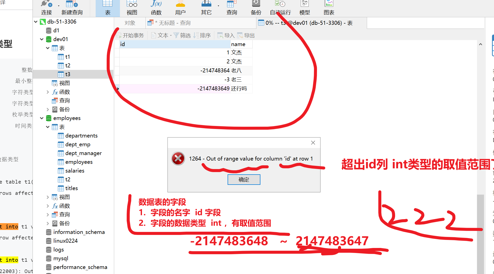


# 小结数据表的属性

- 表有名字
  - 表的字符集（utf8mb4 可以写入  “急钮太美”中文 ）
- 表有字段的设置
  - 字段 ----名字
  - 字段---数据类型 --符合业务逻辑


## 字符集

```
mysql无法正确读写中文，是很多新手头疼的问题，环境问题，运维最拿手

背景问题
1. 再linux上 select 能读出来中文
2. 代码执行，客户端读的是乱码


如何解决
1. 所有终端，都得支持 utf8中文


1.    你用的什么终端工具   xshell要配置是中文


2.     服务端，也得支持中文， ，，库 表都是utf8的

mysql> show create table t3;
+-------+---------------------------------------------------------------------------------------------------------------------------------------------+
| Table | Create Table                                                                                                                                |
+-------+---------------------------------------------------------------------------------------------------------------------------------------------+
| t3    | CREATE TABLE `t3` (
  `id` int(11) NOT NULL,
  `name` varchar(4) DEFAULT NULL,
  PRIMARY KEY (`id`)
) ENGINE=InnoDB DEFAULT CHARSET=utf8mb4 |
+-------+---------------------------------------------------------------------------------------------------------------------------------------------+
1 row in set (0.00 sec)


# 什么情况下，读不出中文
# 客户端，无法解码，utf8的编码数据

# 

```


> 我们如果想正确的读写mysql的中文数据，需要保证服务端、客户端的字符集一致
>
> 服务端是我们的mysql，客户端的形式有很多了，可能是xshell，navicat，程序等等
>
> 服务端mysql的编码设置与查看


```
# 全世界，能处理中国业务的，数据库，都会用utf8，以及可以识别大多数国家的语言，如中文，法文

# 
# 查看mysql服务端，支持哪些编码
# 查看当前mysql 5.7.28 支持哪些字符集
# 如果是非中国汉字的业务，处理如 非洲的业务啊，用非洲对应的编码表，为的是节省磁盘空间

# 2选择，支持中文的，mysql5.7之前 大多用 utf8编码
# mysql5.7 到 8.0之后，mysql默认用 utf8mb4 效率更高，支持的符号更多

show character set;
#
show variables like '%char%';
show variables like 'collation%';


# 查看当前mysql支持哪些字符集
# show character set;

# 显示当前mysql数据库的变量信息，基于变量名匹配
#  ********char********  这就是 百分号再数据库的作用
-- show variables like '%char%';
#   找出以 collation******* 变量 
#  

# 精确查找 变量名  coll 
-- show variables like 'coll';

# 能查到东西吗？ 3   4   
# 找出 coll****************** 结尾的变量
#  % 任意匹配 
show variables like 'coll%';


```

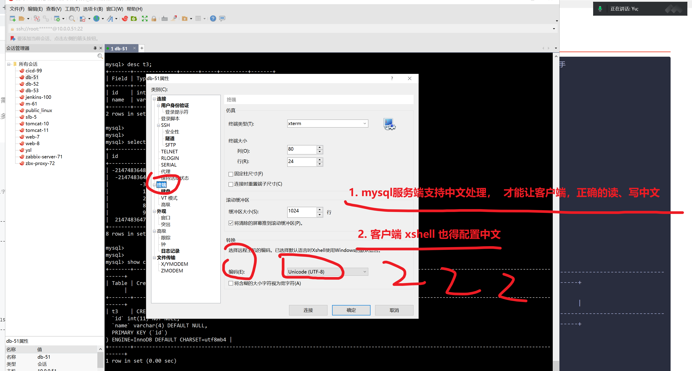


## 如何处理无法读取数据库中文的问题

```
-- 1. 查看当前数据库，默认是什么字符集


# SHOW VARIABLES  LIKE  '%char%'


# character_set_server ，默认值， 这个的值，是utf8，否则默认创建的库，表你看看字符集


# 2.要修改数据库默认的编码支持，建议直接加入my.cnf 重启即可
SQL修改以存在的数据库的编码


3. 修改my.cnf

[mysqld]

character_set_server=utf8mb4
log-error=/linux0224/mysql_3306/logs/3306-err.log
port=3306
user=mysql
basedir=/opt/mysql
datadir=/linux0224/mysql_3306/
socket=/tmp/mysql.sock

[mysql]
socket=/tmp/mysql.sock


4.重启mysql即可，继续查看系统默认编码支持

[root@tech-db-51 ~]#systemctl restart mysqld


[root@tech-db-51 ~]#

mysql> show variables like '%char%'
    -> ;
+--------------------------+----------------------------------------------------------+
| Variable_name            | Value                                                    |
+--------------------------+----------------------------------------------------------+
| character_set_client     | utf8                                                     |
| character_set_connection | utf8                                                     |
| character_set_database   | utf8mb4                                                  |
| character_set_filesystem | binary                                                   |
| character_set_results    | utf8                                                     |
| character_set_server     | utf8mb4                                                  |
| character_set_system     | utf8                                                     |
| character_sets_dir       | /opt/mysql-5.7.28-linux-glibc2.12-x86_64/share/charsets/ |
+--------------------------+----------------------------------------------------------+
8 rows in set (0.00 sec)


5. 我希望，至少有一个人能回应我，我动力还足一点

6.再次创建数据库，表查看，字符集
mysql> create database testdb2;
Query OK, 1 row affected (0.00 sec)

mysql> show create database testdb2;
+----------+---------------------------------------------------------------------+
| Database | Create Database                                                     |
+----------+---------------------------------------------------------------------+
| testdb2  | CREATE DATABASE `testdb2` /*!40100 DEFAULT CHARACTER SET utf8mb4 */ |
+----------+---------------------------------------------------------------------+
1 row in set (0.00 sec)

mysql> create table testdb2.t1(id int,name char(10));
Query OK, 0 rows affected (0.00 sec)

mysql> 
mysql> 
mysql> show create table  testdb2.t1;
+-------+-------------------------------------------------------------------------------------------------------------------------+
| Table | Create Table                                                                                                            |
+-------+-------------------------------------------------------------------------------------------------------------------------+
| t1    | CREATE TABLE `t1` (
  `id` int(11) DEFAULT NULL,
  `name` char(10) DEFAULT NULL
) ENGINE=InnoDB DEFAULT CHARSET=utf8mb4 |
+-------+-------------------------------------------------------------------------------------------------------------------------+
1 row in set (0.00 sec)

mysql> # 到这完全看懂 666
mysql> 


```

### 测试插入中文表数据

```
# 往t1表中插入数据
# 由于没给id字段设置主键，因此必须手动加入 id的值

insert into  t1  VALUES(1,'刘永飞');
insert into t1 values(2,"张鑫")


```


### 查询数据

```
# 往t1表中插入数据
# 由于没给id字段设置主键，因此必须手动加入 id的值

-- insert into  t1  VALUES(1,'刘永飞');
-- insert into t1 values(2,"张鑫")


# 制定字段查询数据

-- select id , name from  t1;

-- select name,id from t1;

# 不得查询不存在的字段

select  hobby from t1;


```


### 常用字符集，字符序组合


记住如下用法


```
utf-8        最大支持3字节的字符，也就是中文汉字，不支持emoji符号
utf8mb4    最大支持4字节的字符，支持emoji字符
mysql8.0之前，默认字符集是latin1 
8.0之后默认utf8mb4 ，目前主流网站肯定都是支持表情符号的，如emoji 😄这类。

https://www.cnblogs.com/chyingp/p/mysql-character-set-collation.html
阿里技术专家的博客


```


# 4.数据表（数据属性）

```
查看表的细节属性，数据类型

```

数据类型，是开发用于进行表设计，如何存储网站数据，以及如何设计数据类型的精确长度，如存储姓名，年龄，工资记录，博文数据等。

还有更严谨的如银行，保险企业，需要对数据进行高精度的小数点保留，就得对表设计谨慎又谨慎。

就得关注各个数据类型的区别，细节，以及mysql不同版本的引擎，会导致什么问题，这就得开发+DBA（专门维护数据库方向的运维工程师），结合设计。


## 数字，数据类型

MySQL 中定义数据字段的类型对你数据库的优化是非常重要的。

MySQL 支持多种类型，大致可以分为三类：数值、日期/时间和字符串(字符)类型。

MySQL 支持所有标准 SQL 数值数据类型。

这些类型包括严格数值数据类型(INTEGER、SMALLINT、DECIMAL 和 NUMERIC)，以及近似数值数据类型(FLOAT、REAL 和 DOUBLE PRECISION)。

关键字INT是INTEGER的同义词，关键字DEC是DECIMAL的同义词。

BIT数据类型保存位字段值，并且支持 MyISAM、MEMORY、InnoDB 和 BDB表。

作为 SQL 标准的扩展，MySQL 也支持整数类型 TINYINT、MEDIUMINT 和 BIGINT。下面的表显示了需要的每个整数类型的存储和范围。


## 字符串类型

字符串类型指CHAR、VARCHAR、BINARY、VARBINARY、BLOB、TEXT、ENUM和SET。该节描述了这些类型如何工作以及如何在查询中使用这些类型。


## 日期和时间类型

表示时间值的日期和时间类型为DATETIME、DATE、TIMESTAMP、TIME和YEAR。

每个时间类型有一个有效值范围和一个"零"值，当指定不合法的MySQL不能表示的值时使用"零"值。

TIMESTAMP类型有专有的自动更新特性，将在后面描述。


# 5.数据表（列约束）

## 主键 primary key 简称pk

```
特点
1. 一张表，只能有一个pk，可以由多个列构成
2. 等于 唯一约束（Unique Key）和非空约束（NOT NULL） 的组合
3. 建议每张表都要设置主键，便于索引的应用，一般都以id列为主键，是默认自增的数字列。

```

非空+唯一的特点，因此每一张数据表的第一个字段，如id列，就必然会使用主键了。


```
1. 拿一个测试的表，t1表，默认id 列没有主键，不存在自增，非空且唯一


2. 修改表字段约束，id 设置，2个约束，自增，主键

```

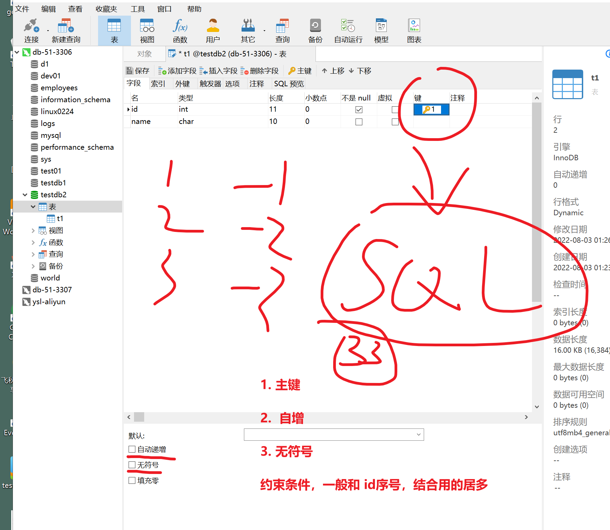


```
测试该新表的数据写入
show create table t1;

# SQL熟练之后，很多关键字，用图形化工具，自动生成SQL，拿去用
# 你已经很熟悉SQL语句 

# t1表 （ 字段的 数据类型 约束条件）   给这个表设置 属性，如字符集
# 这个技巧看懂刷1111
# 跟着这个语法，一步步捋顺了就行，不一定一次就写对，会修改即可
# 熟练SQL之后，图形化点点就行


CREATE TABLE `t1` (
  `id` int(11) unsigned NOT NULL AUTO_INCREMENT,
  `name` char(10) DEFAULT NULL,
  PRIMARY KEY (`id`)
) ENGINE=InnoDB AUTO_INCREMENT=3 DEFAULT CHARSET=utf8mb4

#  AUTO_INCREMENT 记录该表记录的插入行号


# 测试数据插入
# 插入数据 
insert into t1(name) values('老刘玉');
insert into t1(name) values('纪晓岚');
insert into t1(name) values('和珅');

# 查看数据

```


# 如何查看数据表记录，主键增长步长规则

```
mysql> # 内置变量
mysql> show VARIABLES like '%incr%'
    -> ;
+-----------------------------+-------+
| Variable_name               | Value |
+-----------------------------+-------+
| auto_increment_increment    | 1     |
| auto_increment_offset       | 1     |
| div_precision_increment     | 4     |
| innodb_autoextend_increment | 64    |
+-----------------------------+-------+
4 rows in set (0.00 sec)

# 默认自增的步长是 1
mysql> insert into t1(name) values('坚持住，都是好货');
Query OK, 1 row affected (0.00 sec)

mysql> 
mysql> 
mysql> select * from t1;
+----+--------------------------+
| id | name                     |
+----+--------------------------+
|  1 | 刘永飞                   |
|  2 | 张鑫                     |
|  3 | 老刘玉                   |
|  4 | 纪晓岚                   |
|  5 | 和珅                     |
|  6 | 坚持住，都是好货         |
+----+--------------------------+
6 rows in set (0.00 sec)

mysql> 

mysql> show variables like '%incr%';
+-----------------------------+-------+
| Variable_name               | Value |
+-----------------------------+-------+
| auto_increment_increment    | 1     |
| auto_increment_offset       | 1     |
| div_precision_increment     | 4     |
| innodb_autoextend_increment | 64    |
+-----------------------------+-------+
4 rows in set (0.00 sec)


# 修改步长为2，每次id+2，纯属练习去了解


set 修改mysql的内置变量

set @@auto_increment_increment=2;

# 再次插入t1表的数据


mysql> insert into t1(name)  values('睡着了扣666');
Query OK, 1 row affected (0.00 sec)

mysql> insert into t1(name)  values('睡着了扣666');
Query OK, 1 row affected (0.00 sec)

mysql> 
mysql> select * from t1;
+----+--------------------------+
| id | name                     |
+----+--------------------------+
|  1 | 刘永飞                   |
|  2 | 张鑫                     |
|  3 | 老刘玉                   |
|  4 | 纪晓岚                   |
|  5 | 和珅                     |
|  6 | 坚持住，都是好货         |
|  7 | 睡着了扣666              |
|  9 | 睡着了扣666              |
| 11 | 睡着了扣666              |
| 13 | 睡着了扣666              |
+----+--------------------------+
10 rows in set (0.00 sec)


```


## 非空 not null

```
该字段必须写入数据
建议每一列都设置，便于索引应用

```

## 唯一性 unique key

```
该列的值不得重复，你比如存储身份证号的列，每一个人的号码都是唯一，不得重复，得必须有数据的

```


## 无符号 unsingned

```
针对数字数据类型而言，是否有符号，如负数

```


## 其他属性

```
1.表属性
engine，存储引擎类型，默认是innodb
charset，字符集，utf8mb4
comment，注释


列属性
default ，也就是字段的默认值，一般和not null不为空结合用，设置个默认值，如性别不选，默认是男

auto_increment，数字字段，自增长，一般配合主键使用，如用户信息表，id依次的+1

comment，列的注释

```


数据类型就到这。


# ----今天就到这里，作业，看笔记，完整数据库操作熟练度----

1. 整理笔记
2. 完成脑图的补充，搭建自己的mysql知识点宫殿

3.预习SQL玩法，多动手敲


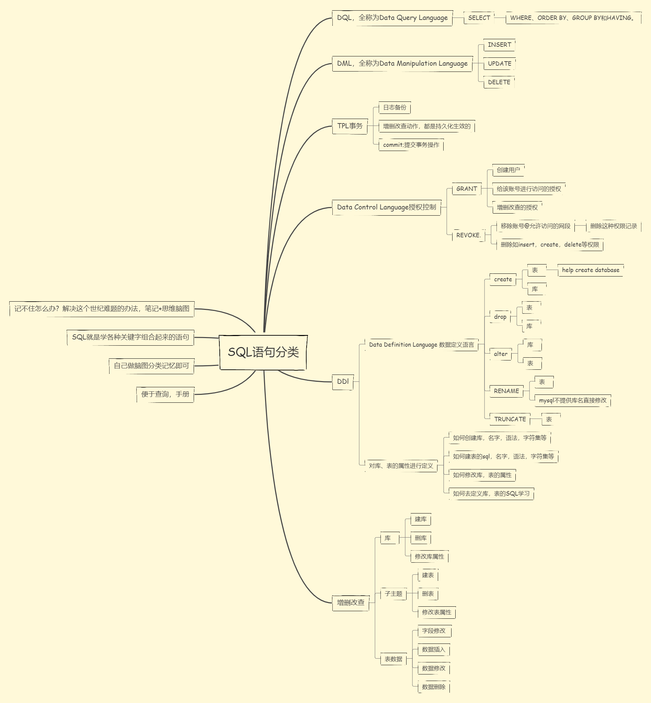


# -----今日内容----SQL篇二-----

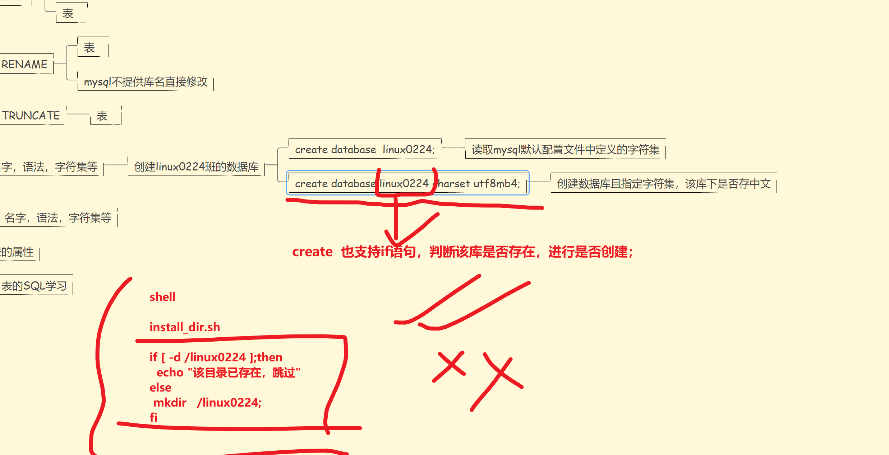


10.20继续

画面没问题，上课1111


# -----6.DDL数据库定义语言-----


## 定义库，定义表

```
CREATE TABLE linux0224.students1 (
	id INT(11) NOT NULL   AUTO_INCREMENT,  
	name CHAR ( 3 ) NOT NULL DEFAULT '蔡旭困',
	age tinyint(3) UNSIGNED,
	height FLOAT ( 4, 1 ) UNSIGNED,
	weight FLOAT ( 5, 2 ) UNSIGNED,
	address CHAR ( 255 ) NOT NULL DEFAULT '扔到山西去挖煤',
	phone_num CHAR ( 11 ) NOT NULL UNIQUE ,
PRIMARY KEY ( id ) 
) DEFAULT CHARSET = utf8mb4;


# 
```

## 具体字段的数据插入

```
验证数据类型，约束条件的结果

先来几条正常的数据

```


DDL的特点是对数据库内部的对象进行创建、修改、删除等操作，不涉及对表中内容的操作和更改。

这部分是运维人员或DBA需要熟练掌握的内容，开发人员了解即可。

全称为Data Definition Language，其语句包括动词CREATE、DROP和ALTER。可使用该语言在数据库中创建新库表或删除库表，或者为表添加字段、索引等。

> 创建数据库

不得已数字开头，大小写不敏感

## 1.1 数据库部分

```
1. 库名不得以数字开头
2. 库名和业务有关，见名知意
3. 库名不得有大写字母

都是为了多系统平台的兼容性

4.创建数据库需要有指定的字符集，建议设定默认规则就是utf8mb4

5.生产环境下，禁用普通用户的drop database权限

```


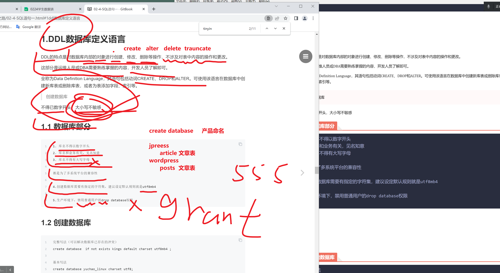


## 1.2 创建数据库

```
完整写法
create database  if not exists kings default charset utf8mb4 ;

关于创建数据库，数据表的技巧性玩法，以及学习方法。


基本写法
create database yuchao_linux charset utf8;
create database yuchao_linux charset utf8mb4;

```


## 1.3 查看数据库

```
show databases;
# 查看show create帮助信息
help show create database


具体用法

show create database yuchao_linux;
show create database kings;

```

## 1.4 修改数据库字符集

```
#  查看某个库，是什么字符集
show create database yuchao_linux;


语法
ALTER  DATABASE 库名  CHARSET 新的字符集

#先列出当前数据库所有的字符集

mysql> show create database testdb2;
+----------+---------------------------------------------------------------------+
| Database | Create Database                                                     |
+----------+---------------------------------------------------------------------+
| testdb2  | CREATE DATABASE `testdb2` /*!40100 DEFAULT CHARACTER SET utf8mb4 */ |
+----------+---------------------------------------------------------------------+
1 row in set (0.00 sec)


# 改成 latin1字符集
语法
ALTER  DATABASE 库名  CHARSET 新的字符集

alter database   testdb2 charset  latin1;

# 看懂alter修改库的字符集语法 刷111
# 库名 支持alter直接修改吗？
不支持
 


```


## 1.5 设置mysqld默认字符集

配置文件

```
[root@db-51 ~]#cat /etc/my.cnf 
[mysqld]
character_set_server=utf8mb4
port=3306
user=mysql
basedir=/opt/mysql
datadir=/www.yuchaoit.cn/mysql_3306
socket=/tmp/mysql.sock

[mysql]
socket=/tmp/mysql.sock


重启
[root@db-51 ~]#systemctl restart mysql
```

再次创建数据库试试

```
mysql> create database kings_linux;
Query OK, 1 row affected (0.00 sec)

mysql> show create database kings_linux;
+-------------+-------------------------------------------------------------------------+
| Database    | Create Database                                                         |
+-------------+-------------------------------------------------------------------------+
| kings_linux | CREATE DATABASE `kings_linux` /*!40100 DEFAULT CHARACTER SET utf8mb4 */ |
+-------------+-------------------------------------------------------------------------+
1 row in set (0.00 sec)
```


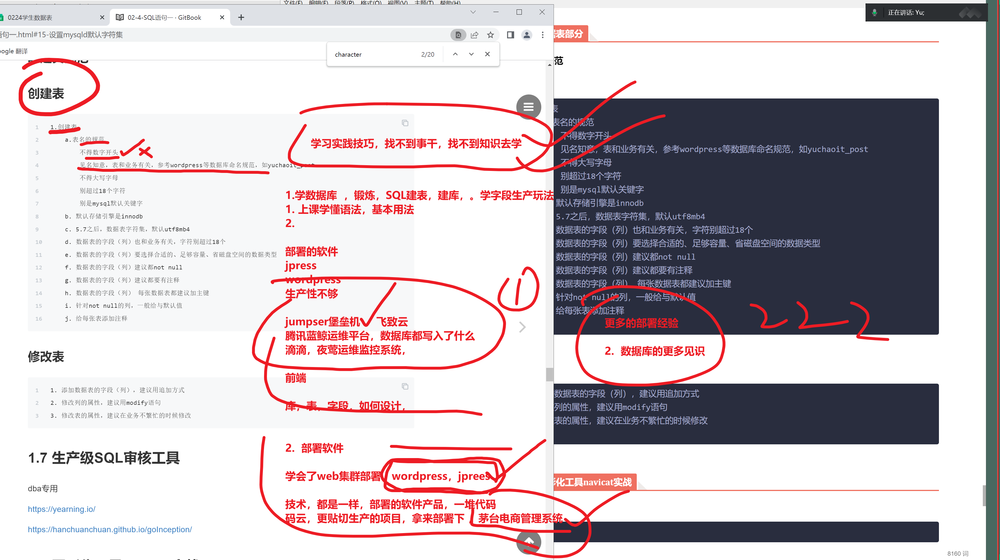


## 1.6 数据表部分

### 表定义规范

### 创建表

```
1.创建表
    a.表名的规范
        不得数字开头
        见名知意，表和业务有关，参考wordpress等数据库命名规范，如yuchaoit_post
        不得大写字母
        别超过18个字符
        别是mysql默认关键字
    b. 默认存储引擎是innodb
    c. 5.7之后，数据表字符集，默认utf8mb4
    d. 数据表的字段（列）也和业务有关，字符别超过18个
    e. 数据表的字段（列）要选择合适的、足够容量、省磁盘空间的数据类型
    f. 数据表的字段（列）建议都not null
    g. 数据表的字段（列）建议都要有注释
    h. 数据表的字段（列） 每张数据表都建议加主键
    i. 针对not null的列，一般给与默认值
    j. 给每张表添加注释

```


### 修改表

```
1. 添加数据表的字段（列），建议用追加方式
2. 修改列的属性，建议用modify语句
3. 修改表的属性，建议在业务不繁忙的时候修改

```

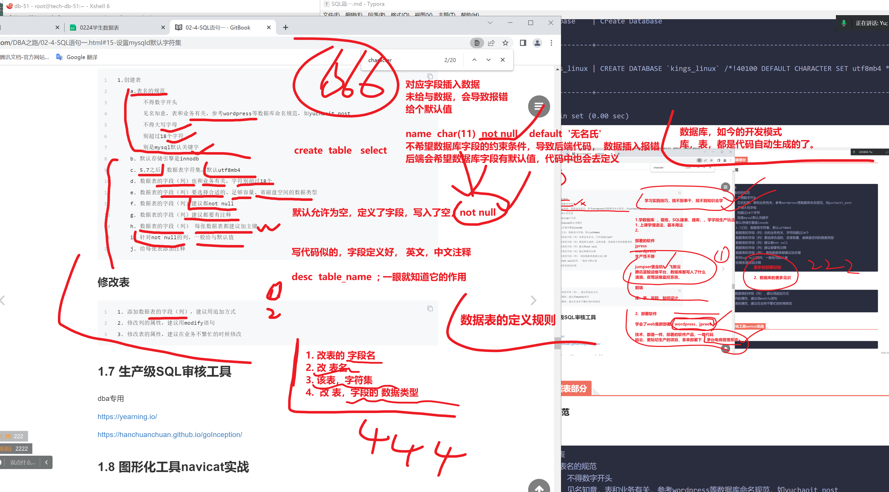


## 1.8 图形化工具navicat实战

建表，有2个玩法


```
1.  图形化 建表 >  SQL 语句

2.  纯属带着大家玩一玩，SQL，如何去图形化去创建

```


### 创建库

```

```

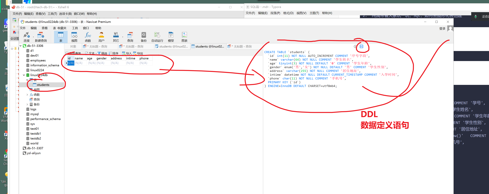


### 创建表

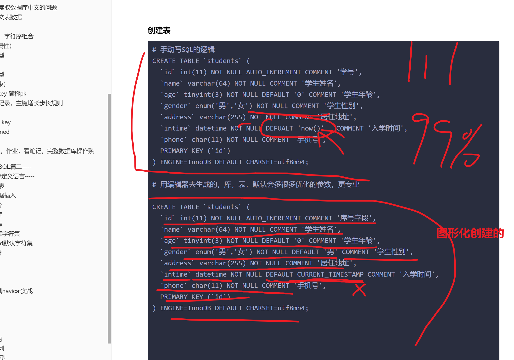

```
# 手动写SQL的逻辑
# 建议用这个写法，到这看懂刷666，休息一会

11. 50继续


CREATE TABLE `students1` (
  `id` int(11) NOT NULL AUTO_INCREMENT COMMENT '学号',
  `name` varchar(64) NOT NULL COMMENT '学生姓名',
  `age` tinyint(3) NOT NULL DEFAULT '0' COMMENT '学生年龄',
  `gender` enum('男','女') NOT NULL COMMENT '学生性别',
  `address` varchar(255) NOT NULL COMMENT '居住地址',
  `intime` datetime NOT NULL DEFAULT now()   COMMENT '入学时间',
  `phone` char(11) NOT NULL COMMENT '手机号',
  PRIMARY KEY (`id`)
) ENGINE=InnoDB DEFAULT CHARSET=utf8mb4;

# 分别插入2个表数据
# 【建议写法，对应每一个字段，按顺序去写，按顺序去插入values的值】
# 建议按如下最规范的写法，记忆即可
# 完整的字段写法，值对应

insert into  students1(name,age,gender,address,intime,phone) values('亮亮',22,'女','深圳第一靓仔',now(),'15211111111')


# 黄岩 同学
#时间字段就别写了

insert into  students1(name,age,gender,address,phone) values('黄岩',21,'男','茂名第一靓仔','13288888888')

mysql> select * from students1;
+----+--------+-----+--------+--------------------+---------------------+-------------+
| id | name   | age | gender | address            | intime              | phone       |
+----+--------+-----+--------+--------------------+---------------------+-------------+
|  1 | 亮亮   |  22 | 女     | 深圳第一靓仔       | 2022-08-03 11:33:49 | 15211111111 |
|  2 | 黄岩   |  21 | 男     | 茂名第一靓仔       | 2022-08-03 11:36:16 | 13288888888 |
+----+--------+-----+--------+--------------------+---------------------+-------------+
2 rows in set (0.01 sec)

# 小结，手写的建表语句，以及各种数据类型的数据插入 OK了


# 字段，和值的顺序非有序的写。。


# 用编辑器去生成的，库，表，默认会多很多优化的参数，更专业

CREATE TABLE `students3` (
  `id` int(11) NOT NULL AUTO_INCREMENT COMMENT '序号字段',
  `name` varchar(64) NOT NULL COMMENT '学生姓名',
  `age` tinyint(3) NOT NULL DEFAULT '0' COMMENT '学生年龄',
  `gender` enum('男','女') NOT NULL DEFAULT '男' COMMENT '学生性别',
  `address` varchar(255) NOT NULL COMMENT '居住地址',
  `intime` datetime NOT NULL DEFAULT CURRENT_TIMESTAMP COMMENT '入学时间',
  `phone` char(11) NOT NULL COMMENT '手机号',
  PRIMARY KEY (`id`)
) ENGINE=InnoDB DEFAULT CHARSET=utf8mb4;

insert into  students3(name,age,gender,address,phone) values('黄岩',21,'男','茂名第一靓仔','13288888888');

# 仅仅查询部分字段  id,name,shijian,dizhi

select id,name,intime,address from students3;


# enum(多选一)
enum('男','女','未知')

# datetime  年-月-日 时:分:秒
# 直接拿到数据插入的当前系统时间
# 淘宝下单，2022-8-3 11：22下的单

```


### 命令行工具

```
select user();
show databases;
show create database yuchaoit_mysql;
show create table students;
select database();
desc students;

```


### ---------复制数据表-----------

```
关于数据库，入门阶段，SQL比较重要的 
库，定义库，名，字符集
表，表名，字段，数据类型，字符集等

1. 对，库，表的修改类的操作

2. 数据表会定义了，增删改查，插入数据，查询数据


```


```
# 复制一张数据表的玩法

# 拿到第一张表的建表SQL，改个名，即可 
show create table  students1;


# 方法2
mysql> create table  students4 like students3;
Query OK, 0 rows affected (0.01 sec)

mysql> 
mysql> desc students4;
+---------+-------------------+------+-----+-------------------+----------------+
| Field   | Type              | Null | Key | Default           | Extra          |
+---------+-------------------+------+-----+-------------------+----------------+
| id      | int(11)           | NO   | PRI | NULL              | auto_increment |
| name    | varchar(64)       | NO   |     | NULL              |                |
| age     | tinyint(3)        | NO   |     | 0                 |                |
| gender  | enum('男','女')   | NO   |     | 男                |                |
| address | varchar(255)      | NO   |     | NULL              |                |
| intime  | datetime          | NO   |     | CURRENT_TIMESTAMP |                |
| phone   | char(11)          | NO   |     | NULL              |                |
+---------+-------------------+------+-----+-------------------+----------------+
7 rows in set (0.00 sec)

mysql> # 完全一样的2个表，看懂222


```


## ---------1.9 修改表结构alter语句-------

咱就不用图形化操作了，学习底层的SQL语句

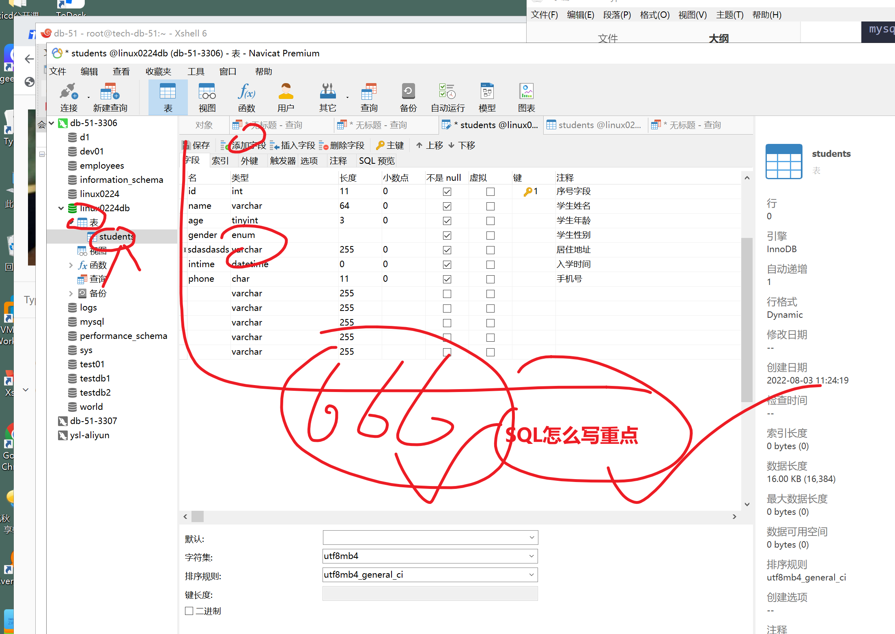


## =====alter语法========

```
语法

ALTER TABLE  表名  具体的动作    


# 给表添加字段
ALTER TABLE  表名  ADD

# 再第一行添加 first
ALTER  TABLE  表  ADD COLUMN  字段名  数据类型  约束条件 注释  first;


# 再后个字段后面添加 after

ALTER TABLE  表  ADD  COLUMN  字段 数据类型 约束 注释   AFTER  哪个字段后添加;


# 修改表字段属性， 名，数据类型 
ALTER TABLE  表名  change

ALTER TABLE  表名  modify

# 删除某个字段

ALTER TABLE  表名  drop  字段名


# 看懂666

```


### 结尾加入一列

> 给students表添加一个兴趣字段，hobby 要求只能输入20个汉字以内（20）

```
desc yuchao_linux.students;
# 语法

ALTER  TABLE  表  ADD COLUME  字段名  数据类型  约束条件 注释;
# 再字段结尾加入一个hobby
#单词，多敲敲

alter table  students4 add column  hobby char(20) not null  default '看美女'  comment '兴趣爱好';


# ctrl +c
# ctrl + v

# 插入数据，查看默认值的兴趣爱好

insert into  students4(name,age,gender,address,phone) values('黄岩',21,'男','茂名第一靓仔','13288888888');


alter table yuchao_linux.students add column hobby char(20) not null  default '学习' comment '学生爱好';


```


## tip:补充float类型

```
mysql的float语法

height float(总共有多少位,小数点后有几位)

```

> alter语句常用于修改数据表的属性，结构。

### 在第一列添加

添加身高字段，要求不超过3位数，有一位小数

```


#  学习的学校 加一个字段
# 语法
ALTER  TABLE  表  ADD COLUME  字段名  数据类型  约束条件 注释;


alter table  students4 add column  study_school char(20) not null  default '猿来教育'  comment '学习的学校' first;


alter table yuchao_linux.students add column height float(4,1)  default null comment '学生身高' first;

```


### 在指定字段后添加

```
ALTER TABLE  表  ADD  COLUMN  字段 数据类型 约束 注释   AFTER  哪个字段后添加;


# 想在intime前面加一个study_school

ALTER TABLE students4 add column  study_school char(15) not null comment '学习的学校' after address;


# 再制定字段，前，后，加入新字段，fisrt或 after来实现
# 看懂2222


```


## 

```


```


### 删除字段

```

ALTER TABLE students4 DROP  study_school;

```


## 1.10 修改表属性

### 修改字段的数据类型，综合修改练习


```
mysql> desc students4;
+--------------+-------------------+------+-----+-------------------+----------------+
| Field        | Type              | Null | Key | Default           | Extra          |
+--------------+-------------------+------+-----+-------------------+----------------+
| id           | int(11)           | NO   | PRI | NULL              | auto_increment |
| name         | varchar(64)       | NO   |     | NULL              |                |
| age          | tinyint(3)        | NO   |     | 0                 |                |
| gender       | enum('男','女')   | NO   |     | 男                |                |
| address      | varchar(255)      | NO   |     | NULL              |                |
| study_school | char(15)          | NO   |     | NULL              |                |
| intime       | datetime          | NO   |     | CURRENT_TIMESTAMP |                |
| phone        | char(11)          | NO   |     | NULL              |                |
| hobby        | char(20)          | NO   |     | 看美女            |                |
+--------------+-------------------+------+-----+-------------------+----------------+


# 不为空，的就给加个约束条件，默认值
# 为空，不需要默认值
# 批量修改表结构，可以保持不变

| students4 | CREATE TABLE `students4` (
  `id` int(11) NOT NULL AUTO_INCREMENT COMMENT '序号字段',
  `name` varchar(64) NOT NULL COMMENT '学生姓名',
  `age` tinyint(3) NOT NULL DEFAULT '0' COMMENT '学生年龄',
  `gender` enum('男','女') NOT NULL DEFAULT '男' COMMENT '学生性别',
  `address` varchar(255) NOT NULL COMMENT '居住地址',
  `study_school` char(15) NOT NULL COMMENT '学习的学校',
  `intime` datetime NOT NULL DEFAULT CURRENT_TIMESTAMP COMMENT '入学时间',
  `phone` char(11) NOT NULL COMMENT '手机号',
  `hobby` char(20) NOT NULL DEFAULT '看美女' COMMENT '兴趣爱好',
  PRIMARY KEY (`id`)
) ENGINE=InnoDB AUTO_INCREMENT=2 DEFAULT CHARSET=utf8mb4     


name   not null default "佚名"
age    不变
gender enum 必须不为空，且有默认值 
address   允许为空
study_school char(15) not null  default '猿来教育' comment '学校';
intime
phone char(11)   not null default '15211111111' comment '手机号';
hobby not null default '看美女'


# 语法，用modify修改表的字段属性，注意，原本的属性如果不修改的话，也要原封不动的写上，否则，会按你写的语句，重新修改所有的字段


ALTER TABLE <表名> MODIFY <字段名> <新的完整的数据类型> <约束条件>


# name字段
# 看懂刷111
# alter的modify关键字，是对字段的，完整属性，全部修改，听懂666

ALTER TABLE students4 MODIFY  name  varchar(5) NOT NULL default "佚名" COMMENT '姓名';

# 修改address ，看懂111
ALTER TABLE students4 MODIFY  address varchar(255)  COMMENT '居住地址';


# 修改study_school，看懂技巧1111
ALTER TABLE students4 MODIFY  study_school char(15) not null  default '猿来教育' comment '学校';

# 修改phone
alter table students4 modify  phone char(11)   not null default '15211111111' comment '手机号';


# 检查最终的表结构，字段属性
mysql> desc students4;
+--------------+-------------------+------+-----+-------------------+----------------+
| Field        | Type              | Null | Key | Default           | Extra          |
+--------------+-------------------+------+-----+-------------------+----------------+
| id           | int(11)           | NO   | PRI | NULL              | auto_increment |
| name         | varchar(5)        | NO   |     | 佚名              |                |
| age          | tinyint(3)        | NO   |     | 0                 |                |
| gender       | enum('男','女')   | NO   |     | 男                |                |
| address      | varchar(255)      | YES  |     | NULL              |                |
| study_school | char(15)          | NO   |     | 猿来教育          |                |
| intime       | datetime          | NO   |     | CURRENT_TIMESTAMP |                |
| phone        | char(11)          | NO   |     | 15211111111       |                |
| hobby        | char(20)          | NO   |     | 看美女            |                |
+--------------+-------------------+------+-----+-------------------+----------------+
9 rows in set (0.00 sec)


# 插入个数据试试

```

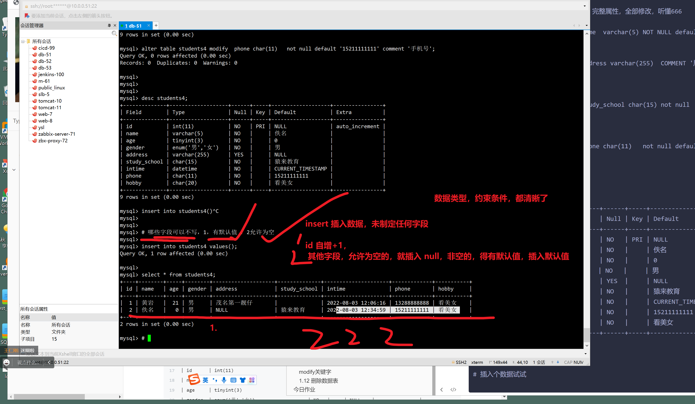


### 修改表名

```
语法
ALTER TABLE 旧表  RENAME TO   新表名;


alter table students rename to new_students;

mysql> alter table  students4  rename to  stu4;
Query OK, 0 rows affected (0.00 sec)

mysql> 
mysql> show tables ;
+-----------------------+
| Tables_in_linux0224db |
+-----------------------+
| stu4                  |
| students              |
| students1             |
| students2             |
| students3             |
+-----------------------+
5 rows in set (0.00 sec)


```

### 修改表结构，数据库引擎

为了某个表，不是utf8，无法写入中文

alter语句修改它的字符集为utf8确保写入中文

理解业务用法1111


```
create table t1(id int) engine=MYISAM;

#语法
# 表 ，表名，表字符集，表属性

ALTER TABLE 表名   表属性新的赋值语句；

# 修改表的字符集

ALTER TABLE  stu4  CHARSET=latin1;
ALTER TABLE stu4 CHARSET=utf8mb4;


```


### 修改表结构，表字符集

```
alter table t1 charset=latin1;


```


## alter修改表字段属性

```
modify  集合alter语句，对字段的完整属性修改，modify后面写什么，该字段，新的
name  <数据类型>  <约束条件>  <注释>

整行修改


change 对每一个属性，指定修改


```


## 1.11 修改列属性

基于目前创建的students表，默认定义好了很多的字段，字段的属性也可以修改。

### change关键字

```
ALTER TABLE <表名> CHANGE <旧字段名> <新字段名> <新数据类型>；

旧字段名：指修改前的字段名；
新字段名：指修改后的字段名；
新数据类型：指修改后的数据类型，如果不需要修改字段的数据类型，可以将新数据类型设置成与原来一样，但数据类型不能为空。

CHANGE 也可以只修改数据类型，实现和 MODIFY 同样的效果，方法是将 SQL 语句中的“新字段名”和“旧字段名”设置为相同的名称，只改变“数据类型”。

提示：由于不同类型的数据在机器中的存储方式及长度并不相同，修改数据类型可能会影响数据表中已有的数据记录，因此，当数据表中已经有数据时，不要轻易修改数据类型

```

### ---只修改字段名---如何用modify和change

- modify  
  - `mysql> # modify 修改 某个 字段的，  数据类型，约束条件，而 不能修改 字段名字， 看懂，听懂6666
    mysql>`
- 

```


# 修改hobby的名，good_hobby
# 语法

ALTER TABLE <表名> CHANGE <旧字段名> <新字段名> <新数据类型>；


# 
兴趣字段，改为如下

hobby char(20)  not null  default '看美女'  comment '活的长久的秘诀'


mysql> # modify 修改 某个 字段的，  数据类型，约束条件，而 不能修改 字段名字， 看懂，听懂6666
mysql>

ALTER TABLE   stu4  MODIFY   nice_hobby   char(20)  not null  default '看美女'  comment '活的长久的秘诀'   ;


# change ，能修改名字，和属性

# 修改字段+ 属性

alter table stu4  change  nice_hobby  hobby  char(50) not null default '多学习,多锻炼，少看美女'  comment '活的没意义的秘诀';


mysql> alter table stu_back change phone_num telephone_num varchar(11) NOT NULL DEFAULT '0' COMMENT '手机号';
Query OK, 0 rows affected (0.00 sec)
Records: 0  Duplicates: 0  Warnings: 0


```


### 只修改默认值

只修改部分属性，change，modify都行

change 多了一个表名修改的功能，表名字得多写一遍

只修改属性，用modify


```
mysql> alter table stu_back change telephone_num telephone_num varchar(11) NOT NULL DEFAULT '15210858004' COMMENT '手机号';
Query OK, 0 rows affected (0.00 sec)
Records: 0  Duplicates: 0  Warnings: 0


# 再次修改hobby的 属性
# 

alter  table  stu4  modify    `hobby` char(50) NOT NULL DEFAULT '天天只知道学习' COMMENT '活的没意义的秘诀';


  

```

### 同时要修改字段名字，数据类型，用什么

```

ALTER   xxxxx   CHANGE 语句

```


## modify关键字


```
修改字段的数据类型就是把字段的数据类型转换成另一种数据类型。

在 MySQL 中修改字段数据类型的语法规则如下：
ALTER TABLE <表名> MODIFY <字段名> <数据类型>

其中：
表名：指要修改数据类型的字段所在表的名称；
字段名：指需要修改的字段；
数据类型：指修改后字段的新数据类型。


修改telephone_num的数据类型，改为char(11)

注意，如果其他属性，不希望改变，也要加上，否则就丢失了

mysql> alter table stu_back modify telephone_num char(11) not null;
Query OK, 0 rows affected (0.01 sec)
Records: 0  Duplicates: 0  Warnings: 0

```

## 1.12 删除数据表

危险操作

```
mysql> drop table stu_back;
Query OK, 0 rows affected (0.00 sec)

```


# 今日作业

```

1. mysql的 DDL，数据库，表定义的语句，好好练练
create  database
create table 

alter 修改 库
alter 修改表


2. 数据表的增删改查玩法，预习下一篇博客

理解刷11111

散会。
3点前，进班学习，最后时刻， 多学学，好事。


```

