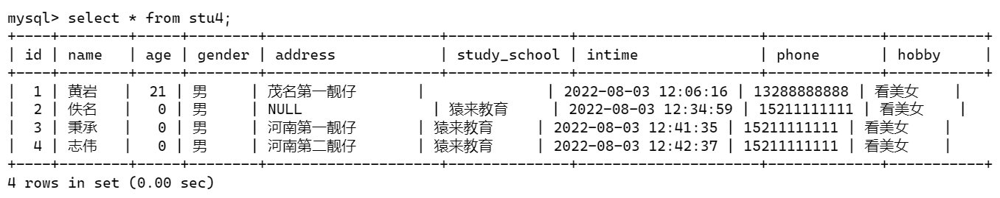
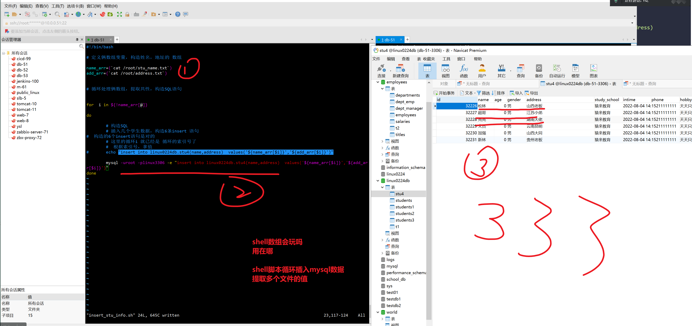
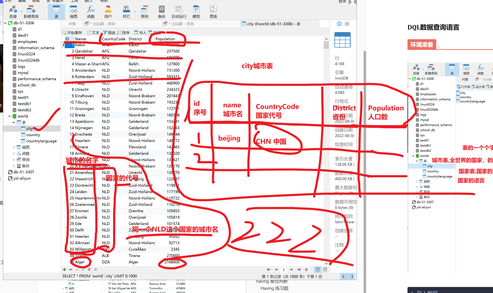
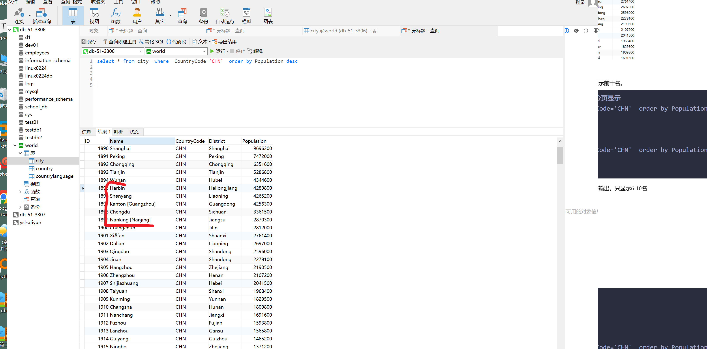

```### 此资源由 58学课资源站 收集整理 ###
	想要获取完整课件资料 请访问：58xueke.com
	百万资源 畅享学习

```


# 1.DDL数据定义篇


# 2.DML数据操作篇

# DML数据操作语言

开发要重点掌握的SQL，运维熟悉就好，也就是DML数据操作语言，因为网站有各式各样的数据写入、数据读取操作，这是开发对于表的设计，是开发必须重点掌握的技能。

运维无须像开发一样，了解各种业务表的结构、设计，只需要熟悉查询数据操作。

也就是DML语句

- select
- insert
- delete
- update


```
mysql> ? Data Manipulation

```

# 1.insert插入数据

前面的DDL语句，我们只是在定义，修改数据库，数据表的结构，属性，还没数据。

DML篇来插入数据


## 先看看表字段

```
先看看表字段
mysql> desc new_students;

mysql> desc new_students;

desc 查看表结构，字段信息，

插入表数据
```




## 部分字段数据插入

注意，其他字段的约束条件，not null  default默认值

```
mysql> insert into stu4(name,age) values('文杰',36);
Query OK, 1 row affected (0.00 sec)


```


## 完整字段插入数据

插入学生数据，要指定字段，然后插入数值

```
# 有主键的字段，一般都不需要你写

# 带着id的完整插入
#玩法两种

#datetime  年-月-日 时-分-秒 有限范围校验
# 表后面不跟字段，values(填入完整的一一对应的数据值)  看懂111

insert into stu4 values('加强',22,'男','山西第一靓仔','山西大学','1977-3-3','15211111111','一边学习，一般打文杰');

# 再表后面，跟上完整的字段，去掉id字段
insert into stu4(name,age,gender,address,study_school,intime,phone,hobby) values('松麟',57,'男','山西第二靓仔','老六学院','2001-6-6','132666666','一边学习，一般喝醋');


# 再看这些写法，如何写

insert into stu4(name,age,address,study_school,intime,hobby) values('超哥',18,'江苏第一靓仔','老八学院','2008-8-8','学习，打文杰');

# 能明白，为何这么写，刷111

# insert 插入表数据，要分析表字段，数据类型
以及插入的几种方式。


10.20

插入单条数据
插入多条数据
插入N条，大量数据 , shell循环


```

## 插入部分字段

- 没写的字段，会填入默认值
  - 得看这个字段，你不填入值，它的约束条件是什
  - datetime没有默认值，必须传入
  - 某个字段，是 not null，但又没默认值，必须制定数据
    - 借助图形化工具
    - 目的，希望用户插入数据时，必须传入值

```

```


## 限制，字段必须插入数据

```
mysql> 
mysql> insert into t1 values('北京');
Query OK, 1 row affected (0.00 sec)

mysql> insert into t1 values('沙河');
Query OK, 1 row affected (0.00 sec)

mysql> insert into t1 values('黑龙江');
Query OK, 1 row affected (0.01 sec)

mysql> 
mysql> select * from t1;
+-----------+
| address   |
+-----------+
| 北京      |
| 沙河      |
| 黑龙江    |
+-----------+
3 rows in set (0.00 sec)

mysql> 
mysql> insert into t1(address) values();
ERROR 1136 (21S01): Column count doesn't match value count at row 1
mysql> insert into t1() values();
ERROR 1364 (HY000): Field 'address' doesn't have a default value
mysql> # 看懂1111
mysql> 


```


- id字段一般可以不写，会自动的增长+1
  - 
- 确保插入的字段，和值的顺序，是对应上的就行

```
# 1. 错误写法

# 2.正确写法
mysql> insert into stu4(name,gender,age) values('name','男',18);
Query OK, 1 row affected (0.00 sec)


```


- char长度不能超出，否则报错，可以修改配置文件解决该问题

- ```
  mysql> 
  mysql> insert into stu4(name) values('基尼太美');
  Query OK, 1 row affected (0.00 sec)
  
  mysql> 
  mysql> insert into stu4(name) values('基尼太美丽');
  Query OK, 1 row affected (0.00 sec)
  
  mysql> 
  mysql> insert into stu4(name) values('基尼太美丽啦');
  ERROR 1406 (22001): Data too long for column 'name' at row 1
  
  ```

- 

## 修改datetime字段的默认值

数据库常见做法是，如用户信息录入，以当前系统时间插入即可。

```

alter table new_students modify intime datetime not null default now() comment '用户添加的时间';

# 数据表关于时间的字段，一般做法是 用内置函数 now()函数，获取当前系统时间


```

当前表结构

```

```

再次插入数据

```

```


## 如何正确修改表字段的结构（带有数据的情况）

```
-----------------------------------------------------------------------------------------------------------------------------------------------+
1 row in set (0.00 sec)

mysql> 
mysql> 
mysql> # 对表结构的字段进行修改，得符合业务逻辑
mysql> # 刚才无法修改，是因为表中部分数据是 null，alter修改表字段的值是 not
mysql> # 刚才无法修改，是因为表中部分数据是 null，alter修改表字段的值是 not null 冲突了
mysql> 
mysql> # 修改表数据，去掉null的值
mysql> 
mysql> # 此时就可以alter修改字段的约束类型，符合逻辑的
mysql> 
mysql> # address 强制要求用户必须传入数据
mysql> 
mysql> 
mysql> insert into stu4 values();
ERROR 1364 (HY000): Field 'address' doesn't have a default value
mysql> 
mysql> 
mysql> insert into stu4 values^C;
mysql> 
mysql> # 这个试图
mysql> # 这个stu4表，至少address字段必须得传入值，听懂 上述分析 666
mysql> 


```


## 简写，插入数据

- 不建议跳过id添加，按顺序写
- 简写，必须按顺序写值，写全了

```
# 如何往6这个序号插入数据，
永飞


mysql> insert into  stu4 values(6,'秉承',22,'男','河南','猿来教育','2022-02-20','11111111111','太辣鸡') ;
Query OK, 1 row affected (0.00 sec)

mysql> select * from stu4;
+----+-----------------+-----+--------+--------------------+--------------+---------------------+-------------+--------------------------------+
| id | name            | age | gender | address            | study_school | intime              | phone       | hobby                          |
+----+-----------------+-----+--------+--------------------+--------------+---------------------+-------------+--------------------------------+
|  1 | 黄岩            |  21 | 男     | 茂名第一靓仔       |              | 2022-08-03 12:06:16 | 13288888888 | 看美女                         |
|  2 | 佚名            |   0 | 男     | NULL               | 猿来教育     | 2022-08-03 12:34:59 | 15211111111 | 看美女                         |
|  3 | 秉承            |   0 | 男     | 河南第一靓仔       | 猿来教育     | 2022-08-03 12:41:35 | 15211111111 | 看美女                         |
|  4 | 志伟            |   0 | 男     | 河南第二靓仔       | 猿来教育     | 2022-08-03 12:42:37 | 15211111111 | 看美女                         |
|  5 | 文杰            |  36 | 男     | NULL               | 猿来教育     | 2022-08-04 09:54:00 | 15211111111 | 天天只知道学习                 |
|  6 | 秉承            |  22 | 男     | 河南               | 猿来教育     | 2022-02-20 00:00:00 | 11111111111 | 太辣鸡                         |
|  7 | 加强            |  22 | 男     | 山西第一靓仔       | 山西大学     | 1977-03-03 00:00:00 | 15211111111 | 一边学习，一般打文杰           |
|  8 | 松麟            |  57 | 男     | 山西第二靓仔       | 老六学院     | 2001-06-06 00:00:00 | 132666666   | 一边学习，一般喝醋             |
|  9 | 超哥            |  18 | 男     | 江苏第一靓仔       | 老八学院     | 2008-08-08 00:00:00 | 15211111111 | 学习，打文杰                   |
| 10 | 佚名            |   0 | 男     | NULL               | 猿来教育     | 2022-08-04 10:26:41 | 15211111111 | 天天只知道学习                 |
| 11 | name            |  18 | 男     | NULL               | 猿来教育     | 2022-08-04 10:44:58 | 15211111111 | 天天只知道学习                 |
| 12 | 基尼太美        |   0 | 男     | NULL               | 猿来教育     | 2022-08-04 10:45:40 | 15211111111 | 天天只知道学习                 |
| 13 | 基尼太美丽      |   0 | 男     | NULL               | 猿来教育     | 2022-08-04 10:45:45 | 15211111111 | 天天只知道学习                 |
+----+-----------------+-----+--------+--------------------+--------------+---------------------+-------------+--------------------------------+
13 rows in set (0.00 sec)


```


## 多条插入数据insert

```
语法
insert into  表  values(行记录1),(行记录2),(行记录3)

# 一次性插入3个同学的信息

insert into stu4(name,address) values('少辉','河南第一靓仔'),('天鼎','江苏第二帅哥'),('刚哥','吉林第一帅哥')
```


## 删除数据表的记录

```
1. 会保留行记录的 增长点


2.  彻底清空表内容

mysql> truncate table linux0224db.stu4;
Query OK, 0 rows affected (0.00 sec)


```


## shell插入数据练习

````
1.以班级学员信息，继续添加，试试SQL语句的insert


2. 有没有快捷的办法，批量插入数据？（提示，基于学生名字插入数据即可）
1000

#shell语法

# 两种玩法

# 修改name字段的类型 varchar(255)
# 磁盘空间挺便宜的。
[root@tech-db-51 ~]#mysql -uroot -plinux3306 -e "alter table linux0224db.stu4  modify  name varchar(255) not null ";
mysql: [Warning] Using a password on the command line interface can be insecure.
[root@tech-db-51 ~]#
[root@tech-db-51 ~]## SQL 看懂111

# 删除数据


# 玩法1，  构造有共性的数据，名字   学生1 学生2 


for i in  {1..1000}
do
	# 循环执行命令.
	# 学生1
	# 学生2
	# 学生3
	mysql -uroot -plinux3306 -e "insert into linux0224db.stu4(name,address) values('学生$i','地球人');" > /dev/null 2>&1
done

# 查看数据
# 看懂 for shell 批量插入1000条数据，刷111


# 玩法2，  for 提取文本中的数据 ，提取出如用户名，1000个员工的名字 
[root@tech-db-51 ~]#cat stu_name.txt 
松林
超哥
亮亮
文杰
加强
新林


# 拿到名字，写入到数据库

for name in `cat stu_name.txt`
do
mysql -uroot -plinux3306 -e "insert into linux0224db.stu4(name,address) values('$name','地球人');" > /dev/null 2>&1
done


# for读文件，写入mysql的玩法 看懂111


````


# 2.update更新数据

```
# 更新

UPDATE  表  SET  字段=新值   WHERE  更新范围
```


## 更新文杰的地址为云南


```
UPDATE stu4 set address="云南丽江" where name='文杰';
```

## 修改文杰的年龄为33

```
UPDATE stu4 set age=33 where name='文杰';
```

## 修改杨松麟的年龄、手机号、爱好

````
update stu4 set   age=18,phone='18811111111',hobby='努力学习，造福家乡'    where   name='松林' ;
````

# 到这看懂刷3333


## 严重的问题

于超老师提醒，update也是危险命令，，务必加上where条件！！

否则就会出现如下的问题！！

如果没有备份的数据，就直接凉凉了。


# 3.删除表数据

## delete

### ===利用数组构造mysql数据===


```bash
# 语法

delete  from  表名  where  删除某一行 数据


# 危险命令，清空表数据
delete from stu4; 

# 该delete语句，是逐行匹配，逐行删除，且会保留表的增长点，下一行数据插入id序号会被保留 

# 看懂111

# 多进程插入10万条数据
# 每次循环体，利用后台好，单独创建一个进程，实现多进程并发写入数据
for (( i=0;i<100000;i++))
do
  {
     mysql -uroot -plinux3306 -e "insert into linux0224db.stu4(name,address) values('$i','地球人')"
  } &

done

#


# 测delete删除效率

mysql> delete from  linux0224db.stu4  ;
Query OK, 28499 rows affected (0.04 sec)


----------------------------------------------------------------
# 利用shell数组，构造数据结构

num=0
# 先读文件，读出一堆名字
# for
for i in `cat stu_name.txt`
do	
	# 构造数组变量 stu_name[索引号]=值
	stu_name[$num]=$i
	let num++
done

num2=0
for j in `cat address.txt`
do
	add_name[$num2]=$j
	let num2++
done

# stu_name=([0]="松林" [1]="超哥" [2]="亮亮" [3]="文杰" [4]="加强" [5]="新林")
# add_name=([0]="山西老板" [1]="江苏小弟" [2]="湖南大佬" [3]="云南昆明" [4]="山西大同" [5]="贵州老板")


# 循环处理数组，插入数据
for i in ${!stu_name[@]}
do
	 mysql -uroot -plinux3306 -e "insert into linux0224db.stu4(name,address) values('${stu_name[$i]}','${add_name[$i]}')"

done

---------------------------------------------------------------------
# 简写

name_arr=(`cat /root/stu_name.txt`)
add_arr=(`cat /root/address.txt`)

# 打印俩数组变量看看
# 提取数组所有的值
#echo ${name_arr[@]}
#echo ${add_arr[@]}

# 提取数组所有的索引

#echo ${!name_arr[@]}
#echo ${!add_arr[@]}


# 循环处理数组，基于同一个索引，对应上每一行的数据，拼接出了具体的SQL
for i in ${!stu_name[@]}
do
	 # mysql -uroot -plinux3306 -e "insert into linux0224db.stu4(name,address) values('${stu_name[$i]}','${add_name[$i]}')"
	 
	 # 打印你想拼接的SQL，看看，对不对，然后再插入表
	 

done


------------------------------------------------------------------------


# stu_name=([0]="松林" [1]="超哥" [2]="亮亮" [3]="文杰" [4]="加强" [5]="新林")
# add_name=([0]="山西老板" [1]="江苏小弟" [2]="湖南大佬" [3]="云南昆明" [4]="山西大同" [5]="贵州老板")


```




## 如何彻底清空数据表的内容，truncate

```
truncate tablename就行

# 删除表
# 再基于建表SQL，重新创建表，没数据了


#
```


## 对比delelte和truncate删除效率

看懂这删除的效率，刷2222


```
1. 一个几十万行数据表，delete删除的效率   0.7s 

2. 再看truncate命令，清空命令
mysql> truncate  employees.dept_emp;
Query OK, 0 rows affected (0.00 sec)

# 查表数据
mysql> select * from employees.dept_emp;
Empty set (0.00 sec)

# 查表结构 ，有结果 
mysql> desc employees.dept_emp;
+-----------+---------+------+-----+---------+-------+
| Field     | Type    | Null | Key | Default | Extra |
+-----------+---------+------+-----+---------+-------+
| emp_no    | int(11) | NO   | PRI | NULL    |       |
| dept_no   | char(4) | NO   | PRI | NULL    |       |
| from_date | date    | NO   |     | NULL    |       |
| to_date   | date    | NO   |     | NULL    |       |
+-----------+---------+------+-----+---------+-------+
4 rows in set (0.00 sec)


```


### where指定条件删除数据

```

```

## 面试题

1. drop 直接删表，消失了
2.  truncate先删表，再建表，200W条
3. delete逐行删除数据，效率较低 ，且任然保留主键id的增长序号


看懂33333


```
来，说说如下命令的区别

drop table new_students;
1. 直接删除该数据表，表不存在了


truncate table new_students;
等于 如下命令

1. 删表
drop table employees.dept_emp;

2. 建表
# 先进入数据库
use employees;
# 再建表
CREATE TABLE `dept_emp` (
  `emp_no` int(11) NOT NULL,
  `dept_no` char(4) NOT NULL,
  `from_date` date NOT NULL,
  `to_date` date NOT NULL,
  PRIMARY KEY (`emp_no`,`dept_no`),
  KEY `dept_no` (`dept_no`),
  CONSTRAINT `dept_emp_ibfk_1` FOREIGN KEY (`emp_no`) REFERENCES `employees` (`emp_no`) ON DELETE CASCADE,
  CONSTRAINT `dept_emp_ibfk_2` FOREIGN KEY (`dept_no`) REFERENCES `departments` (`dept_no`) ON DELETE CASCADE
) ENGINE=InnoDB DEFAULT CHARSET=utf8mb4 ;


delete from new_students; 


区别？


```


# ----下午开始------

2.30上课


## 伪删除

> 技巧性，维护数据库数据安全的方式


为了有效防止delete误删除数据，可以人为限定SQL的删除逻辑

```
delete from stu4;
删数据台危险，通过逻辑的修改，不用delete去删除
表，添加一个字段，值  0 1  ，代表数据是否被删除


# 该方式，需要修改表的结构，添加一个额外的字段，不是必须的操作
#  1. 看懂该玩法
# 2. 也可以不用这个玩法，还是delete，注意添加where条件即可

# 修改表结构，添加字段
# 默认是在结尾添加
# 通过修改该字段的值，从逻辑上，模拟的效果

alter table stu4 add column field_status TINYINT not null default 1 comment '字段删除状态，0 表示被删除，1表示数据存在';


mysql> select * from stu4 where field_status=1;
+-------+--------+-----+--------+--------------+--------------+---------------------+--
mysql> # 此时加上where条件判断，=1 表示 可用的数据，从逻辑上进行修改成哈讯，看懂1111


# 干掉亮亮
# 物理删除。数据就没了
mysql> delete from stu4 where name='亮亮';
Query OK, 1 row affected (0.00 sec)

# 逻辑删除


mysql> 
mysql> 
mysql> # 逻辑查看，哪些数据可用
mysql> 
mysql> 
mysql> select * from stu4 where field_status=1;
+-------+--------+-----+--------+--------------+--------------+---------------------+-------------+-----------------------+--------------+
| id    | name   | age | gender | address      | study_school | intime              | phone       | hobby                 | field_status |
+-------+--------+-----+--------+--------------+--------------+---------------------+-------------+-----------------------+--------------+
| 32227 | 超哥   |   0 | 男     | 江苏小弟     | 猿来教育     | 2022-08-04 14:56:58 | 15211111111 | 天天只知道学习        |            1 |
| 32229 | 文杰   |   0 | 男     | 云南昆明     | 猿来教育     | 2022-08-04 14:56:58 | 15211111111 | 天天只知道学习        |            1 |
| 32230 | 加强   |   0 | 男     | 山西大同     | 猿来教育     | 2022-08-04 14:56:58 | 15211111111 | 天天只知道学习        |            1 |
| 32231 | 新林   |   0 | 男     | 贵州老板     | 猿来教育     | 2022-08-04 14:56:58 | 15211111111 | 天天只知道学习        |            1 |
+-------+--------+-----+--------+--------------+--------------+---------------------+-------------+-----------------------+--------------+
4 rows in set (0.00 sec)

mysql> select * from stu4 ;
+-------+--------+-----+--------+--------------+--------------+---------------------+-------------+-----------------------+--------------+
| id    | name   | age | gender | address      | study_school | intime              | phone       | hobby                 | field_status |
+-------+--------+-----+--------+--------------+--------------+---------------------+-------------+-----------------------+--------------+
| 32226 | 松林   |   0 | 男     | 山西老板     | 猿来教育     | 2022-08-04 14:56:58 | 15211111111 | 天天只知道学习        |            0 |
| 32227 | 超哥   |   0 | 男     | 江苏小弟     | 猿来教育     | 2022-08-04 14:56:58 | 15211111111 | 天天只知道学习        |            1 |
| 32229 | 文杰   |   0 | 男     | 云南昆明     | 猿来教育     | 2022-08-04 14:56:58 | 15211111111 | 天天只知道学习        |            1 |
| 32230 | 加强   |   0 | 男     | 山西大同     | 猿来教育     | 2022-08-04 14:56:58 | 15211111111 | 天天只知道学习        |            1 |
| 32231 | 新林   |   0 | 男     | 贵州老板     | 猿来教育     | 2022-08-04 14:56:58 | 15211111111 | 天天只知道学习        |            1 |
+-------+--------+-----+--------+--------------+--------------+---------------------+-------------+-----------------------+--------------+
5 rows in set (0.00 sec)

mysql> 
mysql> 
mysql> # 看懂伪删除的逻辑Shaun333
mysql> 
mysql> 
mysql> 
mysql> 


```

想删除数据用update，代替delete，取消delete的执行权限即可

兄弟，再次啰嗦，用update，务必小心，加上where条件。

```

```


后续的查询语句，修改为如下即可

```

```


15.15继续


# DQL数据查询语言

## 环境准备

.


```
1.导入数据 

[root@tech-db-51 ~]#mysql -uroot -plinux3306 < all_world.sql 
mysql: [Warning] Using a password on the command line interface can be insecure.
[root@tech-db-51 ~]#
[root@tech-db-51 ~]#

```


### 数据库查看

```
# 库 world，表city
select * from world.city;
```




### 简单数据查看


```
District 区域

Population 人口数统计
```

```
1.查看前十个城市的信息（所有字段） 
select * from world.city where id<11;

2.查看上海的城市信息 city表里
select * from city  where name='shanghai';


3.查看上海的城市信息，城市名，国家代号，人口
制定字段

select name,countrycode,population from city where name='shanghai'


# 4. 查询shanxi省的城市信息

select * from city where  district='shanxi'

 
#  5. 查询河南省的，城市名，人口数

select name,population  from city  where  district='henan'

```


### 查看表创建语句

```
mysql> show create table country;

mysql> show create table city;
```


## select语句

> select能够查看具体的变量的值。
>
> 语法是  select @@内置变量名 ; 
>
> 查出mysql内置变量的值，用于mysql运维观察的各种数据变量
>
> 

```
1. 先查出mysql中所有的变量
# 列出mysql设置的所有变量名
show variables ;


```


### show查询数据库服务端配置

> 1.show 查阅数据库变量的值。
>
> 2.利用模糊查询语法，搜索你想要的数据


题目在这，利用select 查询mysql内置的变量信息


```
1. 查看所有内置变量的信息
show variables ;


2. 查看关于端口的变量信息  port

- 先列出关于端口得变量名
show variables like '%port%'
- 精确查询某变量的值
select @@port;


3.查看服务器id的信息，拿到实例id，主从复制架构使用
- 不知道变量名叫什么，模糊查询帮你找
show variables like  '%server%'  # 找出服务器相关的变量名
- 精确查询变量的值
select @@server_id;


4.查看关于 ·数据库目录，当前实例，的数据目录在哪·  的信息
- 模糊查询帮你找
show variables like '%dir%'
- 如何精确查找  ，查询出了数据目录  /linux0224/mysql_3306/
select @@datadir;


补充，查询mysql的安装目录，basedir

show variables like '%basedir%'

精确查询某变量的值
select @@basedir;

，查出当前数据库的安装目录
/opt/mysql-5.7.28-linux-glibc2.12-x86_64/


5.查看服务器的socket信息
show variables like '%socket%'
select @@socket;


6.查看关于自增   

show variables like '%inc%'
# 查询出，当前主键自增的步长每次+1 
select @@auto_increment_increment;


7. 修改内置变量的值

语法如，修改主键，自增的步长值

# 设置系统变量的值
# 加圈圈也可以

set  auto_increment_increment=2;
set @@auto_increment_increment=3

show variables like '%auto%';
select @@auto_increment_increment;


8.小结
shwo语句和select语句，结合查询mysql内置变量的 
模糊搜索名 + 精确搜索值 的玩法，看懂听懂 刷777


16:10 


```


## -----查看mysql内置函数------

```
查看各内置函数的语法帮助

? functions;

时间的函数

?  Date and Time Functions

? 函数名 查看帮助信息

? year

mysql> select year('2018-8-8');
+------------------+
| year('2018-8-8') |
+------------------+
|             2018 |
+------------------+
1 row in set (0.00 sec)


内置函数的帮助手册查询 ，看懂111


```


函数就是可以复用的一个功能代码


```
mysql> help Functions;
列出函数列表


```

### 常见函数执行

```
now()  当前系统时间
database()	当前所在的库
user() 当前链接的用户信息


# 结合select语句使用


mysql> select user();
+----------------+
| user()         |
+----------------+
| root@localhost |
+----------------+
1 row in set (0.00 sec)

mysql> 
mysql> 
mysql> select database();
+------------+
| database() |
+------------+
| NULL       |
+------------+
1 row in set (0.00 sec)

mysql> 
mysql> 
mysql> 
mysql> use linux0224db;
Reading table information for completion of table and column names
You can turn off this feature to get a quicker startup with -A

Database changed
mysql> 
mysql> 
mysql> select database();
+-------------+
| database()  |
+-------------+
| linux0224db |
+-------------+
1 row in set (0.00 sec)

mysql> 
mysql> 
mysql> select now();
+---------------------+
| now()               |
+---------------------+
| 2022-08-04 16:19:25 |
+---------------------+
1 row in set (0.00 sec)


```


# SQL表数据查询章节

 

## Where 子查询

mysql强大之处在于基于数据表，进行复杂的查询，适用于各种复杂业务场景下，对数据的查询提取。

子查询几个关键语句执行顺序如下


mysql强大之处在于基于数据表，进行复杂的查询，适用于各种复杂业务场景下，对数据的查询提取。

子查询几个关键语句执行顺序如下

```
select 列
from 表
where 条件
group by 列
having 条件
order by 列
limit 条件
```

> 提示
>
> DQL系列数据查询语句，作为后端开发重点，运维学习了解即可
>
> 运维以架构部署，提供数据库环境，保障数据库稳定性为主。


### 子查询语句顺序


```

```

### 查询city表中所有数据

题目做出来，子查询就会玩了

city表了


```
#1. 查阅所有字段
select * from city ;


#2. 查询某个字段

select name,Population from city;

# 看懂2222


```


### 查询城市信息

查询所有城市名，以及人口数

```
# 查询所有城市、人口数量

select name,Population from city;


```

查询city表里，所有中国的城市信息

```
select * from city  where CountryCode='CHN'
```

查询美国的所有城市信息

```
select * from city where CountryCode='USA'


```

查询美国，华盛顿，的城市名，省，人口数

```
select name,district,population  from city  where  countrycode='USA' and name='Washington'

# 看懂 44444

```


查询江苏的城市信息

```
select     *            from city  where  district='jiangsu'
```


查询 淮安市的，城市名，人口信息

```
select  name,  population         from  city    where name='Huai´an'
```

查询无锡市的信息

```
select  name,district,  population         from  city    where name='wuxi'
```


查询人口数小于500人城市信息

```

select    *    from  city    where  population <500;

看懂1111

```

查询中国,人口数超过500w的所有城市信息

```

select *    from city     where  countrycode='CHN'  and  population>5000000
```

查询中国或者美国的城市信息

```
select * from city  where countrycode='CHN'  or  countrycode='USA' 
```


查询中国或xx国的城市信息，且人口数均超过500w的城市信息

```
select * from city  where (countrycode='CHN'  or  countrycode='USA')   and Population > 5000000

# 看懂111

```


查询人口在200万到500万之间的城市所有信息

```

select * from city  where population > 3000000 and population<4500000

between语法 再。。。之间


select * from city where population between 3000000 and 3500000
```

查询中国或者美国，人口数大于500万的城市

```
# where  字段  in (值1,值2)
select * from city  where  countrycode in ('CHN','USA') AND population>5000000 ;

```

查询城市名以qing开头的城市

条件是 基于城市名的字段的 模糊查询


```

select  * from city  where  name like 'qing%'
```

查询 以 he开头的省的城市信息

```
select * from city  where  district  like 'he%'  and countrycode='CHN'
```

17: 15继续


# ================

最后一波，SQL查询，稍有难度，认真听，还能继续听刷111


## Group by 聚合函数

select 查询关键字 group by 结合，分组查询


```
1 count() 统计数量 
2 sum() 求和
3 avg() 平均数
4 max() 最大值
5 min() 最小值
6 group_concat() GROUP_CONCAT函数返回一个字符串结果，该结果由分组中的值连接组合而成。
```


### group by 分组功能原理

```
1. 按分组条件进行排序

2. 进行分组列的去重

3. 聚合函数将其他列的结果聚合
```

### group by聚合函数练习题

统计city表有多少行数据


```
1.  查询city表所有的信息

count() 内置函数

# 基于序号字段，统计，有多少行数据，且可以友好展示 用as语句

```

统计中国城市的个数

```

1. 查询出中国的所有城市信息

select * from city where countrycode='CHN'

2. 数一数有多少个城市
select count(*) as 中国城市总数   from city where countrycode='CHN'

```

统计，中国，总人口数，

```
1. 查出 中国所有城市，
select * from city where countrycode='CHN'

2. sum()内置函数

select sum(population) as 人口总数 from city where countrycode='CHN'


```

统计每个国家的城市个数

```
1. 先列出每个国家的城市信息
# group by 结合聚合函数，常见玩法

# 国家  ，城市数量  
# CHN ，中国  363个城市
# USA  274个城市
# 看懂1111

select countrycode ,count(*) as 城市数量  from city  group by  countrycode 
#


# 查询中国所有城市信息
select * from city where countrycode='CHN'

# 查询USA的城市总数
select count(*) from city   where countrycode='USA'


```


统计每个国家的总人口数

以国家进行分组计算

group by  countrycode  国家代码进行分组


```
# 查出的结果
# CHN 175953614 人口
# USA 78625774
# 这是基于国家代号分组，一次性，批量统计，每一个国家的人口总数

select  countrycode as 国家代码, sum(population) as 人口总数  from city  group by countrycode  


# 单独查询CHN的人口总数
# 175953614
# 这个写法是单独查询，过滤CHN的信息
select sum(population) from city where  countrycode='CHN'
# 78625774
select sum(population) from city where  countrycode='USA'

# 看懂，刷33333


中国的
一堆城市-----人口数字段


```

统计中国每个省,的城市个数，和城市名

```
# 统计中国每个省的城市个数，和城市名 
# district 省


# 查询出 每个省的城市数量

# 查询 ，省份名, 该、省份下的城市个数  
select District as 省份 ,count(*) as 城市个数 from city  where CountryCode='CHN' group by District

# 数一数，河北省的城市数量
# 用聚合函数，count() 去数，有多少行记录，就表示 河北有多少个城市
# 河北有12个城市
select count(*) from city  where District='hebei'

# 数广东省，有多少个城市  20个

select count(*) from city  where District='guangdong'


```


## having 聚合判断

当group by 排序分组后，如果还要做条件判断。


### Having 练习题

统计每个国家的总人口数，只显示人口超过1亿的国家信息

```
# 统计每个国家的总人口数，只显示人口超过1亿的国家信息


# 1. 先统计出每个国家的人口总数，已谁分组？ 国家分组

select countrycode as 国家代号, sum(population) as 人口总数   from city  group by countrycode


# 2. 对分组后的结果，进行再次筛选， having语句


select countrycode as 国家代号, sum(population) as 人口总数   from city  group by countrycode   having  sum(population) > 100000000


# 看懂，听懂刷1111


```

## Order by 聚合排序

查询所有城市信息


按人口总数排序输出，正序输出

```
-- select * from city order by  Population # 默认是升序

select * from city order by  Population  desc 


查询所有城市信息，以人口进行排序，  order by  排序的字段

看懂听懂6666

```

查询中国所有城市信息  且按照人口数从大到小排序输出

```

```

每个国家的总人口数，总人口超过5000w的信息,并按总人口数从大到小排序输出

```
# 每个国家的总人口数，总人口超过5000w的信息,并按总人口数从大到小排序输出


select * from city where CountryCode='CHN' order by Population desc
# 看懂 1111


```

## limit 分页查询


查询中国所有城市信息，以人口数从大到小排序，只显示前十名。

```
# SQL结尾，加上limit语句，对结果进行分页显示
select * from city  where  CountryCode='CHN'  order by Population desc limit 0,10

# 简写
# 起点默认，显示10条
select * from city  where  CountryCode='CHN'  order by Population desc limit 10


```

查询中国所有的城市信息，并按照人口数从大到小排序输出，只显示6-10名 


  6, 7 ,8, 9 ,10   显示5个





```
# Limit 从哪开始,显示几条

从第6条的 哈尔并数据 > 显示后5条

# limit  从0数

select * from city  where  CountryCode='CHN'  order by Population desc limit 5,5


# 只显示 重庆 到 武汉的记录
select * from city  where  CountryCode='CHN'  order by Population desc  limit 2,3

```


# =================


# mysql元数据查询

## show语句

```
SHOW语句有许多形式，提供关于服务器的数据库、表、列或状态信息的信息。

SHOW语法格式：

SHOW 关键字 LIKE 'pattern'

如果对于一个给定的说明语句的语法包括像'模式'，'模式'是一个字符串，可以包含“%”和“_“通配符。该模式是有用的限制语句输出匹配的值。

本节介绍以下：


SHOW DATABASES – 显示当前所有数据库的名称

SHOW TABLES FROM db_name – 显示数据库中的所有表

SHOW ENGINES – 显示MySQL当前支持哪些存储引擎和默认存储引擎

SHOW CHARACTER SET – 显示MySQL当前支持哪些字符集

SHOW COLLATION – 显示MySQL支持字符集的排序规则

SHOW BINARY | MASTER – 显示二进制文件以及文件大小（需要开启二进制日志记录功能

SHOW BINLOG EVENTS – 显示二进制文件的执行过程

SHOW COLUMNS – 显示表的列信息（等同于DESC，需要先创建表）

SHOW CREATE DATABASES – 显示已经创建的库，创建时的语句

SHOW CREATE TABLE – 显示已经创建的表，创建时的语句

SHOW CREATE FUNTCION  – 显示已经创建的函数，创建时的语句

SHOW CREATE PROCEDURE – 显示已经创建的存储过程，创建时的语句

SHOW CREATE TRIGGER - 显示已经创建的触发器，创建时的语句

SHOW CREATE VIEW – 显示已经创建的视图，创建时的语句

SHOW CREATE EVENTS – 显示已经创建的事件，创建时的语句

SHOW ENGINE – 显示存储引擎的详细信息

SHOW WARNINGS – 显示最后一个执行语句所产生的警告信息

SHOW ERRORS – 显示最后一个执行语句所产生的错误信息

SHOW EVENTS – 显示事件信息

SHOW GRANTS – 显示一个用户所拥有的权限

SHOW PROCESSLIST – 显示系统中正在运行的所有进程，普通用户只能查看自己的进行信息

SHOW PRIVILEGES – 显示MySQL所支持的所有权限，及权限可操作的对象

SHOW PLUGINS – 显示MySQL插件信息

SHOW MASTER STATUS – 显示Master当前正在使用的二进制信息

SHOW TABLE STATUS – 显示表属性信息

SHOW INDEX – 显示表索引信息

SHOW PROCEDURE STATUS – 显示存储过程信息

SHOW FUNCTION STATUS – 显示存储函数信息

SHOW TRIGGERS – 显示触发器信息

SHOW PROFILE and SHOW PROFILES – 显示执行语句的资源使用情况

SHOW SLAVE HOSTS – 显示Master主机上已注册的复制主机列表

SHOW SLAVE STATUS – 显示Slave主机状态信息

SHOW GLOBAL | SESSION STATUS – 显示MySQL状态变量信息

SHOW GLOBAL | SESSION VARIABLES – 显示MySQL系统变量信息
```


## 今日作业安排

```
最近mysql语句较多，知识点太细，今天就学完了，基本CURD 增删改查的操作，需要好好整理

然后翻篇迎接运维mysql重点，备份，架构搭建

明日安排，自习整理

1. 整理mysql的 SQL语句
- 数据库、表创建，定义表字段规则
- 增删改查练习
	- 基于world库，city表的练习
	- 以及employ库的查询练习
	
2. 预习下一篇博客，mysql的备份篇，不懂与老师交流

3. 周末前我会给大家发运维简历模板，开始着手简历编写，思考。


```


