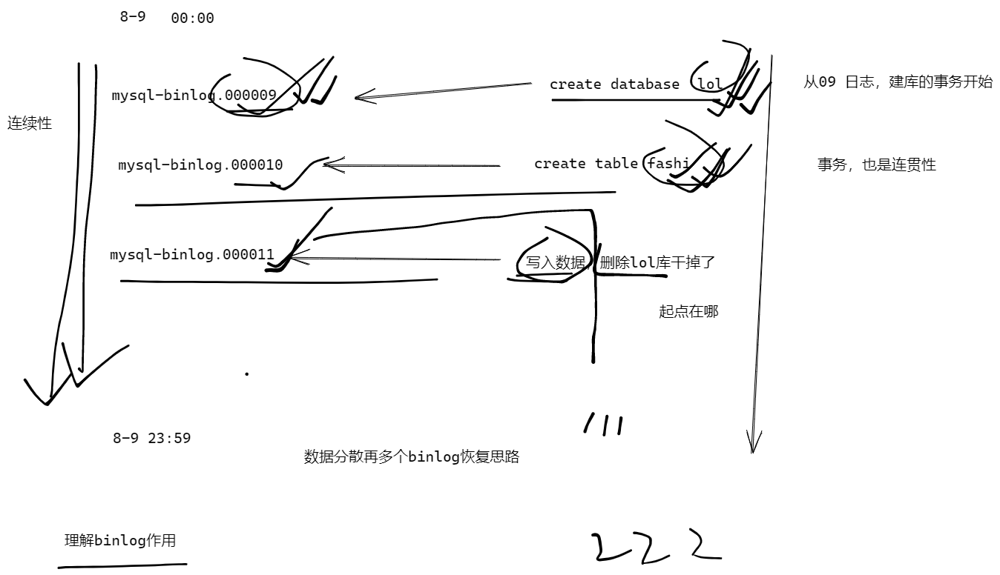
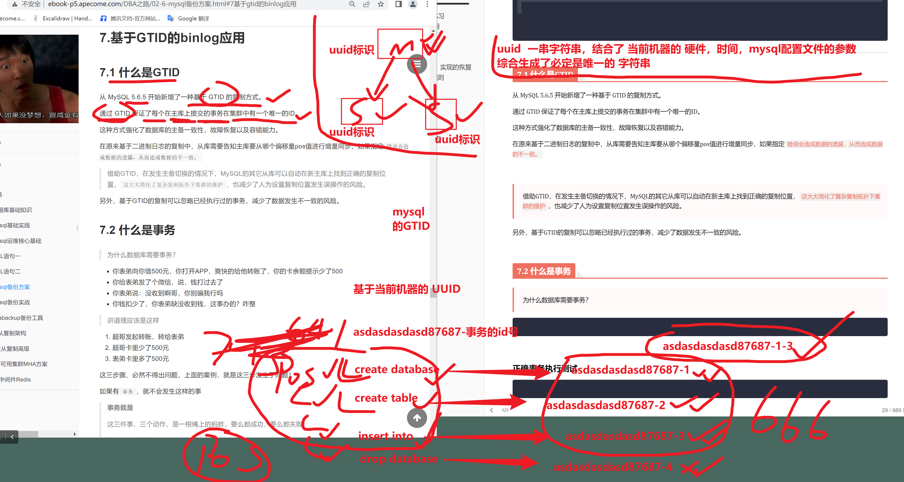
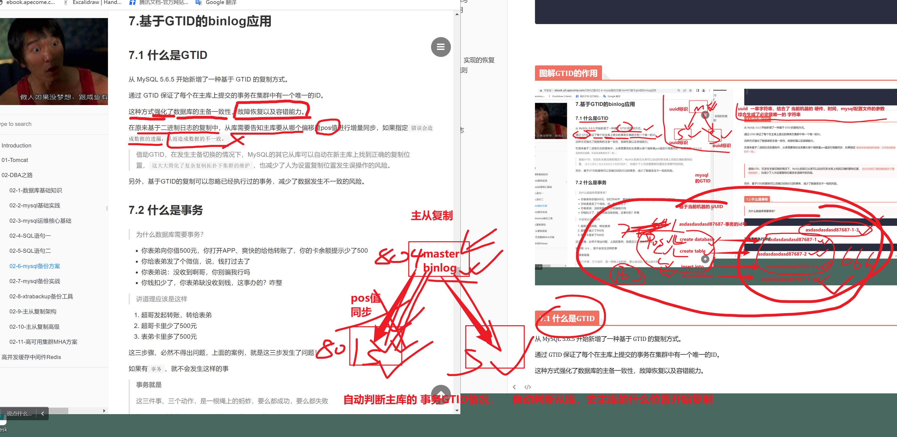
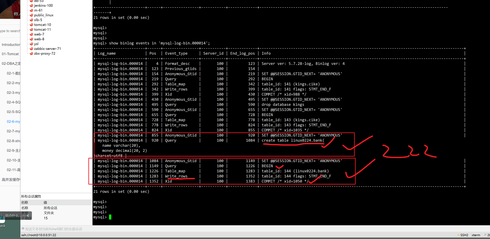
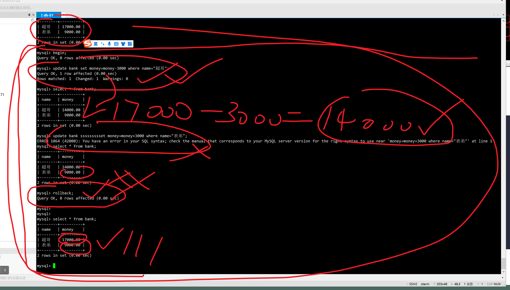
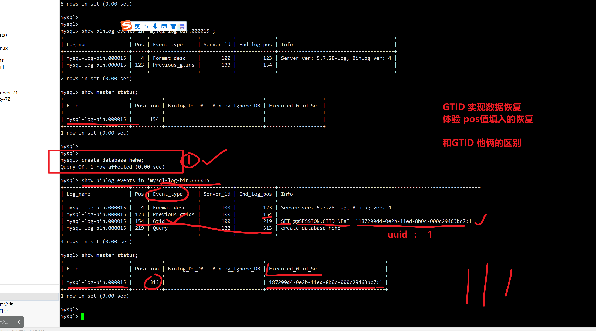
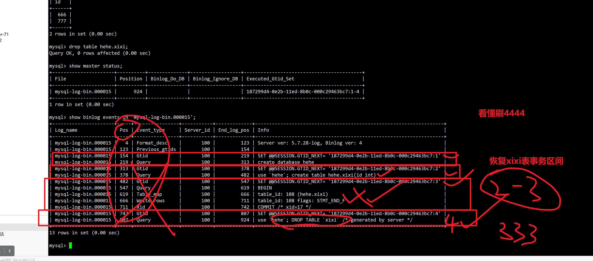
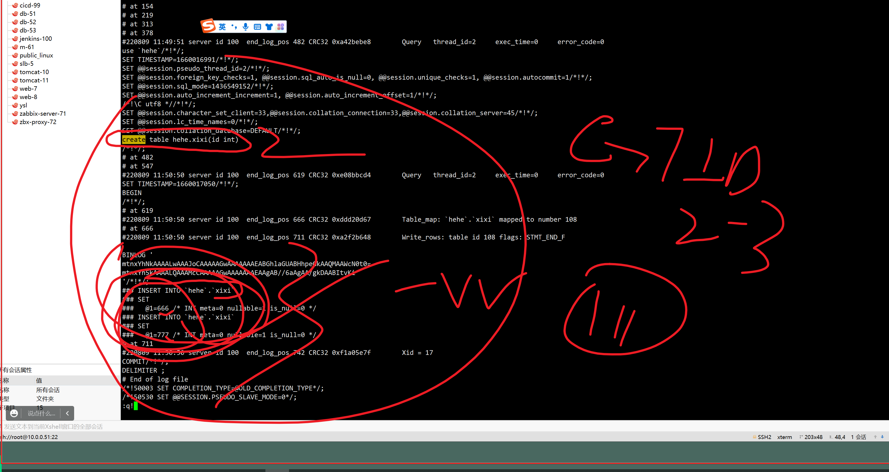

```### 此资源由 58学课资源站 收集整理 ###
	想要获取完整课件资料 请访问：58xueke.com
	百万资源 畅享学习

```


# 基于binlog的日志恢复练习

```
基于多个binlog日志文件，实现的数据恢复

彻底玩明白binlog的 pos值区间


```




# 7.基于GTID的binlog应用

```
不再需要通过pos值去判定每一个事务操作的边界

create database    ---  pos值 范围

create table     ---  pos值 范围

insert into      ---  pos值 范围 


mysql提供了更方便，更精确，更容易用于数据恢复的GTID模式


 GTID (Global Transaction IDentifier) 是全局事务标识。它具有全局唯一性，一个事务对应一个GTID。
 


```


## 图解GTID的作用




## 7.1 什么是GTID

从 MySQL 5.6.5 开始新增了一种基于 GTID 的复制方式。

通过 GTID 保证了每个在主库上提交的事务在集群中有一个唯一的ID。

这种方式强化了数据库的主备一致性，故障恢复以及容错能力。

在原来基于二进制日志的复制中，从库需要告知主库要从哪个偏移量pos值进行增量同步，如果指定`错误会造成数据的遗漏，从而造成数据的不一致。`


> 借助GTID，在发生主备切换的情况下，MySQL的其它从库可以自动在新主库上找到正确的复制位置，`这大大简化了复杂复制拓扑下集群的维护`，也减少了人为设置复制位置发生误操作的风险。

另外，基于GTID的复制可以忽略已经执行过的事务，减少了数据发生不一致的风险。





## 7.2 什么是事务

玩一玩事务的特性


> 为什么数据库需要事务？

````

````


### 正确事务执行测试

确保，再事务之间的所有SQL，全部正确执行，以及永久生效，争取的事务执行过程。

mysql默认的修改类的SQL，都是事务执行的。

```
create database linux0224;


create table linux0224.bank(
    name varchar(20),
    money decimal(20, 2)
)charset=utf8;

#写入测试数据
use linux0224;
insert into bank values("超哥", 20000),("表弟", 6000);


# 主动使用BEGIN ，commit语句区间，查看事务执行的过程，模拟修改数据，模拟转账
# 再事务中所有的SQL，要么都成功，要么都失败，事务的一致性
#数据修改完毕后，数据表，永久生效，写入磁盘。

# 如下2个SQL，分别是 ，给超哥减去3000，给表弟加入3000，模拟转账
# 看懂1111
# 执行成功后，应该看到数据表的变化

# 这2个正确执行的事务，被binlog日志记录， 而刚才出错的，回滚了

begin;
update bank set money=money-3000 where name="超哥";
update bank set money=money+3000 where name="表弟";
commit;

mysql> select * from bank;
+--------+----------+
| name   | money    |
+--------+----------+
| 超哥   | 17000.00 |
| 表弟   |  9000.00 |
+--------+----------+
2 rows in set (0.00 sec)

| mysql-log-bin.000014 | 1383 | Anonymous_Gtid |       100 |        1448 | SET @@SESSION.GTID_NEXT= 'ANONYMOUS'                                                      |
| mysql-log-bin.000014 | 1448 | Query          |       100 |        1525 | BEGIN                                                                                     |
| mysql-log-bin.000014 | 1525 | Table_map      |       100 |        1582 | table_id: 144 (linux0224.bank)                                                            |
| mysql-log-bin.000014 | 1582 | Update_rows    |       100 |        1652 | table_id: 144 flags: STMT_END_F                                                           |
| mysql-log-bin.000014 | 1652 | Table_map      |       100 |        1709 | table_id: 144 (linux0224.bank)                                                            |
| mysql-log-bin.000014 | 1709 | Update_rows    |       100 |        1779 | table_id: 144 flags: STMT_END_F                                                           |
| mysql-log-bin.000014 | 1779 | Xid            |       100 |        1810 | COMMIT /* xid=1057 */        

# 能理解刷666


```




### 错误SQL事务执行，实现的恢复

mysql提供事务回滚，数据回滚


```
# 主动的事务

# 超哥的SQL正确执行
# 第二条SQL输错
# rollback回滚操作，
# 开发写代码，再程序中，进行异常逻辑判断

# 主动执行SQL，查看一个事务下的所有SQL，要么都成功，要么都失败

begin;
update bank set money=money-3000 where name="超哥";
update bank ssssssssset money=money+3000 where name="表弟";
rollback;


```



a

### mysql默认的事务规则

在MySQL数据库中，事务默认是会自动提交的，也就是说，如果没有用 begin ... commit 来显式提交事务的话，MySQL 会认为每一条SQL语句都是一个事务，也就是每一条SQL语句都会自动提交。

可以基于mysqlbinlog去分析日志，发现每一个语句都是事务操作。

```

```


## 7.3 GTID长啥样


默认mysql没有开启gtid

```
| mysql-log-bin.000014 | 1810 | Anonymous_Gtid |       100 |        1875 | SET @@SESSION.GTID_NEXT= 'ANONYMOUS'                                                      |
| mysql-log-bin.000014 | 1875 | Query          |       100 |        1952 | BEGIN                                                                                     |
| mysql-log-bin.000014 | 1952 | Table_map      |       100 |        2009 | table_id: 144 (linux0224.bank)                                                            |
| mysql-log-bin.000014 | 2009 | Write_rows     |       100 |        2061 | table_id: 144 flags: STMT_END_F                                                           |
| mysql-log-bin.000014 | 2061 | Xid            |       100 |        2092 | COMMIT /* xid=1071 */                                                                     |
+----------------------+------+----------------+-----------+-------------+---------------------------
```


GTID (Global Transaction ID) 是对于一个已提交事务的编号，并且是一个全局唯一的编号。

GTID 实际上 是由 UUID+TID 组成的。

其中 UUID 是一个 MySQL 实例的唯一标识。

TID 代表了该实例上已经提交的事务数量，并且随着事务提交单调递增。

下面是一个GTID的具体形式：

```


```


### server_uuid是什么

还记得以前我们在my.cnf中配置了一个参数

```


```


## 7.4 开启uuid

````
1. 修改配置文件，再my.cnf 
加入server_id=50;

2. 具体配置如下
[mysqld]
gtid-mode=ON
enforce-gtid-consistency=true
log-slave-updates=ON

server_id=100
log_bin=/mysql_log/log_bin_3306/mysql-log-bin
character_set_server=utf8mb4
log-error=/linux0224/mysql_3306/logs/3306-err.log
port=3306
user=mysql
basedir=/opt/mysql
datadir=/linux0224/mysql_3306/
socket=/tmp/mysql.sock

[mysql]
socket=/tmp/mysql.sock

重启mysql，配置生效，加载gtid功能

[root@tech-db-51 /mysql_log/log_bin_3306]#systemctl restart mysqld

[root@tech-db-51 /mysql_log/log_bin_3306]#


# 查看关于gtid的mysql内置变量

show variables like '%GTID%';
mysql> show variables like '%GTID%';
+----------------------------------+-----------+
| Variable_name                    | Value     |
+----------------------------------+-----------+
| binlog_gtid_simple_recovery      | ON        |
| enforce_gtid_consistency         | ON        |
| gtid_executed_compression_period | 1000      |
| gtid_mode                        | ON        |
| gtid_next                        | AUTOMATIC |
| gtid_owned                       |           |
| gtid_purged                      |           |
| session_track_gtids              | OFF       |
+----------------------------------+-----------+
8 rows in set (0.00 sec)

mysql> 


# 表示以及开启GTID功能，你后续的事务操作，都会被记录 事务id


[root@tech-db-51 /mysql_log/log_bin_3306]#mysql -uroot -plinux3306
mysql: [Warning] Using a password on the command line interface can be insecure.
Welcome to the MySQL monitor.  Commands end with ; or \g.
Your MySQL connection id is 2
Server version: 5.7.28-log MySQL Community Server (GPL)

Copyright (c) 2000, 2019, Oracle and/or its affiliates. All rights reserved.

Oracle is a registered trademark of Oracle Corporation and/or its
affiliates. Other names may be trademarks of their respective
owners.

Type 'help;' or '\h' for help. Type '\c' to clear the current input statement.

mysql> show master status;
+----------------------+----------+--------------+------------------+-------------------+
| File                 | Position | Binlog_Do_DB | Binlog_Ignore_DB | Executed_Gtid_Set |
+----------------------+----------+--------------+------------------+-------------------+
| mysql-log-bin.000015 |      154 |              |                  |                   |
+----------------------+----------+--------------+------------------+-------------------+
1 row in set (0.00 sec)

mysql> 


````


### 建议

```
mysql5.7以后的版本，默认都开启GTID功能，用处很广。
```

## 7.5 GTID实践




第二次事务执行




```
查看多次执行事务操作 ，生成的多个gtid记录


恢复数据表的玩法，练习，实现数据库的恢复


```

## 7.6 基于GTID截取日志

有了gtid之后，再也不用关心日志的开始pos，结束pos了，一个gtid记录，记录一个事务。

还是基于binlog提取 你要的恢复数据得SQL，但是不用关心 --start-pos  --stop -pos

基于 --include-gtids ，直接截取，你要的 事务id区间即可




```
--skip-gtids
加上这个参数，基于gtid的恢复，不会报错


如果我们是要恢复数据到源数据库或者和源数据库有相同 GTID 信息的实例，那么就要使用该参数。如果不带该参数的话，是无法恢复成功的。
因为包含的 GTID 已经在源数据库执行过了，根据 GTID 特性，一个 GTID 信息在一个数据库只能执行一次，所以不会恢复成功。


# 注意参数的添加，--skip-gtids ，不加mysql会进行gtid记录的幂等性检查，导入sql会报错
# 导出从建库，创建数据，的所有gtid记录，不需要记录pos了


# 基于解密参数，看看日志的可阅读性，在干啥


 # 解析 binlog mysql-log-bin.000015
 # 截取事务号
mysqlbinlog  --skip-gtids  --include-gtids='187299d4-0e2b-11ed-8b0c-000c29463bc7:2-3' mysql-log-bin.000015  > /opt/huifu_xixi_table.txt

# 预测，create table语句，  write_rows 写入行记录
# 思路理解刷3333，基于gtid范围截取的命令

# 关闭binlog记录

mysql> set sql_log_bin=0;

#恢复
mysql> source /opt/huifu_xixi_table.txt


#开启binlog记录


mysql> set sql_log_bin=1;
Query OK, 0 rows affected (0.00 sec)


为了恢复xixi表，以及表中数据


# 其实区别就是 之前是基于 --start-pos 以及--stop-pos去决定，截取的日志区间，提取SQL


而现在直接基于GTID的号码，即可实现，截取数据区间。完成恢复，且更强大


```


# 练习

```
基于GTID的实现数据库的恢复

1 创建库
2. 表
3.删库

4. 恢复

练习完毕后再吃饭，ok 4444


```


# 今日作业

```
1. 完成mysqldump的整理
2. 基于pos值的binlog学习整理
3. 基于GTID的数据恢复操作整理

4. 预习下一篇博客，数据恢复实战练习，自己试试，能否实现全量+增量的数据恢复
```


