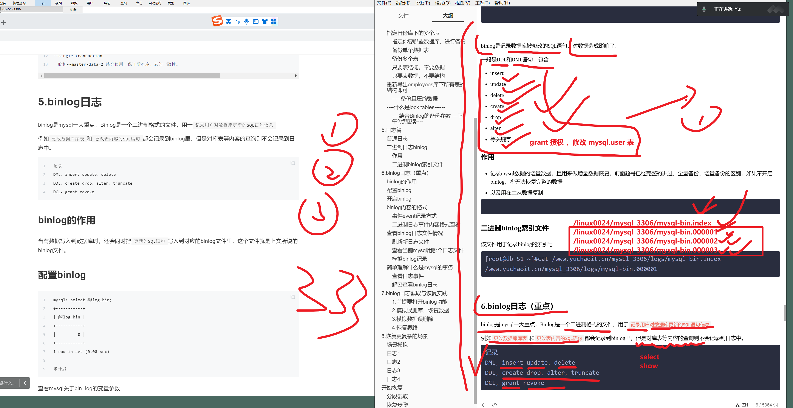
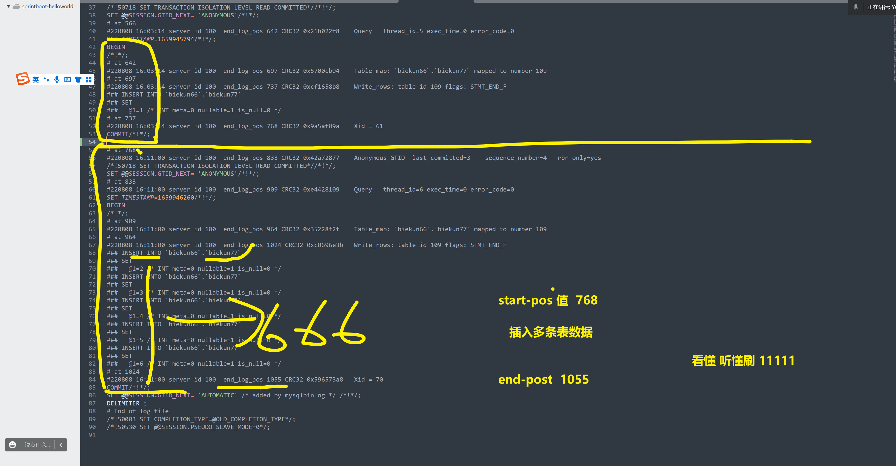

```### 此资源由 58学课资源站 收集整理 ###
	想要获取完整课件资料 请访问：58xueke.com
	百万资源 畅享学习

```


# 开始思考简历制作

目前仅是让大家去构思，学习简历如何写

看看所学知识和市面上诸多的简历，匹配，相似度是如何

你改如何消化吸收这些技术，转为你自己的《个人简历》

总之，不管这个任务有多难，有多少工作量，一点点拆分，一点点攻破，为了更好的明天。

加油吧同志们，有疑问多和我交流，无论是学技术，还是写简历，都要反复打磨。

https://docs.qq.com/sheet/DUVF1V1ppTmFxYmlv?tab=BB08J2


# 1.为什么要备份


运维是干什么的？

- 保护服务器数据安全
- 维护公司运维资产7*24小时运转

> 企业真实案件：
>
> https://www.leiphone.com/category/sponsor/Isb7Smi17CHBTxVF.html

企业丢了数据，就等于失去了商机、客户、产品、甚至倒闭。

在各式各样的数据中，数据库的数据更是核心之核心，当然其他各式各样的如静态文件数据，也很重要，也会通过其他的备份方式来保证安全。


# 2.备份恢复的职责

```
1. 备份、恢复的策略
备份周期、备份工具、备份方式、数据恢复方式

2.日常备份检查
日志、备份数据

3.定期恢复数据演练

4.数据故障时，利用现有的资源，快速恢复

5.数据迁移，数据库升级。
```

# 3.备份工具

物理备份

逻辑备份


## 逻辑备份

把数据库、表，以SQL语句的形式，输出为文件的备份过程，这种方式称之为逻辑备份。

但是这种方式效率并不高，以SQL导出，在海量数据下，例如几十G的场景，备份、恢复的时间都会过长。

因此还会有其他备份方案。

```
mysqldump 
mysqlbinlog
mydumper
binlog2sql
```


## 物理备份

```
1. 工具使用，https://www.percona.com/software/mysql-database/percona-xtrabackup

2.直接shell+crontab备份整个mysql数据目录
```


## 如何选

```
100G数据以内，逻辑备份没问题，服务器配置要跟上
100G 以上，建议物理备份
```


# 4.mysqldump备份

开始逻辑备份的学习

- 只备份某些库
- 只备份某些表
- 以及只要表结构，不要表数据
- 结构，数据都要，全量备份等


```
mysqldump备份语法

Mysqldump -u用户名 -p密码 参数 数据库名 > 数据备份文件

mysql自带的备份工具，可以实现本地备份，远程备份


mysqldump命令备份过程，实际上是把数据库、表，以SQL语句的形式，输出为文件的备份过程，这种方式称之为逻辑备份。

但是这种方式效率并不高，以SQL导出，在海量数据下，例如几十G的场景，备份、恢复的时间都会过长。

因此还会有其他备份方案。
```


## 4.1 mysqldump连接参数

```
-u mysql用户名
-p mysql用户密码
-S mysql本地socket文件
-h 指定主机地址
-P 指定mysql端口
```


## 4.2 mysqldump备份参数

> 可以利用如下语句，实现数据库的数据、结构、很实用的技巧。

### 全量备份

对当前数据库实例，导出，所有的库，表，以及数据，转储为SQL文件

对这个文件进行导入执行。


```
--all--databases，-A   转储所有数据库中的所有表。


[root@tech-db-51 ~]#wc -l /opt/all-3306.sql 
2030 /opt/all-3306.sql
[root@tech-db-51 ~]#
[root@tech-db-51 ~]#file /opt/all-3306.sql 
/opt/all-3306.sql: UTF-8 Unicode text, with very long lines
[root@tech-db-51 ~]#


# 这个备份的文件，具体步骤就是
# 有几张表示空表，没数据， lock, unlock之间是空的

1. 当前操作某个库，   先基于 if条件 判断，然后create 库

2. 删除库下的某个表，然后create 重建表结构

3. 
先 lock 锁住表的数据写入，为了防止恢复出现问题；

恢复数据，insert 插入数据
unlock 解锁表，允许再次写入


mysqldump 逻辑备份，导出的SQL，解读 ，3个流程


```


```
每学一个备份的玩法，就进行数据导入，查看具体备份，恢复的情况。
```


### 准备一个新的数据库实例，模拟数据恢复，查看不同备份命令的数据恢复结果

```
准备一个 3307 实例

1. 清空3307的数据

2. 重新初始化3307的数据

[root@tech-db-51 /linux0224/mysql_3307]#mysqld --initialize-insecure --user=mysql --basedir=/opt/mysql --datadir=/linux0224/mysql_3307/


3.导入3306的数据即可覆盖
# 恢复数据的命令
[root@tech-db-51 /linux0224/mysql_3307]#mysql -S /linux0224/mysql_3307/mysql.sock 

恢复 百兆sql数据文件

3307  > 3306数据  （自建的库表，以及mysql默认得库表）

重启3307后，会读取所有3306 的数据了
[root@tech-db-51 /linux0224/mysql_3307]#bash /linux0224/3307.sh restart
Restarting MySQL...
Stoping MySQL...
Starting MySQL...


此时3307的数据，完全以3306来了，用的3306的账密认证了。
[root@tech-db-51 /linux0224/mysql_3307]#mysql -uroot -plinux3306 -S /linux0224/mysql_3307/mysql.sock 
mysql: [Warning] Using a password on the command line interface can be insecure.


```


## 制定3306备份某个库下的某个表

```

mysqldump -uroot -plinux3306 world  city   >  /opt/world_city.sql


1. 删除city表
2. 创建city表结构 ，定义好字段
3. insert插入数据，city ，一条insert语句写入了所有数据


3307实例单独导入某个表数据

# 方式1，导入数据
mysql> create database test_world;
Query OK, 1 row affected (0.00 sec)

mysql> 
mysql> use test_world;
Database changed
mysql> source /opt/world_city.sql


# 方式2，命令行，指定库，导入

[root@tech-db-51 /linux0224/mysql_3307]#mysql -S /linux0224/mysql_3307/mysql.sock test_world  < /opt/world_city.sql 


mysql> select * from city where id <5;
+----+----------------+-------------+----------+------------+
| ID | Name           | CountryCode | District | Population |
+----+----------------+-------------+----------+------------+
|  1 | Kabul          | AFG         | Kabol    |    1780000 |
|  2 | Qandahar       | AFG         | Qandahar |     237500 |
|  3 | Herat          | AFG         | Herat    |     186800 |
|  4 | Mazar-e-Sharif | AFG         | Balkh    |     127800 |
+----+----------------+-------------+----------+------------+
4 rows in set (0.00 sec)

mysql> # 看懂刷4444


```


## 指定备份库下的多个表

```
#将3306 world库下的  country  countrylanguage  导出为SQL，发给3307导入


[root@tech-db-51 ~]#mysqldump -uroot -plinux3306 world  city country  countrylanguage  >  /opt/world_all_tb.sql
mysqldump: [Warning] Using a password on the command line interface can be insecure.
[root@tech-db-51 ~]#
[root@tech-db-51 ~]#
[root@tech-db-51 ~]#vim /opt/world_all_tb.sql 
[root@tech-db-51 ~]#
[root@tech-db-51 ~]## 该文件，就是对3张表的 结构，数据，导出 ，看懂语法3333


# 恢复数据，到3307实例
[root@tech-db-51 /linux0224/mysql_3307]#mysql -S /linux0224/mysql_3307/mysql.sock test_world  <  /opt/world_all_tb.sql


Database changed
mysql> show tables;
+----------------------+
| Tables_in_test_world |
+----------------------+
| city                 |
| country              |
| countrylanguage      |
+----------------------+
3 rows in set (0.00 sec)


# 小结

导出3306 world库下的多个表

恢复导入到了3307实例中

# 3307本身就有 city 表，数据会重复吗？

#不会，/opt/world_all_tb.sql  ，先drop删表，create 建表，insert写入数据

# 听懂刷1111


```


### 指定你要哪些数据库，进行备份


```bash
--database，-B
转储几个数据库。

通常情况，mysqldump将命令行中的第1个名字参量看作数据库名，后面的名看作表名。
使用该选项，它将所有名字参量看作数据库名。


-B可以跟上多个数据库名，同时备份多个库

尽量结合gzip命令压缩


# 导出3306的 dev01 库   school_db库
mysqldump -uroot -plinux3306  -B school_db dev01 > /opt/school_db-dev01.sql

# 查看sql文件


# 导入到3307实例
mysql> ^DBye
[root@tech-db-51 /linux0224/mysql_3307]#mysql -S /linux0224/mysql_3307/mysql.sock <  /opt/school_db-dev01.sql


```


### 备份单个数据表

这里不能加上`-B`参数了，这是指定数据库的作用


案例：单独指定备份某个table

```
# 单独备份了 world库下的city表

[root@tech-db-51 ~]#mysqldump -uroot -plinux3306 employees   salaries  >  /opt/emp_salaries.sql
mysqldump: [Warning] Using a password on the command line interface can be insecure.
[root@tech-db-51 ~]#
[root@tech-db-51 ~]#
[root@tech-db-51 ~]#
[root@tech-db-51 ~]#vim /opt/emp_salaries.sql 
[root@tech-db-51 ~]#
[root@tech-db-51 ~]#
[root@tech-db-51 ~]#wc -l /opt/emp_salaries.sql 
167 /opt/emp_salaries.sql


```


### 备份多个表

```
[root@tech-db-51 ~]#mysqldump -uroot -plinux3306  employees  titles dept_emp  > /opt/emp-title-dept_emp.sql
mysqldump: [Warning] Using a password on the command line interface can be insecure.


```

通过sql可以看出，整个过程是

- 如果该表存在，则删除
- 创建table
- 锁表，防止数据写入
- 数据插入
- 解锁表

```
grep -Ev '#|\*|--|^$'  /opt/emp-title-dept_emp.sql
```


小结

备份库下，的单个表，多个表，语法看懂刷111


### 只要表结构，不要数据

```
有一些服务器，你想拿到这些服务器上的数据库 ，表的结构，字段即可。
框架

拿到这些框架，导入测试服务器，

--no-data参数

# 语法

mysqldump -uroot -p   库   该库下的表1  该库下的表2   --no-data 

# 导出生产服务器 3306实例的  员工库 下，职称表的结构

mysqldump -uroot -plinux3306  --no-data  employees titles > /opt/emp_titles_no_data.sql

# 看看 sql文件
少一个insert插入数据

# 语法看懂刷111

# 备份的SQL文件，很简单
1，。 删表
2. create 创建表结构
看懂222


[root@tech-db-51 ~]#grep -Ev '#|\*|--|^$'  /opt/emp_titles_no_data.sql 
DROP TABLE IF EXISTS `titles`;
CREATE TABLE `titles` (
  `emp_no` int(11) NOT NULL,
  `title` varchar(50) NOT NULL,
  `from_date` date NOT NULL,
  `to_date` date DEFAULT NULL,
  PRIMARY KEY (`emp_no`,`title`,`from_date`),
  CONSTRAINT `titles_ibfk_1` FOREIGN KEY (`emp_no`) REFERENCES `employees` (`emp_no`) ON DELETE CASCADE
) ENGINE=InnoDB DEFAULT CHARSET=utf8mb4;


```


### 只要表数据，不要结构

```

# 有一个现成的测试服务器，数据表都有了，但是就没数据

# 只要insert语句，不要 create table语句

--no-create-info，-t

还是遵循mysqldump的 默认语法  库  表1  表2 表3

数据导入，文件，可能比较大，建议压缩 


# 导出3306 的 title表数据，以及 salaries ，都是50万数据  100万


mysqldump -uroot -plinux3306  --no-create-info employees   titles  salaries  |gzip  > /opt/data_employees_title_salaries.sql.gz 

# more less 分页读该sql文件 ，省内存，不会卡死


#  恢复该数据，导入到 3307实例
# 创建表，导入sql文件
# 创建该2个对应的表结构即可

CREATE TABLE `titles` (
  `emp_no` int(11) NOT NULL,
  `title` varchar(50) NOT NULL,
  `from_date` date NOT NULL,
  `to_date` date DEFAULT NULL,
  PRIMARY KEY (`emp_no`,`title`,`from_date`),
  CONSTRAINT `titles_ibfk_1` FOREIGN KEY (`emp_no`) REFERENCES `employees` (`emp_no`) ON DELETE CASCADE
) ENGINE=InnoDB DEFAULT CHARSET=utf8mb4 ;


CREATE TABLE `salaries` (
  `emp_no` int(11) NOT NULL,
  `salary` int(11) NOT NULL,
  `from_date` date NOT NULL,
  `to_date` date NOT NULL,
  PRIMARY KEY (`emp_no`,`from_date`),
  CONSTRAINT `salaries_ibfk_1` FOREIGN KEY (`emp_no`) REFERENCES `employees` (`emp_no`) ON DELETE CASCADE
) ENGINE=InnoDB DEFAULT CHARSET=utf8mb4


```


## 重新导出employees库下所有表的结构即可

```
员工库，里面的表，创建时就有约束关系，表与表之间的 字段，有关联

# 必须，先创建employees这个表才行
# 1.先导出3306de  employees表结构
CREATE TABLE `employees` (
  `emp_no` int(11) NOT NULL,
  `birth_date` date NOT NULL,
  `first_name` varchar(14) NOT NULL,
  `last_name` varchar(16) NOT NULL,
  `gender` enum('M','F') NOT NULL,
  `hire_date` date NOT NULL,
  PRIMARY KEY (`emp_no`)
) ENGINE=InnoDB DEFAULT CHARSET=utf8mb4 

# 2. 创建 职称 tiltles表


CREATE TABLE `salaries` (
  `emp_no` int(11) NOT NULL,
  `salary` int(11) NOT NULL,
  `from_date` date NOT NULL,
  `to_date` date NOT NULL,
  PRIMARY KEY (`emp_no`,`from_date`),
  CONSTRAINT `salaries_ibfk_1` FOREIGN KEY (`emp_no`) REFERENCES `employees` (`emp_no`) ON DELETE CASCADE
) ENGINE=InnoDB DEFAULT CHARSET=utf8mb4


3.检查表
mysql> 
mysql> show tables;
+--------------+
| Tables_in_d1 |
+--------------+
| employees    |
| salaries     |
| titles       |
+--------------+
3 rows in set (0.00 sec)


4.导入sql数据

方式1
1. 先解压为普通的sql文件
2. 再学过命令导入

# 方法1，会刷刷1111


方法2
zcat data_employees_title_salaries.sql.gz  | mysql -S /linux0224/mysql_3307/mysql.sock d1 


# 验证数据的恢复titles
mysql> select * from titles order by emp_no limit 0,5;
+--------+-----------------+------------+------------+
| emp_no | title           | from_date  | to_date    |
+--------+-----------------+------------+------------+
|  10001 | Senior Engineer | 1986-06-26 | 9999-01-01 |
|  10002 | Staff           | 1996-08-03 | 9999-01-01 |
|  10003 | Senior Engineer | 1995-12-03 | 9999-01-01 |
|  10004 | Engineer        | 1986-12-01 | 1995-12-01 |
|  10004 | Senior Engineer | 1995-12-01 | 9999-01-01 |
+--------+-----------------+------------+------------+
5 rows in set (0.00 sec)

# 工资表
mysql> select * from salaries order by emp_no limit 0,5;
+--------+--------+------------+------------+
| emp_no | salary | from_date  | to_date    |
+--------+--------+------------+------------+
|  10001 |  60117 | 1986-06-26 | 1987-06-26 |
|  10001 |  62102 | 1987-06-26 | 1988-06-25 |
|  10001 |  66074 | 1988-06-25 | 1989-06-25 |
|  10001 |  66596 | 1989-06-25 | 1990-06-25 |
|  10001 |  66961 | 1990-06-25 | 1991-06-25 |
+--------+--------+------------+------------+
5 rows in set (0.00 sec)


# 员工库，表的  备份，恢复，看懂刷1111

下午 2点继续再来看mysql 的 binlog日志玩法


```


### -----备份且压缩数据

对于数据库有大量数据表，以及信息，导出的备份文件，最好是压缩后的，节省磁盘。

```
# 压缩数据备份，
[root@tech-db-51 ~]#du -h /opt/data_employees_title_salaries.sql.gz
27M	/opt/data_employees_title_salaries.sql.gz

```


## ----什么是lock tables------

禁止DML相关SQL执行


```
mysql提供的，基于会话的 锁表，防止他人冲突写入数据。


语法1，单独锁某个表
基于会话的，锁某个表
# 针对其他mysql链接会话的写入动作，锁住。
mysql> lock table  world.city write;


mysql> unlock tables;
Query OK, 0 rows affected (0.00 sec)

mysql> select * from city order by id desc limit 0,5;
+------+------+-------------+----------+------------+
| ID   | Name | CountryCode | District | Population |
+------+------+-------------+----------+------------+
| 4084 |      |             |          |          0 |
| 4083 |      |             |          |          0 |
| 4082 |      |             |          |          0 |
| 4081 |      |             |          |          0 |
| 4080 |      |             |          |          0 |
+------+------+-------------+----------+------------+
5 rows in set (0.00 sec)


语法2，全局读锁，针对普通账号的写入权限。
set global read_only=1;
set global read_only=0;


```


### ----结合Binlog的备份参数----下午2点继续----

```
--master-data[=value]
该选项将二进制日志的位置和文件名写入到输出中。

该选项要求有RELOAD权限，并且必须启用二进制日志。一般都用root用户备份，权限没问题。

如果该选项值等于1，位置和文件名被写入CHANGE MASTER语句形式的转储输出，如果你使用该SQL转储主服务器以设置从服务器，从服务器从主服务器二进制日志的正确位置开始。

如果选项值等于2，CHANGE MASTER语句被写成SQL注释。


--single-transaction 

一般和--master-data=2 结合使用，保证所有库、表的一致性。
```


# 5.日志篇

> 日志的作用，不说大家应该都知道，可以收集、检测我们程序的健康状况

默认这些日志，大部分是未开启的，运维小于可以通过命令、配置文件，开启这些日志，以及定义存储路径。

> mysql日志文件的作用：

1、能记录物理数据页面的修改的信息；

2、能将数据从逻辑上恢复至事务之前的状态；

3、能以二进制文件的形式记录了数据库中的操作；

4、能记录错误的相关信息；

5、能从主服务器中二进制文件取的事件等等。

## 普通日志

记录了服务器接收到的每一个查询或是命令，无论这些查询或是命令是否正确甚至是否包含语法错误，general log 都会将其记录下来 ，记录的格式为 {Time ，Id ，Command，Argument }。

也正因为mysql服务器需要不断地记录日志，开启General log会产生不小的系统开销。 因此，Mysql默认是把General log关闭的。

```
产生大量的磁盘IO，导致数据库服务器的磁盘压力，CPU压力。


mysql数据库的特点是

底层的逻辑是

1.先写入数据到磁盘中
2. 记录本次写入动作，记录到日志中


增删改查语句，全部记录下来。

用在银行，证券等公司，需要对每一个SQL语句，做严格的记录，审核，后期的检查。恢复等。

采购高价的SSD超强的CPU，超大的存储磁盘。


```


## 二进制日志binlog


```
mysql将你执行的DML相关的SQL操作

insert 插入数据
create 建库，建表

默认会做的事
1. 实质性的创建库表数据，写入磁盘中。


做2件事，维护数据的安全

1. 定时备份


2. binlog二进制日志

将你每次的DML操作，额外开启一个binlog日志功能，记录本次修改数据的操作，写入到日志中


```


binlog是记录数据库被修改的SQL语句，对数据造成影响了。

一般是DDL和DML语句，包含

- insert
- update
- delete
- create
- drop
- alter
- 等关键字

### 作用

- 记录mysql数据的增量数据，且用来做增量数据恢复，前面超哥已经完整的讲过、全量备份、增量备份的区别，如果不开启binlog，将无法恢复完整的数据。

- 以及用在主从数据复制

```

```

### 二进制binlog索引文件

该文件用于记录binlog的索引号

```
[root@db-51 ~]#cat /www.yuchaoit.cn/mysql_3306/logs/mysql-bin.index 
/www.yuchaoit.cn/mysql_3306/logs/mysql-bin.000001
```


# 6.binlog日志（重点）

binlog是mysql一大重点，Binlog是一个二进制格式的文件，用于`记录用户对数据库更新的SQL语句信息`

例如`更改数据库库表`和`更改表内容的SQL语句`都会记录到binlog里，但是对库表等内容的查询则不会记录到日志中。

```
记录
DML，insert update，delete
DDL，create drop，alter，truncate
DCL，grant revoke
```





## binlog的作用

当有数据写入到数据库时，还会同时把`更新的SQL语句`写入到对应的binlog文件里，这个文件就是上文所说的binlog文件。

```


备注：mysql是先写日志，再写入数据的过程。


insert into  city values();

先后的mysql底层会

1. 先记录到binlog中，这个insert语句
2. 执行该语句，写入磁盘数据


不同于redis的日志，先写入数据，再写入日志。


这俩关乎于大量数据的读写性能差异。


===================
redis ==== 数据持久化的动作

1. 内存型数据，为了超高的并发特性，不会先去记录日志

1. 直接写入内存数据
2. 再记录本次的 写入日志记录


```


2.52 继续待会来安装配置binlog


## ----------配置log_bin---------


默认是没开启binlog功能的

```

查看mysql关于log_bin的变量参数


查看log_bin的配置信息


mysql> show variables like '%log_bin%';
+---------------------------------+-------+
| Variable_name                   | Value |
+---------------------------------+-------+
| log_bin                         | OFF   |
| log_bin_basename                |       |
| log_bin_index                   |       |
| log_bin_trust_function_creators | OFF   |
| log_bin_use_v1_row_events       | OFF   |
| sql_log_bin                     | ON    |
+---------------------------------+-------+
6 rows in set (0.01 sec)


```


## 开启binlog

```
只需要修改配置文件，加入开启 log_bin的参数即可，就是永久生效的了

server_id=100
# 是指二进制日志，具体存储到哪，建议做法是，和mysql数据目录分开

mkdir -p /mysql_log/log_bin_3306/

log_bin=/mysql_log/log_bin_3306/mysql-log-bin


# 最终配置
[root@tech-db-51 ~]#cat /etc/my.cnf 

[mysqld]
server_id=100
log_bin=/mysql_log/log_bin_3306/mysql-log-bin
character_set_server=utf8mb4
log-error=/linux0224/mysql_3306/logs/3306-err.log
port=3306
user=mysql
basedir=/opt/mysql
datadir=/linux0224/mysql_3306/
socket=/tmp/mysql.sock

[mysql]
socket=/tmp/mysql.sock
[root@tech-db-51 ~]#


# 重启mysqld
mkdir -p /mysql_log/log_bin_3306/
chown -R mysql.mysql /mysql_log/
systemctl restart mysqld

# 目前是没有二进制日志文件的，只有发生DML操作后，自动生成
[root@tech-db-51 ~]#cd /mysql_log/log_bin_3306/
[root@tech-db-51 /mysql_log/log_bin_3306]#ll
total 0


# 检查mysql，二进制日志的变量配置信息


mysql> show variables like '%log_bin%';
+---------------------------------+---------------------------------------------+
| Variable_name                   | Value                                       |
+---------------------------------+---------------------------------------------+
| log_bin                         | ON                                          |
| log_bin_basename                | /mysql_log/log_bin_3306/mysql-log-bin       |
| log_bin_index                   | /mysql_log/log_bin_3306/mysql-log-bin.index |
| log_bin_trust_function_creators | OFF                                         |
| log_bin_use_v1_row_events       | OFF                                         |
| sql_log_bin                     | ON                                          |
+---------------------------------+---------------------------------------------+
6 rows in set (0.01 sec)

mysql> 


```


查看具体的日志信息

```
[root@tech-db-51 /mysql_log/log_bin_3306]#ll
total 8
-rw-r----- 1 mysql mysql 154 Aug  8 15:04 mysql-log-bin.000001
-rw-r----- 1 mysql mysql  45 Aug  8 15:04 mysql-log-bin.index
[root@tech-db-51 /mysql_log/log_bin_3306]#


```


6666


周一困乏综合征


春困

夏乏

秋打盹


```
小结

binlog

1. 画图，告诉binlog 用于DML数据操作的日志记录，可以用于恢复操作

2. 配置mysql，开启binlog

3. 具体

- 基于myssqlbinlog 命令，解读 二进制日志的作用（记录了哪些事件，SQL干啥，）
- binlog 数据恢复实战演练。

```


## binlog内容的格式

### 事件event记录方式

也就是binlog日志记录了如下内容，解密后可看。


```
1. 事件描述
时间戳
server_id
加密方式

开始位置 start_pos
结束位置 end_pos


mysql里面的数据操作，都是事务性，被mysql以 开始-结尾 做了一个记录


create database  d1; 从开始 到结束，都被mysql  数字号，记录位置


2.事件内容
修改类的操作，SQL语句，数据行的变化


重点，使用binlog主要关注
start_pos
end_pos
事件内容
```

### 二进制日志事件内容格式查看


```
# 查看binlog日志的详细信息

mysql> show variables like '%binlog%';

这里看到| binlog_format 是ROW

对于DDL、DCL语句，直接将SQL本身记录到binlog中
对于DML : insert、update、delete 受到binlog_format参数控制。


SBR : Statement : 语句模式。之前版本，默认模式
RBR : ROW : 行记录模式。5.7以后，默认模式
MBR : mixed : 混合模式。

# 一句话，5.7版本中

binlog日志，基于行去记录 用户的DML操作

简单说就是，一个insert 语句，记录为一行日志，更新一个pos值
一个delete语句，也事一行日志，更新一个pos值


```


## 查看binlog日志文件情况

查看所有日志文件的信息，二进制日志

```
[root@tech-db-51 /linux0224/mysql_3306]#ls /mysql_log/log_bin_3306/
mysql-log-bin.000001  mysql-log-bin.index

# 查看当前数据库实例，用哪个日志文件记录 SQL中。

show binary logs;

mysql> show binary logs;
+----------------------+-----------+
| Log_name             | File_size |
+----------------------+-----------+
| mysql-log-bin.000001 |       154 |
+----------------------+-----------+
1 row in set (0.00 sec)


查看当前日志，记录的事件，最新截止点在哪
mysql> show master status;
+----------------------+----------+--------------+------------------+-------------------+
| File                 | Position | Binlog_Do_DB | Binlog_Ignore_DB | Executed_Gtid_Set |
+----------------------+----------+--------------+------------------+-------------------+
| mysql-log-bin.000001 |      154 |              |                  |                   |
+----------------------+----------+--------------+------------------+-------------------+
1 row in set (0.00 sec)


# 只要数据变化


```


### 刷新新日志文件

了解该命令即可，不能随便执行。。

```
一般用于数据库恢复，数据库重置时，才会用到。

除非你已经做好了全量备份，次日新增数据时，重新记录新的binlog也行。

flush logs; 不能随便敲

```

### 查看当前mysql用哪个日志文件

```


查看当前mysql，正在用的哪个binlog日志文件
show master status;


显示mysql所有的binlog记录
你当前数据库实例，所有的数据变化，分散记录再了这些日志文件中


mysql> show binary logs;
+----------------------+-----------+
| Log_name             | File_size |
+----------------------+-----------+
| mysql-log-bin.000001 |       557 |
| mysql-log-bin.000002 |       328 |
+----------------------+-----------+
2 rows in set (0.00 sec)


```


### 模拟binlog记录

```
1.写入数据，库，表

2.分别查看binlog记录pos值的变化，确认binlog会记录哪些SQL。

3.确认上述的所有数据创建操作，属于mysql的一个完整事务，到执行commit命令。


4. 当前用的数据库引擎，叫做innodb，默认就是DML操作都是事务性操作。
SQL执行完毕后，默认执行了一个commit提交指令。

mysql> show master status;
+----------------------+----------+--------------+------------------+-------------------+
| File                 | Position | Binlog_Do_DB | Binlog_Ignore_DB | Executed_Gtid_Set |
+----------------------+----------+--------------+------------------+-------------------+
| mysql-log-bin.000002 |      508 |              |                  |                   |
+----------------------+----------+--------------+------------------+-------------------+
1 row in set (0.00 sec)

mysql> 
mysql> 
mysql> insert into hei values("看懂刷111");
Query OK, 1 row affected (0.00 sec)

mysql> 
mysql> show master status;
+----------------------+----------+--------------+------------------+-------------------+
| File                 | Position | Binlog_Do_DB | Binlog_Ignore_DB | Executed_Gtid_Set |
+----------------------+----------+--------------+------------------+-------------------+
| mysql-log-bin.000002 |      783 |              |                  |                   |
+----------------------+----------+--------------+------------------+-------------------+
1 row in set (0.00 sec)

mysql> 


```


15. 37继续


binlog具体玩法，来学习


## 简单理解什么是mysql的事务

```
可以理解为
你去存钱
1.第一次存500，第二次存800，然后退出银行卡时，本次存钱的动作，永久写入数据库，你的余额永久变化了

2. 你去转账给好兄弟，第一次转了5块，第二次转了10块，这个过程都得你好兄弟的卡里，多了5块，10块，才是正确的，如果哪一方的账号出了问题，导致转账动作异常，数据库都能回退本次操作。
也就是，你不会少5块，对方也不会多5块，数据一致性完全正确。
这是mysql数据库提供的事务性特征。
```


```

1. 男同志给你女朋友转情人节红包。   男扣 -5201314;

（首先会提示扣款成功）


2. 女朋友 ，银行，每日最大交易额， 5W
卡，超出交易额，


3. 本次交易失败

男朋友的卡，会受到短信，钱退回来了（数据库系统，事务，发生了作用）

要么转账成功，女朋友多了 52013134；


要么就都失败，女朋友不会多钱，男朋友这也不会少钱，这是数据库系统的事务特征具体场景。。
听懂111


```


### 查看日志事件

具体来看 二进制日志事件截图，看看，日志到底记录了个啥。

```
1. binlog是二进制，人类看不懂的

2. 基于mysqlbinlog命令，解读为普通的SQL文件即可


```


### 体验binlog流程图解


```

154
		
		建库  明文


325

		建表 ,明文

501


		插入表数据 	


at  768 从这开始

	插入多条数据


1055


能看懂刷6766666


# 解密当前binlog，查看具体的SQL
# 基于base64算法，按行解密binlog
#  -vv 显示日志的详细程度

[root@tech-db-51 /mysql_log/log_bin_3306]#mysqlbinlog --base64-output=decode-rows -vv    mysql-log-bin.000003 > /tmp/decode-mysql-log.txt


# 再次插入多条数据，pos值变化
mysql> insert into biekun77 values(2),(3),(4),(5),(6);
Query OK, 5 rows affected (0.00 sec)
Records: 5  Duplicates: 0  Warnings: 0


# 再次解密日志，查看 插入的数据


```





### 解密查看binlog日志

解密binlog，其实就是解密出具体的SQL语句，也就看到了具体的数值。

```
[root@db-51 /mysql_backup]#mysqlbinlog /www.yuchaoit.cn/mysql_3306/logs/mysql-bin.000003


[root@db-51 /mysql_backup]#mysqlbinlog --base64-output=decode-rows -vv /www.yuchaoit.cn/mysql_3306/logs/mysql-bin.000003

```


# 7.binlog日志截取与恢复实践


```
1. 查看当前数据库，都用了哪些binlog
mysql> show binary logs;
+----------------------+-----------+
| Log_name             | File_size |
+----------------------+-----------+
| mysql-log-bin.000001 |       557 |
| mysql-log-bin.000002 |      1109 |
| mysql-log-bin.000003 |      1055 |
+----------------------+-----------+
3 rows in set (0.00 sec)


2. 当前正在用哪个binlog
mysql> show master status;
+----------------------+----------+--------------+------------------+-------------------+
| File                 | Position | Binlog_Do_DB | Binlog_Ignore_DB | Executed_Gtid_Set |
+----------------------+----------+--------------+------------------+-------------------+
| mysql-log-bin.000003 |     1055 |              |                  |                   |
+----------------------+----------+--------------+------------------+-------------------+
1 row in set (0.00 sec)


3. 查看binlog的玩法

mysql> show master status;
+----------------------+----------+--------------+------------------+-------------------+
| File                 | Position | Binlog_Do_DB | Binlog_Ignore_DB | Executed_Gtid_Set |
+----------------------+----------+--------------+------------------+-------------------+
| mysql-log-bin.000003 |     1055 |              |                  |                   |
+----------------------+----------+--------------+------------------+-------------------+
1 row in set (0.00 sec)


删除数据5

删除动作也是修改，也会提交事务，也会生成新的pos值

mysql> delete from biekun77 where id=5;
Query OK, 1 row affected (0.00 sec)

mysql> show master status;
+----------------------+----------+--------------+------------------+-------------------+
| File                 | Position | Binlog_Do_DB | Binlog_Ignore_DB | Executed_Gtid_Set |
+----------------------+----------+--------------+------------------+-------------------+
| mysql-log-bin.000003 |     1322 |              |                  |                   |
+----------------------+----------+--------------+------------------+-------------------+
1 row in set (0.00 sec)


# 能理解    1055   ------------- 1322 pos值之间，删除数据5，刷1111


# 解密binlog日志


# 更精确的确认pos值的玩法
起点截止点

show binlog events in 'mysql-log-bin.000003'

# 恢复数据的命令

#  --start-position  从哪个pos值开始

#  --stop-positio 到哪个pos值结束 （delete语句之前截止）

# 思路还能跟得上，刷2222


# 这个命令是，解密binlog，截取日志，只截取写入数据的 部分SQL，丢弃delete语句的部分
# delete删除数据
# 重新insert写入不就得了么


```


```
binlog这一块的学习

1. binlog如何开启
2. binlog如何查看，多个命令
3. 如何查看binlog的事件

4. binlog就是记录你增删改查操作的一个日志

5.基于binlog实现数据的恢复 


6. 直接基于mysql的 binlog  pos值去恢复，目前生产级别，最新的玩法，

GTID日志玩法

将你每一个 事务操作，提交为一个 基于uuid的 事务版本号

v1 insert 
v2 insert
v3 insert 
v4  insert  
再也不用你关心，这俩参数怎么玩了
--start-position=381 --stop-position=752


mysqlbinlog --start-position=381 --stop-position=752 mysql-log-bin.000004 > /tmp/restore-lol.sql


 

```


## ------误删除数据的恢复思路-------

```
1. 使用mysql的GTID日志模式
用这个方式，就可以不用考虑POS值的选择麻烦了，目前生产玩法都是它，学习手工pos值的玩法，是为了更好理解GTID的优点。


2. 基于mysqlbinlog的日志提取


3.目前的思路是

- 如果是单行数据的delete
提取日志，解密SQL，然后手工insert插入数据即可

1. 当前的 日志状态
mysql> show master status;
+----------------------+----------+--------------+------------------+-------------------+
| File                 | Position | Binlog_Do_DB | Binlog_Ignore_DB | Executed_Gtid_Set |
+----------------------+----------+--------------+------------------+-------------------+
| mysql-log-bin.000004 |     1793 |              |                  |                   |
+----------------------+----------+--------------+------------------+-------------------+
1 row in set (0.00 sec)


2. 手工删除数据，基于日志恢复
# 
mysql> delete from tb1 where id =2;
Query OK, 1 row affected (0.00 sec)

mysql> 
mysql> show master status;
+----------------------+----------+--------------+------------------+-------------------+
| File                 | Position | Binlog_Do_DB | Binlog_Ignore_DB | Executed_Gtid_Set |
+----------------------+----------+--------------+------------------+-------------------+
| mysql-log-bin.000004 |     2049 |              |                  |                   |
+----------------------+----------+--------------+------------------+-------------------+
1 row in set (0.00 sec)


# 当前状态 是 1793  2049截止，是数据删除


# 误删除了一个数据
# 删除的动作，被记录到了 binlog日志了
分析binlog日志，能知道你到底删除了什么
# delete也是被加密的数据


# 误误删除数据，你是不知道，到底删除了什么的 
# 这个删除动作，由于开启binlog日志，所以delete动作也被记录下来AI

# 提取binlog日志部分信息，解密出了，到底删了什么

mysqlbinlog   --start-position=1793 --stop-position=2049 mysql-log-bin.000004 > /tmp/delete-test.sql

# 


# 单行恢复，删除了什么
# insert 写入

mysql> select * from data1.tb1;
+------+
| id   |
+------+
|    1 |
|    3 |
|    4 |
+------+
3 rows in set (0.00 sec)

mysql> 
mysql> insert into data1.tb1 values(2);
Query OK, 1 row affected (0.00 sec)


- 如果是删库，删表级别的操作。
提取，从建库，到插入数据的部分


 
```


## ----模拟练习----

```

1.再来一次，建库，建表，删表，恢复数据


1.刷新日志，从头来
mysql> show master status;
+----------------------+----------+--------------+------------------+-------------------+
| File                 | Position | Binlog_Do_DB | Binlog_Ignore_DB | Executed_Gtid_Set |
+----------------------+----------+--------------+------------------+-------------------+
| mysql-log-bin.000006 |      154 |              |                  |                   |
+----------------------+----------+--------------+------------------+-------------------+
1 row in set (0.00 sec)


mysql> 
mysql> create database db06;
Query OK, 1 row affected (0.00 sec)

mysql> use db06;
Database changed
mysql> show master status;
+----------------------+----------+--------------+------------------+-------------------+
| File                 | Position | Binlog_Do_DB | Binlog_Ignore_DB | Executed_Gtid_Set |
+----------------------+----------+--------------+------------------+-------------------+
| mysql-log-bin.000006 |      313 |              |                  |                   |
+----------------------+----------+--------------+------------------+-------------------+
1 row in set (0.00 sec)


mysql> create table tb06(id int);
Query OK, 0 rows affected (0.00 sec)

mysql> show master status;
+----------------------+----------+--------------+------------------+-------------------+
| File                 | Position | Binlog_Do_DB | Binlog_Ignore_DB | Executed_Gtid_Set |
+----------------------+----------+--------------+------------------+-------------------+
| mysql-log-bin.000006 |      477 |              |                  |                   |
+----------------------+----------+--------------+------------------+-------------------+
1 row in set (0.00 sec)


mysql> insert into tb06 values(66),(77),(88);
Query OK, 3 rows affected (0.01 sec)
Records: 3  Duplicates: 0  Warnings: 0

mysql> 
mysql> show master status;
+----------------------+----------+--------------+------------------+-------------------+
| File                 | Position | Binlog_Do_DB | Binlog_Ignore_DB | Executed_Gtid_Set |
+----------------------+----------+--------------+------------------+-------------------+
| mysql-log-bin.000006 |      742 |              |                  |                   |
+----------------------+----------+--------------+------------------+-------------------+
1 row in set (0.00 sec)


# 查看binlog的事件


1. 建库    154 > 313  
2. 建表    313  > 477
3. 写入数据  477 > 742  
4. 删库  742  >  899

4.  直接干掉这个库 ，db06
drop database db06;

查看 日志状态
show master status;

mysql> show master status;
+----------------------+----------+--------------+------------------+-------------------+
| File                 | Position | Binlog_Do_DB | Binlog_Ignore_DB | Executed_Gtid_Set |
+----------------------+----------+--------------+------------------+-------------------+
| mysql-log-bin.000006 |      899 |              |                  |                   |
+----------------------+----------+--------------+------------------+-------------------+
1 row in set (0.00 sec)

日志事件


2. 恢复数据

你目前所有的操作，都被记录再了日志
 mysql-log-bin.000006
 
 - 先看啊看这个日志，完整的SQL记录
 
 mysqlbinlog    mysql-log-bin.000006


# 再次查看日志事件，截取，你要的 SQL范围
mysql> show binlog events in 'mysql-log-bin.000006';

--start-position
 --stop-position 


mysqlbinlog  --start-position=154 --stop-position=419 mysql-log-bin.000007 > /tmp/huifu-tb06.sql

# 恢复操作

1. 先停止binlog的记录
mysql> set sql_log_bin=0;
Query OK, 0 rows affected (0.00 sec)

mysql> show variables like '%log_bin%';
+---------------------------------+---------------------------------------------+
| Variable_name                   | Value                                       |
+---------------------------------+---------------------------------------------+
| log_bin                         | ON                                          |
| log_bin_basename                | /mysql_log/log_bin_3306/mysql-log-bin       |
| log_bin_index                   | /mysql_log/log_bin_3306/mysql-log-bin.index |
| log_bin_trust_function_creators | OFF                                         |
| log_bin_use_v1_row_events       | OFF                                         |
| sql_log_bin                     | OFF                                         |
+---------------------------------+---------------------------------------------+
6 rows in set (0.00 sec)

2数据导入


mysql> set sql_log_bin=0;
Query OK, 0 rows affected (0.00 sec)

mysql> show variables like '%log_bin%';
+---------------------------------+---------------------------------------------+
| Variable_name                   | Value                                       |
+---------------------------------+---------------------------------------------+
| log_bin                         | ON                                          |
| log_bin_basename                | /mysql_log/log_bin_3306/mysql-log-bin       |
| log_bin_index                   | /mysql_log/log_bin_3306/mysql-log-bin.index |
| log_bin_trust_function_creators | OFF                                         |
| log_bin_use_v1_row_events       | OFF                                         |
| sql_log_bin                     | OFF                                         |
+---------------------------------+---------------------------------------------+
6 rows in set (0.00 sec)


source /opt/huifu-tb06.sql 


set sql_log_bin=1;

```


## 昨日回顾


```
1. mysqldump实现逻辑备份
全量备份
备份某些库
备份某些库下的，某些表
以及只要数据，不要表结构  insert   ，打开导出的sql文件看看，mysqldump导出的数据就是个普通文本
只要表结构，不要数据 


2. binlog二进制日志

- binlog的作用,记录你修改类的操作，记录到日志中
除非你主动基于myqsldump数据备份,如果再还未备份之前
1. 建了一张表
2. 写入了些数据
3. 有人删表了

binlog的作用显而易见
- 再你未进行备份之前，你还没备份数据，


- 如何配置打开binlog
- 基于哪些SQL语句，可以查看binlog 的信息


```


# ====今日踩坑总结=======


```
https://dev.mysql.com/doc/refman/5.7/en/mysqlbinlog-row-events.html


活到老，学到老，涨经验了，在官网，查阅--base64-output=DECODE-ROWS  该参数的作用时，发现，官网明确说明了，这个参数，有更良好的阅读性

但是不应该用于数据恢复


```


再了解了binlog是用于记录数据变化的一个日志后，就得明白，这个日志是用于数据恢复的。

```
数据写入，记录日志SQL
数据丢了？不用吗，日志SQL恢复即可。
```

### 1.前提要打开binlog功能


```
创建、导入数据库等操作，要提前就打开binlog，否则无法记录

mysql> show master status;   （测试截止点 935）

查看当前正在用哪个binlog，以及数据截止点在哪  

2. 查看某个binlog，每次事务的 pos值区间，以及对应的事件名（建库，写入数据，删除数据）

mysql> mysql> show binlog events in 'mysql-log-bin.000007';


```

### 2.模拟误删库，恢复数据

```
模拟误删除库，恢复到删库之前

重新建数据
mysql> 
mysql> flush logs;
Query OK, 0 rows affected (0.01 sec)

mysql> 
mysql> 
mysql> show master status;
+----------------------+----------+--------------+------------------+-------------------+
| File                 | Position | Binlog_Do_DB | Binlog_Ignore_DB | Executed_Gtid_Set |
+----------------------+----------+--------------+------------------+-------------------+
| mysql-log-bin.000008 |      154 |              |                  |                   |
+----------------------+----------+--------------+------------------+-------------------+
1 row in set (0.00 sec)

mysql> 
mysql> 
mysql> create database lol01;
Query OK, 1 row affected (0.00 sec)

mysql> 
mysql> 
mysql> use lol01;
Database changed
mysql> 
mysql> create table tanke(id int);
Query OK, 0 rows affected (0.00 sec)

mysql> 
mysql> show master status;
+----------------------+----------+--------------+------------------+-------------------+
| File                 | Position | Binlog_Do_DB | Binlog_Ignore_DB | Executed_Gtid_Set |
+----------------------+----------+--------------+------------------+-------------------+
| mysql-log-bin.000008 |      483 |              |                  |                   |
+----------------------+----------+--------------+------------------+-------------------+
1 row in set (0.00 sec)


查看发生了几次事务
show binlog events in 'mysql-log-bin.000008';

# 本次事务区间    483-751
mysql> insert into tanke values(666),(777),(888);
Query OK, 3 rows affected (0.01 sec)
Records: 3  Duplicates: 0  Warnings: 0


```


### 3.模拟数据误删除

```

```


### 4.恢复思路

基于binlog的日志事件查看，找到建库事件，删库事件

```
1. 截取从建库到删库之间的所有的binlog

2.先看看当前的binlog
mysql> show master status;

3.找到建库的事件pos值

4. 找到删库前的pos事件值

5.截取删库前的SQL恢复即可


从建表，到删数据前的 事务，进行恢复，
基于mysqlbinlog命令，截取 binlog日志，拿到这个区间的SQL
mysql-log-bin.000008

# --start-position 从建表开始  316

# --stop-position  到删表之前结束 751

# 截取部分日志 
mysqlbinlog  --start-position=316 --stop-position=751 mysql-log-bin.000008 > /opt/不恢复直播吃电脑.txt


# 预期结果是 ，查询tanke表，看到 666 777 888

# 要进入数据库，暂停事务的记录
mysql> set sql_log_bin=0;
Query OK, 0 rows affected (0.00 sec)


导入数据
mysql> source /opt/不恢复直播吃电脑.txt


再次开启事务记录

mysql> select * from lol01.tanke;
+------+
| id   |
+------+
|  666 |
|  777 |
|  888 |
+------+
3 rows in set (0.00 sec)

mysql> # kandong 6666

# 再次开启事务记录
set sql_log_bin=1;


10.35 jixu 


```


仅仅是从单个的binlog实现数据恢复。


# 8.恢复更复杂的场景


问题：数据记录在多个binlog里如何恢复

## 场景模拟

主要思路

```
主动执行基于flush logs命令；
生成新的binlog
```


## 日志1

```
mysql> flush logs;
Query OK, 0 rows affected (0.01 sec)

mysql> 
mysql> 
mysql> show master status;
+----------------------+----------+--------------+------------------+-------------------+
| File                 | Position | Binlog_Do_DB | Binlog_Ignore_DB | Executed_Gtid_Set |
+----------------------+----------+--------------+------------------+-------------------+
| mysql-log-bin.000012 |      154 |              |                  |                   |
+----------------------+----------+--------------+------------------+-------------------+
1 row in set (0.00 sec)

mysql> set sql_log_bin=1;
Query OK, 0 rows affected (0.00 sec)

mysql> 
mysql> 
mysql> show master status;
+----------------------+----------+--------------+------------------+-------------------+
| File                 | Position | Binlog_Do_DB | Binlog_Ignore_DB | Executed_Gtid_Set |
+----------------------+----------+--------------+------------------+-------------------+
| mysql-log-bin.000012 |      154 |              |                  |                   |
+----------------------+----------+--------------+------------------+-------------------+
1 row in set (0.00 sec)


mysql> create database kings;
Query OK, 1 row affected (0.00 sec)

mysql> 

| mysql-log-bin.000012 |      154 |  

```


## 日志2

```
mysql> flush logs;
Query OK, 0 rows affected (0.00 sec)


mysql> create table kings.cike(name char(50));
Query OK, 0 rows affected (0.00 sec)


mysql-log-bin.000013
```


## 日志3

```
mysql> flush logs;
Query OK, 0 rows affected (0.00 sec)

mysql> show master status;
+----------------------+----------+--------------+------------------+-------------------+
| File                 | Position | Binlog_Do_DB | Binlog_Ignore_DB | Executed_Gtid_Set |
+----------------------+----------+--------------+------------------+-------------------+
| mysql-log-bin.000014 |      154 |              |                  |                   |
+----------------------+----------+--------------+------------------+-------------------+
1 row in set (0.00 sec)


mysql> insert into kings.cike values('钟薛高'),('兰陵王');
Query OK, 2 rows affected (0.00 sec)
Records: 2  Duplicates: 0  Warnings: 0


mysql> show binlog events in 'mysql-log-bin.000014';
+----------------------+-----+----------------+-----------+-------------+---------------------------------------+
| Log_name             | Pos | Event_type     | Server_id | End_log_pos | Info                                  |
+----------------------+-----+----------------+-----------+-------------+---------------------------------------+
| mysql-log-bin.000014 |   4 | Format_desc    |       100 |         123 | Server ver: 5.7.28-log, Binlog ver: 4 |
| mysql-log-bin.000014 | 123 | Previous_gtids |       100 |         154 |                                       |
| mysql-log-bin.000014 | 154 | Anonymous_Gtid |       100 |         219 | SET @@SESSION.GTID_NEXT= 'ANONYMOUS'  |
| mysql-log-bin.000014 | 219 | Query          |       100 |         292 | BEGIN                                 |
| mysql-log-bin.000014 | 292 | Table_map      |       100 |         342 | table_id: 141 (kings.cike)            |
| mysql-log-bin.000014 | 342 | Write_rows     |       100 |         399 | table_id: 141 flags: STMT_END_F       |
| mysql-log-bin.000014 | 399 | Xid            |       100 |         430 | COMMIT /* xid=988 */                  |
| mysql-log-bin.000014 | 430 | Anonymous_Gtid |       100 |         495 | SET @@SESSION.GTID_NEXT= 'ANONYMOUS'  |
| mysql-log-bin.000014 | 495 | Query          |       100 |         590 | drop database kings                   |
+----------------------+-----+----------------+-----------+-------------+---------------------------------------+
9 rows in set (0.01 sec)


```


# 开始恢复

## 分段截取

```
--start-position

--stop-position
```

## 恢复步骤

```
思路，找到要恢复的库，从建库开始，到删库这个事件之间的一个过程


1.找到建库起点

2.找到删库的起点事件，截止到这就行

3.基于mysqlbinlog命令，通过起点pos，终点pos值，完成数据恢复，剔除了删库的事件。
（其实就等于历史数据恢复，将创建数据的动作再来一遍，剔除了删除的动作）

写入连续的多个binlog日志

show binlog events in 'mysql-log-bin.000009';


# 从哪开始 --start-position     mysql-log-bin.000009   154 开始
# 到哪结束
# 语法 提取多个binlog的信息  
mysqlbinlog  --start-position=起点  --stop-position=终点  日志1 日志2 日志3   

# 你得精确写正确，binlog文件名

[root@tech-db-51 /mysql_log/log_bin_3306]#mysqlbinlog  --start-position=154  --stop-position=430 mysql-log-bin.000012 mysql-log-bin.000013  mysql-log-bin.000014 > /opt/huifu-kings.txt

# 找最后一个pos值 430


# 恢复数据

临时关闭binlog
mysql> set sql_log_bin=0;
Query OK, 0 rows affected (0.00 sec)


恢复数据


开启binlog
mysql>  set sql_log_bin=1;
Query OK, 0 rows affected (0.00 sec)


mysql> # 基于binlog，手动确认pos值区间，基于多个binlog的数据恢复，会玩了 6666
mysql> 
mysql> 

mysql> select * from kings.cike;
+-----------+
| name      |
+-----------+
| 钟薛高    |
| 兰陵王    |
| 孙悟空    |
+-----------+
3 rows in set (0.00 sec)


```


# 今日作业

明日上午安排，先

```
1.完成mysqldump逻辑备份命令练习


2. 完成binlog日志作用整理，以及数据恢复实践

基于pos值的玩法，恢复数据通过了。


3. 预习GTID日志恢复。

理解刷66666


```


