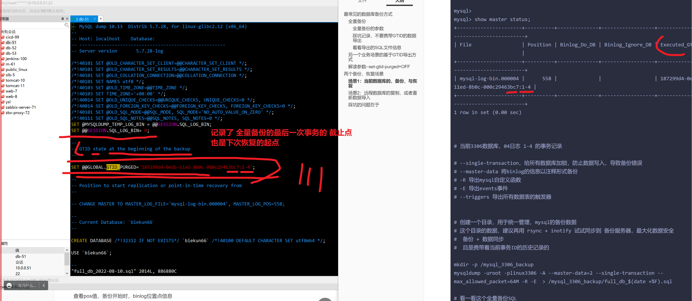

```### 此资源由 58学课资源站 收集整理 ###
	想要获取完整课件资料 请访问：58xueke.com
	百万资源 畅享学习

```
# 最常见的数据库备份方式

中小型公司的常见备份玩法如下，不管是linux机器的数据备份

还是备份阿里云的RDS云数据库，都是这个思路，。都可以基于mysqldump远程备份

mysqldump   -uroot -p  -h  -P   ，适用于本地数据备份，也适用于远程备份阿里云的数据库。

mysql   -uroot -p  -h  -P 


```

1.核心思路，基于mysqldump备份时，加入-F参数，实现日志切割
每天一个binlog记录

2.crontab 每周一全量备份

3. 周一全量备份，以及日志中，获取数据截止点，也就是次日的开始。

4.截取binlog，次日数据是从，下一个GTID号码开始的。

5.找到删数据的GTID事务号，截取至前一个记录，即可截取数据恢复的区间。
```


## 全量备份

```
方案1：逻辑备份
基于mysqldump命令，使用-A参数，全部的库表备份 ,导出来的数据是一堆SQL语句，兼容性很强
--all-database 所有的库表
 
# -F 参数是干啥的？
# 全量备份的命令
# 日常人类日常思维，按天作为每一天的结束
# 数据备份，24h备份，每天全量备份


mysqldump -uroot -pwww.yuchaoit.cn -S /data/3306/mysql.sock -F -A  |gzip >/server/backup/mysqlbak_$(date+%F).sql.gz


方案2，直接物理备份
[root@tech-db-51 ~]#ls /linux0224/mysql_3306/

cp
tar
rsync


```


### 全量备份的参数

### 踩坑记录，不要携带GTID的数据导出

```
--set-gtid-purged=OFF

```


```
3306 GTID 
```


```
-F 备份数据且刷新binlog


--master-data=2


测试  -A  -F  --master-data=2  三个参数 和逻辑备份的关系


```


### 看看导出的SQL文件信息


## 另一个业务场景的基于GTID导出方式

```
正确逻辑备份玩法

[root@tech-db-51 ~]#mysqldump -uroot -p   --set-gtid-purged=OFF  -A -F --master-data=2  > /tmp/no-gtid-all-db-flush-log.sql
Enter password: 


有这个疑问的刷1111

到底是开还是关呢？


```


写入数据，模拟增量备份，然后测试，能否，全量+增量恢复 所有的数据。


## 解读参数--set-gtid-purged=OFF

```
1. 机器A mysqldump 导出数据，不用该参数，导出的SQL数据，携带当前机器A的 binlog历史记录
且机器B导入该SQL的话，也不会再新记录binlog

2. 机器A mysqldump导出数据携带该参数，导出的只有SQL数据，且不包含GTID信息
这样，新机器B导入该SQL数据，就会重新自己记录binlog 事务记录。


```


# 两个备份，恢复场景

区分于，是否携带

GTID的历史信息


## 场景1：当前数据库的，备份，与恢复

老大给你一个RDS数据库

ip

port

让你去做好备份工作。

1. 全量备份
2. 给数据库开启binlog功能
3. 自主做更多的数据备份工作





---


```
给当前数据库服务器，进行数据备份，数据增量写入恢复。

# 当前机器，当前实例，进行数据，备份+恢复

1. 模拟夜里定时任务执行，进行全量数据备份，刷新binlog，记录上一次事务的截止点（用于数据恢复，截取binlog日志）
mysql> create table test_table(id int);
Query OK, 0 rows affected (0.00 sec)

mysql> 
mysql> show master status;
+----------------------+----------+--------------+------------------+------------------------------------------+
| File                 | Position | Binlog_Do_DB | Binlog_Ignore_DB | Executed_Gtid_Set                        |
+----------------------+----------+--------------+------------------+------------------------------------------+
| mysql-log-bin.000004 |      558 |              |                  | 187299d4-0e2b-11ed-8b0c-000c29463bc7:1-4 |
+----------------------+----------+--------------+------------------+------------------------------------------+
1 row in set (0.00 sec)


# 当前3306数据库，04日志 1-4 的事务记录

# --single-transaction，给所有数据库加锁，防止数据写入，导致备份错误
# --master-data 将binlog的信息以注释形式备份
# -R 导出mysql自定义函数
# -E 导出events事件 
# --triggers 导出所有数据表的触发器


# 创建一个目录，用于统一管理，mysql的备份数据
# 这个目录的数据，建议再用 rsync + inotify 试试同步到 备份服务器，最大化数据安全
#  备份 + 数据同步 
#  且是携带着当前事务ID的历史记录的

# 以及全量备份了，历史的binlog，没用了，次日，刷新新的binlog，记录第二天的所有新的SQL操作
# 逻辑，理解刷1111

# 加上——F参数

# 备份之前的记录
| mysql-log-bin.000004 |      558 |              |                  | 187299d4-0e2b-11ed-8b0c-000c29463bc7:1-4 |

# 备份后得记录


mkdir -p /mysql_3306_backup
mysqldump -uroot -plinux3306 -F -A --master-data=2 --single-transaction --max_allowed_packet=64M -R -E  > /mysql_3306_backup/full_db_$(date +%F).sql

# 明确日志已经刷新了


# 看一看这个全量备份SQL


2. 模拟次日刷新后的日志，数据写入，以及删除数据的操作

mysql> insert into test_table values(777),(888),(999);
Query OK, 3 rows affected (0.00 sec)
Records: 3  Duplicates: 0  Warnings: 0

mysql> 
mysql> 
mysql> show master status;
+----------------------+----------+--------------+------------------+------------------------------------------+
| File                 | Position | Binlog_Do_DB | Binlog_Ignore_DB | Executed_Gtid_Set                        |
+----------------------+----------+--------------+------------------+------------------------------------------+
| mysql-log-bin.000009 |      479 |              |                  | 187299d4-0e2b-11ed-8b0c-000c29463bc7:1-5 |
+----------------------+----------+--------------+------------------+------------------------------------------+
1 row in set (0.00 sec)

mysql> drop database test_backup;
Query OK, 1 row affected (0.00 sec)

mysql> show master status;
+----------------------+----------+--------------+------------------+------------------------------------------+
| File                 | Position | Binlog_Do_DB | Binlog_Ignore_DB | Executed_Gtid_Set                        |
+----------------------+----------+--------------+------------------+------------------------------------------+
| mysql-log-bin.000009 |      657 |              |                  | 187299d4-0e2b-11ed-8b0c-000c29463bc7:1-6 |
+----------------------+----------+--------------+------------------+------------------------------------------+
1 row in set (0.00 sec)


3. 截取日志，进行数据恢复，实现全量数据的备份与恢复。


# 如何截取，要看你想恢复什么


# 思路

1. 解析二进制日志，看看都有0009日志

mysqlbinlog --base64-output=decode-rows -vv   /mysql_log/log_bin_3306/mysql-log-bin.000009  > /tmp/09.log


2. 分析完毕 09 增量日之后，确认要 全量恢复库，增量恢复数据

3. 先导入全量数据
mysql> set sql_log_bin=0;

mysql> source full_db_2022-08-10.sql;

mysql> select * from test_table;
Empty set (0.01 sec)


目前实现了基于全量备份的数据，找回了 库  test_backup; 逻辑跟上刷3333


4. 基于次日刷新的0009增量日志，恢复插入数据

基于mysqlbinlog 截取  00009日志，截取你要的事务区间

# --include-gtids 截取一个GTID事务区间


# 解密查看SQL
#pos值区间  ，写入数据的 194-479


mysqlbinlog --base64-output=decode-rows -vv --skip-gtids --include-gtids='187299d4-0e2b-11ed-8b0c-000c29463bc7:5' /mysql_log/log_bin_3306/mysql-log-bin.000009 > /tmp/decode_09.txt 


# 这是要用于恢复的SQL语句
mysqlbinlog --skip-gtids --include-gtids='187299d4-0e2b-11ed-8b0c-000c29463bc7:5' /mysql_log/log_bin_3306/mysql-log-bin.000009  > /mysql_3306_backup/restore_test_backup_db.sql


# 恢复数据的操作
mysql> set sql_log_bin=0;

mysql> source /mysql_3306_backup/restore_test_backup_db.sql;

mysql> select * from test_backup.test_table;
+------+
| id   |
+------+
|  777 |
|  888 |
|  999 |
+------+
3 rows in set (0.00 sec)

mysql> set sql_log_bin=1;
Query OK, 0 rows affected (0.00 sec)

mysql> 


# 总结
至此，完成
基于 
1. 全量备份的 库、表的恢复
2. 次日刷新的binlog，截取事务区间，恢复的 表数据

看懂2222，下午 2.30继续，物理备份工具。


 
```


## 场景2：远程数据库的复制，或者重新数据导入

数据库A导出的数据库，导入到 机器B

3306实例的数据， 导入到新的 3307实例，让它继续开始binlog写入

正确远程数据导入玩法

```
-rw-r--r-- 1 root  root  863K Aug 10 10:34 no-gtid-all-db-flush-log.sql


3307数据库，导入进入，看是否可以使用该数据，以及binlog重新记录

# 准备一个新的 初始化数据的 3307实例

# 打开GTID 以及binlog功能，重新记录 事务日志

mysql> select * from kings.cike;
+-----------+
| name      |
+-----------+
| 钟薛高    |
| 兰陵王    |
| 孙悟空    |
+-----------+
3 rows in set (0.00 sec)


```

错误的场景

```
3306 导出的数据，携带了GTID历史记录
SET @@GLOBAL.GTID_PURGED='187299d4-0e2b-11ed-8b0c-000c29463bc7:1-2';


3307 实例的GTID 号码 
mysqld --initialize-insecure --user=mysql --basedir=/opt/mysql --datadir=/linux0224/mysql_3307


| eba785df-16c3-11ed-9d4f-000c29463bc7:1-276 |

试试 导入3306的SLQ到 3307


```

让你更多的见见故障的场景，多踩坑，多解决坑，好事。。


11111  22222


## 踩坑的问题在于


```
1. 3307实例，重新初始化，基于GTID启动后，默认有自己的GTID信息 唯一事务ID标识的 

mysql> create database 3307_db;
Query OK, 1 row affected (0.00 sec)

mysql> show master status;
+------------------+----------+--------------+------------------+----------------------------------------+
| File             | Position | Binlog_Do_DB | Binlog_Ignore_DB | Executed_Gtid_Set                      |
+------------------+----------+--------------+------------------+----------------------------------------+
| mysql-bin.000001 |      322 |              |                  | 68d3d065-185c-11ed-bcd5-000c29463bc7:1 |
+------------------+----------+--------------+------------------+----------------------------------------+
1 row in set (0.00 sec)


[root@tech-db-51 /linux0224/mysql_3307]#mysql -S /linux0224/mysql_3307/mysql.sock < /tmp/all-db-flush-log.sql 
ERROR 1840 (HY000) at line 24: @@GLOBAL.GTID_PURGED can only be set when @@GLOBAL.GTID_EXECUTED is empty.


2. 此时是无法导入3306携带GTID的SQL文件


3. 你可以重置3307的 binlog，重置它的GTID事务信息

reset master; 没有它自己的GTID历史记录了，清空3307自己的GTID事务记录


4. 你就可以正确导入 3306的数据了，且携带GTID的


[root@tech-db-51 /linux0224/mysql_3307]#
[root@tech-db-51 /linux0224/mysql_3307]#
[root@tech-db-51 /linux0224/mysql_3307]#mysql -S /linux0224/mysql_3307/mysql.sock < /tmp/all-db-flush-log.sql 
[root@tech-db-51 /linux0224/mysql_3307]#


5. 此时的3307，就从3306的数据开始写入


```


