```### 此资源由 58学课资源站 收集整理 ###
	想要获取完整课件资料 请访问：58xueke.com
	百万资源 畅享学习

```
# 具体流程

注意区分开数据目录，以及日志目录。

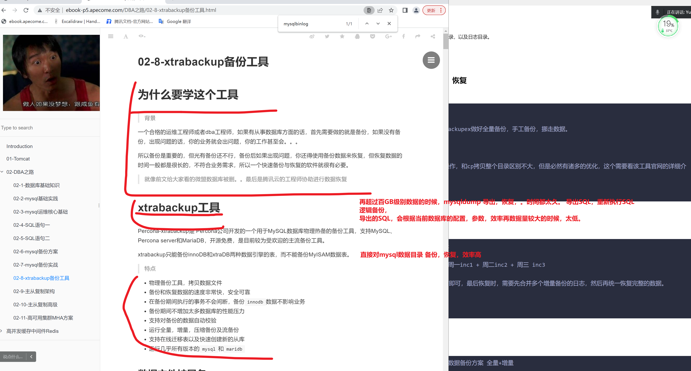


## 什么是物理备份

查看如下物理备份方式

```

1. 基于逻辑备份的全量备份，导入执行，前提是数据库能正常启动

2. 直接恢复物理文件数据

- tar对mysql数据打包压缩，做了个备份
- 删数据
- 解压恢复数据
- 数据库重启还是可以继续用

看懂333

但是这种方式太粗暴，有更专门的工具，通过这种直接操作数据文件的，备份，恢复方案，且对数据库做很多的校验工作。
一些主流的物理备份工具，，xtrabackup工具

```


## 看看mysql的数据是什么

```
[root@tech-db-51 /linux0224/mysql_3306/test_backup]#ll
total 112
-rw-r----- 1 mysql mysql    67 Aug 10 12:15 db.opt
-rw-r----- 1 mysql mysql  8556 Aug 10 12:15 test_table.frm
-rw-r----- 1 mysql mysql 98304 Aug 10 12:32 test_table.ibd


查看当前机器是什么引擎
mysql> show variables like '%storage%';
+----------------------------------+--------+
| Variable_name                    | Value  |
+----------------------------------+--------+
| default_storage_engine           | InnoDB |
| default_tmp_storage_engine       | InnoDB |
| disabled_storage_engines         |        |
| internal_tmp_disk_storage_engine | InnoDB |
+----------------------------------+--------+
4 rows in set (0.00 sec)


```


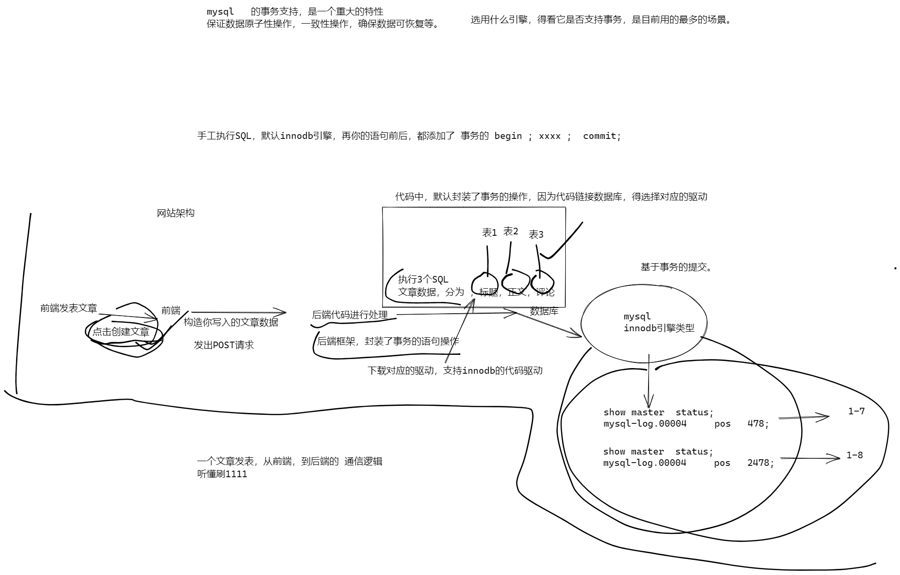

```
所以数据库引擎，就是帮你
1 。分析SQL语法
2. 执行SQL
3. 修改库，表数据
4. 提供了如事务的特性，能回滚，等，。


```


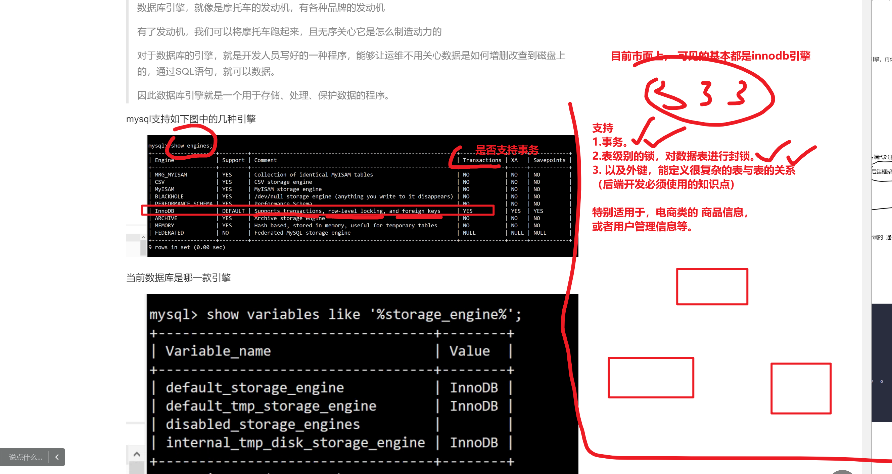


## 安装xtrabackup工具

```
yum install perl perl-devel libaio libaio-devel perl-Time-HiRes perl-DBD-MySQL -y

# 下载软件且安装
wget https://www.percona.com/downloads/XtraBackup/Percona-XtraBackup-2.4.9/binary/redhat/7/x86_64/percona-xtrabackup-24-2.4.9-1.el7.x86_64.rpm

yum localinstall percona-xtrabackup-24-2.4.9-1.el7.x86_64.rpm -y


# up 深圳安卓开发
# 客户提了一个需求，能不能让二维码支持 扫码枪。
# 发呆。。
# 打开百度，搜索 "能不能让二维码支持 扫码枪。"
#  csdn 程序员客栈，
# ctrl +c  ctrl +v 
# 右键点击运行
# 好使了。。


# 就是用它的命令而已

# 搜索查看安装的这个rpm包，默认生成了哪些文件
# 看懂 2222
# 
[root@tech-db-51 /opt]#rpm -ql percona-xtrabackup-24 
/usr/bin/innobackupex
/usr/bin/xbcloud
/usr/bin/xbcloud_osenv
/usr/bin/xbcrypt
/usr/bin/xbstream
/usr/bin/xtrabackup


/usr/share/doc/percona-xtrabackup-24-2.4.9
/usr/share/doc/percona-xtrabackup-24-2.4.9/COPYING
/usr/share/man/man1/innobackupex.1.gz
/usr/share/man/man1/xbcrypt.1.gz
/usr/share/man/man1/xbstream.1.gz
/usr/share/man/man1/xtrabackup.1.gz


```


15.15 继续


 

# 1.全量备份，恢复

1.明确，这个工具，其实就是再 备份mysql的数据文件而已

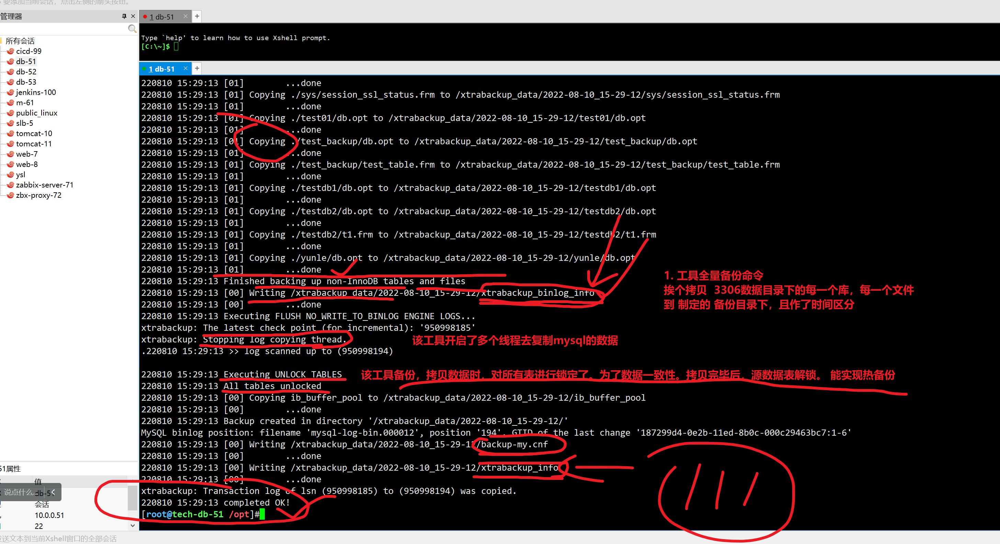

```
0. 给你的机器，设置基于GTID的模式运行


1. 基于命令 ，全量备份命令
# 和mysqldump很像，链接实例，备份数据

# 创建备份目录

innobackupex --user=root   --password=linux3306  -S /tmp/mysql.sock  /xtrabackup_data/ 


```

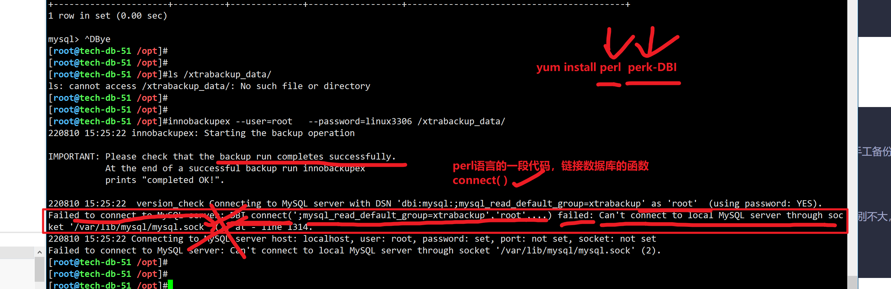


```
1.安装工具

2.基于innobackupex做好全量备份，手工备份，挪走数据。

3.全量恢复

4.其实这个操作，和cp拷贝整个目录区别不大，但是必然有诸多的优化，这个需要看该工具官网的详细介绍。


```


### 查看xtrabackup工具生成的日志文件

```
查看具体备份的数据信息，以及自己生成了哪些日志文件
xtrabackup_binlog_info 记录全量备份时，该实例最后的一个binlog  事务ID

xtrabackup_logfile 是该工具本身的一个二进制日志文件


[root@tech-db-51 /xtrabackup_data/2022-08-10_15-29-12]#strings xtrabackup_logfile 
xtrabkup 220810 15:29:12


xtrabackup_info  当前3306全量备份的详细信息，xtraback备份当前实例数据，一个版本信息

[root@tech-db-51 /xtrabackup_data/2022-08-10_15-29-12]#cat xtrabackup_info
uuid = 22363968-187e-11ed-8a4d-000c29463bc7
name = 
tool_name = innobackupex
tool_command = --user=root --password=... -S /tmp/mysql.sock /xtrabackup_data/
tool_version = 2.4.9
ibbackup_version = 2.4.9
server_version = 5.7.28-log
start_time = 2022-08-10 15:29:12
end_time = 2022-08-10 15:29:13
lock_time = 0
binlog_pos = filename 'mysql-log-bin.000012', position '194', GTID of the last change '187299d4-0e2b-11ed-8b0c-000c29463bc7:1-6'
innodb_from_lsn = 0
innodb_to_lsn = 950998185
partial = N
incremental = N
format = file
compact = N
compressed = N
encrypted = N


# xtrabackup备份数据，也是有连续性记录，
# xtrabackup通过lsn号，确认数据的起点，截止点
# xtrabackup备份数据，出现不一致的情况，会来查看该信息（DBA的活）

[root@tech-db-51 /xtrabackup_data/2022-08-10_15-29-12]#cat xtrabackup_checkpoints
backup_type = full-backuped
from_lsn = 0
to_lsn = 950998185
last_lsn = 950998194
compact = 0
recover_binlog_info = 0


```


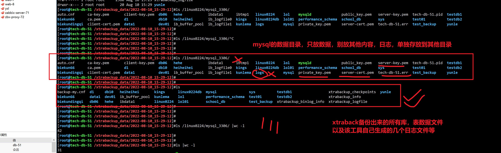


## 不要该工具自带的时间戳信息

```
--no-timestamp  

#自己制定备份的时间目录 
innobackupex --no-timestamp   --user=root   --password=linux3306  -S /tmp/mysql.sock  /xtrabackup_data_no_time/full_3306_db_$(date +%F)/

 
```

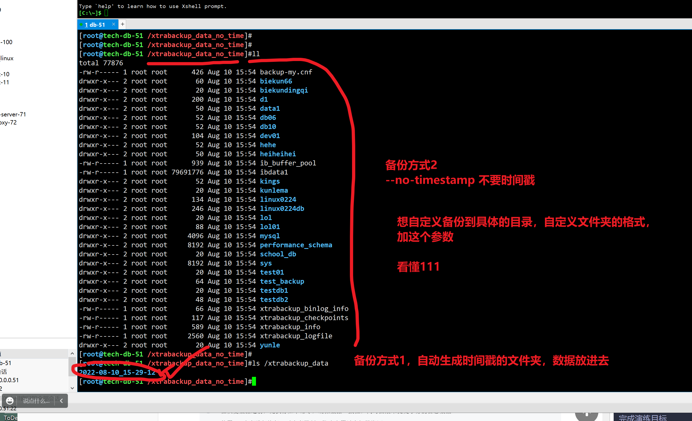


### 恢复该全量备份的数据

```
1. 挪走自带的数据，用mv替代rm

[root@tech-db-51 /linux0224/mysql_3306]#mv ./*  /opt/3306_db_backup/


2.尝试用xtrabackup命令恢复

恢复的思路其实，把备份的数据，原封不动，再放回mysql  datadir下
# 听懂11111

3. 基于xtraback命令的参数，对默认所有的未提交事务，确保数据一致性
# 操作备份的数据即可

innobackupex --apply-log     /xtrabackup_data_no_time/full_3306_db_2022-08-10/


4. 此时就可以直接恢复数据了
# innobackupex > rsync 数据拷贝回去

innobackupex --defaults-file=/etc/my.cnf --copy-back --rsync  /xtrabackup_data_no_time/full_3306_db_2022-08-10/

4.1 重新授权给mysql
[root@tech-db-51 /linux0224/mysql_3306]#chown -R mysql.mysql ./*


5.恢复数据之后，建议重启mysql，确保数据重新加载正常

6.修改配置文件，修改日志目录
[root@tech-db-51 /linux0224/mysql_3306]#mkdir -p /mysql_3306/logs/
[root@tech-db-51 /linux0224/mysql_3306]#
[root@tech-db-51 /linux0224/mysql_3306]#
[root@tech-db-51 /linux0224/mysql_3306]#chown -R mysql.mysql /mysql_3306/logs/


7.重启
[root@tech-db-51 /linux0224/mysql_3306]#systemctl restart mysqld

8.新得日志目录
[root@tech-db-51 /linux0224/mysql_3306]#ls /mysql_3306/logs/
3306-err.log


9.确保数据可以访问
mysql> select * from test_backup.test_table;
+------+
| id   |
+------+
|  777 |
|  888 |
|  999 |
+------+
3 rows in set (0.01 sec)

mysql> 
mysql> 
mysql> # 没睡着的 来个666


```


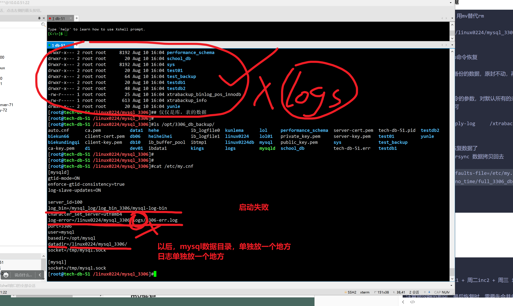


# 2.增量备份

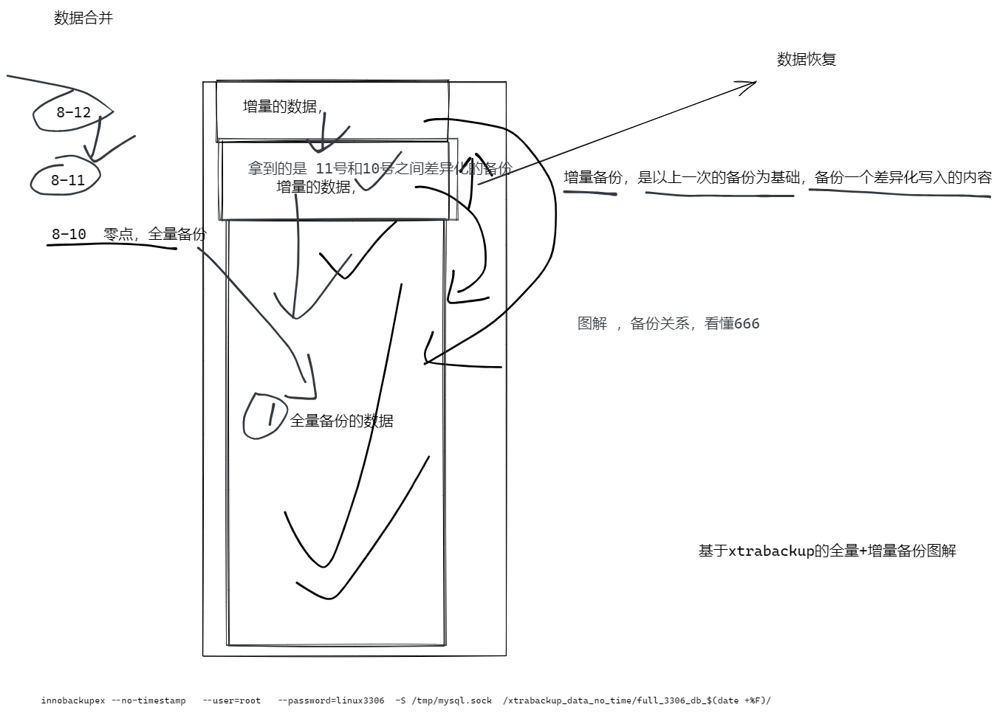

```
完成演练目标

周日full + 周一inc1 + 周二inc2 + 周三 inc3 

注意命令细节即可，最后恢复时，需要先合并多个增量备份的日志，然后再统一恢复完整的数据。


# 1. 先模拟8-10 全量备份
innobackupex --no-timestamp   --user=root   --password=linux3306  -S /tmp/mysql.sock  /xtrabackup_0224/full_3306_db_$(date +%F)/

# 2.检查全量数据
[root@tech-db-51 /xtrabackup_0224]#du -sh .
93M	.
[root@tech-db-51 /xtrabackup_0224]#ll
total 4
drwxr-x--- 26 root root 4096 Aug 10 16:18 full_3306_db_2022-08-10


# 3.模拟次日的增量写入即可
mysql> show master status;
+----------------------+----------+--------------+------------------+------------------------------------------+
| File                 | Position | Binlog_Do_DB | Binlog_Ignore_DB | Executed_Gtid_Set                        |
+----------------------+----------+--------------+------------------+------------------------------------------+
| mysql-log-bin.000013 |      194 |              |                  | 187299d4-0e2b-11ed-8b0c-000c29463bc7:1-6 |
+----------------------+----------+--------------+------------------+------------------------------------------+
1 row in set (0.00 sec)

# 增量的数据写入
mysql> create database db_8_11;


# 4. 进行次日的增量备份，生成增量数据目录
# --incremental-basedir   以哪个目录为基础数据目录，然后进行增量备份 

#  --incremental  增量备份的数据，放到哪

innobackupex --defaults-file=/etc/my.cnf --user=root --password=linux3306 --socket=/tmp/mysql.sock --no-timestamp --incremental-basedir=/xtrabackup_0224/full_3306_db_2022-08-10  --incremental   /xtrabackup_0224/incr_1_2022-08-11 

# 5.进行 8-12的 增量备份，写入数据，模拟当天的数据增量

mysql> show master status;
+----------------------+----------+--------------+------------------+----------------------------------------------------------------------------------+
| File                 | Position | Binlog_Do_DB | Binlog_Ignore_DB | Executed_Gtid_Set                                                                |
+----------------------+----------+--------------+------------------+----------------------------------------------------------------------------------+
| mysql-log-bin.000013 |      362 |              |                  | 187299d4-0e2b-11ed-8b0c-000c29463bc7:1-6,
9945ceea-1883-11ed-b2b4-000c29463bc7:1 |
+----------------------+----------+--------------+------------------+----------------------------------------------------------------------------------+
1 row in set (0.00 sec)

mysql> create database db_8_12;
Query OK, 1 row affected (0.00 sec)

mysql> 
mysql> show master status;
+----------------------+----------+--------------+------------------+------------------------------------------------------------------------------------+
| File                 | Position | Binlog_Do_DB | Binlog_Ignore_DB | Executed_Gtid_Set                                                                  |
+----------------------+----------+--------------+------------------+------------------------------------------------------------------------------------+
| mysql-log-bin.000013 |      530 |              |                  | 187299d4-0e2b-11ed-8b0c-000c29463bc7:1-6,
9945ceea-1883-11ed-b2b4-000c29463bc7:1-2 |
+----------------------+----------+--------------+------------------+------------------------------------------------------------------------------------+
1 row in set (0.00 sec)


# 6.对 8-12的数据，进行增量备份

# --incremental-basedir=/xtrabackup_0224/incr_1_2022-08-11 以谁为相对进行增量
# --incremental=/xtrabackup_0224/incr_2_2022-08-12 本次增量数据写到哪


innobackupex --defaults-file=/etc/my.cnf --user=root --password=linux3306 --socket=/tmp/mysql.sock --no-timestamp --incremental-basedir=/xtrabackup_0224/incr_1_2022-08-11  --incremental /xtrabackup_0224/incr_2_2022-08-12


7.检查当前所有的备份环境
[root@tech-db-51 /xtrabackup_0224]#du -sh *
93M	full_3306_db_2022-08-10
3.6M	incr_1_2022-08-11
3.6M	incr_2_2022-08-12
[root@tech-db-51 /xtrabackup_0224]#
[root@tech-db-51 /xtrabackup_0224]#
[root@tech-db-51 /xtrabackup_0224]## 看懂22222


8.模拟8-13数据写入


```


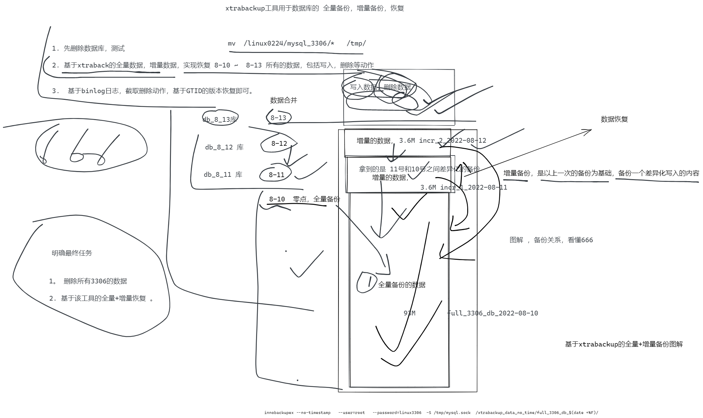

## 恢复思路

先模拟删数据，全部删除，反正有全量备份

```
mkdir -p /tmp/test_xtrabackup_db/

[root@tech-db-51 /xtrabackup_0224]#mv /linux0224/mysql_3306/*  /tmp/test_xtrabackup_db/


```


```
# 1. 明确了，目前可以恢复  8-10  到 8-12的数据，

# 2. 注意8-13的数据，再binlog里，找binlog在哪
[root@tech-db-51 /xtrabackup_0224]#ls /mysql_log/log_bin_3306/
all-06.txt  mysql-log-bin.000001  mysql-log-bin.000003  mysql-log-bin.000005  mysql-log-bin.000007  mysql-log-bin.000009  mysql-log-bin.000011  mysql-log-bin.000013  mysqllogOK.sql  table_delete.txt
jpress.sql  mysql-log-bin.000002  mysql-log-bin.000004  mysql-log-bin.000006  mysql-log-bin.000008  mysql-log-bin.000010  mysql-log-bin.000012  mysql-log-bin.index   recovery.sql    test4.txt
[root@tech-db-51 /xtrabackup_0224]#


# 3.开始合并增量日志

大体思路，每一个备份的数据，都要用该参数 --apply-log ，提交，回滚事务，确保数据一致性
--redo-only    只要不是最后一次合并，都要加这个参数

- 先处理8-10全量数据

innobackupex --apply-log   --redo-only  /xtrabackup_0224/full_3306_db_2022-08-10 

- 合并增量1，到全量数据

# --incremental-dir 填入增量的数据目录    写入 全量数据目录

innobackupex --apply-log   --redo-only --incremental-dir=/xtrabackup_0224/incr_1_2022-08-11  /xtrabackup_0224/full_3306_db_2022-08-10


# 合并8-12的增量数据

innobackupex --apply-log   --redo-only --incremental-dir=/xtrabackup_0224/incr_2_2022-08-12  /xtrabackup_0224/full_3306_db_2022-08-10  


# 最后对full数据 一致性校验确认，提交事务

innobackupex --apply-log /xtrabackup_0224/full_3306_db_2022-08-10 

# 基于最终的全量数据，恢复
# 预测结果，应该是有 db_8_11  db_8_12 能理解刷222


innobackupex --copy-back /xtrabackup_0224/full_3306_db_2022-08-10  

[root@tech-db-51 /linux0224/mysql_3306]#chown -R mysql.mysql ./*


# 此时还差一个 8-13的增量写入， 目前是 8-10 8-11 8-12 数据全部恢复了

# 基于mysqlbinlog  基于GTID的号码，恢复数据  db_8-13

mysqlbinlog --skip-gtids --include-gtids='9945ceea-1883-11ed-b2b4-000c29463bc7:3'      /mysql_log/log_bin_3306/mysql-log-bin.000013  > /tmp/db_8_13.sql

# 恢复该导出的SQL文件

mysql> set sql_log_bin=0;
mysql> source /tmp/db_8_13.sql;
mysql> set sql_log_bin=1;
Query OK, 0 rows affected (0.00 sec)


# 确认后续的日志，会继续记录
mysql> insert into  db_8_13.table_13 values(6666);
Query OK, 1 row affected (0.00 sec)

mysql> show master status;
+----------------------+----------+--------------+------------------+------------------------------------------------------------------------------------------------------------------------------+
| File                 | Position | Binlog_Do_DB | Binlog_Ignore_DB | Executed_Gtid_Set                                                                                                            |
+----------------------+----------+--------------+------------------+------------------------------------------------------------------------------------------------------------------------------+
| mysql-log-bin.000014 |      667 |              |                  | 187299d4-0e2b-11ed-8b0c-000c29463bc7:1-6,
7929ae4c-188a-11ed-ba6b-000c29463bc7:1-2,
9945ceea-1883-11ed-b2b4-000c29463bc7:1-3 |
+----------------------+----------+--------------+------------------+------------------------------------------------------------------------------------------------------------------------------+
1 row in set (0.00 sec)


```

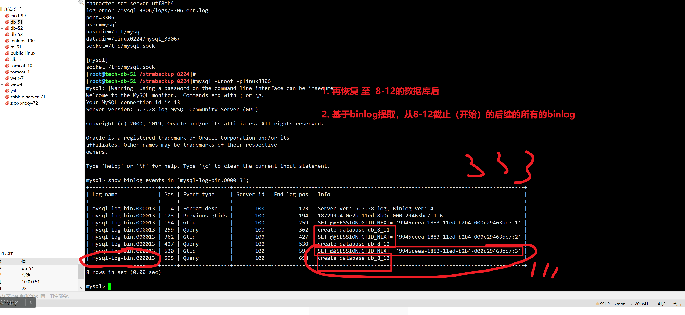


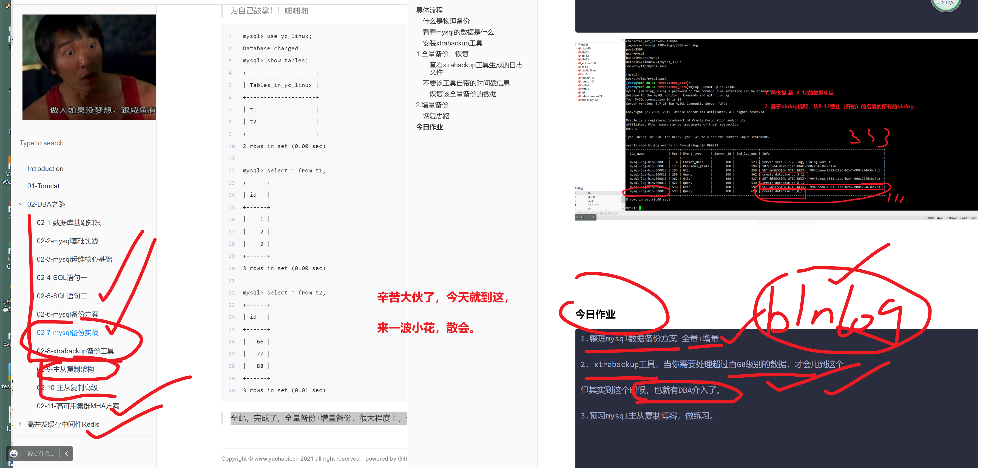


# 今日作业


```
1.整理mysql数据备份方案 全量+增量

2. xtrabackup工具，当你需要处理超过百GB级别的数据，才会用到这个。

但其实到这个时候，也就有DBA介入了。

3.预习mysql主从复制博客，做练习。


```

