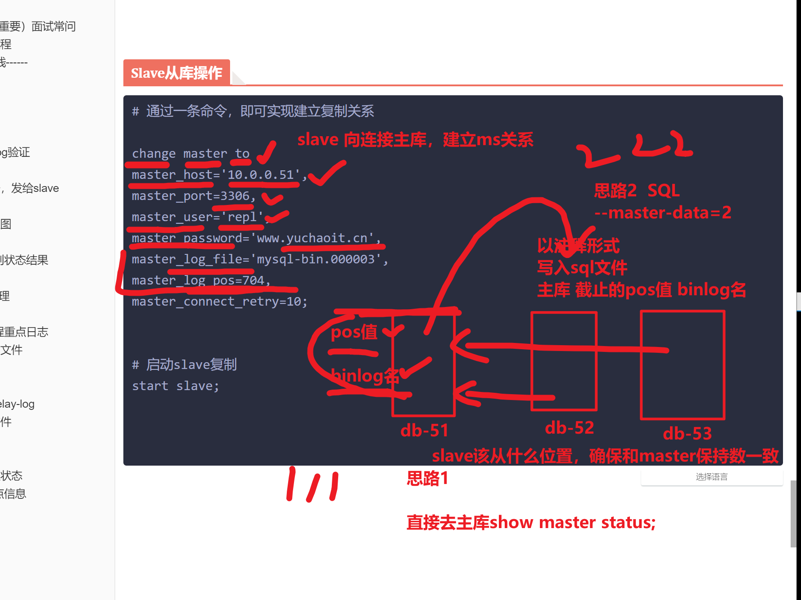
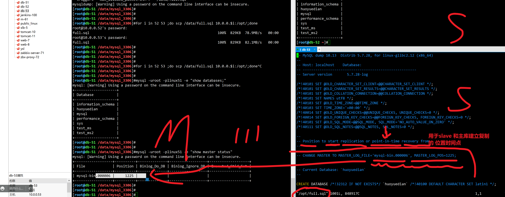
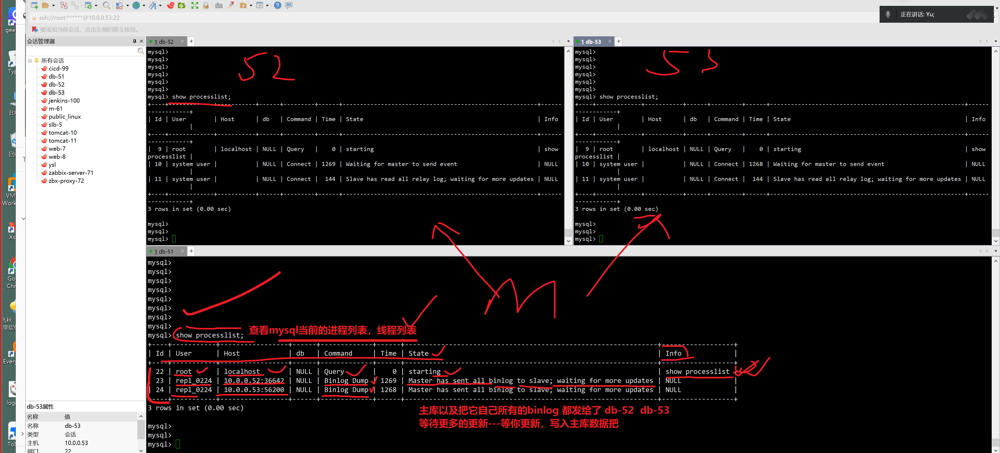
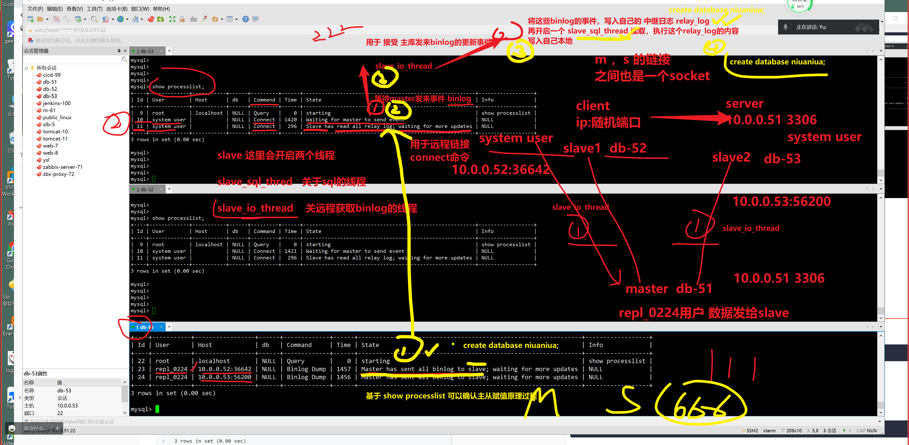
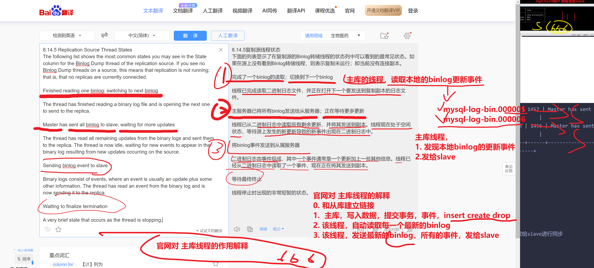
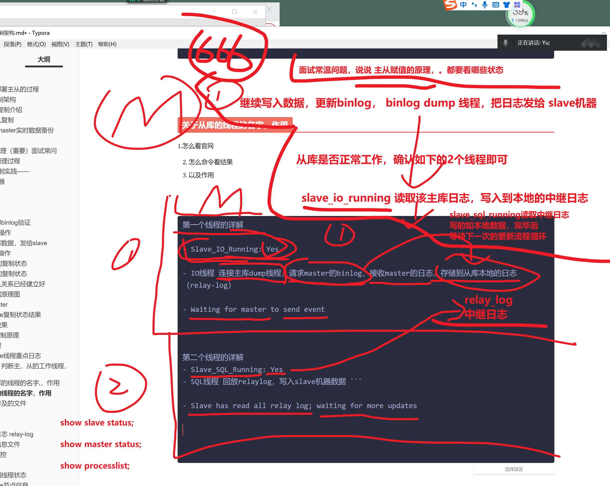
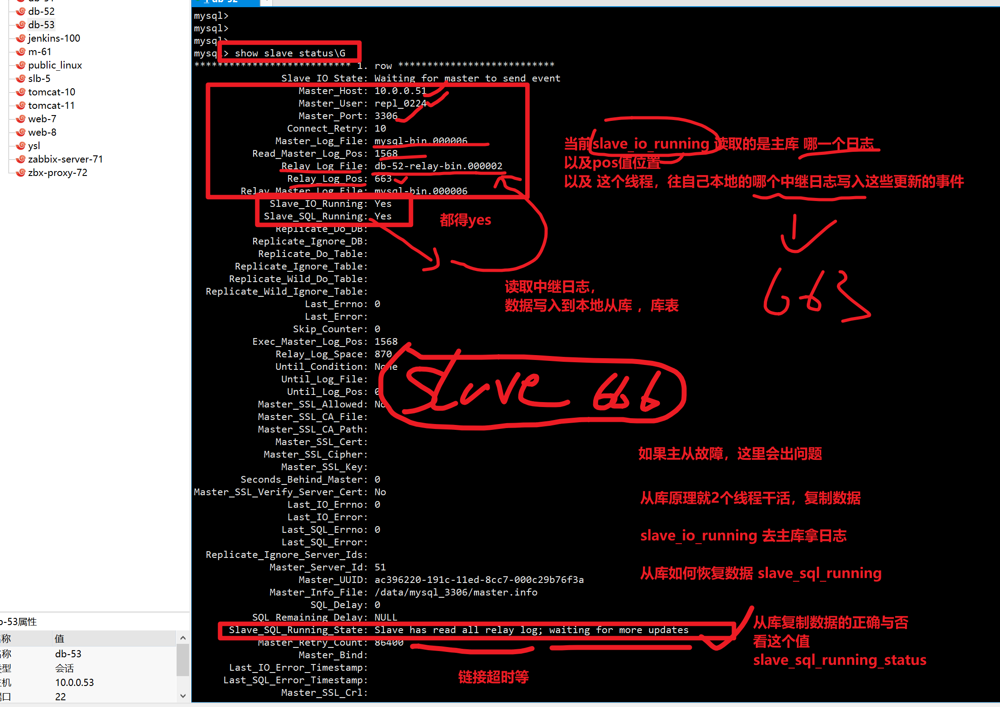
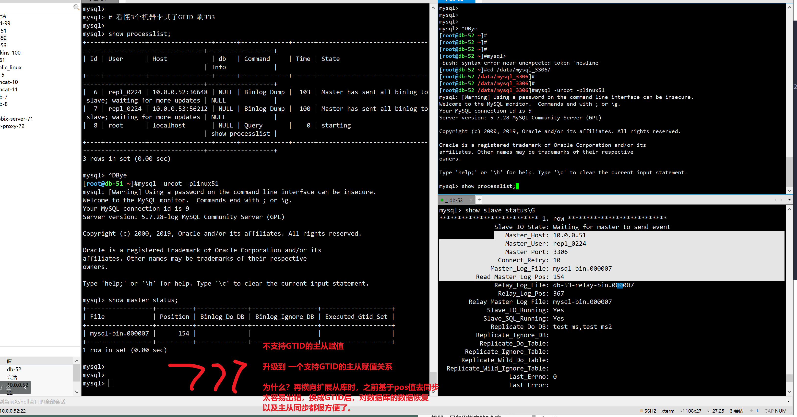
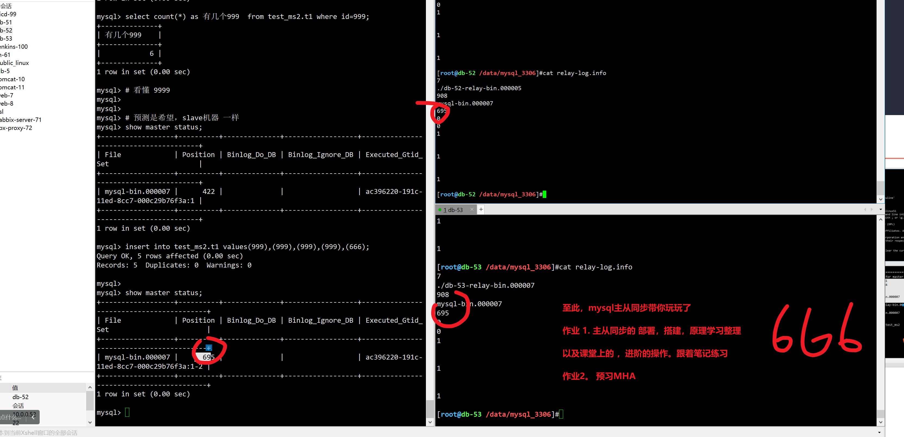

```### 此资源由 58学课资源站 收集整理 ###
	想要获取完整课件资料 请访问：58xueke.com
	百万资源 畅享学习

```


# 今日任务

看了大家写的石墨，很好，暴露出了很多问题

继续写，直到你上班前，每天都写。


```
1. mysql主从复制部署搭建
2. 主从原理学习
3. 主从高级复制


```


# 绘图，理解部署主从的过程

```
1. 先部署（按照我的课件，按照mysql官网给资料）


2. 再看原理（部署过程中，出现问题，主从复制再运行后，提供服务，突然出现复制故障）

master slave
到底怎么实现数据的复制
都有哪些通信的手段
数据是怎么从master 到了 salve


master   binlog


slave1   binlog


slave2  
由于某个运维不小心设置错了 iptables规则，   收不到binlog的更新，导致复制故障
删除
放行mysql的通信端口


基于原理性的操作，一步步排查，看master的问题，还是salve的问题


222222


```


10.10继续


# 02-9-主从复制架构


# MySQL主从复制介绍


# 为什么用主从复制


## slave作为master实时数据备份


### 缺点


# 2.主从复制原理（重要）面试常问


## 图解详细原理过程


# -----3.主从复制实践------

## 准备3台机器

```
db-51
db-52
db-53


1. 三台机器的 主机id不一样

server_id 务必要区分开

2. 主从复制

master 做 binlog记录


slave  1  无需开启binlog

slave  2  无需开启binlog
```


### db-51

务必确保server_id 不一样

binlog的数据目录和 datadir要区分开


 1 动手搭建

2. 背诵原理


```bash
[root@db-51 ~]#cat /etc/my.cnf
[mysqld]
user=mysql
datadir=/data/mysql_3306
basedir=/opt/mysql/
socket=/tmp/mysql.sock
port=3306
log_error=/var/log/mysql/mysql.err
server_id=51
log_bin=/binlog/mysql-bin
[mysql] 
socket=/tmp/mysql.sock
[client] 
socket=/tmp/mysql.sock


1. 初始化3306  db-51的数据
[root@db-51 /data/mysql_3306]#mysqld --initialize-insecure --user=mysql --basedir=/opt/mysql --datadir=/data/mysql_3306/
[root@db-51 /data/mysql_3306]#
[root@db-51 /data/mysql_3306]#
[root@db-51 /data/mysql_3306]#chown -R mysql.mysql ./*


2. 准备脚本，启动mysql 主库
cp /opt/mysql/support-files/mysql.server /etc/init.d/mysqld


[root@db-51 /data/mysql_3306]#systemctl restart mysqld
[root@db-51 /data/mysql_3306]#!net
netstat -tunlp
Active Internet connections (only servers)
Proto Recv-Q Send-Q Local Address           Foreign Address         State       PID/Program name    
tcp        0      0 0.0.0.0:10050           0.0.0.0:*               LISTEN      1024/zabbix_agentd  
tcp        0      0 0.0.0.0:22              0.0.0.0:*               LISTEN      1011/sshd           
tcp6       0      0 :::10050                :::*                    LISTEN      1024/zabbix_agentd  
tcp6       0      0 :::3306                 :::*                    LISTEN      49300/mysqld        
tcp6       0      0 :::22                   :::*                    LISTEN      1011/sshd 

# 确认主库可用
[root@db-51 /data/mysql_3306]#mysql -e "select version();"
+------------+
| version()  |
+------------+
| 5.7.28-log |
+------------+


```


### db-52

52 和53的操作，都一样，


````
1. 改配置文件 server_id = 每一个机器都不一样就行

2. 不得有binlog参数


cat > /etc/my.cnf<<EOF
[mysqld]
user=mysql 
datadir=/data/mysql_3306
basedir=/opt/mysql/
socket=/tmp/mysql.sock
port=3306 
log_error=/var/log/mysql/mysql.err 
server_id=52
[mysql] 
socket=/tmp/mysql.sock
[client] 
socket=/tmp/mysql.sock 
EOF


2. 初始化启动即可
[root@db-52 ~]#mysql -e "select version();"
+-----------+
| version() |
+-----------+
| 5.7.28    |
+-----------+

````


### db-53

```
[root@db-53 ~]#mysql -e "select version()"
+-----------+
| version() |
+-----------+
| 5.7.28    |
+-----------+

```


### 三台记得binlog验证

```
[root@db-51 /data/mysql_3306]#mysql -e "show master status;"
+------------------+----------+--------------+------------------+-------------------+
| File             | Position | Binlog_Do_DB | Binlog_Ignore_DB | Executed_Gtid_Set |
+------------------+----------+--------------+------------------+-------------------+
| mysql-bin.000006 |      154 |              |                  |                   |
+------------------+----------+--------------+------------------+-------------------+
[root@db-51 /data/mysql_3306]#
[root@db-51 /data/mysql_3306]#


```


## db-51主库操作


### 备份主库数据，发给slave

```
关于确保导出的数据，一致性的问题

1. 全库锁表
# 直接再mysql里执行，是对当前mysql会话生效
flush tables with read lock; # 给全库的表上锁
# 写入配置文件，重启mysql，确保全局上锁


2. 基于如下命令，确保导出的数据，完整的

# 备份命令
# -A 备份所有库表
# --single-transaction，给所有数据库加锁，防止数据写入，导致备份错误
# --master-data=2 将binlog的信息以注释形式备份
# -R 导出mysql自定义函数
# -E 导出events事件 
# --triggers 导出所有数据表的触发器


- 创建数据

- 创建一个复制的账号


1.主库设置个密码
mysqladmin password linux51

2.创建复制用户

# 复制账号 repl_0224  密码 repl_pwd  


mysql -uroot -plinux51 -e "grant replication slave on *.* to 'repl_0224'@'10.0.0.%' identified by 'repl_pwd';"

3.查看用户
mysql -uroot -plinux51 -e "select user,host,plugin from mysql.user"

4.查看权限
mysql -uroot -plinux51 -e "show grants for repl@'10.0.0.%'"

[root@db-51 /data/mysql_3306]#mysql -uroot -plinux51 -e "show grants for repl_0224@'10.0.0.%'";
mysql: [Warning] Using a password on the command line interface can be insecure.
+----------------------------------------------------------+
| Grants for repl_0224@10.0.0.%                            |
+----------------------------------------------------------+
| GRANT REPLICATION SLAVE ON *.* TO 'repl_0224'@'10.0.0.%' |
+----------------------------------------------------------+
[root@db-51 /data/mysql_3306]#


# 重新发送全量数据，发给52 53 覆盖即可

mysqldump -uroot -plinux51 -A --master-data=2 --single-transaction -R -E --triggers --max_allowed_packet=64M >   /data/full.sql


# 主库的数据 发给slave
for i in 52 53 ;do scp /data/full.sql 10.0.0.$i:/opt/;done


# 预测，52 53 都能看到这个库，和用户信息


```


## Slave从库操作







```
1.从库先导入数据
[root@db-53 ~]#mysql < /opt/full.sql 


# 通过一条命令，即可实现建立复制关系
# https://dev.mysql.com/doc/refman/5.7/en/change-master-to.html 


# 先查看当前的机器的 复制状态
mysql> show slave status;
Empty set (0.00 sec)


# 修改主从关系参数

change master to 
master_host='10.0.0.51',
master_port=3306,
master_user='repl_0224',
master_password='repl_pwd',
master_log_file='mysql-bin.000006',
master_log_pos=1225,
master_connect_retry=10;

# slave 连不上master，10秒后，自动重新尝试建立 链接关系

# 再次查看复制关系。只有start slave后才能看到复制关系
show slave status\G;

# 只有看到如下2个现成，状态是YES才能确保 复制正常
             Slave_IO_Running: No
            Slave_SQL_Running: No


# 启动slave复制
start slave;

# 再次查看复制关系
show slave status\G;

```


### 52机器的复制状态

```
Slave_IO_Running: Yes
            Slave_SQL_Running: Yes

```


### 53机器的复制状态

```
             Slave_IO_Running: Yes
            Slave_SQL_Running: Yes

```


### 至此主从关系已经建立好


### 导入数据原理图


### 连接master


### 查看slave复制状态结果


## 测试主从效果


# 4.查看主从复制原理

主从复制过程，会涉及3个现成


linux系统运行一个程序，-----进程，分派线程去干活，去获取机器的资源


主库的线程--------

从库的线程--------

这些命令，就是你去维护主从集群时候拍错的命令


## 主库的线程

```
show processlist;
```




### 关于slave线程重点日志


## 基于命令，判断主，从的工作线程，以及作用

```
show processlist;
查看当前mysql开启的工作线程
判断当前数据库状态，再干什么事

```





### 关于主库的线程的名字,，作用

主库线程的详细作用

https://dev.mysql.com/doc/refman/5.7/en/source-thread-states.html




```
 23 | repl_0224 | 10.0.0.52:36642 | NULL | Binlog Dump | 1457 | Master has sent all binlog to slave; waiting for more updates | NULL             |
| 24 | repl_0224 | 10.0.0.53:56200 | NULL | Binlog Dump | 1456 | Master has sent all binlog to slave; waiting for more updates | NULL             |
+----+-----------+-----------------+------+-------------+------+---------------------------------------------------------------+------------------+


# 主库开启俩线程，用于发送binlog，分别给 52  53机器

# 具体详解

binlog_dump_thread


1. Master has sent all binlog to slave  传送主库binlog发给slave进行同步

2. waiting for more updates


1.负责接收slave请求(从库会来主库要最新的数据)


```


## 关于从库的线程的名字，作用

1.怎么看官网

2. 怎么命令看结果
3. 以及作用





```
第一个线程的详解

- Slave_IO_Running: Yes   

- IO线程 连接主库dump线程，请求master的binlog，接收master的日志，存储到从库本地的日志（relay-log）

- Waiting for master to send event 


第二个线程的详解
- Slave_SQL_Running: Yes
- SQL线程 回放relaylog，写入slave机器数据 ```

- Slave has read all relay log; waiting for more updates


```


## 查看从库的复制状态日志

### 要看那几块




## 主从涉及的文件和命令

### 主库

关乎于主从复制，binlog

把二进制日志，记录了一堆SQL变动的事件，

```

show master status;  看最新的binlog日志

show binary logs; 显示历史所有的二进制日志

show binlog events in '日志名;'

mysql> show variables like '%log_bin%'
    -> ;
+---------------------------------+-------------------------+
| Variable_name                   | Value                   |
+---------------------------------+-------------------------+
| log_bin                         | ON                      |
| log_bin_basename                | /binlog/mysql-bin       |
| log_bin_index                   | /binlog/mysql-bin.index |
| log_bin_trust_function_creators | OFF                     |
| log_bin_use_v1_row_events       | OFF                     |
| sql_log_bin                     | ON                      |
+---------------------------------+-------------------------+
6 rows in set (0.00 sec)

[root@db-51 ~]#ls /binlog/
mysql-bin.000001  mysql-bin.000002  mysql-bin.000003  mysql-bin.000004  mysql-bin.000005  mysql-bin.000006  mysql-bin.index
[root@db-51 ~]#


```


### 从库

#### 中继日志 relay-log

```
通过变量查询，所有的中继日志相关的信息，名字，路径

mysql> show variables like '%relay%';
+---------------------------+----------------------------------------+
| Variable_name             | Value                                  |
+---------------------------+----------------------------------------+
| max_relay_log_size        | 0                                      |
| relay_log                 |                                        |
| relay_log_basename        | /data/mysql_3306/db-52-relay-bin       |
| relay_log_index           | /data/mysql_3306/db-52-relay-bin.index |
| relay_log_info_file       | relay-log.info                         |
| relay_log_info_repository | FILE                                   |
| relay_log_purge           | ON                                     |
| relay_log_recovery        | OFF                                    |
| relay_log_space_limit     | 0                                      |
| sync_relay_log            | 10000                                  |
| sync_relay_log_info       | 10000                                  |
+---------------------------+----------------------------------------+
11 rows in set (0.00 sec)


#  主库的binlog  >  slave 中继日志 
#  主库的binlog > 放到slave再来一遍（中继日志）


# 当前环境，最新的中继日志记录再来 ./db-52-relay-bin.000002


# 主，从的 日志查看，基于变量查看，都会2222
# 日志都可以基于mysqlbinlog进行解析


```


#### 主库信息文件

```

```


## 演示一个复制故障

如密码错误

```
思路1，再加一个salve


思路2，修改当前的slave

# 停止复制线程
mysql> stop slave;

mysql> show processlist;


# 判断出，从库，停止后，中继日志是有遗漏的，数据遗漏的
# 重新打开slave功能，也能获取更新后的数据。
start slave 
# 看懂111


```

### 从库的热添加

```
1. db-53直接给清空，看看是否能加入，横向扩展到 1 主 1 从的集群里，

[root@db-53 /data/mysql_3306]#mysqld --initialize-insecure --user=mysql --basedir=/opt/mysql --datadir=/data/mysql_3306/


[root@db-53 /data/mysql_3306]#


2. 给主库，不断的模拟业务数据写入

for i in {1..100000}
do
	mysql -uroot -plinux51 -e "insert into test_ms2.t1 values('${i}')"
	# 每0.2 秒写入一行数据
	sleep 0.2
done


2. 全量导出 51的数据，给53
# --single-transaction 单独给备份线程，单独开启事务操作，全库加锁，c实现隔离，确
mysqldump -uroot -plinux51 -A --master-data=2 --single-transaction -R -E --triggers --max_allowed_packet=64M >   /data/full.sql


3. 53机器，导入该全量数据


4. 开启主从关系


# 以拿过来的 binlog日志，里面的一个注释为准

[root@db-53 /data/mysql_3306]#sed -n '19,23p' /to_53_full.sql 
-- Position to start replication or point-in-time recovery from
--

-- CHANGE MASTER TO MASTER_LOG_FILE='mysql-bin.000006', MASTER_LOG_POS=108102;

[root@db-53 /data/mysql_3306]#

change master to 
master_host='10.0.0.51',
master_port=3306,
master_user='repl_0224',
master_password='repl_pwd',
master_log_file='mysql-bin.000006',
master_log_pos=108102,
master_connect_retry=10;


5. 开启slave之后


6，最终结果
实现，对mysql主从复制架构的  热更新，热添加，的横向扩展架构

确保结果

主库数据的写入，俩slave，旧的52，和热更新的53都确保没问题了

# 7.课下要完成这个实验，写入简历

看懂666


```


# 主从高级复制，基于GTID的复制

- 前提条件，所有得要么都是pos值同步法。

- 要么都是GTID否则无法建立主从关系。


## 3台机器都修改为GTID的数据库模式

### db-51确认开启GTID


```
# db-51开启GTID
[root@db-51 ~]#cat /etc/my.cnf
[mysqld]

binlog_format=row
gtid-mode=on 
enforce-gtid-consistency=true
log-slave-updates=1


user=mysql
datadir=/data/mysql_3306
basedir=/opt/mysql/
socket=/tmp/mysql.sock
port=3306
log_error=/var/log/mysql/mysql.err
server_id=51
log_bin=/binlog/mysql-bin
[mysql] 
socket=/tmp/mysql.sock
[client] 
socket=/tmp/mysql.sock


mysql> show variables like '%gtid%';
+----------------------------------+-----------+
| Variable_name                    | Value     |
+----------------------------------+-----------+
| binlog_gtid_simple_recovery      | ON        |
| enforce_gtid_consistency         | ON        |
| gtid_executed_compression_period | 1000      |
| gtid_mode                        | ON        |
| gtid_next                        | AUTOMATIC |
| gtid_owned                       |           |
| gtid_purged                      |           |
| session_track_gtids              | OFF       |
+----------------------------------+-----------+
8 rows in set (0.00 sec)


```


## db-52 db-53

```
- 停止slave
- 停止数据库

各种运维软件的参数，是否添加，思路是，如果没必要，不懂，别加。


修改配置文件，开启gtid
binlog_format=row
gtid-mode=on 
enforce-gtid-consistency=true
log-slave-updates=1


# 重启2个slave节点
[root@db-53 ~]#systemctl restart mysqld

[root@db-53 ~]#
[root@db-53 ~]#netstat -tunlp|grep mysql
tcp6       0      0 :::3306                 :::*                    LISTEN      13419/mysqld        
[root@db-53 ~]#


# 验证2个节点是否 支持GTID
mysql> show variables like '%GTID%';
+----------------------------------+-----------+
| Variable_name                    | Value     |
+----------------------------------+-----------+
| binlog_gtid_simple_recovery      | ON        |
| enforce_gtid_consistency         | ON        |
| gtid_executed_compression_period | 1000      |
| gtid_mode                        | ON        |
| gtid_next                        | AUTOMATIC |
| gtid_owned                       |           |
| gtid_purged                      |           |
| session_track_gtids              | OFF       |
+----------------------------------+-----------+
8 rows in set (0.00 sec)


```


### 修改2个slave的主从命令，建立主从关系

```
# 最终目标，是确保2个slave是基于GTID的复制
# 建议去 删除，恢复2个 db slave机器
# 基于如下命令，基于GTID的复制关系建立
# 自动基于GTID去判断 数据起始点。

change master to master_host='10.0.0.51', master_user='repl_0224', master_password='repl_pwd' , MASTER_AUTO_POSITION=1;


# 开启复制功能
start slave;

# 检查slave复制关系
show processlist; 

show slave status;
# 逻辑听懂111

# 还有就是去直接看slave的中继日志信息


```


## 超哥的玩法




# 今日作业





# 基于库表的筛选复制


## 再从库里操作，修改配置，限制53机器，只备份指定的2个库

指定要同步那些数据库

```

# 指定要某2个数据库

[root@db-53 ~]#vim /etc/my.cnf
[root@db-53 ~]#
[root@db-53 ~]#
[root@db-53 ~]#systemctl ret^C
[root@db-53 ~]#
[root@db-53 ~]#
[root@db-53 ~]#systemctl restart mysqld
[root@db-53 ~]#!net
netstat -tunlp|grep mysql
tcp6       0      0 :::3306                 :::*                    LISTEN      12994/mysqld        
[root@db-53 ~]#cat /etc/my.cnf
[mysqld]
replicate_do_db=test_ms
replicate_do_db=test_ms2
user=mysql
datadir=/data/mysql_3306
basedir=/opt/mysql/
socket=/tmp/mysql.sock
port=3306 
log_error=/var/log/mysql/mysql.err 
server_id=53
[mysql] 
socket=/tmp/mysql.sock
[client] 
socket=/tmp/mysql.sock 
[root@db-53 ~]#


```


