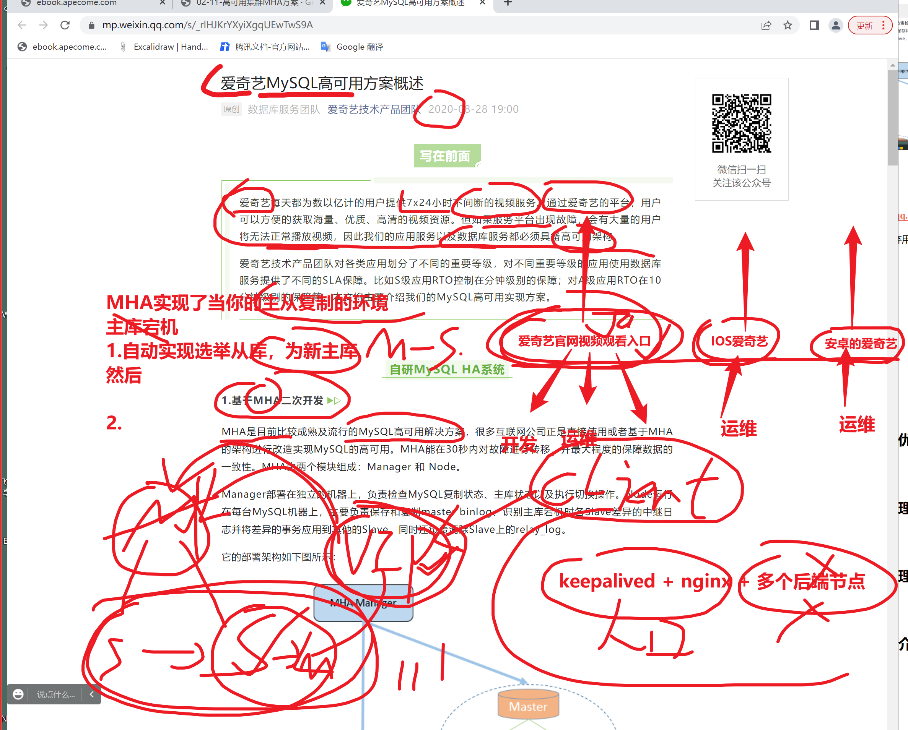
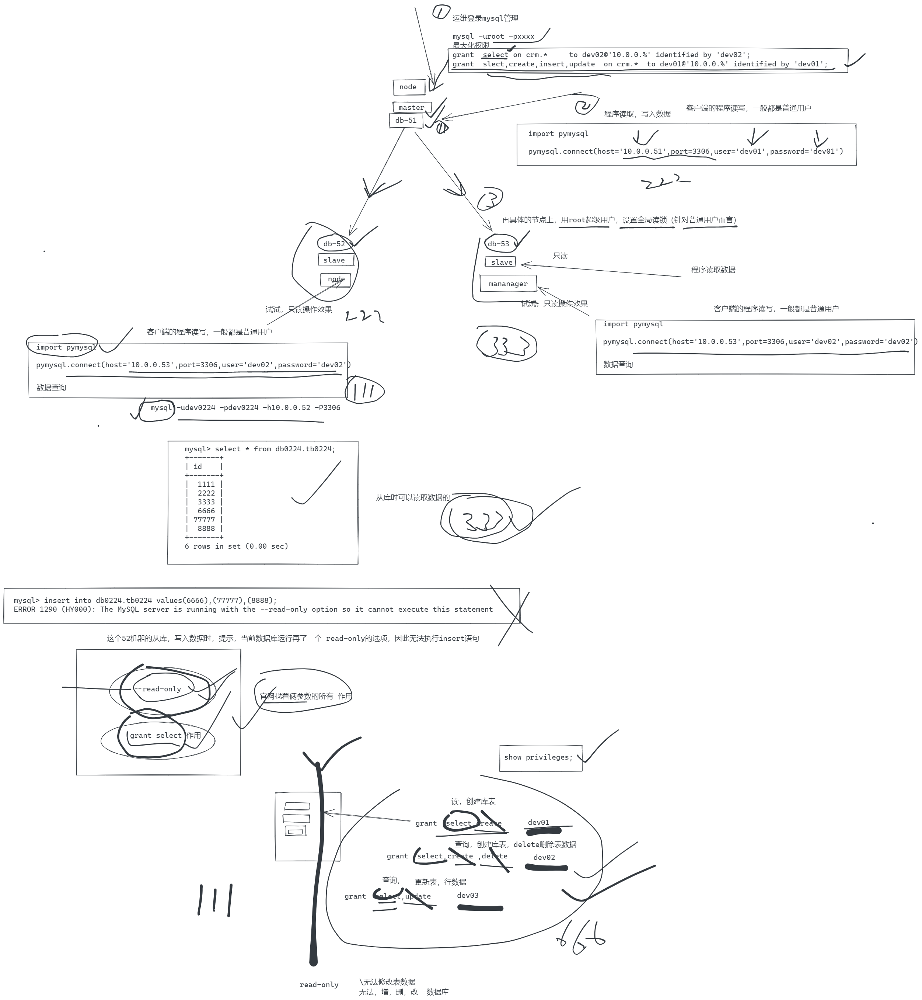
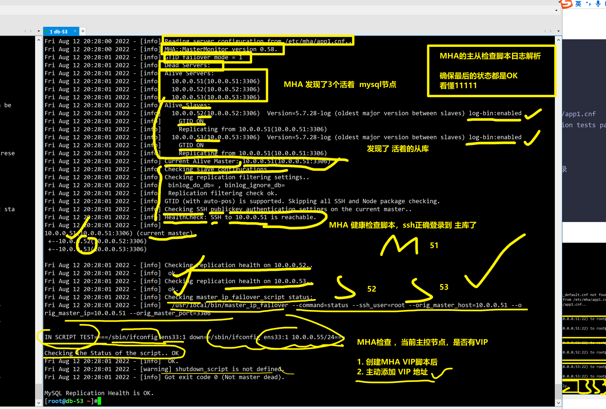

```### 此资源由 58学课资源站 收集整理 ###
	想要获取完整课件资料 请访问：58xueke.com
	百万资源 畅享学习

```
# 学习前言

```
1. 周六请了个运维大佬过来和大家谈谈心，你疑问的技术 ，你对工作环境的问题？疑问？

今天把你的问题，想好，写好发给我 


linux  python 运维开发 讲课


2.你已经坚持了6个月了，即将到达终点,想想每一个环节


3.运维的活没那么难，就像我们一直以来的学习方式
- 找资料，看文档，看官网，找教程
- 解决某个问题，如部署网站的nginx，如数据库备份的方案，如自动化部署的cicd系统
- 只不过你如果自己在公司，需要自己寻找解决方案，而不是超哥这样，给你写好了全部的文档，按部就班的操作，需要自己去看官网，一步步踩坑，然后解决就行了，和你日常的部署没啥区别。
-然后就是看你这6个月锻炼的解决问题的能力，能从容面对公司里的活，或许刚接到需求可能看不懂，没思路，但是不慌。找朋友，找老师协助解决，有方案了，实施部署解决，这事也就过了，能解决的都不叫问题。


```


# 0.爱奇艺的数据库高可用方案

```
MHA市面上，还是比较主流的，能实现，数据库集群的 高可用性的部署工具。

最次的 ，单实例数据库  db-51  3306 mysql  ，单点故障


其次， 升级为  主从复制，  1 主 多从 ， 
主库的数据，再从库有了备份

三台机器，提供了数据库的功能，数据库集群

给从库设置只读模式
主库允许读写
代码链接的ip地址是谁。 

加负载均衡ip

master（new_slave） 挂了  db-51 
↓
slave1 同步1      db-52
↓
slave2（new_master） (reset slave all;  reset master 重置自己的从库角色)  db-53

还希望，至少是 1主 2从 

快速切换回，主从关系，还得再找一个主库


目前基于主从复制，实现了数据库集群玩法


欢迎大家周六来找我，交流交流


```


https://mp.weixin.qq.com/s/_rlHJKrYXyiXgqUEwTwS9A

2020年新文章 ，以弃用MHA，自研数据库高可用软件。




# 1.什么是MHA


MHA 是目前比较成熟及流行的 MySQL 高可用解决方案，很多互联网公司正是直接使用或者基于 MHA 的架构进行改造实现 MySQL 的高可用。

MHA 能在 30 秒内对故障进行转移，并最大程度的保障数据的一致性。

MHA 由两个模块组成：Manager 和 Node。


# 2.学习MHA的优势


# 3.MHA架构原理


# 4.MHA工作原理


# 5.MHA软件包介绍


```
MHA由2部分组成

Manager节点

Node节点


# 安装主程序软件包，会生成如下命令

manager 组件
masterha_manger        启动MHA
masterha_check_ssh         检查MHA的SSH配置状况，MHA，免密登录到目标机器，拷贝binlog，传输relaylog

masterha_check_repl     检查MySQL复制状况，配置信息，MHA再启动前，需要先确保，维护的主从集群，主从复制关系是正常的，


masterha_master_monitor    检测master是否宕机
masterha_check_status         检测当前MHA运行状态
masterha_master_switch     控制故障转移(自动或者手动)
masterha_conf_host        添加或删除配置的server信息


node 组件

save_binary_logs              保存和复制master的二进制日志
apply_diff_relay_logs         识别差异的中继日志事件并将其差异的事件应用于其他的
purge_relay_logs              清除中继日志(不会阻塞SQL线程)
```


# --------6.基础主从复制环境部署------

准备3个机器，准备基于GTID的主从复制，能不用pos值的binlog，都给开启GTID


```
注意逻辑

1. 部署3个节点，  51,52,53  ，1主2从的关系

2. 数据库都要开启GTID功能

3. 注意server_id区别开


4. 最终主从检查命令，确保主从赋值线程都正确就行。

听懂4444 
休息会，


```


## ---------mysql基础环境部署-----

在开始MHA之前，需要先初始化好一主两从的环境

以及既然是高可用mysql集群，所有节点都要开启binlog，注意配置文件语法


## 1.别加autocommit=0参数

```
让数据库自动提交事务，每一个操作都是一个事务记录。
[root@db-51 ~]#cat /etc/my.cnf
[mysqld]
user=mysql 
datadir=/data/mysql_3306 
basedir=/opt/mysql/ 
socket=/tmp/mysql.sock
port=3306 
log_error=/var/log/mysql/mysql.err 
server_id=51 
log_bin=/mysql_binlog/mysql-bin

binlog_format=row
gtid-mode=on 
enforce-gtid-consistency=true
log-slave-updates=1

[mysql] 
socket=/tmp/mysql.sock

[client] 
socket=/tmp/mysql.sock 

```


我当前是3个刚刚初始化的机器


db-51    master

db-52   slave

db-53  slave 


## 主从关系检查

```

# 设置密码
mysqladmin password linux0224

# db-51创建复制账号
mysql -uroot -plinux0224 -e "grant replication slave on*.* to repl@'10.0.0.%' identified by 'repl0224';"

mysql> select user,host  from mysql.user;
+---------------+-----------+
| user          | host      |
+---------------+-----------+
| repl          | 10.0.0.%  |
| mysql.session | localhost |
| mysql.sys     | localhost |
| root          | localhost |
+---------------+-----------+
4 rows in set (0.00 sec)


# db52，db53
mysqladmin password linux0224

mysql -uroot -plinux0224

# 让slave和master建立链接，主从关系

change master to master_host='10.0.0.51', master_user='repl', master_password='repl0224' , MASTER_AUTO_POSITION=1;


start slave;


# 检查复制关系
mysql> show slave status\G


# 主库创建数据，确认从库的复制关系
mysql> select * from db0224.tb0224;
+------+
| id   |
+------+
| 1111 |
| 2222 |
| 3333 |
+------+
3 rows in set (0.01 sec)


# 到这都ok
刷1111


```

## 设置从库只读db-52,db53

- 注意，不得是root用户，否则该参数不生效，大坑。

- 生产下也会用普通账号去链接数据的，因此没问题。

- 注意你链接的地址，链接的到底是哪个库


```
# 实现，从库的只读效果查看


# 1.创建普通用户，让从库链接
# 一定要再51机器上执行，对所有目标机器生效
# slave 1 slave 2 应该提供完全一致的服务器，账户也是
# 51机器执行

grant select  on db0224.* to dev0224@'10.0.0.%' identified by 'dev0224';
=============================================================================

# 先用root账户，登录 52,53机器，设置当前实例的 全局读锁

# 普通用户链接

mysql> show variables like 'read_only%';
+---------------+-------+
| Variable_name | Value |
+---------------+-------+
| read_only     | OFF   |
+---------------+-------+
1 row in set (0.00 sec)

# 用root设置全局读锁

mysql> set global read_only=1;
Query OK, 0 rows affected (0.00 sec)

mysql> show variables like 'read_only%';
+---------------+-------+
| Variable_name | Value |
+---------------+-------+
| read_only     | ON    |
+---------------+-------+
1 row in set (0.00 sec)

=============================================================================

# 分别用两个普通用户，登录具体的 从库实例，查看权限操作

mysql -udev0224 -pdev0224 -h10.0.0.52 -P3306

mysql -udev0224 -pdev0224 -h10.0.0.53 -P3306

# 测试俩从库是否能读取数据，写入数据


```


## 关于select权限和 只读锁的作用


```
1. grant select 是我们主动给用户账户，限制只查询的权限，只是针对这个账号而已

2. 设置--read-only只读会话，是针对当前数据库实例而言的，所有用户而言
区别再次


https://dev.mysql.com/doc/refman/8.0/en/innodb-read-only-instance.html


```





# 7.MHA架构部署

原理性操作理解


## 1.所有节点软连接设置

MHA工具会检测mysql命令，这里还需要加软连接

```


ln -s /opt/mysql/bin/mysqlbinlog /usr/bin/mysqlbinlog

ln -s /opt/mysql/bin/mysql /usr/bin/mysql


# 用如下命令验证
which  mysqlbinlog

which mysql
```


## 2.所有节点执行-全部互相通信

```
#
yum install sshpass -y


ssh-keygen
sshpass -p '123123' ssh-copy-id 10.0.0.51 -o StrictHostKeyChecking=no
sshpass -p '123123' ssh-copy-id 10.0.0.52 -o StrictHostKeyChecking=no
sshpass -p '123123' ssh-copy-id 10.0.0.53 -o StrictHostKeyChecking=no


# 免密验证

```


## 3.所有节点安装MHA-node

```
mha-node软件，--mha-manage通信

# mha perl语言开发的
# 1.先安装依赖环境

yum install  -y perl-DBD-MySQL -y


# 2.安装软件
yum localinstall mha4mysql-node-0.58-0.el7.centos.noarch.rpm -y


```


## 4.db-53安装MHA-Manager

MHA管理节点可以装在任何节点，于超老师这里就给安装到了`slave03 节点`

因为Manager管理节点，通过ssh检测mysql集群，如果`master`节点服务器宕机，或者网络故障，MHA也无法完成故障切换了。

**因此mha-manager不能装在`master节点`**

```
yum install epel-release -y

yum install  -y perl-DBD-MySQL perl-Config-Tiny perl-Log-Dispatch perl-Parallel-ForkManager perl-ExtUtils-CBuilder perl-ExtUtils-MakeMaker perl-CPAN perl-Time-HiRes 


yum localinstall -y mha4mysql-manager-0.58-0.el7.centos.noarch.rpm


```


## 5.所有节点创建mha用户

```
mha命令，脚本，通过这个用户，检测 所有机器的 主从复制状态

# db-51执行即可

mysql> 
mysql> grant all privileges on *.* to mha@'%' identified by 'mha0224';
Query OK, 0 rows affected, 1 warning (0.00 sec)

mysql> flush privileges;
Query OK, 0 rows affected (0.00 sec)

```


## 6.创建db-53的manager配置文件

```
mkdir -p /etc/mha           #<==在/etc下创建mha目录。
mkdir -p /var/log/mha/app1  #<==在/etc下创建mha目录。
```


### 使用该配置即可

mysql -uroot -plinux0224 -e "grant replication slave on*.* to repl@'10.0.0.%' identified by 'repl0224';"


```bash
# author:www.yuchaoit.cn
cat > /etc/mha/app1.cnf << 'EOF'
[server default]
manager_log=/var/log/mha/app1/manager.log
manager_workdir=/var/log/mha/app1.log
master_binlog_dir=/mysql_binlog/
# 该脚本暂时先注释
master_ip_failover_script=/usr/local/bin/master_ip_failover
user=mha
password=mha0224
ping_interval=2
# 填入你当前主从赋值，账号密码

repl_user=repl
repl_password=repl0224
#  mha 用这个账户，免密登录3个节点机器
# 听懂111

ssh_user=root

[server1]
hostname=10.0.0.51
port=3306

[server2]
hostname=10.0.0.52
port=3306

[server3]
hostname=10.0.0.53
port=3306
EOF
```


## 创建基于VIP的MHA高可用性数据库

只需要修改这个脚本，填入你的网卡环境即可

看懂111


```perl
创建如下脚本，mha配置文件，会自动调用它，perl语言脚本

/usr/local/bin/master_ip_failover

# 填入如下内容
#!/usr/bin/env perl

use strict;
use warnings FATAL => 'all';

use Getopt::Long;

my (
    $command,          $ssh_user,        $orig_master_host, $orig_master_ip,
    $orig_master_port, $new_master_host, $new_master_ip,    $new_master_port
);

my $vip = '10.0.0.55/24';
# 给网卡添加的别名
my $key = '1';
my $ssh_start_vip = "/sbin/ifconfig ens33:$key $vip";
my $ssh_stop_vip = "/sbin/ifconfig ens33:$key down";
my $ssh_Bcast_arp="/sbin/arping -I ens33 -c 3 -A 10.0.0.55";

GetOptions(
    'command=s'          => \$command,
    'ssh_user=s'         => \$ssh_user,
    'orig_master_host=s' => \$orig_master_host,
    'orig_master_ip=s'   => \$orig_master_ip,
    'orig_master_port=i' => \$orig_master_port,
    'new_master_host=s'  => \$new_master_host,
    'new_master_ip=s'    => \$new_master_ip,
    'new_master_port=i'  => \$new_master_port,
);

exit &main();

sub main {

    print "\n\nIN SCRIPT TEST====$ssh_stop_vip==$ssh_start_vip===\n\n";

    if ( $command eq "stop" || $command eq "stopssh" ) {

        my $exit_code = 1;
        eval {
            print "Disabling the VIP on old master: $orig_master_host \n";
            &stop_vip();
            $exit_code = 0;
        };
        if ($@) {
            warn "Got Error: $@\n";
            exit $exit_code;
        }
        exit $exit_code;
    }
    elsif ( $command eq "start" ) {

        my $exit_code = 10;
        eval {
            print "Enabling the VIP - $vip on the new master - $new_master_host \n";
            &start_vip();
            $exit_code = 0;
        };
        if ($@) {
            warn $@;
            exit $exit_code;
        }
        exit $exit_code;
    }
    elsif ( $command eq "status" ) {
        print "Checking the Status of the script.. OK \n";
        exit 0;
    }
    else {
        &usage();
        exit 1;
    }
}

# author: www.yuchaoit.cn

sub start_vip() {
    `ssh $ssh_user\@$new_master_host \" $ssh_start_vip \"`;
}
sub stop_vip() {
     return 0  unless  ($ssh_user);
    `ssh $ssh_user\@$orig_master_host \" $ssh_stop_vip \"`;
}

sub usage {
    print
    "Usage: master_ip_failover --command=start|stop|stopssh|status --orig_master_host=host --orig_master_ip=ip --orig_master_port=port --new_master_host=host --new_master_ip=ip --new_master_port=port\n";
}
```

## 给当前的主库机器，添加VIP

```
# 创建
ifconfig ens33:1 10.0.0.55/24


# 删除
ifconfig ens33:1 del 10.0.0.55


# 停止
ifconfig ens33:1 down


```


## 7.状态检查db-53

准备启动MHA了


```
检测如下MHA运行条件
# mha提供了很方便的脚本，检测你的mha环境搭建情况
- SSH免密登录
- MySQL主从复制


[root@db-53 ~]#masterha_check_ssh --conf=/etc/mha/app1.cnf 
Tue Aug  2 00:36:08 2022 - [info] All SSH connection tests passed successfully.


# 主从检测脚本，会用到mha账号，在三个机器上进行检测登录

# 再检查主从复制状态
masterha_check_repl --conf=/etc/mha/app1.cnf

```





## =======启动MHA程序=====故障演练

```
1. 启动mha的管理节点，后台运行即可---用的是 db-53机器

[root@db-53 ~]#
[root@db-53 ~]#nohup masterha_manager --conf=/etc/mha/app1.cnf  --remove_dead_master_conf  --ignore_last_failover /var/log/mha/app1/manager.log 2>&1 &
[1] 3647
[root@db-53 ~]#nohup: ignoring input and appending output to ‘nohup.out’

[root@db-53 ~]#
[root@db-53 ~]#
[root@db-53 ~]#jobs
[1]+  Running                 nohup masterha_manager --conf=/etc/mha/app1.cnf --remove_dead_master_conf --ignore_last_failover /var/log/mha/app1/manager.log 2>&1 &
[root@db-53 ~]#
[root@db-53 ~]#
[root@db-53 ~]#ps -ef|grep mha
root       3647   1634  1 20:37 pts/0    00:00:00 perl /usr/bin/masterha_manager --conf=/etc/mha/app1.cnf --remove_dead_master_conf --ignore_last_failover /var/log/mha/app1/manager.log
root       3664   1634  0 20:37 pts/0    00:00:00 grep --color=auto mha


2 .检查MHA是否运行中
[root@db-53 ~]#masterha_check_status --conf=/etc/mha/app1.cnf
app1 (pid:3647) is running(0:PING_OK), master:10.0.0.51
[root@db-53 ~]#
[root@db-53 ~]#
[root@db-53 ~]## kandong 111

# mha此时确认主库正常，还是 51机器


```


### 故障演练

```
期望的结果是
1. 当前环境
db-51    master 

db-52   slave  

db-53    slave  

2. 干掉主库
pkill mysql


2.1 查看VIP的状态，MHA脚本切换VIP到新的主库上，51机器的VIP没了
已确认 51机器的VIP没了


3. 查看主从复制关系
[root@db-53 ~]#mysql -uroot -plinux0224
mysql> show slave status\G

得到结论，MHA自动选举 db-52为新的主库

还得做数据的验证，看看旧的主库51机器的binlog，和52新主库对比
[root@db-51 /mysql_binlog]#mysqlbinlog -vv  mysql-bin.000002 |grep -i 'gtid'

最后一次提交是 事务id是 8
自动下一次的事务，9开始

---看52机器


----52机器


4.  MHA再发生切换后，该程序会挂掉
也确认了


```

## 测试新的主从关系是否正常

```
52机器写入数据
已确认 事务提交更新，写入到新机器 52的 GTID版本号里了
6a952706-1a30-11ed-882e-000c294c7d18:2

去新的从库查看数据，以及比对GTID号码

GTID号码
以配置文件里 server_id 
SHOW GLOBAL VARIABLES LIKE 'server_uuid';


```

### 至此，新的主从关系又建立了


## 主从故障恢复，再次开启MHA

1点继续

```
1.刚才以明确，  db-51挂了，且截止的最新binlog，和 新主库 db-52的GTID版本是一致的。

确保，主从切换之后，旧的主库数据，都得到 新主库里

- 放心用52作为新的主库
- 51机器挂了，日志肯定都是旧的数据
- 模拟52作增量写入，新数据。53立即同步
- 51机器恢复后，它的数据会如何？


先看看mha的配置文件


2. db-51加入的话，会默认被设置为slave身份，是因为mha的配置文件决定的。


3.且 db-51加入后，会基于GTID的历史记录，自动更新增量后的差异数据。


```


### 恢复51机器，以及MHA再次做高可用检测

```
1. 51机器，直接启动，和新的主库建立复制就行，预测，51机器，是否能看到最新的 52机器的数据

# 1.启动
systemctl start mysqld

# 2. 加入主从
mysql -uroot -plinux0224

change master to master_host='10.0.0.52', master_user='repl', master_password='repl0224' , MASTER_AUTO_POSITION=1;


start slave;

show slave status;


```


## 再次开启MHA

```

[root@db-53 ~]#cat /etc/mha/app1.cnf 
[server default]
manager_log=/var/log/mha/app1/manager.log
manager_workdir=/var/log/mha/app1.log
master_binlog_dir=/mysql_binlog/
master_ip_failover_script=/usr/local/bin/master_ip_failover
password=mha0224
ping_interval=2
repl_password=repl0224
repl_user=repl
ssh_user=root
user=mha

[server2]
hostname=10.0.0.52
port=3306

[server3]
hostname=10.0.0.53
port=3306


1.添加db-51机器的 配置信息
masterha_conf_host --command=add --conf=/etc/mha/app1.cnf --hostname=10.0.0.51 --block=server1 --params="port=3306"


[root@db-53 ~]#cat /etc/mha/app1.cnf 
[server default]
manager_log=/var/log/mha/app1/manager.log
manager_workdir=/var/log/mha/app1.log
master_binlog_dir=/mysql_binlog/
master_ip_failover_script=/usr/local/bin/master_ip_failover
password=mha0224
ping_interval=2
repl_password=repl0224
repl_user=repl
ssh_user=root
user=mha

[server1]
hostname=10.0.0.51
port=3306

[server2]
hostname=10.0.0.52
port=3306

[server3]
hostname=10.0.0.53
port=3306
[root@db-53 ~]#

2.重新检测2 ssh，repl

先检查复制情况
[root@db-53 ~]#masterha_check_repl --conf=/etc/mha/app1.cnf

masterha_check_ssh --conf=/etc/mha/app1.cnf

3. 启动即可

nohup masterha_manager --conf=/etc/mha/app1.cnf  --remove_dead_master_conf  --ignore_last_failover /var/log/mha/app1/manager.log 2>&1 &

```


## ====再次新一轮的主从切换，查看日志恢复原理过程====

```
1. 停止52机器

2. 查看VIP关系


3.查看日志，掌握原理过程

```


---


---


---


```
你学的是看懂MHA日志，分析原理

以后维护其他软件，套路都是一样


```


# ======今日作业=====

```
1. 整理，练习MHA的部署文档，以及记忆MHA的迁移原理流程

2. 周末作业


- 周六来学校，有大佬分享，上午自己写简历，咱们开始第一版的简历编写，然后优化，再下周出一个简历v1版本。

- 就可以更新简历，
- 边学 redis，docker  k8s  
- 简历加几行


- 预习redis章节内容。

3 .66666


散会


```


# 8.MHA工作原理

## 8.1 选主策略

也就是MHA如何判定，slave可以提升为主库

```
1.  日志量最新
2.  备选主
3.  不被选主
```


## 8.2 故障如何转移的


# 9.MHA透明自愈


## 1.开发VIP漂移脚本

根据机器情况修改变量即可


## 2.修改添加脚本


## 3.db-51主库添加VIP


## 4.重启MHA


## 5.检查MHA运行状态


## 6.MHA故障邮件提醒


# 10.MHA故障演练

> 于超老师友情提醒，故障演练前，做好快照


## 1.停止old_master主库


### 4.结果总结


### 5 而且MHA修改了app1.cnf


# 11.MHA修复方案

## 1.db-51加入主从


## 2.检查db-52


## 3.修复配置文件，加入新节点


## 4.再次确认SSH和复制脚本


## 5.再次启动MHA


## 6.至此MHA高可用再次运行了


