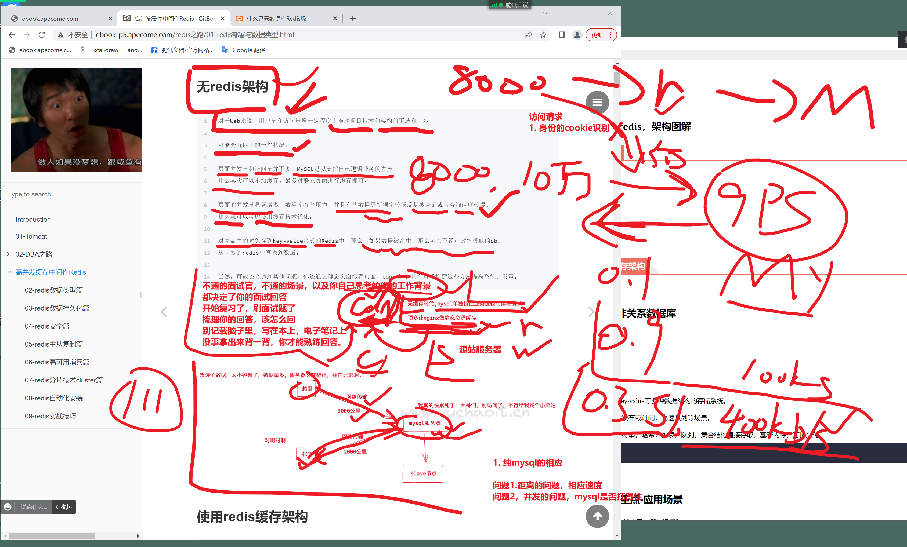
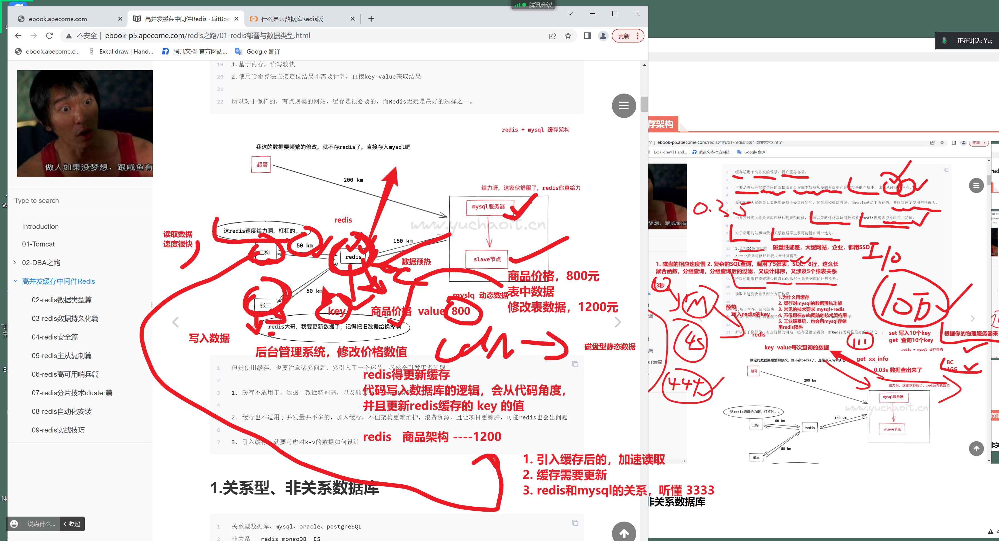
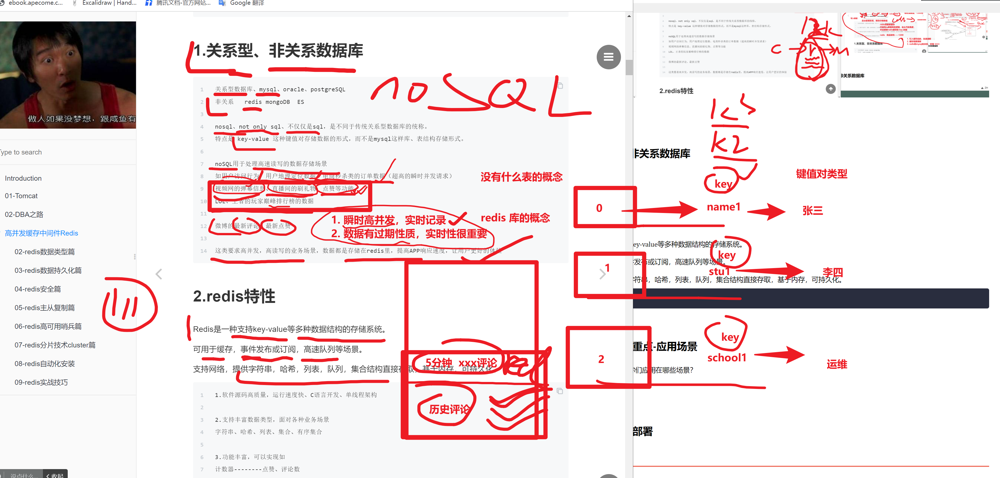
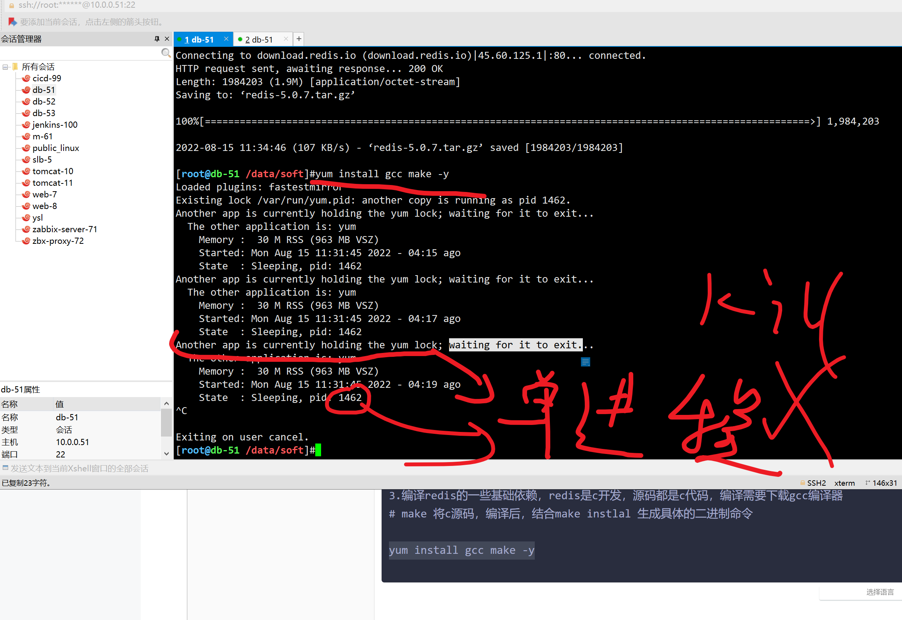
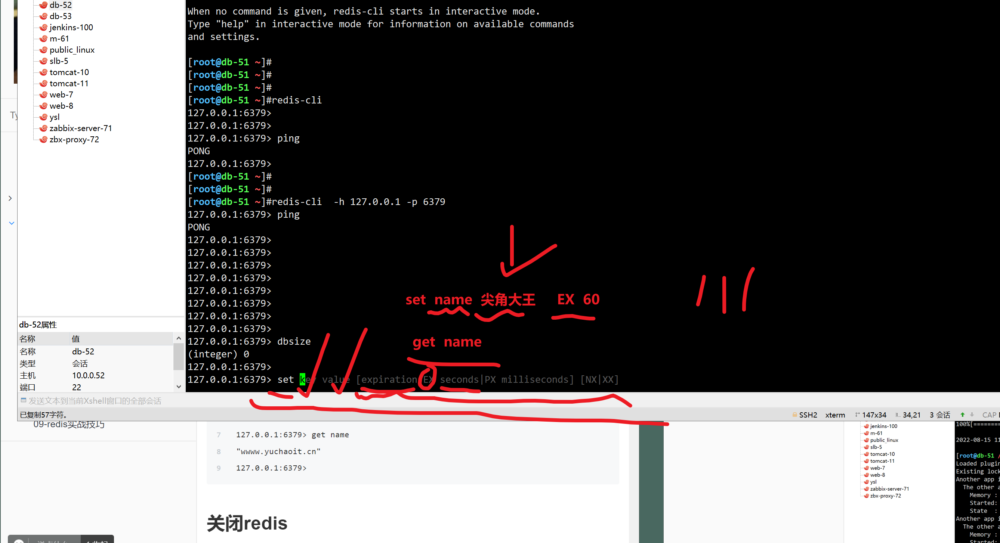
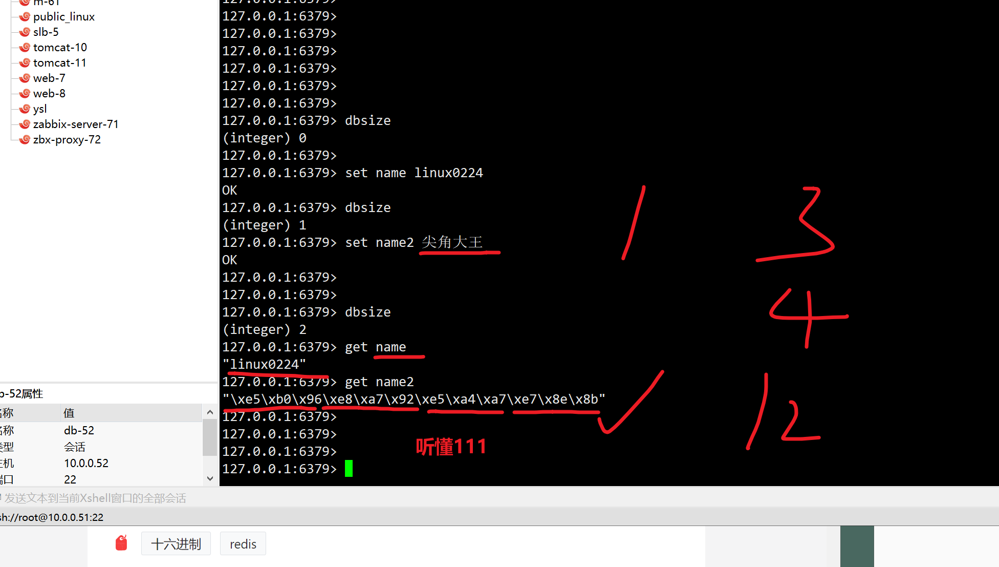
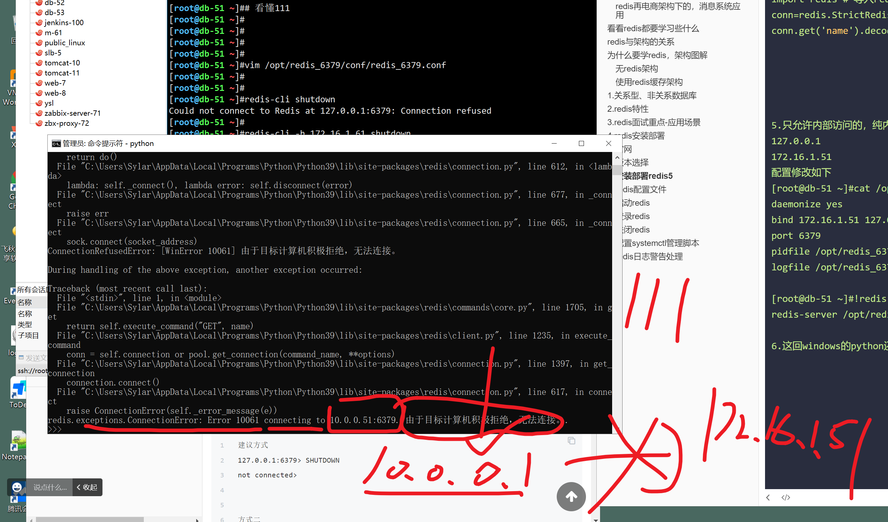

```### 此资源由 58学课资源站 收集整理 ###
	想要获取完整课件资料 请访问：58xueke.com
	百万资源 畅享学习

```
# 高并发缓存中间件Redis

# 为什么要学原理，高级操作，是一步步，演进而来的


## redis再电商架构下的，消息系统应用


# 看看redis都要学习些什么

从阿里云角度来看


# redis与架构的关系


# 为什么要学redis，架构图解

## 无redis架构





## 使用redis缓存架构





# 1.关系型、非关系数据库




# 2.redis特性

Redis是一种支持key-value等多种数据结构的存储系统。

可用于缓存，事件发布或订阅，高速队列等场景。

支持网络，提供字符串，哈希，列表，队列，集合结构直接存取，基于内存，可持久化。

```

```


# 3.redis面试重点-应用场景

redis用的如何？你们应用在哪些场景？


# 4.redis安装部署

## 官网


## 版本选择

```
2.x 老掉牙
3.x 还有很多公司用，开始支持redis-cluster
4.x 混合持久化玩法
5.x 快手等互联网公司更新到这了
6.x 最新版
```

## 安装部署redis5

```perl
1. redis的配置文件，数据目录，单独创建，规划好
mkdir -p /data/soft/ 
mkdir -p /opt/redis_6379/{conf,logs,pid}
mkdir -p /data/redis_6379/


2. 安装方式，选择源码编译，可定制化

# 下载redis5
[root@db-51 ~]#cd /data/soft/
[root@db-51 /data/soft]#wget http://download.redis.io/releases/redis-5.0.7.tar.gz

3.编译redis的一些基础依赖，redis是c开发，源码都是c代码，编译需要下载gcc编译器
# make 将c源码，编译后，结合make instlal 生成具体的二进制命令

yum install gcc make -y


4.此时进入redis源码编译安装，解压到/opt目录
[root@db-51 /data/soft]#tar -zxf redis-5.0.7.tar.gz  -C /opt/
[root@db-51 /data/soft]#ls /opt/
redis-5.0.7  redis_6379


5.进入源码目录，编译安装
cd /opt/redis-5.0.7
# 由于redis的5.0最新版本，对内存分配的代码更新，需要添加如下参数
# https://redis.io/commands/memory-malloc-stats/

make MALLOC=libc && make install 
#该编译方式，会直接再当前源码下，生成二进制执行命令

# 建议再生产下，进行make test


# 自定二进制命令放到哪
[root@db-51 /opt/redis-5.0.7]#make PREFIX=/opt/redis5 install
cd src && make install
make[1]: Entering directory `/opt/redis-5.0.7/src'

Hint: It's a good idea to run 'make test' ;)

    INSTALL install
    INSTALL install
    INSTALL install
    INSTALL install
    INSTALL install
make[1]: Leaving directory `/opt/redis-5.0.7/src'
[root@db-51 /opt/redis-5.0.7]#ls /opt/redis5
bin
[root@db-51 /opt/redis-5.0.7]#ls /opt/redis5/bin
redis-benchmark  redis-check-aof  redis-check-rdb  redis-cli  redis-sentinel  redis-server


6.创建配置文件，准备启动redis
# 统一管理，日志，pid文件，配置文件

mkdir -p /opt/redis_6379/{conf,logs,pid}
mkdir -p /data/redis_6379

cat > /opt/redis_6379/conf/redis_6379.conf <<'EOF'
daemonize yes
bind  127.0.0.1 172.16.1.51 10.0.0.51
port 6379
pidfile /opt/redis_6379/pid/redis_6379.pid
logfile /opt/redis_6379/logs/redis_6379.log
EOF

# 配置文件里别有注释

cat > /opt/redis_6379/conf/redis_6379.conf <<'EOF'
daemonize yes  # 后台运行redis，日志写入 log文件
# 表示redis监听地址分别再这2个地址	，意思是提供了2个入口
# 127.0.0.1 6379 机器本地区链接
#  提供远程链接，再网段10.0.0.xx下  ，从如 10.0.0.7 > 10.0.0.51:6379
# 保护redis只在本地运行
# 意思是，你的后端程序，只能和redis搁一块
bind 127.0.0.1
# redis 提供再 172.16.1.0网段的运行
bind 172.16.1.51

# redis提供企业内部的2个网络环境下运行
# bind 127.0.0.1 172.16.1.51 10.0.0.51

# redis提供再互联网中运行，这结果玩法，去你的阿里云上试试
bind 0.0.0.0

# 配置看懂111


bind 127.0.0.1 10.0.0.51	 
port 6379 # 默认端口
# 进程运行后的pid，写入文件
pidfile /opt/redis_6379/pid/redis_6379.pid
# 日志写入该文件
logfile /opt/redis_6379/logs/redis_6379.log
EOF


# 这是我给大家提供好的，5个redis运行参数
# redis还有更多其他的参数，找一个测试机器，yum install redis  ,/etc/redis.conf 学习有哪些参数功能


6.1 查看redis的二进制命令
[root@db-51 /opt/redis-5.0.7]#ll /opt/redis5/bin/
total 13024
-rwxr-xr-x 1 root root  353824 Aug 15 11:46 redis-benchmark   # 性能测试
-rwxr-xr-x 1 root root 4058368 Aug 15 11:46 redis-check-aof	# 检查aof数据状态
-rwxr-xr-x 1 root root 4058368 Aug 15 11:46 redis-check-rdb	# 检查rdb数据状态
-rwxr-xr-x 1 root root  799304 Aug 15 11:46 redis-cli		# redis-client登录命令
lrwxrwxrwx 1 root root      12 Aug 15 11:46 redis-sentinel -> redis-server
-rwxr-xr-x 1 root root 4058368 Aug 15 11:46 redis-server    # redis哨兵，启动服务端都是这个命令

听懂111

6.2 启动redis服务端

发现make && make install 自动装到 /usr/local/bin目录下

命令

redis-server  配置文件

redis-server /opt/redis_6379/conf/redis_6379.conf 


7.登录redis查看如何用

[root@db-51 ~]#netstat -tunlp|grep redis
tcp        0      0 10.0.0.51:6379          0.0.0.0:*               LISTEN      3339/redis-server 1 
tcp        0      0 172.16.1.51:6379        0.0.0.0:*               LISTEN      3339/redis-server 1 
tcp        0      0 127.0.0.1:6379          0.0.0.0:*               LISTEN      3339/redis-server 1 
[root@db-51 ~]#
[root@db-51 ~]#
[root@db-51 ~]#
[root@db-51 ~]#cat /opt/redis_6379/conf/redis_6379.conf 
daemonize yes
bind 127.0.0.1 172.16.1.51 10.0.0.51
port 6379
pidfile /opt/redis_6379/pid/redis_6379.pid
logfile /opt/redis_6379/logs/redis_6379.log
[root@db-51 ~]#
[root@db-51 ~]#
[root@db-51 ~]## 看懂正确运行，结果，111
[root@db-51 ~]#
[root@db-51 ~]## 测试多种链接方式


7.1 redis多网段的链接方式

- 本地链接，本地代码，客户端，链接redis服务端

redis-cli  -h 地址 -p 端口  -a 密码 

[root@db-51 ~]#redis-cli 
127.0.0.1:6379> 
127.0.0.1:6379> 
127.0.0.1:6379> ping
PONG
127.0.0.1:6379> 


[root@db-51 ~]#redis-cli  -h 127.0.0.1 -p 6379 
127.0.0.1:6379> ping
PONG


- 10网段得链接
[root@db-52 ~]#redis-cli -h 10.0.0.51 -p 6379
10.0.0.51:6379> ping
PONG


- 172网段的链接
[root@db-52 ~]#redis-cli -h 172.16.1.51 -p 6379
172.16.1.51:6379> 
172.16.1.51:6379> 
172.16.1.51:6379> 
172.16.1.51:6379> 
172.16.1.51:6379> 
172.16.1.51:6379> ping
PONG


- 测试写入数据，查看数据，redis最基本，最多的操作

set，get，写入字符串数据，查询字符串数据


- 再51机器的redis 6379实例，本地数据写入，查看key的数量，建议写入英文，中文也支持，但是只会用16进制的表达式展示
127.0.0.1:6379> dbsize
(integer) 0

127.0.0.1:6379> set name linux0224
OK

127.0.0.1:6379> set name linux0224
OK
127.0.0.1:6379> dbsize
(integer) 1
127.0.0.1:6379> set name2 尖角大王
OK
127.0.0.1:6379> 
127.0.0.1:6379> 
127.0.0.1:6379> dbsize
(integer) 2

查看数据，以及查看中文数据
非交互式redis操作

[root@db-51 ~]#redis-cli get name
"linux0224"

[root@db-51 ~]#redis-cli get name2
"\xe5\xb0\x96\xe8\xa7\x92\xe5\xa4\xa7\xe7\x8e\x8b"
[root@db-51 ~]#

用--raw参数，转码中文汉字
[root@db-51 ~]#redis-cli --raw get name2
尖角大王


# 看懂111


--- 172网段的数据查看
[root@db-52 ~]#redis-cli -h 172.16.1.51 -p 6379  get name
"linux0224"
[root@db-52 ~]#
[root@db-52 ~]#
[root@db-52 ~]#redis-cli -h 172.16.1.51 -p 6379  --raw  get name2
尖角大王


--10 网段的数据查看

[root@db-52 ~]#redis-cli -h 10.0.0.51 -p 6379  --raw  get name2
尖角大王
[root@db-52 ~]#redis-cli -h 10.0.0.51 -p 6379  --raw  get name
linux0224


# 关闭多网段，修改多网段的配置文件
[root@db-51 ~]#cat /opt/redis_6379/conf/redis_6379.conf 
daemonize yes
bind 0.0.0.0
port 6379
pidfile /opt/redis_6379/pid/redis_6379.pid
logfile /opt/redis_6379/logs/redis_6379.log
[root@db-51 ~]#

重启的多个方式

1. kill pkill，直接干掉，但是作死操作，redis内存的数据，会直接丢失，不进行持久化操作

kill   pid
killall  进程名
pkill  进程名
 
2. shutdown命令，会加载redis的持久化配置操作，优雅关闭

[root@db-51 ~]#redis-cli shutdown
[root@db-51 ~]#ps -ef|grep redi[s]


3.重启，目前配置文件未支持持久化，因此key全部丢失

[root@db-51 ~]#redis-server /opt/redis_6379/conf/redis_6379.conf 
[root@db-51 ~]#
[root@db-51 ~]#ps -ef|grep redi[s]
root       3474      1  0 12:10 ?        00:00:00 redis-server 0.0.0.0:6379
[root@db-51 ~]#
[root@db-51 ~]#
[root@db-51 ~]#netstat -tunlp |grep redi[s]
tcp        0      0 0.0.0.0:6379            0.0.0.0:*               LISTEN      3474/redis-server 0 

4. 再次登录访问
[root@db-51 ~]#redis-cli 
127.0.0.1:6379> 
127.0.0.1:6379> dbsize
(integer) 0
127.0.0.1:6379> 

再写入数据，其他实例查看

[root@db-52 ~]#redis-cli -h 172.16.1.51 -p 6379  --raw  get name
尖角大王2


# windows可以访问吗？=远程访问


[root@db-52 ~]#redis-cli -h 10.0.0.51 -p 6379  --raw  get name
尖角大王2

# 再windows下用python代码，远程链接10.0.0.51 6379的数据查看
# python.org 下载python windows msi格式，下一步安装即可

pip install redis
直接输入python解释器，默认是交互式的命令操作

# 跟着解读，听懂看懂111

# python代码如下，确认你的机器可以远程链接
import redis # 导入redis模块，用于链接redis的代码
conn=redis.StrictRedis(host='10.0.0.51',port=6379)  #建立conn变量，链接具体实例
conn.get('name').decode()   # 读取name key的值，且解码，显示为中文


5.只允许内部访问的，纯内网访问
127.0.0.1
172.16.1.51 
配置修改如下
[root@db-51 ~]#cat /opt/redis_6379/conf/redis_6379.conf 
daemonize yes
bind 172.16.1.51 127.0.0.1 
port 6379
pidfile /opt/redis_6379/pid/redis_6379.pid
logfile /opt/redis_6379/logs/redis_6379.log

[root@db-51 ~]#!redis-server
redis-server /opt/redis_6379/conf/redis_6379.conf 

6.这回windows的python还能访问嗯嘛？

不能了


7. 复制粘贴，生成redis的systemctl 管理脚本即可，yum install redis 


8.根据redis的日志，进行优化调整（任何如nginx，mysql，。redis的优化，都是根据生产环境遇见的问题，进行参数设置，解决某问题，如链接数过大，如CPU使用核数等优化）

8.1 看博客，完成redis运行脚本设置，优化参数
- 看日志
- 查redis官网，如何优化
- redis安全加固操作，官网都有资料，看我博客


今日作业

1. redis理论性学习，看笔记整理话术，自己也要回说，回答，为什么用redis，redis有哪些特点，你们公司为什么用redis？得从大的角度回答，表述你对高级技术的理解，
二个，描述你是在小公司，用的阿里云的redis，但是redis这些技能你都会，以及redis用在什么场景
？找具体的产品，去结合redis去部署，看看有什么用
- jumpserver
- github，码云，找 一个高级的 运维平台，带有redis的平台去部署，看redis写入了什么数据
听懂 1111


2. 有余力的话，预习redis数据类型。


```




.








## redis配置文件


## 启动redis


## 登录redis


## 关闭redis


## 配置systemctl管理脚本


## redis日志警告处理

> 在redis日志里，可以看到启动后的一些问题


