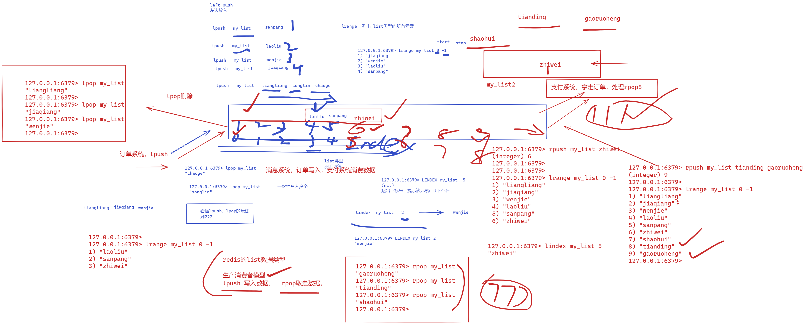
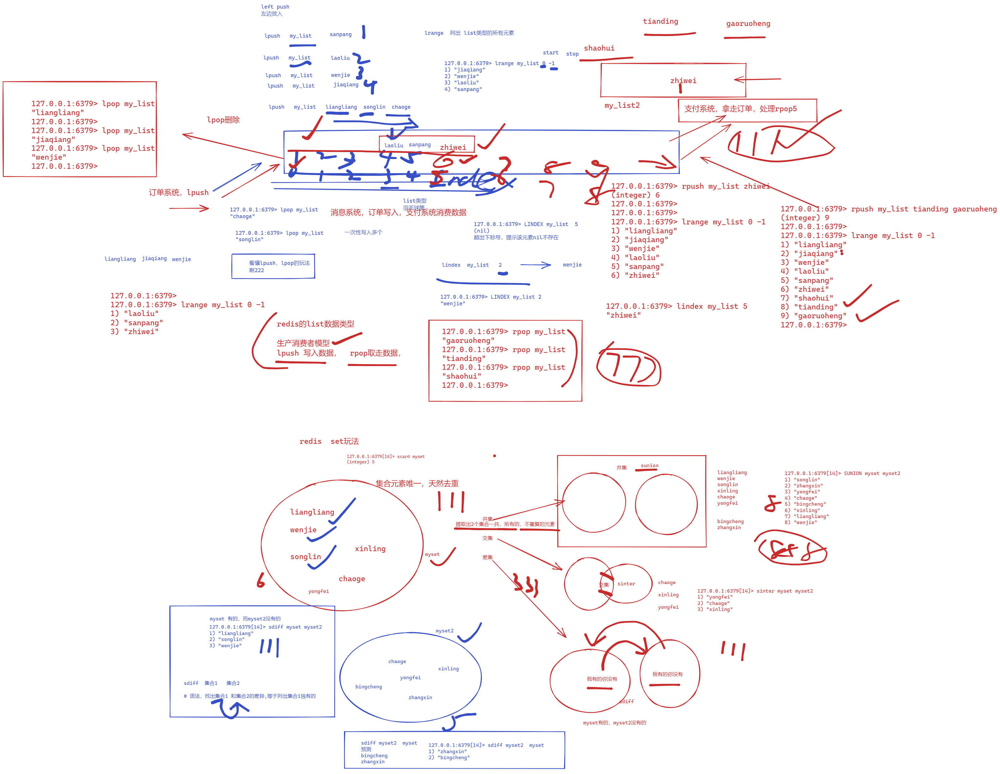

```### 此资源由 58学课资源站 收集整理 ###
	想要获取完整课件资料 请访问：58xueke.com
	百万资源 畅享学习

```
# 02-redis数据类型篇

redis数据类型官网资料，https://redis.io/docs/manual/data-types/


## 生产环境下的redis实况图

任务，学会五大数据类型，知道一个产品，再使用redis的时候，写入的key是多少个，以及写入的key都是什么类型

以及有什么作用


# 1.全局命令

## redis数据存储格式

```
key : value
键 : 值
```

## set设置k-v

```perl
set是专门用于设置 字符串类型的 key

语法提示
set key value [expiration EX seconds|PX milliseconds] [NX|XX]

先不用后面的额外选项

# set,get是用于字符串类型的 key读写命令

# 直接定义key，以及赋值value的值
# 程序用法也是一样，调用set写入值，调用get，查询字符串类型的值

127.0.0.1:6379> set k1 v1
OK
127.0.0.1:6379> 
127.0.0.1:6379> 
127.0.0.1:6379> set k2 v2
OK
127.0.0.1:6379> 
# 对同一个key，重新set，覆盖原有的值

127.0.0.1:6379> set k2 v3
OK
127.0.0.1:6379> 
127.0.0.1:6379> set k3  v3
OK
127.0.0.1:6379> 
127.0.0.1:6379> dbsize 
(integer) 3
127.0.0.1:6379> 


# 读取数据
127.0.0.1:6379> get k1
"v1"
127.0.0.1:6379> 
127.0.0.1:6379> get k2
"v2222"
127.0.0.1:6379> 
127.0.0.1:6379> get k3
"v3"
127.0.0.1:6379> 

# python客户端，模拟数据读写，字符串


# 查看单
```


## 查看当前redis的key的数量

```
127.0.0.1:6379> dbsize
(integer) 0

这是一个常用命令


#查看当前实例下的所有key 数量
10.0.0.51:6379> dbsize
(integer) 5
10.0.0.51:6379> keys *
1) "k2"
2) "k3"
3) "user1_session"
4) "user2_session"
5) "k1"


dbsize

其他的命令scan扫描命令，替代keys *
scan命令是小范围，基于名字正则搜索，不会全局搜索，

keys * 全局搜索，给redis带来很大压力


```


## 危险命令，新手请在于超老师陪同下执行

```
线上，生产环境服务器，严禁随意执行该命令

keys * 对key名的通配符扫描，单线程卡主，其他任务全部暂停执行，业务夯住，卡死，崩溃。网站直接500


5000 


100万个key数量  
```

来看看一堆运维的聊天记录


### 为什么危险？

```
如果是非线上redis环境，你执行也还凑活
但是为什么生产redis服务器，禁止呢？

看官方解释，keys *的意思


Available since 1.0.0.
Time complexity: O(N) with N being the number of keys in the database, under the assumption that the key names in the database and the given pattern have limited length.
Returns all keys matching pattern.

While the time complexity for this operation is O(N), the constant times are fairly low. For example, Redis running on an entry level laptop can scan a 1 million key database in 40 milliseconds.
Warning: consider KEYS as a command that should only be used in production environments with extreme care. It may ruin performance when it is executed against large databases. This command is intended for debugging and special operations, such as changing your keyspace layout. Don’t use KEYS in your regular application code. If you’re looking for a way to find keys in a subset of your keyspace, consider using SCAN or sets.

大致意思就是
keys 命令是扫描redis所有的key，且速度非常快，大约是40ms 100万个key。
在生产环境下，应该极少的情况下，再去用keys命令，否则会导致如超过千万key数量的实例出现灾难性宕机的问题。
```


### 如何正确搜索redis的key

先看错误玩法，一个萌新运维，作死执行的命令。

```
可见，该7号库下，有1200W个key

基于keys OemToken*这样的模糊搜索，执行了1.35秒，大约100ms扫描100万个key，这个速度是远慢于官方的搜索指标的。

这是因为该服务器不能只跑redis啊，其他的进程都在抢夺CPU，因此redis这里就慢了么。

根本原因在于
1. redis是k-v类型的数据库，以hash结构存储，因此可以根据key，超高速的查询value值。

2. 但是基于* 这样的模糊key搜索，redis只能进行全库扫描，并且redis是单线程执行命令，同一时间只

能有一个命令在运行，如果你这里keys * 卡了半天，导致其他redis的key读写命令全部等待，数据库就废了。

set xxx xxx 
set xx xxx

40万key / s 


如何改进


基于scan命令替代keys命令

听懂keys * 的一个生产故障的案例分享，以及用scan命令 代替kyes * 刷1111


```


## 查看库下有多少个key

```
dbsize

```


## 查询redis库信息

```
# info命令，用于查看redis所有的信息，包括后续学习的 主从，哨兵，集群都可以去看
info 

# 快捷列出，所有的区块的名字


# info 后面支持制定某个 区段信息
10.0.0.51:6379> 
10.0.0.51:6379> info  keyspace
# Keyspace
db0:keys=6,expires=0,avg_ttl=0


```


```
[root@db-51 ~]#redis-cli info | grep -E '^#' 
# Server
# Clients
# Memory
# Persistence
# Stats
# Replication
# CPU
# Cluster
# Keyspace


```


## 切换redis库

```
# redis默认有16个 DB库可以用
# 0 ~ 15号库，可以存储key

# 刷111

127.0.0.1:6379[15]> set key_15  v15
OK
127.0.0.1:6379[15]> 
127.0.0.1:6379[15]> 
127.0.0.1:6379[15]> info keyspace
# Keyspace
db0:keys=6,expires=0,avg_ttl=0
db1:keys=1,expires=0,avg_ttl=0
db15:keys=1,expires=0,avg_ttl=0

# 每一个库，存储自己独立的key信息

# 看懂111

127.0.0.1:6379> select 15
OK


```


## 查看key是否存在

```
127.0.0.1:6379> EXISTS k1
(integer) 1
127.0.0.1:6379> 
127.0.0.1:6379> EXISTS kkkk
(integer) 0


支持查找多个key，返回存在的key的数量

127.0.0.1:6379> EXISTS k1 k2 k3 k4 k5 k6 k7
(integer) 3


```


## 删除key

```
127.0.0.1:6379> del  kkkk
(integer) 0
127.0.0.1:6379> del  kkkk k1
(integer) 1
127.0.0.1:6379> 
127.0.0.1:6379> 
127.0.0.1:6379> del k1 k2 k3 k4 k5 k6
(integer) 2
127.0.0.1:6379> 


del 支持删除单个，多个key，完整的key名字

返回删除的key个数
看懂111


```


## key过期设置

- 验证码
  - 随机验证 6464    60s后过期
- 红包
  - 短视频类的app红包，60s就结束了
- 二维码，短暂出现一会
- 秒刷活动
- 付款码
- 网站登录的cookie，session信息
- 

```
session和cookie和redis的关系


谷歌浏览器，首次登录百度后，百度服务器，在我的浏览器里面写入cookie，对应到redis里的key，session
"BIDUPSID=7EB588F5BE8B62FC533F3C8B42B35DC8; PSTM=1655802804;"
```


### 网站身份cookieredis的对应关系


## 查看过期时间

```
# 先设置过期时间
# 设置过期时间成功

127.0.0.1:6379> EXPIRE user1  180
(integer) 1


# 用TTL命令，查看key的过期时间，剩余多少
# -1 表示永不过期

127.0.0.1:6379> ttl user1
(integer) -1

# 查看key的过期倒计时
127.0.0.1:6379> ttl user1
(integer) 154
127.0.0.1:6379> ttl user1
(integer) 154


```


## 取消过期时间

```
1. 重新设置即可，又是永不过期，除非数据丢失，或者主从del删除
127.0.0.1:6379> set user1 linux0224
OK
127.0.0.1:6379> 
127.0.0.1:6379> 
127.0.0.1:6379> ttl user1
(integer) -1


2.取消过期时间
-2 表示这个key是不存在的，是专用于 ttl命令的 过期时间查看

127.0.0.1:6379> ttl user1
(integer) -2

```


## 开发和运维的redis对接


11.00继续

## 查看key对应的value的类型

```
127.0.0.1:6379> type dianzan
string

# 看懂111


```


# redis所有的数据类型图解


```
key就是字符串，数据类型的区别，是在于值的表现
```


## 危险命令，清空所有key

```
清空当前所在库下的所有key，看懂111

127.0.0.1:6379> FLUSHDB
OK

127.0.0.1:6379[15]> keys *
1) "key_15"
127.0.0.1:6379[15]> 


# 清空所有库的key
127.0.0.1:6379[15]> flushall
OK
127.0.0.1:6379[15]> 
```


# 2.字符串类型


## String字符串

> String是redis中最基本的数据类型，一个key对应一个value。

- **图例**

下图是一个String类型的实例，其中键为hello，值为world


```
# 单个定义的字符串，key，value
# 语法， set key value ，单个值设置


127.0.0.1:6379> set name  linux0224
OK
127.0.0.1:6379> 
127.0.0.1:6379> set address 北京
OK
127.0.0.1:6379> set hobby 学习
OK


# 一次性设置多 k，v
127.0.0.1:6379> mset name2 linux0224 address2  北京2  hobby2  学习2
OK


# 单个查询 ，查看中文value  --raw参数


#多个查询
[root@db-51 ~]#redis-cli --raw  get name
linux0224
[root@db-51 ~]#redis-cli --raw  get address
北京
[root@db-51 ~]#redis-cli --raw  get hobby
学习
[root@db-51 ~]#
[root@db-51 ~]#
[root@db-51 ~]#redis-cli 
127.0.0.1:6379> 
[root@db-51 ~]#
[root@db-51 ~]#
[root@db-51 ~]#
[root@db-51 ~]#redis-cli --raw  mget name2 address2 hobby2
linux0224
北京2
学习2
[root@db-51 ~]## 看懂字符串类型，set，get  mset，mget  刷222
[root@db-51 ~]#
[root@db-51 ~]#


```


## 字符串相关的命令

- **命令使用**

| 命令   | 简述                   | 使用              |
| ------ | ---------------------- | ----------------- |
| GET    | 获取存储在给定键中的值 | GET name          |
| SET    | 设置存储在给定键中的值 | SET name value    |
| DEL    | 删除存储在给定键中的值 | DEL name          |
| INCR   | 将键存储的值加1        | INCR key          |
| DECR   | 将键存储的值减1        | DECR key          |
| INCRBY | 将键存储的值加上整数   | INCRBY key amount |
| DECRBY | 将键存储的值减去整数   | DECRBY key amount |

- **命令使用**

```
删除3个key
127.0.0.1:6379> del name address hobby
(integer) 3


# 设置字符串类型的key，value可以是 数字，但是本质
# 只要用set设置的 k-v，value就是字符串类型，看懂1111
# redis的字符串支持计算，底层自动转为数字后，计算，再转为字符串 

set dianzan 0


# 循环，刷计数器的值
[root@db-51 ~]#redis-cli get dianzan
"1005"
[root@db-51 ~]#for i in {1..1000};do  redis-cli  incr dianzan;echo "ok $i";done

# 扣除500个赞
for i in {1..500};do  redis-cli  decr dianzan;echo "ok $i";done


# 直接对值添加整数
[root@db-51 ~]#redis-cli 
127.0.0.1:6379> 
127.0.0.1:6379> INCRBY dianzan  500000
(integer) 500505
127.0.0.1:6379> 
127.0.0.1:6379> get dianzan
"500505"
127.0.0.1:6379> 

# 扣除点赞数 (排行，一周清空一次，榜一，每周都得充钱)
127.0.0.1:6379> DECRBY dianzan 300000
(integer) 200505


```


## string实践

...


## String企业级使用场景

1.学会 关于string类型的，key，value的操作命令

2.知道，它用在哪


```
1. 数据缓存
经典用法，把经常要读取的如mysql里的url、字符串、音视频等字符串信息，存储到redis里。
redis作为缓存层，加速数据读取，mysql作为数据持久化层，降低mysql的访问压力。

提示：音视频等信息存储在mysql里，一般存储的是如url，或者路径，便于查找访问。

而非直接存储二进制数据，并不合适。
听懂给111
mysql是如何存储 音视频，图片，gif信息，早起，直接存入 mysql，以二进制数据类型存储
一个视频，4k ，10G视频，存储到cdn服务器，拿到 
https://cdn.aliyun.com/xxx/4k.mp4
视频url都会被代码，前端js加密处理


2.计数器
redis是单线程模式，一个命令结束才会执行下一个命令，因此可以实现计数器的作用，确保多进程访问redis的数据，也能确保数据源正确性。
（使用场景，如微博的博文阅读量，你可以理解为你可以直接修改key的值，修改阅读量为99999）


3.用作网站用户的登录会话存储
存储session，或者token等信息

```


# 3.列表List

> Redis中的List其实就是链表（Redis用双端链表实现List）。

使用List结构，我们可以轻松地实现最新消息排队功能（比如新浪微博的TimeLine）。


## 列表命令


## list实践

### lpush左边压入数据


## lpop左边删除第一个元素

```
lpop 从列表的左边，删除第一个元素，且返回元素的值信息


```


## lindex命令

```
语法
lindex  key_name  索引标号 ，取出对应的值的结果

```


### rpush右边压入数据


### 继续测试lpush


### 继续测试rpush




## 一次性写入list多个值lpush


## 一次性rpush多个值


## 再次测试rpush和lpush


## 删除list元素

```
# 直接干掉 整个列表 
del my_list

# 或者只能从，左边，右边，lpop，rpop剔除元素


```


## type查看制定key名对应的值的类型

```
127.0.0.1:6379> lrange my_list 0 -1
1) "bingcheng"
127.0.0.1:6379> 
127.0.0.1:6379> 
127.0.0.1:6379> type my_list 
list
127.0.0.1:6379> 

```


## 指定索引获取值


```
lindex my_list  索引号 

lindex my_list 0  第一个元素
lindex my_list -1  最后一个元素

```


## 删除列表整个key

```
del my_list

```


## 生产应用场景

- 微博，知乎等博文的timeline
  - 用户发表的文章，用lpush加入时间轴，微博最新的文章列表。
- 订单系统、物流系统的消息队列
  - 生产消费者，订单生成，订单处理


# 4.集合set

> Redis 的 Set 是 String 类型的无序集合。
>
> 集合成员是唯一的，这就意味着集合中不能出现重复的数据。

Redis 中集合是通过哈希表实现的，所以添加，删除，查找的复杂度都是 O(1)。


## 任务

```
1.搞清楚redis五大数据类型，各个类型，对应的redis命令操作玩法
2. 以及具体的使用场景


```


## set相关的命令

```
1. 添加集合成员，创建集合  sadd
2. 返回集合内有多少个成员  scard
3. 列出集合内所有成员  smembers
4. 判断某值，是否是集合内的成员   sismember 

5. 集合存在一个特性，多个集合之间的关系

```


## set创建

```


127.0.0.1:6379[14]> sadd myset liangliang wenjie  songlin
(integer) 3


# 兴林，超哥，要求加入组织
sadd myset xinling 
sadd myset chaoge


# 返回集合内有多少个成员
127.0.0.1:6379[14]> scard myset
(integer) 5

# 列出myset所有成员
# 无须集合

127.0.0.1:6379[14]> SMEMBERS myset
1) "songlin"
2) "chaoge"
3) "xinling"
4) "liangliang"
5) "wenjie"


# 判断 laoliu是否是myset集合的成员
# 结果为0不存在该成员，为1，该成员存在，看懂111

127.0.0.1:6379[14]> 
127.0.0.1:6379[14]> 
127.0.0.1:6379[14]> SISMEMBER myset  laoliu
(integer) 0
127.0.0.1:6379[14]> 
127.0.0.1:6379[14]> SISMEMBER myset  wenjie
(integer) 1
127.0.0.1:6379[14]> SISMEMBER myset  chaoge]
(integer) 0
127.0.0.1:6379[14]> 
127.0.0.1:6379[14]> 
127.0.0.1:6379[14]> SISMEMBER myset  chaoge
(integer) 1


```


## set和list区别

- list可以存储重复元素，set天然去重，应该存储不得重复的数据
- list按元素写入方式，进行先后存储、set无序存储


## 交集sinter

```
127.0.0.1:6379[14]> sinter myset myset2
1) "yongfei"
2) "chaoge"
3) "xinling"

```


## 差集sdiff


### myset1有，而myset2没有的


### Myset2有，而myset1没有的


## 并集sunion

大家公有的，去重的所有数据

````
127.0.0.1:6379[14]> SUNION myset myset2
1) "songlin"
2) "zhangxin"
3) "yongfei"
4) "chaoge"
5) "bingcheng"
6) "xinling"
7) "liangliang"
8) "wenjie"

````


## 企业应用场景

- 微信，微博，等社交APP的标签功能
  - 你，我，他都关注了美女板块的视频动态
  - 系统根据标签选择给这一类的用户，较高比重的推送美女视频。
- 用户收藏夹
  - 利用set去重功能，实现不会重复收藏，重复性点赞，踩，一类的功能





# 5.HASH散列

Redis hash 是一个 string 类型的 field（字段） 和 value（值） 的映射表，hash 特别适合用于存储对象。


## 命令执行

| HSET    | 添加键值对                               | HSET hash-key sub-key1 value1 |
| ------- | ---------------------------------------- | ----------------------------- |
| HGET    | 获取指定散列键的值                       | HGET hash-key key1            |
| HGETALL | 获取散列中包含的所有，键值对             | HGETALL hash-key              |
| HDEL    | 如果给定键存在于散列中，那么就移除这个键 | HDEL hash-key sub-key1        |
| HMSET   | 一次性添加多个键值对                     |                               |
| HMGET   | 一次性查询多个key-value                  |                               |

```
# 利用hash存储学生信息

#  wenjie

hset  key名   字段名  字段对应的值

127.0.0.1:6379[14]> 
127.0.0.1:6379[14]> hget wenjie_info  hometown
"yunnan"
127.0.0.1:6379[14]> hget wenjie_info  name
"liwenjie"
127.0.0.1:6379[14]> HGETALL wenjie_info
1) "name"
2) "liwenjie"
3) "age"
4) "18"
5) "hometown"
6) "yunnan"
127.0.0.1:6379[14]> 
127.0.0.1:6379[14]> HGETALL wenjie_info 


127.0.0.1:6379[14]> 
127.0.0.1:6379[14]> hdel wenjie_info age hometown
(integer) 2
127.0.0.1:6379[14]> HGETALL wenjie_info
1) "name"
2) "liwenjie"
127.0.0.1:6379[14]> 


# 一次性，设置多个键值对
# 一次性查询多个键值对

# 加入一个 songlin的信息

# 执行14号db库，查询songlin 这个key的多个字段值
[root@db-51 ~]#redis-cli -n 14 --raw hmget songlin  name age  hobby
yangsonglin
18
富婆


```

## 图解hash类型玩法


## redis缓存mysql数据

```

```


### mysql表


### 存储为redis的hash类型


### 1.设置redis数据


### 2.查询某个用户的信息


### 3.查询某个用户所有信息


# 4.redis数据更新


## 生产用法

```
比起string类型存储数据，更直观，更高效，更省空间。
如存储用户信息
存储一篇帖子的阅读数、评论数各类信息。
```


# 6.Zset有序集合

Redis 有序集合和集合一样也是 string 类型元素的集合,且不允许重复的成员。

不同的是每个元素都会关联一个 double 类型的分数。

redis 正是通过分数来为集合中的成员进行从小到大的排序。


## 命令实践

无序集合的命令

```
sadd
```


有序集合的命令

## 王者巅峰拍赛的有序集合榜


2440 songlin

2100 chaoge


600 wenjie 


300 jiaqiang 

170 liangliang


```
# 看语法

127.0.0.1:6379> ZADD key [NX|XX] [CH] [INCR] score member [score member ...]
# zadd key名   分数  成员名  分数  成员名   分数  成员名  
# 看懂111

127.0.0.1:6379> ZADD kings 2440 songlin 2100 chaoge 600 wenjie 300 jiaqiang 170 liangliang
(integer) 5


zadd  创建有序集合，进行分数添加 ，也支持一次性添加多个


zrange 列出有序集合的元素 ，默认是从小到大排序
语法

# 只显示排行榜的名字
127.0.0.1:6379> zrange key start stop [WITHSCORES]
127.0.0.1:6379> zrange kings  0 -1
1) "liangliang"
2) "jiaqiang"
3) "wenjie"
4) "chaoge"
5) "songlin"

# 显示排行榜，以及分数 
zrange kings  0 -1 WITHSCORES


zrem  移除xx元素
127.0.0.1:6379> zrem kings liangliang
(integer) 1
127.0.0.1:6379> zrem kings lianglianggg
(integer) 0
127.0.0.1:6379> zrem kings liangliang
(integer) 0


zcard 列出集合元素个数

127.0.0.1:6379> ZCARD kings
(integer) 4


zscore 查看某成员的分数

# 查查巅峰召唤师 chaoge分数
127.0.0.1:6379> ZSCORE kings chaoge
"2100"


zrank ，查看成员的索引下标
# 看看 wenjie的排名
127.0.0.1:6379> help zrank

  ZRANK key member
  summary: Determine the index of a member in a sorted set
  since: 2.0.0
  group: sorted_set


zrevrange  逆序显示集合元素，从大到小
127.0.0.1:6379> zrevrange kings 0 -1  withscores
1) "songlin"
2) "2440"
3) "chaoge"
4) "2100"
5) "wenjie"
6) "600"
7) "jiaqiang"
8) "300"


ZINCRBY 给某个元素，修改分数，添加具体数值。。

zincrby 


```


## 生产用法


