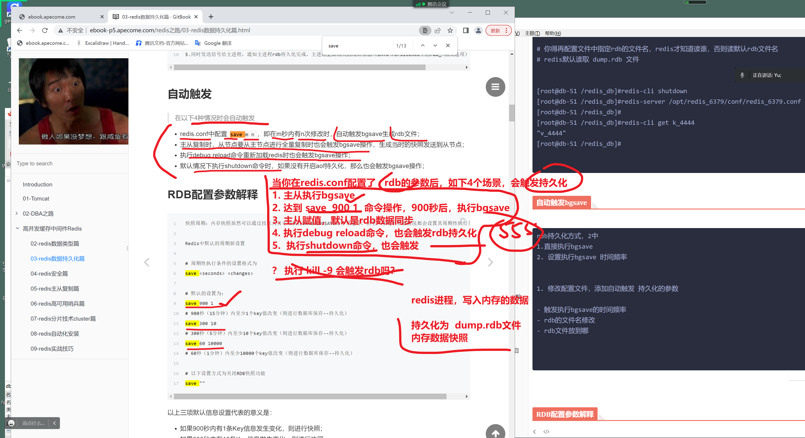
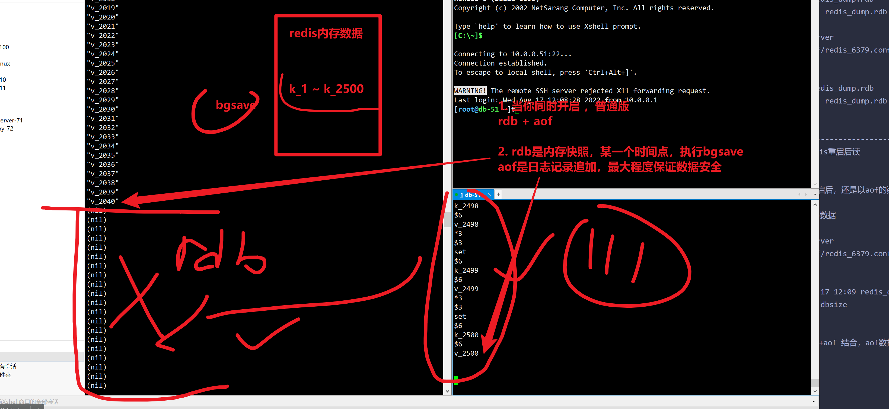

```### 此资源由 58学课资源站 收集整理 ###
	想要获取完整课件资料 请访问：58xueke.com
	百万资源 畅享学习

```
# 03-redis数据持久化篇

> 从两个点，我们来了解下Redis持久化

## 为什么需要持久化


## RDB 持久化

> RDB 就是 Redis DataBase 的缩写，中文名为快照/内存快照
>
> RDB持久化是把当前进程数据生成快照保存到磁盘上的过程
>
> 由于是某一时刻的快照，那么快照中的值要早于或者等于内存中的值。

```
优点：数据压缩、恢复速度快
缺点：非实时备份，可能导致数据丢失
```

## AOF 持久化


# 1.RDB持久化实战


## 触发方式

> 触发rdb持久化的方式有2种，分别是**手动触发**和**自动触发**。
>
> 本质上，都是执行了rdb数据快照命令，save命令，bgsave命令。区别再。

## 手动触发


### bgsave流程图如下所示


```
具体流程如下：
1.redis客户端执行bgsave命令或者自动触发bgsave命令； 

2.主进程判断当前是否已经存在正在执行的子进程，如果存在，那么主进程直接返回； 

3.如果不存在正在执行的子进程，那么就fork一个新的子进程进行持久化数据，fork过程是阻塞的，fork操作完成后主进程即可执行其他操作；

4.子进程先将数据写入到临时的rdb文件中，待快照数据写入完成后再原子替换旧的rdb文件；

5.同时发送信号给主进程，通知主进程rdb持久化完成，主进程更新相关的统计信息（info Persitence下的rdb_*相关选项）。
```


## 手工玩一玩rdb持久化，看懂111

bgsave命令，默认导出为 dump.rdb


里面的细节知识，要记住，做好笔记。

休息会。

那么，这些细节点，就得记录到配置文件里，待会来看，。

10. 35


```
redis配置文件，中定义了数据目录
[root@db-51 ~]#cat /opt/redis_6379/conf/redis_6379.conf 
daemonize yes
bind 127.0.0.1 10.0.0.51
port 6379
dir /redis_db/
pidfile /opt/redis_6379/pid/redis_6379.pid
logfile /opt/redis_6379/logs/redis_6379.log


直接执行bgsave，写入rdb数据， 到dir参数制定的目录

[root@db-51 /tmp]#redis-cli bgsave
Background saving started
[root@db-51 /tmp]#
[root@db-51 /tmp]#du -h /redis_db/dump.rdb 
72K	/redis_db/dump.rdb


# 恢复的逻辑，是，redis的数据目录下，有持久化文件就行
dir /redis_db/

# 你得再配置文件中指定rdb的文件名，redis才知道读谁，否则读默认rdb文件名
# redis默认读取 dump.rdb 文件


[root@db-51 /redis_db]#redis-cli shutdown
[root@db-51 /redis_db]#redis-server /opt/redis_6379/conf/redis_6379.conf 
[root@db-51 /redis_db]#
[root@db-51 /redis_db]#redis-cli get k_4444
"v_4444"
[root@db-51 /redis_db]#


```


## 自动触发bgsave




```
rdb持久化方式，2中
1.直接执行bgsave
2. 设置执行bgsave 时间频率


1. 修改配置文件，添加自动触发 持久化的参数

- 触发执行bgsave的时间频率
- rdb的文件名修改
- rdb文件放到哪


```


## RDB配置参数解释

目前主流玩法，主要是rdb+aof混合持久化

数据写入操作，以日志形式写入aof，结合rdb持久化，双重备份


```
先生成配置文件，然后测rdb、持久化的5个机制

daemonize yes
bind 127.0.0.1 10.0.0.51
port 6379
pidfile /opt/redis_6379/pid/redis_6379.pid
logfile /opt/redis_6379/logs/redis_6379.log

save 900 1
save 300 10
save 60 1000
dbfilename redis_dump.rdb
dir /redis_db/
stop-writes-on-bgsave-error yes
rdbcompression yes
rdbchecksum yes
```


## 操作部分（RDB）⭐️

```
1. 测试5个触发rdb的机制

- 主从执行 bgsave，save 可以触发rdb
- redis-cli shutdown  退出时，redis进行持久化。
这俩看懂 22222

- 测注意，pkill等，不会持久化数据，因此是危险命令
内存 60
数据快照是旧的，1~50  
# 看懂友好重启，触发rdb，保证数据安全，以及pkil等命令不安全，刷111


- 测试触发rdb时间频率


2. 看看rdb数据恢复过程

```


### 测试RDB数据恢复⭐️

```
1. 只要把redis数据文件，放入dir目录下即可

[root@db-51 /redis_db]## 能看懂，shutdown，是主从触发rdb更新，基于 md5sum 对文件的 唯一值校验，刷111
[root@db-51 /redis_db]#
[root@db-51 /redis_db]#ls
redis_dump.rdb
[root@db-51 /redis_db]#redis-server /opt/redis_6379/conf/redis_6379.conf 
[root@db-51 /redis_db]#redis-cli get k_999
"v_999"
[root@db-51 /redis_db]#


```


## scan扫描key的操作

```
# 一次性列出所有key
# 对一个key较多的redis库，查找某个key

# [root@db-51 /redis_db]#redis-cli --scan --pattern 'k_*'
 [root@db-51 /redis_db]#redis-cli --scan --pattern 'k_2*'


[root@db-51 /www.yuchaoit.cn/redis/data]#redis-cli --scan --pattern '*'

# 或者
redis-cli --raw KEYS '*'


```

## redis的key写入是有序无序的

```
问题记录；。。


```


## RDB面试题问答

所谓面试题，就是看你改工具使用的熟练度，是否经过了长时间的验证，能发现，解决工具使用过程中的各种坑，细节。

```
1. redis.conf 写上save 触发频率， shutdown，pkill，kill，因为这仨都是给redis进程发 15号，正常停止的信号，因此触发持久化
# 111

- 注意，仅仅是15号信号的正常退出，-9 强制杀死，是不会持久化的


2. 反之，不写save，shutdown，pkill，kill 不会触发rdb

# 完全看懂222


```


## RDB总结优缺点


因此rdb的诸多问题，AOF就诞生了


# 2.AOF持久化实战


## 为什么采用写后日志

Redis要求高性能，采用写日志有两方面好处：


## 如何实现AOF

AOF日志记录Redis的每个写命令，步骤分为：命令追加（append）、文件写入（write）和文件同步（sync）。

```
AOF持久化方案的打开

1. 修改配置文件，添加AOF的参数，以及持久化的规则


```


### 三种写回策略的优缺点

上面的三种写回策略体现了一个重要原则：**trade-off**，取舍，指在性能和可靠性保证之间做取舍。

关于AOF的同步策略是涉及到操作系统的 write 函数和 fsync 函数的，在《Redis设计与实现》中是这样说明的：

redis运转了N多年的技术，优化N次，数据的安全性，没什么大问题，

当你再遇见海量数据，以及对数据严谨性特别高的场景，如 xx银行，

千万级别的rediskey数量，以及银行业务

琢磨redis高级源码，每一个参数，都是什么作业，再去维护业务。

由浅入深的过程，。，。。


```
为了提高文件写入效率，在现代操作系统中，当用户调用write函数，将一些数据写入文件时，操作系统通常会将数据暂存到一个内存缓冲区里，当缓冲区的空间被填满或超过了指定时限后，才真正将缓冲区的数据写入到磁盘里。

这样的操作虽然提高了效率，但也为数据写入带来了安全问题：如果计算机停机，内存缓冲区中的数据会丢失。为此，系统提供了fsync、fdatasync同步函数，可以强制操作系统立刻将缓冲区中的数据写入到硬盘里，从而确保写入数据的安全性。
```


## AOF图解原理


## --0-----redis持久化方案-----如何回答图解


```
1. 目前redis5.x系列，是主流的，推荐，rdb混合aof持久化，需要额外参数支持

2. 以前玩法是 rdb+aof都采用，混合持久化
数据持久化2份


```


### 玩法1，单纯的结合rdb+aof

```
1. 配置文件，rdb配置，aof配置都写上
daemonize yes
bind 127.0.0.1 10.0.0.51
port 6379
pidfile /opt/redis_6379/pid/redis_6379.pid
logfile /opt/redis_6379/logs/redis_6379.log

dir /redis_db/


# 这一块是aof开启的参数
appendonly yes # 开启aof功能
appendfilename "redis_appendonly.aof"  # 制定aof文件名,，以dir参数目录
appendfsync everysec # 每1秒，buffer数据写入aof磁盘文件


# rdb
dbfilename redis_dump.rdb
# 60秒执行一次 bgsave
save 60  2000

# 删除注释后，写入redis.conf


2. 启动进程
[root@db-51 /redis_db]#!redis-server
redis-server /opt/redis_6379/conf/redis_6379.conf 

3. 查看持久化的结果
# aof文件，会在redis启动时，就自动生成开始记录
# rdb文件，什么时候生成

[root@db-51 /redis_db]#ls
redis_appendonly.aof

4.测试2个持久化都触发
[root@db-51 /redis_db]#
[root@db-51 /redis_db]#ls
redis_appendonly.aof  redis_dump.rdb
[root@db-51 /redis_db]## 这就是2者结合的玩法，看懂111
[root@db-51 /redis_db]## 查看数据恢复，是否正常
[root@db-51 /redis_db]#


5. 测试rdb+aof的数据恢复
[root@db-51 /redis_db]#redis-cli dbsize
(integer) 2500

重启redis验证结果k_1  k_2500
redis恢复逻辑是去 dir制定的目录下，找备份文件


- 先测试 rdb备份是否完整，
[root@db-51 /redis_db]#md5sum  redis_dump.rdb 
2d3df97572534f6f9d4d7834f0b75c67  redis_dump.rdb
[root@db-51 /redis_db]#kill -9 56327
[root@db-51 /redis_db]#
[root@db-51 /redis_db]#
[root@db-51 /redis_db]#md5sum  redis_dump.rdb 
2d3df97572534f6f9d4d7834f0b75c67  redis_dump.rdb

[root@db-51 /redis_db]#!redis-server
redis-server /opt/redis_6379/conf/redis_6379.conf 
[root@db-51 /redis_db]#
[root@db-51 /redis_db]#
[root@db-51 /redis_db]#md5sum  redis_dump.rdb 
2d3df97572534f6f9d4d7834f0b75c67  redis_dump.rdb
[root@db-51 /redis_db]#

---------------------------------------------------
踩坑记录，在rdb和aof双重结合下，redis重启后读

3. 发现
redis再同时开启 rdb +aof的时候，重启后，还是以aof的数据文件为主

解决办法是，得关闭aof，让redis读rdb数据

[root@db-51 /redis_db]#!redis-server
redis-server /opt/redis_6379/conf/redis_6379.conf 
[root@db-51 /redis_db]#ll
total 28
-rw-r--r-- 1 root root 28484 Aug 17 12:09 redis_dump.rdb
[root@db-51 /redis_db]#redis-cli dbsize
(integer) 2040
[root@db-51 /redis_db]#
[root@db-51 /redis_db]## 看懂rdb +aof 结合，aof数据丢失，修改配置文件，用rdb恢复部分数 据的玩法，1111
[root@db-51 /redis_db]#
[root@db-51 /redis_db]#


===================================================================================================

- 再测aof是否完整
# 日常，用shell，对redis数据做好rsync备份。
# 下一步的思路，aof数据恢复尝试
# 恢复了aof配置文件+数据，查看重启redis，2500个数据，会如何
[root@db-51 /redis_db]#cat /opt/redis_6379/conf/redis_6379.conf 
daemonize yes
bind 127.0.0.1 10.0.0.51
port 6379
pidfile /opt/redis_6379/pid/redis_6379.pid
logfile /opt/redis_6379/logs/redis_6379.log

dir /redis_db/


appendonly yes
appendfilename "redis_appendonly.aof"
appendfsync everysec


dbfilename redis_dump.rdb
save 60  2000

[root@db-51 /redis_db]#ls
redis_appendonly.aof  redis_dump.rdb
[root@db-51 /redis_db]#


- 在测aof和rdb的先后关系
# redis优先读aof

[root@db-51 /redis_db]#!redis-server
redis-server /opt/redis_6379/conf/redis_6379.conf 
[root@db-51 /redis_db]#
[root@db-51 /redis_db]#redis-cli dbsize
(integer) 2500
[root@db-51 /redis_db]#for i in {1..2500};do redis-cli get k_$i;done 


# 到这，aof+rdb 基本混合持久化玩法，踩坑，细节，看懂111

# 下一步，查看混合持久化玩法即可 12. 40继续


```




## 开启AOF功能

默认情况下，Redis是没有开启AOF的，可以通过配置redis.conf文件来开启AOF持久化，关于AOF的配置如下：

```


```


## 关闭RDB，开启AOF，查看实验


## AOF数据持久化效果查看


# redis5.0之后的混合持久化方案


## -----AOF日志重写机制----

> 混合持久化走的就是日志重写的一个步骤。
>
> 主要底层通过bgrewriteaof重写日志。
>
> 以及通过aof-use-rdb-preamble yes 参数开启混合持久化功能

```
# 测试redis日志重写
#试试shell多进程

# i=1
# i=2
for (( i=0;i<100000;i++))
do
  {
    redis-cli set k_$i v_$i
  } & done

# 查看aof文件大小
[root@db-51 /redis_db]#du -h *
2.1M	redis_appendonly.aof
632K	redis_dump.rdb


#删除些数据，查看文件大小
[root@db-51 /redis_db]#for i in {30000..39203};do redis-cli del k_$i;done


#单独的日志重写（达到瘦身效果）再看文件大小，aof，rdb混合持久化的底层逻辑就是日志重写

[root@db-51 /redis_db]#redis-cli 
127.0.0.1:6379> 
127.0.0.1:6379> BGREWRITEAOF 
Background append only file rewriting started

# 


```


> 这一块作为了解，以后若是的确需要考虑redis日志的重写，再来看这一块的资料。

AOF会记录每个写命令到AOF文件，随着时间越来越长，AOF文件会变得越来越大。

如果不加以控制，会对Redis服务器，甚至对操作系统造成影响，而且AOF文件越大，数据恢复也越慢。

为了解决AOF文件体积膨胀的问题，Redis提供AOF文件重写机制来对AOF文件进行“瘦身”。


# ====实践AOF+RDB混合持久化的方案======

https://redis.io/docs/manual/persistence/

```
1. 修改配置文件，混合持久化参数，写入redis.conf 永久生效

daemonize yes
bind 127.0.0.1 10.0.0.51
port 6379
pidfile /opt/redis_6379/pid/redis_6379.pid
logfile /opt/redis_6379/logs/redis_6379.log

dir /redis_db/


appendonly yes
appendfilename "redis_appendonly.aof"
appendfsync everysec


dbfilename redis_dump.rdb
save 60  2000


aof-use-rdb-preamble yes
                            

2. 查看效果
基于config get 查看配置

[root@db-51 /redis_db]#
[root@db-51 /redis_db]#redis-server /opt/redis_6379/conf/redis_6379.conf  
[root@db-51 /redis_db]#
[root@db-51 /redis_db]#
[root@db-51 /redis_db]#redis-cli 
127.0.0.1:6379> CONFIG GET aof-use-rdb-preamble
1) "aof-use-rdb-preamble"
2) "yes"
127.0.0.1:6379> 


3.测试，混合效果，的备份，和恢复，以及日志瘦身结果查看

for (( i=0;i<30000;i++))
do
  {
    redis-cli set k_$i v_$i
  } & done
  
  

```


# redis只能手工触发


### 测试AOF重写机制


### 执行bgrewriteaof命令


### 有两个配置项控制AOF重写的触发


### 手工测试AOF日志瘦身（重写）


# 3.AOF混合RDB持久化


## 开启混合持久化


## 检查混合持久化


### 1）通过命令行开启


### 2）通过修改 Redis 配置文件开启


## 测试混合持久化


## 混合持久化数据恢复

混合持久化的数据恢复和 AOF 持久化过程是一样的，只需要把 appendonly.aof 放到 Redis 的根目录

在 Redis 启动时，只要开启了 AOF 持久化，Redis 就会自动加载并恢复数据。

Redis 启动信息如下图所示：


## 混合持久化的加载流程


## 优缺点


## 持久化最佳实践


```
...

```


