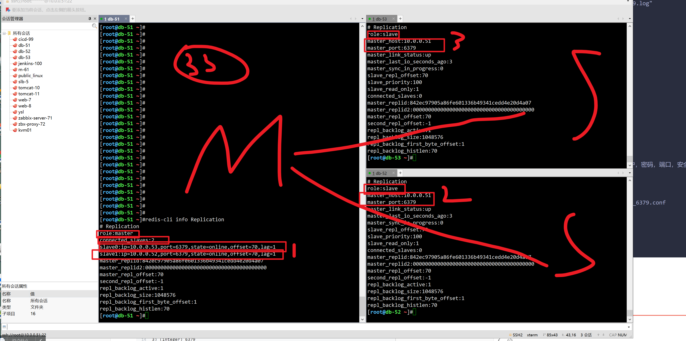
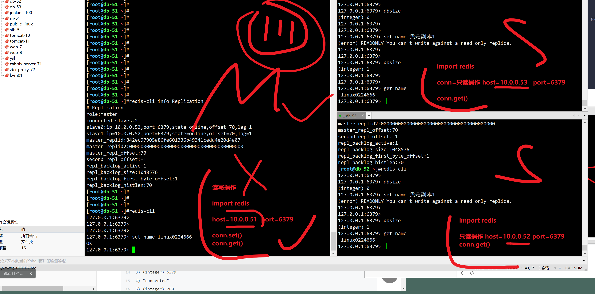
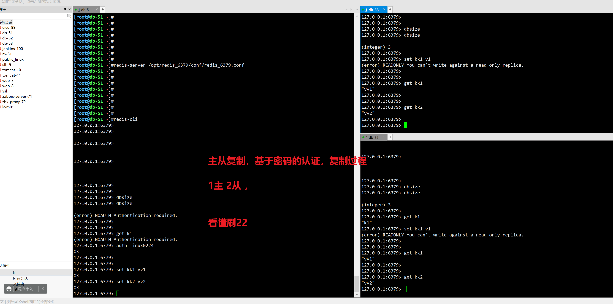
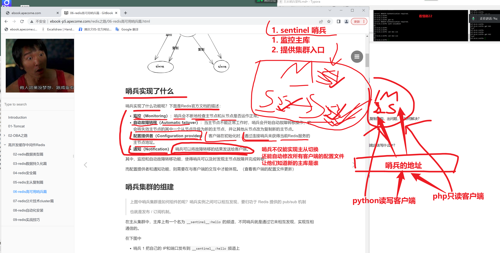
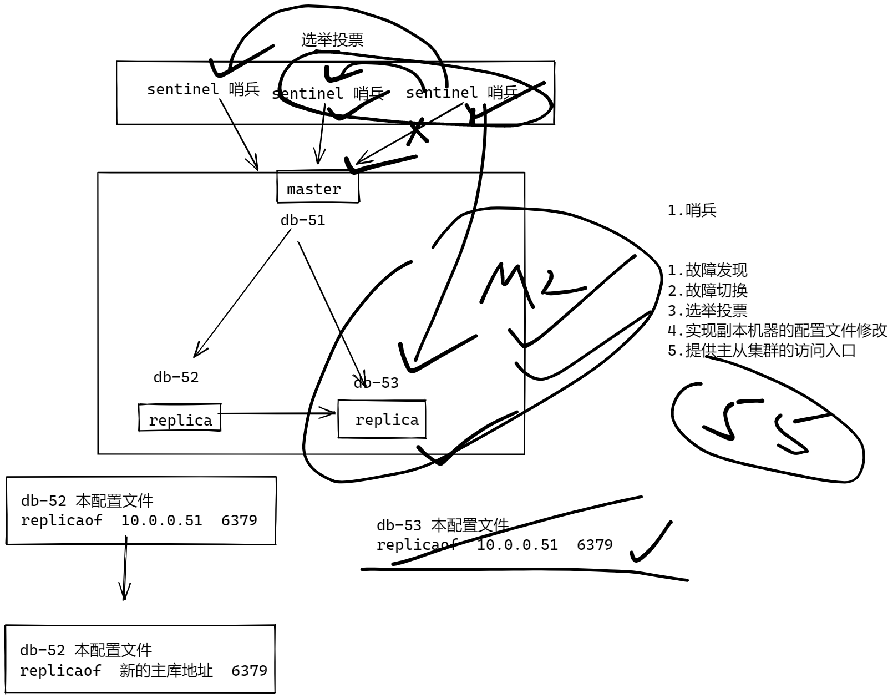

```### 此资源由 58学课资源站 收集整理 ###
	想要获取完整课件资料 请访问：58xueke.com
	百万资源 畅享学习

```
# 05-redis主从复制篇

我们知道要避免单点故障，即保证高可用，便需要冗余（副本）方式提供集群服务。

而Redis 提供了主从库模式，以保证数据副本的一致，主从库之间采用的是读写分离的方式。

# 主从复制概述


## 配置主从关系

```
db-51
把51机器的，redis命令，配置文件，都发过去

db-52
db-53


# 1. 准备3个机器的redis-serve运行环境
确保3个机器

# 2. 区别开3个机器的配置参数 redis.conf

配置redis主从关系，2个方案
核心命令如下，建立主从关系，就一个命令而已
听懂222


1. 先配置好3个独立的 redis实例，然后用命令，主动建立主从关系
redis.3版本，slaveof  主库的ip  主库的端口， 5.0之前得旧版本

redis 5.x 之后， slave改成了副本的概念，5.x之后的版本，用这个参数
replicaof <masterip> <masterport>


# 3.做法如下，直接再配置文件中，定义好主从关系
因为命令行里面，临时建立关系，是短暂的，重启丢失


# 4,开始部署主从关系
pkill redis

检查命令
which redis-server
/usr/local/bin/redis-server


检查配置
=================================================
db-51作为主库，配置如下
只需要提供基本参数，以及主库无需写入复制的参数
daemonize yes
bind 0.0.0.0
port 6379
pidfile "/opt/redis_6379/pid/redis_6379.pid"
logfile "/opt/redis_6379/logs/redis_6379.log"
save 900 1
save 300 10
save 60 10000
dbfilename "redis_dump.rdb"
appendonly yes
appendfilename "appendonly.aof"
dir "/redis/data"
appendfsync everysec

aof-use-rdb-preamble yes

========================================================
db-52机器配置如下，db-53，一模一样


daemonize yes
bind 0.0.0.0
port 6379
pidfile "/opt/redis_6379/pid/redis_6379.pid"
logfile "/opt/redis_6379/logs/redis_6379.log"
save 900 1
save 300 10
save 60 10000
dbfilename "redis_dump.rdb"
appendonly yes
appendfilename "appendonly.aof"
dir "/redis/data"
appendfsync everysec

aof-use-rdb-preamble yes
replicaof 10.0.0.51 6379


3.启动所有实例，查看复制关系即可

- 公司部署，遵循降低安全性的考虑，redis用户，密码，端口，安全模式，禁用config
- 测试学习
mkdir -p /redis/data

redis-server /opt/redis_6379/conf/redis_6379.conf 

redis-cli info Replication

4.验证读写分离的关系


```








## 主库设置密码的，主从关系建立

```

# 主库加入密码设置
daemonize yes
bind 0.0.0.0
port 6379
pidfile "/opt/redis_6379/pid/redis_6379.pid"
logfile "/opt/redis_6379/logs/redis_6379.log"
save 900 1
save 300 10
save 60 10000
dbfilename "redis_dump.rdb"
appendonly yes
appendfilename "appendonly.aof"
dir "/redis/data"
appendfsync everysec

aof-use-rdb-preamble yes

requirepass linux0224


# 从库得也加密码设置，否则无法建立复制关系，db-52，db-53一样配置

daemonize yes
bind 0.0.0.0
port 6379
pidfile "/opt/redis_6379/pid/redis_6379.pid"
logfile "/opt/redis_6379/logs/redis_6379.log"
save 900 1
save 300 10
save 60 10000
dbfilename "redis_dump.rdb"
appendonly yes
appendfilename "appendonly.aof"
dir "/redis/data"
appendfsync everysec

aof-use-rdb-preamble yes

replicaof 10.0.0.51 6379

masterauth linux0224

```


## 永久配置主从关系

写入配置文件


## 检查复制关系

### slave


### master


## 试试主从关系

```
# master
# slave
```


## 取消slave身份

```
# 不当副本，自己要读写数据
replicaof   on one


```


## redis主从细节问答


## 主库设置了密码，如何主从建立




12: 45


# 继续问题


思考，当主从复制架构，出问题，该如何解决？

主库挂了？哨兵帮你自动选择新的主库

从库挂了？ 无所谓，重新加入主从集群，主库会发送自己的rdb数据文件，给从库作为数据导入

后续就已经建立主从关系，继续数据写入，同步


以及客户端到底应该写什么IP？




# 哨兵架构




## 已知哨兵集群的作用

集群部署，至少需要3个哨兵


发布订阅模式


## 部署操作，基于哨兵的高可用集群部署


### 三个redis节点部署，提供主从复制关系

```
[root@db-51 /redis/data]#
[root@db-51 /redis/data]#pkill -9 redis
[root@db-51 /redis/data]#
[root@db-51 /redis/data]#!redis-server
redis-server /opt/redis_6379/conf/redis_6379.conf 
[root@db-51 /redis/data]#


```


### 部署三个哨兵

配置文件如下

三个独立的进程


```
cat > /opt/redis_26379/conf/redis_26379.conf <<EOF
bind 0.0.0.0
port 26379
daemonize yes
logfile /opt/redis_26379/logs/redis_26379.log
dir /data/redis_26379
# 监控主节点，地址信息，以及至少需要2个哨兵同意下线
sentinel monitor linux0224_redis 10.0.0.51 6379 2
# 超过30s没回复认定master下线
sentinel down-after-milliseconds linux0224_redis 30000
# 当Sentinel节点集合对主节点故障判定达成一致时，Sentinel领导者节点会做故障转移操作，选出新的主节点，
原来的从节点会向新的主节点发起复制操作，限制每次向新的主节点发起复制操作的从节点个数为1
sentinel parallel-syncs linux0224_redis 1
# 故障转移超时时间为180000毫秒
sentinel failover-timeout linux0224_redis 180000
EOF

# 授权
useradd redis -M -s /sbin/login
chown -R redis.redis /data/redis*
chown -R redis.redis /opt/redis*


# systemctl服务脚本
cat >/usr/lib/systemd/system/redis-sentinel.service <<EOF
[Unit]
Description=Redis service by www.yuchaoit.cn
After=network.target
After=network-online.target
Wants=network-online.target

[Service]
ExecStart=/usr/local/bin/redis-sentinel /opt/redis_26379/conf/redis_26379.conf --supervised systemd
ExecStop=/usr/local/bin/redis-cli -h $(ifconfig ens33|awk 'NR==2{print $2}') -p 26379 shutdown
Type=notify
User=redis
Group=redis
RuntimeDirectory=redis
RuntimeDirectoryMode=0755

[Install]
WantedBy=multi-user.target
EOF

# 重启
systemctl daemon-reload
systemctl restart redis-sentinel

# 检查
netstat -tunlp|grep 26379

redis-cli -h $(ifconfig ens33|awk 'NR==2{print $2}') -p 26379

# 查看哨兵信息
info sentinel


```


# 演示哨兵作用查看

```
1.哨兵
确认，所有的哨兵再工作中，完成实验


1.故障发现
2.故障切换
3.选举投票
4.实现副本机器的配置文件修改
5.提供主从集群的访问入口

证明一个高可用的redis集群


1.检查 主从哨兵集群，所有节点的状态
先检查redis实例
[root@db-51 /redis/data]#redis-cli -a linux0224 info replication
Warning: Using a password with '-a' or '-u' option on the command line interface may not be safe.
# Replication
role:master
connected_slaves:2
slave0:ip=10.0.0.52,port=6379,state=online,offset=14,lag=0
slave1:ip=10.0.0.53,port=6379,state=online,offset=14,lag=0
master_replid:1a6b7f807817fba49a2ddcbd5b3f17ec5137f232
master_replid2:0000000000000000000000000000000000000000
master_repl_offset:14
second_repl_offset:-1
repl_backlog_active:1
repl_backlog_size:1048576
repl_backlog_first_byte_offset:1
repl_backlog_histlen:14


2.检查哨兵的状态
sentinel get-master-addr-by-name linux0224_redis
127.0.0.1:26379> sentinel get-master-addr-by-name linux0224_redis
1) "10.0.0.51"
2) "6379"

sentinel master linux0224_redis
sentinel slaves linux0224_redis

sentinel ckquorum  linux0224_redis # 查看其他哨兵的状态

基于redis实例，查看哨兵状态
info sentinel

# 踩坑记录，重建redis运行环境


 

```


