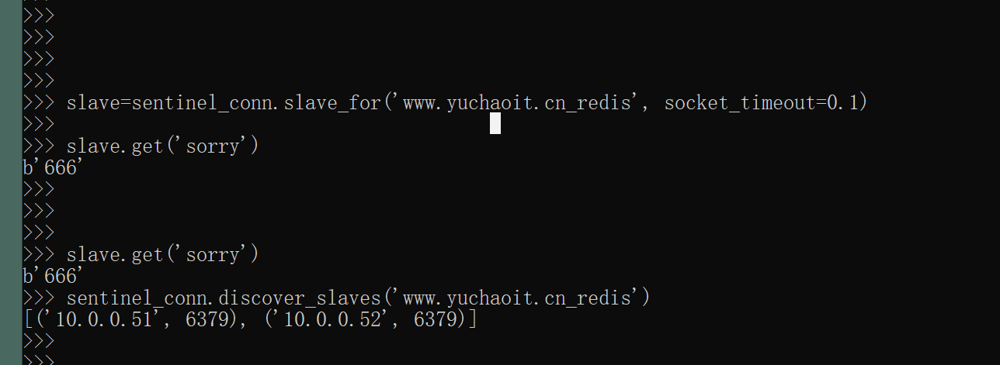

```### 此资源由 58学课资源站 收集整理 ###
	想要获取完整课件资料 请访问：58xueke.com
	百万资源 畅享学习

```


# 部署流程笔记


## redis主从环境部署

### 所有机器操作

```
mkdir -p /opt/redis_6379/{conf,logs,pid}
```


### db-51

```
cat >/opt/redis_6379/conf/redis_6379.conf <<'EOF'
daemonize yes
bind 127.0.0.1 10.0.0.51
port 6379
pidfile /opt/redis_6379/pid/redis_6379.pid
logfile /opt/redis_6379/logs/redis_6379.log
save 900 1
save 300 10
save 60 10000
dbfilename www.yuchaoit.cn_redis_dump.rdb
appendonly yes
appendfilename "www.yuchaoit.cn_appendonly.aof"
dir /www.yuchaoit.cn/redis/data/
appendfsync everysec
appendonly yes
appendfilename "www.yuchaoit.cn_appendonly.aof"
aof-use-rdb-preamble yes 
EOF


mkdir -p /opt/redis_6379/pid/
redis-server /opt/redis_6379/conf/redis_6379.conf 
```


### db-52


```
cat >/opt/redis_6379/conf/redis_6379.conf <<EOF
daemonize yes
bind 127.0.0.1 $(ifconfig ens33|awk 'NR==2{print $2}')
port 6379
pidfile /opt/redis_6379/pid/redis_6379.pid
logfile /opt/redis_6379/logs/redis_6379.log
save 900 1
save 300 10
save 60 10000
dbfilename www.yuchaoit.cn_redis_dump.rdb
appendonly yes
appendfilename "www.yuchaoit.cn_appendonly.aof"
dir /www.yuchaoit.cn/redis/data/
appendfsync everysec
appendonly yes
appendfilename "www.yuchaoit.cn_appendonly.aof"
aof-use-rdb-preamble yes 
replicaof 10.0.0.51 6379
EOF
```


### db-53

```
cat >/opt/redis_6379/conf/redis_6379.conf <<EOF
daemonize yes
bind 127.0.0.1 $(ifconfig ens33|awk 'NR==2{print $2}')
port 6379
pidfile /opt/redis_6379/pid/redis_6379.pid
logfile /opt/redis_6379/logs/redis_6379.log
save 900 1
save 300 10
save 60 10000
dbfilename www.yuchaoit.cn_redis_dump.rdb
appendonly yes
appendfilename "www.yuchaoit.cn_appendonly.aof"
dir /www.yuchaoit.cn/redis/data/
appendfsync everysec
appendonly yes
appendfilename "www.yuchaoit.cn_appendonly.aof"
aof-use-rdb-preamble yes 
replicaof 10.0.0.51 6379
EOF
```


### 分别启动52,53查看复制关系

```
[root@db-51 ~]#redis-cli info replication
# Replication
role:master
connected_slaves:2
slave0:ip=10.0.0.52,port=6379,state=online,offset=179,lag=0
slave1:ip=10.0.0.53,port=6379,state=online,offset=179,lag=0
master_replid:d89b5375464d45b2734fd62d75cc30a55e3685ac
master_replid2:0000000000000000000000000000000000000000
master_repl_offset:179
second_repl_offset:-1
repl_backlog_active:1
repl_backlog_size:1048576
repl_backlog_first_byte_offset:1
repl_backlog_histlen:179
[root@db-51 ~]#


```


## redis哨兵部署

```
mkdir -p /data/redis_26379

mkdir -p /opt/redis_26379/{conf,pid,logs}

# 写入3个机器的哨兵配置文件
cat > /opt/redis_26379/conf/redis_26379.conf <<EOF
bind $(ifconfig ens33|awk 'NR==2{print $2}')
port 26379
daemonize yes
logfile /opt/redis_26379/logs/redis_26379.log
dir /data/redis_26379
sentinel monitor www.yuchaoit.cn_redis 10.0.0.51 6379 2
sentinel down-after-milliseconds www.yuchaoit.cn_redis 30000
sentinel parallel-syncs www.yuchaoit.cn_redis 1
sentinel failover-timeout www.yuchaoit.cn_redis 180000
EOF

# 授权
useradd redis -M -s /sbin/login
chown -R redis.redis /data/redis*
chown -R redis.redis /opt/redis*

# systemctl服务脚本
cat >/usr/lib/systemd/system/redis-sentinel.service <<EOF
[Unit]
Description=Redis service by www.yuchaoit.cn
After=network.target
After=network-online.target
Wants=network-online.target

[Service]
ExecStart=/usr/local/bin/redis-sentinel /opt/redis_26379/conf/redis_26379.conf --supervised systemd
ExecStop=/usr/local/bin/redis-cli -h $(ifconfig ens33|awk 'NR==2{print $2}') -p 26379 shutdown
Type=notify
User=redis
Group=redis
RuntimeDirectory=redis
RuntimeDirectoryMode=0755

[Install]
WantedBy=multi-user.target
EOF

# 重启
systemctl daemon-reload
systemctl restart redis-sentinel

# 检查
netstat -tunlp|grep 26379

# 链接哨兵的端口，查询哨兵的信息

redis-cli -h $(ifconfig ens33|awk 'NR==2{print $2}') -p 26379


```


查看哨兵的集群信息

```
[root@db-51 ~]#redis-cli -h 10.0.0.51 -p 26379

[root@db-51 ~]#redis-cli -h 10.0.0.51 -p 26379
10.0.0.51:26379> 
看到有3个哨兵互相链接了

10.0.0.51:26379> info clients
# Clients
connected_clients:3
client_recent_max_input_buffer:2
client_recent_max_output_buffer:0
blocked_clients:0
10.0.0.51:26379> 

10.0.0.51:26379> info sentinel
# Sentinel
sentinel_masters:1
sentinel_tilt:0
sentinel_running_scripts:0
sentinel_scripts_queue_length:0
sentinel_simulate_failure_flags:0
master0:name=www.yuchaoit.cn_redis,status=ok,address=10.0.0.51:6379,slaves=2,sentinels=3
10.0.0.51:26379> 

看到结果，确保主从集群 1 master  2 slave没问题

3个哨兵节点

检查3个机器的redis配置文件


```


## 故障切换结果

查看故障的命令


```
1.干掉主库，查看如下5个角度


1.故障发现
2.故障切换

[root@db-51 ~]#redis-cli -h 10.0.0.53 info replication
# Replication
role:master
connected_slaves:1
slave0:ip=10.0.0.52,port=6379,state=online,offset=66282,lag=1
master_replid:0cd991c8aea5c0211d45bd9a8402443cf44d17c4
master_replid2:d89b5375464d45b2734fd62d75cc30a55e3685ac
master_repl_offset:66428
second_repl_offset:57298
repl_backlog_active:1
repl_backlog_size:1048576
repl_backlog_first_byte_offset:15
repl_backlog_histlen:66414
[root@db-51 ~]#


3.选举投票
# 记录了 以往的 主从关系
#旧的主从 db-51   >   52,53

#  新的主从 52 > 53

# 哨兵还能自动，将51，加入新的主从集群，修改它的篇配置文件


 sentinel master www.yuchaoit.cn_redis
  sentinel slaves  www.yuchaoit.cn_redis
 sentinel ckquorum   www.yuchaoit.cn_redis
 
4.实现副本机器的配置文件修改


5.提供主从集群的访问入口

入口应该是吗，3个哨兵之一即可
3个哨兵，自动去维护 主从redis的关系


证明一个高可用的redis集群


```





