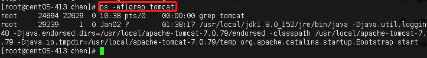
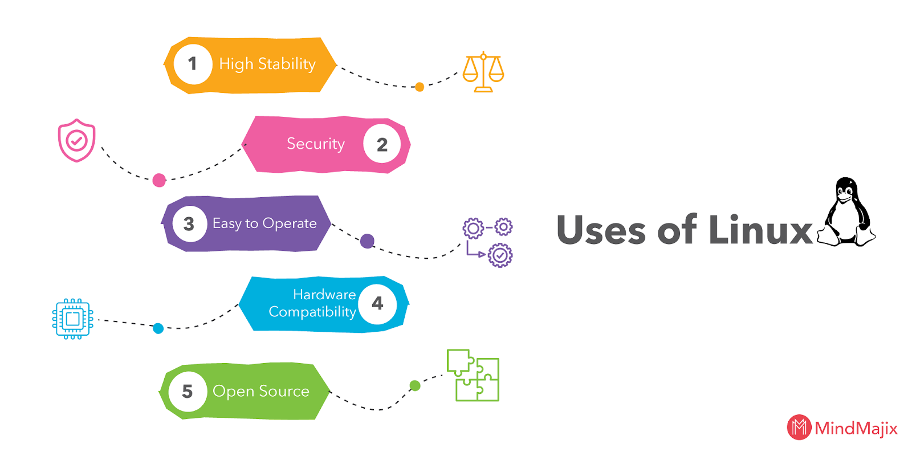

```### 此资源由 58学课资源站 收集整理 ###
	想要获取完整课件资料 请访问：58xueke.com
	百万资源 畅享学习

```
## Linux初学者面试问题

### Linux基本面试问题

### 1.什么是Linux？

**回答：** Linux是基于Linux内核的操作系统。它是一个开源操作系统，可以在不同的硬件平台上运行。它为用户提供了免费的低成本操作系统。这是一个用户友好的环境，他们可以在其中轻松修改和创建源代码的变体。

### 2.谁发明了Linux？解释Linux的历史？

**回答：** Linus Torvalds创建了Linux。莱纳斯·托瓦尔兹（Linus Torvalds）于1991年在芬兰赫尔辛基大学（University of Helsinki）求学。他开始自行编写代码以免费获得Unix的学术版本。后来，它作为Linux Kernel变得流行。

### 3. Linux和Unix有什么区别？

**回答：** Linux与Unix

| **Linux**                                        | **Unix系统**                         |
| ------------------------------------------------ | ------------------------------------ |
| 提供付费和免费分发。                             | 不同级别的Unix使用不同的付费结构。   |
| Linux主要使用带有可选命令行界面的GUI             | Unix使用命令行界面                   |
| Linux OS是便携式的，可以在不同的硬盘中执行       | Unix OS不可移植。                    |
| Linux由全球Linux社区开发。                       | Unix由AT＆T开发人员开发。            |
| Linux是免费的。它是在GNU许可下通过互联网下载的。 | 大多数类似Unix的操作系统不是免费的。 |
| Linux用于家用PC，电话等。                        | Unix用于服务器系统。                 |

和其他一些区别。

**Linux是Unix的克隆版本**。但是，如果考虑可移植操作系统接口（POSIX）标准，则可以将Linux视为UNIX。

- **Linux只是核心**

所有Linux发行版都包括GUI系统，GNU实用程序，安装和管理工具，GNU c / c ++编译器，编辑器（vi）以及各种应用程序，例如OpenOffice，Firefox。

UNIX操作系统被认为是完整的OS，因为一切都来自一个供应商。

- **安全与防火墙**

Linux随附了基于Netfilter和IPTables的开源防火墙工具，可保护您的服务器和台式机免受黑客和黑客的攻击。UNIX操作系统带有自己的防火墙产品。 

- **备份与恢复**

UNIX和Linux带有自己的一套工具，用于将数据备份到磁带和其他备份介质。但是，Linux和UNIX共享一些通用工具，例如tar，转储/还原和cpio等。

### 4. Linux操作系统的核心是什么？

**回答：**内核是Linux操作系统的核心。

### 5.什么是Linux内核？

**回答：**内核是操作系统的心脏。它充当软件和硬件之间的桥梁。如果软件请求硬件，则内核将在软件和硬件之间传递数据。例如，如果您想播放一首歌曲，则应启动默认播放器，它会请求内核播放一首歌曲，现在，内核将与硬件联系以寻求许可或寻求硬件组件，就像您插入任何耳机一样。装置。大多数Android手机使用Linux内核。 

是的，内核可以编辑，因为它是根据通用公共许可证发行的。

### 6.什么是BASH？

**回答：** Bash是Brian Fox为GNU项目编写的Unix shell和命令处理器。它是免费软件，可以代替Bourne Shell。这是一个解释后的未编译过程，也可以在终端窗口中运行。这使用户可以编写命令并引起动作。Bash能够从Shell脚本读取命令。

### 7.什么是LILO？

**回答：** LILO表示Linux Loader是用于Linux操作系统的引导加载程序。大多数Linux操作系统使用LILO将操作系统引导到主内存中以启动操作。

### 8.什么是CLI？

**回答：** CLI表示命令语言解释器。它与计算机程序进行交互，用户在其中以文本行的形式发出命令。它也与计算机终端交互，该界面接受文本行并将其作为命令转换为操作系统。 

### **9.** 开源的优势是什么？

**回答：**  Linux是最早的开源技术之一，许多程序员添加了对用户完全开放的软件，这意味着您可以下载文件并随意更改代码。它为用户提供了多种选择，并提高了安全性。

### 10.开源的缺点是什么？

**回答：** 下面提到的开源操作系统的缺点

1. 使用困难 
2. 相容性问题
3. 责任与保证
4. 隐藏费用

### 11.什么是Shell？

**回答：** Shell是一个计算机程序，充当用户和内核之间的接口。用户可以通过在Shell上编写程序，命令和脚本来与内核进行通信。它接受人类可读的命令，并将其转换为内核可理解的语言。

### 12. Linux中有几种类型的Shell？ 

**回答：**它们是Linux中的五个Shell：

- **C Shell（csh）：**类似于C语法，并提供拼写检查和作业控制。
- **Korn Shell（ksh）：**是一种高级编程语言Shell。
- **Z Shell（Zsh）：**它提供了一些独特的性质，例如观察登录/注销监视，文件名生成，启动文件，结束注释。 
- **Bourne Again Shell（bash）：**这是Linux发行版的默认设置。
- **友好的交互式Shell（Fish）：**它提供基于Web的配置，自动建议等。 

### 13. Linux的基本组件是什么？

**回答：**  Linux的基本组件

1. **内核：**它是Linux的核心组件，它充当软件和硬件之间的接口。 
2. **Shell：**它充当用户和内核之间的接口。
3. **GUI：**  它代表图形用户界面，这是用户与系统交互的另一种方式。但这与图像，按钮，用于交互的文本框不同。
4. **系统实用程序：**这些是允许用户管理计算机的软件功能。
5. **应用程序：**旨在执行一组任务的一组功能。

### 14.发出命令时如何打开命令提示符？

**回答：**通过按CTRL + ALT + T或在菜单搜索栏中提供终端来启动终端。

### 15.什么是交换空间？

**回答：**当物理Ram内存用完时，将使用交换空间。它将Ram非活动页面移动到交换空间。它可以以专用交换分区或交换文件的形式考虑。

### 16.什么是GUI？

**回答：** GUI表示图形用户界面。它是一种人机界面，使用可以通过鼠标操作的窗口，图像，图标和菜单。电子产品中的大多数现代应用程序都通过GUI与用户通信。GUI是使用按钮，菜单，消息框等的图形和文本交互的组合。

### 17.解释Linux中的文件权限类型？

**回答：**每个文件或目录都具有3个权限

他们是 

1. **Read--**它是指只有他们可以读取该文件。
2. **Write--**这是指他们可以写入文件或修改目录的文件。
3. **Execute--**影响用户执行文件或查看目录文件的能力。 

### 18.环境变量是什么？

**回答：**它们是动态值，会影响计算机上程序的过程。它们存在于每个操作系统中，并且它们的类型可能有所不同。可以创建，编辑，保存和删除它们，还可以提供有关系统行为的信息。

### 20.什么是符号链接？ 

**回答：**它将使用其路径重定向到另一个文件。目标文件不包含任何数据。符号链接重定向到文件系统中某个位置的另一个条目。如果删除了目标文件，则将删除指向该文件的链接，但不会删除该文件。

### 21.什么是硬链接？

**回答：**硬链接是Linux上现有文件的另一个名称。我们可以为任何文件创建如此多的硬链接。他们可以为其他硬链接创建链接。

### 22.什么是重定向？

**回答：**重定向可以定义为更改标准输入和输出设备。要使用重定向元字符，您可以重定向文件或程序。 

### 23.什么是守护程序？

**回答：**守护程序是一个后台进程，它接受来自其他计算机的服务请求，大多数操作系统使用其他形式的守护程序。 

### 24.描述根帐户？

**回答：** Root是用户名，默认情况下可以访问所有文件和命令。超级用户可以执行许多操作，但是普通用户不能执行诸如安装软件，更改文件权限等操作。

25.解释虚拟桌面吗？

**回答：**当您面临如何管理桌面上的多个窗口的问题时，虚拟桌面是一种用户界面，虚拟桌面可以作为替代方法。虚拟桌面存储远程服务器，并允许您在干净的状态上使用一个或多个程序。 

26.使用vi编辑器时有哪些不同的模式？

**回答：** vi编辑器中有三种模式。他们是 

- 命令模式/常规模式
- 插入模式/编辑模式。
- 防爆模式/更换模式。 

27.什么是inode和进程ID？

**回答：** inode是赋予每个文件的唯一名称，进程id是赋予每个进程的唯一名称。 

\28. Linux中的进程状态是什么？

**回答：** Linux中的五个过程状态。他们是

1. 新建/就绪：已创建一个新进程并准备运行。
2. 正在运行：正在执行该进程。
3. 阻止/等待：进程正在等待用户输入。 
4. 终止/完成：进程已完成执行或被操作系统终止。 
5. 僵尸：进程已删除，但仍在进程表中存在有关该进程的信息。


29.解释Linux中的流程管理系统调用吗？

**回答：** Linux中的流程管理系统调用：

- **fork（）：**用于创建新进程。
- **exec（）：**执行新进程。
- **wait（）：**等到进程执行。
- **exit（）：**退出进程。

系统调用以获取进程ID：

- **getpid（）：**查找唯一的进程ID。 
- **getppid（）：**查找唯一的父进程ID。 

30.解释Linux中的文件权限组？

**回答：** 每个文件和目录都有三个基于用户的权限组。

**他们是：**

1. **所有者：**所有者只需要访问文件或目录，就不会影响其他用户的操作。
2. **组：**这些权限仅适用于已分配给文件或目录的组。它们不会影响其他用户的操作。
3. **所有用户：**这些权限适用于系统上的所有用户。

31.什么是Linux中的文件系统？

**回答：** Linux文件系统存储和处理数据。没有文件系统，它将无法知道文件的起始位置和文件的结束位置。

32.解释Linux中不同的文件系统类型吗？

 

订阅我们的YouTube频道以获取新的更新。

 

 

**回答：**在Linux中，有许多文件系统：

Ext，Ext2，Ext3，Ext4，JFS，XFS，btrfs，ufs，autofs，devpts，ntfs和交换。

**Linux初学者教程**

### Linux管理员面试问题

### 32.为什么需要LVM？

**回答：** LVM代表大容量管理，它是一种存储管理设备。用户可以创建，调整大小和删除LVM分区。它增加了抽象性，灵活性和控制性。LVM用于将现有存储设备收集到该组中并分配逻辑单元。 

### 33.什么是umask？

**回答：** unmask代表用户文件创建模式。用户创建任何文件时，它具有默认文件权限。因此，取消屏蔽将对新创建的文件指定很少的限制（它控制文件权限）。

| 1个  | `umask [-S] [mask]` |
| ---- | ------------------- |
|      |                     |

### 34.如何为用户永久设置面罩？ 

**回答：**如果调用unmask命令时不带任何参数，则表示它将显示当前掩码。 

要永久设置取消遮罩，我们有两种类型。

**他们是：**

- Ocotal表示。
- 符号表示。

### 35.在Linux中什么是网络绑定？

**回答：** 网络绑定是将两个以上的网络接口组合成一个网络接口的过程。它通过增加网络吞吐量和带宽来提供性能改进和冗余。无需担心一个接口关闭或拔出，因为另一个接口可以工作。绑定界面的行为取决于绑定方法。 

### 36. Linux中的网络绑定有哪些不同的模式？

答： 

- **Mode-0（balance-rr）：**这是默认模式，基于轮询策略。它提供容错和负载平衡功能。它使用轮询方式来传输数据包。
- **模式1（active-backup）：**它基于主动备份策略，只有一个从机将在频带中起作用，而另一个将在其他从机发生故障时起作用。它还提供了容错能力。
- **模式2（balance-xor）：**设置源Mac地址和目标Mac地址之间的异或模式，以提供容错能力。
- **模式3（broadcast）：**它基于广播策略，并在从属接口中传输所有内容。它还提供了容错能力，并且只能用于特定目的。
- **模式4（802.3ad）：**这是一种动态聚合模式，它创建了具有相同速度的聚合组。它使用传输哈希方法选择从站以进行传出流量。
- **模式5（balance-tlb）：**传出流量是根据从站上的当前负载，而传入流量是从站接收的。这称为自适应发送负载平衡模式。 
- **模式6（balance-alb）：**这是一种自适应负载平衡模式。它不需要任何开关支持。 

### 37.如何查看默认路由和路由表？

**回答：**  要显示默认路由和路由表，我们使用以下命令。

| 1个2345 | `$ route-n` `$ nestat-rn` `$ ip` |
| ------- | -------------------------------- |
|         |                                  |

### 38.如何检查Linux服务器中正在侦听哪些端口？

**回答：**我们有两个命令来检查Linux Server中正在侦听哪些端口。以下是两个命令 

| 1个2 | `# netstat --listen``# netstat -l` |
| ---- | ---------------------------------- |
|      |                                    |

### 39.内核模块位于何处？

**回答：** **lib / modules / kernel-version /，**此目录存储有关Linux系统下已编译驱动器的所有信息。使用lsmod命令，我们还可以看到已安装的内核模块。 

### 40.如何在Linux中更改默认运行级别？

**回答：**要更改Linux中的默认运行级别，请使用init命令。 

### 41.如何使用nfs共享目录？

**回答：**  要使用NFS共享目录，请首先编辑配置文件和'/ etc / exports'并添加目录名称' */*'。现在，重新启动NFS服务。

### 42. SMTP，DNS，FTP，DHCP，SSH和Squid使用的默认端口是什么？

**Ans。 详情如下**

| **服务** | **端口**                                      |
| -------- | --------------------------------------------- |
| SMTP     | 25                                            |
| DNS      | 53                                            |
| FTP      | 20(Data Transfer) 21(Connections Established) |
| DHCP     | 68(dhcp client), 67(DHCP server)              |
| SSH      | 22                                            |
| Squid    | 3128                                          |

### 43.如何在Linux中锁定用户帐户？

**回答：**为了安全起见，已完成锁定用户帐户的操作，以便未经授权的用户无法登录。因此，我们有几种方法可以锁定用户帐户。其中一些在下面。 

1. 使用passwd命令锁定或禁用密码。
2. 使用usermod命令或chage命令使用户帐户过期。
3. 使用nologin命令（/ sbin / nologin）更改外壳。

### Linux命令面试问题

44.什么是ls命令及其作用？

**回答：**这是Linux中的基本命令之一。它用于列出文件系统中的所有文件和目录。zom

**句法：** 

```html
<span style =“ color：＃ecf0f1; background-color：＃000000;”> ls [OPTIONS] [FILES] </ span>
 
```

我们可以在不传递参数的情况下使用它，然后它将列出当前工作目录中的所有文件。文件将按字母顺序显示。 

```html
<span style =“ background-color：＃000000; color：＃ecf0f1;”>是</ span>
 
```

要列出特定目录文件，请在语法中使用目录名称，请按照以下语法中的说明进行操作。

ls / etc
我们还可以使用语法传递多个目录名称，但以空格分隔。 

**ls / etc / var / etc / passwd**

 45.在Linux中，tail命令是什么？

**回答：** Tail命令打印给定数据的最后N行，默认情况下它打印10行。 

**句法：** 

**尾部[OPTION] ... [FILE]**

***例：\*** 

**$ cat names.txt**

```html
Tableau <br> SQL Server <br> Linux管理<br>现在，在不提供任何选项或输入的情况下检查语法。
 
```

**$ tail state.txt**

```html
<span style =“ font-family：'courier new'，courier，monospace;”> <span style =“ color：＃222222; font-family：Verdana;”> <span style =“ white-space：pre-wrap ;“> <strong> <em>输出：</ em> </ strong> <br> </ span> </ span> </ span> Tableau <br> sql server <br> linux管理<span style =” font-family：'courier new'，courier，monospace;“> <span style =” color：＃222222; font-family：Verdana;“> <span style =” white-space：pre-wrap;“> <br > </ span> </ span> </ span>
 
```

\46. Linux中的grep命令是什么？

**回答：** grep命令是一个过滤器，用于全局搜索正则表达式。

***句法：\***

**grep [选项]模式[文件]**

\47. Linux中的ps命令是什么？ 

**回答：** ps命令显示系统的当前进程状态。并显示进程ID和其他一些相关数据。 

 

***句法：\*** 

**Ps [选项]**

***输出：\***

| 1个234567 | `[root@rhe17~]``# ps` `PID TTY  TIME CMD` `12330 pts/0 00:00:00 bash` `21621 pts/0 00:00:00 ps` |
| --------- | ------------------------------------------------------------ |
|           |                                                              |

如：ps -ef|grep tomcat （查询tomcat进程）



### 48. Linux中的env命令是什么？

**回答：** env是一个shell命令，用于打印当前环境变量的列表，它可以在另一个环境中运行另一个进程，而无需对当前环境进行任何修改。 

| 1个  | `env [OPTION]... [-] [NAME=VALUE]... [COMMAND [ARG]...]` |
| ---- | -------------------------------------------------------- |
|      |                                                          |

选件

| **标签**                        | **描述**                              |
| ------------------------------- | ------------------------------------- |
| **-i，-ignore****-environment** | 从一个空的环境开始。                  |
| **-0，--null**                  | 输出行以0（空）字节而不是换行符结尾。 |
| **-u，--unset = NAME**          | 从环境中删除变量NAME                  |
| **--help**                      | 显示帮助消息并退出。                  |

### 49.什么是Linux中的top命令？

**回答：**用于显示系统进程的top命令，它显示并更新排序的进程信息。 

### 50. Linux中的netstat命令是什么？

**回答：** netstat命令提供有关网络和路由表，接口静态信息以及有关系统的更多信息。

### 51. 在Linux中，lsof命令是什么？

**回答：** **lsof**表示文件列表，我们可以知道哪个进程打开了哪个文件。

| 1个2 | `#lsof``-` |
| ---- | ---------- |
|      |            |

52.解释chmod命令吗？

**回答：**此命令用于更改文件和目录的权限。这是一个重要的命令，因此，我将对其进行简要说明。因此，总的来说，共有三种权限，即读，写和执行，并由数字表示，如下所示。

1. **4-**读取权限
2. **2-**写入权限
3. **1-**执行权限

**句法：**

| 1个234567 | `$ chmod options permissions file name ` `$ chmod [OPTION]... MODE[,MODE]... FILE...` `$ chmod [OPTION]... OCTAL-MODE FILE...` `$ chmod [OPTION]... --reference=RFILE FILE…` |
| --------- | ------------------------------------------------------------ |
|           |                                                              |

### 53.解释chown命令吗？

**回答：** Chown命令：命令“ chown”代表变更文件的所有者和组。此命令用于更改指定用户或组的一个或多个文件或文件夹的所有权。 

**句法：**

| 1个234 | `$ chown [OPTION]… [OWNER][:[GROUP]] FILE…``                ``Or` ` ``$ chown [OPTION]… –reference=RFILE FILE…` |
| ------ | ------------------------------------------------------------ |
|        |                                                              |

54.在Linux中什么是cp命令？

**回答：** **cp命令：** cp命令用于复制文件和目录。它还用于备份文件或目录。

**句法：**

**$ cp文件名**

### 55.如何在Linux中从系统中删除文件或目录？

**回答：** rm命令：rm命令用于删除命令行上指定的目录或文件。删除任何文件或目录时，请务必小心。

**句法：**

**rm文件名-** 

| **命令**                            | **描述**                             |
| ----------------------------------- | ------------------------------------ |
| rm文件名                            | 删除单个文件。                       |
| rm filename1，filename2，filename 3 | 删除多个文件。                       |
| rm * .pdf                           | 删除当前目录中的所有pdf文件。        |
| rm -i 文件名                        | -i表示在删除文件之前先进行确认       |
| rm -i 文件名                        | 删除文件而不提示                     |
| rm -fv * .txt                       | 删除当前目录中的所有.txt文件而不提示 |

### 56. Linux中的mkdir是什么？

**回答：** mkdir，命令允许用户在Linux中创建目录。用户可以一次创建多个目录，并可以设置目录的权限。

**句法：** 

**mkdir [选项...] [目录...]**

| **选项**                        | **描述**                                                     |
| ------------------------------- | ------------------------------------------------------------ |
| Directory                       | 要创建的目录的名称                                           |
| -m=mode, --mode=mode            | 为创建的目录设置文件模式（权限等）                           |
| -p, --parents                   | 创建父目录                                                   |
| --v，--verbose                  | 详细输出。打印已创建目录的消息。                             |
| --Z= context, --context=context | 如果使用的是SELinux，则此选项将每个创建的目录的安全性上下文设置为context。 |
| --help                          | 显示帮助消息并退出                                           |
| --version                       | 它显示版本信息并退出                                         |

### 57.在Linux中解释rmdir命令？

**回答：** rmdir用于删除命令行上指定的每个目录。 

**句法：** 

| 1个  | `rmdir [-p] [-v | –verbose] [–ignore-fail-on-non-empty] directories` |
| ---- | ------------------------------------------------------------ |
|      |                                                              |

### 58.如何退出vi编辑器？

**回答：**我们可以使用两个命令退出vi编辑器。他们是

- **Wq** ***：*** wq命令保存当前工作并从vi编辑器退出。
- **q！：** q！命令不会保存当前的工作，但是会从vi编辑器中退出。

### 59.如何从vi中的文件中删除信息？

**回答：** 以下命令用于在vi编辑器中从文件中删除信息。

1. 命令x删除当前字符。
2. 命令dd删除当前行。

### 60.征募一些Linux文件内容命令？

**回答：**文件内容命令

1. **head：**显示文件的顶行。
2. **tail：**显示文件的最后几行。
3. **cat：**串联两个以上的文件。
4. **更多**：以寻呼机形式显示内容以在终端中查看。 

## Linux技术面试常见问题解答

### 61.招募一些Linux发行商（Distros）及其用法？

**回答：**我们有很多Linux发行商，其中，我们讨论了一些重要的发行商。

- **Linux Mint：**稳定且强大。Linux Mint使用伴侣桌面和肉桂。 
- **Debian：**它代表了健壮性，稳定性和上油良好的发布周期。这是用户友好的。Debian版本8将被版本9取代。
- **Ubuntu：**它基于Debian，适用于台式机和服务器版本。 
- **openSUSE：**对于新用户和现有用户来说，这是一个不错的选择。
- **Manjaro：**它为新手和有经验的用户提供了愉快的体验。

### 62.为什么我们使用LINUX？ 

**回答：** 我们有很多原因，其中列出了几个重要的原因。以下是

- **高稳定性**：非常稳定，不会导致崩溃，它可以像首次安装时一样快速运行。 
- **安全性：**这是一台可靠的服务器，可以为用户提供高安全性。在系统上使用Linux很容易避免病毒和恶意软件。攻击者无法更改系统中的任何更改，除非该用户以root用户身份登录。
- **易于操作：** Linux易于操作，并且我们可以轻松地安装到系统上，因为Linux的所有变体都有自己的软件存储库。您可以单击几次以定期更新系统，也可以设置自动更新。
- **硬件兼容性：** Linux可以在任何硬件上使用，它没有任何硬件限制。它有效地使用了所有系统资源。
- **开源：**源代码可用，因为它位于免费和开源软件（FOSS）下。

###  

### 63. Linux操作系统有哪些功能？

**回答：**以下是Linux操作系统的功能

- **可移植性：**软件可以相同的方式在不同类型的硬件上运行。它可以随身携带笔式驱动器和存储卡。
- **开源：**免费提供源代码及其基于社区的开发项目。 
- **多用户：**多个用户可以同时使用ram，应用程序和运行程序。 
- 多重编程**：**多个程序或应用程序可以同时运行。 
- **Shell：**它具有特殊的解释程序，您可以在其中执行系统的程序和命令。 
- **安全性：**它提供身份验证，授权和加密，以提供数据的安全性。 

### 64.区分BASH和DOS？

**答：** 

| **重击**                  | **多斯**             |
| ------------------------- | -------------------- |
| 命令区分大小写            | 命令不区分大小写     |
| 反斜杠（/）表示目录分隔符 | '/'代表命令参数      |
| 正斜杠“”表示转义字符      | ''代表目录分隔符     |
| 不遵循文件中的约定命名    | 遵循文件中的命名约定 |

### 65.内部命令和外部命令是什么意思？

**答：** 

- **内部命令：**直接由外壳运行的命令称为内部命令，没有单独的进程来运行命令。 
- **外部命令：** 内核运行的命令称为外部命令，每个命令都有其自己唯一的进程ID。

### Linux网络面试问题

### 66. Linux中的PIPE是什么意思？

 

 

**回答：**这是一种重定向形式，在Linux中使用，用于组合两个以上的命令，一个命令的输出可以作为下一个命令的输入。 

**句法：**

| 1个  | `command_1 | command_2 | command_3 | .... | command_N` |
| ---- | ------------------------------------------------------ |
|      |                                                        |

### 67.描述父子进程如何相互通信？

**回答：** 父进程通过使用管道，套接字，消息队列等与子进程进行通信。 

### 68.什么是无状态Linux服务器？

**回答：**这是一台集中式服务器，在工作站上没有任何存在状态。当特定系统的状态拍摄快照时，用户可能希望所有其他计算机都处于该特定状态，因此可能会出现这种情况。

### 69.解释无状态Linux服务器的功能吗？

**答：** 

1. 存储每个系统的原型。
2. 存储拍摄的快照。 
3. 存储主目录。
4. 使用LDAP，其中包含有关哪个快照应在哪个系统上运行的信息。 

### 70.什么是僵尸进程？

**回答：** 这是一个执行已完成但进程表中甚至存在信息的进程。由于子进程需要读取子进程的状态，因此发生在子进程中。一旦使用wait系统调用完成了该任务，则僵尸进程将从进程表中删除。这被称为僵尸进程。

### 71.解释Ctrl + Alt + Del组合键在Linux操作系统上的工作吗？

**回答：** 在Linux中，Ctrl + Alt + Del键用于重新启动计算机，并且在重新引导系统之前它不会显示任何确认消息。 

### 72.为什么Linux被认为比其他操作系统更安全？

**回答：**  Linux是一种开源操作系统，如今它在技术市场中正在迅速增长。我们有几个理由说明Linux比其他操作系统更安全的原因。

- **帐户特权：** Linux仅允许少数用户访问系统。因此，该病毒无法攻击整个系统，它可能仅导致系统中的几个文件。 
- **强大的社区：** Linux用户在打开文件之前首先完成了文件。这样他们就可以避免系统遭受漏洞攻击。 
- **iptables：** Linux使用的iptables，因为它检查系统的安全圈。 
- **不同的工作环境：** Linux系统具有不同的工作环境，例如Linux Mint，Debian，Arch等，这些工作环境可以防御病毒。
- **在Linux中记录：**它维护日志历史记录，因为以后可以轻松查看系统文件的详细信息。 
- **很少的用户：** Linux用户比其他用户少，因为这种安全性会更多。

### 73.在Linux中，tail命令是什么？

**回答：** tail命令显示文件的最后部分。通常，用户不需要每个日志行即可进行故障排除。相反，您想查看日志中有关应用程序最近请求的内容。

**尾例：**

```html
$ tail -n 100 / var / log / httpd / access_log
 
```

### 74.在Linux中什么是cat命令？

**回答：** 在Linux中，cat命令连接并打印文件。用户可能发出cat检查您的依赖项文件的内容或确认您已经在本地构建的应用程序的版本。

**猫示例：**

| 1个23 | `$ cat requirements.txt``flask``flask_pymongo` |
| ----- | ---------------------------------------------- |
|       |                                                |

 

重要的Linux命令

###  

### 75. Linux中的grep命令是什么？

**回答：** grep搜索文件模式。如果要在另一个命令的输出中查找特定模式，则grep突出显示相关行。使用此grep命令搜索日志文件，特定进程等。

**grep示例：** 

| 1个2 | `$ cat tomcat.log | grep org.apache.catalina.startup.Catalina.start``12-Jan-2018 17:08:35.542 INFO [main] org.apache.catalina.startup.Catalina.start Server startup``in` `681 ms` |
| ---- | ------------------------------------------------------------ |
|      |                                                              |

### 76. Linux中的ps命令是什么？

**回答：** ps命令显示进程状态。使用此ps命令来确定正在运行的应用程序或确认预期的进程。

**ps命令示例：**

| 1个23 | `$ ps -ef` `$ ps -ef | grep tomcat` |
| ----- | ----------------------------------- |
|       |                                     |

### 77.在Linux中什么是env命令？

**Ans：** env命令允许用户设置或打印环境变量。在故障排除期间，用户会发现它对于检查错误的环境变量是否阻止您的应用程序启动很有用。

**env命令示例：**

| 1个23456789 | `$ env``PYTHON_PIP_VERSION=9.0.1``HOME=/root``DB_NAME=test``PATH=/usr/local/bin:/usr/local/sbin``LANG=C.UTF-8``PYTHON_VERSION=3.4.6``PWD=/``DB_URI=mongodb:``//database:27017/test` |
| ----------- | ------------------------------------------------------------ |
|             |                                                              |

### 78.什么是Linux中的top命令？

**回答：** top命令显示和更新排序的过程信息。使用此top命令来确定正在运行的进程以及它们消耗了多少内存和CPU。

### 79. Linux中的netstat命令是什么？

**回答：** Linux中的netstat命令显示网络状态。此netstat命令显示正在使用的网络端口及其传入连接。

### 80.在Linux中，lsof命令是什么？

**回答：**命令ls列出了与您的应用程序关联的打开文件。

### 81.在Linux中df命令是什么？

**回答：** 用户可以使用df命令对磁盘空间问题进行故障排除。此处df表示显示可用磁盘空间。

**df命令示例：**

```html
df -h
 
```

### 82.在Linux中du命令是什么？

Linux中的**Ans：** du命令用于检索有关哪些文件使用目录中磁盘空间的更多详细信息。

**du命令示例：**

| 1个2345678 | `$ du -sh /``var``/log/*``1.8M /``var``/log/anaconda``384K /``var``/log/audit``4.0K /``var``/log/boot.log``0 /``var``/log/chrony``4.0K /``var``/log/cron``4.0K /``var``/log/maillog``64K /``var``/log/messages` |
| ---------- | ------------------------------------------------------------ |
|            |                                                              |

### 83.在Linux中什么是iptables命令？

**回答：** iptables命令阻止或允许Linux主机上的流量，类似于网络防火墙。此iptables命令可能会阻止某些应用程序接收或传输请求。

Linux与Windows

| **LINUX**                 | **视窗**                   |
| ------------------------- | -------------------------- |
| Linux是 **免费提供的**    | 必须购买Windows            |
| 这是 **一个开源操作系统** | 它不是开源操作系统         |
| 一个可以定制Linux         | 没有自定义项               |
| 提供高级安全性            | 无法防御病毒和恶意软件攻击 |
| 主分区和逻辑分区可启动    | 仅在主分区时可以启动       |
| BackSlash分隔目录         | 正斜杠分隔目录             |
| 文件名区分大小写          | 命名文件时不分大小写       |

### 84. cd-命令做什么？

**回答：** cd-命令转到上一个目录。

### 85. cd命令有什么作用？

**回答：** 转到$ HOME目录

### 86.（cd dir &&命令）做什么？

**回答：** cd dir &&命令转到dir，执行命令并返回当前目录。

### 88. pushed命令有什么作用？

**回答：**推送命令将当前目录放到堆栈上，以便您可以弹出它。

## Linux管理员面试问题

### 89.什么是ls -lSr命令？

**回答：** ls-ISr命令按大小显示文件，最后显示最大文件。

### 90.什么是du -s * | 排序-k1,1rn | 头命令用于？

**回答：** 该命令显示当前目录中的顶级磁盘用户。

### 91. du -hs / home / * |是什么？sort -k1,1h命令吗？

**回答：** 此命令排序路径通过易于解释磁盘使用情况来实现。

### 92.什么是df -h命令？

**回答：**此命令显示已挂载文件系统上的可用空间。

### 93.什么是df -i命令？

**回答：** df -I命令显示已挂载文件系统上的空闲索引节点。

### 94. fdisk -l命令的作用是什么？

**回答：** fdisk -I命令显示磁盘分区的大小和类型（以root身份运行）。

 查看Linux示例简历

### 95.如何在Linux中使用一个端口杀死程序？

**回答：** **使用此命令可以通过一个端口杀死程序：sudo fuser -k 8000 / tcp**

### 96.如何限制命令的内存使用量？

**回答：** ulimit -Sv 1000＃1000 KBs = 1 MB
  ulimit -Sv unlimited＃删除限制

### 97.如何在Linux中获得文件的完整路径？

```html
<strong style =“ font-family：-apple-system，BlinkMacSystemFont，“ Segoe UI”，Roboto，Oxygen，Ubuntu，Cantarell，“ Open Sans”，“ Helvetica Neue”，sans-serif；颜色：＃e74c3c;”>回答：</ strong>：使用以下命令：readlink -f file.txt
 
```

### 98.如何列出tar.gz的内容并仅提取一个文件？

**回答：** 使用以下命令：

- tar tf file.tgz
- tar xf file.tgz文件名

### 99.您如何找到谁登录？

**回答：** 使用此命令可查找登录人员：w

### 100.如何检查每个目录对文件的权限？

**回答：** 检测权限错误很有用，例如在配置Web服务器时。

| 1个  | `namei -l /path/to/file.txt` |
| ---- | ---------------------------- |
|      |                              |

### 101.每次修改文件时如何运行命令？

**回答：** 使用此命令可以执行以下操作：

| 1个234567 | `while` `inotifywait -e close_write document.tex` `do` `make` `done` |
| --------- | ------------------------------------------------------------ |
|           |                                                              |

### 102.如何将文本复制到剪贴板？

**回答：**使用此命令：cat file.txt | xclip-选择剪贴板

### 103.您如何检查资源使用情况？

**回答：**使用此命令检查资源使用情况：/ usr / bin / time -v ls

### 104.如何在有限的时间内运行命令？

**回答：**使用此命令：超时10秒./script.sh

＃设置为
true时每30分钟重新启动一次；超时30m ./script.sh; 完成

### 105.如何在Linux中将两个已排序文件中的两行合并？

**回答：**使用此命令：comm file1 file2。


