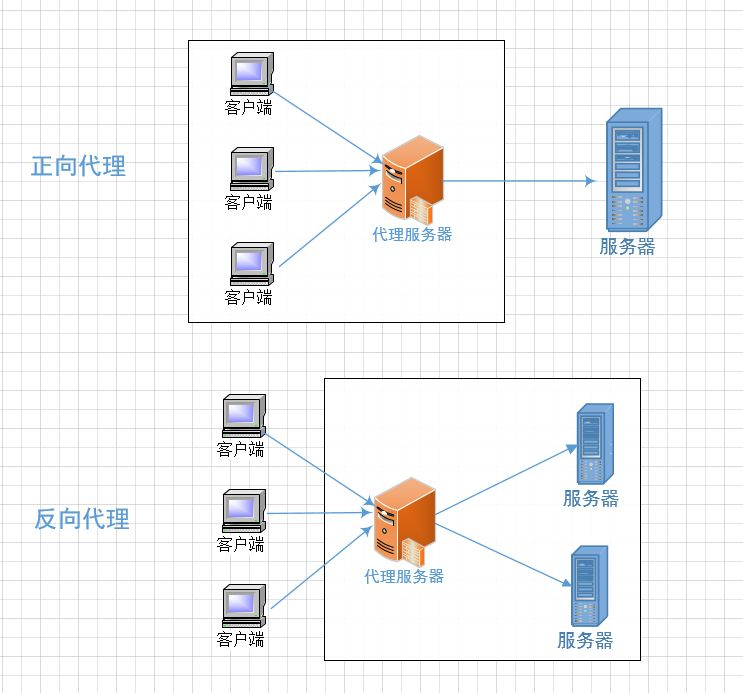

```### 此资源由 58学课资源站 收集整理 ###
	想要获取完整课件资料 请访问：58xueke.com
	百万资源 畅享学习

```


### **1、什么是Nginx，谈谈个人都理解，项目中是否用到，为什么要用，有什么优点？**

Nginx ，是一个 Web 服务器和反向代理服务器用于 HTTP、HTTPS、SMTP、POP3 和 IMAP 协议。

主要功能如下：

1、正向、反向代理 2、负载均衡、分流 3、虚拟主机（绑定host）

优点：

跨平台、配置简单，非阻塞、高并发连接、内存消耗小、成本低廉。


### **2、正向代理和反向代理的区别是什么？**




**正向代理**是一个位于客户端和原始服务器之间的服务器，为了从原始服务器取得内容，客户端向代理发送一个请求并指定原始服务器，然后代理向原始服务器转交请求并将获得的内容返回给客户端。代理服务器和客户端处于同一个局域网内。

比如说fanqiang。我知道我要访问谷歌，于是我就告诉代理服务器让它帮我转发。

**反向代理**实际运行方式是代理服务器接受网络上的连接请求。它将请求转发给内部网络上的服务器，并将从服务器上得到的结果返回给网络上请求连接的客户端 。代理服务器和原始服务器处于同一个局域网内。

比如说我要访问taobao，对我来说不知道图片、json、css 是不是同一个服务器返回回来的，但是我不关心，是反向代理 处理的，我不知道原始服务器。


### **3、Nginx如何处理HTTP请求的？**

它结合多进程机制（单线程）和异步非阻塞方式。

1、多进程机制（单线程）

服务器每当收到一个客户端时，就有 服务器主进程 （ master process ）生成一个 子进程（ worker process ）出来和客户端建立连接进行交互，直到连接断开，该子进程就结束了。

2、异步非阻塞机制

每个工作进程 使用 异步非阻塞方式 ，可以处理 多个客户端请求 。 运用了epoll模型，提供了一个队列，排队解决。

当某个 工作进程 接收到客户端的请求以后，调用 IO 进行处理，如果不能立即得到结果，就去 处理其他请求 （即为 非阻塞 ）；而 客户端 在此期间也 无需等待响应 ，可以去处理其他事情（即为 异步 ）。

当 IO 返回时，就会通知此 工作进程 ；该进程得到通知，暂时 挂起 当前处理的事务去 响应客户端请求 。

```
官网资料
为什么nginx高性能
http://www.aosabook.org/en/nginx.html
```


### **4、Nginx的master和worker是如何工作的？**

这跟Nginx的多进程、单线程有关。（一个进程只有一个主线程）。

**为什么要用单线程？**

采用单线程来异步非阻塞处理请求（管理员可以配置Nginx主进程的工作进程的数量），不会为每个请求分配cpu和内存资源，节省了大量资源，同时也减少了大量的CPU的上下文切换，所以才使得Nginx支持更高的并发。

**简单过程：**

主程序 Master process 启动后，通过一个 for 循环来 接收 和 处理外部信号 ；

主进程通过 fork() 函数产生 worker 子进程 ，每个子进程执行一个 for循环来实现Nginx服务器对事件的接收和处理 。


**详细过程：**

1、Nginx 在启动后，会有一个 master 进程和多个相互独立的 worker 进程。 2、master 接收来自外界的信号，先建立好需要 listen 的 socket（listenfd） 之后，然后再 fork 出多个 worker 进程，然后向各worker进程发送信号，每个进程都有可能来处理这个连接。 3、所有 worker 进程的 listenfd 会在新连接到来时变得可读 ，为保证只有一个进程处理该连接，所有 worker 进程在注册 listenfd 读事件前抢占 accept_mutex ，抢到互斥锁的那个进程注册 listenfd 读事件 ，在读事件里调用 accept 接受该连接。 4、当一个 worker 进程在 accept 这个连接之后，就开始读取请求、解析请求、处理请求，产生数据后，再返回给客户端 ，最后才断开连接。


### **5、Nginx 常用命令有哪些？**

- 启动 `nginx` 。
- 停止 `nginx -s stop` 或 `nginx -s quit` 。
- 重启 `nginx -s reload` 或 `service nginx reload` 。
- 重载指定配置文件 `.nginx -c /usr/local/nginx/conf/nginx.conf` 。
- 查看 nginx 版本 `nginx -v` 。


### **6、nginx中500、502、503、504 有什么区别？**

**500**：

Internal Server Error 内部服务错误，比如脚本错误，编程语言语法错误。

**502**：

Bad Gateway错误，网关错误。比如服务器当前连接太多，响应太慢，页面素材太多、带宽慢。

**503**：

Service Temporarily Unavailable，服务不可用，web服务器不能处理HTTP请求，可能是临时超载或者是服务器进行停机维护。

**504**：

Gateway timeout 网关超时，程序执行时间过长导致响应超时，例如程序需要执行20秒，而nginx最大响应等待时间为10秒，这样就会出现超时。


### **7、Nginx 压缩了解吗，如何开启压缩？**

开启nginx gzip压缩后，图片、css、js等静态资源的大小会减小，可节省带宽，提高传输效率，但是会消耗CPU资源。

开启：

```text
    # 开启gzip
    gzip off;

    # 启用gzip压缩的最小文件，小于设置值的文件将不会压缩
    gzip_min_length 1k;

    # gzip 压缩级别，1-9，数字越大压缩的越好，也越占用CPU时间，后面会有详细说明
    gzip_comp_level 1;

    # 进行压缩的文件类型。javascript有多种形式。其中的值可以在 mime.types 文件中找到。
    gzip_types text/plain application/javascript application/x-javascript text/css application/xml text/javascript application/x-httpd-php image/jpeg image/gif image/png application/vnd.ms-fontobject font/ttf font/opentype font/x-woff image/svg+xml;

```


### **8、Nginx 和 Apache、Tomcat 之间的不同点**

1、Nginx/Apache 是Web Server,而Apache Tomact是一个servlet container 2、tomcat可以对jsp进行解析，nginx和apache只是web服务器，可以简单理解为只能提供html静态文件服务。


Nginx和Apache区别：

1）Nginx轻量级，同样起web 服务，比apache占用更少的内存及资源 。

2）Nginx 抗并发，nginx 处理请求是异步非阻塞的，而apache 则是阻塞型的，在高并发下nginx 能保持低资源低消耗高性能 。

3）Nginx提供负载均衡，可以做做反向代理，前端服务器

4）Nginx多进程单线程，异步非阻塞；Apache多进程同步，阻塞。


### **9、Nginx 有哪些负载均衡策略**

Nginx 默认提供的负载均衡策略：

- 1、轮询（默认）round_robin
  每个请求按时间顺序逐一分配到不同的后端服务器，如果后端服务器 down 掉，能自动剔除。
- 2、IP 哈希 ip_hash
  每个请求按访问 ip 的 hash 结果分配，这样每个访客固定访问一个后端服务器，可以解决 session 共享的问题。
  当然，实际场景下，一般不考虑使用 ip_hash 解决 session 共享。
- 3、最少连接 least_conn
  下一个请求将被分派到活动连接数量最少的服务器
- 4、权重 weight
  weight的值越大分配到的访问概率越高，主要用于后端每台服务器性能不均衡的情况下，达到合理的资源利用率。

还可以通过插件支持其他策略。


### **10、Nginx动静态资源分离做过吗，为什么要这样做？**

动态资源、静态资源分离，是让动态网站里的动态网页根据一定规则把不变的资源和经常变的资源区分开来 路。

比如说 js、css、hrml从A服务器返回。图片 从B服务器返回，其他请求从Tomcat服务器C返回。

后台应用分开部署，提高用户访问静态代码的速度。而且现在还有CDN服务，不需要限制于服务器的带宽。


### **11、ngx_http_upstream_module模块了解吗？**

ngx_http_upstream_module模块用于将多个服务器定义成服务器组，可通过fastcgi传递、proxy传递、uwsgi传递、memcached传递和scgi传递指令来引用的服务器组。

比如访问www.a.com缓存+调度：

```text
http{
    proxy_cache_path /var/cache/nginx/proxy_cache levels=1:2:2 keys_zone=proxycache:20m inactive=120s max_si #缓存
ze=1g;
    upstream mysqlsrvs{
        ip_hash; #源地址hash调度方法 写了backup就不可用
        server 172.18.99.1:80 weight=2; #weight权重
        server 172.18.99.2:80;          #标记down，配合ip_hash使用，实现灰度发布
        server 172.18.99.3:80 backup;   #backup将服务器标记为“备用”，即所有服务器均不可用时才启用 
    }
}
server{
    server_name www.yuchaoit..cn;
    proxy_cache proxycache;
    proxy_cache_key $request_uri;
    proxy_cache_valid 200 302 301 1h;
    proxy_cache_valid any 1m;
    location / {
        proxy_pass http://mysqlsrvs;
    }
}
```


### **12、限流了解吗，怎么限流的？**

Nginx 提供两种限流方式，一是控制速率，二是控制并发连接数。


### **1、控制速率**

`ngx_http_limit_req_module` 模块提供了漏桶算法(leaky bucket)，可以限制单个IP的请求处理频率。

如：

**1.1 正常限流：**

```text
http {
limit_req_zone 192.168.1.1 zone=myLimit:10m rate=5r/s;
}

server {
location / {
limit_req zone=myLimit;
rewrite / http://www.hac.cn permanent;
}
}
```

参数解释：

```text
key: 定义需要限流的对象。
zone: 定义共享内存区来存储访问信息。
rate: 用于设置最大访问速率。
```

表示基于客户端192.168.1.1进行限流，定义了一个大小为10M，名称为myLimit的内存区，用于存储IP地址访问信息。rate设置IP访问频率，rate=5r/s表示每秒只能处理每个IP地址的5个请求。Nginx限流是按照毫秒级为单位的，也就是说1秒处理5个请求会变成每200ms只处理一个请求。如果200ms内已经处理完1个请求，但是还是有有新的请求到达，这时候Nginx就会拒绝处理该请求。

**1.2 突发流量限制访问频率**

上面rate设置了 5r/s，如果有时候流量突然变大，超出的请求就被拒绝返回503了，突发的流量影响业务就不好了。

这时候可以加上**burst** 参数，一般再结合 **nodelay** 一起使用。

```text
server {
location / {
limit_req zone=myLimit burst=20 nodelay;
rewrite / http://www.hac.cn permanent;
}
}
```

`burst=20 nodelay` 表示这20个请求立马处理，不能延迟，相当于特事特办。不过，即使这20个突发请求立马处理结束，后续来了请求也不会立马处理。burst=20 相当于缓存队列中占了20个坑，即使请求被处理了，这20个位置这只能按 100ms一个来释放。

### **2、控制并发连接数**

`ngx_http_limit_conn_module` 提供了限制连接数功能。

```text
limit_conn_zone $binary_remote_addr zone=perip:10m;
limit_conn_zone $server_name zone=perserver:10m;

server {
    ...
    limit_conn perip 10;
    limit_conn perserver 100;
}
```


limit_conn perip 10 作用的key 是 $binary_remote_addr，表示限制单个IP同时最多能持有10个连接。

limit_conn perserver 100 作用的key是 $server_name，表示虚拟主机(server) 同时能处理并发连接的总数。

> 注：**limit_conn perserver 100** 作用的key是 **$server_name**，表示虚拟主机(server) 同时能处理并发连接的总数。


### **拓展：**

如果不想做限流，还可以设置白名单：

利用 Nginx `ngx_http_geo_module` 和 `ngx_http_map_module` 两个工具模块提供的功能。

```text
##定义白名单ip列表变量
geo $limit {
    default 1;
    10.0.0.0/8 0;
    192.168.0.0/10 0;
    81.56.0.35 0;
}

map $limit $limit_key {
    0 "";
    1 $binary_remote_addr;
}
# 正常限流设置
limit_req_zone $limit_key zone=myRateLimit:10m rate=10r/s;
```

**geo** 对于白名单 将返回0，不限流；其他IP将返回1，进行限流。

具体参考：[http://nginx.org/en/docs/http/ngx_http_geo_module.html](https://link.zhihu.com/?target=http%3A//nginx.org/en/docs/http/ngx_http_geo_module.html)


除此之外：

`ngx_http_core_module` 还提供了限制数据传输速度的能力(即常说的下载速度)

```text
location /flv/ {
    flv;
    limit_rate_after 500m;
    limit_rate       50k;
}
```

针对每个请求，表示客户端下载前500m的大小时不限速，下载超过了500m后就限速50k/s。